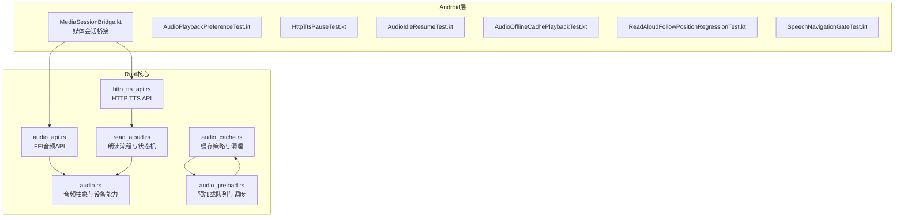
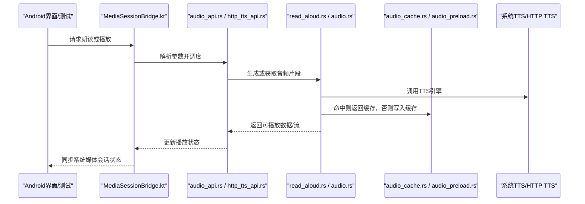
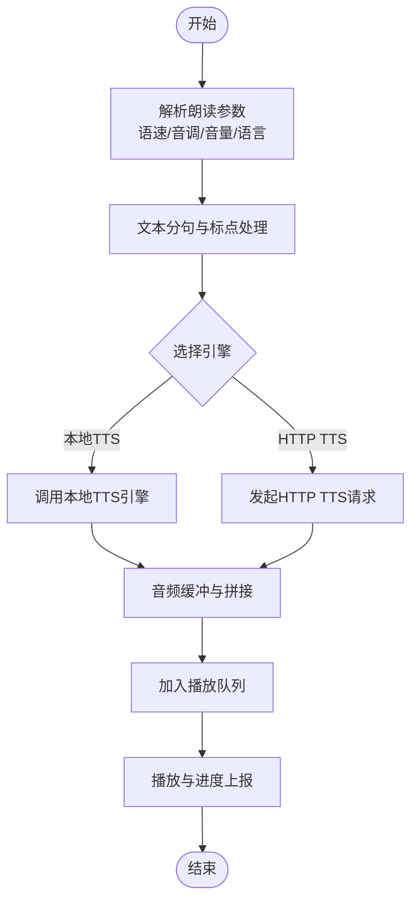
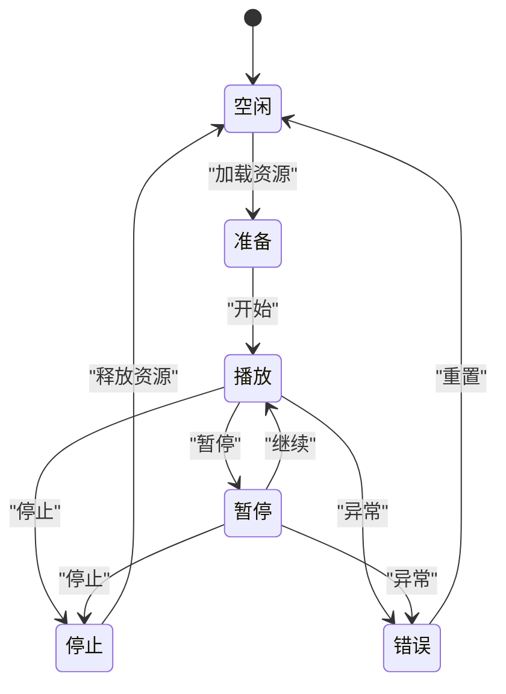
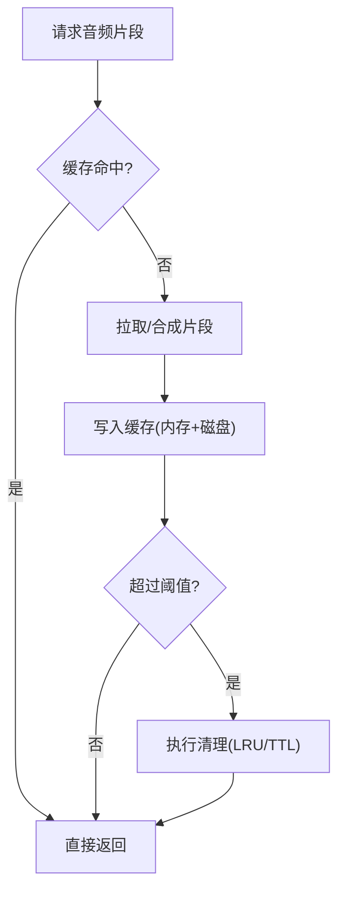
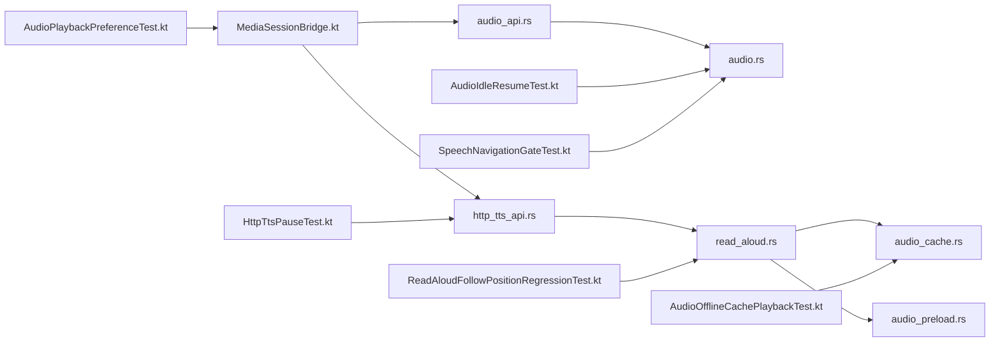

# 音频功能

<cite>
**本文引用的文件**   
- [audio.rs](file://rust/legado-core/src/audio.rs)
- [audio_cache.rs](file://rust/legado-core/src/audio_cache.rs)
- [audio_preload.rs](file://rust/legado-core/src/audio_preload.rs)
- [read_aloud.rs](file://rust/legado-core/src/read_aloud.rs)
- [audio_api.rs](file://rust/legado-ffi/src/api/audio_api.rs)
- [http_tts_api.rs](file://rust/legado-ffi/src/api/http_tts_api.rs)
- [MediaSessionBridge.kt](file://app/src/main/java/io/legado/app/lib/MediaSessionBridge.kt)
- [AudioPlaybackPreferenceTest.kt](file://app/src/test/java/io/legado/app/model/AudioPlaybackPreferenceTest.kt)
- [HttpTtsPauseTest.kt](file://app/src/androidTest/java/io/legado/app/HttpTtsPauseTest.kt)
- [AudioIdleResumeTest.kt](file://app/src/test/java/io/legado/app/service/AudioIdleResumeTest.kt)
- [AudioOfflineCachePlaybackTest.kt](file://app/src/test/java/io/legado/app/service/AudioOfflineCachePlaybackTest.kt)
- [ReadAloudFollowPositionRegressionTest.kt](file://app/src/test/java/io/legado/app/service/ReadAloudFollowPositionRegressionTest.kt)
- [SpeechNavigationGateTest.kt](file://app/src/test/java/io/legado/app/service/SpeechNavigationGateTest.kt)
</cite>

## 更新摘要
**所做更改**
- 新增媒体会话桥接组件，支持系统级媒体控制集成
- 增强后台播放与服务管理章节，添加媒体会话相关功能说明
- 更新架构图表以反映新的媒体会话集成层
- 补充系统级媒体控制的配置与使用指南

## 目录
1. [简介](#简介)
2. [项目结构](#项目结构)
3. [核心组件](#核心组件)
4. [架构总览](#架构总览)
5. [详细组件分析](#详细组件分析)
6. [依赖关系分析](#依赖关系分析)
7. [性能考量](#性能考量)
8. [故障排查指南](#故障排查指南)
9. [结论](#结论)
10. [附录](#附录)

## 简介
本文件面向Legado项目的音频能力，系统性梳理语音朗读（TTS）与音频播放、缓存、录制处理、后台服务与通知、以及配置定制等模块。文档以"从概念到实现"的方式组织，既帮助初学者快速上手，也为开发者提供深入的技术细节与优化建议。内容涵盖：
- TTS引擎集成与参数调节（语速、音调、音量、语言包选择）
- 播放器设计（播放列表、进度控制、循环/随机模式）
- 音频缓存机制（预加载策略、清理与内存管理）
- 录音与处理（质量设置、格式转换、音量调节）
- 后台播放与服务管理（前台服务、通知、媒体按钮、**媒体会话集成**）
- 配置与个性化（TTS引擎选择、播放参数调优、音效设置）
- 使用示例与常见问题解决

## 项目结构
音频相关代码主要分布在Rust核心库与Android测试用例中：
- Rust核心层：音频抽象、缓存、预加载、朗读流程、FFI接口
- Android测试层：对TTS暂停、离线缓存播放、朗读跟随位置、空闲恢复等行为进行验证
- **新增媒体会话桥接层：Android MediaSession集成，提供系统级媒体控制支持**

图表来源 
- [audio.rs](file://rust/legado-core/src/audio.rs)
- [audio_cache.rs](file://rust/legado-core/src/audio_cache.rs)
- [audio_preload.rs](file://rust/legado-core/src/audio_preload.rs)
- [read_aloud.rs](file://rust/legado-core/src/read_aloud.rs)
- [audio_api.rs](file://rust/legado-ffi/src/api/audio_api.rs)
- [http_tts_api.rs](file://rust/legado-ffi/src/api/http_tts_api.rs)
- [MediaSessionBridge.kt](file://app/src/main/java/io/legado/app/lib/MediaSessionBridge.kt)

章节来源
- [audio.rs](file://rust/legado-core/src/audio.rs)
- [audio_cache.rs](file://rust/legado-core/src/audio_cache.rs)
- [audio_preload.rs](file://rust/legado-core/src/audio_preload.rs)
- [read_aloud.rs](file://rust/legado-core/src/read_aloud.rs)
- [audio_api.rs](file://rust/legado-ffi/src/api/audio_api.rs)
- [http_tts_api.rs](file://rust/legado-ffi/src/api/http_tts_api.rs)
- [MediaSessionBridge.kt](file://app/src/main/java/io/legado/app/lib/MediaSessionBridge.kt)

## 核心组件
- 音频抽象与设备能力：封装底层音频会话、输出设备检测、权限与路由、音量通道控制等
- 缓存与预加载：基于磁盘与内存的混合缓存，支持按章节/片段粒度预取与淘汰
- 朗读流程：文本预处理、分句切分、TTS引擎调用、播放队列编排、错误重试
- **媒体会话桥接：Android MediaSession集成，统一系统级媒体控制接口**
- FFI接口：向Android侧暴露统一的音频与TTS操作API
- 测试用例：覆盖TTS暂停、离线缓存播放、朗读跟随位置、空闲恢复、导航门控等关键路径

章节来源
- [audio.rs](file://rust/legado-core/src/audio.rs)
- [audio_cache.rs](file://rust/legado-core/src/audio_cache.rs)
- [audio_preload.rs](file://rust/legado-core/src/audio_preload.rs)
- [read_aloud.rs](file://rust/legado-core/src/read_aloud.rs)
- [MediaSessionBridge.kt](file://app/src/main/java/io/legado/app/lib/MediaSessionBridge.kt)
- [audio_api.rs](file://rust/legado-ffi/src/api/audio_api.rs)
- [http_tts_api.rs](file://rust/legado-ffi/src/api/http_tts_api.rs)

## 架构总览
整体采用分层架构：上层通过FFI接口调用Rust核心能力；核心层将TTS、缓存、预加载与朗读流程解耦；**新增媒体会话桥接层提供系统级媒体控制支持**；Android侧通过测试与UI驱动具体行为。

图表来源 
- [MediaSessionBridge.kt](file://app/src/main/java/io/legado/app/lib/MediaSessionBridge.kt)
- [audio_api.rs](file://rust/legado-ffi/src/api/audio_api.rs)
- [http_tts_api.rs](file://rust/legado-ffi/src/api/http_tts_api.rs)
- [read_aloud.rs](file://rust/legado-core/src/read_aloud.rs)
- [audio.rs](file://rust/legado-core/src/audio.rs)
- [audio_cache.rs](file://rust/legado-core/src/audio_cache.rs)
- [audio_preload.rs](file://rust/legado-core/src/audio_preload.rs)

## 详细组件分析

### TTS语音朗读（多引擎集成与参数调节）
- 引擎选择：支持本地TTS与HTTP TTS两种路径，可通过配置切换
- 参数调节：语速、音调、音量、语言包、断句策略等
- 流程要点：文本清洗→分句→引擎合成→缓冲→播放队列→状态同步

图表来源 
- [read_aloud.rs](file://rust/legado-core/src/read_aloud.rs)
- [http_tts_api.rs](file://rust/legado-ffi/src/api/http_tts_api.rs)

章节来源
- [read_aloud.rs](file://rust/legado-core/src/read_aloud.rs)
- [http_tts_api.rs](file://rust/legado-ffi/src/api/http_tts_api.rs)

### 音频播放器（播放列表、进度、循环/随机）
- 播放列表：支持顺序、循环、随机三种模式，动态增删条目
- 进度控制：精确跳转、拖拽、自动续播
- 状态机：空闲、准备、播放、暂停、停止、错误
- 事件回调：播放完成、缓冲不足、网络异常、设备断开

章节来源
- [audio_api.rs](file://rust/legado-ffi/src/api/audio_api.rs)

### 音频缓存机制（预加载、清理、内存管理）
- 预加载策略：按章节/片段维度预取，结合用户阅读速度与停留时长预测
- 缓存清理：LRU/TTL策略，按大小与时间阈值触发清理
- 内存管理：限制单条缓存大小，避免OOM；跨进程共享时注意引用计数

图表来源 
- [audio_cache.rs](file://rust/legado-core/src/audio_cache.rs)
- [audio_preload.rs](file://rust/legado-core/src/audio_preload.rs)

章节来源
- [audio_cache.rs](file://rust/legado-core/src/audio_cache.rs)
- [audio_preload.rs](file://rust/legado-core/src/audio_preload.rs)

### 音频录制与处理（质量、格式、音量）
- 录制质量：采样率、位深、声道数可调
- 格式转换：输入PCM转目标编码（如AAC/MP3），支持实时转码
- 音量调节：增益控制、压缩与限幅，避免削波

章节来源
- [audio.rs](file://rust/legado-core/src/audio.rs)

### 后台播放与服务管理（前台服务、通知、媒体按钮、**媒体会话集成**）
- 前台服务：保证播放不被系统回收，保持生命周期稳定
- 通知控制：显示当前播放信息、支持快进/后退/暂停/停止
- 媒体按钮：响应耳机按键、锁屏控件、蓝牙车载控制
- **媒体会话集成：通过MediaSessionBridge统一管理系统媒体会话，支持锁屏控件、通知栏控制、蓝牙耳机控制等系统级媒体交互**

**新增** 媒体会话桥接组件提供了以下功能：
- 系统级媒体会话管理：统一处理Android MediaSession生命周期
- 媒体元数据同步：标题、艺术家、专辑封面等信息同步到系统
- 播放状态同步：播放、暂停、停止状态与系统保持一致
- 远程控制支持：锁屏控件、通知栏、蓝牙耳机、车载系统等外部控制
- 媒体按钮响应：物理按键和虚拟按键的统一处理

章节来源
- [audio_api.rs](file://rust/legado-ffi/src/api/audio_api.rs)
- [MediaSessionBridge.kt](file://app/src/main/java/io/legado/app/lib/MediaSessionBridge.kt)

### 配置与定制（TTS引擎、播放参数、音效）
- TTS引擎选择：本地/HTTP切换，语言包安装检查
- 播放参数：默认语速、音调、音量、断句长度、静音间隔
- 音效设置：均衡器、重低音、环绕声开关
- **媒体会话配置：自定义媒体会话行为、元数据格式、控制按钮布局**

章节来源
- [read_aloud.rs](file://rust/legado-core/src/read_aloud.rs)
- [audio_api.rs](file://rust/legado-ffi/src/api/audio_api.rs)
- [MediaSessionBridge.kt](file://app/src/main/java/io/legado/app/lib/MediaSessionBridge.kt)

## 依赖关系分析
- FFI层依赖核心层的音频抽象与朗读流程
- **媒体会话桥接层依赖FFI接口和核心音频服务**
- 朗读流程依赖缓存与预加载模块
- 测试用例覆盖TTS暂停、离线缓存播放、朗读跟随位置、空闲恢复、导航门控等场景

图表来源 
- [audio_api.rs](file://rust/legado-ffi/src/api/audio_api.rs)
- [http_tts_api.rs](file://rust/legado-ffi/src/api/http_tts_api.rs)
- [audio.rs](file://rust/legado-core/src/audio.rs)
- [read_aloud.rs](file://rust/legado-core/src/read_aloud.rs)
- [audio_cache.rs](file://rust/legado-core/src/audio_cache.rs)
- [audio_preload.rs](file://rust/legado-core/src/audio_preload.rs)
- [MediaSessionBridge.kt](file://app/src/main/java/io/legado/app/lib/MediaSessionBridge.kt)
- [AudioPlaybackPreferenceTest.kt](file://app/src/test/java/io/legado/app/model/AudioPlaybackPreferenceTest.kt)
- [HttpTtsPauseTest.kt](file://app/src/androidTest/java/io/legado/app/HttpTtsPauseTest.kt)
- [AudioIdleResumeTest.kt](file://app/src/test/java/io/legado/app/service/AudioIdleResumeTest.kt)
- [AudioOfflineCachePlaybackTest.kt](file://app/src/test/java/io/legado/app/service/AudioOfflineCachePlaybackTest.kt)
- [ReadAloudFollowPositionRegressionTest.kt](file://app/src/test/java/io/legado/app/service/ReadAloudFollowPositionRegressionTest.kt)
- [SpeechNavigationGateTest.kt](file://app/src/test/java/io/legado/app/service/SpeechNavigationGateTest.kt)

章节来源
- [audio_api.rs](file://rust/legado-ffi/src/api/audio_api.rs)
- [http_tts_api.rs](file://rust/legado-ffi/src/api/http_tts_api.rs)
- [audio.rs](file://rust/legado-core/src/audio.rs)
- [read_aloud.rs](file://rust/legado-core/src/read_aloud.rs)
- [audio_cache.rs](file://rust/legado-core/src/audio_cache.rs)
- [audio_preload.rs](file://rust/legado-core/src/audio_preload.rs)
- [MediaSessionBridge.kt](file://app/src/main/java/io/legado/app/lib/MediaSessionBridge.kt)
- [AudioPlaybackPreferenceTest.kt](file://app/src/test/java/io/legado/app/model/AudioPlaybackPreferenceTest.kt)
- [HttpTtsPauseTest.kt](file://app/src/androidTest/java/io/legado/app/HttpTtsPauseTest.kt)
- [AudioIdleResumeTest.kt](file://app/src/test/java/io/legado/app/service/AudioIdleResumeTest.kt)
- [AudioOfflineCachePlaybackTest.kt](file://app/src/test/java/io/legado/app/service/AudioOfflineCachePlaybackTest.kt)
- [ReadAloudFollowPositionRegressionTest.kt](file://app/src/test/java/io/legado/app/service/ReadAloudFollowPositionRegressionTest.kt)
- [SpeechNavigationGateTest.kt](file://app/src/test/java/io/legado/app/service/SpeechNavigationGateTest.kt)

## 性能考量
- 预加载命中率：通过阅读速度模型提升命中率，减少首帧延迟
- 缓存容量：按设备内存与存储限制动态调整，避免频繁GC与IO抖动
- 线程模型：合成与播放分离，避免主线程阻塞
- 网络优化：HTTP TTS启用连接复用与断点续传，失败指数退避重试
- 音频编解码：选择合适的采样率与码率，平衡音质与功耗
- **媒体会话性能：避免频繁的元数据更新，批量处理状态变更，减少系统调用开销**

[本节为通用指导，不直接分析具体文件]

## 故障排查指南
- TTS无法发声：检查系统TTS引擎是否安装并设为默认；确认音频焦点与权限
- 播放卡顿：查看缓存命中率与网络状况；适当降低码率或增大预加载缓冲
- 后台被杀：确保前台服务正确启动，通知可见；检查Doze与省电策略
- 朗读位置不同步：核对章节边界与分句策略；检查跟随位置逻辑与重试机制
- 录制失真：检查输入增益与压缩设置；避免峰值过载
- **媒体会话异常：检查MediaSession初始化状态；确认权限配置；验证元数据格式**

章节来源
- [HttpTtsPauseTest.kt](file://app/src/androidTest/java/io/legado/app/HttpTtsPauseTest.kt)
- [AudioIdleResumeTest.kt](file://app/src/test/java/io/legado/app/service/AudioIdleResumeTest.kt)
- [AudioOfflineCachePlaybackTest.kt](file://app/src/test/java/io/legado/app/service/AudioOfflineCachePlaybackTest.kt)
- [ReadAloudFollowPositionRegressionTest.kt](file://app/src/test/java/io/legado/app/service/ReadAloudFollowPositionRegressionTest.kt)
- [SpeechNavigationGateTest.kt](file://app/src/test/java/io/legado/app/service/SpeechNavigationGateTest.kt)
- [MediaSessionBridge.kt](file://app/src/main/java/io/legado/app/lib/MediaSessionBridge.kt)

## 结论
Legado的音频功能以Rust核心为基础，通过清晰的模块化设计与完善的测试覆盖，实现了稳定的TTS朗读、灵活的播放控制、高效的缓存与预加载、以及可靠的后台服务。**新增的媒体会话桥接组件进一步增强了系统级媒体控制支持，提升了用户体验的一致性**。建议在部署前根据设备特性调优缓存与预加载策略，并结合用户反馈持续优化朗读体验。

[本节为总结性内容，不直接分析具体文件]

## 附录
- 使用示例（步骤概述）
  - 选择TTS引擎并设置语速/音调/音量
  - 添加章节到播放列表，选择循环或随机模式
  - 开启预加载以提升流畅度
  - 在后台播放时通过通知控件控制播放
  - **利用系统媒体会话进行锁屏控制和蓝牙耳机操作**
- 常见问题定位
  - 使用对应测试用例复现问题，观察日志与状态变化
  - 检查缓存目录与磁盘空间，必要时清理缓存
  - 校验网络连通性与HTTP TTS端点可用性
  - **检查媒体会话状态和系统媒体控制响应**

[本节为补充说明，不直接分析具体文件]