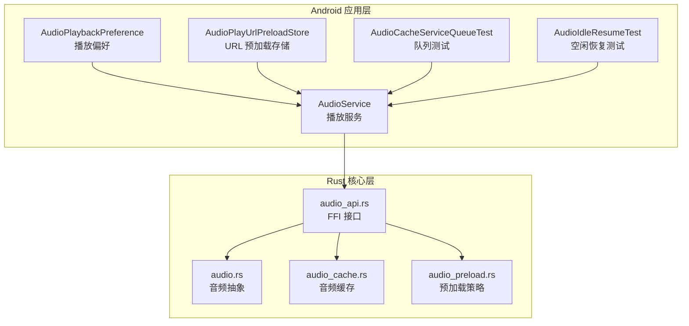
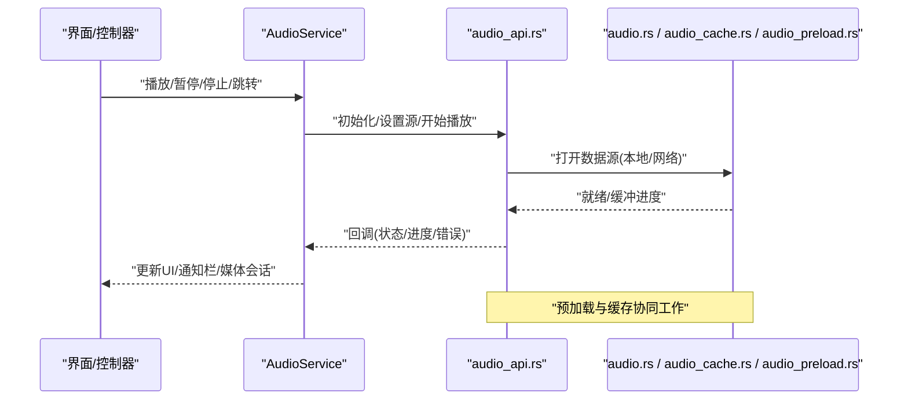
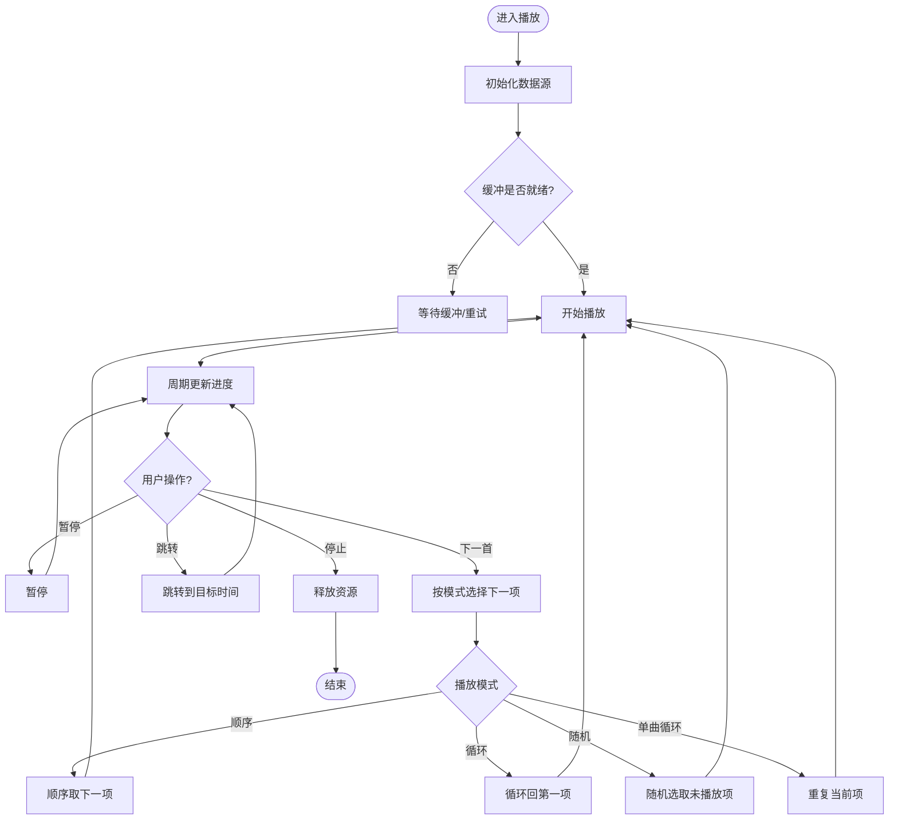
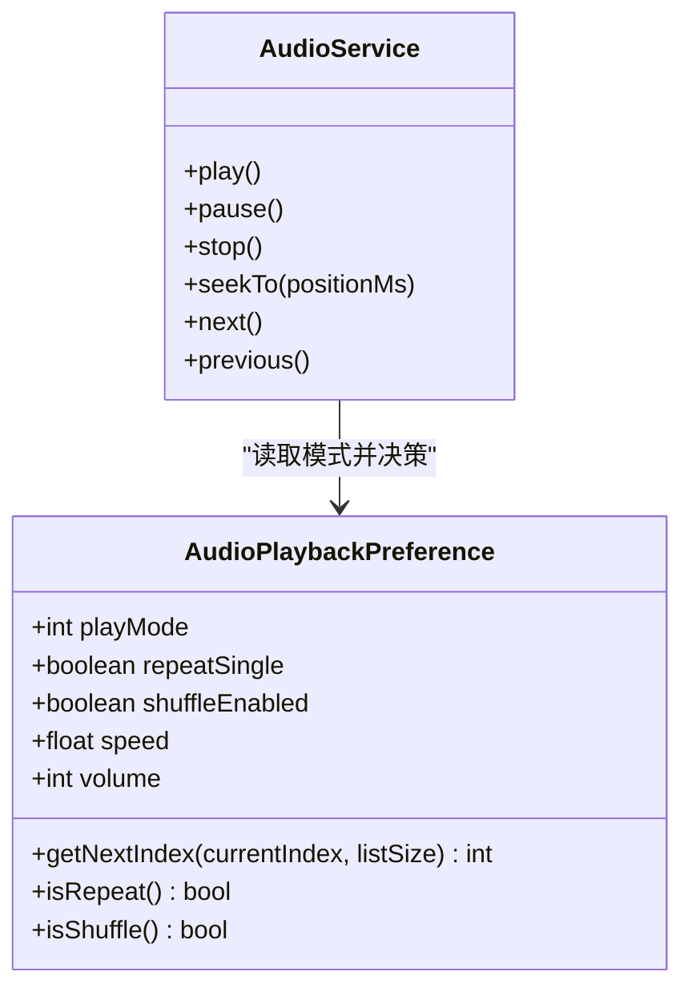
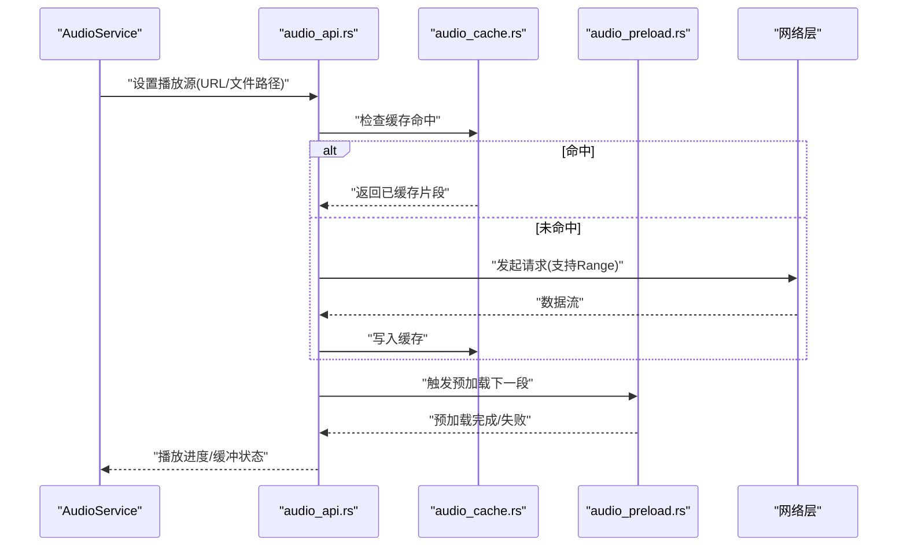
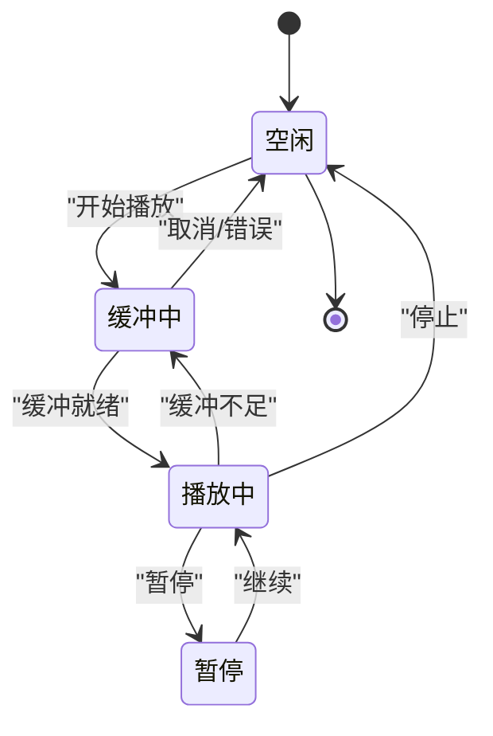
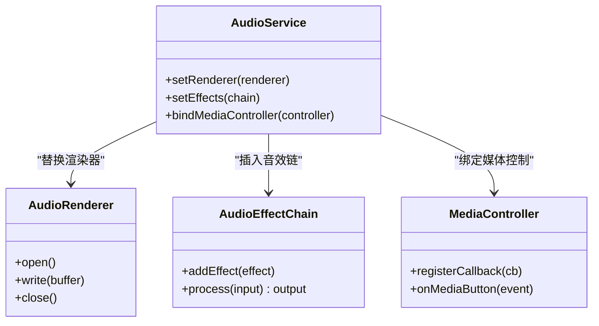
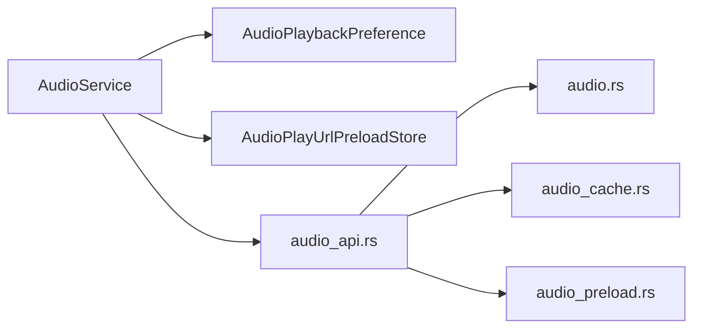

# 音频播放器

<cite>
**本文引用的文件**   
- [app/src/main/java/io/legado/app/service/AudioService.kt](file://app/src/main/java/io/legado/app/service/AudioService.kt)
- [app/src/main/java/io/legado/app/model/AudioPlaybackPreference.kt](file://app/src/main/java/io/legado/app/model/AudioPlaybackPreference.kt)
- [app/src/main/java/io/legado/app/model/AudioPlayUrlPreloadStore.kt](file://app/src/main/java/io/legado/app/model/AudioPlayUrlPreloadStore.kt)
- [rust/legado-core/src/audio.rs](file://rust/legado-core/src/audio.rs)
- [rust/legado-core/src/audio_cache.rs](file://rust/legado-core/src/audio_cache.rs)
- [rust/legado-core/src/audio_preload.rs](file://rust/legado-core/src/audio_preload.rs)
- [rust/legado-ffi/src/api/audio_api.rs](file://rust/legado-ffi/src/api/audio_api.rs)
- [app/src/test/java/io/legado/app/model/AudioPlaybackPreferenceTest.kt](file://app/src/test/java/io/legado/app/model/AudioPlaybackPreferenceTest.kt)
- [app/src/test/java/io/legado/app/model/AudioPlayUrlPreloadStoreTest.kt](file://app/src/test/java/io/legado/app/model/AudioPlayUrlPreloadStoreTest.kt)
- [app/src/test/java/io/legado/app/service/AudioCacheServiceQueueTest.kt](file://app/src/test/java/io/legado/app/service/AudioCacheServiceQueueTest.kt)
- [app/src/test/java/io/legado/app/service/AudioIdleResumeTest.kt](file://app/src/test/java/io/legado/app/service/AudioIdleResumeTest.kt)
</cite>

## 目录
1. [简介](#简介)
2. [项目结构](#项目结构)
3. [核心组件](#核心组件)
4. [架构总览](#架构总览)
5. [详细组件分析](#详细组件分析)
6. [依赖关系分析](#依赖关系分析)
7. [性能考量](#性能考量)
8. [故障排查指南](#故障排查指南)
9. [结论](#结论)
10. [附录](#附录)

## 简介
本文件面向 Legado 项目中的音频播放子系统，系统性梳理播放控制、进度管理、播放列表与播放模式、音频流处理（本地与网络）、状态管理与异常恢复、扩展接口等关键能力。文档以“由浅入深”的方式组织内容，既适合初次接触该模块的开发者快速上手，也便于资深工程师进行优化与二次开发。

## 项目结构
音频播放相关代码横跨 Android 应用层与 Rust 核心层：
- Android 应用层负责 UI 交互、服务生命周期、队列与缓存调度、偏好设置与测试用例。
- Rust 核心层提供跨平台的音频抽象、缓存与预加载策略，并通过 FFI 暴露给上层调用。

**图表来源** 
- [app/src/main/java/io/legado/app/service/AudioService.kt](file://app/src/main/java/io/legado/app/service/AudioService.kt)
- [app/src/main/java/io/legado/app/model/AudioPlaybackPreference.kt](file://app/src/main/java/io/legado/app/model/AudioPlaybackPreference.kt)
- [app/src/main/java/io/legado/app/model/AudioPlayUrlPreloadStore.kt](file://app/src/main/java/io/legado/app/model/AudioPlayUrlPreloadStore.kt)
- [rust/legado-core/src/audio.rs](file://rust/legado-core/src/audio.rs)
- [rust/legado-core/src/audio_cache.rs](file://rust/legado-core/src/audio_cache.rs)
- [rust/legado-core/src/audio_preload.rs](file://rust/legado-core/src/audio_preload.rs)
- [rust/legado-ffi/src/api/audio_api.rs](file://rust/legado-ffi/src/api/audio_api.rs)

**章节来源**
- [app/src/main/java/io/legado/app/service/AudioService.kt](file://app/src/main/java/io/legado/app/service/AudioService.kt)
- [app/src/main/java/io/legado/app/model/AudioPlaybackPreference.kt](file://app/src/main/java/io/legado/app/model/AudioPlaybackPreference.kt)
- [app/src/main/java/io/legado/app/model/AudioPlayUrlPreloadStore.kt](file://app/src/main/java/io/legado/app/model/AudioPlayUrlPreloadStore.kt)
- [rust/legado-core/src/audio.rs](file://rust/legado-core/src/audio.rs)
- [rust/legado-core/src/audio_cache.rs](file://rust/legado-core/src/audio_cache.rs)
- [rust/legado-core/src/audio_preload.rs](file://rust/legado-core/src/audio_preload.rs)
- [rust/legado-ffi/src/api/audio_api.rs](file://rust/legado-ffi/src/api/audio_api.rs)

## 核心组件
- 播放服务（AudioService）：承载播放生命周期、媒体会话、通知栏控制、播放队列与状态同步。
- 播放偏好（AudioPlaybackPreference）：集中管理播放模式（顺序、循环、随机、单曲循环）、音量、倍速、自动下一首等配置。
- URL 预加载存储（AudioPlayUrlPreloadStore）：对即将播放的网络资源进行预取与缓存，降低首帧延迟与卡顿。
- Rust 音频抽象（audio.rs）：统一的音频解码/渲染抽象，屏蔽平台差异。
- 音频缓存（audio_cache.rs）：磁盘/内存混合缓存策略，支持断点续播与失败重试。
- 预加载策略（audio_preload.rs）：基于队列与阈值的预取算法，平衡带宽与内存占用。
- FFI 接口（audio_api.rs）：将 Rust 能力暴露给 Android 层，供 Service 调用。

**章节来源**
- [app/src/main/java/io/legado/app/service/AudioService.kt](file://app/src/main/java/io/legado/app/service/AudioService.kt)
- [app/src/main/java/io/legado/app/model/AudioPlaybackPreference.kt](file://app/src/main/java/io/legado/app/model/AudioPlaybackPreference.kt)
- [app/src/main/java/io/legado/app/model/AudioPlayUrlPreloadStore.kt](file://app/src/main/java/io/legado/app/model/AudioPlayUrlPreloadStore.kt)
- [rust/legado-core/src/audio.rs](file://rust/legado-core/src/audio.rs)
- [rust/legado-core/src/audio_cache.rs](file://rust/legado-core/src/audio_cache.rs)
- [rust/legado-core/src/audio_preload.rs](file://rust/legado-core/src/audio_preload.rs)
- [rust/legado-ffi/src/api/audio_api.rs](file://rust/legado-ffi/src/api/audio_api.rs)

## 架构总览
下图展示了从 UI 到 Rust 核心的完整调用链，涵盖播放控制、进度上报、缓冲与预加载的关键路径。

**图表来源** 
- [app/src/main/java/io/legado/app/service/AudioService.kt](file://app/src/main/java/io/legado/app/service/AudioService.kt)
- [rust/legado-ffi/src/api/audio_api.rs](file://rust/legado-ffi/src/api/audio_api.rs)
- [rust/legado-core/src/audio.rs](file://rust/legado-core/src/audio.rs)
- [rust/legado-core/src/audio_cache.rs](file://rust/legado-core/src/audio_cache.rs)
- [rust/legado-core/src/audio_preload.rs](file://rust/legado-core/src/audio_preload.rs)

## 详细组件分析

### 播放控制与进度管理
- 播放控制：支持播放、暂停、停止、上一首、下一首、跳转至指定时间点。通过媒体会话与通知栏按钮统一入口。
- 进度管理：周期性上报当前播放位置，支持拖动跳转；在网络场景下结合缓冲进度判断可跳范围。
- 播放列表：维护当前索引、历史栈与未来队列，配合播放模式决定下一项选择逻辑。

**图表来源** 
- [app/src/main/java/io/legado/app/service/AudioService.kt](file://app/src/main/java/io/legado/app/service/AudioService.kt)
- [app/src/main/java/io/legado/app/model/AudioPlaybackPreference.kt](file://app/src/main/java/io/legado/app/model/AudioPlaybackPreference.kt)

**章节来源**
- [app/src/main/java/io/legado/app/service/AudioService.kt](file://app/src/main/java/io/legado/app/service/AudioService.kt)
- [app/src/main/java/io/legado/app/model/AudioPlaybackPreference.kt](file://app/src/main/java/io/legado/app/model/AudioPlaybackPreference.kt)

### 播放模式实现逻辑
- 顺序播放：按列表顺序依次播放，到达末尾后停止或回到开头（取决于配置）。
- 循环播放：全部循环，不区分单曲。
- 随机播放：在“未播放集合”中随机选择，避免重复直到全部播放完毕。
- 单曲循环：当前项结束后立即重放。

**图表来源** 
- [app/src/main/java/io/legado/app/model/AudioPlaybackPreference.kt](file://app/src/main/java/io/legado/app/model/AudioPlaybackPreference.kt)
- [app/src/main/java/io/legado/app/service/AudioService.kt](file://app/src/main/java/io/legado/app/service/AudioService.kt)

**章节来源**
- [app/src/main/java/io/legado/app/model/AudioPlaybackPreference.kt](file://app/src/main/java/io/legado/app/model/AudioPlaybackPreference.kt)
- [app/src/test/java/io/legado/app/model/AudioPlaybackPreferenceTest.kt](file://app/src/test/java/io/legado/app/model/AudioPlaybackPreferenceTest.kt)

### 音频流处理（本地与网络）
- 本地文件：直接读取文件系统，低延迟、稳定。
- 网络流：建立 HTTP/HTTPS 连接，支持 Range 请求与断点续传；根据网络状况动态调整缓冲阈值。
- 缓冲管理：采用环形缓冲与分块下载，结合重试与超时策略，保证连续播放。

**图表来源** 
- [rust/legado-core/src/audio_cache.rs](file://rust/legado-core/src/audio_cache.rs)
- [rust/legado-core/src/audio_preload.rs](file://rust/legado-core/src/audio_preload.rs)
- [rust/legado-ffi/src/api/audio_api.rs](file://rust/legado-ffi/src/api/audio_api.rs)
- [app/src/main/java/io/legado/app/service/AudioService.kt](file://app/src/main/java/io/legado/app/service/AudioService.kt)

**章节来源**
- [rust/legado-core/src/audio_cache.rs](file://rust/legado-core/src/audio_cache.rs)
- [rust/legado-core/src/audio_preload.rs](file://rust/legado-core/src/audio_preload.rs)
- [rust/legado-ffi/src/api/audio_api.rs](file://rust/legado-ffi/src/api/audio_api.rs)
- [app/src/main/java/io/legado/app/service/AudioService.kt](file://app/src/main/java/io/legado/app/service/AudioService.kt)

### 状态管理与异常恢复
- 状态同步：播放状态（空闲、缓冲、播放、暂停、错误）在服务与 UI 间双向同步，确保通知栏与媒体会话一致。
- 异常恢复：网络错误时自动重试与降级（如切换码率/关闭预加载），崩溃后恢复播放位置。
- 资源释放：退出或后台时释放解码器、IO 句柄与缓存锁，防止泄漏。

**图表来源** 
- [app/src/main/java/io/legado/app/service/AudioService.kt](file://app/src/main/java/io/legado/app/service/AudioService.kt)

**章节来源**
- [app/src/main/java/io/legado/app/service/AudioService.kt](file://app/src/main/java/io/legado/app/service/AudioService.kt)
- [app/src/test/java/io/legado/app/service/AudioIdleResumeTest.kt](file://app/src/test/java/io/legado/app/service/AudioIdleResumeTest.kt)

### 扩展接口（自定义渲染器、音效处理、媒体控制）
- 自定义渲染器：通过 FFI 暴露的音频输出接口替换默认渲染管线，适配不同硬件或编解码后端。
- 音效处理：在解码后、渲染前插入 DSP 链（均衡器、混响、降噪等），以插件形式接入。
- 媒体控制：对外暴露标准媒体按键与蓝牙/车载集成，支持锁屏控件与通知栏操作。

**图表来源** 
- [rust/legado-core/src/audio.rs](file://rust/legado-core/src/audio.rs)
- [rust/legado-ffi/src/api/audio_api.rs](file://rust/legado-ffi/src/api/audio_api.rs)
- [app/src/main/java/io/legado/app/service/AudioService.kt](file://app/src/main/java/io/legado/app/service/AudioService.kt)

**章节来源**
- [rust/legado-core/src/audio.rs](file://rust/legado-core/src/audio.rs)
- [rust/legado-ffi/src/api/audio_api.rs](file://rust/legado-ffi/src/api/audio_api.rs)
- [app/src/main/java/io/legado/app/service/AudioService.kt](file://app/src/main/java/io/legado/app/service/AudioService.kt)

### 使用示例（步骤说明）
- 初始化播放服务：创建服务实例，注册媒体会话与通知回调。
- 设置播放源：传入本地文件或网络 URL，开启预加载。
- 控制播放：调用播放/暂停/停止/跳转方法，监听状态回调更新 UI。
- 配置播放模式：设置顺序/循环/随机/单曲循环，更新下一项选择逻辑。
- 监控缓冲与进度：根据缓冲百分比决定是否允许跳转，提升体验。

[本节为概念性说明，不直接分析具体文件，故无“章节来源”]

## 依赖关系分析
- 耦合度：AudioService 与 AudioPlaybackPreference、AudioPlayUrlPreloadStore 强耦合；与 Rust 层通过 FFI 松耦合。
- 内聚性：播放模式、预加载与缓存各自职责清晰，易于独立演进。
- 外部依赖：网络库、文件系统、系统媒体 API。

**图表来源** 
- [app/src/main/java/io/legado/app/service/AudioService.kt](file://app/src/main/java/io/legado/app/service/AudioService.kt)
- [app/src/main/java/io/legado/app/model/AudioPlaybackPreference.kt](file://app/src/main/java/io/legado/app/model/AudioPlaybackPreference.kt)
- [app/src/main/java/io/legado/app/model/AudioPlayUrlPreloadStore.kt](file://app/src/main/java/io/legado/app/model/AudioPlayUrlPreloadStore.kt)
- [rust/legado-ffi/src/api/audio_api.rs](file://rust/legado-ffi/src/api/audio_api.rs)
- [rust/legado-core/src/audio.rs](file://rust/legado-core/src/audio.rs)
- [rust/legado-core/src/audio_cache.rs](file://rust/legado-core/src/audio_cache.rs)
- [rust/legado-core/src/audio_preload.rs](file://rust/legado-core/src/audio_preload.rs)

**章节来源**
- [app/src/main/java/io/legado/app/service/AudioService.kt](file://app/src/main/java/io/legado/app/service/AudioService.kt)
- [app/src/main/java/io/legado/app/model/AudioPlaybackPreference.kt](file://app/src/main/java/io/legado/app/model/AudioPlaybackPreference.kt)
- [app/src/main/java/io/legado/app/model/AudioPlayUrlPreloadStore.kt](file://app/src/main/java/io/legado/app/model/AudioPlayUrlPreloadStore.kt)
- [rust/legado-ffi/src/api/audio_api.rs](file://rust/legado-ffi/src/api/audio_api.rs)
- [rust/legado-core/src/audio.rs](file://rust/legado-core/src/audio.rs)
- [rust/legado-core/src/audio_cache.rs](file://rust/legado-core/src/audio_cache.rs)
- [rust/legado-core/src/audio_preload.rs](file://rust/legado-core/src/audio_preload.rs)

## 性能考量
- 预加载策略：合理设置预加载大小与并发数，避免内存峰值过高；在网络抖动时自动降频。
- 缓存命中率：优先命中本地缓存，减少重复下载；对热点曲目做持久化缓存。
- 缓冲阈值：根据设备 CPU/内存与网络类型动态调整，保障首开速度与连续性。
- 资源释放：及时释放解码器与 IO 句柄，避免后台驻留导致电量消耗。
- 线程模型：将 I/O、解码与渲染分离，避免阻塞主线程。

[本节为通用指导，不直接分析具体文件，故无“章节来源”]

## 故障排查指南
- 无法播放：检查数据源合法性、权限与网络连通性；查看 FFI 回调的错误码。
- 频繁卡顿：调高缓冲阈值，检查预加载是否生效；观察缓存命中率。
- 进度不同步：确认进度上报频率与 UI 刷新间隔；核对跳转逻辑边界条件。
- 内存泄漏：定位未释放的资源（解码器、流、锁）；使用工具检测对象存活。
- 模式异常：验证播放模式切换时机与队列状态一致性。

**章节来源**
- [app/src/test/java/io/legado/app/service/AudioCacheServiceQueueTest.kt](file://app/src/test/java/io/legado/app/service/AudioCacheServiceQueueTest.kt)
- [app/src/test/java/io/legado/app/service/AudioIdleResumeTest.kt](file://app/src/test/java/io/legado/app/service/AudioIdleResumeTest.kt)
- [app/src/test/java/io/legado/app/model/AudioPlayUrlPreloadStoreTest.kt](file://app/src/test/java/io/legado/app/model/AudioPlayUrlPreloadStoreTest.kt)

## 结论
Legado 的音频播放子系统以清晰的层次划分与可扩展的接口设计，实现了稳定的播放控制、灵活的播放模式与高效的流式处理。通过 Rust 核心层的缓存与预加载机制，显著提升了网络播放体验。建议在实际使用中结合设备特性调优缓冲与预加载参数，并充分利用扩展接口定制渲染与音效链，以获得更佳的播放质量与用户体验。

[本节为总结性内容，不直接分析具体文件，故无“章节来源”]

## 附录
- 术语表
  - 缓冲：为平滑播放而提前加载的数据片段。
  - 预加载：在播放当前片段前主动获取后续片段。
  - 媒体会话：系统级媒体控制抽象，用于通知栏与锁屏控件。
- 最佳实践清单
  - 始终在后台服务中管理播放生命周期。
  - 对网络请求增加超时与重试策略。
  - 定期清理过期缓存，限制最大占用空间。
  - 在 UI 层对跳转范围进行校验，避免非法位置。

[本节为补充信息，不直接分析具体文件，故无“章节来源”]