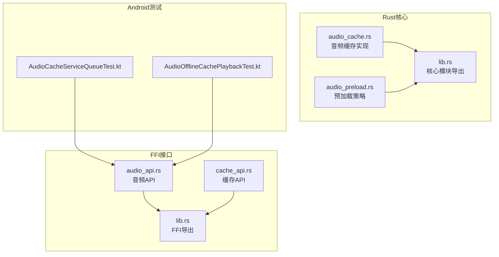
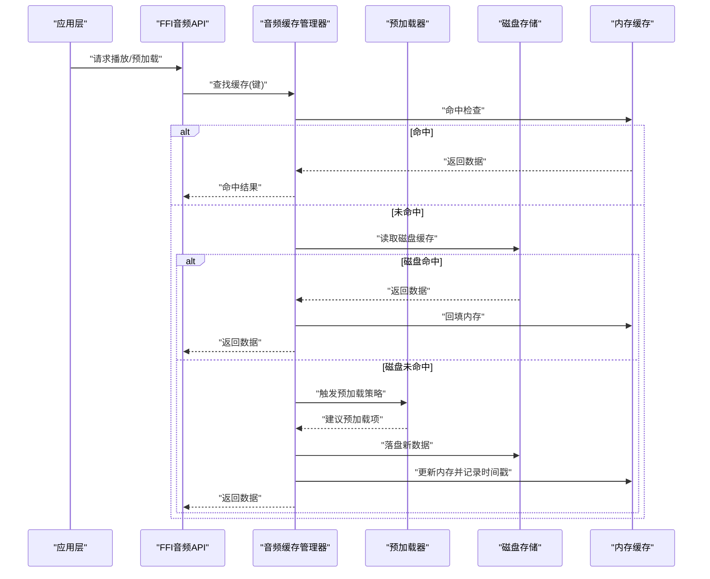
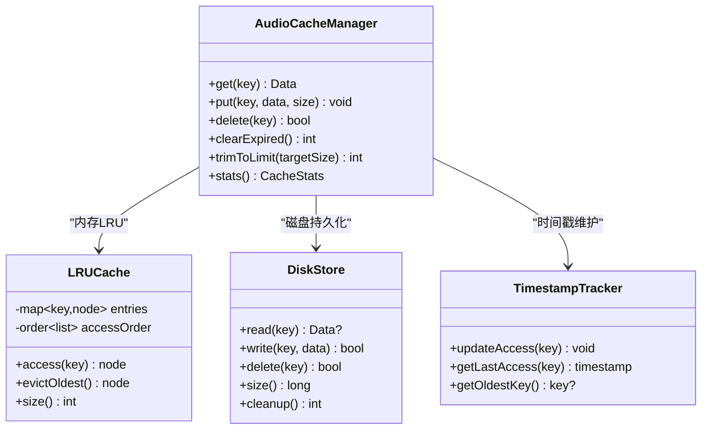
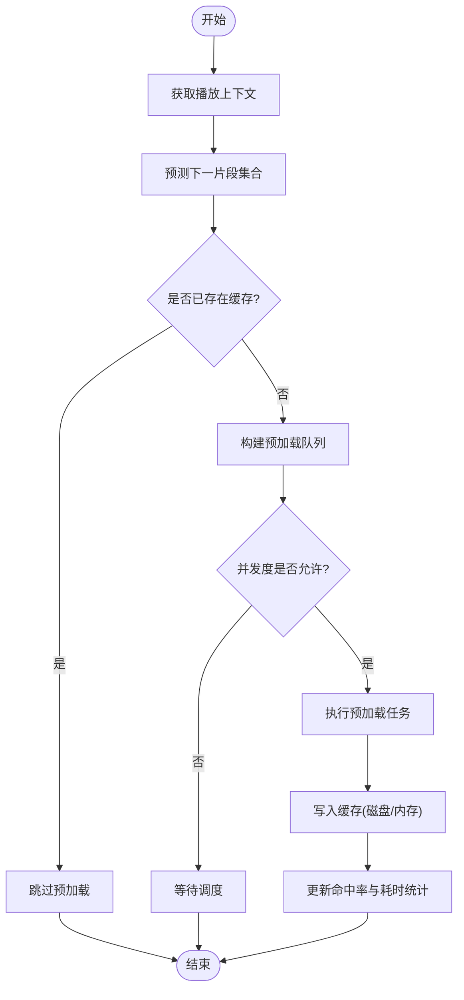
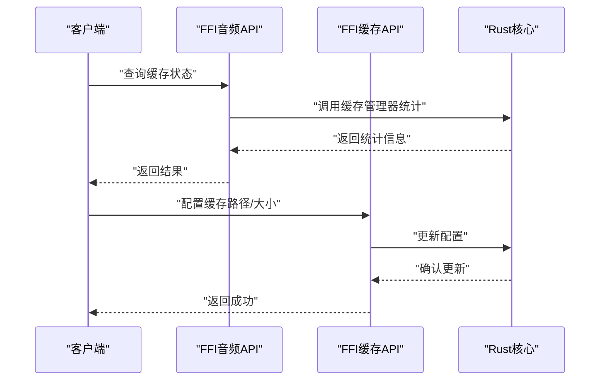
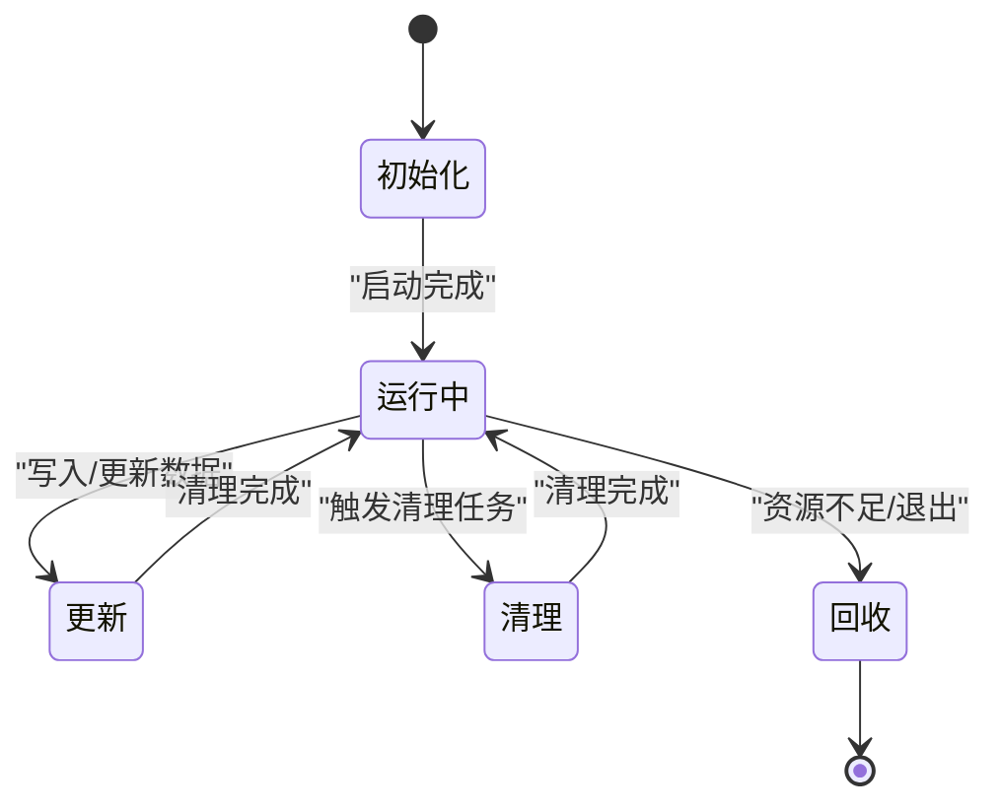
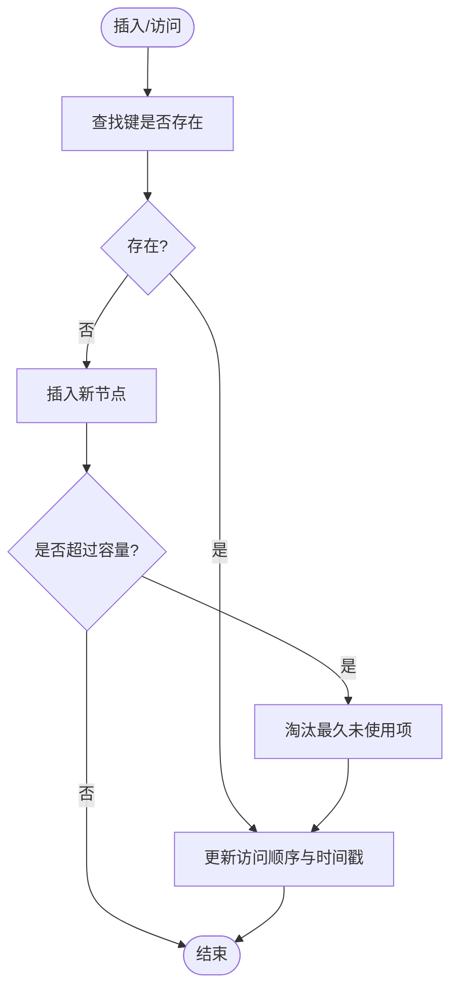
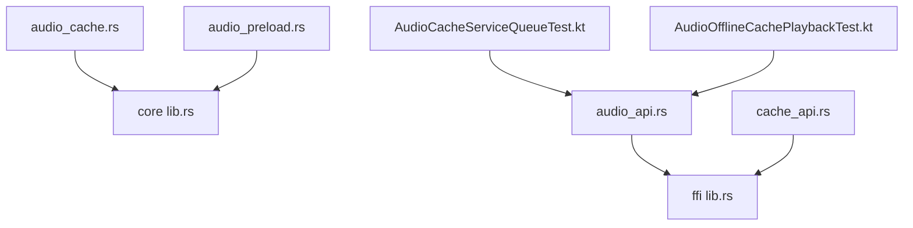

# 音频缓存管理

<cite>
**本文引用的文件**   
- [audio_cache.rs](file://rust/legado-core/src/audio_cache.rs)
- [audio_preload.rs](file://rust/legado-core/src/audio_preload.rs)
- [audio_api.rs](file://rust/legado-ffi/src/api/audio_api.rs)
- [cache_api.rs](file://rust/legado-ffi/src/api/cache_api.rs)
- [lib.rs](file://rust/legado-core/src/lib.rs)
- [lib.rs](file://rust/legado-ffi/src/lib.rs)
- [AudioCacheServiceQueueTest.kt](file://app/src/test/java/io/legado/app/service/AudioCacheServiceQueueTest.kt)
- [AudioOfflineCachePlaybackTest.kt](file://app/src/test/java/io/legado/app/service/AudioOfflineCachePlaybackTest.kt)
</cite>

## 目录
1. [简介](#简介)
2. [项目结构](#项目结构)
3. [核心组件](#核心组件)
4. [架构总览](#架构总览)
5. [详细组件分析](#详细组件分析)
6. [依赖关系分析](#依赖关系分析)
7. [性能考量](#性能考量)
8. [故障排查指南](#故障排查指南)
9. [结论](#结论)
10. [附录](#附录)

## 简介
本文件面向Legado项目的音频缓存子系统，系统性阐述其策略设计、生命周期管理、算法实现、监控优化与配置选项。重点覆盖：
- 预加载策略与大小限制
- 内存与磁盘缓存的协调机制
- 缓存生命周期（创建、更新、清理、回收）
- LRU算法、时间戳管理与冲突解决
- 命中率统计、性能分析与自动调优
- 配置项（路径、大小、清理策略）
- 故障处理与恢复、调试方法

## 项目结构
音频缓存相关代码主要位于Rust核心模块与FFI接口层，Android侧通过测试用例验证服务队列与离线播放行为。关键文件如下：
- Rust核心：音频缓存与预加载逻辑
- FFI接口：对外暴露音频与缓存API
- Android测试：服务队列与离线播放场景验证

图表来源
- [audio_cache.rs](file://rust/legado-core/src/audio_cache.rs)
- [audio_preload.rs](file://rust/legado-core/src/audio_preload.rs)
- [lib.rs](file://rust/legado-core/src/lib.rs)
- [audio_api.rs](file://rust/legado-ffi/src/api/audio_api.rs)
- [cache_api.rs](file://rust/legado-ffi/src/api/cache_api.rs)
- [lib.rs](file://rust/legado-ffi/src/lib.rs)
- [AudioCacheServiceQueueTest.kt](file://app/src/test/java/io/legado/app/service/AudioCacheServiceQueueTest.kt)
- [AudioOfflineCachePlaybackTest.kt](file://app/src/test/java/io/legado/app/service/AudioOfflineCachePlaybackTest.kt)

章节来源
- [audio_cache.rs](file://rust/legado-core/src/audio_cache.rs)
- [audio_preload.rs](file://rust/legado-core/src/audio_preload.rs)
- [audio_api.rs](file://rust/legado-ffi/src/api/audio_api.rs)
- [cache_api.rs](file://rust/legado-ffi/src/api/cache_api.rs)
- [lib.rs](file://rust/legado-core/src/lib.rs)
- [lib.rs](file://rust/legado-ffi/src/lib.rs)
- [AudioCacheServiceQueueTest.kt](file://app/src/test/java/io/legado/app/service/AudioCacheServiceQueueTest.kt)
- [AudioOfflineCachePlaybackTest.kt](file://app/src/test/java/io/legado/app/service/AudioOfflineCachePlaybackTest.kt)

## 核心组件
- 音频缓存管理器：负责内存与磁盘缓存的统一访问、LRU淘汰、时间戳维护、容量控制与清理回收。
- 预加载器：基于播放序列与用户行为预测，提前将下一章节或相邻片段写入缓存，降低首帧延迟。
- FFI音频API：为上层提供统一的音频缓存查询、写入、删除与统计接口。
- 缓存API：通用缓存能力（路径、大小、清理策略）的跨语言暴露。

章节来源
- [audio_cache.rs](file://rust/legado-core/src/audio_cache.rs)
- [audio_preload.rs](file://rust/legado-core/src/audio_preload.rs)
- [audio_api.rs](file://rust/legado-ffi/src/api/audio_api.rs)
- [cache_api.rs](file://rust/legado-ffi/src/api/cache_api.rs)

## 架构总览
音频缓存子系统采用“核心逻辑在Rust + FFI暴露 + Android调用”的分层架构。核心由缓存管理器与预加载器组成，FFI层提供统一API，Android侧通过服务与测试驱动业务流程。

图表来源
- [audio_cache.rs](file://rust/legado-core/src/audio_cache.rs)
- [audio_preload.rs](file://rust/legado-core/src/audio_preload.rs)
- [audio_api.rs](file://rust/legado-ffi/src/api/audio_api.rs)

章节来源
- [audio_cache.rs](file://rust/legado-core/src/audio_cache.rs)
- [audio_preload.rs](file://rust/legado-core/src/audio_preload.rs)
- [audio_api.rs](file://rust/legado-ffi/src/api/audio_api.rs)

## 详细组件分析

### 音频缓存管理器
职责与特性：
- 统一访问内存与磁盘缓存，保证一致性
- LRU淘汰策略：按最近使用时间排序，超出容量时淘汰最久未使用项
- 时间戳管理：每次访问更新最后访问时间，用于LRU决策
- 容量控制：内存与磁盘分别设置上限，支持动态调整
- 清理与回收：定时或事件触发清理过期/冗余条目，释放资源

图表来源
- [audio_cache.rs](file://rust/legado-core/src/audio_cache.rs)

章节来源
- [audio_cache.rs](file://rust/legado-core/src/audio_cache.rs)

### 预加载器
职责与特性：
- 基于播放上下文（当前章节、进度、历史）预测下一片段
- 支持批量预加载与优先级队列，避免阻塞主流程
- 与缓存管理器协作，按需写入磁盘与内存，遵循容量限制
- 可配置预加载阈值与并发度，平衡带宽与内存占用

图表来源
- [audio_preload.rs](file://rust/legado-core/src/audio_preload.rs)

章节来源
- [audio_preload.rs](file://rust/legado-core/src/audio_preload.rs)

### FFI音频API与缓存API
- 音频API：封装音频相关的缓存查询、写入、删除与统计操作，供上层调用
- 缓存API：提供通用缓存配置（路径、大小、清理策略）与元数据查询

图表来源
- [audio_api.rs](file://rust/legado-ffi/src/api/audio_api.rs)
- [cache_api.rs](file://rust/legado-ffi/src/api/cache_api.rs)

章节来源
- [audio_api.rs](file://rust/legado-ffi/src/api/audio_api.rs)
- [cache_api.rs](file://rust/legado-ffi/src/api/cache_api.rs)

### 生命周期管理
- 创建：初始化缓存管理器与预加载器，分配内存与磁盘空间
- 更新：写入新数据，更新LRU顺序与时间戳，必要时触发清理
- 清理：定期扫描过期条目，释放内存与磁盘空间
- 回收：进程退出或资源紧张时，主动释放缓存资源

图表来源
- [audio_cache.rs](file://rust/legado-core/src/audio_cache.rs)
- [audio_preload.rs](file://rust/legado-core/src/audio_preload.rs)

章节来源
- [audio_cache.rs](file://rust/legado-core/src/audio_cache.rs)
- [audio_preload.rs](file://rust/legado-core/src/audio_preload.rs)

### 算法实现细节
- LRU算法：维护访问顺序链表与哈希映射，确保O(1)访问与淘汰
- 时间戳管理：每次访问更新最后访问时间，用于LRU与过期判断
- 冲突解决：键冲突时采用覆盖策略，并记录版本或校验和以避免脏读

图表来源
- [audio_cache.rs](file://rust/legado-core/src/audio_cache.rs)

章节来源
- [audio_cache.rs](file://rust/legado-core/src/audio_cache.rs)

### 监控与优化
- 命中率统计：记录命中/未命中次数，计算命中率趋势
- 性能分析：跟踪读写延迟、预加载成功率、内存与磁盘占用
- 自动调优：根据命中率与资源使用情况动态调整容量与预加载策略

章节来源
- [audio_cache.rs](file://rust/legado-core/src/audio_cache.rs)
- [audio_preload.rs](file://rust/legado-core/src/audio_preload.rs)

### 配置选项
- 缓存路径：指定磁盘缓存目录，支持外部存储与内部存储
- 大小限制：内存与磁盘分别设置上限，支持百分比或绝对值
- 清理策略：定时清理、空闲清理、按过期时间清理
- 预加载参数：并发度、阈值、优先级策略

章节来源
- [cache_api.rs](file://rust/legado-ffi/src/api/cache_api.rs)
- [audio_api.rs](file://rust/legado-ffi/src/api/audio_api.rs)

## 依赖关系分析
音频缓存子系统依赖Rust核心模块与FFI接口，Android侧通过测试验证服务队列与离线播放行为。

图表来源
- [audio_cache.rs](file://rust/legado-core/src/audio_cache.rs)
- [audio_preload.rs](file://rust/legado-core/src/audio_preload.rs)
- [lib.rs](file://rust/legado-core/src/lib.rs)
- [audio_api.rs](file://rust/legado-ffi/src/api/audio_api.rs)
- [cache_api.rs](file://rust/legado-ffi/src/api/cache_api.rs)
- [lib.rs](file://rust/legado-ffi/src/lib.rs)
- [AudioCacheServiceQueueTest.kt](file://app/src/test/java/io/legado/app/service/AudioCacheServiceQueueTest.kt)
- [AudioOfflineCachePlaybackTest.kt](file://app/src/test/java/io/legado/app/service/AudioOfflineCachePlaybackTest.kt)

章节来源
- [audio_cache.rs](file://rust/legado-core/src/audio_cache.rs)
- [audio_preload.rs](file://rust/legado-core/src/audio_preload.rs)
- [lib.rs](file://rust/legado-core/src/lib.rs)
- [audio_api.rs](file://rust/legado-ffi/src/api/audio_api.rs)
- [cache_api.rs](file://rust/legado-ffi/src/api/cache_api.rs)
- [lib.rs](file://rust/legado-ffi/src/lib.rs)
- [AudioCacheServiceQueueTest.kt](file://app/src/test/java/io/legado/app/service/AudioCacheServiceQueueTest.kt)
- [AudioOfflineCachePlaybackTest.kt](file://app/src/test/java/io/legado/app/service/AudioOfflineCachePlaybackTest.kt)

## 性能考量
- 内存占用：合理设置内存上限，避免OOM；使用对象池减少分配开销
- 磁盘IO：合并小文件写入，异步落盘，减少阻塞
- 预加载并发：根据设备性能与网络状况动态调整并发度
- 命中率优化：基于用户行为模型优化预加载策略，提升命中率

## 故障排查指南
- 常见问题：
  - 缓存未命中率高：检查预加载策略与键生成逻辑
  - 内存溢出：降低内存上限，启用更激进的清理策略
  - 磁盘空间不足：清理过期条目，扩展存储空间
- 调试方法：
  - 启用详细日志，记录缓存操作与时间戳变化
  - 使用测试用例模拟极端场景，验证稳定性
  - 监控指标：命中率、延迟、内存与磁盘占用

章节来源
- [audio_cache.rs](file://rust/legado-core/src/audio_cache.rs)
- [audio_preload.rs](file://rust/legado-core/src/audio_preload.rs)
- [AudioCacheServiceQueueTest.kt](file://app/src/test/java/io/legado/app/service/AudioCacheServiceQueueTest.kt)
- [AudioOfflineCachePlaybackTest.kt](file://app/src/test/java/io/legado/app/service/AudioOfflineCachePlaybackTest.kt)

## 结论
音频缓存子系统通过LRU算法、时间戳管理与预加载策略，实现了高效、稳定的音频数据缓存。结合FFI接口与Android测试，确保了跨平台一致性与可靠性。未来可进一步优化命中率与资源利用率，提升用户体验。

## 附录
- 配置示例：
  - 设置缓存路径：/data/data/com.example/app/cache/audio
  - 内存上限：512MB
  - 磁盘上限：2GB
  - 清理策略：每6小时清理一次过期条目
- 最佳实践：
  - 根据设备性能调整预加载并发度
  - 定期监控命中率与资源占用，动态调优
  - 使用测试用例覆盖边界场景，确保稳定性