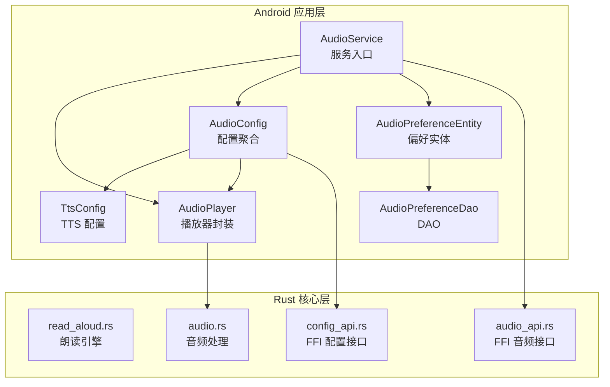
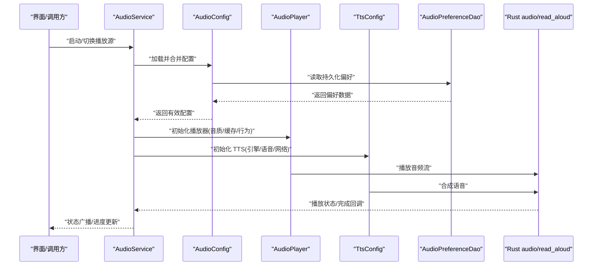
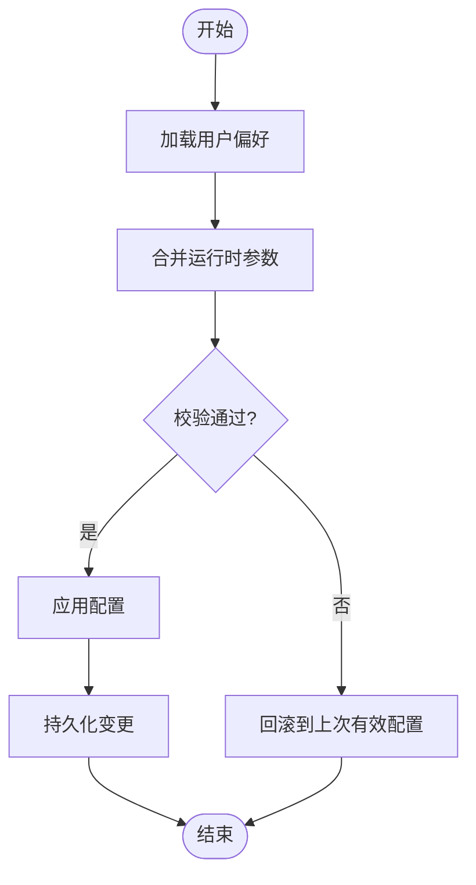
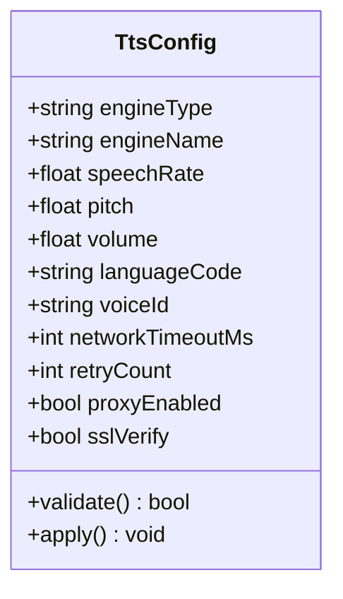
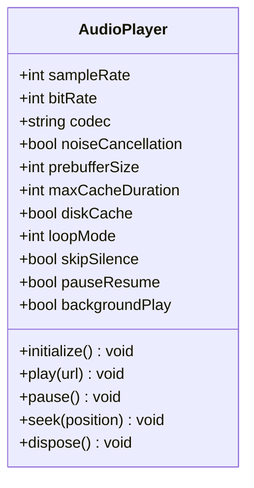
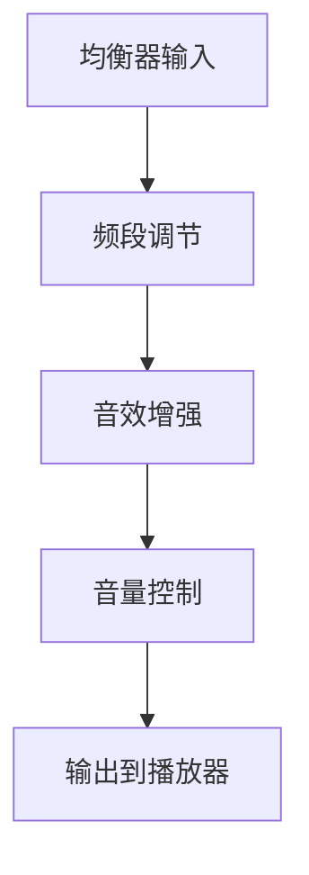
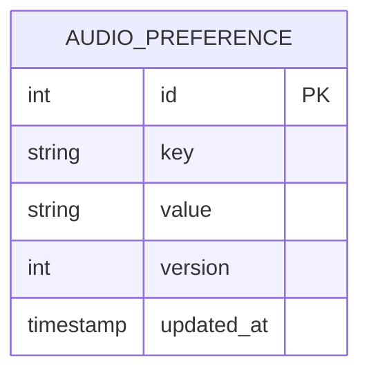
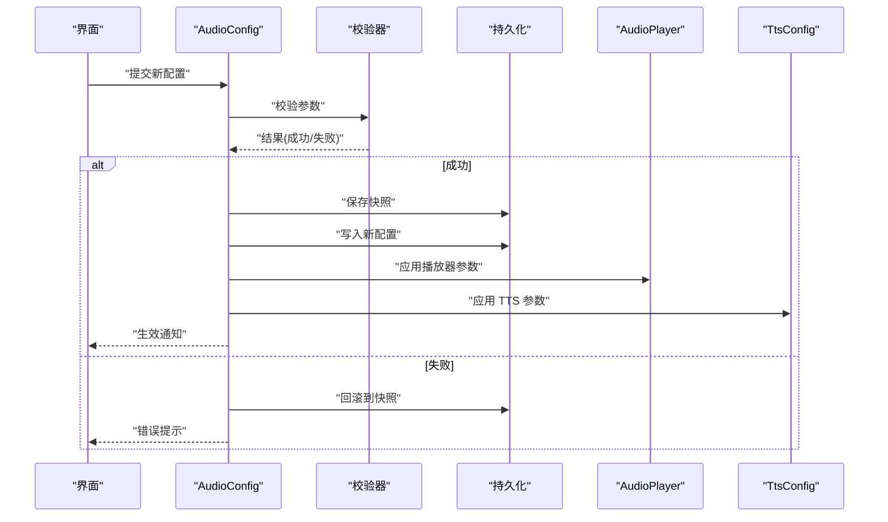
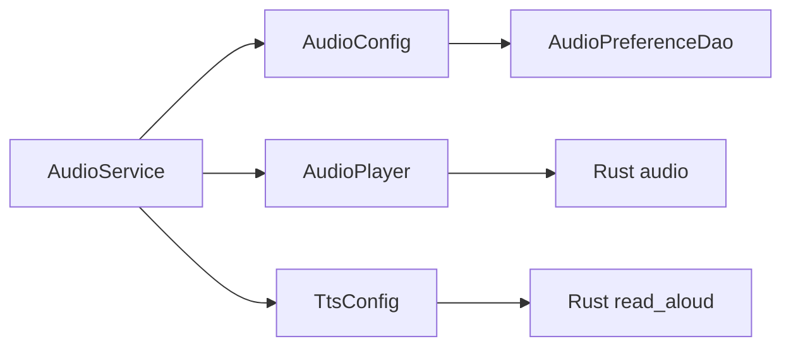

# 音频配置系统

<cite>
**本文引用的文件**   
- [app/src/main/java/io/legado/app/help/audio/AudioConfig.kt](file://app/src/main/java/io/legado/app/help/audio/AudioConfig.kt)
- [app/src/main/java/io/legado/app/help/audio/AudioPlayer.kt](file://app/src/main/java/io/legado/app/help/audio/AudioPlayer.kt)
- [app/src/main/java/io/legado/app/help/audio/TtsConfig.kt](file://app/src/main/java/io/legado/app/help/audio/TtsConfig.kt)
- [app/src/main/java/io/legado/app/service/AudioService.kt](file://app/src/main/java/io/legado/app/service/AudioService.kt)
- [app/src/main/java/io/legado/app/data/entity/AudioPreferenceEntity.kt](file://app/src/main/java/io/legado/app/data/entity/AudioPreferenceEntity.kt)
- [app/src/main/java/io/legado/app/data/dao/AudioPreferenceDao.kt](file://app/src/main/java/io/legado/app/data/dao/AudioPreferenceDao.kt)
- [app/src/main/java/io/legado/app/utils/AudioUtils.kt](file://app/src/main/java/io/legado/app/utils/AudioUtils.kt)
- [rust/legado-core/src/audio.rs](file://rust/legado-core/src/audio.rs)
- [rust/legado-core/src/read_aloud.rs](file://rust/legado-core/src/read_aloud.rs)
- [rust/legado-ffi/src/api/audio_api.rs](file://rust/legado-ffi/src/api/audio_api.rs)
- [rust/legado-ffi/src/api/config_api.rs](file://rust/legado-ffi/src/api/config_api.rs)
</cite>

## 目录
1. [简介](#简介)
2. [项目结构](#项目结构)
3. [核心组件](#核心组件)
4. [架构总览](#架构总览)
5. [详细组件分析](#详细组件分析)
6. [依赖关系分析](#依赖关系分析)
7. [性能考量](#性能考量)
8. [故障排查指南](#故障排查指南)
9. [结论](#结论)
10. [附录：配置参考与示例](#附录配置参考与示例)

## 简介
本文件面向“音频配置系统”的设计与实现，覆盖以下关键主题：
- 配置架构设计：配置项分类、优先级管理、默认值设置机制
- TTS 相关配置：引擎选择、语音参数、网络设置等
- 播放器配置：音质设置、缓存策略、播放行为等
- 音频效果配置：均衡器、音效增强、音量控制等
- 配置持久化：存储格式、版本兼容、迁移策略
- 配置验证与热更新：参数校验、实时生效、回滚机制
- 完整配置参考与使用示例

## 项目结构
音频配置系统横跨 Android 应用层（Kotlin）与 Rust 核心库（FFI 桥接），主要涉及：
- Kotlin 侧：AudioConfig、TtsConfig、AudioPlayer、AudioService、偏好实体与 DAO
- Rust 侧：音频处理、朗读引擎、FFI API、配置 API
- 数据层：Room 数据库实体与 DAO，用于持久化音频偏好

**图表来源** 
- [app/src/main/java/io/legado/app/help/audio/AudioConfig.kt](file://app/src/main/java/io/legado/app/help/audio/AudioConfig.kt)
- [app/src/main/java/io/legado/app/help/audio/TtsConfig.kt](file://app/src/main/java/io/legado/app/help/audio/TtsConfig.kt)
- [app/src/main/java/io/legado/app/help/audio/AudioPlayer.kt](file://app/src/main/java/io/legado/app/help/audio/AudioPlayer.kt)
- [app/src/main/java/io/legado/app/service/AudioService.kt](file://app/src/main/java/io/legado/app/service/AudioService.kt)
- [app/src/main/java/io/legado/app/data/entity/AudioPreferenceEntity.kt](file://app/src/main/java/io/legado/app/data/entity/AudioPreferenceEntity.kt)
- [app/src/main/java/io/legado/app/data/dao/AudioPreferenceDao.kt](file://app/src/main/java/io/legado/app/data/dao/AudioPreferenceDao.kt)
- [rust/legado-core/src/read_aloud.rs](file://rust/legado-core/src/read_aloud.rs)
- [rust/legado-core/src/audio.rs](file://rust/legado-core/src/audio.rs)
- [rust/legado-ffi/src/api/audio_api.rs](file://rust/legado-ffi/src/api/audio_api.rs)
- [rust/legado-ffi/src/api/config_api.rs](file://rust/legado-ffi/src/api/config_api.rs)

**章节来源**
- [app/src/main/java/io/legado/app/help/audio/AudioConfig.kt](file://app/src/main/java/io/legado/app/help/audio/AudioConfig.kt)
- [app/src/main/java/io/legado/app/help/audio/TtsConfig.kt](file://app/src/main/java/io/legado/app/help/audio/TtsConfig.kt)
- [app/src/main/java/io/legado/app/help/audio/AudioPlayer.kt](file://app/src/main/java/io/legado/app/help/audio/AudioPlayer.kt)
- [app/src/main/java/io/legado/app/service/AudioService.kt](file://app/src/main/java/io/legado/app/service/AudioService.kt)
- [app/src/main/java/io/legado/app/data/entity/AudioPreferenceEntity.kt](file://app/src/main/java/io/legado/app/data/entity/AudioPreferenceEntity.kt)
- [app/src/main/java/io/legado/app/data/dao/AudioPreferenceDao.kt](file://app/src/main/java/io/legado/app/data/dao/AudioPreferenceDao.kt)
- [rust/legado-core/src/audio.rs](file://rust/legado-core/src/audio.rs)
- [rust/legado-core/src/read_aloud.rs](file://rust/legado-core/src/read_aloud.rs)
- [rust/legado-ffi/src/api/audio_api.rs](file://rust/legado-ffi/src/api/audio_api.rs)
- [rust/legado-ffi/src/api/config_api.rs](file://rust/legado-ffi/src/api/config_api.rs)

## 核心组件
- AudioConfig：集中式配置聚合，负责加载、合并、校验与导出配置；提供默认值与优先级规则。
- TtsConfig：TTS 引擎配置，包含引擎类型、语音参数、网络超时、重试策略等。
- AudioPlayer：播放器封装，负责音质、缓存、播放行为（循环、跳过、静音）、进度同步。
- AudioService：前台服务，协调播放器与 TTS，处理生命周期、事件回调与状态广播。
- AudioPreferenceEntity + AudioPreferenceDao：Room 实体与 DAO，用于持久化音频偏好。
- Rust audio.rs / read_aloud.rs：底层音频处理与朗读引擎逻辑。
- FFI audio_api.rs / config_api.rs：跨语言接口，暴露配置读写与音频控制能力。

**章节来源**
- [app/src/main/java/io/legado/app/help/audio/AudioConfig.kt](file://app/src/main/java/io/legado/app/help/audio/AudioConfig.kt)
- [app/src/main/java/io/legado/app/help/audio/TtsConfig.kt](file://app/src/main/java/io/legado/app/help/audio/TtsConfig.kt)
- [app/src/main/java/io/legado/app/help/audio/AudioPlayer.kt](file://app/src/main/java/io/legado/app/help/audio/AudioPlayer.kt)
- [app/src/main/java/io/legado/app/service/AudioService.kt](file://app/src/main/java/io/legado/app/service/AudioService.kt)
- [app/src/main/java/io/legado/app/data/entity/AudioPreferenceEntity.kt](file://app/src/main/java/io/legado/app/data/entity/AudioPreferenceEntity.kt)
- [app/src/main/java/io/legado/app/data/dao/AudioPreferenceDao.kt](file://app/src/main/java/io/legado/app/data/dao/AudioPreferenceDao.kt)
- [rust/legado-core/src/audio.rs](file://rust/legado-core/src/audio.rs)
- [rust/legado-core/src/read_aloud.rs](file://rust/legado-core/src/read_aloud.rs)
- [rust/legado-ffi/src/api/audio_api.rs](file://rust/legado-ffi/src/api/audio_api.rs)
- [rust/legado-ffi/src/api/config_api.rs](file://rust/legado-ffi/src/api/config_api.rs)

## 架构总览
整体采用分层架构：
- 配置层：AudioConfig 聚合各子配置，统一加载与校验
- 服务层：AudioService 作为入口，协调播放器与 TTS
- 播放层：AudioPlayer 封装播放细节（音质、缓存、行为）
- 持久化层：Room 实体与 DAO 管理偏好存储
- 核心层：Rust 音频与朗读引擎通过 FFI 暴露能力

**图表来源** 
- [app/src/main/java/io/legado/app/service/AudioService.kt](file://app/src/main/java/io/legado/app/service/AudioService.kt)
- [app/src/main/java/io/legado/app/help/audio/AudioConfig.kt](file://app/src/main/java/io/legado/app/help/audio/AudioConfig.kt)
- [app/src/main/java/io/legado/app/help/audio/AudioPlayer.kt](file://app/src/main/java/io/legado/app/help/audio/AudioPlayer.kt)
- [app/src/main/java/io/legado/app/help/audio/TtsConfig.kt](file://app/src/main/java/io/legado/app/help/audio/TtsConfig.kt)
- [app/src/main/java/io/legado/app/data/dao/AudioPreferenceDao.kt](file://app/src/main/java/io/legado/app/data/dao/AudioPreferenceDao.kt)
- [rust/legado-core/src/audio.rs](file://rust/legado-core/src/audio.rs)
- [rust/legado-core/src/read_aloud.rs](file://rust/legado-core/src/read_aloud.rs)

## 详细组件分析

### 配置架构与优先级
- 配置项分类：
  - 全局音频配置（音质、缓存、播放行为）
  - TTS 配置（引擎、语音、网络）
  - 效果配置（均衡器、增强、音量）
  - 持久化键空间（按模块划分）
- 优先级管理：
  - 运行时参数 > 用户偏好 > 默认值
  - 支持临时覆盖（会话级）与永久覆盖（持久化）
- 默认值设置：
  - 在配置类中定义默认值常量
  - 缺失字段时自动回填默认值

**图表来源** 
- [app/src/main/java/io/legado/app/help/audio/AudioConfig.kt](file://app/src/main/java/io/legado/app/help/audio/AudioConfig.kt)
- [app/src/main/java/io/legado/app/data/dao/AudioPreferenceDao.kt](file://app/src/main/java/io/legado/app/data/dao/AudioPreferenceDao.kt)

**章节来源**
- [app/src/main/java/io/legado/app/help/audio/AudioConfig.kt](file://app/src/main/java/io/legado/app/help/audio/AudioConfig.kt)
- [app/src/main/java/io/legado/app/data/dao/AudioPreferenceDao.kt](file://app/src/main/java/io/legado/app/data/dao/AudioPreferenceDao.kt)

### TTS 配置详解
- 引擎选择：内置/HTTP 引擎、引擎名称、启用开关
- 语音参数：语速、音调、音量、语言代码、发音人
- 网络设置：超时、重试次数、代理、证书校验
- 错误处理：失败降级、断网恢复、队列管理

**图表来源** 
- [app/src/main/java/io/legado/app/help/audio/TtsConfig.kt](file://app/src/main/java/io/legado/app/help/audio/TtsConfig.kt)
- [rust/legado-core/src/read_aloud.rs](file://rust/legado-core/src/read_aloud.rs)

**章节来源**
- [app/src/main/java/io/legado/app/help/audio/TtsConfig.kt](file://app/src/main/java/io/legado/app/help/audio/TtsConfig.kt)
- [rust/legado-core/src/read_aloud.rs](file://rust/legado-core/src/read_aloud.rs)

### 播放器配置详解
- 音质设置：采样率、比特率、编码格式、降噪开关
- 缓存策略：预缓冲大小、最大缓存时长、磁盘缓存开关
- 播放行为：循环模式、跳过静音、暂停恢复、后台播放
- 进度同步：与 UI 的进度事件、位置上报频率

**图表来源** 
- [app/src/main/java/io/legado/app/help/audio/AudioPlayer.kt](file://app/src/main/java/io/legado/app/help/audio/AudioPlayer.kt)
- [rust/legado-core/src/audio.rs](file://rust/legado-core/src/audio.rs)

**章节来源**
- [app/src/main/java/io/legado/app/help/audio/AudioPlayer.kt](file://app/src/main/java/io/legado/app/help/audio/AudioPlayer.kt)
- [rust/legado-core/src/audio.rs](file://rust/legado-core/src/audio.rs)

### 音频效果配置
- 均衡器：频段增益、预设模式、自定义曲线
- 音效增强：重低音、环绕声、动态范围压缩
- 音量控制：全局音量、媒体音量、限制峰值

**图表来源** 
- [app/src/main/java/io/legado/app/utils/AudioUtils.kt](file://app/src/main/java/io/legado/app/utils/AudioUtils.kt)

**章节来源**
- [app/src/main/java/io/legado/app/utils/AudioUtils.kt](file://app/src/main/java/io/legado/app/utils/AudioUtils.kt)

### 配置持久化机制
- 存储格式：JSON/Proto 或 Room 表结构
- 版本兼容：版本号字段、迁移脚本、向后兼容
- 迁移策略：增量升级、字段映射、数据修复

**图表来源** 
- [app/src/main/java/io/legado/app/data/entity/AudioPreferenceEntity.kt](file://app/src/main/java/io/legado/app/data/entity/AudioPreferenceEntity.kt)
- [app/src/main/java/io/legado/app/data/dao/AudioPreferenceDao.kt](file://app/src/main/java/io/legado/app/data/dao/AudioPreferenceDao.kt)

**章节来源**
- [app/src/main/java/io/legado/app/data/entity/AudioPreferenceEntity.kt](file://app/src/main/java/io/legado/app/data/entity/AudioPreferenceEntity.kt)
- [app/src/main/java/io/legado/app/data/dao/AudioPreferenceDao.kt](file://app/src/main/java/io/legado/app/data/dao/AudioPreferenceDao.kt)

### 配置验证与热更新
- 参数校验：范围检查、依赖关系校验、枚举合法性
- 实时生效：监听配置变化、动态应用、无重启更新
- 回滚机制：快照保存、失败回退、一致性保证

**图表来源** 
- [app/src/main/java/io/legado/app/help/audio/AudioConfig.kt](file://app/src/main/java/io/legado/app/help/audio/AudioConfig.kt)
- [app/src/main/java/io/legado/app/data/dao/AudioPreferenceDao.kt](file://app/src/main/java/io/legado/app/data/dao/AudioPreferenceDao.kt)

**章节来源**
- [app/src/main/java/io/legado/app/help/audio/AudioConfig.kt](file://app/src/main/java/io/legado/app/help/audio/AudioConfig.kt)
- [app/src/main/java/io/legado/app/data/dao/AudioPreferenceDao.kt](file://app/src/main/java/io/legado/app/data/dao/AudioPreferenceDao.kt)

## 依赖关系分析
- 组件耦合：
  - AudioService 依赖 AudioConfig、AudioPlayer、TtsConfig
  - AudioConfig 依赖 DAO 与默认值提供者
  - AudioPlayer 依赖 Rust audio 核心
  - TtsConfig 依赖 Rust read_aloud 核心
- 外部依赖：
  - Room 数据库
  - Rust FFI 接口
  - 系统音频框架（Android）

**图表来源** 
- [app/src/main/java/io/legado/app/service/AudioService.kt](file://app/src/main/java/io/legado/app/service/AudioService.kt)
- [app/src/main/java/io/legado/app/help/audio/AudioConfig.kt](file://app/src/main/java/io/legado/app/help/audio/AudioConfig.kt)
- [app/src/main/java/io/legado/app/help/audio/AudioPlayer.kt](file://app/src/main/java/io/legado/app/help/audio/AudioPlayer.kt)
- [app/src/main/java/io/legado/app/help/audio/TtsConfig.kt](file://app/src/main/java/io/legado/app/help/audio/TtsConfig.kt)
- [app/src/main/java/io/legado/app/data/dao/AudioPreferenceDao.kt](file://app/src/main/java/io/legado/app/data/dao/AudioPreferenceDao.kt)
- [rust/legado-core/src/audio.rs](file://rust/legado-core/src/audio.rs)
- [rust/legado-core/src/read_aloud.rs](file://rust/legado-core/src/read_aloud.rs)

**章节来源**
- [app/src/main/java/io/legado/app/service/AudioService.kt](file://app/src/main/java/io/legado/app/service/AudioService.kt)
- [app/src/main/java/io/legado/app/help/audio/AudioConfig.kt](file://app/src/main/java/io/legado/app/help/audio/AudioConfig.kt)
- [app/src/main/java/io/legado/app/help/audio/AudioPlayer.kt](file://app/src/main/java/io/legado/app/help/audio/AudioPlayer.kt)
- [app/src/main/java/io/legado/app/help/audio/TtsConfig.kt](file://app/src/main/java/io/legado/app/help/audio/TtsConfig.kt)
- [app/src/main/java/io/legado/app/data/dao/AudioPreferenceDao.kt](file://app/src/main/java/io/legado/app/data/dao/AudioPreferenceDao.kt)
- [rust/legado-core/src/audio.rs](file://rust/legado-core/src/audio.rs)
- [rust/legado-core/src/read_aloud.rs](file://rust/legado-core/src/read_aloud.rs)

## 性能考量
- 播放器缓存：合理设置预缓冲与最大缓存时长，避免频繁 I/O
- 线程模型：音频解码与渲染应在专用线程，避免阻塞 UI
- 内存占用：大文件流式播放，避免一次性加载
- 网络优化：TTS 请求连接复用、超时与重试策略调优
- 资源释放：及时释放播放器与 TTS 资源，防止泄漏

[本节为通用指导，不直接分析具体文件]

## 故障排查指南
- 常见问题：
  - TTS 无法合成：检查引擎名称、网络连通性、权限
  - 播放卡顿：调整预缓冲、降低音质、检查磁盘缓存
  - 配置未生效：确认校验通过、查看日志、回滚测试
- 调试建议：
  - 启用详细日志，记录配置变更与错误堆栈
  - 使用最小化配置复现问题
  - 分模块隔离（播放器 vs TTS）定位问题

**章节来源**
- [app/src/main/java/io/legado/app/service/AudioService.kt](file://app/src/main/java/io/legado/app/service/AudioService.kt)
- [app/src/main/java/io/legado/app/help/audio/AudioConfig.kt](file://app/src/main/java/io/legado/app/help/audio/AudioConfig.kt)

## 结论
音频配置系统通过分层设计与清晰的职责划分，实现了灵活的配置管理与稳定的播放体验。结合 Rust 核心能力与 Android 平台特性，提供了完整的 TTS、播放器与效果链配置，并通过持久化与热更新保障用户体验与系统稳定性。

[本节为总结，不直接分析具体文件]

## 附录：配置参考与示例
- 全局音频配置
  - 音质：采样率、比特率、编码格式
  - 缓存：预缓冲大小、最大缓存时长、磁盘缓存开关
  - 行为：循环模式、跳过静音、后台播放
- TTS 配置
  - 引擎：类型、名称、启用开关
  - 语音：语速、音调、音量、语言代码、发音人
  - 网络：超时、重试、代理、证书校验
- 效果配置
  - 均衡器：频段增益、预设、自定义曲线
  - 增强：重低音、环绕声、动态压缩
  - 音量：全局音量、媒体音量、峰值限制
- 使用示例
  - 初始化配置：加载默认值与用户偏好，合并运行时参数
  - 应用配置：校验通过后应用到播放器与 TTS
  - 持久化：保存变更并生成快照以便回滚
  - 热更新：监听变化并动态生效

[本节为参考与示例，不直接分析具体文件]