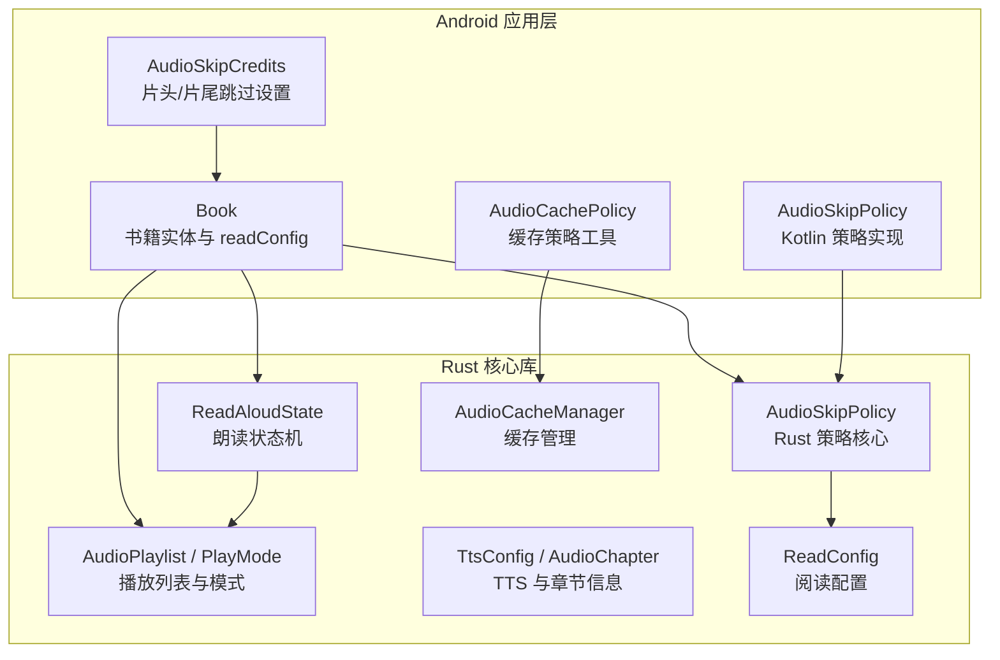
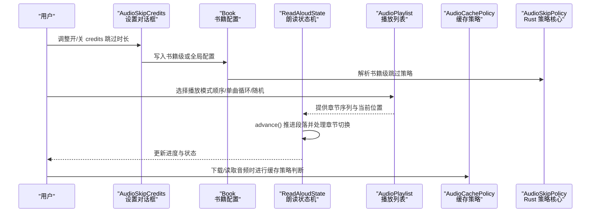
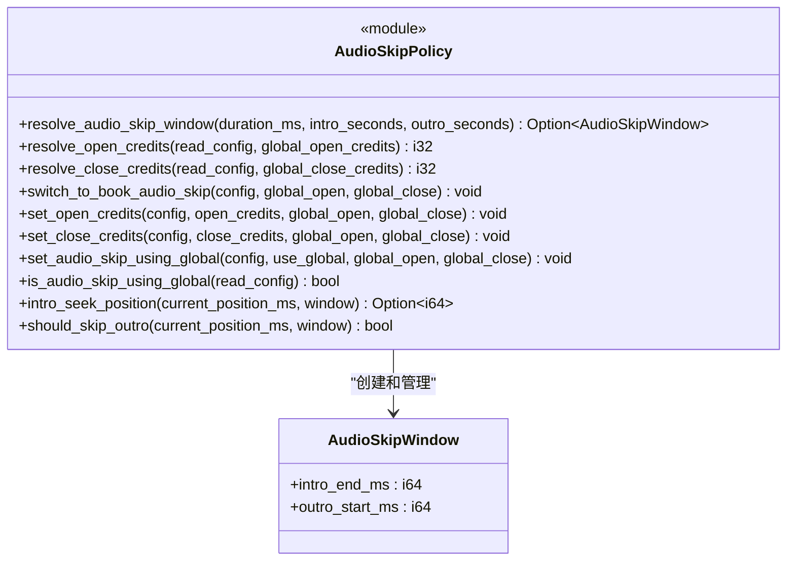
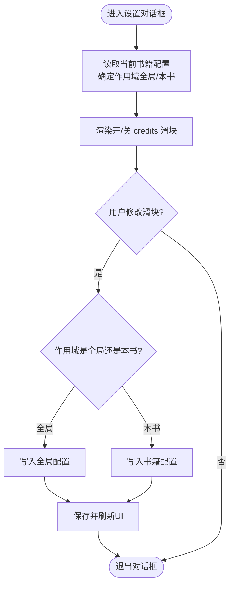
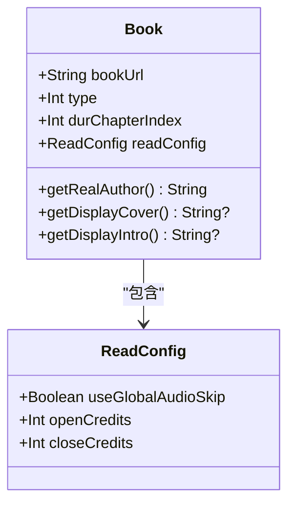
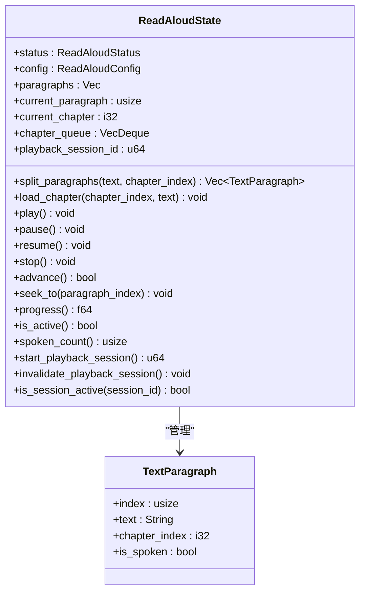
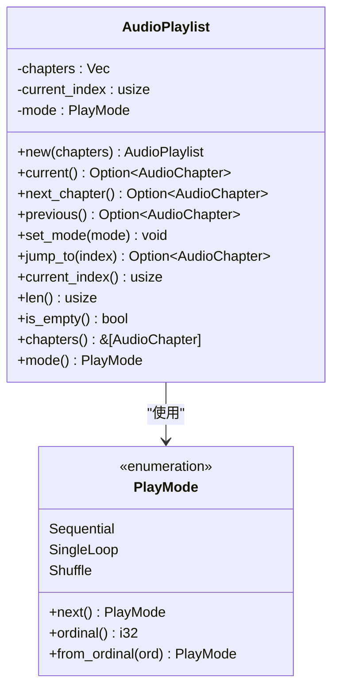
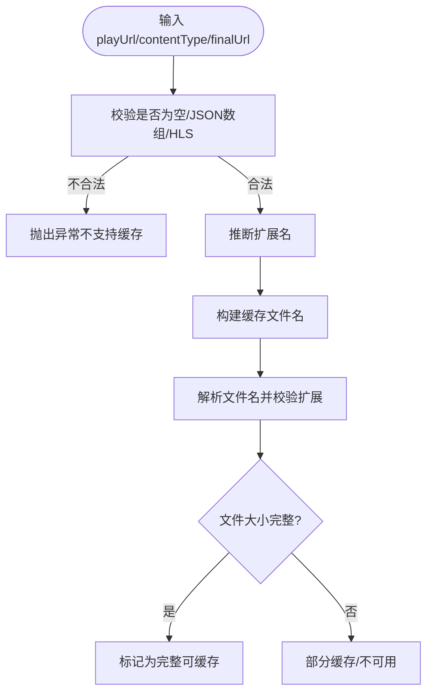
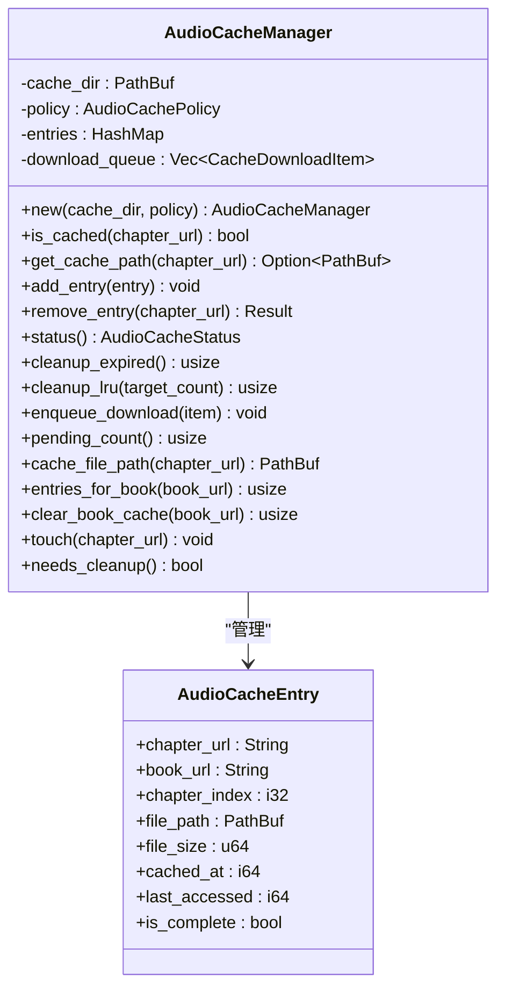
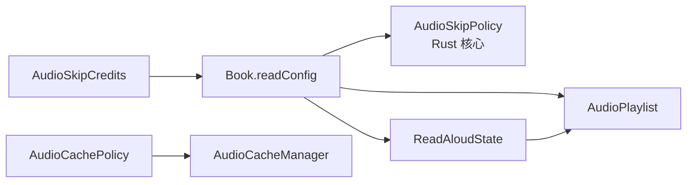

# 音频跳过策略

<cite>
**本文引用的文件**   
- [audio_skip_policy.rs](file://rust/legado-core/src/audio_skip_policy.rs)
- [AudioSkipPolicy.kt](file://app/src/main/java/io/legado/app/service/AudioSkipPolicy.kt)
- [Book.kt](file://app/src/main/java/io/legado/app/data/entities/Book.kt)
- [book.rs](file://rust/legado-core/src/models/book.rs)
- [AudioSkipCredits.kt](file://app/src/main/java/io/legado/app/ui/book/audio/config/AudioSkipCredits.kt)
- [read_aloud.rs](file://rust/legado-core/src/read_aloud.rs)
- [audio.rs](file://rust/legado-core/src/audio.rs)
- [audio_cache.rs](file://rust/legado-core/src/audio_cache.rs)
- [AudioCachePolicy.kt](file://app/src/main/java/io/legado/app/help/audio/AudioCachePolicy.kt)
</cite>

## 更新摘要
**所做更改**   
- 新增 Rust 层音频跳过策略核心实现，包含 AudioSkipWindow 结构体和完整的策略计算逻辑
- 更新了书籍配置系统，支持全局与书级跳过策略的无缝切换
- 增强了播放会话管理机制，防止新旧播放请求串扰
- 完善了测试覆盖，确保跳过策略在各种边界条件下的正确性

## 目录
1. [简介](#简介)
2. [项目结构](#项目结构)
3. [核心组件](#核心组件)
4. [架构总览](#架构总览)
5. [详细组件分析](#详细组件分析)
6. [依赖关系分析](#依赖关系分析)
7. [性能考量](#性能考量)
8. [故障排查指南](#故障排查指南)
9. [结论](#结论)

## 简介
本文件聚焦"音频跳过策略"在 Legado 中的设计与实现，涵盖：
- 片头/片尾跳过（开/关 credits）的 UI 配置与书籍级覆盖
- 朗读状态机对段落推进、章节切换与进度计算的影响
- 播放列表模式（顺序/单曲循环/随机）对"下一段/下一章"决策的作用
- 缓存策略对可缓存音频的判断与文件名规范（间接影响跳过体验）
- Rust 层播放状态与 Kotlin/Java 层的交互边界

**最新更新** 引入了全新的 Rust 层音频跳过策略系统，提供了更强大的窗口计算、会话管理和书籍级配置支持。

## 项目结构
围绕音频跳过策略的相关代码分布在 Android 应用层与 Rust 核心库中：
- Android 层提供用户界面与书籍级配置入口
- Rust 层提供朗读状态机、播放列表管理与基础数据模型
- 缓存策略模块负责音频文件的命名、校验与完整性判断

**图示来源** 
- [audio_skip_policy.rs:25-32](file://rust/legado-core/src/audio_skip_policy.rs#L25-L32)
- [AudioSkipPolicy.kt:5-8](file://app/src/main/java/io/legado/app/service/AudioSkipPolicy.kt#L5-L8)
- [Book.kt:194-200](file://app/src/main/java/io/legado/app/data/entities/Book.kt#L194-L200)
- [book.rs:17-64](file://rust/legado-core/src/models/book.rs#L17-L64)
- [AudioSkipCredits.kt:17-78](file://app/src/main/java/io/legado/app/ui/book/audio/config/AudioSkipCredits.kt#L17-L78)
- [read_aloud.rs:101-112](file://rust/legado-core/src/read_aloud.rs#L101-L112)
- [audio.rs:97-204](file://rust/legado-core/src/audio.rs#L97-L204)
- [audio_cache.rs:76-267](file://rust/legado-core/src/audio_cache.rs#L76-L267)
- [AudioCachePolicy.kt:20-129](file://app/src/main/java/io/legado/app/help/audio/AudioCachePolicy.kt#L20-L129)

**章节来源**
- [audio_skip_policy.rs:25-32](file://rust/legado-core/src/audio_skip_policy.rs#L25-L32)
- [AudioSkipPolicy.kt:5-8](file://app/src/main/java/io/legado/app/service/AudioSkipPolicy.kt#L5-L8)
- [Book.kt:194-200](file://app/src/main/java/io/legado/app/data/entities/Book.kt#L194-L200)
- [book.rs:17-64](file://rust/legado-core/src/models/book.rs#L17-L64)
- [AudioSkipCredits.kt:17-78](file://app/src/main/java/io/legado/app/ui/book/audio/config/AudioSkipCredits.kt#L17-L78)

## 核心组件
- **新增** Rust 层音频跳过策略核心：提供 AudioSkipWindow 结构体和完整的策略计算逻辑
- 片头/片尾跳过设置对话框：允许为当前书籍或全局设置开/关 credits 的跳过时长
- 书籍实体与阅读配置：支持按书覆盖全局跳过策略
- 朗读状态机：维护段落推进、章节队列与进度
- 播放列表与模式：决定"下一段/下一章"的行为
- 缓存策略：判断是否可缓存、生成稳定文件名、校验完整性

**章节来源**
- [audio_skip_policy.rs:25-32](file://rust/legado-core/src/audio_skip_policy.rs#L25-L32)
- [AudioSkipCredits.kt:45-72](file://app/src/main/java/io/legado/app/ui/book/audio/config/AudioSkipCredits.kt#L45-L72)
- [Book.kt:194-200](file://app/src/main/java/io/legado/app/data/entities/Book.kt#L194-L200)
- [read_aloud.rs:101-112](file://rust/legado-core/src/read_aloud.rs#L101-L112)
- [audio.rs:97-204](file://rust/legado-core/src/audio.rs#L97-L204)
- [AudioCachePolicy.kt:20-129](file://app/src/main/java/io/legado/app/help/audio/AudioCachePolicy.kt#L20-L129)

## 架构总览
下图展示从用户设置到播放控制的端到端流程，以及 Rust 层的状态机如何驱动"跳过"行为。

**图示来源** 
- [AudioSkipCredits.kt:45-72](file://app/src/main/java/io/legado/app/ui/book/audio/config/AudioSkipCredits.kt#L45-L72)
- [Book.kt:194-200](file://app/src/main/java/io/legado/app/data/entities/Book.kt#L194-L200)
- [audio_skip_policy.rs:39-56](file://rust/legado-core/src/audio_skip_policy.rs#L39-L56)
- [read_aloud.rs:145-165](file://rust/legado-core/src/read_aloud.rs#L145-L165)
- [audio.rs:120-170](file://rust/legado-core/src/audio.rs#L120-L170)
- [AudioCachePolicy.kt:20-65](file://app/src/main/java/io/legado/app/help/audio/AudioCachePolicy.kt#L20-L65)

## 详细组件分析

### Rust 层音频跳过策略核心（AudioSkipPolicy）
**新增** Rust 层实现了完整的音频跳过策略系统，提供以下核心功能：

- **AudioSkipWindow 结构体**：定义片头结束位置和片尾起始位置
- **窗口计算函数**：根据音频时长和跳过秒数计算有效的跳过窗口
- **书籍级配置解析**：支持全局与书级配置的无缝切换
- **播放进度控制**：提供片头跳过定位和片尾自动跳过判断

**图示来源** 
- [audio_skip_policy.rs:25-32](file://rust/legado-core/src/audio_skip_policy.rs#L25-L32)
- [audio_skip_policy.rs:39-56](file://rust/legado-core/src/audio_skip_policy.rs#L39-L56)
- [audio_skip_policy.rs:62-75](file://rust/legado-core/src/audio_skip_policy.rs#L62-L75)
- [audio_skip_policy.rs:81-92](file://rust/legado-core/src/audio_skip_policy.rs#L81-L92)
- [audio_skip_policy.rs:97-116](file://rust/legado-core/src/audio_skip_policy.rs#L97-L116)
- [audio_skip_policy.rs:121-132](file://rust/legado-core/src/audio_skip_policy.rs#L121-L132)
- [audio_skip_policy.rs:137-139](file://rust/legado-core/src/audio_skip_policy.rs#L137-L139)
- [audio_skip_policy.rs:145-153](file://rust/legado-core/src/audio_skip_policy.rs#L145-L153)
- [audio_skip_policy.rs:159-161](file://rust/legado-core/src/audio_skip_policy.rs#L159-L161)

**章节来源**
- [audio_skip_policy.rs:25-32](file://rust/legado-core/src/audio_skip_policy.rs#L25-L32)
- [audio_skip_policy.rs:39-56](file://rust/legado-core/src/audio_skip_policy.rs#L39-L56)
- [audio_skip_policy.rs:62-75](file://rust/legado-core/src/audio_skip_policy.rs#L62-L75)
- [audio_skip_policy.rs:81-92](file://rust/legado-core/src/audio_skip_policy.rs#L81-L92)
- [audio_skip_policy.rs:97-116](file://rust/legado-core/src/audio_skip_policy.rs#L97-L116)
- [audio_skip_policy.rs:121-132](file://rust/legado-core/src/audio_skip_policy.rs#L121-L132)
- [audio_skip_policy.rs:137-139](file://rust/legado-core/src/audio_skip_policy.rs#L137-L139)
- [audio_skip_policy.rs:145-153](file://rust/legado-core/src/audio_skip_policy.rs#L145-L153)
- [audio_skip_policy.rs:159-161](file://rust/legado-core/src/audio_skip_policy.rs#L159-L161)

### 片头/片尾跳过设置（AudioSkipCredits）
- 功能要点
  - 支持"全局"与"仅本书"两种作用域
  - 分别设置开 credits 与关 credits 的跳过时长
  - 保存时持久化到 Book 实体（或全局配置）
- 关键交互
  - 初始化时根据 Book 的"是否使用全局"选项选择作用域
  - 滑动条变更时同步到对应存储位置
  - 对话框关闭时触发保存

**图示来源** 
- [AudioSkipCredits.kt:45-72](file://app/src/main/java/io/legado/app/ui/book/audio/config/AudioSkipCredits.kt#L45-L72)

**章节来源**
- [AudioSkipCredits.kt:45-72](file://app/src/main/java/io/legado/app/ui/book/audio/config/AudioSkipCredits.kt#L45-L72)

### 书籍配置与全局覆盖（Book.readConfig）
- 设计要点
  - 默认启用"使用全局音频跳过"开关
  - 若关闭则采用书籍级独立配置
- 与设置对话框联动
  - 通过 Book 的 getter/setter 读写开/关 credits 值
  - 保存后确保 UI 与存储一致

**图示来源** 
- [Book.kt:194-200](file://app/src/main/java/io/legado/app/data/entities/Book.kt#L194-L200)
- [book.rs:17-64](file://rust/legado-core/src/models/book.rs#L17-L64)

**章节来源**
- [Book.kt:194-200](file://app/src/main/java/io/legado/app/data/entities/Book.kt#L194-L200)
- [book.rs:17-64](file://rust/legado-core/src/models/book.rs#L17-L64)

### 朗读状态机（ReadAloudState）
- 职责
  - 将章节文本分割为段落单元
  - 维护当前段落索引、章节索引与章节队列
  - 提供 play/pause/resume/stop 等状态控制
  - 推进段落并自动处理章节切换
- 复杂度
  - 段落分割 O(n)（n 为段落数）
  - 推进操作 O(1)，章节切换时清空并加载新章节
- 与跳过策略的关系
  - 当达到开/关 credits 阈值时，上层可通过 seek_to 直接跳转到目标段落
  - 章节末尾自动尝试加载下一章节

**图示来源** 
- [read_aloud.rs:101-112](file://rust/legado-core/src/read_aloud.rs#L101-L112)
- [read_aloud.rs:114-200](file://rust/legado-core/src/read_aloud.rs#L114-200)

**章节来源**
- [read_aloud.rs:101-112](file://rust/legado-core/src/read_aloud.rs#L101-L112)
- [read_aloud.rs:114-200](file://rust/legado-core/src/read_aloud.rs#L114-200)

### 播放列表与模式（AudioPlaylist / PlayMode）
- 播放模式
  - 顺序播放：逐章前进，到达末尾停止
  - 单曲循环：停留在当前章节
  - 随机：基于时间种子随机选择章节
- 与跳过策略的关系
  - 单曲循环模式下，跳过逻辑通常作用于章节内段落而非章节切换
  - 随机模式下，跳过可能伴随章节跳转，需结合状态机保证一致性

**图示来源** 
- [audio.rs:97-204](file://rust/legado-core/src/audio.rs#L97-L204)

**章节来源**
- [audio.rs:97-204](file://rust/legado-core/src/audio.rs#L97-L204)

### 缓存策略（AudioCachePolicy）
- 功能要点
  - 校验播放链接是否为 JSON 数组或多段 HLS（不支持缓存）
  - 根据 Content-Type 或 URL 后缀推断扩展名
  - 生成稳定的缓存文件名（含章节索引、Key、标题、URL 哈希、版本）
  - 解析文件名并校验完整性
- 与跳过策略的关系
  - 可缓存音频能更快定位与跳转，提升跳过体验
  - 非可缓存场景（HLS/多段）无法离线跳过，需在线流式处理

**图示来源** 
- [AudioCachePolicy.kt:20-129](file://app/src/main/java/io/legado/app/help/audio/AudioCachePolicy.kt#L20-L129)

**章节来源**
- [AudioCachePolicy.kt:20-129](file://app/src/main/java/io/legado/app/help/audio/AudioCachePolicy.kt#L20-L129)

### 缓存管理器（AudioCacheManager）
- 功能要点
  - 维护条目集合、下载队列与清理策略（过期/LRU）
  - 提供 is_cached/get_cache_path/status/cleanup_expired/cleanup_lru 等方法
  - 支持按书籍维度统计与清理
- 与跳过策略的关系
  - 快速命中缓存可减少网络延迟，使"开/关 credits"跳过更流畅
  - LRU/过期清理保障存储空间，避免频繁重建索引导致卡顿

**图示来源** 
- [audio_cache.rs:76-267](file://rust/legado-core/src/audio_cache.rs#L76-L267)

**章节来源**
- [audio_cache.rs:76-267](file://rust/legado-core/src/audio_cache.rs#L76-L267)

## 依赖关系分析
- Android 层依赖 Rust 层提供的状态机与播放列表能力
- 书籍配置作为桥梁，统一全局与书籍级跳过策略
- 缓存策略与缓存管理器共同保障音频资源的可用性与性能

**图示来源** 
- [AudioSkipCredits.kt:45-72](file://app/src/main/java/io/legado/app/ui/book/audio/config/AudioSkipCredits.kt#L45-L72)
- [Book.kt:194-200](file://app/src/main/java/io/legado/app/data/entities/Book.kt#L194-L200)
- [audio_skip_policy.rs:39-56](file://rust/legado-core/src/audio_skip_policy.rs#L39-L56)
- [read_aloud.rs:101-112](file://rust/legado-core/src/read_aloud.rs#L101-L112)
- [audio.rs:97-204](file://rust/legado-core/src/audio.rs#L97-L204)
- [AudioCachePolicy.kt:20-129](file://app/src/main/java/io/legado/app/help/audio/AudioCachePolicy.kt#L20-L129)
- [audio_cache.rs:76-267](file://rust/legado-core/src/audio_cache.rs#L76-L267)

**章节来源**
- [AudioSkipCredits.kt:45-72](file://app/src/main/java/io/legado/app/ui/book/audio/config/AudioSkipCredits.kt#L45-L72)
- [Book.kt:194-200](file://app/src/main/java/io/legado/app/data/entities/Book.kt#L194-L200)
- [audio_skip_policy.rs:39-56](file://rust/legado-core/src/audio_skip_policy.rs#L39-L56)
- [read_aloud.rs:101-112](file://rust/legado-core/src/read_aloud.rs#L101-L112)
- [audio.rs:97-204](file://rust/legado-core/src/audio.rs#L97-L204)
- [AudioCachePolicy.kt:20-129](file://app/src/main/java/io/legado/app/help/audio/AudioCachePolicy.kt#L20-L129)
- [audio_cache.rs:76-267](file://rust/legado-core/src/audio_cache.rs#L76-L267)

## 性能考量
- 段落分割与推进均为线性或常数时间，整体开销低
- 缓存命中率直接影响跳过响应速度；建议优先缓存常用章节
- LRU/过期清理策略避免内存与磁盘占用过高，减少 I/O 抖动
- 对于 HLS 与多段音频，跳过需在线处理，应限制并发与重试次数
- **新增** Rust 层策略计算避免了频繁的跨语言调用，提升了性能

## 故障排查指南
- 跳过无效
  - 检查 Book.readConfig.useGlobalAudioSkip 是否正确设置
  - 确认开/关 credits 值已保存到 Book 或全局配置
  - 验证 Rust 层窗口计算逻辑是否正确执行
- 章节切换异常
  - 查看 ReadAloudState.advance() 是否触发 Loading 状态
  - 确认 chapter_queue 是否有后续章节
  - 检查播放会话 ID 是否正确管理
- 缓存失败
  - 校验 playUrl 是否为 JSON 数组或 HLS（不支持缓存）
  - 检查扩展名推断与文件名解析是否成功
  - 确认文件大小完整性与实际大小匹配

**章节来源**
- [Book.kt:194-200](file://app/src/main/java/io/legado/app/data/entities/Book.kt#L194-200)
- [audio_skip_policy.rs:39-56](file://rust/legado-core/src/audio_skip_policy.rs#L39-L56)
- [read_aloud.rs:145-165](file://rust/legado-core/src/read_aloud.rs#L145-L165)
- [AudioCachePolicy.kt:20-65](file://app/src/main/java/io/legado/app/help/audio/AudioCachePolicy.kt#L20-L65)

## 结论
Legado 的音频跳过策略通过"用户设置—书籍配置—Rust 策略核心—状态机—播放列表—缓存策略"的协同工作，实现了灵活且高效的开/关 credits 跳过体验。**新增的 Rust 层实现**提供了更强大的窗口计算、会话管理和书籍级配置支持。建议在以下方面持续优化：
- 提供更细粒度的跳过规则（如按关键词/标点）
- 增强 HLS/多段音频的跳过能力（分段索引与预取）
- 完善缓存策略的可观测性（命中率、命中率趋势）
- 进一步优化跨语言调用的性能瓶颈

[本节为总结，无需具体文件引用]