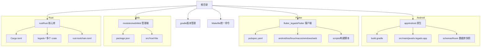
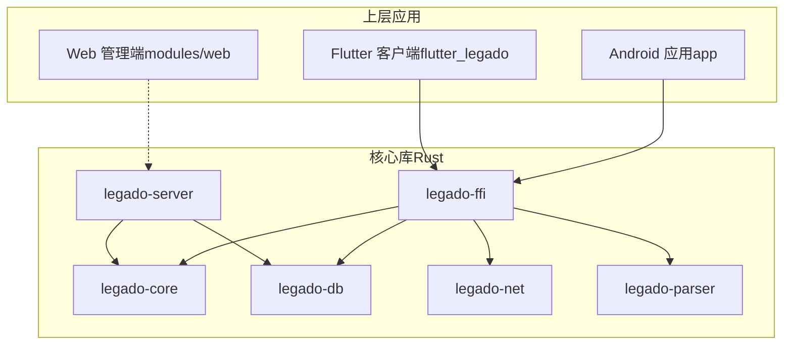
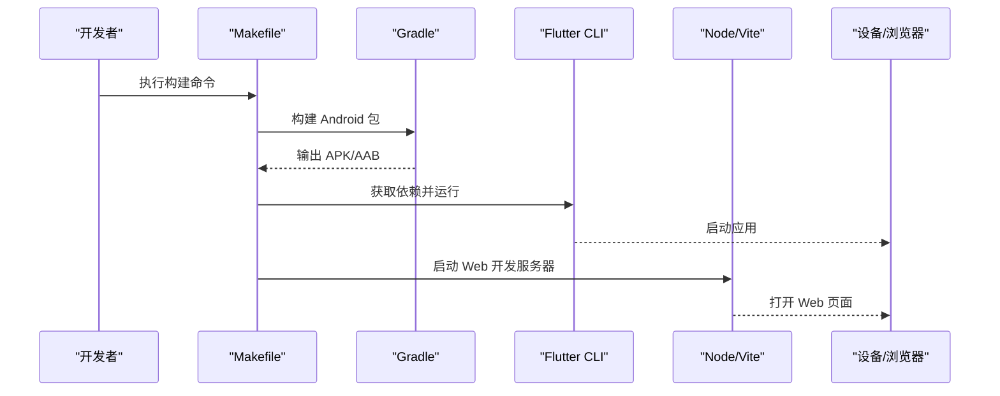
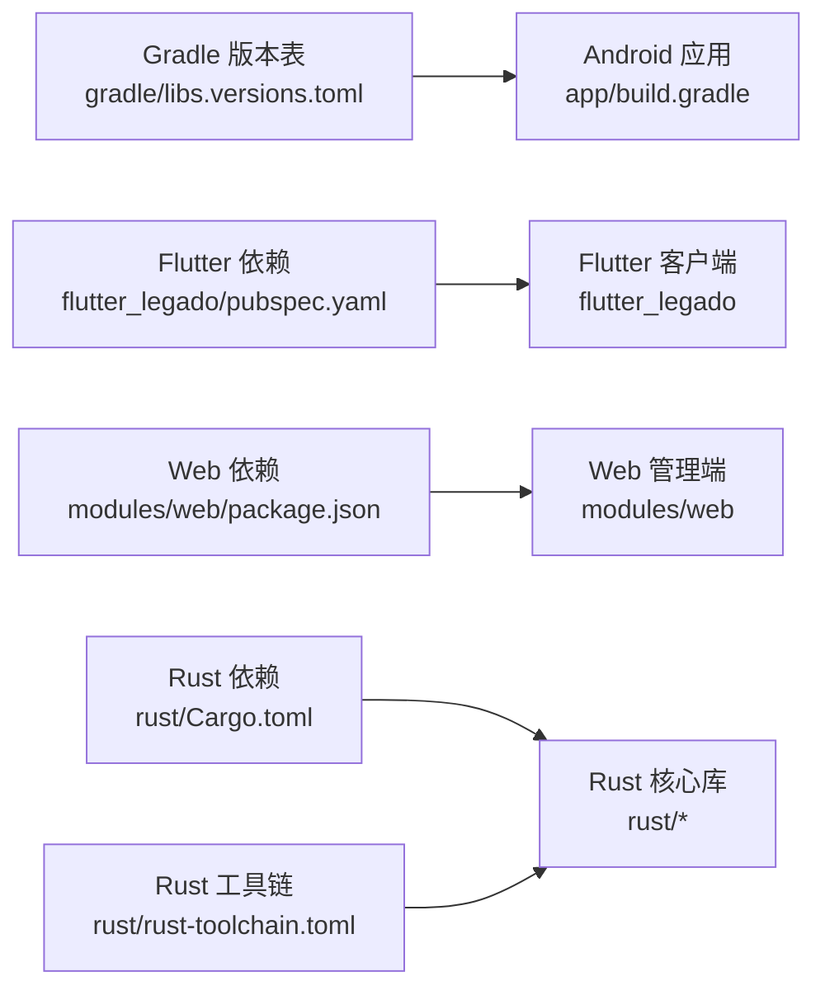

# 快速开始指南

<cite>
**本文引用的文件**   
- [README.md](file://README.md)
- [Makefile](file://Makefile)
- [build.gradle](file://build.gradle)
- [gradle.properties](file://gradle.properties)
- [settings.gradle](file://settings.gradle)
- [app/build.gradle](file://app/build.gradle)
- [flutter_legado/pubspec.yaml](file://flutter_legado/pubspec.yaml)
- [flutter_legado/Makefile](file://flutter_legado/Makefile)
- [flutter_legado/scripts/build-apk.ps1](file://flutter_legado/scripts/build-apk.ps1)
- [modules/web/package.json](file://modules/web/package.json)
- [rust/Cargo.toml](file://rust/Cargo.toml)
- [rust/rust-toolchain.toml](file://rust/rust-toolchain.toml)
</cite>

## 目录
1. [简介](#简介)
2. [项目结构](#项目结构)
3. [核心组件](#核心组件)
4. [架构总览](#架构总览)
5. [详细组件分析](#详细组件分析)
6. [依赖关系分析](#依赖关系分析)
7. [性能考虑](#性能考虑)
8. [故障排除指南](#故障排除指南)
9. [结论](#结论)
10. [附录](#附录)

## 简介
本指南面向首次接触 Legado 的开发者，目标是帮助你在最短时间内完成环境搭建、克隆仓库、安装依赖并成功运行 Android、Flutter 与 Web 三个端。Legado 是一个跨平台阅读与资源管理应用，包含：
- Android 原生模块（Kotlin/Gradle）
- Flutter 跨平台客户端（Android/iOS/Web/Desktop）
- Rust 高性能核心库（FFI 暴露给上层）
- Web 管理端（Vue/Vite）

你将学到：
- 如何安装 JDK、Android Studio、Flutter SDK、Rust Toolchain、Node.js
- 如何配置 Gradle、Rust 编译环境与 Flutter 依赖
- 如何构建和运行 Android APK、Flutter 应用与 Web 服务器
- 常用开发命令与调试技巧
- 常见环境问题与解决方案

## 项目结构
Legado 采用多模块、多语言协作的工程组织方式：
- app：Android 主工程（Kotlin + Gradle），包含数据库 schema、资源、测试等
- flutter_legado：Flutter 客户端（含 Android/iOS/Linux/macOS/Windows/Web 目标）
- modules/web：Web 管理端（Vue + Vite + TypeScript）
- rust：Rust 核心库（按功能拆分多个 crate，通过 FFI 暴露接口）
- gradle：Gradle 版本与依赖版本表
- Makefile：顶层统一命令入口（封装各子模块构建脚本）

**图表来源** 
- [build.gradle](file://build.gradle)
- [app/build.gradle](file://app/build.gradle)
- [flutter_legado/pubspec.yaml](file://flutter_legado/pubspec.yaml)
- [modules/web/package.json](file://modules/web/package.json)
- [rust/Cargo.toml](file://rust/Cargo.toml)
- [rust/rust-toolchain.toml](file://rust/rust-toolchain.toml)

**章节来源**
- [README.md](file://README.md)
- [Makefile](file://Makefile)
- [build.gradle](file://build.gradle)
- [settings.gradle](file://settings.gradle)

## 核心组件
- Android 应用（app）
  - Kotlin 源码位于 app/src/main/java/io.legado.app
  - 使用 Room 数据库，schema 快照在 app/schemas
  - 使用 Gradle 构建，依赖版本由 gradle/libs.versions.toml 管理
- Flutter 客户端（flutter_legado）
  - 标准 Flutter 工程，支持多平台
  - 依赖管理通过 pubspec.yaml，构建脚本在 scripts/
- Web 管理端（modules/web）
  - Vue + Vite + TypeScript
  - 包管理与脚本通过 package.json
- Rust 核心库（rust）
  - 多 crate 拆分（core、db、ffi、net、parser、server、book、js 等）
  - 通过 FFI 暴露 API 给上层调用
  - 工具链由 rust-toolchain.toml 指定

**章节来源**
- [app/build.gradle](file://app/build.gradle)
- [flutter_legado/pubspec.yaml](file://flutter_legado/pubspec.yaml)
- [modules/web/package.json](file://modules/web/package.json)
- [rust/Cargo.toml](file://rust/Cargo.toml)
- [rust/rust-toolchain.toml](file://rust/rust-toolchain.toml)

## 架构总览
Legado 的整体架构围绕“Rust 核心 + 多端接入”展开：
- Rust 提供高性能的数据处理、网络请求、解析、存储与规则引擎能力
- Android 与 Flutter 通过 FFI 调用 Rust 能力
- Web 管理端提供在线编辑与管理能力
- Gradle 与 Makefile 统一构建流程

**图表来源** 
- [rust/Cargo.toml](file://rust/Cargo.toml)
- [app/build.gradle](file://app/build.gradle)
- [flutter_legado/pubspec.yaml](file://flutter_legado/pubspec.yaml)
- [modules/web/package.json](file://modules/web/package.json)

## 详细组件分析

### 环境准备与安装
- JDK：建议安装与 Gradle 兼容的版本（参考 gradle.properties 中的配置）
- Android Studio：用于 Android 构建与模拟器调试
- Flutter SDK：用于 Flutter 客户端开发与构建
- Rust Toolchain：用于 Rust 核心库编译（rust-toolchain.toml 指定版本）
- Node.js：用于 Web 管理端构建与开发

提示：
- 确保环境变量 PATH 中包含 JDK、Android SDK、Flutter、Rust、Node.js 的可执行路径
- 若网络受限，请配置镜像源（Gradle、Flutter、Rust、npm/pnpm）

**章节来源**
- [gradle.properties](file://gradle.properties)
- [rust/rust-toolchain.toml](file://rust/rust-toolchain.toml)

### 克隆仓库与依赖安装
- 克隆仓库后，进入根目录
- 使用 Makefile 提供的统一命令进行初始化与构建（如 make init、make build-android、make run-web 等）
- 各子模块依赖：
  - Android：Gradle 会自动下载依赖（受 gradle/libs.versions.toml 管理）
  - Flutter：flutter pub get
  - Web：pnpm install 或 npm install
  - Rust：cargo build（自动根据 rust-toolchain.toml 选择工具链）

**章节来源**
- [Makefile](file://Makefile)
- [flutter_legado/pubspec.yaml](file://flutter_legado/pubspec.yaml)
- [modules/web/package.json](file://modules/web/package.json)
- [rust/Cargo.toml](file://rust/Cargo.toml)

### 构建与运行示例
- Android APK 生成
  - 使用 Gradle 构建 debug 或 release 包
  - 可通过 Makefile 封装的命令简化操作
- Flutter 应用启动
  - 选择设备后运行 flutter run
  - 支持 Android、iOS、Web、Desktop 等多平台
- Web 服务器部署
  - 使用 Vite 开发服务器或构建静态资源后部署

**图表来源** 
- [Makefile](file://Makefile)
- [app/build.gradle](file://app/build.gradle)
- [flutter_legado/Makefile](file://flutter_legado/Makefile)
- [flutter_legado/scripts/build-apk.ps1](file://flutter_legado/scripts/build-apk.ps1)
- [modules/web/package.json](file://modules/web/package.json)

**章节来源**
- [Makefile](file://Makefile)
- [app/build.gradle](file://app/build.gradle)
- [flutter_legado/Makefile](file://flutter_legado/Makefile)
- [flutter_legado/scripts/build-apk.ps1](file://flutter_legado/scripts/build-apk.ps1)
- [modules/web/package.json](file://modules/web/package.json)

### 常用开发命令与调试技巧
- 通用命令（根目录 Makefile）
  - 初始化环境、清理缓存、全量构建、运行各端
- Android 调试
  - 使用 Android Studio 连接真机或模拟器
  - 查看 Logcat 日志定位问题
- Flutter 调试
  - 使用 hot reload 快速迭代 UI
  - 使用 devtools 分析性能与内存
- Web 调试
  - 使用浏览器开发者工具调试前端逻辑
  - 使用 Vite 插件增强开发体验
- Rust 调试
  - 使用 cargo test 运行单元测试
  - 使用 println! 或日志框架输出调试信息

**章节来源**
- [Makefile](file://Makefile)
- [flutter_legado/Makefile](file://flutter_legado/Makefile)
- [modules/web/package.json](file://modules/web/package.json)

### 第一个应用的构建与运行
- Android
  - 使用 Gradle 构建 debug 包并在设备上运行
  - 检查 app/build.gradle 中的签名与构建变体配置
- Flutter
  - 选择目标平台后运行 flutter run
  - 首次运行会拉取依赖并编译
- Web
  - 安装依赖后启动开发服务器
  - 在浏览器中访问本地地址查看效果

**章节来源**
- [app/build.gradle](file://app/build.gradle)
- [flutter_legado/pubspec.yaml](file://flutter_legado/pubspec.yaml)
- [modules/web/package.json](file://modules/web/package.json)

## 依赖关系分析
- Gradle 依赖版本集中管理于 gradle/libs.versions.toml
- Flutter 依赖通过 pubspec.yaml 声明
- Web 依赖通过 package.json 管理
- Rust 依赖通过 Cargo.toml 管理，工具链版本由 rust-toolchain.toml 指定

**图表来源** 
- [gradle/libs.versions.toml](file://gradle/libs.versions.toml)
- [app/build.gradle](file://app/build.gradle)
- [flutter_legado/pubspec.yaml](file://flutter_legado/pubspec.yaml)
- [modules/web/package.json](file://modules/web/package.json)
- [rust/Cargo.toml](file://rust/Cargo.toml)
- [rust/rust-toolchain.toml](file://rust/rust-toolchain.toml)

**章节来源**
- [gradle/libs.versions.toml](file://gradle/libs.versions.toml)
- [app/build.gradle](file://app/build.gradle)
- [flutter_legado/pubspec.yaml](file://flutter_legado/pubspec.yaml)
- [modules/web/package.json](file://modules/web/package.json)
- [rust/Cargo.toml](file://rust/Cargo.toml)
- [rust/rust-toolchain.toml](file://rust/rust-toolchain.toml)

## 性能考虑
- 合理使用缓存（Gradle、Flutter、Rust、Node）加速构建
- 按需启用代码混淆与资源压缩（ProGuard/R8）
- 避免不必要的重复依赖与冗余资源
- 对 Rust 核心库进行基准测试与优化热点路径
- Web 端注意首屏加载时间与资源体积控制

[本节为通用指导，不直接分析具体文件]

## 故障排除指南
- Gradle 构建失败
  - 检查 JDK 版本与 Android SDK 路径配置
  - 清理缓存后重试（./gradlew clean）
- Flutter 依赖拉取失败
  - 配置国内镜像源（pub、dart、flutter）
  - 删除 .pub-cache 后重新获取
- Rust 编译错误
  - 确认 rust-toolchain.toml 指定的工具链已安装
  - 清理目标目录后重新构建（cargo clean）
- Web 启动失败
  - 检查 Node.js 版本与 pnpm/npm 安装
  - 清理 node_modules 后重新安装依赖

**章节来源**
- [Makefile](file://Makefile)
- [flutter_legado/Makefile](file://flutter_legado/Makefile)
- [modules/web/package.json](file://modules/web/package.json)
- [rust/Cargo.toml](file://rust/Cargo.toml)
- [rust/rust-toolchain.toml](file://rust/rust-toolchain.toml)

## 结论
通过本指南，你应能顺利完成 Legado 的环境搭建、依赖安装与多端构建运行。建议在熟悉基本流程后，逐步深入各模块源码与构建脚本，结合调试技巧提升开发效率。遇到问题时，优先检查环境变量、镜像源与缓存状态，再逐步定位具体问题。

[本节为总结性内容，不直接分析具体文件]

## 附录
- 推荐工具
  - Android Studio、VS Code（Flutter/Rust/TS 插件）、命令行终端
- 常用命令速查
  - 根目录：make init、make build-android、make run-web
  - Flutter：flutter pub get、flutter run
  - Web：pnpm install、pnpm dev
  - Rust：cargo build、cargo test

[本节为补充信息，不直接分析具体文件]