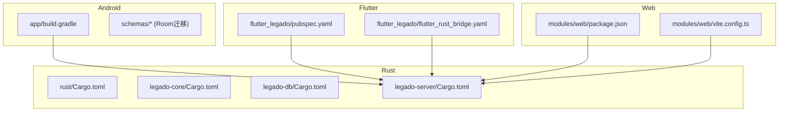
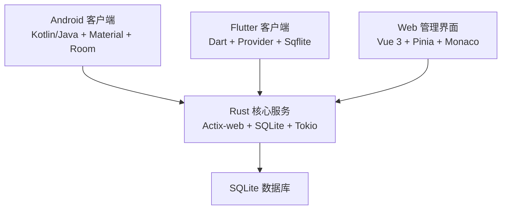
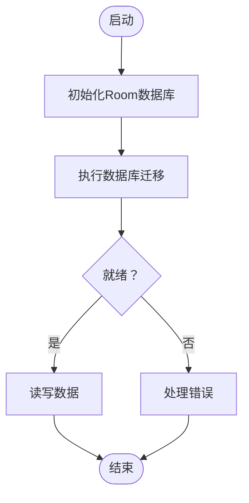
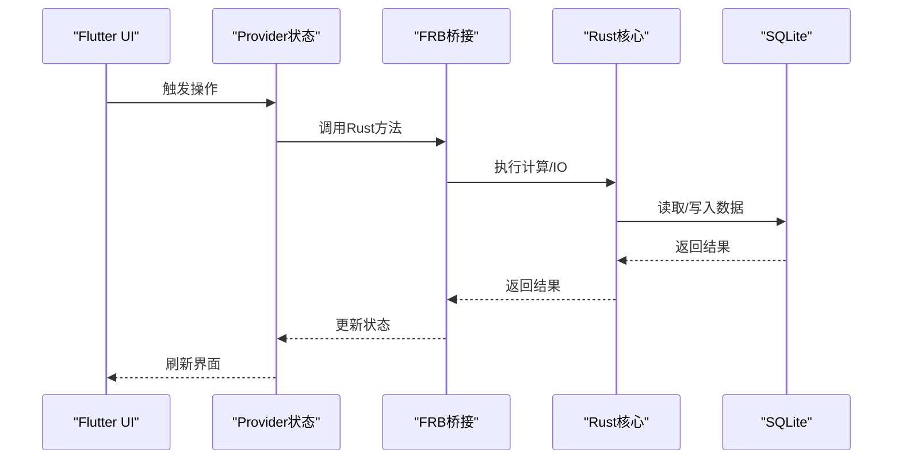
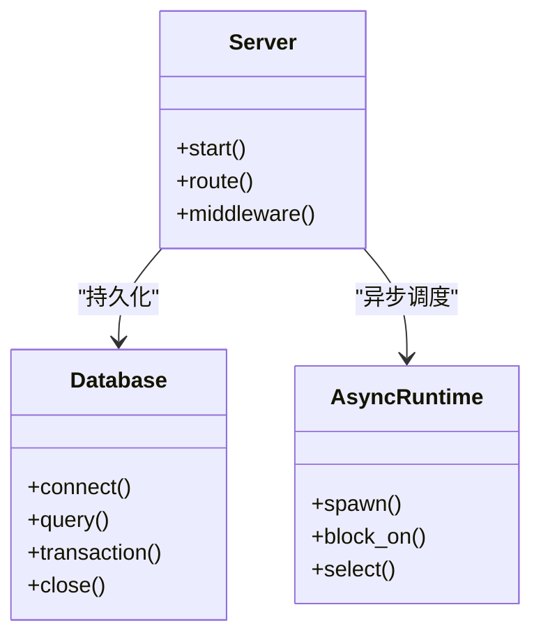
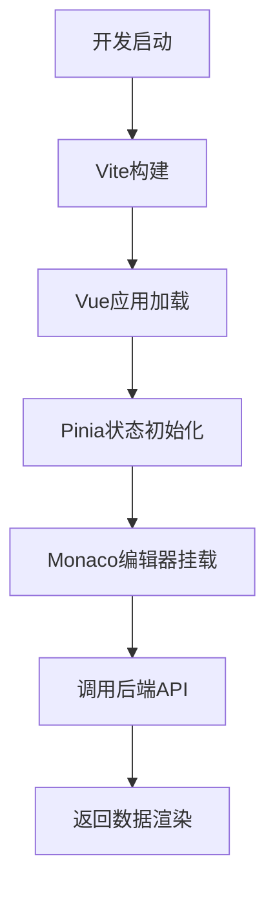
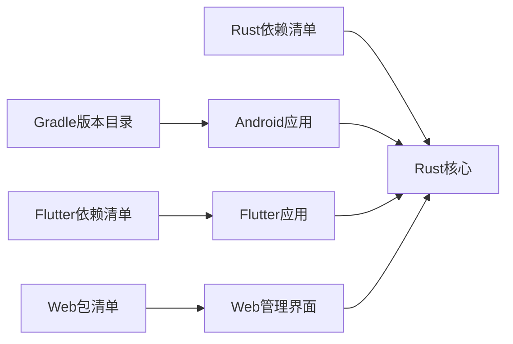

# 技术栈概览

<cite>
**本文引用的文件**   
- [README.md](file://README.md)
- [app/build.gradle](file://app/build.gradle)
- [gradle/libs.versions.toml](file://gradle/libs.versions.toml)
- [flutter_legado/pubspec.yaml](file://flutter_legado/pubspec.yaml)
- [flutter_legado/flutter_rust_bridge.yaml](file://flutter_legado/flutter_rust_bridge.yaml)
- [rust/Cargo.toml](file://rust/Cargo.toml)
- [rust/legado-core/Cargo.toml](file://rust/legado-core/Cargo.toml)
- [rust/legado-db/Cargo.toml](file://rust/legado-db/Cargo.toml)
- [rust/legado-server/Cargo.toml](file://rust/legado-server/Cargo.toml)
- [modules/web/package.json](file://modules/web/package.json)
- [modules/web/vite.config.ts](file://modules/web/vite.config.ts)
- [.github/dependabot.yml](file://.github/dependabot.yml)
</cite>

## 目录
1. [简介](#简介)
2. [项目结构](#项目结构)
3. [核心组件](#核心组件)
4. [架构总览](#架构总览)
5. [详细组件分析](#详细组件分析)
6. [依赖关系分析](#依赖关系分析)
7. [性能考量](#性能考量)
8. [故障排查指南](#故障排查指南)
9. [结论](#结论)
10. [附录](#附录)

## 简介
本技术栈概览面向Legado项目的多端、多语言、多运行时架构，覆盖Android原生（Kotlin/Java + Material Design + Room）、Flutter跨平台（Dart + Provider + Sqflite）、Rust核心库（Actix-web + SQLite + Tokio异步）与Web管理界面（Vue 3 + Pinia + Monaco编辑器）。文档从系统架构、组件关系、数据流、处理逻辑、集成点、错误处理、性能特征等维度展开，并给出版本管理策略、依赖更新机制、兼容性矩阵与升级路径建议，帮助读者快速理解与高效维护。

## 项目结构
Legado采用多模块、多仓库风格的工程组织：
- Android应用位于 app 目录，使用Gradle构建，包含大量资源与测试用例，Room数据库迁移脚本集中存放于 schemas 目录。
- Flutter跨平台应用位于 flutter_legado 目录，使用pub管理依赖，通过flutter_rust_bridge与Rust核心交互。
- Rust核心库位于 rust 目录，按功能拆分为多个crate（core、db、server、ffi、net、parser、book、js），统一由Cargo管理。
- Web管理界面位于 modules/web 目录，基于Vite+Vue 3构建，使用pnpm进行包管理。
- 顶层配置与CI脚本位于根目录，如Makefile、.github/workflows、.github/dependabot.yml等。

图表来源
- [app/build.gradle](file://app/build.gradle)
- [flutter_legado/pubspec.yaml](file://flutter_legado/pubspec.yaml)
- [flutter_legado/flutter_rust_bridge.yaml](file://flutter_legado/flutter_rust_bridge.yaml)
- [rust/Cargo.toml](file://rust/Cargo.toml)
- [rust/legado-core/Cargo.toml](file://rust/legado-core/Cargo.toml)
- [rust/legado-db/Cargo.toml](file://rust/legado-db/Cargo.toml)
- [rust/legado-server/Cargo.toml](file://rust/legado-server/Cargo.toml)
- [modules/web/package.json](file://modules/web/package.json)
- [modules/web/vite.config.ts](file://modules/web/vite.config.ts)

章节来源
- [README.md](file://README.md)

## 核心组件
- Android层：Kotlin/Java实现UI与业务，Material Design提供一致的视觉体验；Room作为本地持久化方案，配合迁移脚本保障数据演进。
- Flutter层：Dart编写跨平台UI，Provider管理状态，Sqflite用于本地存储；通过flutter_rust_bridge调用Rust核心能力。
- Rust核心：Actix-web提供HTTP服务，SQLite负责持久化，Tokio驱动异步I/O；模块化设计便于扩展与维护。
- Web管理界面：Vue 3 + Pinia管理状态，Monaco编辑器用于源码编辑；Vite构建优化开发体验与打包体积。

章节来源
- [app/build.gradle](file://app/build.gradle)
- [flutter_legado/pubspec.yaml](file://flutter_legado/pubspec.yaml)
- [rust/Cargo.toml](file://rust/Cargo.toml)
- [modules/web/package.json](file://modules/web/package.json)

## 架构总览
整体架构以Rust为核心服务与计算引擎，Android与Flutter作为客户端接入，Web管理界面用于管理与调试。数据持久化主要依赖SQLite，网络请求由Rust层统一处理，前端通过API或桥接调用Rust能力。

图表来源
- [rust/legado-server/Cargo.toml](file://rust/legado-server/Cargo.toml)
- [rust/legado-db/Cargo.toml](file://rust/legado-db/Cargo.toml)
- [app/build.gradle](file://app/build.gradle)
- [flutter_legado/pubspec.yaml](file://flutter_legado/pubspec.yaml)
- [modules/web/package.json](file://modules/web/package.json)

## 详细组件分析

### Android层（Kotlin/Java + Material Design + Room）
- UI与交互：遵循Material Design规范，提供一致的用户体验。
- 数据持久化：Room作为ORM，简化SQLite操作，支持类型安全查询与迁移。
- 构建与依赖：Gradle统一管理依赖与构建流程，libs.versions.toml集中定义版本。

图表来源
- [app/build.gradle](file://app/build.gradle)
- [gradle/libs.versions.toml](file://gradle/libs.versions.toml)

章节来源
- [app/build.gradle](file://app/build.gradle)
- [gradle/libs.versions.toml](file://gradle/libs.versions.toml)

### Flutter层（Dart + Provider + Sqflite）
- 状态管理：Provider集中管理应用状态，简化数据流与UI更新。
- 本地存储：Sqflite提供轻量级SQLite封装，适合移动端离线场景。
- 与Rust交互：通过flutter_rust_bridge生成绑定代码，直接调用Rust函数。

图表来源
- [flutter_legado/pubspec.yaml](file://flutter_legado/pubspec.yaml)
- [flutter_legado/flutter_rust_bridge.yaml](file://flutter_legado/flutter_rust_bridge.yaml)

章节来源
- [flutter_legado/pubspec.yaml](file://flutter_legado/pubspec.yaml)
- [flutter_legado/flutter_rust_bridge.yaml](file://flutter_legado/flutter_rust_bridge.yaml)

### Rust核心（Actix-web + SQLite + Tokio）
- 网络服务：Actix-web提供高性能HTTP API，支持并发与中间件。
- 异步运行时：Tokio驱动非阻塞I/O，提升吞吐与响应速度。
- 数据访问：SQLite作为嵌入式数据库，结合迁移与仓库模式保证数据一致性。

图表来源
- [rust/legado-server/Cargo.toml](file://rust/legado-server/Cargo.toml)
- [rust/legado-db/Cargo.toml](file://rust/legado-db/Cargo.toml)
- [rust/legado-core/Cargo.toml](file://rust/legado-core/Cargo.toml)

章节来源
- [rust/legado-server/Cargo.toml](file://rust/legado-server/Cargo.toml)
- [rust/legado-db/Cargo.toml](file://rust/legado-db/Cargo.toml)
- [rust/legado-core/Cargo.toml](file://rust/legado-core/Cargo.toml)

### Web管理界面（Vue 3 + Pinia + Monaco）
- 框架与状态：Vue 3组合式API + Pinia状态管理，组件化与可维护性高。
- 编辑器：Monaco提供IDE级代码编辑体验，便于规则与脚本管理。
- 构建工具：Vite加速开发与构建，插件生态丰富。

图表来源
- [modules/web/package.json](file://modules/web/package.json)
- [modules/web/vite.config.ts](file://modules/web/vite.config.ts)

章节来源
- [modules/web/package.json](file://modules/web/package.json)
- [modules/web/vite.config.ts](file://modules/web/vite.config.ts)

## 依赖关系分析
- Android依赖：Gradle与libs.versions.toml集中管理第三方库版本，确保一致性。
- Flutter依赖：pubspec.yaml声明Dart包与版本约束，flutter_rust_bridge.yaml配置桥接参数。
- Rust依赖：Cargo.toml定义crate间依赖与特性开关，统一版本锁定。
- Web依赖：package.json与pnpm-lock.yaml管理前端包版本，Vite配置构建行为。

图表来源
- [gradle/libs.versions.toml](file://gradle/libs.versions.toml)
- [flutter_legado/pubspec.yaml](file://flutter_legado/pubspec.yaml)
- [rust/Cargo.toml](file://rust/Cargo.toml)
- [modules/web/package.json](file://modules/web/package.json)

章节来源
- [gradle/libs.versions.toml](file://gradle/libs.versions.toml)
- [flutter_legado/pubspec.yaml](file://flutter_legado/pubspec.yaml)
- [rust/Cargo.toml](file://rust/Cargo.toml)
- [modules/web/package.json](file://modules/web/package.json)

## 性能考量
- Android：Room减少SQL样板代码，迁移脚本避免运行时Schema变更开销；合理使用索引与查询优化。
- Flutter：Provider避免不必要的重建，Sqflite批量操作降低IO压力；注意内存与线程模型。
- Rust：Actix-web高并发处理能力，Tokio异步I/O提升吞吐；SQLite连接池与事务优化。
- Web：Vite按需编译与热更新，Monaco懒加载减少初始负载；静态资源压缩与缓存策略。

## 故障排查指南
- Android：检查Room迁移脚本与数据库版本匹配；查看日志定位异常堆栈。
- Flutter：确认flutter_rust_bridge生成代码与Rust接口一致；检查Provider状态更新逻辑。
- Rust：验证Actix路由与中间件配置；监控Tokio任务调度与资源泄漏。
- Web：审查Vite构建输出与依赖树；调试Monaco编辑器事件与API调用。

## 结论
Legado通过多端协作与Rust核心服务，实现了高性能、可扩展的阅读器生态。Android与Flutter分别覆盖原生与跨平台需求，Web管理界面提供便捷管理能力。统一的依赖管理与自动化更新机制保障了长期维护效率。建议持续跟踪各技术栈版本动态，定期评估升级影响与收益。

## 附录

### 版本管理策略与依赖更新机制
- Android：使用Gradle版本目录集中管理依赖，便于统一升级与回滚。
- Flutter：pubspec.yaml声明版本约束，结合CI自动检测更新。
- Rust：Cargo.lock锁定具体版本，依赖更新需人工审核与测试。
- Web：package.json与pnpm-lock.yaml管理依赖，建议使用自动化工具扫描漏洞。
- 自动化：.github/dependabot.yml配置依赖更新PR，促进持续集成与发布。

章节来源
- [.github/dependabot.yml](file://.github/dependabot.yml)

### 技术栈兼容性矩阵与升级路径
- Android：Kotlin/Java与Material Design兼容当前Android API级别；Room迁移需向后兼容。
- Flutter：Dart版本与Provider/Sqflite需保持兼容；flutter_rust_bridge版本与Rust ABI对齐。
- Rust：Actix-web与Tokio版本需协同升级；SQLite驱动与迁移脚本保持一致。
- Web：Vue 3与Pinia/Monaco版本需匹配；Vite插件与Node版本要求明确。

升级路径建议：
- 小版本优先：先升级补丁版本，验证稳定性后再推进主版本。
- 分阶段迁移：先在开发环境验证，再逐步推广至测试与生产。
- 回归测试：重点验证数据迁移、网络请求与UI交互。
- 回滚预案：保留旧版本构建产物与依赖快照，便于快速回退。