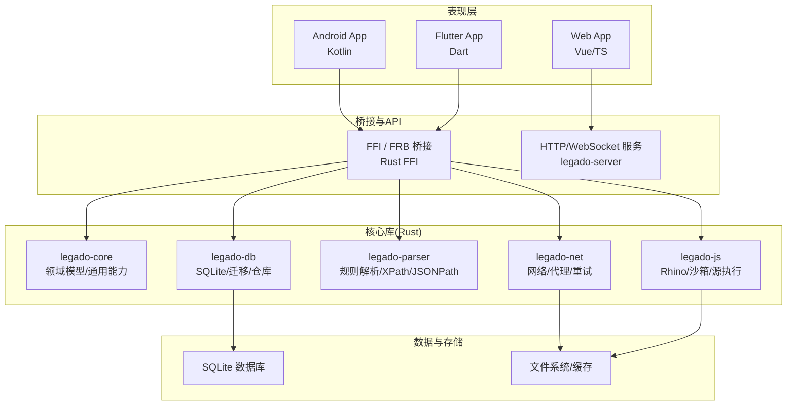
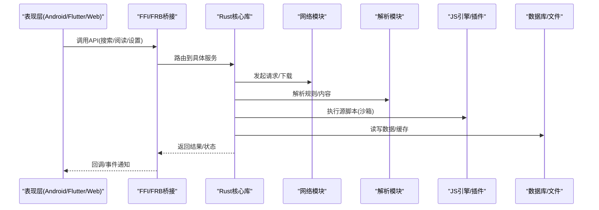
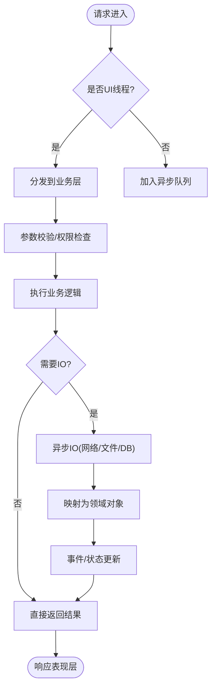
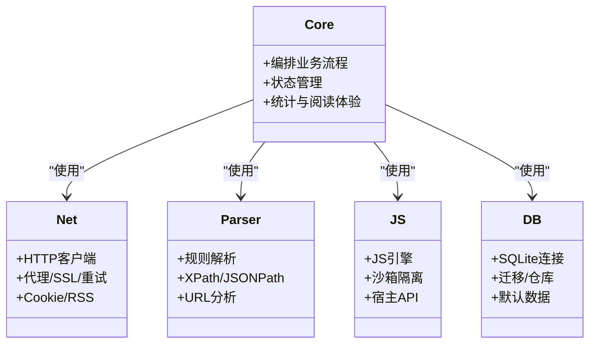
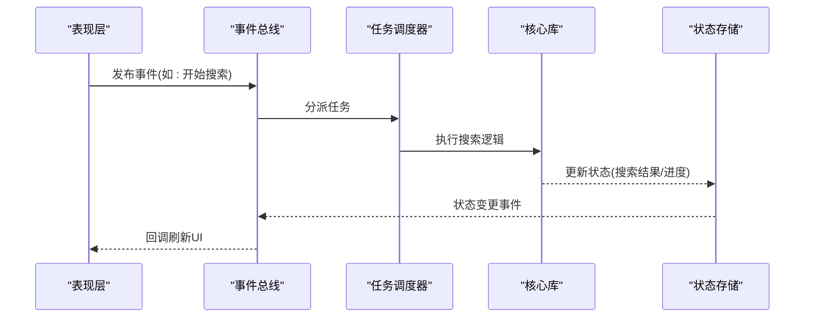
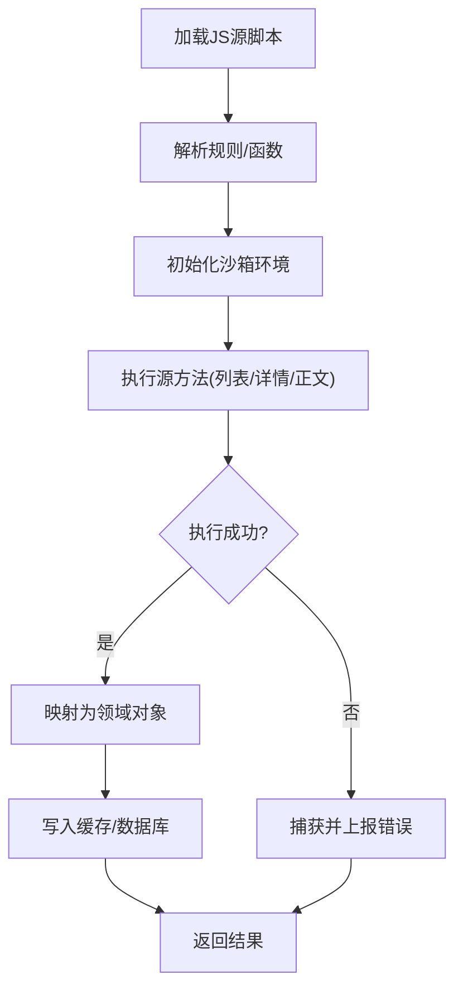
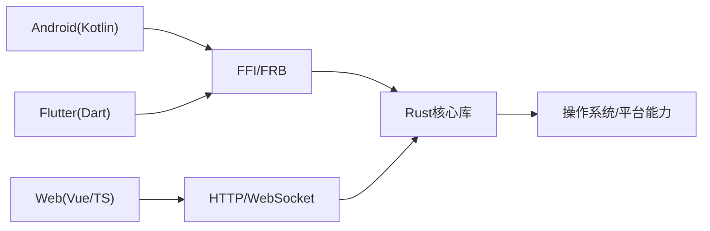
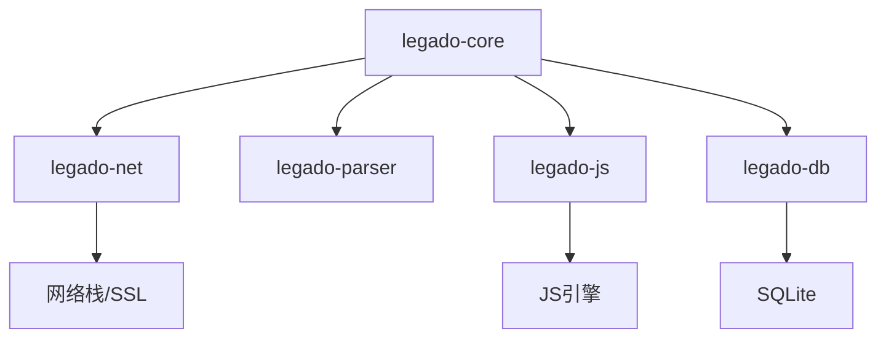

# 架构设计理念

<cite>
**本文引用的文件**   
- [README.md](file://README.md)
- [app/src/main/java/io/legado/app/App.kt](file://app/src/main/java/io/legado/app/App.kt)
- [flutter_legado/lib/main.dart](file://flutter_legado/lib/main.dart)
- [flutter_legado/flutter_rust_bridge.yaml](file://flutter_legado/flutter_rust_bridge.yaml)
- [rust/Cargo.toml](file://rust/Cargo.toml)
- [rust/legado-core/src/lib.rs](file://rust/legado-core/src/lib.rs)
- [rust/legado-db/src/lib.rs](file://rust/legado-db/src/lib.rs)
- [rust/legado-ffi/src/lib.rs](file://rust/legado-ffi/src/lib.rs)
- [rust/legado-js/src/lib.rs](file://rust/legado-js/src/lib.rs)
- [rust/legado-net/src/lib.rs](file://rust/legado-net/src/lib.rs)
- [rust/legado-parser/src/lib.rs](file://rust/legado-parser/src/lib.rs)
- [rust/legado-server/src/lib.rs](file://rust/legado-server/src/lib.rs)
- [modules/web/src/main.ts](file://modules/web/src/main.ts)
</cite>

## 目录
1. [简介](#简介)
2. [项目结构](#项目结构)
3. [核心组件](#核心组件)
4. [架构总览](#架构总览)
5. [详细组件分析](#详细组件分析)
6. [依赖分析](#依赖分析)
7. [性能考虑](#性能考虑)
8. [故障排查指南](#故障排查指南)
9. [结论](#结论)
10. [附录](#附录)

## 简介
本文件面向Legado项目的架构设计理念，围绕分层架构、模块化设计、事件驱动、插件体系与跨平台适配展开系统性阐述。目标是通过清晰的职责划分与稳定的接口抽象，帮助开发者快速理解系统整体思路，并在扩展与维护中保持一致性与可演进性。

## 项目结构
Legado采用多语言、多模块的混合工程：
- 表现层：Android（Kotlin）、Flutter（Dart）、Web（Vue/TS）
- 业务逻辑层：Rust核心库（legado-core/net/parser/js/db等）
- 数据访问层：SQLite（通过Rust DB封装）、文件系统（网络缓存、本地资源）
- 服务与桥接：FFI/Frust Bridge、WebSocket/HTTP Server、JS引擎沙箱

图表来源 
- [rust/Cargo.toml](file://rust/Cargo.toml)
- [flutter_legado/flutter_rust_bridge.yaml](file://flutter_legado/flutter_rust_bridge.yaml)
- [app/src/main/java/io/legado/app/App.kt](file://app/src/main/java/io/legado/app/App.kt)
- [flutter_legado/lib/main.dart](file://flutter_legado/lib/main.dart)
- [modules/web/src/main.ts](file://modules/web/src/main.ts)

章节来源
- [README.md](file://README.md)

## 核心组件
- 表现层（Android/Flutter/Web）
  - Android：应用入口、UI与系统能力集成，通过FFI调用Rust核心能力。
  - Flutter：跨端UI与状态管理，通过FRB生成绑定调用Rust API。
  - Web：浏览器端界面，通过HTTP/WebSocket与后端服务交互。
- 业务逻辑层（Rust核心库）
  - legado-core：领域模型、通用算法、状态机、统计与阅读体验相关能力。
  - legado-net：网络请求、Cookie、代理、SSL、重试、速率限制、RSS等。
  - legado-parser：规则解析、XPath/JSONPath、URL分析、正则引擎。
  - legado-js：JS引擎、沙箱隔离、宿主API暴露、源脚本运行环境。
  - legado-db：SQLite连接、迁移、仓库模式、默认数据导入。
- 数据访问层（SQLite/文件系统）
  - SQLite：结构化数据持久化，版本迁移与一致性保障。
  - 文件系统：缓存、下载、媒体文件与静态资源管理。

章节来源
- [rust/legado-core/src/lib.rs](file://rust/legado-core/src/lib.rs)
- [rust/legado-net/src/lib.rs](file://rust/legado-net/src/lib.rs)
- [rust/legado-parser/src/lib.rs](file://rust/legado-parser/src/lib.rs)
- [rust/legado-js/src/lib.rs](file://rust/legado-js/src/lib.rs)
- [rust/legado-db/src/lib.rs](file://rust/legado-db/src/lib.rs)

## 架构总览
Legado采用“表现层—桥接层—核心库—数据层”的分层架构，并通过模块化与事件驱动实现高内聚、低耦合。关键要点：
- 分层清晰：UI不直接操作数据，而是通过稳定API调用核心库。
- 模块化：按功能域拆分crate，减少循环依赖，提升可测试性。
- 事件驱动：异步任务、消息总线与状态更新解耦UI与后台处理。
- 插件体系：JS源作为规则驱动的插件，动态加载与沙箱隔离确保安全。
- 跨平台：FFI/FRB统一抽象，平台差异在底层封装。

图表来源 
- [rust/legado-ffi/src/lib.rs](file://rust/legado-ffi/src/lib.rs)
- [flutter_legado/flutter_rust_bridge.yaml](file://flutter_legado/flutter_rust_bridge.yaml)
- [rust/legado-core/src/lib.rs](file://rust/legado-core/src/lib.rs)
- [rust/legado-net/src/lib.rs](file://rust/legado-net/src/lib.rs)
- [rust/legado-parser/src/lib.rs](file://rust/legado-parser/src/lib.rs)
- [rust/legado-js/src/lib.rs](file://rust/legado-js/src/lib.rs)
- [rust/legado-db/src/lib.rs](file://rust/legado-db/src/lib.rs)

## 详细组件分析

### 分层架构设计
- 表现层职责
  - 用户交互、页面导航、主题与国际化、平台特性接入。
  - 通过FFI/FRB或HTTP/WebSocket调用核心能力，避免直接访问数据。
- 业务逻辑层职责
  - 领域模型与流程编排；网络、解析、JS执行、缓存策略。
  - 提供稳定API，屏蔽底层实现细节。
- 数据访问层职责
  - 统一的Repository抽象；事务与迁移；IO与并发控制。
  - 对上层暴露一致的数据接口，隐藏SQLite与文件系统差异。

图表来源 
- [rust/legado-core/src/lib.rs](file://rust/legado-core/src/lib.rs)
- [rust/legado-db/src/lib.rs](file://rust/legado-db/src/lib.rs)
- [rust/legado-net/src/lib.rs](file://rust/legado-net/src/lib.rs)

章节来源
- [app/src/main/java/io/legado/app/App.kt](file://app/src/main/java/io/legado/app/App.kt)
- [flutter_legado/lib/main.dart](file://flutter_legado/lib/main.dart)
- [modules/web/src/main.ts](file://modules/web/src/main.ts)

### 模块化设计原则
- 按功能域划分模块：core/net/parser/js/db/server各自聚焦单一职责。
- 接口抽象：对外暴露稳定的API，内部实现可替换。
- 依赖倒置：上层定义接口，下层实现；避免上层依赖下层的细节。
- 松耦合：通过事件与消息传递降低模块间直接调用。

图表来源 
- [rust/Cargo.toml](file://rust/Cargo.toml)
- [rust/legado-core/src/lib.rs](file://rust/legado-core/src/lib.rs)
- [rust/legado-net/src/lib.rs](file://rust/legado-net/src/lib.rs)
- [rust/legado-parser/src/lib.rs](file://rust/legado-parser/src/lib.rs)
- [rust/legado-js/src/lib.rs](file://rust/legado-js/src/lib.rs)
- [rust/legado-db/src/lib.rs](file://rust/legado-db/src/lib.rs)

章节来源
- [rust/Cargo.toml](file://rust/Cargo.toml)

### 事件驱动架构
- 异步处理：网络请求、文件IO、数据库操作均异步化，避免阻塞UI。
- 消息传递：通过事件总线/回调机制解耦生产者与消费者。
- 状态管理：核心库维护全局/局部状态，表现层订阅变化。
- 并发控制：限流、重试、超时、取消令牌确保稳定性。

图表来源 
- [rust/legado-core/src/lib.rs](file://rust/legado-core/src/lib.rs)
- [rust/legado-db/src/lib.rs](file://rust/legado-db/src/lib.rs)

章节来源
- [rust/legado-core/src/lib.rs](file://rust/legado-core/src/lib.rs)

### 插件架构设计
- 规则引擎：基于XPath/JSONPath/正则的规则配置，驱动内容抓取与转换。
- 动态加载：JS源脚本按需加载，支持热更新与版本兼容。
- 沙箱隔离：限制危险API，白名单机制保护宿主安全。
- 安全控制：权限、超时、内存限制、错误隔离。

图表来源 
- [rust/legado-js/src/lib.rs](file://rust/legado-js/src/lib.rs)
- [rust/legado-parser/src/lib.rs](file://rust/legado-parser/src/lib.rs)

章节来源
- [rust/legado-js/src/lib.rs](file://rust/legado-js/src/lib.rs)
- [rust/legado-parser/src/lib.rs](file://rust/legado-parser/src/lib.rs)

### 跨平台适配策略
- FFI接口设计：统一C ABI/FRB绑定，屏蔽平台差异。
- 平台特定功能封装：Android/iOS/Web的差异在底层实现，上层调用一致。
- 统一API抽象：表现层仅依赖稳定接口，便于移植与替换。

图表来源 
- [flutter_legado/flutter_rust_bridge.yaml](file://flutter_legado/flutter_rust_bridge.yaml)
- [rust/legado-ffi/src/lib.rs](file://rust/legado-ffi/src/lib.rs)
- [rust/legado-server/src/lib.rs](file://rust/legado-server/src/lib.rs)

章节来源
- [flutter_legado/flutter_rust_bridge.yaml](file://flutter_legado/flutter_rust_bridge.yaml)
- [rust/legado-ffi/src/lib.rs](file://rust/legado-ffi/src/lib.rs)
- [rust/legado-server/src/lib.rs](file://rust/legado-server/src/lib.rs)

## 依赖分析
- 模块内聚与耦合
  - core聚合net/parser/js/db的能力，对外暴露统一API。
  - net/parser/js/db之间保持单向依赖，避免循环。
- 外部依赖
  - SQLite用于持久化；网络库用于HTTP/HTTPS；JS引擎用于脚本执行。
- 潜在风险
  - 大型同步操作需异步化；错误传播需标准化；资源释放需明确。

图表来源 
- [rust/Cargo.toml](file://rust/Cargo.toml)

章节来源
- [rust/Cargo.toml](file://rust/Cargo.toml)

## 性能考虑
- 异步与并发
  - 网络请求、文件IO、数据库查询全部异步化，配合线程池与背压。
- 缓存策略
  - 多级缓存（内存/磁盘/网络），合理TTL与失效策略。
- 资源管理
  - 连接池、句柄复用、内存限制与泄漏检测。
- 序列化与解析
  - 选择高效格式（如二进制/压缩），减少CPU与带宽消耗。

[本节为通用指导，不直接分析具体文件]

## 故障排查指南
- 常见问题定位
  - 网络异常：检查代理/SSL/重试策略与超时配置。
  - 解析失败：核对规则表达式与目标站点结构变化。
  - 插件错误：查看沙箱日志、权限与内存限制。
  - 数据不一致：检查事务与迁移脚本。
- 调试建议
  - 启用详细日志与追踪ID；使用断点与远程调试。
  - 单元测试覆盖关键路径；集成测试验证端到端流程。

章节来源
- [rust/legado-core/src/lib.rs](file://rust/legado-core/src/lib.rs)
- [rust/legado-net/src/lib.rs](file://rust/legado-net/src/lib.rs)
- [rust/legado-js/src/lib.rs](file://rust/legado-js/src/lib.rs)
- [rust/legado-db/src/lib.rs](file://rust/legado-db/src/lib.rs)

## 结论
Legado通过清晰的分层、稳健的模块化、事件驱动与插件体系，实现了高性能、可扩展与跨平台的阅读体验。建议在后续演进中持续强化接口契约、完善监控与可观测性，并优化缓存与并发策略，以支撑更大规模的使用场景。

[本节为总结，不直接分析具体文件]

## 附录
- 术语表
  - FFI：外部函数接口，用于跨语言调用。
  - FRB：Flutter Rust Bridge，用于Dart与Rust的绑定生成。
  - Repository：数据访问抽象，屏蔽存储细节。
  - 沙箱：受限的执行环境，保障宿主安全。

[本节为概念说明，不直接分析具体文件]