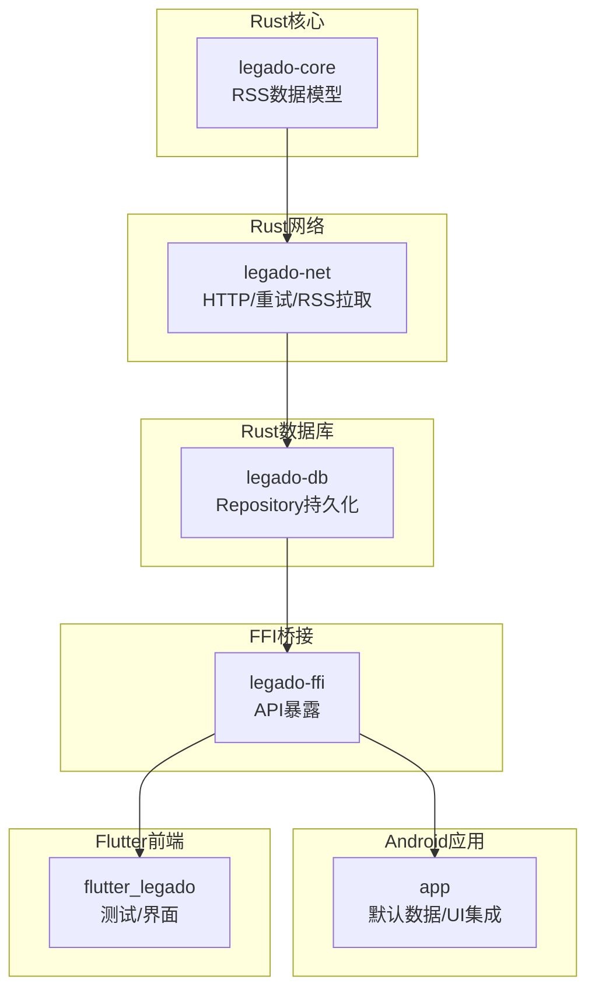
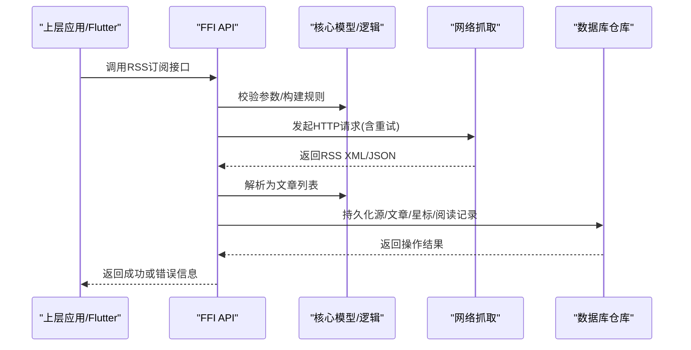
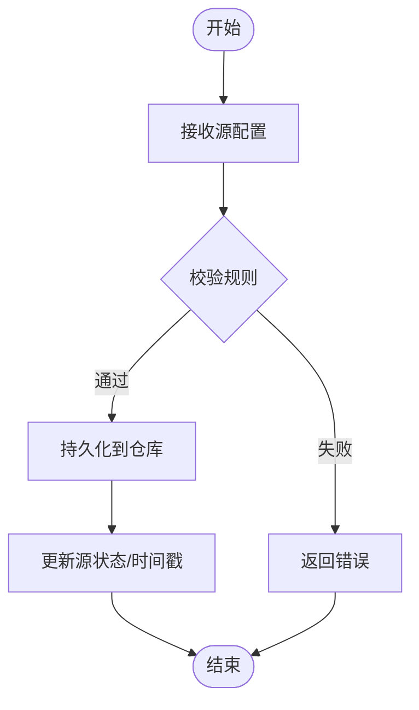
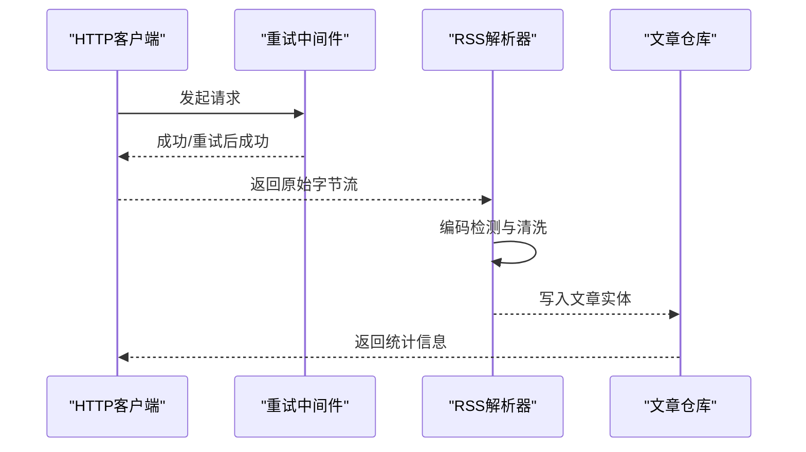
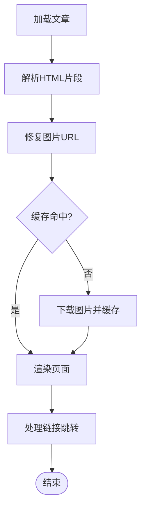
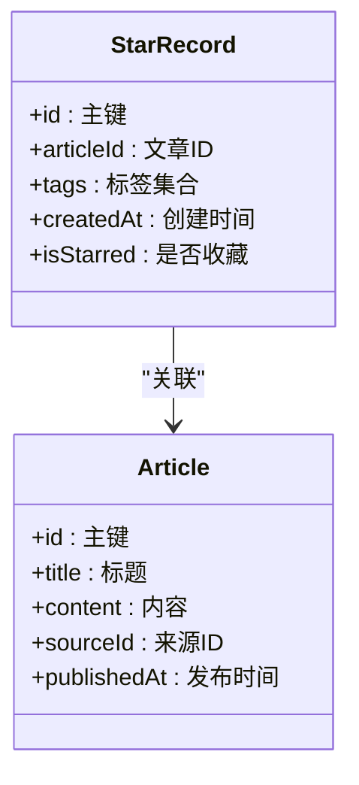
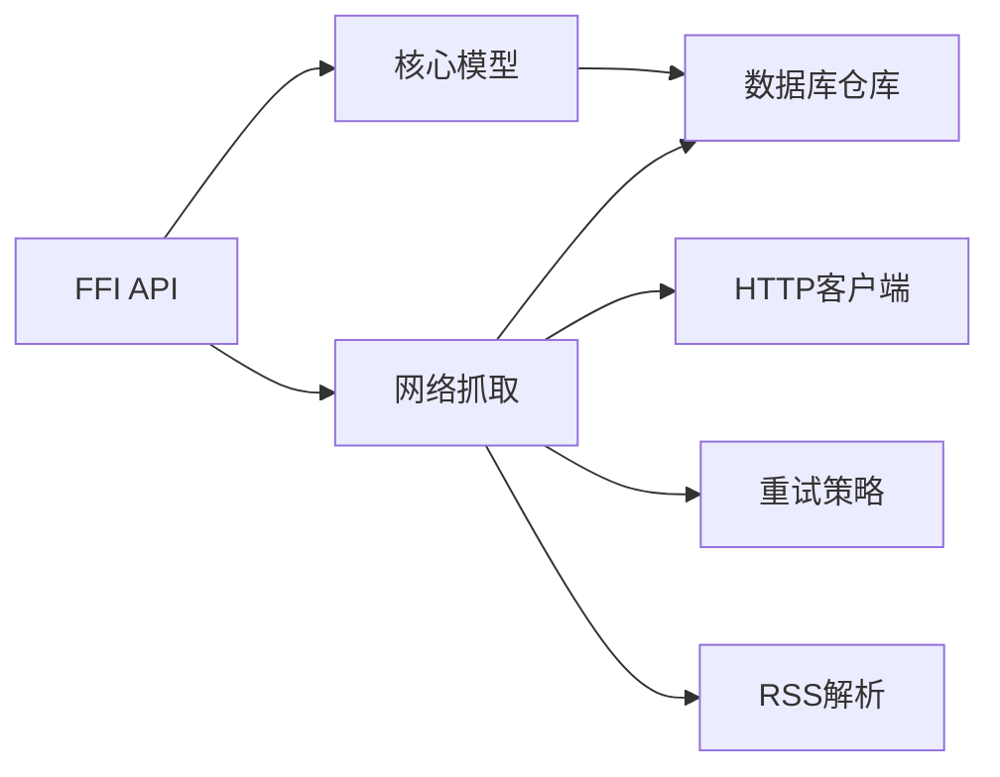

# RSS订阅系统

<cite>
**本文引用的文件**   
- [rss_source.rs](file://rust/legado-core/src/models/rss_source.rs)
- [rss_article_repository.rs](file://rust/legado-db/src/repository/rss_article_repository.rs)
- [rss_source_repository.rs](file://rust/legado-db/src/repository/rss_source_repository.rs)
- [rss_star_repository.rs](file://rust/legado-db/src/repository/rss_star_repository.rs)
- [rss_read_record_repository.rs](file://rust/legado-db/src/repository/rss_read_record_repository.rs)
- [rss.rs](file://rust/legado-net/src/rss.rs)
- [client.rs](file://rust/legado-net/src/client.rs)
- [retry.rs](file://rust/legado-net/src/retry.rs)
- [rss_api.rs](file://rust/legado-ffi/src/api/rss.rs)
- [rss_star_api.rs](file://rust/legado-ffi/src/api/rss_star_api.rs)
- [rss.xml](file://app/src/main/assets/defaultData/rss.xml)
- [rss_provider_test.dart](file://flutter_legado/test/unit/rss_provider_test.dart)
</cite>

## 目录
1. [简介](#简介)
2. [项目结构](#项目结构)
3. [核心组件](#核心组件)
4. [架构总览](#架构总览)
5. [详细组件分析](#详细组件分析)
6. [依赖分析](#依赖分析)
7. [性能考虑](#性能考虑)
8. [故障排查指南](#故障排查指南)
9. [结论](#结论)
10. [附录](#附录)

## 简介
本技术文档面向Legado的RSS订阅系统，覆盖以下关键能力：
- RSS源管理：订阅添加、编辑删除、分类组织与状态监控
- 内容抓取机制：HTTP请求处理、XML解析、编码检测与错误重试
- 文章阅读功能：富文本渲染、图片加载、链接跳转与离线缓存
- 收藏管理：星标操作、标签分类、搜索过滤与批量管理
- RSS规范支持、性能优化策略与常见问题解决方案

## 项目结构
Legado的RSS子系统采用多语言分层架构：
- Rust核心层（legado-core）：定义RSS数据模型与领域逻辑
- Rust网络层（legado-net）：负责HTTP请求、重试、RSS拉取与解析
- Rust数据库层（legado-db）：通过Repository模式持久化RSS源、文章、星标与阅读记录
- FFI桥接层（legado-ffi）：暴露API给上层应用（Android/Flutter）
- Android应用层（app）：默认数据与UI集成
- Flutter前端（flutter_legado）：提供跨平台测试与界面交互

**图表来源** 
- [rss_source.rs:1-200](file://rust/legado-core/src/models/rss_source.rs#L1-L200)
- [rss.rs:1-200](file://rust/legado-net/src/rss.rs#L1-L200)
- [rss_source_repository.rs:1-200](file://rust/legado-db/src/repository/rss_source_repository.rs#L1-L200)
- [rss_api.rs:1-200](file://rust/legado-ffi/src/api/rss.rs#L1-L200)

**章节来源**
- [rss_source.rs:1-200](file://rust/legado-core/src/models/rss_source.rs#L1-L200)
- [rss.xml:1-200](file://app/src/main/assets/defaultData/rss.xml#L1-L200)
- [rss_provider_test.dart:1-200](file://flutter_legado/test/unit/rss_provider_test.dart#L1-L200)

## 核心组件
- RSS源模型与规则：用于描述订阅源的元数据、抓取规则与分类信息
- 网络抓取器：封装HTTP请求、重试策略、响应解码与RSS解析
- 数据仓库：对RSS源、文章、星标、阅读记录的CRUD与查询
- FFI API：对外暴露订阅管理、抓取、收藏与阅读记录的接口
- 默认数据：内置RSS源示例，便于快速体验

**章节来源**
- [rss_source.rs:1-200](file://rust/legado-core/src/models/rss_source.rs#L1-L200)
- [rss.rs:1-200](file://rust/legado-net/src/rss.rs#L1-L200)
- [rss_source_repository.rs:1-200](file://rust/legado-db/src/repository/rss_source_repository.rs#L1-L200)
- [rss_article_repository.rs:1-200](file://rust/legado-db/src/repository/rss_article_repository.rs#L1-L200)
- [rss_star_repository.rs:1-200](file://rust/legado-db/src/repository/rss_star_repository.rs#L1-L200)
- [rss_read_record_repository.rs:1-200](file://rust/legado-db/src/repository/rss_read_record_repository.rs#L1-L200)
- [rss_api.rs:1-200](file://rust/legado-ffi/src/api/rss.rs#L1-L200)
- [rss_star_api.rs:1-200](file://rust/legado-ffi/src/api/rss_star_api.rs#L1-L200)
- [rss.xml:1-200](file://app/src/main/assets/defaultData/rss.xml#L1-L200)

## 架构总览
整体调用链从上层API进入，经FFI桥接调用Rust核心与网络层，最终落库并返回结果。

**图表来源** 
- [rss_api.rs:1-200](file://rust/legado-ffi/src/api/rss.rs#L1-L200)
- [rss.rs:1-200](file://rust/legado-net/src/rss.rs#L1-L200)
- [client.rs:1-200](file://rust/legado-net/src/client.rs#L1-L200)
- [retry.rs:1-200](file://rust/legado-net/src/retry.rs#L1-L200)
- [rss_source_repository.rs:1-200](file://rust/legado-db/src/repository/rss_source_repository.rs#L1-L200)
- [rss_article_repository.rs:1-200](file://rust/legado-db/src/repository/rss_article_repository.rs#L1-L200)

## 详细组件分析

### RSS源管理（添加、编辑、删除、分类、状态监控）
- 添加/编辑/删除：通过FFI API接收源配置，核心层校验规则，仓库层完成持久化
- 分类组织：基于源的分组字段进行聚合展示与筛选
- 状态监控：维护源的启用/禁用、最后更新时间、抓取计数等状态字段

**图表来源** 
- [rss_api.rs:1-200](file://rust/legado-ffi/src/api/rss.rs#L1-L200)
- [rss_source_repository.rs:1-200](file://rust/legado-db/src/repository/rss_source_repository.rs#L1-L200)

**章节来源**
- [rss_api.rs:1-200](file://rust/legado-ffi/src/api/rss.rs#L1-L200)
- [rss_source_repository.rs:1-200](file://rust/legado-db/src/repository/rss_source_repository.rs#L1-L200)

### 内容抓取机制（HTTP、XML解析、编码检测、错误重试）
- HTTP请求：统一客户端封装，支持代理、超时、UA设置
- 重试策略：指数退避与最大重试次数控制
- 编码检测：根据Content-Type与BOM自动识别编码
- XML解析：按RSS/Atom规范提取条目、标题、链接、发布时间等

**图表来源** 
- [client.rs:1-200](file://rust/legado-net/src/client.rs#L1-L200)
- [retry.rs:1-200](file://rust/legado-net/src/retry.rs#L1-L200)
- [rss.rs:1-200](file://rust/legado-net/src/rss.rs#L1-L200)
- [rss_article_repository.rs:1-200](file://rust/legado-db/src/repository/rss_article_repository.rs#L1-L200)

**章节来源**
- [client.rs:1-200](file://rust/legado-net/src/client.rs#L1-L200)
- [retry.rs:1-200](file://rust/legado-net/src/retry.rs#L1-L200)
- [rss.rs:1-200](file://rust/legado-net/src/rss.rs#L1-L200)
- [rss_article_repository.rs:1-200](file://rust/legado-db/src/repository/rss_article_repository.rs#L1-L200)

### 文章阅读功能（富文本、图片、链接、离线缓存）
- 富文本渲染：将RSS内容转换为可读HTML片段，支持基础样式
- 图片加载：相对路径转绝对URL，懒加载与占位图
- 链接跳转：外部链接在新窗口打开，内部锚点平滑滚动
- 离线缓存：文章内容与图片本地缓存，断网可继续阅读

**图表来源** 
- [rss_article_repository.rs:1-200](file://rust/legado-db/src/repository/rss_article_repository.rs#L1-L200)
- [client.rs:1-200](file://rust/legado-net/src/client.rs#L1-L200)

**章节来源**
- [rss_article_repository.rs:1-200](file://rust/legado-db/src/repository/rss_article_repository.rs#L1-L200)
- [client.rs:1-200](file://rust/legado-net/src/client.rs#L1-L200)

### 收藏管理（星标、标签、搜索、批量）
- 星标操作：对文章进行收藏/取消收藏，标记已读/未读
- 标签分类：为收藏项添加标签，支持多标签组合筛选
- 搜索过滤：按标题、内容、来源、时间范围检索
- 批量管理：批量星标、批量删除、批量导出

**图表来源** 
- [rss_star_repository.rs:1-200](file://rust/legado-db/src/repository/rss_star_repository.rs#L1-L200)
- [rss_article_repository.rs:1-200](file://rust/legado-db/src/repository/rss_article_repository.rs#L1-L200)
- [rss_star_api.rs:1-200](file://rust/legado-ffi/src/api/rss_star_api.rs#L1-L200)

**章节来源**
- [rss_star_repository.rs:1-200](file://rust/legado-db/src/repository/rss_star_repository.rs#L1-L200)
- [rss_star_api.rs:1-200](file://rust/legado-ffi/src/api/rss_star_api.rs#L1-L200)

### RSS规范支持
- 支持RSS 2.0与Atom格式，兼容常见字段映射
- 扩展字段容错：缺失字段时回退默认值
- 时间解析：兼容多种时间格式

**章节来源**
- [rss.rs:1-200](file://rust/legado-net/src/rss.rs#L1-L200)

## 依赖分析
- 模块耦合：FFI依赖核心与网络层；网络层依赖客户端与重试；仓库层依赖数据库连接
- 外部依赖：HTTP客户端、XML解析库、SQLite/Room（Android）或Dart ORM（Flutter）
- 循环依赖：通过接口与Repository抽象避免直接循环引用

**图表来源** 
- [rss_api.rs:1-200](file://rust/legado-ffi/src/api/rss.rs#L1-L200)
- [rss.rs:1-200](file://rust/legado-net/src/rss.rs#L1-L200)
- [client.rs:1-200](file://rust/legado-net/src/client.rs#L1-L200)
- [retry.rs:1-200](file://rust/legado-net/src/retry.rs#L1-L200)
- [rss_source_repository.rs:1-200](file://rust/legado-db/src/repository/rss_source_repository.rs#L1-L200)

**章节来源**
- [rss_api.rs:1-200](file://rust/legado-ffi/src/api/rss.rs#L1-L200)
- [rss.rs:1-200](file://rust/legado-net/src/rss.rs#L1-L200)
- [client.rs:1-200](file://rust/legado-net/src/client.rs#L1-L200)
- [retry.rs:1-200](file://rust/legado-net/src/retry.rs#L1-L200)
- [rss_source_repository.rs:1-200](file://rust/legado-db/src/repository/rss_source_repository.rs#L1-L200)

## 性能考虑
- 并发抓取：限制并发数，避免服务器限流
- 增量更新：基于时间戳或ETag实现增量同步
- 缓存策略：文章与图片TTL过期策略，热点内容优先缓存
- 内存优化：分页加载、懒加载图片、压缩传输

[本节为通用指导，不直接分析具体文件]

## 故障排查指南
- 抓取失败：检查网络连通性、代理设置、UA伪装与重试次数
- 解析异常：确认RSS格式是否符合规范，查看编码检测结果
- 存储错误：验证数据库迁移与表结构一致性
- 缓存问题：清理过期缓存，检查磁盘空间与权限

**章节来源**
- [retry.rs:1-200](file://rust/legado-net/src/retry.rs#L1-L200)
- [rss.rs:1-200](file://rust/legado-net/src/rss.rs#L1-L200)
- [rss_source_repository.rs:1-200](file://rust/legado-db/src/repository/rss_source_repository.rs#L1-L200)

## 结论
Legado的RSS订阅系统以Rust为核心，结合FFI桥接与多层仓库抽象，实现了高可靠、高性能的订阅管理、抓取、阅读与收藏功能。通过模块化设计与清晰的职责划分，系统在可扩展性与可维护性方面表现良好。

[本节为总结性内容，不直接分析具体文件]

## 附录
- 默认RSS源示例位于assets中，可用于快速验证功能
- Flutter测试用例覆盖RSS Provider的基本行为

**章节来源**
- [rss.xml:1-200](file://app/src/main/assets/defaultData/rss.xml#L1-L200)
- [rss_provider_test.dart:1-200](file://flutter_legado/test/unit/rss_provider_test.dart#L1-L200)