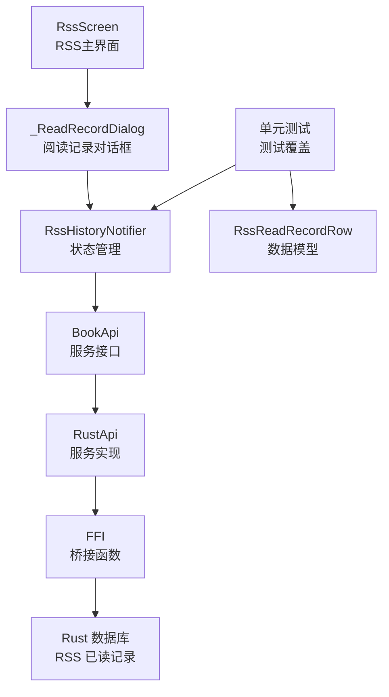
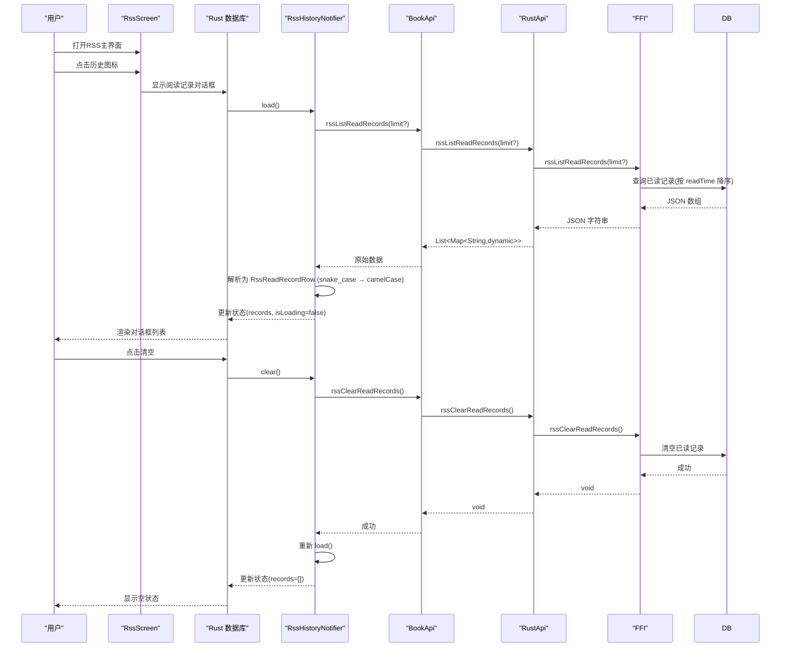
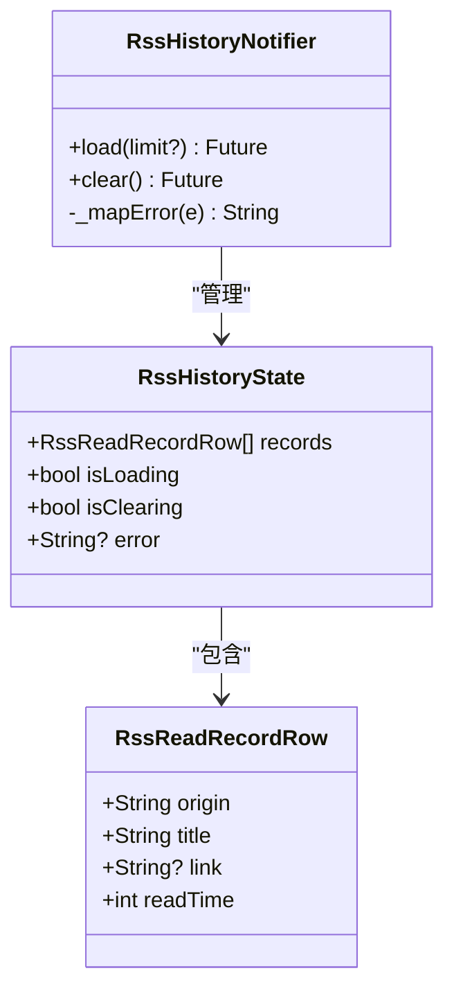
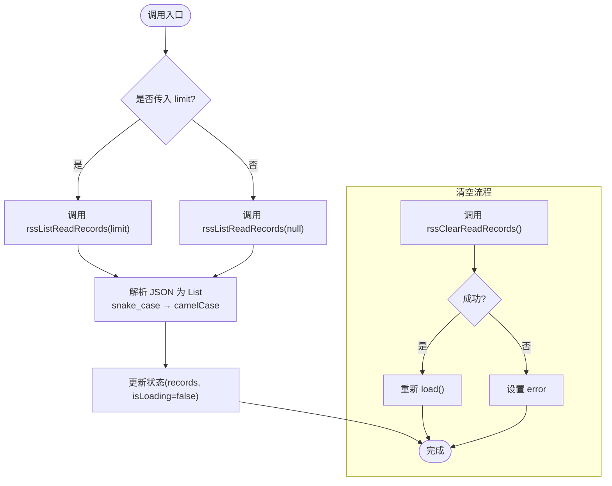
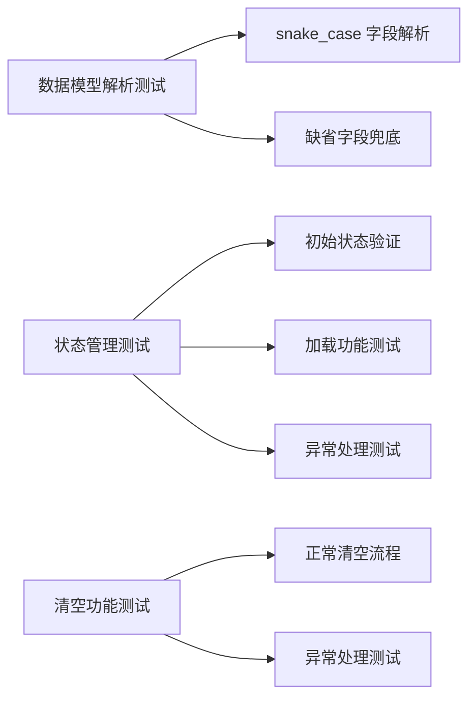
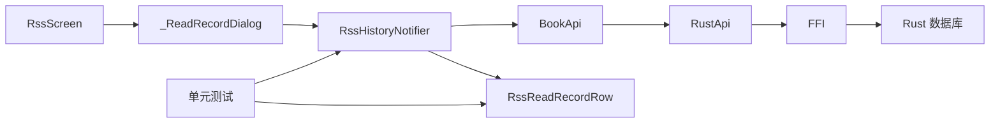

# RSS历史记录功能

<cite>
**本文引用的文件**   
- [rss_screen.dart](file://flutter_legado/lib/src/screens/rss_screen.dart)
- [rss_history_notifier.dart](file://flutter_legado/lib/src/providers/rss_history/rss_history_notifier.dart)
- [rss_history_state.dart](file://flutter_legado/lib/src/providers/rss_history/rss_history_state.dart)
- [rss_read_record_row.dart](file://flutter_legado/lib/src/models/rss_read_record_row.dart)
- [routes.dart](file://flutter_legado/lib/src/routes.dart)
- [rss_history_test.dart](file://flutter_legado/test/unit/rss_history_test.dart)
</cite>

## 更新摘要
**所做更改**   
- 重构RSS历史记录功能：从独立页面改为对话框实现，移除了独立的/rss/history路由
- 在RSS主界面中通过对话框展示阅读记录，提升用户体验的一致性
- 更新了架构图和交互流程，反映新的对话框模式
- 保留了原有的状态管理和数据解析逻辑

## 目录
1. [简介](#简介)
2. [项目结构](#项目结构)
3. [核心组件](#核心组件)
4. [架构总览](#架构总览)
5. [详细组件分析](#详细组件分析)
6. [单元测试实现](#单元测试实现)
7. [依赖关系分析](#依赖关系分析)
8. [性能考量](#性能考量)
9. [故障排查指南](#故障排查指南)
10. [结论](#结论)
11. [附录](#附录)

## 简介
本章节面向"RSS 历史记录"功能，聚焦 Flutter 侧的已读记录展示与清空能力。该功能已从独立的RSS历史页面重构为对话框实现，现在在RSS主界面中通过对话框展示阅读记录，提升了用户体验的一致性。功能通过 Riverpod 状态管理、BookApi 服务抽象、Rust FFI 桥接至底层数据库，实现按阅读时间降序的已读记录列表展示与清空操作。UI 层提供加载态、错误态与空数据态，保证良好的用户体验。

**更新** 功能已从独立页面重构为对话框模式，在RSS主界面中直接访问，无需跳转新页面。

## 项目结构
Flutter 端围绕以下模块组织：
- 页面与入口：RssScreen 作为主入口，包含 _ReadRecordDialog 对话框组件
- 状态与逻辑：RssHistoryNotifier + RssHistoryState（Riverpod）
- 数据模型：RssReadRecordRow（Freezed + JSON 序列化）
- 服务层：BookApi 接口定义，RustApi 实现调用 FFI
- 桥接层：FFI 暴露 Rust 函数 rssListReadRecords / rssClearReadRecords
- 测试层：完整的单元测试覆盖核心功能

图表来源
- [rss_screen.dart:458-627](file://flutter_legado/lib/src/screens/rss_screen.dart#L458-L627)
- [rss_history_notifier.dart:1-66](file://flutter_legado/lib/src/providers/rss_history/rss_history_notifier.dart#L1-L66)
- [rss_read_record_row.dart:1-32](file://flutter_legado/lib/src/models/rss_read_record_row.dart#L1-L32)
- [rss_history_test.dart:1-121](file://flutter_legado/test/unit/rss_history_test.dart#L1-121)

## 核心组件
- RssScreen：RSS主界面，包含历史记录入口按钮和 _ReadRecordDialog 对话框
- _ReadRecordDialog：阅读记录对话框，负责渲染历史列表、触发加载与清空、处理空/错误/加载中状态
- RssHistoryNotifier：封装 load/clear 业务逻辑，统一错误映射，驱动状态更新
- RssHistoryState：不可变状态，包含 records、isLoading、isClearing、error
- RssReadRecordRow：记录行模型，字段 origin/title/link/readTime，支持 snake_case 序列化
- BookApi：定义 rssListReadRecords / rssClearReadRecords 等契约
- RustApi：将 BookApi 调用转发到 FFI
- FFI：暴露 rustListReadRecords / rssClearReadRecords 给 Dart

**更新** 历史记录功能现在以对话框形式集成在RSS主界面中，用户点击顶栏的历史图标即可打开。

## 架构总览
下图展示了从 UI 到 Rust 数据库的完整调用链，包括加载与清空两个关键流程。

图表来源
- [rss_screen.dart:131-138](file://flutter_legado/lib/src/screens/rss_screen.dart#L131-L138)
- [rss_screen.dart:469-474](file://flutter_legado/lib/src/screens/rss_screen.dart#L469-L474)
- [rss_history_notifier.dart:22-46](file://flutter_legado/lib/src/providers/rss_history/rss_history_notifier.dart#L22-L46)

## 详细组件分析

### 页面组件：RssScreen 与 _ReadRecordDialog
- RssScreen：RSS主界面，包含历史记录入口按钮
- _ReadRecordDialog：阅读记录对话框，负责渲染历史列表、触发加载与清空、处理空/错误/加载中状态
- 交互要点：
  - 点击顶栏历史图标打开对话框
  - 对话框初始化时延迟加载，避免阻塞首帧
  - 清空前弹窗确认，成功后调用 Notifier.clear
  - 列表项格式化 origin（仅主机名）与 readTime（YYYY-MM-DD HH:mm）
  - 点击记录条目关闭对话框并跳转到文章详情页

章节来源
- [rss_screen.dart:131-138](file://flutter_legado/lib/src/screens/rss_screen.dart#L131-L138)
- [rss_screen.dart:458-627](file://flutter_legado/lib/src/screens/rss_screen.dart#L458-L627)

### 状态与逻辑：RssHistoryNotifier 与 RssHistoryState
- RssHistoryState：
  - records：按阅读时间降序的已读记录列表
  - isLoading/isClearing：控制 UI 加载态
  - error：错误信息
- RssHistoryNotifier：
  - load(limit?)：拉取记录并解析为 RssReadRecordRow，设置 isLoading=false
  - clear()：调用清空接口，成功后再次 load，异常时设置 error
  - _mapError：统一 BridgeError 映射

图表来源
- [rss_history_state.dart:11-26](file://flutter_legado/lib/src/providers/rss_history/rss_history_state.dart#L11-L26)
- [rss_history_notifier.dart:17-53](file://flutter_legado/lib/src/providers/rss_history/rss_history_notifier.dart#L17-L53)
- [rss_read_record_row.dart:13-31](file://flutter_legado/lib/src/models/rss_read_record_row.dart#L13-L31)

章节来源
- [rss_history_state.dart:1-27](file://flutter_legado/lib/src/providers/rss_history/rss_history_state.dart#L1-27)
- [rss_history_notifier.dart:1-66](file://flutter_legado/lib/src/providers/rss_history/rss_history_notifier.dart#L1-66)
- [rss_read_record_row.dart:1-32](file://flutter_legado/lib/src/models/rss_read_record_row.dart#L1-L32)

### 服务与桥接：BookApi → RustApi → FFI
- BookApi：定义 rssListReadRecords([limit]) 与 rssClearReadRecords() 契约
- RustApi：实现上述方法，调用 FFI
- FFI：暴露 rustListReadRecords(limit) 与 rssClearReadRecords()

图表来源
- [rss_history_notifier.dart:22-46](file://flutter_legado/lib/src/providers/rss_history/rss_history_notifier.dart#L22-L46)

章节来源
- [rss_history_notifier.dart:22-46](file://flutter_legado/lib/src/providers/rss_history/rss_history_notifier.dart#L22-L46)

### 路由与入口
- 路由常量：不再使用独立的/rss/history路由
- 入口方式：通过RssScreen顶栏的历史图标按钮打开对话框
- 对话框实现：_ReadRecordDialog 作为RssScreen的内部组件

**更新** 移除了独立的RSS历史页面路由，改为在RSS主界面中通过对话框访问。

章节来源
- [routes.dart:64-90](file://flutter_legado/lib/src/routes.dart#L64-L90)
- [rss_screen.dart:131-138](file://flutter_legado/lib/src/screens/rss_screen.dart#L131-L138)

## 单元测试实现

**新增** 完整的单元测试覆盖，包含三个核心测试场景：

### 数据模型解析测试
测试 RssReadRecordRow 的 JSON 解析功能，重点验证 snake_case 字段到 camelCase 属性的转换：

- **snake_case 字段解析测试**：验证 `read_time` 字段正确转换为 `readTime` 属性
- **缺省字段兜底测试**：确保默认值处理正确，避免空指针异常

### 状态管理测试
测试 RssHistoryNotifier 的核心功能：

- **初始状态验证**：确认初始状态下 records 为空、isLoading 为 false、error 为 null
- **加载功能测试**：验证 limit 参数透传、数据解析、状态更新
- **异常处理测试**：确保加载失败时正确设置 error 状态

### 清空功能测试
测试数据清空和重试机制：

- **正常清空流程**：验证清空后自动重新加载列表
- **异常处理测试**：确保清空失败时正确设置 error 状态且不触发重新加载

图表来源
- [rss_history_test.dart:13-34](file://flutter_legado/test/unit/rss_history_test.dart#L13-L34)
- [rss_history_test.dart:55-88](file://flutter_legado/test/unit/rss_history_test.dart#L55-L88)
- [rss_history_test.dart:90-118](file://flutter_legado/test/unit/rss_history_test.dart#L90-L118)

### Mock 对象使用
测试中使用 mocktail 框架创建 MockRustApi 实例，模拟 FFI 调用行为：

- 使用 `when()` 方法定义 Mock 行为
- 使用 `verify()` 方法验证调用次数和参数
- 使用 `thenAnswer()` 返回模拟数据或抛出异常

章节来源
- [rss_history_test.dart:1-121](file://flutter_legado/test/unit/rss_history_test.dart#L1-121)

## 依赖关系分析
- UI 层依赖 Notifier，Notifier 依赖 BookApi
- BookApi 由 RustApi 实现，RustApi 依赖 FFI
- FFI 直接调用 Rust 侧 API，返回 JSON 字符串或基本类型
- 数据模型 RssReadRecordRow 用于将 Map 转换为强类型对象
- 测试层通过 Mock 对象隔离外部依赖

图表来源
- [rss_screen.dart:458-627](file://flutter_legado/lib/src/screens/rss_screen.dart#L458-L627)
- [rss_history_notifier.dart:1-66](file://flutter_legado/lib/src/providers/rss_history/rss_history_notifier.dart#L1-66)
- [rss_read_record_row.dart:1-32](file://flutter_legado/lib/src/models/rss_read_record_row.dart#L1-L32)
- [rss_history_test.dart:1-121](file://flutter_legado/test/unit/rss_history_test.dart#L1-121)

章节来源
- [rss_screen.dart:458-627](file://flutter_legado/lib/src/screens/rss_screen.dart#L458-L627)
- [rss_history_notifier.dart:1-66](file://flutter_legado/lib/src/providers/rss_history/rss_history_notifier.dart#L1-66)
- [rss_read_record_row.dart:1-32](file://flutter_legado/lib/src/models/rss_read_record_row.dart#L1-L32)
- [rss_history_test.dart:1-121](file://flutter_legado/test/unit/rss_history_test.dart#L1-121)

## 性能考量
- 列表分页与限制：支持可选 limit 参数，建议合理设置上限避免一次性加载过多数据
- 异步加载：使用协程/异步调用，避免阻塞 UI
- 状态最小化更新：仅在必要时更新 isLoading/isClearing/error，减少重绘
- 数据解析：JSON→Model 转换尽量轻量，避免在主线程进行复杂计算
- 内存管理：及时释放 Mock 对象和 ProviderContainer 引用
- 对话框优化：使用 ConstrainedBox 限制对话框大小，避免过度占用屏幕空间

## 故障排查指南
- 加载失败：检查 FFI 调用是否抛出 BridgeError，查看 Notifier._mapError 的错误映射
- 清空后未刷新：确认 clear() 成功后是否调用了 load()
- 列表为空：确认 Rust 侧是否有已读记录；可先尝试不带 limit 的查询
- 时间显示异常：校验 readTime 是否为 Unix 毫秒，注意时区与格式化处理
- 字段解析问题：检查 API 响应中的 snake_case 字段是否正确映射到 camelCase 属性
- 对话框无法打开：确认 RssScreen 顶栏历史图标按钮的 onPressed 回调是否正常

**更新** 新增对话框相关问题的排查指南，重点关注对话框打开和关闭的问题。

章节来源
- [rss_history_notifier.dart:48-53](file://flutter_legado/lib/src/providers/rss_history/rss_history_notifier.dart#L48-L53)
- [rss_screen.dart:131-138](file://flutter_legado/lib/src/screens/rss_screen.dart#L131-L138)
- [rss_read_record_row.dart:26](file://flutter_legado/lib/src/models/rss_read_record_row.dart#L26)

## 结论
RSS 历史记录功能已从独立页面重构为对话框模式，在 Flutter 端采用清晰的分层设计：UI 层专注渲染与交互，状态层封装业务逻辑，服务层抽象接口并通过 FFI 与 Rust 数据库交互。整体链路简洁、可扩展性强，便于后续扩展更多筛选与排序能力。对话框模式的改进提升了用户体验的一致性，用户无需离开RSS主界面即可查看和管理阅读记录。

**更新** 重构后的对话框模式提供了更好的用户体验，避免了页面跳转带来的中断感。

## 附录
- 单元测试覆盖：测试用例验证了加载、清空与错误路径的行为
- Mock 对象使用：使用 mocktail 框架创建测试替身
- 数据转换：snake_case 到 camelCase 的自动字段映射
- 对话框实现：_ReadRecordDialog 作为内部组件集成在RssScreen中

**更新** 新增了对话框实现的详细说明和使用方式。

章节来源
- [rss_history_test.dart:63-117](file://flutter_legado/test/unit/rss_history_test.dart#L63-L117)
- [rss_screen.dart:458-627](file://flutter_legado/lib/src/screens/rss_screen.dart#L458-L627)
- [rss_read_record_row.dart:26](file://flutter_legado/lib/src/models/rss_read_record_row.dart#L26)