# RSS订阅系统

<cite>
**本文引用的文件**   
- [rss_article.dart](file://flutter_legado/lib/src/models/rss_article.dart)
- [models.dart](file://flutter_legado/lib/src/models/models.dart)
- [rss_source.dart](file://flutter_legado/lib/src/models/rss_source.dart)
- [rss_notifier.dart](file://flutter_legado/lib/src/providers/rss/rss_notifier.dart)
- [rss_state.dart](file://flutter_legado/lib/src/providers/rss/rss_state.dart)
- [rss_screen.dart](file://flutter_legado/lib/src/screens/rss_screen.dart)
- [rss_articles_screen.dart](file://flutter_legado/lib/src/screens/rss_articles_screen.dart)
- [rss_article_detail_screen.dart](file://flutter_legado/lib/src/screens/rss_article_detail_screen.dart)
- [rss_history_screen.dart](file://flutter_legado/lib/src/screens/rss_history_screen.dart)
- [rss_history_notifier.dart](file://flutter_legado/lib/src/providers/rss_history/rss_history_notifier.dart)
- [rss_history_state.dart](file://flutter_legado/lib/src/providers/rss_history/rss_history_state.dart)
- [rss_read_record_row.dart](file://flutter_legado/lib/src/models/rss_read_record_row.dart)
- [rust_api.dart](file://flutter_legado/lib/src/services/rust_api.dart)
- [book_api.dart](file://flutter_legado/lib/src/services/book_api.dart)
- [ffi.dart](file://flutter_legado/lib/src/bridge/ffi/ffi.dart)
- [debug_session.rs](file://rust/legado-core/src/debug_session.rs)
- [API_CONTRACT.md](file://docs/API_CONTRACT.md)
- [ReadRecordDialog.kt](file://app/src/main/java/io/legado/app/ui/rss/article/ReadRecordDialog.kt)
- [RssFragment.kt](file://app/src/main/java/io/legado/app/ui/main/rss/RssFragment.kt)
- [fragment_rss.xml](file://app/src/main/res/layout/fragment_rss.xml)
- [item_rss.xml](file://app/src/main/res/layout/item_rss.xml)
- [dialog_rss_favorite_config.xml](file://app/src/main/res/layout/dialog_rss_favorite_config.xml)
- [item_rss_read_record.xml](file://app/src/main/res/layout/item_rss_read_record.xml)
</cite>

## 更新摘要
**所做更改**   
- **RSS文章屏幕动态布局切换**：新增405行功能代码，支持在列表视图和双列网格视图之间切换
- **布局偏好持久化**：每个RSS源的articleStyle字段支持0-4循环切换，并自动保存到源配置
- **增强的用户体验**：提供直观的菜单选项进行布局切换，保持与Android原版的一致性
- **响应式界面设计**：网格视图采用卡片式设计，优化移动端阅读体验
- **架构优化**：Flutter端数据模型分层重构，提升代码可维护性

## 目录
1. [简介](#简介)
2. [项目结构](#项目结构)
3. [核心组件](#核心组件)
4. [架构总览](#架构总览)
5. [详细组件分析](#详细组件分析)
6. [依赖分析](#依赖分析)
7. [性能考虑](#性能考虑)
8. [故障排查指南](#故障排查指南)
9. [结论](#结论)
10. [附录](#附录)

## 简介
本技术文档面向Legado的RSS订阅系统，覆盖以下关键能力：
- RSS源管理：订阅添加、编辑删除、分类组织与状态监控
- 内容抓取机制：HTTP请求处理、XML解析、编码检测与错误重试
- 文章阅读功能：富文本渲染、图片加载、链接跳转与离线缓存
- 收藏管理：星标操作、标签分类、搜索过滤与批量管理
- **新增历史记录**：完整的RSS阅读历史跟踪、展示和管理功能
- **增强调试系统**：书源调试会话、步骤追踪和日志收集
- **改进后端集成**：通过Rust FFI实现高效的数据持久化和查询
- **最新UI改进**：顶部栏重新设计、阅读记录对话框、群组管理优化
- **动态布局切换**：RSS文章屏幕支持列表视图和网格视图之间的无缝切换
- RSS规范支持、性能优化策略与常见问题解决方案

## 项目结构
Legado的RSS子系统采用多语言分层架构：
- Rust核心层（legado-core）：定义RSS数据模型、领域逻辑和调试会话管理
- Rust网络层（legado-net）：负责HTTP请求、重试、RSS拉取与解析
- Rust数据库层（legado-db）：通过Repository模式持久化RSS源、文章、星标与阅读记录
- FFI桥接层（legado-ffi）：暴露API给上层应用（Android/Flutter）
- Android应用层（app）：默认数据与UI集成，**已进行重大UI改进**
- **Flutter前端（flutter_legado）**：提供跨平台测试与界面交互，**已进行架构优化并新增历史记录功能和动态布局切换**

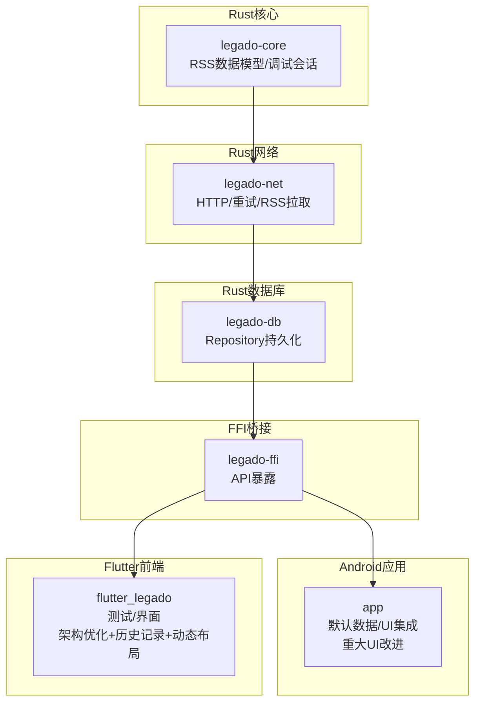

**图表来源** 
- [rss_article.dart:1-26](file://flutter_legado/lib/src/models/rss_article.dart#L1-L26)
- [models.dart:1-12](file://flutter_legado/lib/src/models/models.dart#L1-L12)
- [rss_source.dart:1-59](file://flutter_legado/lib/src/models/rss_source.dart#L1-L59)
- [debug_session.rs:1-100](file://rust/legado-core/src/debug_session.rs#L1-L100)

**章节来源**
- [rss_article.dart:1-26](file://flutter_legado/lib/src/models/rss_article.dart#L1-L26)
- [models.dart:1-12](file://flutter_legado/lib/src/models/models.dart#L1-L12)
- [rss_source.dart:1-59](file://flutter_legado/lib/src/models/rss_source.dart#L1-L59)

## 核心组件
- **RSS数据模型**：RssFeedArticle和RssSource等数据结构定义
- **新增历史记录模型**：RssReadRecordRow用于存储已读记录信息
- **调试会话管理**：DebugSession和Debugger用于书源调试和步骤追踪
- UI组件：RSS列表、详情、配置和历史记录界面
- Provider状态管理：RSS数据状态管理与业务逻辑处理
- API接口：与Rust后端通信的数据交换接口
- **统一导出**：通过models.dart统一管理所有数据模型导出
- **Android UI组件**：增强的顶部栏、阅读记录对话框、群组管理界面
- **动态布局组件**：支持列表视图和网格视图的RSS文章显示组件

**章节来源**
- [rss_article.dart:1-26](file://flutter_legado/lib/src/models/rss_article.dart#L1-L26)
- [rss_source.dart:1-59](file://flutter_legado/lib/src/models/rss_source.dart#L1-L59)
- [rss_read_record_row.dart:1-32](file://flutter_legado/lib/src/models/rss_read_record_row.dart#L1-L32)
- [debug_session.rs:1-150](file://rust/legado-core/src/debug_session.rs#L1-L150)
- [models.dart:1-12](file://flutter_legado/lib/src/models/models.dart#L1-L12)

## 架构总览
整体调用链从上层UI进入，经Provider状态管理，通过统一的models接口访问数据模型，最终调用Rust后端API。新增的历史记录功能和动态布局切换功能通过BookApi抽象接口和Rust FFI实现完整的数据流。

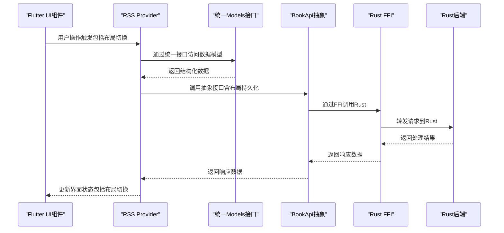

**图表来源** 
- [rss_notifier.dart:1-200](file://flutter_legado/lib/src/providers/rss/rss_notifier.dart#L1-L200)
- [models.dart:1-12](file://flutter_legado/lib/src/models/models.dart#L1-L12)
- [book_api.dart:150-180](file://flutter_legado/lib/src/services/book_api.dart#L150-L180)
- [ffi.dart:280-295](file://flutter_legado/lib/src/bridge/ffi/ffi.dart#L280-L295)

## 详细组件分析

### Flutter端数据模型架构优化（新增）
**重要变更**：RssFeedArticle数据模型已从服务层迁移至独立的models层

- **模型分离**：RssFeedArticle类定义在`rss_article.dart`文件中
- **统一导出**：通过`models.dart`统一管理所有数据模型的导出
- **分层解耦**：UI组件不再直接依赖服务层，而是通过models接口访问
- **类型安全**：保持原有的字段结构和序列化能力

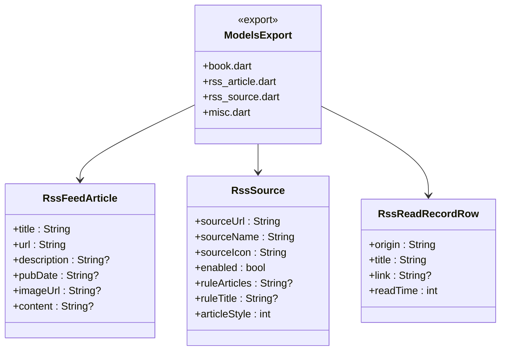

**图表来源** 
- [rss_article.dart:9-25](file://flutter_legado/lib/src/models/rss_article.dart#L9-L25)
- [rss_source.dart:8-54](file://flutter_legado/lib/src/models/rss_source.dart#L8-L54)
- [rss_read_record_row.dart:14-27](file://flutter_legado/lib/src/models/rss_read_record_row.dart#L14-L27)
- [models.dart:4-11](file://flutter_legado/lib/src/models/models.dart#L4-L11)

**章节来源**
- [rss_article.dart:1-26](file://flutter_legado/lib/src/models/rss_article.dart#L1-L26)
- [models.dart:1-12](file://flutter_legado/lib/src/models/models.dart#L1-L12)
- [rss_source.dart:1-59](file://flutter_legado/lib/src/models/rss_source.dart#L1-L59)

### RSS文章屏幕动态布局切换（新增）
**全新功能**：RSS文章屏幕现在支持在列表视图和双列网格视图之间动态切换

- **布局模式**：articleStyle字段支持0-4循环切换，0为列表视图，其他值为网格视图
- **本地状态管理**：_articleStyle变量维护当前布局状态，初始值来自widget.source.articleStyle
- **菜单集成**：通过PopupMenuButton提供"切换布局"选项，与其他菜单项保持一致
- **持久化存储**：布局选择通过updateRssSource方法保存到RSS源配置中
- **响应式渲染**：根据_articleStyle值动态选择ListView或GridView渲染器

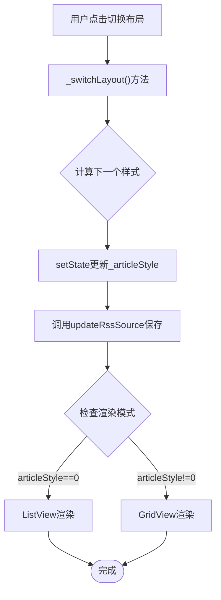

**图表来源** 
- [rss_articles_screen.dart:479-493](file://flutter_legado/lib/src/screens/rss_articles_screen.dart#L479-L493)
- [rss_articles_screen.dart:109-138](file://flutter_legado/lib/src/screens/rss_articles_screen.dart#L109-L138)
- [rss_source.dart:27](file://flutter_legado/lib/src/models/rss_source.dart#L27)

**章节来源**
- [rss_articles_screen.dart:1-623](file://flutter_legado/lib/src/screens/rss_articles_screen.dart#L1-L623)
- [rss_source.dart:1-59](file://flutter_legado/lib/src/models/rss_source.dart#L1-L59)

### RSS文章列表渲染组件（新增）
**全新功能**：实现了两种不同的文章渲染方式，提供多样化的阅读体验

- **列表视图渲染**：_buildArticleItem方法实现iOS风格的横向布局，包含缩略图、标题、描述和时间信息
- **网格视图渲染**：_buildGridItem方法实现卡片式网格布局，适合快速浏览大量文章
- **图片优化**：使用CachedNetworkImage进行图片缓存，设置memCacheWidth避免大图解码
- **已读状态标记**：通过_readArticles集合跟踪已读文章，提供视觉反馈
- **性能优化**：使用RepaintBoundary隔离重绘区域，提升滚动性能

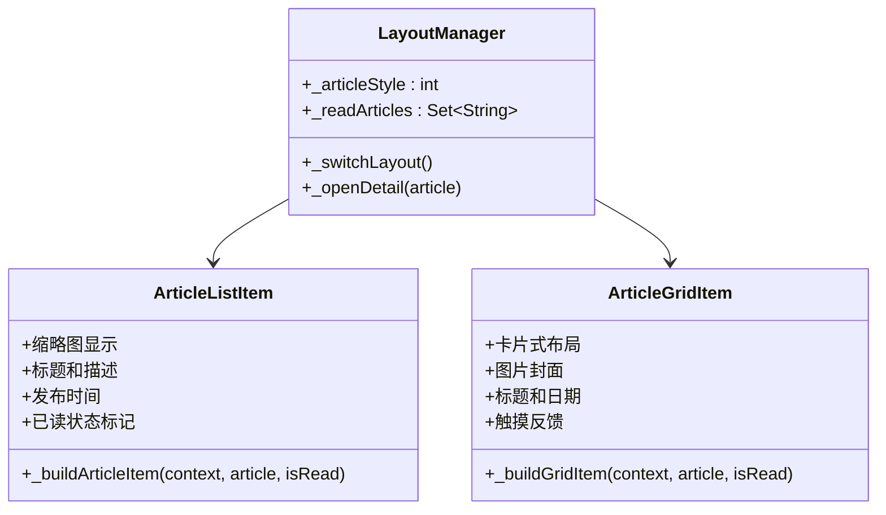

**图表来源** 
- [rss_articles_screen.dart:145-276](file://flutter_legado/lib/src/screens/rss_articles_screen.dart#L145-L276)
- [rss_articles_screen.dart:300-377](file://flutter_legado/lib/src/screens/rss_articles_screen.dart#L300-L377)
- [rss_articles_screen.dart:27-41](file://flutter_legado/lib/src/screens/rss_articles_screen.dart#L27-L41)

**章节来源**
- [rss_articles_screen.dart:145-276](file://flutter_legado/lib/src/screens/rss_articles_screen.dart#L145-L276)
- [rss_articles_screen.dart:300-377](file://flutter_legado/lib/src/screens/rss_articles_screen.dart#L300-L377)

### RSS历史记录功能（新增）
**全新功能**：完整的RSS阅读历史跟踪、展示和管理

- **历史记录模型**：RssReadRecordRow包含来源URL、标题、链接和阅读时间
- **状态管理**：RssHistoryNotifier管理历史记录列表、加载状态和错误处理
- **UI界面**：RssHistoryScreen提供历史记录浏览和清空功能
- **数据持久化**：通过BookApi.rssListReadRecords和rssClearReadRecords与Rust后端交互

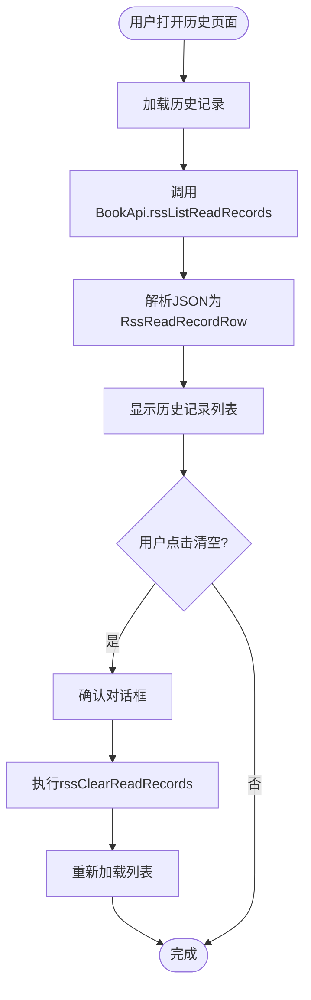

**图表来源** 
- [rss_history_screen.dart:31-55](file://flutter_legado/lib/src/screens/rss_history_screen.dart#L31-L55)
- [rss_history_notifier.dart:21-46](file://flutter_legado/lib/src/providers/rss_history/rss_history_notifier.dart#L21-L46)
- [book_api.dart:170-177](file://flutter_legado/lib/src/services/book_api.dart#L170-L177)

**章节来源**
- [rss_history_screen.dart:1-143](file://flutter_legado/lib/src/screens/rss_history_screen.dart#L1-L143)
- [rss_history_notifier.dart:1-66](file://flutter_legado/lib/src/providers/rss_history/rss_history_notifier.dart#L1-L66)
- [rss_history_state.dart:1-27](file://flutter_legado/lib/src/providers/rss_history/rss_history_state.dart#L1-L27)
- [rss_read_record_row.dart:1-32](file://flutter_legado/lib/src/models/rss_read_record_row.dart#L1-L32)

### Android RSS界面重大UI改进（新增）
**重大更新**：RSS界面进行了全面的UI现代化改造

- **顶部栏重新设计**：使用现代化的TitleBar组件，支持搜索和菜单集成
- **阅读记录对话框**：全新的ReadRecordDialog实现，支持历史记录查看和清理
- **群组管理优化**：群组菜单动态更新，支持分组筛选和快速导航
- **网格布局改进**：RSS源卡片采用4列网格布局，提升空间利用率
- **Android原版对齐**：界面风格与Android原生版本保持一致

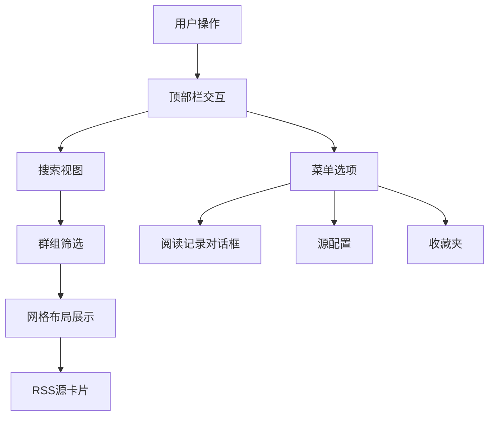

**图表来源** 
- [fragment_rss.xml:9-16](file://app/src/main/res/layout/fragment_rss.xml#L9-L16)
- [RssFragment.kt:74-86](file://app/src/main/java/io/legado/app/ui/main/rss/RssFragment.kt#L74-L86)
- [ReadRecordDialog.kt:25-54](file://app/src/main/java/io/legado/app/ui/rss/article/ReadRecordDialog.kt#L25-L54)

**章节来源**
- [RssFragment.kt:1-244](file://app/src/main/java/io/legado/app/ui/main/rss/RssFragment.kt#L1-L244)
- [fragment_rss.xml:1-42](file://app/src/main/res/layout/fragment_rss.xml#L1-L42)
- [item_rss.xml:1-41](file://app/src/main/res/layout/item_rss.xml#L1-L41)
- [ReadRecordDialog.kt:1-108](file://app/src/main/java/io/legado/app/ui/rss/article/ReadRecordDialog.kt#L1-L108)

### Rust调试会话系统（新增）
**全新功能**：完整的书源调试会话管理和步骤追踪

- **调试会话**：DebugSession包含会话ID、来源信息、步骤列表和状态
- **步骤追踪**：DebugStep记录每个调试步骤的类型、状态、输入输出和耗时
- **会话管理**：Debugger提供会话创建、步骤添加、状态更新和清理功能
- **日志输出**：格式化的调试日志便于问题诊断

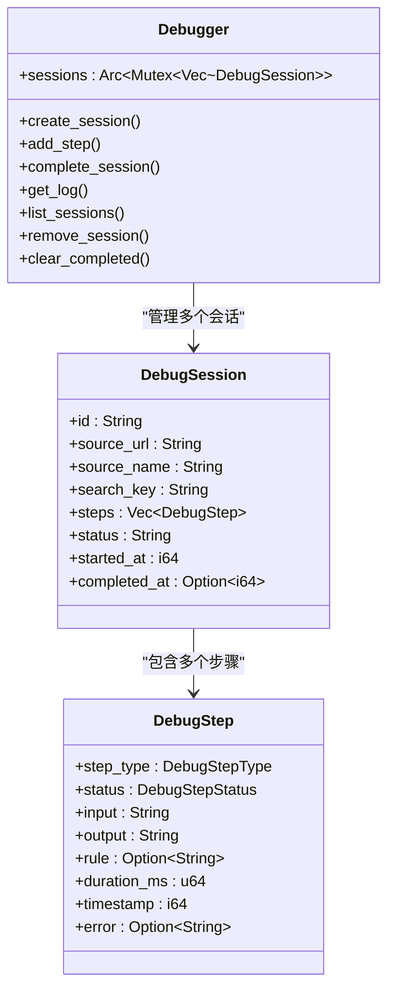

**图表来源** 
- [debug_session.rs:85-111](file://rust/legado-core/src/debug_session.rs#L85-L111)
- [debug_session.rs:35-83](file://rust/legado-core/src/debug_session.rs#L35-L83)
- [debug_session.rs:113-253](file://rust/legado-core/src/debug_session.rs#L113-L253)

**章节来源**
- [debug_session.rs:1-552](file://rust/legado-core/src/debug_session.rs#L1-L552)

### RSS源管理（添加、编辑、删除、分类、状态监控）
- 添加/编辑/删除：通过FFI API接收源配置，核心层校验规则，仓库层完成持久化
- 分类组织：基于源的分组字段进行聚合展示与筛选
- 状态监控：维护源的启用/禁用、最后更新时间、抓取计数等状态字段
- **布局持久化**：articleStyle字段通过updateRssSource方法持久化到源配置

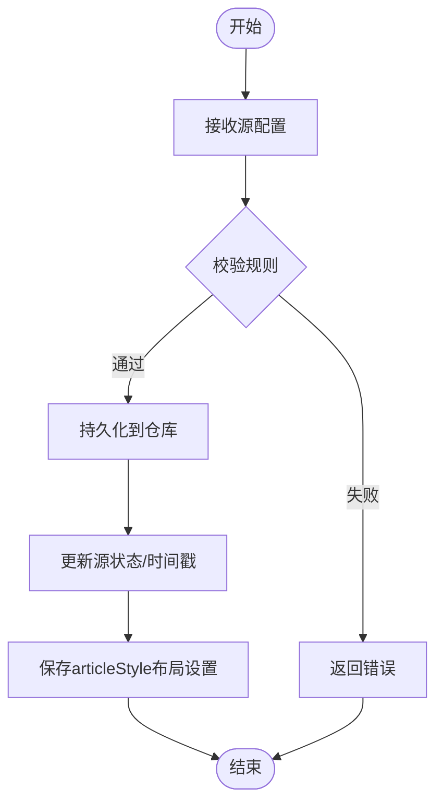

**章节来源**
- [rss_notifier.dart:1-200](file://flutter_legado/lib/src/providers/rss/rss_notifier.dart#L1-L200)
- [rss_state.dart:1-200](file://flutter_legado/lib/src/providers/rss/rss_state.dart#L1-L200)

### 内容抓取机制（HTTP、XML解析、编码检测、错误重试）
- HTTP请求：统一客户端封装，支持代理、超时、UA设置
- 重试策略：指数退避与最大重试次数控制
- 编码检测：根据Content-Type与BOM自动识别编码
- XML解析：按RSS/Atom规范提取条目、标题、链接、发布时间等

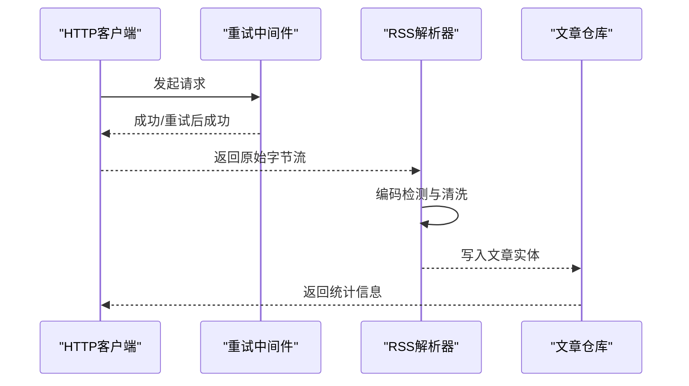

**章节来源**
- [rust_api.dart:1-200](file://flutter_legado/lib/src/services/rust_api.dart#L1-L200)
- [book_api.dart:1-200](file://flutter_legado/lib/src/services/book_api.dart#L1-L200)

### 文章阅读功能（富文本、图片、链接、离线缓存）
- 富文本渲染：将RSS内容转换为可读HTML片段，支持基础样式
- 图片加载：相对路径转绝对URL，懒加载与占位图
- 链接跳转：外部链接在新窗口打开，内部锚点平滑滚动
- 离线缓存：文章内容与图片本地缓存，断网可继续阅读

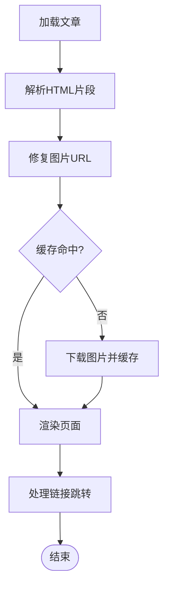

**章节来源**
- [rss_article_detail_screen.dart:1-200](file://flutter_legado/lib/src/screens/rss_article_detail_screen.dart#L1-L200)

### 收藏管理（星标、标签、搜索、批量）
- 星标操作：对文章进行收藏/取消收藏，标记已读/未读
- 标签分类：为收藏项添加标签，支持多标签组合筛选
- 搜索过滤：按标题、内容、来源、时间范围检索
- 批量管理：批量星标、批量删除、批量导出

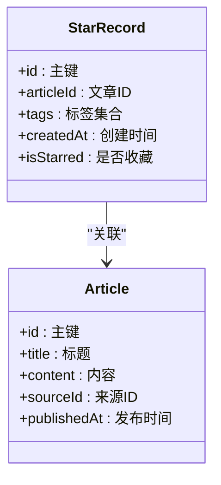

**章节来源**
- [rss_favorites_screen.dart:1-200](file://flutter_legado/lib/src/screens/rss_favorites_screen.dart#L1-L200)

### RSS界面组件架构
- **RSS主界面**：提供订阅源管理和文章列表展示
- **文章详情页**：富文本渲染和图片展示
- **配置界面**：RSS源配置和管理
- **收藏夹界面**：收藏文章的浏览和管理
- **历史记录界面**：已读RSS文章的浏览和管理
- **Android界面改进**：顶部栏、对话框、网格布局的全面优化
- **动态布局界面**：支持列表和网格视图切换的文章显示界面

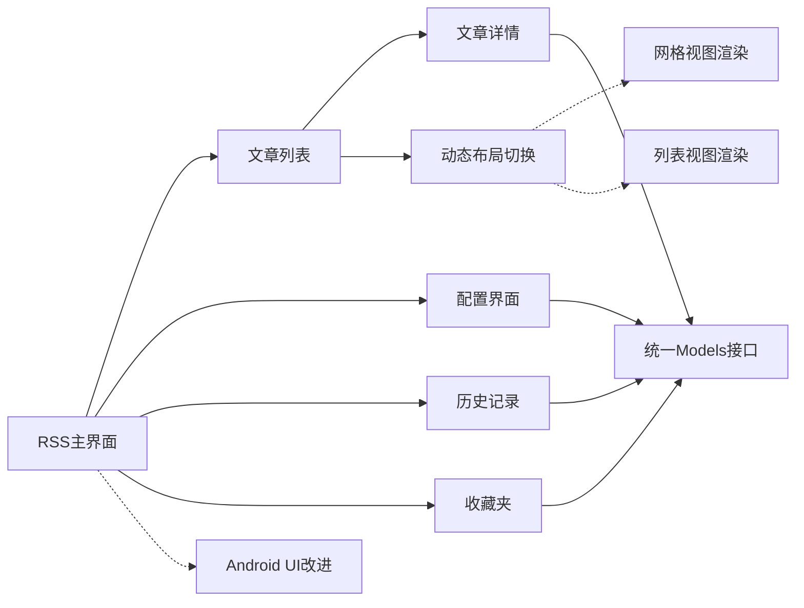

**图表来源** 
- [rss_screen.dart:1-200](file://flutter_legado/lib/src/screens/rss_screen.dart#L1-L200)
- [rss_articles_screen.dart:1-200](file://flutter_legado/lib/src/screens/rss_articles_screen.dart#L1-L200)
- [rss_article_detail_screen.dart:1-200](file://flutter_legado/lib/src/screens/rss_article_detail_screen.dart#L1-L200)
- [rss_history_screen.dart:1-143](file://flutter_legado/lib/src/screens/rss_history_screen.dart#L1-L143)

**章节来源**
- [rss_screen.dart:1-200](file://flutter_legado/lib/src/screens/rss_screen.dart#L1-L200)
- [rss_articles_screen.dart:1-200](file://flutter_legado/lib/src/screens/rss_articles_screen.dart#L1-L200)
- [rss_article_detail_screen.dart:1-200](file://flutter_legado/lib/src/screens/rss_article_detail_screen.dart#L1-L200)

### RSS规范支持
- 支持RSS 2.0与Atom格式，兼容常见字段映射
- 扩展字段容错：缺失字段时回退默认值
- 时间解析：兼容多种时间格式

**章节来源**
- [rust_api.dart:1-200](file://flutter_legado/lib/src/services/rust_api.dart#L1-L200)

## 依赖分析
- **Flutter端优化**：UI组件通过models.dart统一导入数据模型，避免直接依赖服务层
- **新增历史记录依赖**：RssHistoryNotifier依赖BookApi和RssReadRecordRow模型
- **调试系统依赖**：Rust核心层提供调试会话管理，通过FFI暴露给上层
- **Android UI依赖**：新的对话框和布局组件依赖Android框架和自定义主题
- **动态布局依赖**：rss_articles_screen依赖BookApi进行布局持久化，依赖RssSource模型获取articleStyle
- 模块耦合：Provider依赖models接口；models层独立于UI和服务层
- 外部依赖：Rust FFI接口、JSON序列化库、Freezed注解处理器
- 循环依赖：通过分层架构和统一接口避免直接循环引用

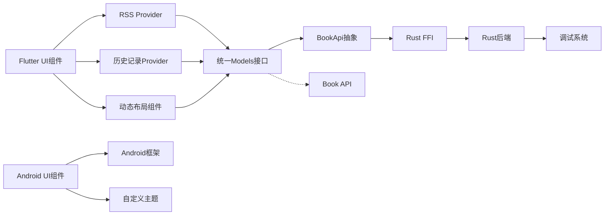

**图表来源** 
- [models.dart:1-12](file://flutter_legado/lib/src/models/models.dart#L1-L12)
- [rss_notifier.dart:1-200](file://flutter_legado/lib/src/providers/rss/rss_notifier.dart#L1-L200)
- [rss_history_notifier.dart:1-66](file://flutter_legado/lib/src/providers/rss_history/rss_history_notifier.dart#L1-L66)
- [book_api.dart:150-180](file://flutter_legado/lib/src/services/book_api.dart#L150-L180)
- [ffi.dart:280-295](file://flutter_legado/lib/src/bridge/ffi/ffi.dart#L280-L295)

**章节来源**
- [models.dart:1-12](file://flutter_legado/lib/src/models/models.dart#L1-L12)
- [rss_notifier.dart:1-200](file://flutter_legado/lib/src/providers/rss/rss_notifier.dart#L1-L200)
- [rust_api.dart:1-200](file://flutter_legado/lib/src/services/rust_api.dart#L1-L200)

## 性能考虑
- 并发抓取：限制并发数，避免服务器限流
- 增量更新：基于时间戳或ETag实现增量同步
- 缓存策略：文章与图片TTL过期策略，热点内容优先缓存
- 内存优化：分页加载、懒加载图片、压缩传输
- **架构优化收益**：分层设计减少不必要的依赖，提升编译和运行效率
- **历史记录优化**：按需加载历史记录，支持分页和限制数量
- **调试系统优化**：调试会话内存管理，自动清理已完成会话
- **UI性能优化**：RecyclerView复用、图片懒加载、网格布局优化
- **动态布局优化**：使用RepaintBoundary隔离重绘区域，CachedNetworkImage优化图片加载
- **布局切换优化**：通过setState局部更新，避免整页重建

## 故障排查指南
- 抓取失败：检查网络连通性、代理设置、UA伪装与重试次数
- 解析异常：确认RSS格式是否符合规范，查看编码检测结果
- 存储错误：验证数据库迁移与表结构一致性
- 缓存问题：清理过期缓存，检查磁盘空间与权限
- **架构相关问题**：检查models导入路径是否正确，确保分层依赖关系正常
- **API调用问题**：确认FFI桥接方法正确调用，检查参数传递和数据序列化
- **历史记录问题**：检查Rust后端RSS历史记录表结构，确认FFI接口调用
- **调试系统问题**：验证调试会话创建和步骤记录，检查日志输出格式
- **UI问题排查**：检查Android布局文件、主题配置和对话框显示逻辑
- **布局切换问题**：检查articleStyle字段是否正确持久化，确认updateRssSource调用成功

**章节来源**
- [rss_notifier.dart:1-200](file://flutter_legado/lib/src/providers/rss/rss_notifier.dart#L1-L200)
- [rust_api.dart:1-200](file://flutter_legado/lib/src/services/rust_api.dart#L1-L200)

## 结论
Legado的RSS订阅系统以Rust为核心，结合FFI桥接与多层仓库抽象，实现了高可靠、高性能的订阅管理、抓取、阅读与收藏功能。**Flutter端的架构优化进一步提升了代码的可维护性和模块化程度**，通过严格的分层设计和统一的数据模型接口，使系统在可扩展性与可维护性方面表现更加优秀。**新增的历史记录功能和调试系统为RSS订阅体验提供了更强的支持和更好的开发调试能力**。**最新的Android界面重大改进确保了跨平台用户体验的一致性**，包括顶部栏重新设计、阅读记录对话框和群组管理的全面优化。**最重要的是，RSS文章屏幕的动态布局切换功能为用户提供了多样化的阅读体验，支持列表视图和网格视图之间的无缝切换，并通过articleStyle字段的持久化确保用户偏好的保持**。

## 附录
- Flutter测试用例覆盖RSS Provider的基本行为
- **架构优化说明**：RssFeedArticle模型迁移至独立文件，遵循分层架构原则
- **新功能说明**：完整的RSS历史记录跟踪和调试会话管理系统
- **Android界面改进说明**：顶部栏、对话框、网格布局的全面现代化改造
- **动态布局功能说明**：RSS文章屏幕支持列表和网格视图切换，articleStyle字段持久化
- **API契约文档**：详细的接口定义和使用说明

**章节来源**
- [rss_provider_test.dart:1-200](file://flutter_legado/test/unit/rss_provider_test.dart#L1-L200)
- [API_CONTRACT.md:1-200](file://docs/API_CONTRACT.md#L1-L200)