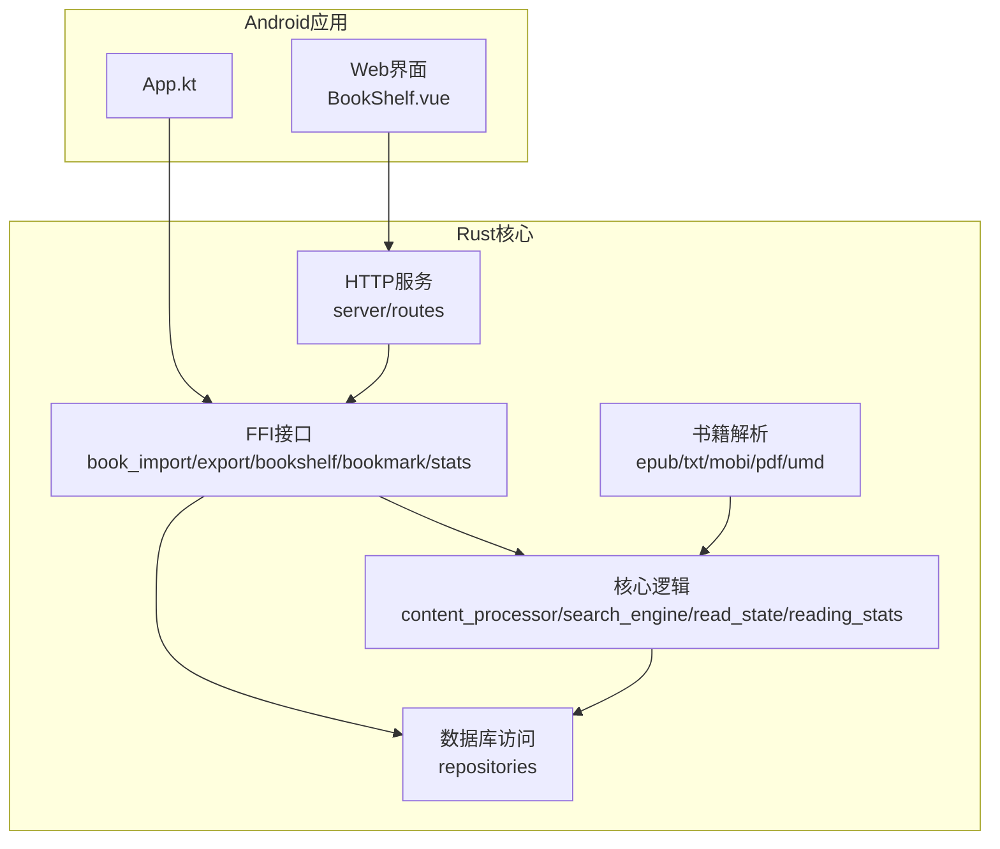
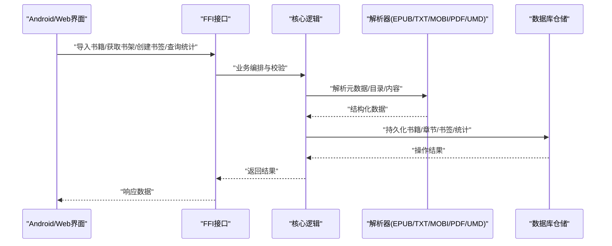
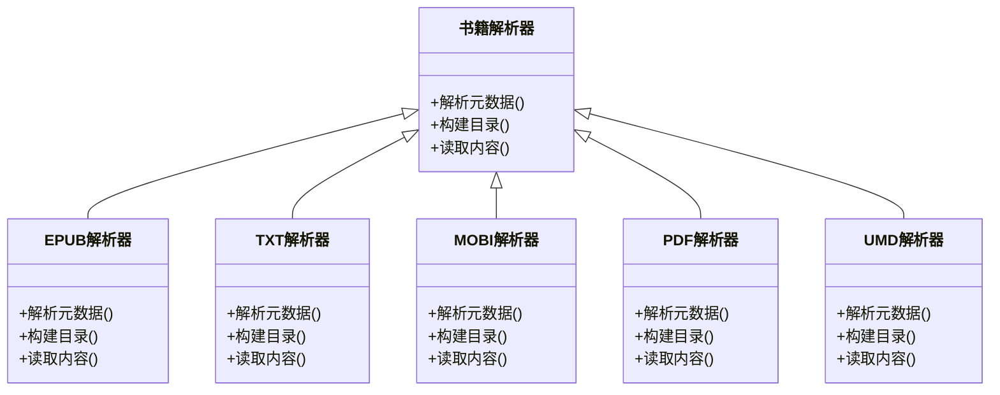
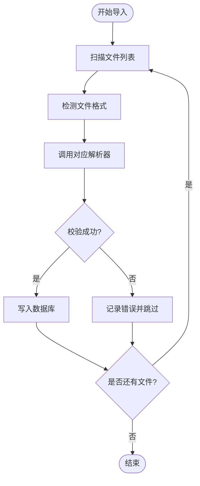
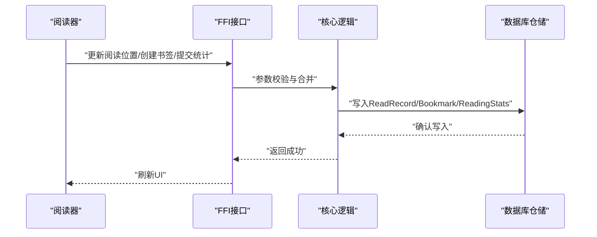
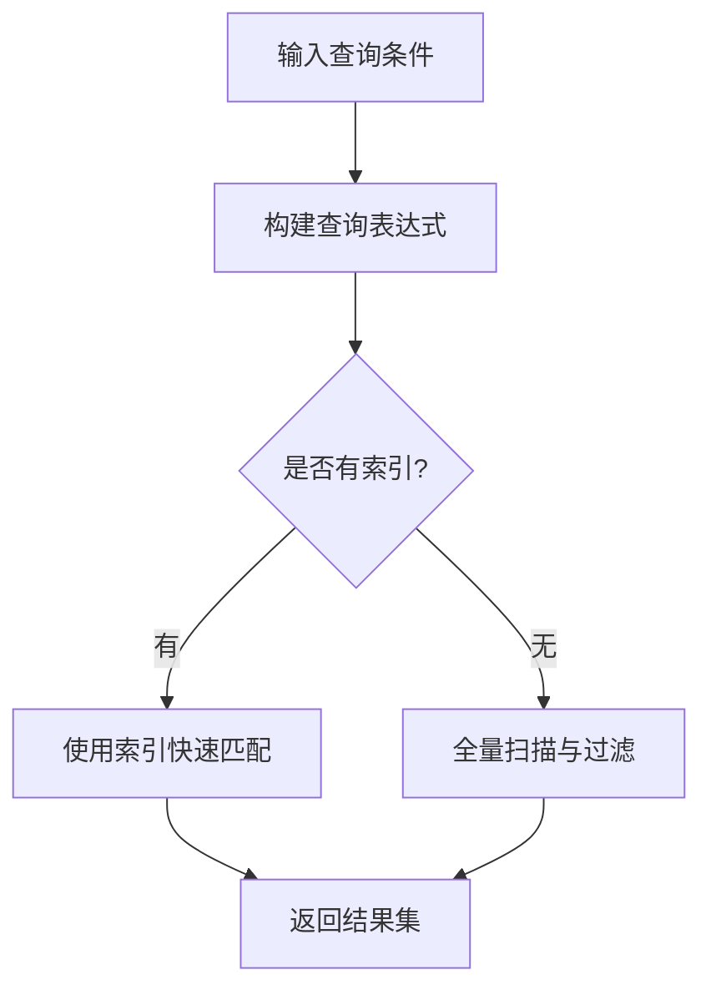
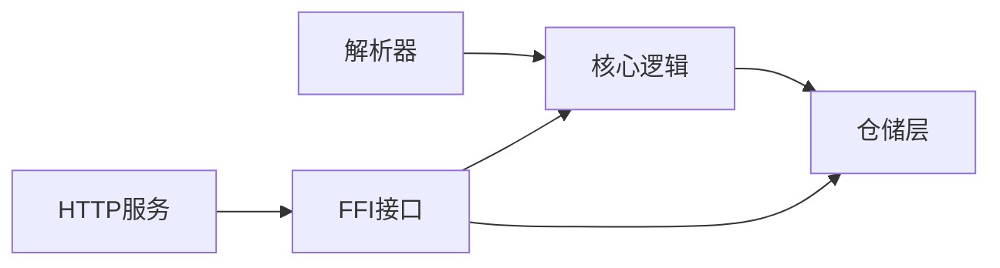

# 书籍管理功能

<cite>
**本文引用的文件**   
- [README.md](file://README.md)
- [lib.rs](file://rust/legado-book/src/lib.rs)
- [epub.rs](file://rust/legado-book/src/epub.rs)
- [txt.rs](file://rust/legado-book/src/txt.rs)
- [mobi.rs](file://rust/legado-book/src/mobi.rs)
- [pdf.rs](file://rust/legado-book/src/pdf.rs)
- [umd.rs](file://rust/legado-book/src/umd.rs)
- [export.rs](file://rust/legado-book/src/export.rs)
- [book_import.rs](file://rust/legado-ffi/src/api/book_import.rs)
- [book_export.rs](file://rust/legado-ffi/src/api/book_export.rs)
- [bookshelf.rs](file://rust/legado-ffi/src/api/bookshelf.rs)
- [bookmark_api.rs](file://rust/legado-ffi/src/api/bookmark_api.rs)
- [reading_stats_api.rs](file://rust/legado-ffi/src/api/reading_stats_api.rs)
- [read_record_api.rs](file://rust/legado-ffi/src/api/read_record_api.rs)
- [book_repository.rs](file://rust/legado-db/src/repository/book_repository.rs)
- [book_chapter_repository.rs](file://rust/legado-db/src/repository/book_chapter_repository.rs)
- [bookmark_repository.rs](file://rust/legado-db/src/repository/bookmark_repository.rs)
- [reading_stats_repository.rs](file://rust/legado-db/src/repository/reading_stats_repository.rs)
- [read_record_repository.rs](file://rust/legado-db/src/repository/read_record_repository.rs)
- [book_group_repository.rs](file://rust/legado-db/src/repository/book_group_repository.rs)
- [book.rs](file://rust/legado-core/src/models/book.rs)
- [book_chapter.rs](file://rust/legado-core/src/models/book_chapter.rs)
- [read_state.rs](file://rust/legado-core/src/read_state.rs)
- [reading_stats.rs](file://rust/legado-core/src/reading_stats.rs)
- [content_processor.rs](file://rust/legado-core/src/content_processor.rs)
- [search_engine.rs](file://rust/legado-core/src/search_engine.rs)
- [server.rs](file://rust/legado-server/src/server.rs)
- [routes.rs](file://rust/legado-server/src/routes.rs)
- [handlers/web_book.rs](file://rust/legado-server/src/handlers/web_book.rs)
- [App.kt](file://app/src/main/java/io/legado/app/App.kt)
- [BookShelf.vue](file://modules/web/src/views/BookShelf.vue)
</cite>

## 目录
1. [简介](#简介)
2. [项目结构](#项目结构)
3. [核心组件](#核心组件)
4. [架构总览](#架构总览)
5. [详细组件分析](#详细组件分析)
6. [依赖关系分析](#依赖关系分析)
7. [性能考虑](#性能考虑)
8. [故障排查指南](#故障排查指南)
9. [结论](#结论)
10. [附录](#附录)

## 简介
本文件面向Legado的“书籍管理”能力，围绕多格式解析与渲染、导入导出、智能分类管理、阅读进度跟踪等关键主题进行系统化说明。文档以代码仓库为依据，结合Rust层（解析、存储、API）、Android应用层与Web端视图，给出从数据模型到接口调用、从扫描导入到阅读统计的全链路说明，并附带配置要点、优化建议与常见问题解决方案。

## 项目结构
Legado采用多模块协作：
- Rust核心库负责书籍解析、内容处理、搜索、状态与统计、数据库访问与FFI暴露。
- Android应用层提供UI与系统能力集成。
- Web端用于远程管理与调试。



图表来源
- [App.kt](file://app/src/main/java/io/legado/app/App.kt)
- [BookShelf.vue](file://modules/web/src/views/BookShelf.vue)
- [lib.rs](file://rust/legado-book/src/lib.rs)
- [book_import.rs](file://rust/legado-ffi/src/api/book_import.rs)
- [book_export.rs](file://rust/legado-ffi/src/api/book_export.rs)
- [bookshelf.rs](file://rust/legado-ffi/src/api/bookshelf.rs)
- [bookmark_api.rs](file://rust/legado-ffi/src/api/bookmark_api.rs)
- [reading_stats_api.rs](file://rust/legado-ffi/src/api/reading_stats_api.rs)
- [read_record_api.rs](file://rust/legado-ffi/src/api/read_record_api.rs)
- [book_repository.rs](file://rust/legado-db/src/repository/book_repository.rs)
- [book_chapter_repository.rs](file://rust/legado-db/src/repository/book_chapter_repository.rs)
- [bookmark_repository.rs](file://rust/legado-db/src/repository/bookmark_repository.rs)
- [reading_stats_repository.rs](file://rust/legado-db/src/repository/reading_stats_repository.rs)
- [read_record_repository.rs](file://rust/legado-db/src/repository/read_record_repository.rs)
- [book_group_repository.rs](file://rust/legado-db/src/repository/book_group_repository.rs)
- [book.rs](file://rust/legado-core/src/models/book.rs)
- [book_chapter.rs](file://rust/legado-core/src/models/book_chapter.rs)
- [read_state.rs](file://rust/legado-core/src/read_state.rs)
- [reading_stats.rs](file://rust/legado-core/src/reading_stats.rs)
- [content_processor.rs](file://rust/legado-core/src/content_processor.rs)
- [search_engine.rs](file://rust/legado-core/src/search_engine.rs)
- [server.rs](file://rust/legado-server/src/server.rs)
- [routes.rs](file://rust/legado-server/src/routes.rs)

章节来源
- [README.md](file://README.md)

## 核心组件
- 多格式解析器：EPUB、TXT、MOBI、PDF、UMD等格式的元数据提取、目录构建与内容读取。
- 导入导出：本地文件扫描、批量导入、格式转换、云存储集成（通过服务器与网络模块）。
- 书架与分组：书籍分组、标签、搜索过滤与排序。
- 阅读进度：章节定位、书签、阅读统计与历史记录。
- 数据持久化：SQLite仓储层对书籍、章节、书签、统计、记录等进行CRUD。
- FFI与HTTP API：对外暴露统一接口供Android与Web调用。

章节来源
- [lib.rs](file://rust/legado-book/src/lib.rs)
- [book_import.rs](file://rust/legado-ffi/src/api/book_import.rs)
- [book_export.rs](file://rust/legado-ffi/src/api/book_export.rs)
- [bookshelf.rs](file://rust/legado-ffi/src/api/bookshelf.rs)
- [bookmark_api.rs](file://rust/legado-ffi/src/api/bookmark_api.rs)
- [reading_stats_api.rs](file://rust/legado-ffi/src/api/reading_stats_api.rs)
- [read_record_api.rs](file://rust/legado-ffi/src/api/read_record_api.rs)
- [book_repository.rs](file://rust/legado-db/src/repository/book_repository.rs)
- [book_chapter_repository.rs](file://rust/legado-db/src/repository/book_chapter_repository.rs)
- [bookmark_repository.rs](file://rust/legado-db/src/repository/bookmark_repository.rs)
- [reading_stats_repository.rs](file://rust/legado-db/src/repository/reading_stats_repository.rs)
- [read_record_repository.rs](file://rust/legado-db/src/repository/read_record_repository.rs)
- [book_group_repository.rs](file://rust/legado-db/src/repository/book_group_repository.rs)

## 架构总览
整体流程由Android或Web发起请求，经FFI或HTTP路由进入Rust核心，调用解析器与仓储层完成数据读写，最终返回结果给上层。



图表来源
- [book_import.rs](file://rust/legado-ffi/src/api/book_import.rs)
- [book_export.rs](file://rust/legado-ffi/src/api/book_export.rs)
- [bookshelf.rs](file://rust/legado-ffi/src/api/bookshelf.rs)
- [bookmark_api.rs](file://rust/legado-ffi/src/api/bookmark_api.rs)
- [reading_stats_api.rs](file://rust/legado-ffi/src/api/reading_stats_api.rs)
- [read_record_api.rs](file://rust/legado-ffi/src/api/read_record_api.rs)
- [content_processor.rs](file://rust/legado-core/src/content_processor.rs)
- [epub.rs](file://rust/legado-book/src/epub.rs)
- [txt.rs](file://rust/legado-book/src/txt.rs)
- [mobi.rs](file://rust/legado-book/src/mobi.rs)
- [pdf.rs](file://rust/legado-book/src/pdf.rs)
- [umd.rs](file://rust/legado-book/src/umd.rs)
- [book_repository.rs](file://rust/legado-db/src/repository/book_repository.rs)
- [book_chapter_repository.rs](file://rust/legado-db/src/repository/book_chapter_repository.rs)
- [bookmark_repository.rs](file://rust/legado-db/src/repository/bookmark_repository.rs)
- [reading_stats_repository.rs](file://rust/legado-db/src/repository/reading_stats_repository.rs)
- [read_record_repository.rs](file://rust/legado-db/src/repository/read_record_repository.rs)

## 详细组件分析

### 多格式书籍支持（EPUB、TXT、MOBI、PDF、UMD）
- EPUB：基于标准容器解析元数据、目录与内容，适配HTML/CSS渲染。
- TXT：文本流式解析，支持编码检测与分章策略。
- MOBI：解析旧版Kindle格式，提取元数据与目录。
- PDF：页面与文本抽取，适合固定版式内容。
- UMD：针对特定格式的结构化解析。



图表来源
- [lib.rs](file://rust/legado-book/src/lib.rs)
- [epub.rs](file://rust/legado-book/src/epub.rs)
- [txt.rs](file://rust/legado-book/src/txt.rs)
- [mobi.rs](file://rust/legado-book/src/mobi.rs)
- [pdf.rs](file://rust/legado-book/src/pdf.rs)
- [umd.rs](file://rust/legado-book/src/umd.rs)

章节来源
- [epub.rs](file://rust/legado-book/src/epub.rs)
- [txt.rs](file://rust/legado-book/src/txt.rs)
- [mobi.rs](file://rust/legado-book/src/mobi.rs)
- [pdf.rs](file://rust/legado-book/src/pdf.rs)
- [umd.rs](file://rust/legado-book/src/umd.rs)

### 书籍导入导出
- 文件扫描：遍历本地路径，识别支持的扩展名与格式特征。
- 批量导入：并发解析与入库，去重与冲突处理。
- 格式转换：将源格式转换为目标格式（如TXT转EPUB），保留元数据与目录。
- 云存储集成：通过HTTP服务与网络模块实现上传/下载与同步。



图表来源
- [book_import.rs](file://rust/legado-ffi/src/api/book_import.rs)
- [export.rs](file://rust/legado-book/src/export.rs)
- [book_export.rs](file://rust/legado-ffi/src/api/book_export.rs)
- [content_processor.rs](file://rust/legado-core/src/content_processor.rs)

章节来源
- [book_import.rs](file://rust/legado-ffi/src/api/book_import.rs)
- [export.rs](file://rust/legado-book/src/export.rs)
- [book_export.rs](file://rust/legado-ffi/src/api/book_export.rs)

### 智能分类管理（书架分组、标签、搜索过滤、排序）
- 书架分组：按分组ID组织书籍，支持分组重命名与排序。
- 标签系统：为书籍添加多个标签，便于筛选与聚合。
- 搜索过滤：支持标题、作者、标签、分组等多条件组合查询。
- 排序选项：按时间、名称、大小、阅读进度等维度排序。

```mermaid
classDiagram
class Book {
+id
+title
+author
+groupId
+tags
+createdAt
+updatedAt
}
class Chapter {
+id
+bookId
+title
+order
+size
}
class Bookmark {
+id
+bookId
+chapterId
+position
+note
}
class ReadingStats {
+bookId
+lastReadTime
+totalReadTime
+pageCount
}
class ReadRecord {
+bookId
+chapterId
+position
+timestamp
}
Book ||--o{ Chapter : "包含"
Book ||--o{ Bookmark : "拥有"
Book ||--o{ ReadingStats : "统计"
Book ||--o{ ReadRecord : "记录"
```

图表来源
- [book.rs](file://rust/legado-core/src/models/book.rs)
- [book_chapter.rs](file://rust/legado-core/src/models/book_chapter.rs)
- [bookmark_repository.rs](file://rust/legado-db/src/repository/bookmark_repository.rs)
- [reading_stats_repository.rs](file://rust/legado-db/src/repository/reading_stats_repository.rs)
- [read_record_repository.rs](file://rust/legado-db/src/repository/read_record_repository.rs)
- [book_group_repository.rs](file://rust/legado-db/src/repository/book_group_repository.rs)

章节来源
- [bookshelf.rs](file://rust/legado-ffi/src/api/bookshelf.rs)
- [book_repository.rs](file://rust/legado-db/src/repository/book_repository.rs)
- [book_chapter_repository.rs](file://rust/legado-db/src/repository/book_chapter_repository.rs)
- [bookmark_repository.rs](file://rust/legado-db/src/repository/bookmark_repository.rs)
- [reading_stats_repository.rs](file://rust/legado-db/src/repository/reading_stats_repository.rs)
- [read_record_repository.rs](file://rust/legado-db/src/repository/read_record_repository.rs)
- [book_group_repository.rs](file://rust/legado-db/src/repository/book_group_repository.rs)

### 阅读进度跟踪（章节定位、书签、统计、历史）
- 章节定位：记录当前章节与位置偏移，支持恢复阅读。
- 书签管理：在章节内标记关键点，支持备注与跳转。
- 阅读统计：累计阅读时长、翻页次数、最近阅读时间。
- 历史记录：按时间顺序记录阅读轨迹，便于回溯。



图表来源
- [read_state.rs](file://rust/legado-core/src/read_state.rs)
- [reading_stats.rs](file://rust/legado-core/src/reading_stats.rs)
- [bookmark_api.rs](file://rust/legado-ffi/src/api/bookmark_api.rs)
- [reading_stats_api.rs](file://rust/legado-ffi/src/api/reading_stats_api.rs)
- [read_record_api.rs](file://rust/legado-ffi/src/api/read_record_api.rs)
- [bookmark_repository.rs](file://rust/legado-db/src/repository/bookmark_repository.rs)
- [reading_stats_repository.rs](file://rust/legado-db/src/repository/reading_stats_repository.rs)
- [read_record_repository.rs](file://rust/legado-db/src/repository/read_record_repository.rs)

章节来源
- [read_state.rs](file://rust/legado-core/src/read_state.rs)
- [reading_stats.rs](file://rust/legado-core/src/reading_stats.rs)
- [bookmark_api.rs](file://rust/legado-ffi/src/api/bookmark_api.rs)
- [reading_stats_api.rs](file://rust/legado-ffi/src/api/reading_stats_api.rs)
- [read_record_api.rs](file://rust/legado-ffi/src/api/read_record_api.rs)

### 搜索与过滤
- 全文检索：对TXT内容进行高效匹配。
- 规则引擎：支持XPath/JSONPath等规则解析，用于网页与数据源抓取。
- 组合查询：标题、作者、标签、分组、时间范围等多条件组合。



图表来源
- [search_engine.rs](file://rust/legado-core/src/search_engine.rs)
- [txt_search.rs](file://rust/legado-book/src/txt_search.rs)
- [analyze_rule.rs](file://rust/legado-parser/src/analyze_rule.rs)
- [xpath.rs](file://rust/legado-parser/src/xpath.rs)
- [jsonpath.rs](file://rust/legado-parser/src/jsonpath.rs)

章节来源
- [search_engine.rs](file://rust/legado-core/src/search_engine.rs)
- [txt_search.rs](file://rust/legado-book/src/txt_search.rs)
- [analyze_rule.rs](file://rust/legado-parser/src/analyze_rule.rs)
- [xpath.rs](file://rust/legado-parser/src/xpath.rs)
- [jsonpath.rs](file://rust/legado-parser/src/jsonpath.rs)

### 配置参数与API接口
- 配置参数：
  - 导入设置：扫描路径、最大并发数、重复处理策略（覆盖/跳过/合并）。
  - 解析设置：默认编码、分章规则、图片加载策略。
  - 阅读设置：字体、行距、背景模式、自动保存间隔。
  - 搜索设置：索引开关、正则引擎、缓存策略。
- API接口（示例）：
  - 导入：POST /api/import/books（参数：paths, concurrency, strategy）
  - 导出：GET /api/export/books?ids=...&format=epub|txt|pdf
  - 书架：GET /api/shelf/books?group=&tag=&sort=...
  - 书签：POST /api/bookmarks（参数：bookId, chapterId, position, note）
  - 统计：GET /api/stats?bookId=...
  - 记录：POST /api/records（参数：bookId, chapterId, position, timestamp）

章节来源
- [server.rs](file://rust/legado-server/src/server.rs)
- [routes.rs](file://rust/legado-server/src/routes.rs)
- [handlers/web_book.rs](file://rust/legado-server/src/handlers/web_book.rs)
- [book_import.rs](file://rust/legado-ffi/src/api/book_import.rs)
- [book_export.rs](file://rust/legado-ffi/src/api/book_export.rs)
- [bookshelf.rs](file://rust/legado-ffi/src/api/bookshelf.rs)
- [bookmark_api.rs](file://rust/legado-ffi/src/api/bookmark_api.rs)
- [reading_stats_api.rs](file://rust/legado-ffi/src/api/reading_stats_api.rs)
- [read_record_api.rs](file://rust/legado-ffi/src/api/read_record_api.rs)

### 使用示例
- 批量导入：指定扫描路径与并发数，选择重复策略后执行导入任务。
- 格式转换：选择源书籍与目标格式，触发转换任务并下载结果。
- 分组与标签：为书籍分配分组与标签，使用筛选条件快速定位。
- 阅读进度：打开书籍后自动保存位置，支持书签与统计查看。

章节来源
- [App.kt](file://app/src/main/java/io/legado/app/App.kt)
- [BookShelf.vue](file://modules/web/src/views/BookShelf.vue)

## 依赖关系分析
- 解析器依赖核心内容处理器进行文本清洗与格式化。
- FFI层依赖仓储层进行数据持久化，同时调用核心逻辑进行业务编排。
- HTTP服务通过路由分发至FFI接口，保证跨平台一致性。



图表来源
- [content_processor.rs](file://rust/legado-core/src/content_processor.rs)
- [book_repository.rs](file://rust/legado-db/src/repository/book_repository.rs)
- [book_chapter_repository.rs](file://rust/legado-db/src/repository/book_chapter_repository.rs)
- [bookmark_repository.rs](file://rust/legado-db/src/repository/bookmark_repository.rs)
- [reading_stats_repository.rs](file://rust/legado-db/src/repository/reading_stats_repository.rs)
- [read_record_repository.rs](file://rust/legado-db/src/repository/read_record_repository.rs)
- [book_import.rs](file://rust/legado-ffi/src/api/book_import.rs)
- [book_export.rs](file://rust/legado-ffi/src/api/book_export.rs)
- [bookshelf.rs](file://rust/legado-ffi/src/api/bookshelf.rs)
- [bookmark_api.rs](file://rust/legado-ffi/src/api/bookmark_api.rs)
- [reading_stats_api.rs](file://rust/legado-ffi/src/api/reading_stats_api.rs)
- [read_record_api.rs](file://rust/legado-ffi/src/api/read_record_api.rs)
- [server.rs](file://rust/legado-server/src/server.rs)

章节来源
- [content_processor.rs](file://rust/legado-core/src/content_processor.rs)
- [book_repository.rs](file://rust/legado-db/src/repository/book_repository.rs)
- [book_chapter_repository.rs](file://rust/legado-db/src/repository/book_chapter_repository.rs)
- [bookmark_repository.rs](file://rust/legado-db/src/repository/bookmark_repository.rs)
- [reading_stats_repository.rs](file://rust/legado-db/src/repository/reading_stats_repository.rs)
- [read_record_repository.rs](file://rust/legado-db/src/repository/read_record_repository.rs)
- [book_import.rs](file://rust/legado-ffi/src/api/book_import.rs)
- [book_export.rs](file://rust/legado-ffi/src/api/book_export.rs)
- [bookshelf.rs](file://rust/legado-ffi/src/api/bookshelf.rs)
- [bookmark_api.rs](file://rust/legado-ffi/src/api/bookmark_api.rs)
- [reading_stats_api.rs](file://rust/legado-ffi/src/api/reading_stats_api.rs)
- [read_record_api.rs](file://rust/legado-ffi/src/api/read_record_api.rs)
- [server.rs](file://rust/legado-server/src/server.rs)

## 性能考虑
- 解析阶段：
  - 使用并发解析与流水线处理，避免阻塞主线程。
  - 对大文件采用流式读取与分页加载，降低内存占用。
- 存储阶段：
  - 批量插入与事务包裹，减少IO开销。
  - 合理索引设计，提升查询与搜索效率。
- 搜索阶段：
  - 启用全文索引，优先命中索引；未命中时回退到扫描。
  - 正则与规则解析缓存，避免重复计算。
- 阅读阶段：
  - 异步保存位置与统计，合并多次写入。
  - 图片与资源懒加载，按需渲染。

[本节为通用指导，不直接分析具体文件]

## 故障排查指南
- 导入失败：
  - 检查文件格式与编码是否正确。
  - 查看重复策略与冲突处理日志。
  - 验证磁盘空间与权限。
- 解析异常：
  - 确认解析器版本与格式兼容性。
  - 检查资源文件完整性（如EPUB中的CSS/图片）。
- 搜索缓慢：
  - 检查索引是否启用与重建。
  - 调整并发与缓存策略。
- 阅读位置丢失：
  - 确认自动保存间隔与写入成功。
  - 检查数据库事务与备份恢复。

章节来源
- [book_import.rs](file://rust/legado-ffi/src/api/book_import.rs)
- [export.rs](file://rust/legado-book/src/export.rs)
- [book_export.rs](file://rust/legado-ffi/src/api/book_export.rs)
- [search_engine.rs](file://rust/legado-core/src/search_engine.rs)
- [read_state.rs](file://rust/legado-core/src/read_state.rs)
- [reading_stats.rs](file://rust/legado-core/src/reading_stats.rs)

## 结论
Legado的书籍管理功能以Rust为核心，提供稳定高效的解析、导入导出、分类管理与阅读进度跟踪能力。通过清晰的模块化设计与统一的FFI/HTTP接口，实现了Android与Web端的无缝集成。建议在大规模数据场景下重点关注并发、索引与缓存策略，以获得更佳的性能体验。

## 附录
- 术语表：
  - 解析器：负责读取与结构化不同书籍格式的工具。
  - 仓储层：封装数据库操作的抽象层。
  - FFI：跨语言接口，使Rust与Android/JS互通。
- 参考链接：
  - 项目说明：[README.md](file://README.md)
  - 书籍解析库入口：[lib.rs](file://rust/legado-book/src/lib.rs)
  - 服务器启动与路由：[server.rs](file://rust/legado-server/src/server.rs), [routes.rs](file://rust/legado-server/src/routes.rs)