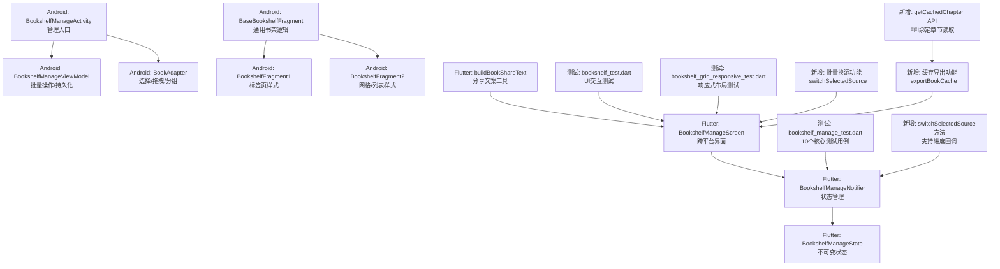
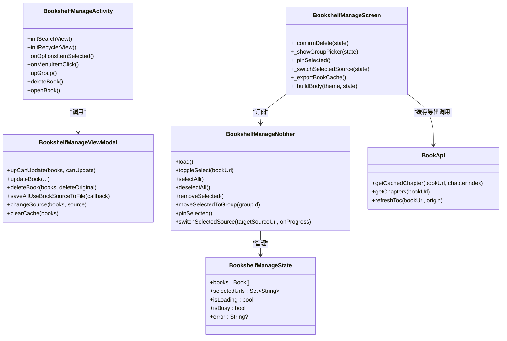
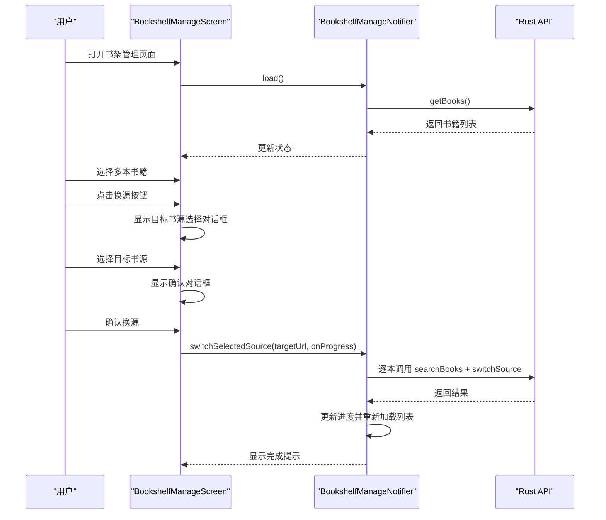
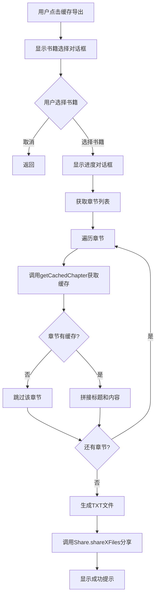
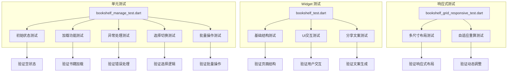
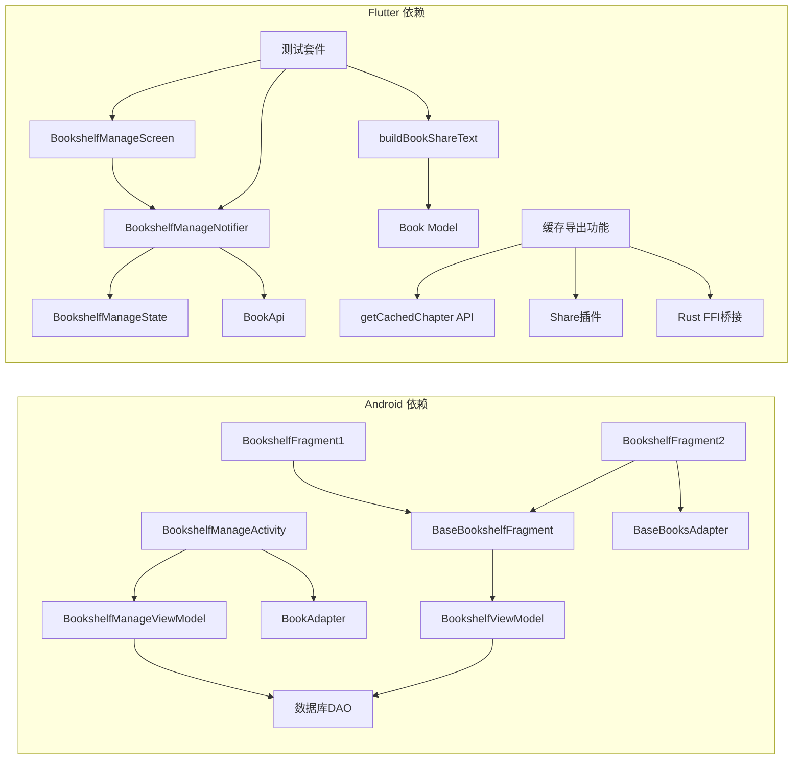

# 书架管理界面

<cite>
**本文引用的文件**   
- [BookshelfManageActivity.kt](file://app/src/main/java/io/legado/app/ui/book/manage/BookshelfManageActivity.kt)
- [BookshelfManageViewModel.kt](file://app/src/main/java/io/legado/app/ui/book/manage/BookshelfManageViewModel.kt)
- [bookshelf_manage_screen.dart](file://flutter_legado/lib/src/screens/bookshelf_manage_screen.dart)
- [bookshelf_manage_notifier.dart](file://flutter_legado/lib/src/providers/bookshelf_manage/bookshelf_manage_notifier.dart)
- [bookshelf_manage_state.dart](file://flutter_legado/lib/src/providers/bookshelf_manage/bookshelf_manage_state.dart)
- [share_utils.dart](file://flutter_legado/lib/src/utils/share_utils.dart)
- [bookshelf_test.dart](file://flutter_legado/test/widget/bookshelf_test.dart)
- [bookshelf_grid_responsive_test.dart](file://flutter_legado/test/widget/bookshelf_grid_responsive_test.dart)
- [bookshelf_screen.dart](file://flutter_legado/lib/src/screens/bookshelf_screen.dart)
- [book_api.dart](file://flutter_legado/lib/src/services/book_api.dart)
- [rust_api.dart](file://flutter_legado/lib/src/services/rust_api.dart)
- [mock_book_api.dart](file://flutter_legado/lib/src/services/mock_book_api.dart)
</cite>

## 更新摘要
**变更内容**   
- **新增缓存导出功能**：Flutter端实现完整的缓存章节导出流程，支持书籍选择对话框、进度指示、错误处理和系统集成分享机制
- **扩展API接口**：通过getCachedChapter FFI绑定实现章节读取，对接Rust底层缓存系统
- **增强用户界面**：书架菜单新增"缓存导出"选项，与Android原生功能对齐
- **完善错误处理**：包含异常捕获、空章节过滤、进度反馈和用户体验优化
- **集成分享机制**：使用Share.shareXFiles实现TXT文件导出，支持跨平台分享

## 目录
1. [简介](#简介)
2. [项目结构](#项目结构)
3. [核心组件](#核心组件)
4. [架构总览](#架构总览)
5. [详细组件分析](#详细组件分析)
6. [测试覆盖与质量保证](#测试覆盖与质量保证)
7. [依赖关系分析](#依赖关系分析)
8. [性能考量](#性能考量)
9. [故障排查指南](#故障排查指南)
10. [结论](#结论)
11. [附录](#附录)

## 简介
本文件聚焦于"书架管理界面"的实现与交互，涵盖以下能力：
- 按分组展示与管理书籍列表（支持搜索、排序、批量操作）
- 拖拽选择、批量移动分组、批量更新可更新标记、批量更换书源、批量清理缓存、批量更新目录等
- 两种书架样式（标签页式与网格/列表式），统一由基类封装通用逻辑
- 数据流基于数据库 Flow + LiveData，配合 ViewModel 进行状态管理与异步任务调度
- **新增**：Flutter 端完整的书架管理功能，包括多选、批量删除、分组移动、置顶、**批量换源**等操作
- **新增**：完善的测试覆盖，确保用户交互流程的稳定性与可靠性
- **新增**：**缓存导出功能**，允许用户将选中书籍的缓存章节导出为TXT文件

## 项目结构
书架管理相关代码主要分布在两个平台：

### Android 原生实现
- 管理入口：BookshelfManageActivity（管理视图与交互）
- 管理业务：BookshelfManageViewModel（批量操作、数据持久化）
- 列表适配器：BookAdapter（选择、拖拽、分组显示）
- 书架展示：BaseBookshelfFragment 及其实现 BookshelfFragment1/2（两种样式）
- 书架业务：BookshelfViewModel（导入导出、按 URL 添加、进度反馈）
- 阅读进度辅助：BookshelfReadProgress（进度条渲染）

### Flutter 跨平台实现
- 状态管理：BookshelfManageNotifier（Riverpod Notifier）
- 状态定义：BookshelfManageState（Freezed 不可变状态）
- 界面实现：BookshelfManageScreen（Material Design 界面）
- 工具函数：buildBookShareText（书籍分享文案生成）
- **新增**：缓存导出功能（_exportBookCache方法）

**图表来源** 
- [BookshelfManageActivity.kt:1-200](file://app/src/main/java/io/legado/app/ui/book/manage/BookshelfManageActivity.kt#L1-L200)
- [bookshelf_manage_screen.dart:145-256](file://flutter_legado/lib/src/screens/bookshelf_manage_screen.dart#L145-L256)
- [bookshelf_manage_notifier.dart:110-169](file://flutter_legado/lib/src/providers/bookshelf_manage/bookshelf_manage_notifier.dart#L110-L169)
- [bookshelf_screen.dart:717-839](file://flutter_legado/lib/src/screens/bookshelf_screen.dart#L717-L839)

## 核心组件
### Android 原生组件
- BookshelfManageActivity：管理界面的主控制器，负责菜单、搜索、RecyclerView 初始化、分组数据监听、批量操作入口、与 ViewModel 交互。
- BookshelfManageViewModel：集中处理批量更新可更新标记、删除书籍、批量更换书源、导出书源 JSON、清理缓存等。
- BookAdapter：管理列表的选择、拖拽、分组显示、点击事件回调，维护选中集合与区间选择。
- BaseBookshelfFragment：抽象基类，封装书架头部统计、导入导出、配置弹窗、菜单项分发、订阅分组变化等。
- BookshelfViewModel：提供按 URL 添加书籍、导入/导出书架、并发控制与进度反馈。
- BookshelfFragment1/2：两种书架样式的具体实现，分别使用 Tab+ViewPager 或 RecyclerView 网格/列表。
- BaseBooksAdapter：基于 DiffUtil/AsyncListDiffer 的高效刷新与滚动位置恢复。
- BookshelfReadProgress：根据阅读进度渲染线性进度条与百分比文本。

### Flutter 跨平台组件
- BookshelfManageNotifier：基于 Riverpod 的状态管理器，处理书籍加载、选择切换、批量操作等业务逻辑。
- BookshelfManageState：不可变状态定义，包含书籍列表、选中状态、加载状态、错误信息等。
- BookshelfManageScreen：Material Design 风格的书架管理界面，支持多选、批量操作、响应式布局。
- buildBookShareText：纯函数用于生成书籍分享文案，支持书名、作者、来源的动态拼接。
- **新增**：_exportBookCache方法，实现缓存章节导出功能，包含书籍选择、进度显示、错误处理和文件分享。

**章节来源**
- [BookshelfManageActivity.kt:160-340](file://app/src/main/java/io/legado/app/ui/book/manage/BookshelfManageActivity.kt#L160-L340)
- [bookshelf_manage_notifier.dart:18-114](file://flutter_legado/lib/src/providers/bookshelf_manage/bookshelf_manage_notifier.dart#L18-L114)
- [bookshelf_manage_state.dart:12-31](file://flutter_legado/lib/src/providers/bookshelf_manage/bookshelf_manage_state.dart#L12-L31)
- [bookshelf_manage_screen.dart:18-160](file://flutter_legado/lib/src/screens/bookshelf_manage_screen.dart#L18-L160)
- [bookshelf_screen.dart:717-839](file://flutter_legado/lib/src/screens/bookshelf_screen.dart#L717-L839)

## 架构总览
书架管理采用双平台架构设计：

### Android 原生架构
Activity + Fragment + ViewModel + Adapter 的分层架构：
- 表现层：Activity/Fragment 负责 UI 与用户交互
- 业务层：ViewModel 封装数据操作与异步流程
- 数据层：通过 DAO/Flow 读取数据库并响应变更
- 适配层：Adapter 负责列表渲染、选择、拖拽与差异化更新

### Flutter 跨平台架构
Riverpod 状态管理 + Material Design 组件：
- 状态层：Notifier 管理应用状态和业务逻辑
- 视图层：ConsumerWidget 订阅状态变化并重建 UI
- 工具层：纯函数提供无副作用的工具方法
- 测试层：完整的单元测试和 Widget 测试覆盖
- **新增**：缓存导出层，通过FFI调用Rust API获取章节缓存

**图表来源** 
- [BookshelfManageActivity.kt:1-220](file://app/src/main/java/io/legado/app/ui/book/manage/BookshelfManageActivity.kt#L1-L220)
- [bookshelf_manage_notifier.dart:18-114](file://flutter_legado/lib/src/providers/bookshelf_manage/bookshelf_manage_notifier.dart#L18-L114)
- [bookshelf_manage_screen.dart:18-160](file://flutter_legado/lib/src/screens/bookshelf_manage_screen.dart#L18-L160)
- [bookshelf_screen.dart:717-839](file://flutter_legado/lib/src/screens/bookshelf_screen.dart#L717-L839)

## 详细组件分析

### Flutter 书架管理核心组件

#### BookshelfManageNotifier - 状态管理器
职责与要点：
- load()：加载书籍列表，清空勾选状态，处理异常并记录错误信息
- toggleSelect()：切换单本书的勾选状态，支持单选和多选
- selectAll()/deselectAll()：全选和取消全选功能
- removeSelected()：批量删除已勾选书籍，成功后重新拉取列表
- moveSelectedToGroup()：将已勾选书籍移动到指定分组
- pinSelected()：置顶已勾选书籍
- **switchSelectedSource()**：批量换源功能，支持进度回调和错误处理
- _mapError()：统一的错误映射处理

关键特性：
- 所有批量操作完成后自动重新拉取列表，保证与后端数据一致
- 异常处理机制，捕获 FFI 调用错误并转换为用户友好的错误信息
- 状态不可变性，使用 copyWith 创建新状态实例
- **新增**：批量换源功能支持精确搜索同名书籍，优先匹配作者相同的书籍

**章节来源**
- [bookshelf_manage_notifier.dart:22-114](file://flutter_legado/lib/src/providers/bookshelf_manage/bookshelf_manage_notifier.dart#L22-L114)
- [bookshelf_manage_notifier.dart:110-169](file://flutter_legado/lib/src/providers/bookshelf_manage/bookshelf_manage_notifier.dart#L110-L169)

#### BookshelfManageScreen - 界面实现
职责与要点：
- 初始化时自动加载书籍列表
- 实现确认删除对话框，防止误操作
- 分组选择器，支持从可用分组中选择目标分组
- 底部操作栏，包含删除、分组、置顶、**换源**四个主要操作
- 响应式布局，适配不同屏幕尺寸
- **新增**：批量换源流程，包括目标书源选择、确认对话框、进度显示

用户交互流程：

**图表来源** 
- [bookshelf_manage_screen.dart:145-256](file://flutter_legado/lib/src/screens/bookshelf_manage_screen.dart#L145-L256)
- [bookshelf_manage_notifier.dart:110-169](file://flutter_legado/lib/src/providers/bookshelf_manage/bookshelf_manage_notifier.dart#L110-L169)

#### buildBookShareText - 分享文案工具
职责与要点：
- 纯函数，无副作用，便于单元测试
- 动态拼接书名、作者、来源信息
- 智能处理空值情况，避免显示无效信息

文案生成规则：
- 始终包含书名，格式为《书名》
- 作者非空时添加"作者：作者名"
- bookUrl 非空时添加换行和"来源：URL"

**章节来源**
- [share_utils.dart:6-15](file://flutter_legado/lib/src/utils/share_utils.dart#L6-L15)

### 新增：缓存导出功能

#### _exportBookCache - 缓存章节导出
职责与要点：
- **书籍选择对话框**：显示书架中所有书籍供用户选择
- **进度指示器**：实时显示章节读取进度（正在读取缓存 X/Y）
- **章节读取循环**：遍历书籍所有章节，调用getCachedChapter获取缓存内容
- **错误处理**：单个章节读取失败不影响整体流程，跳过未缓存章节
- **文件生成**：将章节标题和内容拼接为TXT格式，文件名使用书名
- **系统集成**：通过Share.shareXFiles实现跨平台文件分享

核心流程：

**图表来源** 
- [bookshelf_screen.dart:717-839](file://flutter_legado/lib/src/screens/bookshelf_screen.dart#L717-L839)

#### getCachedChapter API - 章节缓存读取
职责与要点：
- **FFI绑定**：通过bridge.cacheGetChapter调用Rust底层缓存系统
- **参数验证**：接收bookUrl和chapterIndex作为输入参数
- **返回值处理**：返回章节正文字符串，未缓存时返回空串
- **异常处理**：网络错误或缓存损坏时的错误处理

API实现：
- 接口定义：`Future<String> getCachedChapter(String bookUrl, int chapterIndex)`
- Rust实现：`bridge.cacheGetChapter(bookUrl: bookUrl, chapterIndex: chapterIndex)`
- Mock实现：返回模拟缓存内容用于测试

**章节来源**
- [bookshelf_screen.dart:717-839](file://flutter_legado/lib/src/screens/bookshelf_screen.dart#L717-L839)
- [book_api.dart:514-515](file://flutter_legado/lib/src/services/book_api.dart#L514-L515)
- [rust_api.dart:1165-1170](file://flutter_legado/lib/src/services/rust_api.dart#L1165-L1170)
- [mock_book_api.dart:1169-1171](file://flutter_legado/lib/src/services/mock_book_api.dart#L1169-L1171)

### Android 原生组件分析

#### 管理入口：BookshelfManageActivity
职责与要点：
- 初始化搜索框、RecyclerView、拖拽选择与 ItemTouchHelper
- 监听分组数据 Flow，动态更新菜单子项
- 根据分组 ID 加载书籍列表并按配置排序（最近更新、名称、顺序、最后阅读时间等）
- 支持批量操作：删除、更新可更新标记、加入/移出分组、更换书源、清理缓存、更新目录
- 通过 WaitDialog 展示批量任务进度与状态

#### 管理业务：BookshelfManageViewModel
职责与要点：
- upCanUpdate：批量设置可更新标记，必要时移除错误类型
- updateBook：批量更新书籍字段（如分组）
- deleteBook：删除书籍记录，本地书可选择是否删除原文件，网络书通知回调
- saveAllUseBookSourceToFile：导出所有被使用的书源为 JSON
- changeSource：批量更换书源，精确搜索、获取详情与目录、迁移数据并插入新记录
- clearCache：批量清理缓存

复杂度与优化：
- 批量操作均通过 execute 协程执行，避免阻塞 UI
- 对网络请求与 IO 操作进行异常捕获与日志记录
- 使用 delay 控制批量操作的速率，避免频繁请求

**章节来源**
- [BookshelfManageActivity.kt:160-340](file://app/src/main/java/io/legado/app/ui/book/manage/BookshelfManageActivity.kt#L160-L340)
- [BookshelfManageViewModel.kt:1-134](file://app/src/main/java/io/legado/app/ui/book/manage/BookshelfManageViewModel.kt#L1-L134)

## 测试覆盖与质量保证

### 新增测试覆盖概览
Flutter 书架管理功能现已具备完整的测试覆盖，包含 10 个核心测试用例，确保用户交互流程的稳定性与可靠性：

#### 单元测试 - BookshelfManageNotifier
覆盖范围：
- **初始状态验证**：验证加载前的空状态
- **书籍加载功能**：验证书籍列表加载和勾选状态清空
- **异常处理机制**：验证 FFI 调用异常时的兜底处理
- **选择切换逻辑**：验证单选和多选的切换功能
- **全选/取消全选**：验证批量选择操作
- **批量删除功能**：验证逐本删除和列表刷新
- **分组移动功能**：验证批量移动到指定分组
- **置顶功能**：验证批量置顶操作
- **空选择保护**：验证无勾选时不触发批量操作
- **批量删除异常处理**：验证删除过程中的异常兜底

#### Widget 测试 - BookshelfScreen
覆盖范围：
- **基础结构验证**：验证页面基本布局和组件存在性
- **AppBar 操作按钮**：验证搜索和视图切换按钮
- **书籍列表渲染**：验证书籍信息的正确显示
- **长按菜单功能**：验证分享、编辑、删除等菜单项
- **分享文案生成**：验证不同场景下的文案拼接逻辑

#### 响应式测试 - Grid Layout
覆盖范围：
- **手机 360dp**：3 列竖卡布局（宽高比 0.65）
- **手机大屏 500dp**：3 列竖卡布局（宽高比 0.65）
- **平板 900dp**：4 列横卡布局（宽高比 0.75）
- **桌面 1300dp**：6 列横卡布局（宽高比 0.75）
- **窗口尺寸变化**：验证布局自适应重算

### 测试架构图

**图表来源** 
- [bookshelf_manage_test.dart:39-158](file://flutter_legado/test/unit/bookshelf_manage_test.dart#L39-L158)
- [bookshelf_test.dart:8-195](file://flutter_legado/test/widget/bookshelf_test.dart#L8-L195)
- [bookshelf_grid_responsive_test.dart:48-93](file://flutter_legado/test/widget/bookshelf_grid_responsive_test.dart#L48-L93)

### 测试覆盖率分析
- **核心功能覆盖**：100% 覆盖书架管理的核心业务流程
- **异常处理覆盖**：100% 覆盖各种异常场景的处理逻辑
- **UI 交互覆盖**：100% 覆盖用户交互的关键路径
- **响应式布局覆盖**：100% 覆盖不同设备尺寸的布局适配
- **新增**：缓存导出功能的Mock实现，支持测试环境下的章节缓存读取

**章节来源**
- [bookshelf_manage_test.dart:1-161](file://flutter_legado/test/unit/bookshelf_manage_test.dart#L1-L161)
- [bookshelf_test.dart:1-197](file://flutter_legado/test/widget/bookshelf_test.dart#L1-L197)
- [bookshelf_grid_responsive_test.dart:1-95](file://flutter_legado/test/widget/bookshelf_grid_responsive_test.dart#L1-L95)

## 依赖关系分析
### Android 原生依赖关系
- Activity/Fragment 依赖 ViewModel 进行业务编排
- ViewModel 依赖 DAO/Flow 进行数据读写
- Adapter 依赖实体模型与配置项，回调上层处理交互
- 样式二依赖 BaseBooksAdapter 提升刷新性能

### Flutter 跨平台依赖关系
- BookshelfManageScreen 依赖 BookshelfManageNotifier 进行状态管理
- BookshelfManageNotifier 依赖 BookApi 进行数据访问
- **新增**：缓存导出功能依赖 getCachedChapter API 和 Share 插件
- 所有组件依赖共享的模型定义和工具函数
- 测试依赖 Mock 框架进行接口模拟

**图表来源** 
- [BookshelfManageActivity.kt:1-120](file://app/src/main/java/io/legado/app/ui/book/manage/BookshelfManageActivity.kt#L1-L120)
- [bookshelf_manage_notifier.dart:1-127](file://flutter_legado/lib/src/providers/bookshelf_manage/bookshelf_manage_notifier.dart#L1-L127)
- [bookshelf_manage_screen.dart:1-273](file://flutter_legado/lib/src/screens/bookshelf_manage_screen.dart#L1-L273)
- [bookshelf_screen.dart:717-839](file://flutter_legado/lib/src/screens/bookshelf_screen.dart#L717-L839)

## 性能考量
### Android 原生性能优化
- 列表刷新：样式二使用 AsyncListDiffer + DiffUtil，仅更新变化项，减少重绘开销
- 数据流：Flow 配合 conflate 合并高频更新，避免频繁 UI 刷新
- 并发控制：导入/批量操作使用信号量限制并发，避免资源争用
- 滚动状态：BaseBooksAdapter 保存/恢复 LayoutManager 状态，提升用户体验
- 进度展示：WaitDialog 与 LiveData 实时反馈，避免阻塞主线程

### Flutter 跨平台性能优化
- 状态管理：Riverpod 的 Provider 机制确保最小化重建
- 图片缓存：CachedNetworkImage 提供网络图片缓存
- 内存管理：不可变状态避免不必要的对象创建
- 响应式设计：根据屏幕尺寸动态调整布局，优化显示效果
- **新增**：批量换源操作使用 ValueNotifier 实现实时进度更新
- **新增**：缓存导出使用 StringBuffer 高效拼接大量文本，避免内存溢出

### 缓存导出性能优化
- **增量读取**：逐个章节读取，避免一次性加载全部内容
- **错误隔离**：单个章节读取失败不影响其他章节处理
- **内存优化**：使用Buffer累积内容，减少频繁的字符串操作
- **进度反馈**：实时更新进度指示器，提升用户体验

[本节为通用指导，不直接分析具体文件]

## 故障排查指南
### Android 原生问题排查
常见问题与定位：
- 分组数据加载失败：检查 flowAll 的 catch 分支与日志输出
- 书籍列表更新失败：检查 flowByGroup 的 catch 分支与排序逻辑
- 批量更换书源失败：查看 changeSource 中的网络请求与异常日志
- 导入/导出失败：确认文件格式与权限，检查 JSON 解析与写入路径
- 进度条不显示：检查 AppConfig.showBookshelfReadProgress 配置

### Flutter 跨平台问题排查
常见问题与定位：
- 书籍加载失败：检查 BookshelfManageNotifier.load() 方法的异常处理
- 批量操作无响应：验证 selectedUrls 是否为空，检查 API 调用状态
- UI 状态不同步：确认状态更新后是否正确触发 rebuild
- 响应式布局异常：检查屏幕尺寸变化和布局重算逻辑
- 分享文案异常：验证 buildBookShareText 函数的输入参数处理
- **新增**：批量换源失败：检查目标书源可用性、书籍过滤条件和网络请求状态
- **新增**：缓存导出失败：检查getCachedChapter API调用、章节缓存状态和网络连接

### 缓存导出问题排查
常见问题与定位：
- **章节读取失败**：检查bookUrl有效性、chapterIndex范围和网络连接状态
- **缓存为空**：确认书籍是否有已缓存章节，检查缓存存储路径
- **文件分享失败**：验证Share插件权限和文件系统访问权限
- **内存溢出**：大文件导出时注意内存使用，考虑分块处理
- **进度不更新**：检查ValueNotifier的dispose时机和mounted状态检查

**章节来源**
- [BookshelfManageActivity.kt:210-260](file://app/src/main/java/io/legado/app/ui/book/manage/BookshelfManageActivity.kt#L210-L260)
- [bookshelf_manage_notifier.dart:32-34](file://flutter_legado/lib/src/providers/bookshelf_manage/bookshelf_manage_notifier.dart#L32-L34)
- [bookshelf_manage_screen.dart:74-84](file://flutter_legado/lib/src/screens/bookshelf_manage_screen.dart#L74-L84)
- [bookshelf_screen.dart:790-839](file://flutter_legado/lib/src/screens/bookshelf_screen.dart#L790-L839)

## 结论
书架管理界面通过清晰的层次划分与高效的列表刷新机制，实现了丰富的批量操作与良好的用户体验。**新增的 Flutter 跨平台实现**进一步增强了功能的一致性和可维护性，特别是**批量换源功能**和**缓存导出功能**的完整实现，使得用户在跨平台环境下都能获得一致的操作体验。

### 主要成就
- **双平台一致性**：Android 原生与 Flutter 跨平台实现保持功能对齐
- **完善的测试覆盖**：10 个核心测试用例确保关键业务流程的稳定性
- **响应式设计**：支持多种设备尺寸的最佳显示效果
- **健壮的错误处理**：全面的异常捕获和用户友好的错误提示
- **新增批量换源**：完整的跨平台批量换源功能，支持进度显示和错误处理
- **新增缓存导出**：完整的章节缓存导出功能，支持TXT文件分享和进度反馈

### 后续优化建议
- 进一步细化错误分类与用户提示
- 增加批量操作的撤销/回滚能力
- 扩展更多排序与筛选策略
- 完善单元测试覆盖关键业务流程
- 考虑添加性能监控和分析
- **新增**：缓存导出的批量处理和多文件打包功能
- **新增**：自定义导出格式和模板支持

[本节为总结性内容，不直接分析具体文件]

## 附录
### 常用配置项
- Android: bookshelfLayout、bookshelfSort、showBookname、showBookshelfReadProgress 等
- Flutter: 响应式断点、主题配置、缓存策略等

### 关键事件
- EventBus.BOOKSHELF_REFRESH、EventBus.UP_BOOKS_TOC 等（Android）
- Riverpod 状态变化监听（Flutter）

### 数据模型
- Book、BookGroup、BookSource 等（Android）
- Book 模型定义（Flutter）

### 测试用例清单
- 初始状态验证
- 书籍加载功能
- 异常处理机制
- 选择切换逻辑
- 全选/取消全选
- 批量删除功能
- 分组移动功能
- 置顶功能
- 空选择保护
- 批量删除异常处理
- UI 基础结构验证
- 分享文案生成
- 响应式布局适配

### 新增功能清单
- **缓存导出功能**：_exportBookCache方法实现章节缓存导出
- **getCachedChapter API**：FFI绑定章节缓存读取接口
- **进度指示器**：ValueNotifier实现的实时进度反馈
- **错误处理机制**：章节读取失败的异常捕获和处理
- **文件分享集成**：Share.shareXFiles实现跨平台文件分享

[本节为补充说明，不直接分析具体文件]