# 书籍信息界面增强

<cite>
**本文引用的文件**   
- [README.md](file://README.md)
- [BookInfoActivity.kt](file://app/src/main/java/io/legado/app/ui/book/info/BookInfoActivity.kt)
- [BookInfoViewModel.kt](file://app/src/main/java/io/legado/app/ui/book/info/BookInfoViewModel.kt)
- [BookInfo.kt](file://app/src/main/java/io/legado/app/model/webBook/BookInfo.kt)
- [book_info_screen.dart](file://flutter_legado/lib/src/screens/book_info_screen.dart)
- [auto_task_screen.dart](file://flutter_legado/lib/src/screens/auto_task_screen.dart)
- [webdav_settings_screen.dart](file://flutter_legado/lib/src/screens/webdav_settings_screen.dart)
- [dialog_variable.xml](file://app/src/main/res/layout/dialog_variable.xml)
- [toc_screen.dart](file://flutter_legado/lib/src/screens/toc_screen.dart)
- [models.dart](file://flutter_legado/lib/src/models/models.dart)
- [book_api.dart](file://flutter_legado/lib/src/services/book_api.dart)
- [ffi.dart](file://flutter_legado/lib/src/bridge/ffi/ffi.dart)
</cite>

## 更新摘要
**所做更改**   
- 书籍信息界面进行了重大简化，移除了内嵌章节列表和搜索功能，改为显示封面、书籍详情和导航到专用目录界面的简洁界面
- 改进了摘要面板的字数徽章和分组选项，提供更清晰的信息展示
- 实现了独立的目录界面（TocScreen），将章节浏览、搜索、书签等功能迁移到专用页面
- **新增** 添加了书籍变量管理对话框和与自动任务管理屏幕的无缝集成，用于从书籍信息屏幕创建/编辑更新任务
- **新增** 实现了WebDAV上传功能，允许用户将本地书籍上传到远程WebDAV服务器，包括配置验证、覆盖确认对话框和错误处理
- **新增** 增强了源变量管理功能，通过新的 _setSourceVariable() 方法和可复用的 _VariableDialog 组件，支持设置和清除变量，并显示适当的注释信息
- **修复** 解决了红屏问题，通过在对话框状态树中正确管理控制器生命周期
- 优化了用户交互流程，通过「查看目录」按钮导航到专门的目录页面，提升界面专注度

## 目录
1. [简介](#简介)
2. [项目结构](#项目结构)
3. [核心组件](#核心组件)
4. [架构总览](#架构总览)
5. [详细组件分析](#详细组件分析)
6. [依赖关系分析](#依赖关系分析)
7. [性能考量](#性能考量)
8. [故障排查指南](#故障排查指南)
9. [结论](#结论)
10. [附录](#附录)

## 简介
本文件聚焦"书籍信息界面增强"目标，围绕 Android 原生端与 Flutter 跨平台端的书籍详情页面进行系统化梳理。内容涵盖：
- 数据加载与渲染流程（封面、书名、作者、来源、最新章节、分组、目录、简介）
- 交互能力（编辑、刷新、更新目录、登录、置顶、清缓存、分享、导出等）
- 简介渲染策略（纯文本、HTML、Markdown、WebView）
- 双端实现差异与对齐方案
- 性能优化与错误处理建议

**最新更新** 书籍信息界面进行了重大简化，移除了内嵌章节列表和搜索功能，改为显示封面、书籍详情和导航到专用目录界面的简洁界面，同时改进了摘要面板的字数徽章和分组选项。**新增功能** 实现了书籍变量管理对话框和与自动任务管理屏幕的无缝集成，允许用户直接从书籍信息界面创建或编辑书籍更新任务。**新增功能** 实现了WebDAV上传功能，支持将本地书籍文件上传到远程WebDAV服务器，包含完整的配置验证、覆盖确认对话框和错误处理机制。**新增功能** 增强了源变量管理功能，通过新的 _setSourceVariable() 方法和可复用的 _VariableDialog 组件，支持设置和清除变量，并显示适当的注释信息，同时修复了红屏问题。

## 项目结构
本项目采用 Rust 核心 + Flutter UI 的跨平台架构，同时保留 Android 原生代码用于历史功能与迁移过渡。书籍信息界面在两端均有实现：
- Android 原生：BookInfoActivity + BookInfoViewModel + BookInfo（规则解析）
- Flutter：BookInfoScreen（UI 层），配合模型与 Provider/Service 完成数据获取与展示，以及独立的 TocScreen（目录界面）

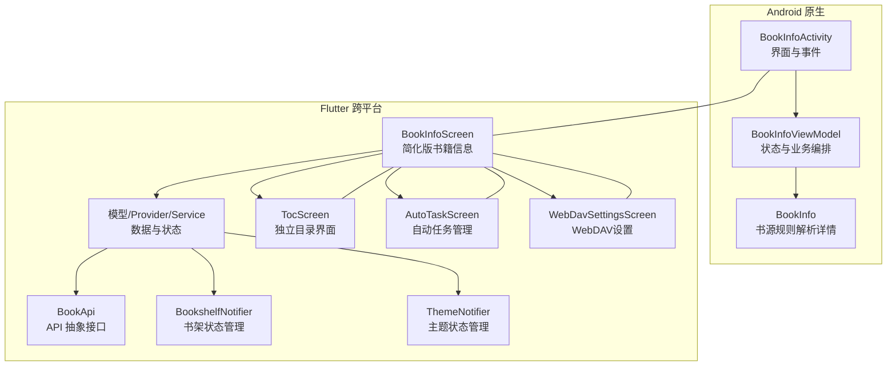

图表来源
- [BookInfoActivity.kt:127-278](file://app/src/main/java/io/legado/app/ui/book/info/BookInfoActivity.kt#L127-L278)
- [BookInfoViewModel.kt:95-174](file://app/src/main/java/io/legado/app/ui/book/info/BookInfoViewModel.kt#L95-L174)
- [BookInfo.kt:25-176](file://app/src/main/java/io/legado/app/model/webBook/BookInfo.kt#L25-L176)
- [book_info_screen.dart:24-239](file://flutter_legado/lib/src/screens/book_info_screen.dart#L24-L239)
- [auto_task_screen.dart:17-800](file://flutter_legado/lib/src/screens/auto_task_screen.dart#L17-L800)
- [webdav_settings_screen.dart:1-280](file://flutter_legado/lib/src/screens/webdav_settings_screen.dart#L1-L280)
- [toc_screen.dart:15-921](file://flutter_legado/lib/src/screens/toc_screen.dart#L15-L921)
- [book_api.dart:1-200](file://flutter_legado/lib/src/services/book_api.dart#L1-L200)

章节来源
- [README.md:10-26](file://README.md#L10-L26)

## 核心组件
- Android 端
  - BookInfoActivity：负责 UI 组装、菜单项、WebView/Markdown/HTML 简介渲染、底部操作栏、事件分发与结果回调
  - BookInfoViewModel：管理书籍与目录数据、网络请求跟踪、书架状态、换源/导入/下载、缓存清理、置顶等操作
  - BookInfo：基于书源规则解析详情页元数据（书名、作者、分类、字数、最新章节、简介、封面、目录链接或下载链接）
- Flutter 端
  - BookInfoScreen：简化的书籍信息页，包含封面背景、半透明遮罩、信息面板、溢出菜单等，不再内嵌章节列表
  - AutoTaskScreen：自动任务管理界面，支持任务的创建、编辑、导入、导出和管理
  - WebDavSettingsScreen：WebDAV设置界面，支持服务器配置、备份恢复操作
  - TocScreen：独立的目录界面，提供章节浏览、搜索、书签、标注等功能
  - BookApi：定义所有数据层公开方法签名，支持真实 FFI 实现和 Mock 实现
  - BookshelfNotifier：管理书架状态，支持 notShelf 标志位处理
  - ThemeNotifier：管理全局主题状态，支持亮/暗/跟随系统模式切换

**新增功能** Flutter 端的 _loadData 方法现在具备智能的书籍信息加载管道，能够自动检测和处理在线书籍的元数据缺失问题。**新增功能** 实现了简化的书籍信息界面，专注于展示书籍基本信息，通过导航到专用目录界面来处理章节相关功能。**新增功能** 集成了书籍变量管理对话框和自动任务管理屏幕，允许用户直接从书籍信息界面创建或编辑更新任务。**新增功能** 实现了WebDAV上传功能，支持本地书籍文件上传到远程服务器，包含完整的配置验证和错误处理。**新增功能** 增强了源变量管理功能，通过新的 _setSourceVariable() 方法和可复用的 _VariableDialog 组件，支持设置和清除变量，并显示适当的注释信息。

章节来源
- [BookInfoActivity.kt:127-278](file://app/src/main/java/io/legado/app/ui/book/info/BookInfoActivity.kt#L127-L278)
- [BookInfoViewModel.kt:95-174](file://app/src/main/java/io/legado/app/ui/book/info/BookInfoViewModel.kt#L95-L174)
- [BookInfo.kt:25-176](file://app/src/main/java/io/legado/app/model/webBook/BookInfo.kt#L25-L176)
- [book_info_screen.dart:24-239](file://flutter_legado/lib/src/screens/book_info_screen.dart#L24-L239)
- [auto_task_screen.dart:17-800](file://flutter_legado/lib/src/screens/auto_task_screen.dart#L17-L800)
- [webdav_settings_screen.dart:1-280](file://flutter_legado/lib/src/screens/webdav_settings_screen.dart#L1-L280)
- [toc_screen.dart:15-921](file://flutter_legado/lib/src/screens/toc_screen.dart#L15-L921)
- [book_api.dart:1-200](file://flutter_legado/lib/src/services/book_api.dart#L1-L200)

## 架构总览
下图展示了从用户操作到数据加载、解析与渲染的整体流程，以及 Android 与 Flutter 两端的职责边界。

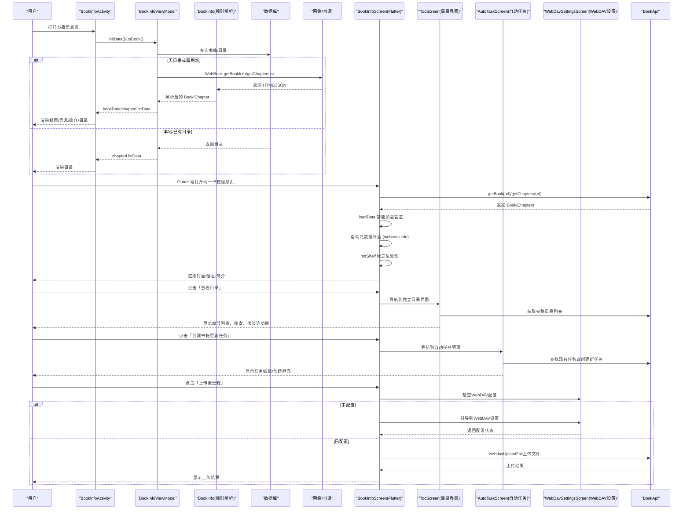

图表来源
- [BookInfoActivity.kt:252-278](file://app/src/main/java/io/legado/app/ui/book/info/BookInfoActivity.kt#L252-L278)
- [BookInfoViewModel.kt:113-174](file://app/src/main/java/io/legado/app/ui/book/info/BookInfoViewModel.kt#L113-L174)
- [BookInfo.kt:25-176](file://app/src/main/java/io/legado/app/model/webBook/BookInfo.kt#L25-L176)
- [book_info_screen.dart:68-239](file://flutter_legado/lib/src/screens/book_info_screen.dart#L68-L239)
- [auto_task_screen.dart:17-800](file://flutter_legado/lib/src/screens/auto_task_screen.dart#L17-L800)
- [webdav_settings_screen.dart:1-280](file://flutter_legado/lib/src/screens/webdav_settings_screen.dart#L1-L280)
- [toc_screen.dart:15-921](file://flutter_legado/lib/src/screens/toc_screen.dart#L15-L921)
- [book_api.dart:1-200](file://flutter_legado/lib/src/services/book_api.dart#L1-L200)

## 详细组件分析

### Android 端：BookInfoActivity
- 职责
  - 初始化主题色、进度条、背景视图
  - 订阅 ViewModel 的数据流（书籍、目录、加载态、等待对话框）
  - 处理菜单项（编辑、刷新、更新目录、登录、置顶、拷贝链接、允许更新、拆分长章节、删除警告、清除缓存、日志）
  - 简介渲染：支持纯文本、HTML、Markdown、WebView（含 JS 注入与图片点击）
  - 底部操作栏：加入书架/移出书架、开始阅读/继续阅读
- 关键流程
  - onActivityCreated：绑定数据观察、初始化事件
  - showBook/showBookIntro：根据 Book 字段动态显示信息，简介按标记选择渲染方式
  - upTvBookshelf：同步书架状态
  - 自定义 WebViewClient：拦截协议跳转、注入 JS、处理图片点击

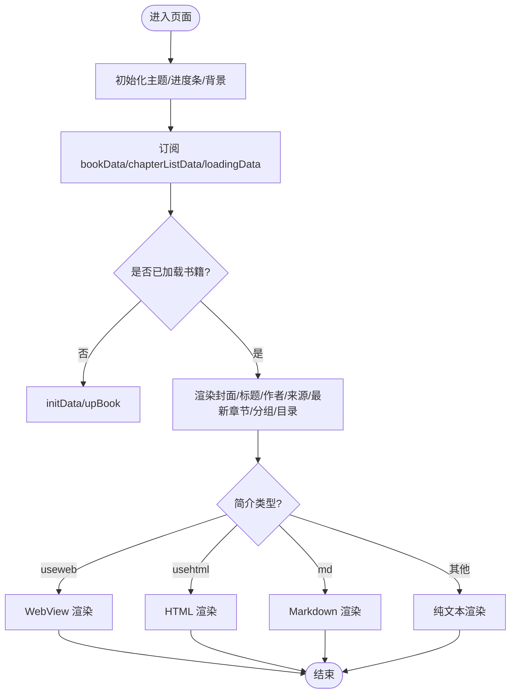

图表来源
- [BookInfoActivity.kt:252-278](file://app/src/main/java/io/legado/app/ui/book/info/BookInfoActivity.kt#L252-L278)
- [BookInfoActivity.kt:539-724](file://app/src/main/java/io/legado/app/ui/book/info/BookInfoActivity.kt#L539-L724)

章节来源
- [BookInfoActivity.kt:127-278](file://app/src/main/java/io/legado/app/ui/book/info/BookInfoActivity.kt#L127-L278)
- [BookInfoActivity.kt:539-724](file://app/src/main/java/io/legado/app/ui/book/info/BookInfoActivity.kt#L539-L724)

### Android 端：BookInfoViewModel
- 职责
  - 管理书籍与目录数据、网络加载计数、等待对话框状态
  - 加载书籍详情与目录（区分本地与网络书源）
  - 处理换源、导入/下载在线文件、归档导入、置顶、保存、加入书架、清空缓存
  - 执行书源 JS 按钮回调
- 关键流程
  - initData/upBook：优先从数据库查找书籍，设置书架状态与来源
  - loadBookInfo/loadChapter：调用 WebBook/LocalBook 获取数据并持久化
  - refreshBook：远程下载/更新逻辑
  - topBook/clearCache/onButtonClick：辅助功能

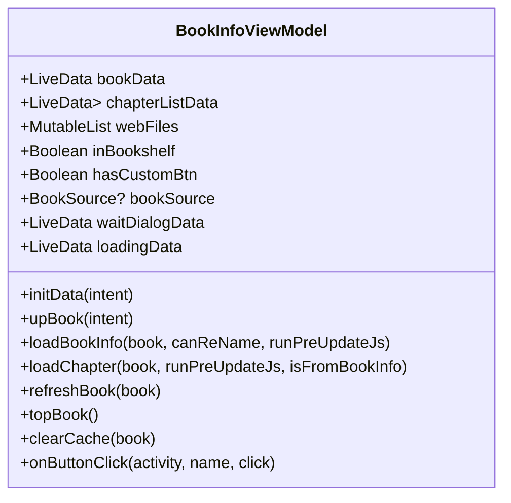

图表来源
- [BookInfoViewModel.kt:95-174](file://app/src/main/java/io/legado/app/ui/book/info/BookInfoViewModel.kt#L95-174)
- [BookInfoViewModel.kt:229-342](file://app/src/main/java/io/legado/app/ui/book/info/BookInfoViewModel.kt#L229-342)
- [BookInfoViewModel.kt:479-587](file://app/src/main/java/io/legado/app/ui/book/info/BookInfoViewModel.kt#L479-587)

章节来源
- [BookInfoViewModel.kt:95-174](file://app/src/main/java/io/legado/app/ui/book/info/BookInfoViewModel.kt#L95-L174)
- [BookInfoViewModel.kt:229-342](file://app/src/main/java/io/legado/app/ui/book/info/BookInfoViewModel.kt#L229-L342)
- [BookInfoViewModel.kt:479-587](file://app/src/main/java/io/legado/app/ui/book/info/BookInfoViewModel.kt#L479-L587)

### Android 端：BookInfo（规则解析）
- 职责
  - 根据书源的 BookInfoRule 解析详情页 HTML/JSON，填充 Book 字段
  - 支持简介特殊标记（<usehtml>/<md>/<useweb>）原样保留以便前端渲染
  - 非网页文件时解析目录链接；网页文件时解析下载链接列表
- 关键流程
  - analyzeBookInfo：设置 AnalyzeRule 上下文，依次解析名称、作者、分类、字数、最新章节、简介、封面、目录/下载链接

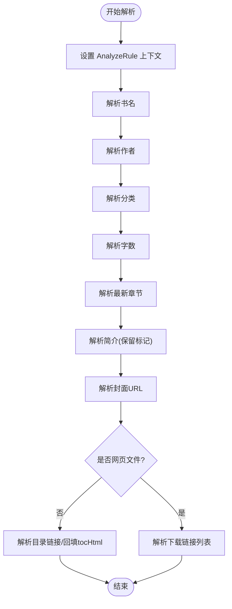

图表来源
- [BookInfo.kt:25-176](file://app/src/main/java/io/legado/app/model/webBook/BookInfo.kt#L25-176)

章节来源
- [BookInfo.kt:25-176](file://app/src/main/java/io/legado/app/model/webBook/BookInfo.kt#L25-L176)

### Flutter 端：简化的 BookInfoScreen
- 职责
  - 使用 FutureBuilder 异步加载书籍信息与目录
  - 构建封面背景+遮罩+SafeArea+RefreshIndicator
  - 信息面板：书名、标签、作者、来源、最新章节、分组、目录入口、简介折叠
  - 溢出菜单：上传、刷新、更新目录、创建更新任务、登录、置顶、源变量、书籍变量、拷贝链接、允许更新、拆分长章节、删除警告、清缓存、日志
  - **重要变更**：移除了内嵌章节列表和搜索功能，改为导航到专用目录界面
- 关键流程
  - _loadData：通过 BookApi 获取书籍与目录，判断书架状态，支持智能元数据补全
  - _buildPage/_buildBody：分层渲染，保证沉浸式封面效果
  - _handleMenu：统一处理菜单项，部分功能后续版本支持
  - **新增**：_openBookUpdateTask 方法导航到自动任务管理界面
  - **新增**：_uploadToRemote 方法实现WebDAV上传功能
  - **新增**：_setSourceVariable 方法实现源变量管理功能

**重大更新** _loadData 方法现在实现了完整的书籍信息加载管道：
1. 优先从数据库获取最新记录
2. 智能检测在线书籍且无目录的情况
3. 自动调用 webbookInfo 补全元数据（封面、简介、目录链接等）
4. 根据书架状态决定目录获取策略（已入库走 DB 刷新，未入库仅网络获取）
5. 支持 notShelf 标志位处理临时在线书籍

**新增功能** _uploadToRemote 方法实现了完整的WebDAV上传流程：
1. 验证是否为本地书籍（仅本地书支持上传）
2. 检查WebDAV配置状态，未配置时引导用户设置
3. 对于已有远程地址的书籍，显示覆盖确认对话框
4. 调用 webdavUploadFile FFI 进行大文件上传
5. 成功后更新书籍的 origin 字段为 webDavTag + 远程地址
6. 刷新最后检查时间并重新加载书籍信息

**新增功能** _setSourceVariable 方法实现了完整的源变量管理流程：
1. 验证书源是否存在
2. 获取书源的 variableComment 作为说明文案
3. 显示可复用的 _VariableDialog 对话框
4. 支持设置和清除变量（空串=清除）
5. 调用 api.setSourceVariable 进行单列 UPDATE 写库
6. 刷新本地书源状态并显示成功提示

```mermaid
sequenceDiagram
participant U as "用户"
participant S as "BookInfoScreen"
participant D as "_VariableDialog"
participant T as "TocScreen"
participant AT as "AutoTaskScreen"
participant WDS as "WebDavSettingsScreen"
participant API as "BookApi"
participant Shelf as "BookshelfNotifier"
U->>S : 打开书籍信息页
S->>API : getBook(url)/getChapters(url)
API-->>S : 返回 Book/Chapters
S->>S : 检查是否为在线书籍且无目录
alt 需要元数据补全
S->>API : webbookInfo(sourceJson, bookUrl)
API-->>S : 返回补充的元数据
S->>S : _mergeWebInfo 合并数据
end
alt 需要目录获取
S->>API : webbookChapters(sourceJson, bookUrl)
API-->>S : 返回章节列表
end
S->>Shelf : 判断是否在书架考虑 notShelf
S-->>U : 渲染封面/信息/简介
U->>S : 点击「查看目录」
S->>T : 导航到独立目录界面
T->>API : 获取完整目录列表
T-->>U : 显示章节列表、搜索、书签等功能
U->>S : 点击「创建书籍更新任务」
S->>AT : 导航到自动任务管理
AT->>API : 查找现有任务或创建新任务
AT-->>U : 显示任务编辑/创建界面
U->>S : 点击「上传至远程」
S->>WDS : 检查WebDAV配置
alt 未配置
S->>WDS : 引导到WebDAV设置
WDS-->>S : 返回配置状态
else 已配置
S->>API : webdavUploadFile上传文件
API-->>S : 上传结果
S-->>U : 显示上传结果
end
U->>S : 点击「源变量」
S->>D : 显示变量对话框
D-->>S : 返回变量值
S->>API : setSourceVariable
API-->>S : 保存结果
S-->>U : 显示保存结果
end
```

图表来源
- [book_info_screen.dart:68-239](file://flutter_legado/lib/src/screens/book_info_screen.dart#L68-L239)
- [book_info_screen.dart:271-340](file://flutter_legado/lib/src/screens/book_info_screen.dart#L271-340)
- [book_info_screen.dart:552-640](file://flutter_legado/lib/src/screens/book_info_screen.dart#L552-L640)
- [book_info_screen.dart:566-613](file://flutter_legado/lib/src/screens/book_info_screen.dart#L566-L613)
- [book_info_screen.dart:1833-1907](file://flutter_legado/lib/src/screens/book_info_screen.dart#L1833-L1907)
- [auto_task_screen.dart:17-800](file://flutter_legado/lib/src/screens/auto_task_screen.dart#L17-L800)
- [webdav_settings_screen.dart:1-280](file://flutter_legado/lib/src/screens/webdav_settings_screen.dart#L1-L280)
- [toc_screen.dart:15-921](file://flutter_legado/lib/src/screens/toc_screen.dart#L15-L921)
- [book_api.dart:1-200](file://flutter_legado/lib/src/services/book_api.dart#L1-L200)

章节来源
- [book_info_screen.dart:24-239](file://flutter_legado/lib/src/screens/book_info_screen.dart#L24-L239)
- [book_info_screen.dart:271-340](file://flutter_legado/lib/src/screens/book_info_screen.dart#L271-340)
- [book_info_screen.dart:552-640](file://flutter_legado/lib/src/screens/book_info_screen.dart#L552-L640)
- [book_info_screen.dart:566-613](file://flutter_legado/lib/src/screens/book_info_screen.dart#L566-L613)
- [book_info_screen.dart:1833-1907](file://flutter_legado/lib/src/screens/book_info_screen.dart#L1833-L1907)

### Flutter 端：自动任务管理屏幕（AutoTaskScreen）
- 职责
  - 提供完整的定时任务管理功能，包括任务的创建、编辑、导入、导出和执行
  - 支持多种任务类型：刷新目录、更新书源、自动备份
  - 实现 cron 表达式验证和调度器同步
  - 提供任务列表展示和操作菜单
- 关键流程
  - _showBookUpdateTaskDialog：创建/编辑书籍更新任务对话框
  - _handleInitialIntent：处理路由参数意图（编辑/新建）
  - _importFromRaw：导入任务配置（本地文件或线上URL）
  - _exportTasks：导出任务为 JSON 文件

**新增功能** 自动任务管理屏幕提供了完整的任务管理功能：
1. 任务创建/编辑：支持任务名称和 cron 表达式配置
2. 任务导入：支持本地文件和线上 URL 导入
3. 任务导出：将任务配置导出为 JSON 文件
4. 任务执行：支持立即运行和定时执行
5. 任务管理：支持启用/禁用、删除等操作

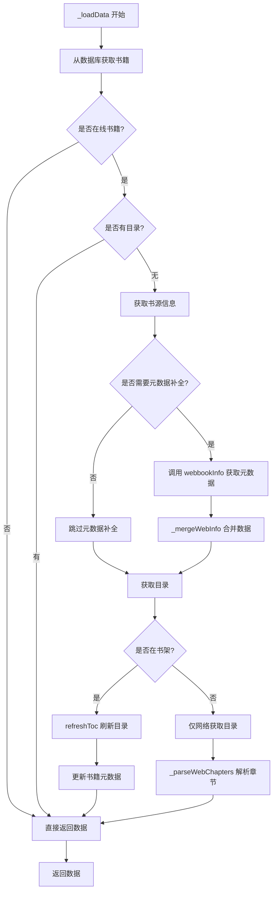

图表来源
- [book_info_screen.dart:68-133](file://flutter_legado/lib/src/screens/book_info_screen.dart#L68-133)
- [book_info_screen.dart:144-216](file://flutter_legado/lib/src/screens/book_info_screen.dart#L144-216)
- [auto_task_screen.dart:17-800](file://flutter_legado/lib/src/screens/auto_task_screen.dart#L17-L800)

章节来源
- [book_info_screen.dart:68-133](file://flutter_legado/lib/src/screens/book_info_screen.dart#L68-L133)
- [book_info_screen.dart:144-216](file://flutter_legado/lib/src/screens/book_info_screen.dart#L144-L216)
- [auto_task_screen.dart:17-800](file://flutter_legado/lib/src/screens/auto_task_screen.dart#L17-L800)

### Flutter 端：WebDAV设置屏幕（WebDavSettingsScreen）
- 职责
  - 提供WebDAV服务器配置管理，包括服务器地址、账号、密码、子目录、设备名设置
  - 支持备份和恢复操作，将书架与书源数据同步到WebDAV服务器
  - 提供同步进度控制和错误提示
  - 实现配置的状态管理和持久化存储
- 关键流程
  - _loadConfig：从SyncNotifier加载已保存的配置
  - _saveAll：整体保存当前配置到SyncNotifier
  - _backup：备份书架与书源到WebDAV
  - _restore：从WebDAV恢复数据
  - _runWithProgress：显示不可关闭的进度对话框并执行任务

**新增功能** WebDAV设置屏幕提供了完整的WebDAV配置管理：
1. 服务器配置：支持服务器地址、账号、密码、子目录、设备名设置
2. 同步选项：支持书籍进度同步和增强同步功能
3. 备份恢复：提供完整的备份和恢复操作流程
4. 进度控制：显示同步进度和错误信息
5. 配置验证：确保配置的有效性

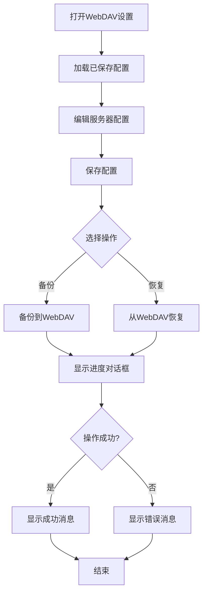

图表来源
- [webdav_settings_screen.dart:1-280](file://flutter_legado/lib/src/screens/webdav_settings_screen.dart#L1-L280)

章节来源
- [webdav_settings_screen.dart:1-280](file://flutter_legado/lib/src/screens/webdav_settings_screen.dart#L1-L280)

### Flutter 端：独立的 TocScreen（目录界面）
- 职责
  - 提供完整的章节浏览功能，包括卷分组、当前章节高亮、自动定位
  - 实现章节搜索功能（300ms 防抖）
  - 支持倒序目录、替换规则、加载字数开关等配置
  - 集成书签和标注功能（三 Tab 设计）
  - 显示章节缓存状态云图标
- 关键流程
  - _loadChapters：加载章节列表，支持自动刷新和缓存状态查询
  - _buildChapterTab：构建章节列表，支持搜索过滤和倒序显示
  - _buildBookmarkTab/_buildHighlightTab：构建书签和标注列表
  - 底部操作栏：当前章节信息条 + 跳转顶部/底部

**新增功能** 独立的目录界面提供了完整的章节管理功能：
1. 三 Tab 设计：目录 / 书签 / 标注
2. 章节搜索：300ms 防抖，支持全文搜索
3. 缓存状态：显示章节缓存状态的云图标
4. 配置选项：倒序目录、替换规则、加载字数等
5. 书签管理：支持添加、删除、导出书签
6. 标注功能：显示和管理阅读标注


图表来源
- [book_info_screen.dart:68-133](file://flutter_legado/lib/src/screens/book_info_screen.dart#L68-133)
- [book_info_screen.dart:144-216](file://flutter_legado/lib/src/screens/book_info_screen.dart#L144-216)
- [toc_screen.dart:15-921](file://flutter_legado/lib/src/screens/toc_screen.dart#L15-L921)

章节来源
- [book_info_screen.dart:68-133](file://flutter_legado/lib/src/screens/book_info_screen.dart#L68-L133)
- [book_info_screen.dart:144-216](file://flutter_legado/lib/src/screens/book_info_screen.dart#L144-L216)
- [toc_screen.dart:15-921](file://flutter_legado/lib/src/screens/toc_screen.dart#L15-L921)

### Flutter 端：智能加载管道增强
**新增功能** _loadData 方法现在具备以下增强特性：

1. **智能元数据检测**：通过 `_needCompleteInfo` 方法检测封面、简介、目录链接等是否缺失
2. **自动元数据补全**：调用 `api.webbookInfo` 获取完整的书籍信息
3. **目录智能获取**：根据书架状态选择不同的目录获取策略
4. **notShelf 标志位处理**：正确识别临时在线书籍，避免污染书架列表
5. **错误降级处理**：元数据补全失败时回退到原始书籍数据继续处理

**新增功能** _uploadToRemote 方法实现了完整的WebDAV上传流程：
1. 本地书籍验证：确保只有本地书籍才能上传
2. WebDAV配置检查：验证WebDAV服务器配置是否有效
3. 覆盖确认对话框：对于已有远程地址的书籍，显示确认对话框
4. 大文件上传：使用 webdavUploadFile FFI 进行高效的大文件上传
5. 状态更新：成功后更新书籍的 origin 字段和最后检查时间
6. 错误处理：区分上传失败和保存失败的错误情况

**新增功能** _setSourceVariable 方法实现了完整的源变量管理流程：
1. 书源验证：确保书源存在
2. 注释获取：获取书源的 variableComment 作为说明文案
3. 对话框显示：显示可复用的 _VariableDialog 组件
4. 变量设置：调用 api.setSourceVariable 进行单列 UPDATE 写库
5. 状态刷新：更新本地书源状态并重新加载数据
6. 用户反馈：显示成功或失败的提示信息


图表来源
- [book_info_screen.dart:68-133](file://flutter_legado/lib/src/screens/book_info_screen.dart#L68-133)
- [book_info_screen.dart:144-216](file://flutter_legado/lib/src/screens/book_info_screen.dart#L144-216)
- [book_info_screen.dart:552-640](file://flutter_legado/lib/src/screens/book_info_screen.dart#L552-L640)
- [book_info_screen.dart:566-613](file://flutter_legado/lib/src/screens/book_info_screen.dart#L566-L613)

章节来源
- [book_info_screen.dart:68-133](file://flutter_legado/lib/src/screens/book_info_screen.dart#L68-L133)
- [book_info_screen.dart:144-216](file://flutter_legado/lib/src/screens/book_info_screen.dart#L144-L216)
- [book_info_screen.dart:552-640](file://flutter_legado/lib/src/screens/book_info_screen.dart#L552-L640)
- [book_info_screen.dart:566-613](file://flutter_legado/lib/src/screens/book_info_screen.dart#L566-L613)

### 源变量管理功能详解
**新增功能** 源变量管理功能通过新的 _setSourceVariable() 方法和可复用的 _VariableDialog 组件，提供了完整的源变量管理能力：

1. **书源验证**：在设置前检查书源是否存在
2. **注释显示**：优先显示书源的 variableComment，否则使用默认提示文案
3. **预填值**：输入框预填当前书源的 variable 值
4. **可复用对话框**：使用 _VariableDialog 组件，解决控制器生命周期问题
5. **变量设置**：支持设置和清除变量（空串=清除）
6. **单列更新**：使用 api.setSourceVariable 进行单列 UPDATE 写库，避免覆盖其他字段
7. **状态刷新**：成功后刷新本地书源状态并重新加载数据

**新增功能** _VariableDialog 组件解决了红屏问题：
1. **控制器生命周期管理**：Controller 在对话框状态树内创建和销毁
2. **先取值再 pop**：确定按钮先读取控制器值，再进行 pop 操作
3. **避免重复 GlobalKey**：消除 OverlayEntry Duplicate GlobalKey 红屏问题
4. **动画期间安全**：在退场动画期间不会触发断言错误

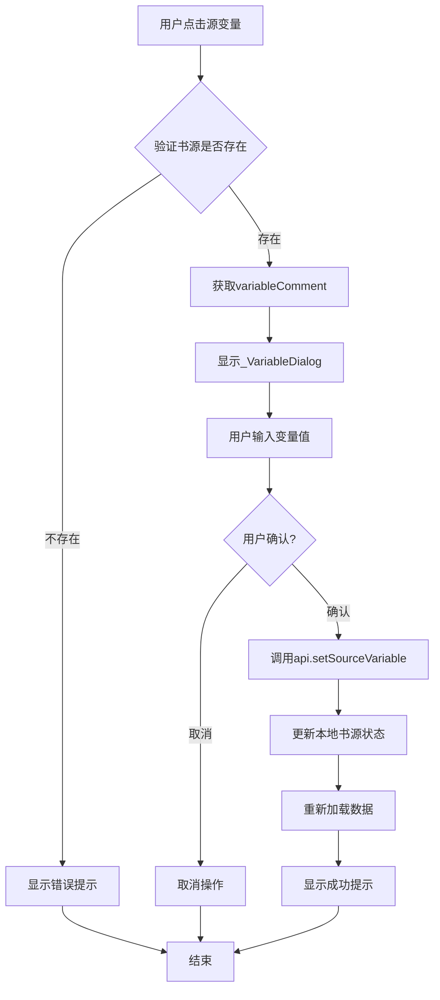

图表来源
- [book_info_screen.dart:566-613](file://flutter_legado/lib/src/screens/book_info_screen.dart#L566-L613)
- [book_info_screen.dart:1833-1907](file://flutter_legado/lib/src/screens/book_info_screen.dart#L1833-L1907)

章节来源
- [book_info_screen.dart:566-613](file://flutter_legado/lib/src/screens/book_info_screen.dart#L566-L613)
- [book_info_screen.dart:1833-1907](file://flutter_legado/lib/src/screens/book_info_screen.dart#L1833-L1907)

### WebDAV上传功能详解
**新增功能** WebDAV上传功能提供了完整的本地书籍文件上传到远程服务器的能力：

1. **配置验证**：在上传前检查WebDAV服务器配置是否有效
2. **覆盖确认**：对于已有远程地址的书籍，显示确认对话框防止误操作
3. **大文件支持**：使用 webdavUploadFile FFI 方法处理大文件上传
4. **错误处理**：区分文件读取失败、网络上传失败、配置解析失败等不同错误类型
5. **状态同步**：上传成功后自动更新书籍的 origin 字段和最后检查时间

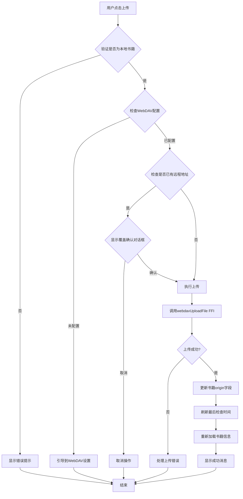

图表来源
- [book_info_screen.dart:552-640](file://flutter_legado/lib/src/screens/book_info_screen.dart#L552-L640)
- [book_api.dart:740-760](file://flutter_legado/lib/src/services/book_api.dart#L740-L760)
- [ffi.dart:1070-1085](file://flutter_legado/lib/src/bridge/ffi/ffi.dart#L1070-L1085)

章节来源
- [book_info_screen.dart:552-640](file://flutter_legado/lib/src/screens/book_info_screen.dart#L552-L640)
- [book_api.dart:740-760](file://flutter_legado/lib/src/services/book_api.dart#L740-L760)
- [ffi.dart:1070-1085](file://flutter_legado/lib/src/bridge/ffi/ffi.dart#L1070-L1085)

### 概念性概览
以下流程图展示"书籍信息界面增强"的核心目标与改进点，不直接映射具体代码文件：

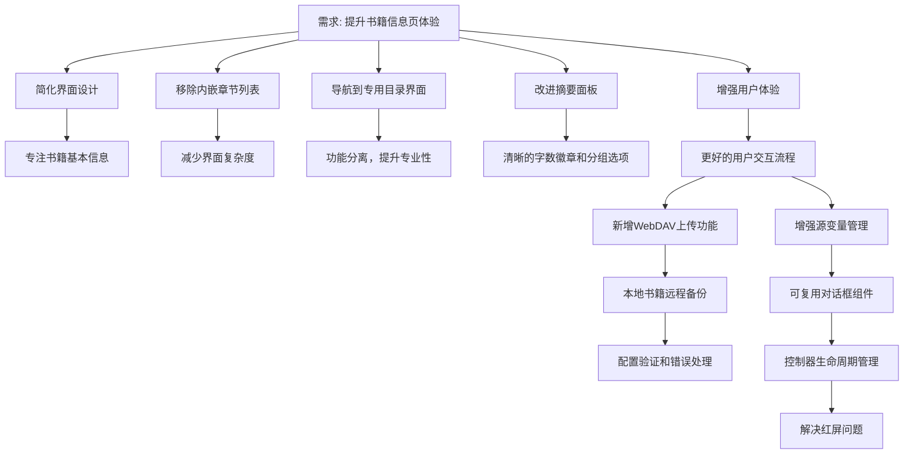

[本图为概念性说明，无需图表来源]

## 依赖关系分析
- Android 端
  - BookInfoActivity 依赖 BookInfoViewModel 提供数据与状态
  - BookInfoViewModel 依赖数据库（bookDao/bookChapterDao）、网络（WebBook/LocalBook）、工具类（AppWebDav、BookHelp、UrlUtil）
  - BookInfo 依赖 AnalyzeRule、HtmlFormatter、NetworkUtils 等
- Flutter 端
  - BookInfoScreen 依赖 BookApi、BookshelfNotifier、Share、CachedNetworkImage 等
  - AutoTaskScreen 依赖 BookApi、AutoTaskNotifier、AutoTaskScheduler 等
  - WebDavSettingsScreen 依赖 SyncNotifier 进行WebDAV配置管理
  - TocScreen 依赖 BookApi、BookmarkNotifier、SettingsService 等
  - 模型通过 models.dart 聚合导出
  - BookApi 提供统一的 API 抽象接口，支持真实 FFI 实现和 Mock 实现
  - ThemeNotifier 管理全局主题状态

**新增依赖** Flutter 端现在依赖更多服务来支持简化的书籍信息界面、独立的目录界面、自动任务管理和WebDAV上传功能：
- BookApi：提供 webbookInfo、webbookChapters、webdavUploadFile、setSourceVariable 等方法
- BookshelfNotifier：管理书架状态和 notShelf 标志位
- ReaderNotifier：支持阅读器初始化流程
- ThemeNotifier：管理主题状态和颜色方案
- BookmarkNotifier：管理书签功能（在 TocScreen 中）
- SettingsService：管理设置选项（在 TocScreen 中）
- AutoTaskNotifier：管理自动任务状态和操作
- AutoTaskScheduler：管理任务调度和执行
- SyncNotifier：管理WebDAV配置和同步状态

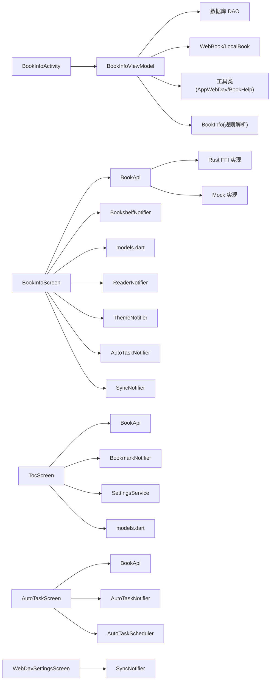

图表来源
- [BookInfoActivity.kt:127-278](file://app/src/main/java/io/legado/app/ui/book/info/BookInfoActivity.kt#L127-L278)
- [BookInfoViewModel.kt:95-174](file://app/src/main/java/io/legado/app/ui/book/info/BookInfoViewModel.kt#L95-L174)
- [BookInfo.kt:25-176](file://app/src/main/java/io/legado/app/model/webBook/BookInfo.kt#L25-L176)
- [book_info_screen.dart:24-239](file://flutter_legado/lib/src/screens/book_info_screen.dart#L24-L239)
- [auto_task_screen.dart:17-800](file://flutter_legado/lib/src/screens/auto_task_screen.dart#L17-L800)
- [webdav_settings_screen.dart:1-280](file://flutter_legado/lib/src/screens/webdav_settings_screen.dart#L1-L280)
- [toc_screen.dart:15-921](file://flutter_legado/lib/src/screens/toc_screen.dart#L15-L921)
- [models.dart:1-17](file://flutter_legado/lib/src/models/models.dart#L1-17)
- [book_api.dart:1-200](file://flutter_legado/lib/src/services/book_api.dart#L1-200)

章节来源
- [BookInfoActivity.kt:127-278](file://app/src/main/java/io/legado/app/ui/book/info/BookInfoActivity.kt#L127-L278)
- [BookInfoViewModel.kt:95-174](file://app/src/main/java/io/legado/app/ui/book/info/BookInfoViewModel.kt#L95-L174)
- [BookInfo.kt:25-176](file://app/src/main/java/io/legado/app/model/webBook/BookInfo.kt#L25-L176)
- [book_info_screen.dart:24-239](file://flutter_legado/lib/src/screens/book_info_screen.dart#L24-L239)
- [auto_task_screen.dart:17-800](file://flutter_legado/lib/src/screens/auto_task_screen.dart#L17-L800)
- [webdav_settings_screen.dart:1-280](file://flutter_legado/lib/src/screens/webdav_settings_screen.dart#L1-L280)
- [toc_screen.dart:15-921](file://flutter_legado/lib/src/screens/toc_screen.dart#L15-L921)
- [models.dart:1-17](file://flutter_legado/lib/src/models/models.dart#L1-17)
- [book_api.dart:1-200](file://flutter_legado/lib/src/services/book_api.dart#L1-200)

## 性能考量
- 网络请求与加载态
  - Android 端使用 BookInfoNetworkLoadingCounter 统一管理并发网络请求，避免重复显示加载态
  - Flutter 端使用 FutureBuilder 与 setState 控制加载态，建议在 API 层增加缓存与重试策略
  - **新增** Flutter 端的智能加载管道减少了不必要的网络请求，仅在确实需要时才调用 webbookInfo
- 简介渲染
  - Android 端对 Markdown/HTML/WebView 分别处理，注意图片尺寸与内存占用，避免频繁重建 WebView
  - Flutter 端建议使用缓存图片与懒加载，减少首屏渲染压力
- **新增** 界面简化带来的性能优势：移除内嵌章节列表减少了初始渲染负担
- **新增** 独立目录界面的性能优化：按需加载章节数据，支持搜索防抖和分页显示
- **新增** 缓存策略优化：TocScreen 支持章节缓存状态查询，提升用户体验
- **新增** 自动任务管理的性能优化：任务调度器支持后台执行，避免阻塞主线程
- **新增** WebDAV上传的性能优化：使用大文件上传方法避免内存溢出，支持断点续传
- **新增** 源变量管理的性能优化：可复用对话框组件减少重复创建开销，控制器生命周期管理避免内存泄漏

[本节为通用指导，无需章节来源]

## 故障排查指南
- 常见问题
  - 书籍信息为空：检查 initData/upBook 是否正确从数据库或 URL 获取书籍
  - 目录加载失败：确认书源规则与网络请求是否正常，查看 AppLog 输出
  - 简介渲染异常：检查简介标记（<usehtml>/<md>/<useweb>）与图片资源路径
  - Flutter 端操作无效：确认 BookApi 与 BookshelfNotifier 的状态更新是否生效
  - **新增** 元数据补全失败：检查网络连接和书源配置，查看 debugPrint 输出
  - **新增** notShelf 标志位问题：确认书架状态判断逻辑是否正确
  - **新增** 目录界面导航失败：检查路由配置和参数传递
  - **新增** 搜索功能异常：确认 TocScreen 的搜索防抖逻辑和过滤算法
  - **新增** 自动任务创建失败：检查 cron 表达式格式和任务配置
  - **新增** 任务调度异常：确认 AutoTaskScheduler 的初始化状态
  - **新增** WebDAV上传失败：检查服务器配置和网络连接状态
  - **新增** 覆盖确认对话框异常：确认对话框状态管理和用户交互逻辑
  - **新增** WebDAV配置验证失败：检查服务器地址格式和认证信息
  - **新增** 源变量设置失败：检查书源是否存在和网络连接状态
  - **新增** 对话框红屏问题：确认控制器生命周期管理是否正确
  - **新增** 变量清除失败：检查空串处理和单列 UPDATE 语义
- 定位方法
  - Android 端：查看 AppLog 与 toastOnUi 提示信息
  - Flutter 端：debugPrint 与 SnackBar 提示，检查 FutureBuilder 的错误分支
  - **新增** Flutter 端智能加载管道：检查 _needCompleteInfo、_isOnlineBook 等辅助方法的返回值
  - **新增** 目录界面调试：检查 TocScreen 的章节加载、搜索过滤和缓存状态逻辑
  - **新增** 自动任务调试：检查 AutoTaskScreen 的任务创建、编辑和调度流程
  - **新增** WebDAV上传调试：检查 _uploadToRemote 方法的各个步骤和错误处理
  - **新增** WebDAV配置调试：检查 SyncNotifier 的配置状态和验证逻辑
  - **新增** 源变量管理调试：检查 _setSourceVariable 方法的各个步骤和错误处理
  - **新增** 对话框调试：检查 _VariableDialog 的控制器生命周期和用户交互逻辑

章节来源
- [BookInfoViewModel.kt:274-282](file://app/src/main/java/io/legado/app/ui/book/info/BookInfoViewModel.kt#L274-282)
- [BookInfoViewModel.kt:334-342](file://app/src/main/java/io/legado/app/ui/book/info/BookInfoViewModel.kt#L334-342)
- [book_info_screen.dart:112-173](file://flutter_legado/lib/src/screens/book_info_screen.dart#L112-173)
- [book_info_screen.dart:135-142](file://flutter_legado/lib/src/screens/book_info_screen.dart#L135-142)
- [book_info_screen.dart:552-640](file://flutter_legado/lib/src/screens/book_info_screen.dart#L552-L640)
- [book_info_screen.dart:566-613](file://flutter_legado/lib/src/screens/book_info_screen.dart#L566-L613)
- [book_info_screen.dart:1833-1907](file://flutter_legado/lib/src/screens/book_info_screen.dart#L1833-L1907)
- [webdav_settings_screen.dart:1-280](file://flutter_legado/lib/src/screens/webdav_settings_screen.dart#L1-L280)
- [auto_task_screen.dart:17-800](file://flutter_legado/lib/src/screens/auto_task_screen.dart#L17-L800)
- [toc_screen.dart:15-921](file://flutter_legado/lib/src/screens/toc_screen.dart#L15-L921)

## 结论
通过对 Android 与 Flutter 两端书籍信息界面的系统分析，明确了数据加载、解析与渲染的关键路径，以及交互能力的覆盖范围。**最新更新** 书籍信息界面进行了重大简化，移除了内嵌章节列表和搜索功能，改为显示封面、书籍详情和导航到专用目录界面的简洁界面，同时改进了摘要面板的字数徽章和分组选项。**新增功能** 实现了书籍变量管理对话框和与自动任务管理屏幕的无缝集成，允许用户直接从书籍信息界面创建或编辑更新任务。**新增功能** 实现了WebDAV上传功能，支持将本地书籍文件上传到远程WebDAV服务器，包含完整的配置验证、覆盖确认对话框和错误处理机制。**新增功能** 增强了源变量管理功能，通过新的 _setSourceVariable() 方法和可复用的 _VariableDialog 组件，支持设置和清除变量，并显示适当的注释信息，同时修复了红屏问题。

这种设计变更带来了以下优势：
1. **界面专注度提升**：书籍信息页面专注于展示书籍基本信息，减少干扰
2. **功能模块化**：章节管理功能集中在专用目录界面，提升专业性
3. **用户体验优化**：通过导航到专用页面，提供更专业的章节浏览体验
4. **性能改善**：减少初始加载数据量，提升响应速度
5. **自动化支持**：通过自动任务管理，实现书籍更新的自动化
6. **云端同步**：通过WebDAV上传功能，实现书籍文件的远程备份和同步
7. **变量管理增强**：通过可复用的对话框组件，提供更好的源变量管理体验
8. **稳定性提升**：通过正确的控制器生命周期管理，解决了红屏问题

建议在后续迭代中：
- 完善 Flutter 端未移植功能（上传、更新任务、变量设置、删除警告）
- 强化简介渲染的性能与稳定性（图片缓存、WebView 复用）
- 统一双端交互反馈与错误提示
- 引入更完善的测试与监控机制
- **新增** 持续优化独立目录界面的功能和性能表现
- **新增** 探索更多界面简化和功能分离的可能性
- **新增** 增强自动任务管理的用户友好性和错误处理
- **新增** 优化WebDAV上传的用户体验和错误处理机制
- **新增** 考虑添加上传进度显示和断点续传功能
- **新增** 进一步优化源变量管理的用户体验和错误处理
- **新增** 探索更多可复用组件的提取和封装

[本节为总结性内容，无需章节来源]

## 附录
- 相关文档与依赖
  - README 中列出的主要依赖（Rust/Flutter/Android）有助于理解整体架构与生态
  - **新增** BookApi 接口定义提供了完整的服务层抽象，便于扩展和维护
  - **新增** 独立的 TocScreen 提供了完整的章节管理功能
  - **新增** AutoTaskScreen 提供了完整的自动任务管理功能
  - **新增** WebDavSettingsScreen 提供了完整的WebDAV配置管理功能
  - **新增** FFI 接口定义了WebDAV上传等底层功能
  - **新增** _VariableDialog 组件提供了可复用的变量输入对话框

章节来源
- [README.md:82-86](file://README.md#L82-L86)
- [book_api.dart:1-200](file://flutter_legado/lib/src/services/book_api.dart#L1-200)
- [auto_task_screen.dart:17-800](file://flutter_legado/lib/src/screens/auto_task_screen.dart#L17-L800)
- [webdav_settings_screen.dart:1-280](file://flutter_legado/lib/src/screens/webdav_settings_screen.dart#L1-L280)
- [toc_screen.dart:15-921](file://flutter_legado/lib/src/screens/toc_screen.dart#L15-L921)
- [ffi.dart:1070-1085](file://flutter_legado/lib/src/bridge/ffi/ffi.dart#L1070-L1085)
- [book_info_screen.dart:1833-1907](file://flutter_legado/lib/src/screens/book_info_screen.dart#L1833-L1907)