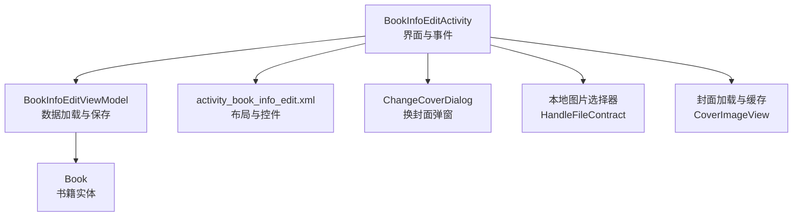
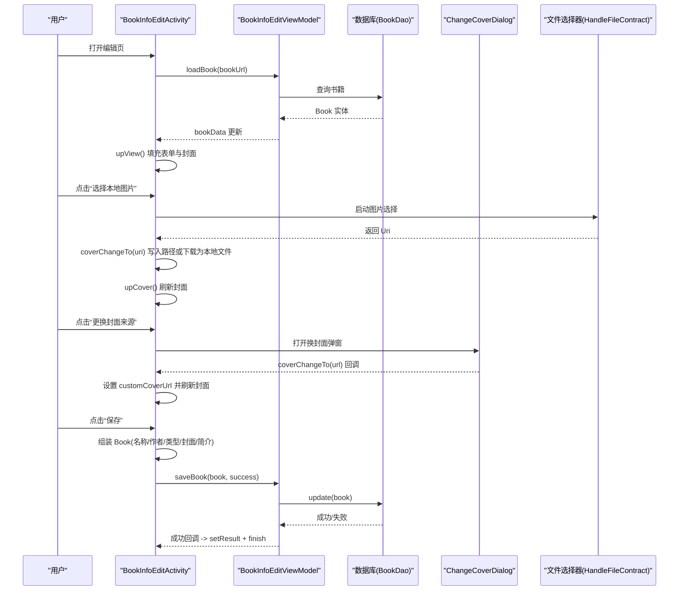
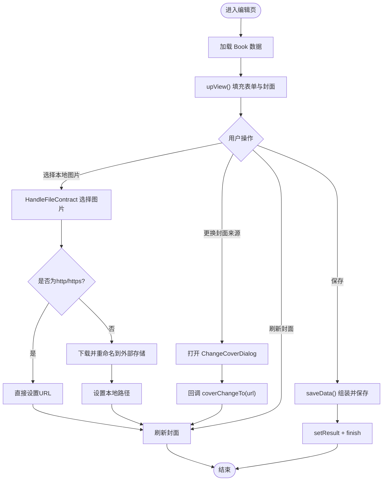
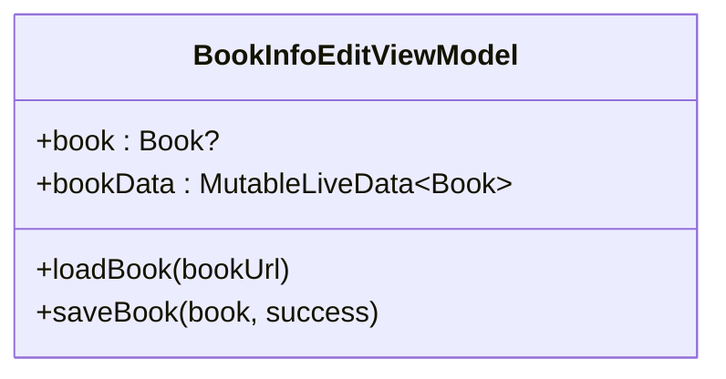
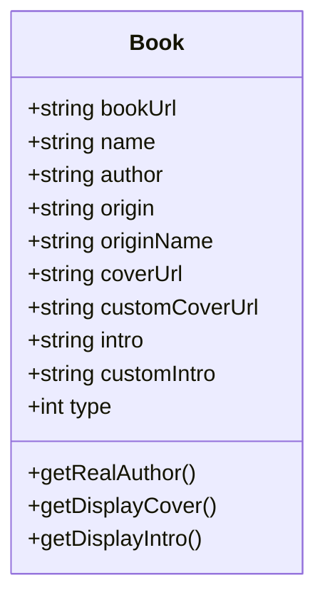
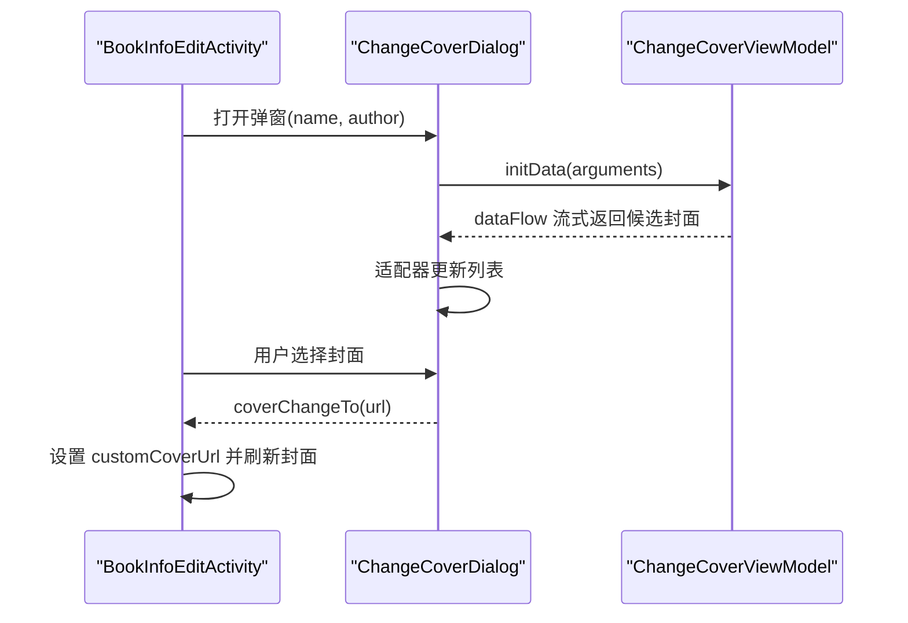
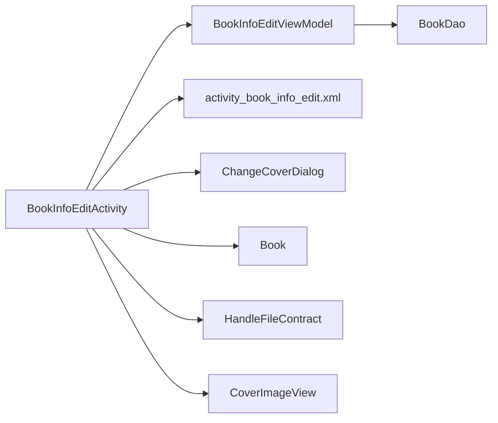

# 书籍信息编辑界面

<cite>
**本文引用的文件**   
- [BookInfoEditActivity.kt](file://app/src/main/java/io/legado/app/ui/book/info/edit/BookInfoEditActivity.kt)
- [BookInfoEditViewModel.kt](file://app/src/main/java/io/legado/app/ui/book/info/edit/BookInfoEditViewModel.kt)
- [activity_book_info_edit.xml](file://app/src/main/res/layout/activity_book_info_edit.xml)
- [Book.kt](file://app/src/main/java/io/legado/app/data/entities/Book.kt)
- [ChangeCoverDialog.kt](file://app/src/main/java/io/legado/app/ui/book/changecover/ChangeCoverDialog.kt)
</cite>

## 目录
1. [简介](#简介)
2. [项目结构](#项目结构)
3. [核心组件](#核心组件)
4. [架构总览](#架构总览)
5. [详细组件分析](#详细组件分析)
6. [依赖关系分析](#依赖关系分析)
7. [性能考量](#性能考量)
8. [故障排查指南](#故障排查指南)
9. [结论](#结论)

## 简介
本文件围绕“书籍信息编辑界面”的实现进行系统化说明，涵盖界面布局、数据模型、交互流程与错误处理。该界面用于编辑书籍的名称、作者、类型、封面与简介等元数据，支持从本地选择图片作为封面、从书源切换封面以及刷新封面预览，最终将修改持久化到数据库并返回结果。

## 项目结构
- 界面入口：BookInfoEditActivity 负责页面生命周期、UI绑定、事件分发与保存逻辑。
- 视图模型：BookInfoEditViewModel 负责加载和保存书籍数据，处理数据库操作与异常。
- 布局文件：activity_book_info_edit.xml 定义封面展示、输入框、类型选择、封面操作按钮与简介输入区。
- 数据模型：Book 实体包含书名、作者、封面URL（来源与自定义）、简介（来源与自定义）等字段，并提供显示封面/简介的便捷方法。
- 换封面弹窗：ChangeCoverDialog 提供按书名/作者搜索书源封面的能力，并通过回调通知调用方更新封面。

图表来源 
- [BookInfoEditActivity.kt:1-182](file://app/src/main/java/io/legado/app/ui/book/info/edit/BookInfoEditActivity.kt#L1-L182)
- [BookInfoEditViewModel.kt:1-41](file://app/src/main/java/io/legado/app/ui/book/info/edit/BookInfoEditViewModel.kt#L1-L41)
- [activity_book_info_edit.xml:1-194](file://app/src/main/res/layout/activity_book_info_edit.xml#L1-L194)
- [Book.kt:1-490](file://app/src/main/java/io/legado/app/data/entities/Book.kt#L1-L490)
- [ChangeCoverDialog.kt:1-125](file://app/src/main/java/io/legado/app/ui/book/changecover/ChangeCoverDialog.kt#L1-L125)

章节来源
- [BookInfoEditActivity.kt:1-182](file://app/src/main/java/io/legado/app/ui/book/info/edit/BookInfoEditActivity.kt#L1-L182)
- [BookInfoEditViewModel.kt:1-41](file://app/src/main/java/io/legado/app/ui/book/info/edit/BookInfoEditViewModel.kt#L1-L41)
- [activity_book_info_edit.xml:1-194](file://app/src/main/res/layout/activity_book_info_edit.xml#L1-L194)
- [Book.kt:1-490](file://app/src/main/java/io/legado/app/data/entities/Book.kt#L1-L490)
- [ChangeCoverDialog.kt:1-125](file://app/src/main/java/io/legado/app/ui/book/changecover/ChangeCoverDialog.kt#L1-L125)

## 核心组件
- BookInfoEditActivity
  - 职责：初始化布局、监听系统栏与输入法插入、绑定菜单项、处理封面选择与刷新、组装并保存书籍数据。
  - 关键点：通过 ViewModel 观察 bookData；使用 HandleFileContract 选择图片；实现 ChangeCoverDialog.CallBack 以接收选中的封面URL。
- BookInfoEditViewModel
  - 职责：根据 bookUrl 加载 Book 实体，保存到数据库，并在保存成功时触发回调。
  - 关键点：对 SQLiteConstraintException 做特殊日志记录（重复书名+作者冲突）。
- activity_book_info_edit.xml
  - 职责：定义封面图、书名/作者输入、类型下拉、封面URL输入、三个封面操作按钮（选择本地图片、更换封面来源、刷新封面）、简介输入区。
- Book
  - 职责：存储书籍元数据，提供 getDisplayCover()/getDisplayIntro() 等方法决定显示值优先使用自定义还是来源值。
- ChangeCoverDialog
  - 职责：弹出网格列表展示候选封面，支持开始/停止搜索，选中后回调 Activity 更新封面URL并刷新预览。

章节来源
- [BookInfoEditActivity.kt:1-182](file://app/src/main/java/io/legado/app/ui/book/info/edit/BookInfoEditActivity.kt#L1-L182)
- [BookInfoEditViewModel.kt:1-41](file://app/src/main/java/io/legado/app/ui/book/info/edit/BookInfoEditViewModel.kt#L1-L41)
- [activity_book_info_edit.xml:1-194](file://app/src/main/res/layout/activity_book_info_edit.xml#L1-L194)
- [Book.kt:1-490](file://app/src/main/java/io/legado/app/data/entities/Book.kt#L1-L490)
- [ChangeCoverDialog.kt:1-125](file://app/src/main/java/io/legado/app/ui/book/changecover/ChangeCoverDialog.kt#L1-L125)

## 架构总览
界面采用经典的 MVVM 模式：Activity 仅负责 UI 与事件，ViewModel 负责数据访问与状态管理，布局文件承载控件声明，数据模型 Book 作为持久化实体。封面选择与换封面功能通过外部契约与弹窗解耦。

图表来源 
- [BookInfoEditActivity.kt:1-182](file://app/src/main/java/io/legado/app/ui/book/info/edit/BookInfoEditActivity.kt#L1-L182)
- [BookInfoEditViewModel.kt:1-41](file://app/src/main/java/io/legado/app/ui/book/info/edit/BookInfoEditViewModel.kt#L1-L41)
- [ChangeCoverDialog.kt:1-125](file://app/src/main/java/io/legado/app/ui/book/changecover/ChangeCoverDialog.kt#L1-L125)

## 详细组件分析

### 界面与交互流程（Activity）
- 初始化与数据绑定
  - 观察 viewModel.bookData，若为空则从 intent 中读取 bookUrl 并加载。
  - 设置窗口插入监听，自动适配底部内边距。
- 菜单与事件
  - 顶部菜单“保存”触发 saveData()。
  - “选择本地图片”通过 HandleFileContract 选择图片，支持 http/https 直接赋值或下载到外部存储并重命名为 MD5 后缀。
  - “更换封面来源”弹出 ChangeCoverDialog，回调接口更新 customCoverUrl 并刷新封面。
  - “刷新封面”将当前 URL 同步至 viewModel 并重新加载封面。
- 数据保存
  - 从输入控件取值，计算 type（文本/音频/图片/视频），合并本地标志。
  - 对比旧值决定是否清空 customCoverUrl/customIntro。
  - 调用 BookHelp.updateCacheFolder(oldBook, book) 处理缓存目录变更。
  - 通过 viewModel.saveBook 持久化并返回结果。

图表来源 
- [BookInfoEditActivity.kt:1-182](file://app/src/main/java/io/legado/app/ui/book/info/edit/BookInfoEditActivity.kt#L1-L182)

章节来源
- [BookInfoEditActivity.kt:1-182](file://app/src/main/java/io/legado/app/ui/book/info/edit/BookInfoEditActivity.kt#L1-L182)

### 视图模型（ViewModel）
- 数据加载：loadBook(bookUrl) 异步查询数据库，成功后 postValue 到 LiveData。
- 数据保存：saveBook(book, success) 执行更新，若当前正在阅读则同步内存中的 ReadBook.book，捕获 SQLiteConstraintException 并记录日志。

图表来源 
- [BookInfoEditViewModel.kt:1-41](file://app/src/main/java/io/legado/app/ui/book/info/edit/BookInfoEditViewModel.kt#L1-L41)

章节来源
- [BookInfoEditViewModel.kt:1-41](file://app/src/main/java/io/legado/app/ui/book/info/edit/BookInfoEditViewModel.kt#L1-L41)

### 数据模型（Book）
- 关键字段：name、author、coverUrl、customCoverUrl、intro、customIntro、type 等。
- 显示策略：getDisplayCover() 优先 customCoverUrl，否则 coverUrl；getDisplayIntro() 同理。
- 其他：ReadConfig 嵌套类用于阅读相关配置，Converters 用于 Room 类型转换。

图表来源 
- [Book.kt:1-490](file://app/src/main/java/io/legado/app/data/entities/Book.kt#L1-L490)

章节来源
- [Book.kt:1-490](file://app/src/main/java/io/legado/app/data/entities/Book.kt#L1-L490)

### 换封面弹窗（ChangeCoverDialog）
- 行为：根据传入的 name/author 发起搜索，网格展示候选封面，支持开始/停止搜索。
- 回调：选中后通过 CallBack.coverChangeTo(url) 通知 Activity 更新封面URL并关闭弹窗。

图表来源 
- [ChangeCoverDialog.kt:1-125](file://app/src/main/java/io/legado/app/ui/book/changecover/ChangeCoverDialog.kt#L1-L125)

章节来源
- [ChangeCoverDialog.kt:1-125](file://app/src/main/java/io/legado/app/ui/book/changecover/ChangeCoverDialog.kt#L1-L125)

## 依赖关系分析
- Activity 依赖 ViewModel、布局资源、文件选择契约、封面加载组件与换封面弹窗。
- ViewModel 依赖数据库 DAO 与内存阅读状态（ReadBook）。
- Book 实体被多处引用，作为数据载体贯穿 UI 与持久化层。
- 换封面弹窗通过回调与 Activity 解耦，避免强耦合。

图表来源 
- [BookInfoEditActivity.kt:1-182](file://app/src/main/java/io/legado/app/ui/book/info/edit/BookInfoEditActivity.kt#L1-L182)
- [BookInfoEditViewModel.kt:1-41](file://app/src/main/java/io/legado/app/ui/book/info/edit/BookInfoEditViewModel.kt#L1-L41)
- [activity_book_info_edit.xml:1-194](file://app/src/main/res/layout/activity_book_info_edit.xml#L1-L194)
- [Book.kt:1-490](file://app/src/main/java/io/legado/app/data/entities/Book.kt#L1-L490)
- [ChangeCoverDialog.kt:1-125](file://app/src/main/java/io/legado/app/ui/book/changecover/ChangeCoverDialog.kt#L1-L125)

章节来源
- [BookInfoEditActivity.kt:1-182](file://app/src/main/java/io/legado/app/ui/book/info/edit/BookInfoEditActivity.kt#L1-L182)
- [BookInfoEditViewModel.kt:1-41](file://app/src/main/java/io/legado/app/ui/book/info/edit/BookInfoEditViewModel.kt#L1-L41)
- [activity_book_info_edit.xml:1-194](file://app/src/main/res/layout/activity_book_info_edit.xml#L1-L194)
- [Book.kt:1-490](file://app/src/main/java/io/legado/app/data/entities/Book.kt#L1-L490)
- [ChangeCoverDialog.kt:1-125](file://app/src/main/java/io/legado/app/ui/book/changecover/ChangeCoverDialog.kt#L1-L125)

## 性能考量
- 封面加载：建议使用合适的缓存策略与占位图，避免频繁网络请求导致卡顿。
- 本地图片处理：选择非 http/https 的图片时，先判断后缀并生成稳定文件名（MD5），减少重复写入。
- 数据库更新：仅在必要时更新缓存目录，避免不必要的 I/O。
- UI 响应：在长耗时任务（如下载封面）中使用协程或后台线程，避免阻塞主线程。

## 故障排查指南
- 保存失败（唯一约束冲突）
  - 现象：保存时报 SQLiteConstraintException，提示存在相同书名与作者的书籍。
  - 处理：检查是否重复录入同名同作者书籍，或确认 customTag/origin 区分是否正确。
  - 参考：[BookInfoEditViewModel.kt:25-41](file://app/src/main/java/io/legado/app/ui/book/info/edit/BookInfoEditViewModel.kt#L25-L41)
- 封面不更新
  - 现象：更换封面来源或选择本地图片后封面未刷新。
  - 处理：确认 customCoverUrl 已正确设置，并调用 upCover() 刷新；检查 CoverImageView 的加载参数。
  - 参考：[BookInfoEditActivity.kt:116-120](file://app/src/main/java/io/legado/app/ui/book/info/edit/BookInfoEditActivity.kt#L116-L120)
- 本地图片无法写入
  - 现象：选择本地图片后无变化或提示错误。
  - 处理：检查权限与外部存储路径；确保文件后缀识别正确；查看异常日志。
  - 参考：[BookInfoEditActivity.kt:153-180](file://app/src/main/java/io/legado/app/ui/book/info/edit/BookInfoEditActivity.kt#L153-L180)

章节来源
- [BookInfoEditViewModel.kt:25-41](file://app/src/main/java/io/legado/app/ui/book/info/edit/BookInfoEditViewModel.kt#L25-L41)
- [BookInfoEditActivity.kt:116-120](file://app/src/main/java/io/legado/app/ui/book/info/edit/BookInfoEditActivity.kt#L116-L120)
- [BookInfoEditActivity.kt:153-180](file://app/src/main/java/io/legado/app/ui/book/info/edit/BookInfoEditActivity.kt#L153-L180)

## 结论
书籍信息编辑界面以清晰的 MVVM 分层组织代码，Activity 专注 UI 与交互，ViewModel 负责数据与持久化，Book 实体统一承载元数据。封面编辑流程通过对话框与文件选择契约解耦，具备良好的可维护性与扩展性。建议进一步优化封面加载缓存与错误提示体验，提升整体流畅度与可用性。