# 书籍管理功能

<cite>
**本文引用的文件**   
- [toc_screen.dart](file://flutter_legado/lib/src/screens/toc_screen.dart)
- [bookshelf_screen.dart](file://flutter_legado/lib/src/screens/bookshelf_screen.dart)
- [bookshelf_manage_screen.dart](file://flutter_legado/lib/src/screens/bookshelf_manage_screen.dart)
- [settings_service.dart](file://flutter_legado/lib/src/services/settings_service.dart)
- [routes.dart](file://flutter_legado/lib/src/routes.dart)
- [README.md](file://README.md)
- [lib.rs](file://rust/legado-book/src/lib.rs)
- [epub.rs](file://rust/legado-book/src/epub.rs)
- [txt.rs](file://rust/legado-book/src/txt.rs)
- [mobi.rs](file://rust/legado-book/src/mobi.rs)
- [pdf.rs](file://rust/legado-book/src/pdf.rs)
- [umd.rs](file://rust/legado-book/src/umd.rs)
- [export.rs](file://rust/legado-book/src/export.rs)
- [book_import.rs](file://rust/legado-ffi/src/api/book_import.rs)
- [book_export.rs](file://rust/legado-ffi/src/api/book_export.rs)
- [bookshelf.rs](file://rust/legado-ffi/src/api/bookshelf.rs)
- [bookmark_api.rs](file://rust/legado-ffi/src/api/bookmark_api.rs)
- [reading_stats_api.rs](file://rust/legado-ffi/src/api/reading_stats_api.rs)
- [read_record_api.rs](file://rust/legado-ffi/src/api/read_record_api.rs)
- [book_repository.rs](file://rust/legado-db/src/repository/book_repository.rs)
- [book_chapter_repository.rs](file://rust/legado-db/src/repository/book_chapter_repository.rs)
- [bookmark_repository.rs](file://rust/legado-db/src/repository/bookmark_repository.rs)
- [reading_stats_repository.rs](file://rust/legado-db/src/repository/reading_stats_repository.rs)
- [read_record_repository.rs](file://rust/legado-db/src/repository/read_record_repository.rs)
- [book_group_repository.rs](file://rust/legado-db/src/repository/book_group_repository.rs)
- [book.rs](file://rust/legado-core/src/models/book.rs)
- [book_chapter.rs](file://rust/legado-core/src/models/book_chapter.rs)
- [read_state.rs](file://rust/legado-core/src/read_state.rs)
- [reading_stats.rs](file://rust/legado-core/src/reading_stats.rs)
- [content_processor.rs](file://rust/legado-core/src/content_processor.rs)
- [search_engine.rs](file://rust/legado-core/src/search_engine.rs)
- [server.rs](file://rust/legado-server/src/server.rs)
- [routes.rs](file://rust/legado-server/src/routes.rs)
- [handlers/web_book.rs](file://rust/legado-server/src/handlers/web_book.rs)
- [App.kt](file://app/src/main/java/io/legado/app/App.kt)
- [BookShelf.vue](file://modules/web/src/views/BookShelf.vue)
- [BookType.kt](file://app/src/main/java/io/legado/app/constant/BookType.kt)
- [BookDao.kt](file://app/src/main/java/io/legado/app/data/dao/BookDao.kt)
- [BookChapterDao.kt](file://app/src/main/java/io/legado/app/data/dao/BookChapterDao.kt)
- [BookChapter.kt](file://app/src/main/java/io/legado/app/data/entities/BookChapter.kt)
- [BookExtensions.kt](file://app/src/main/java/io/legado/app/help/book/BookExtensions.kt)
- [SearchBookShelfHelp.kt](file://app/src/main/java/io/legado/app/help/book/SearchBookShelfHelp.kt)
- [AudioPlayViewModel.kt](file://app/src/main/java/io/legado/app/ui/book/audio/AudioPlayViewModel.kt)
- [DatabaseMigrations.kt](file://app/src/main/java/io/legado/app/data/DatabaseMigrations.kt)
</cite>

## 更新摘要
**变更内容**   
- 新增独立的目录屏幕（toc_screen.dart），替代了之前的抽屉式实现，提供书籍章节、书签、阅读进度三个标签页的独立界面
- 增强了书架管理界面的删除提醒功能，支持可配置的删除确认对话框
- 改进了目录页面的用户体验，包括搜索过滤、倒序显示、字数统计等功能
- 优化了书签和标注的管理界面，提供更直观的操作体验

## 目录
1. [简介](#简介)
2. [项目结构](#项目结构)
3. [核心组件](#核心组件)
4. [架构总览](#架构总览)
5. [详细组件分析](#详细组件分析)
6. [依赖关系分析](#依赖关系分析)
7. [性能考虑](#性能考虑)
8. [故障排查指南](#故障排查指南)
9. [结论](#结论)
10. [附录](#附录)

## 简介
本文件面向Legado的"书籍管理"能力，围绕多格式解析与渲染、导入导出、智能分类管理、阅读进度跟踪等关键主题进行系统化说明。文档以代码仓库为依据，结合Rust层（解析、存储、API）、Android应用层与Web端视图，给出从数据模型到接口调用、从扫描导入到阅读统计的全链路说明，并附带配置要点、优化建议与常见问题解决方案。

**最新更新**：新增了独立的目录屏幕功能，通过TocScreen组件提供了更直观的书籍管理界面，包含章节导航、书签管理和阅读进度三个主要功能模块，同时增强了书架管理的删除提醒机制。

## 项目结构
Legado采用多模块协作：
- Rust核心库负责书籍解析、内容处理、搜索、状态与统计、数据库访问与FFI暴露。
- Flutter应用层提供现代化的UI界面，包含新的独立目录屏幕和增强的书架管理功能。
- Android应用层提供系统能力集成，包含新的章节内容保存机制。
- Web端用于远程管理与调试。

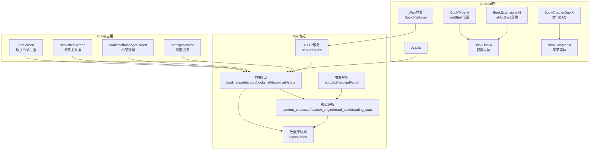

图表来源
- [toc_screen.dart](file://flutter_legado/lib/src/screens/toc_screen.dart)
- [bookshelf_screen.dart](file://flutter_legado/lib/src/screens/bookshelf_screen.dart)
- [bookshelf_manage_screen.dart](file://flutter_legado/lib/src/screens/bookshelf_manage_screen.dart)
- [settings_service.dart](file://flutter_legado/lib/src/services/settings_service.dart)
- [App.kt](file://app/src/main/java/io/legado/app/App.kt)
- [BookShelf.vue](file://modules/web/src/views/BookShelf.vue)
- [BookType.kt](file://app/src/main/java/io/legado/app/constant/BookType.kt)
- [BookDao.kt](file://app/src/main/java/io/legado/app/data/dao/BookDao.kt)
- [BookChapterDao.kt](file://app/src/main/java/io/legado/app/data/dao/BookChapterDao.kt)
- [BookChapter.kt](file://app/src/main/java/io/legado/app/data/entities/BookChapter.kt)
- [BookExtensions.kt](file://app/src/main/java/io/legado/app/help/book/BookExtensions.kt)
- [lib.rs](file://rust/legado-book/src/lib.rs)
- [book_import.rs](file://rust/legado-ffi/src/api/book_import.rs)
- [book_export.rs](file://rust/legado-ffi/src/api/book_export.rs)
- [bookshelf.rs](file://rust/legado-ffi/src/api/bookshelf.rs)
- [bookmark_api.rs](file://rust/legado-ffi/src/api/bookmark_api.rs)
- [reading_stats_api.rs](file://rust/legado-ffi/src/api/reading_stats_api.rs)
- [read_record_api.rs](file://rust/legado-ffi/src/api/read_record_api.rs)
- [book_repository.rs](file://rust/legado-db/src/repository/book_repository.rs)
- [book_chapter_repository.rs](file://rust/legado-db/src/repository/book_chapter_repository.rs)
- [bookmark_repository.rs](file://rust/legado-db/src/repository/bookmark_repository.rs)
- [reading_stats_repository.rs](file://rust/legado-db/src/repository/reading_stats_repository.rs)
- [read_record_repository.rs](file://rust/legado-db/src/repository/read_record_repository.rs)
- [book_group_repository.rs](file://rust/legado-db/src/repository/book_group_repository.rs)
- [book.rs](file://rust/legado-core/src/models/book.rs)
- [book_chapter.rs](file://rust/legado-core/src/models/book_chapter.rs)
- [read_state.rs](file://rust/legado-core/src/read_state.rs)
- [reading_stats.rs](file://rust/legado-core/src/reading_stats.rs)
- [content_processor.rs](file://rust/legado-core/src/content_processor.rs)
- [search_engine.rs](file://rust/legado-core/src/search_engine.rs)
- [server.rs](file://rust/legado-server/src/server.rs)
- [routes.rs](file://rust/legado-server/src/routes.rs)

章节来源
- [README.md](file://README.md)

## 核心组件
- 多格式解析器：EPUB、TXT、MOBI、PDF、UMD等格式的元数据提取、目录构建与内容读取。
- 导入导出：本地文件扫描、批量导入、格式转换、云存储集成（通过服务器与网络模块）。
- 书架与分组：书籍分组、标签、搜索过滤与排序，**新增临时书籍智能过滤**。
- **独立目录屏幕**：**新增TocScreen组件**，提供章节导航、书签管理、阅读进度的三标签页界面。
- 阅读进度：章节定位、书签、阅读统计与历史记录。
- 数据持久化：SQLite仓储层对书籍、章节、书签、统计、记录等进行CRUD。
- FFI与HTTP API：对外暴露统一接口供Flutter与Android调用。
- **临时书籍机制**：通过BookType.notShelf标识和智能过滤，防止在线书籍污染用户书架。
- **增强删除提醒**：支持可配置的删除确认对话框，提升操作安全性。

章节来源
- [toc_screen.dart](file://flutter_legado/lib/src/screens/toc_screen.dart)
- [bookshelf_screen.dart](file://flutter_legado/lib/src/screens/bookshelf_screen.dart)
- [bookshelf_manage_screen.dart](file://flutter_legado/lib/src/screens/bookshelf_manage_screen.dart)
- [lib.rs](file://rust/legado-book/src/lib.rs)
- [book_import.rs](file://rust/legado-ffi/src/api/book_import.rs)
- [book_export.rs](file://rust/legado-ffi/src/api/book_export.rs)
- [bookshelf.rs](file://rust/legado-ffi/src/api/bookshelf.rs)
- [bookmark_api.rs](file://rust/legado-ffi/src/api/bookmark_api.rs)
- [reading_stats_api.rs](file://rust/legado-ffi/src/api/reading_stats_api.rs)
- [read_record_api.rs](file://rust/legado-ffi/src/api/read_record_api.rs)
- [book_repository.rs](file://rust/legado-db/src/repository/book_repository.rs)
- [book_chapter_repository.rs](file://rust/legado-db/src/repository/book_chapter_repository.rs)
- [bookmark_repository.rs](file://rust/legado-db/src/repository/bookmark_repository.rs)
- [reading_stats_repository.rs](file://rust/legado-db/src/repository/reading_stats_repository.rs)
- [read_record_repository.rs](file://rust/legado-db/src/repository/read_record_repository.rs)
- [book_group_repository.rs](file://rust/legado-db/src/repository/book_group_repository.rs)
- [BookType.kt](file://app/src/main/java/io/legado/app/constant/BookType.kt)
- [BookDao.kt](file://app/src/main/java/io/legado/app/data/dao/BookDao.kt)
- [BookChapterDao.kt](file://app/src/main/java/io/legado/app/data/dao/BookChapterDao.kt)
- [BookChapter.kt](file://app/src/main/java/io/legado/app/data/entities/BookChapter.kt)
- [BookExtensions.kt](file://app/src/main/java/io/legado/app/help/book/BookExtensions.kt)

## 架构总览
整体流程由Flutter或Android发起请求，经FFI或HTTP路由进入Rust核心，调用解析器与仓储层完成数据读写，最终返回结果给上层。**新增的独立目录屏幕通过TocScreen组件提供了更直观的书籍管理界面，增强了用户体验和操作效率**。

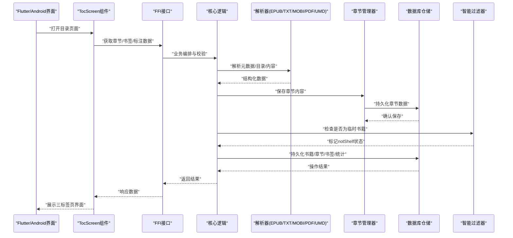

图表来源
- [toc_screen.dart](file://flutter_legado/lib/src/screens/toc_screen.dart)
- [book_import.rs](file://rust/legado-ffi/src/api/book_import.rs)
- [book_export.rs](file://rust/legado-ffi/src/api/book_export.rs)
- [bookshelf.rs](file://rust/legado-ffi/src/api/bookshelf.rs)
- [bookmark_api.rs](file://rust/legado-ffi/src/api/bookmark_api.rs)
- [reading_stats_api.rs](file://rust/legado-ffi/src/api/reading_stats_api.rs)
- [read_record_api.rs](file://rust/legado-ffi/src/api/read_record_api.rs)
- [content_processor.rs](file://rust/legado-core/src/content_processor.rs)
- [epub.rs](file://rust/legado-book/src/epub.rs)
- [txt.rs](file://rust/legado-book/src/txt.rs)
- [mobi.rs](file://rust/legado-book/src/mobi.rs)
- [pdf.rs](file://rust/legado-book/src/pdf.rs)
- [umd.rs](file://rust/legado-book/src/umd.rs)
- [book_repository.rs](file://rust/legado-db/src/repository/book_repository.rs)
- [book_chapter_repository.rs](file://rust/legado-db/src/repository/book_chapter_repository.rs)
- [bookmark_repository.rs](file://rust/legado-db/src/repository/bookmark_repository.rs)
- [reading_stats_repository.rs](file://rust/legado-db/src/repository/reading_stats_repository.rs)
- [read_record_repository.rs](file://rust/legado-db/src/repository/read_record_repository.rs)

## 详细组件分析

### 独立目录屏幕（TocScreen）
**新增**：独立的目录屏幕通过TocScreen组件提供了全新的书籍管理界面，包含三个主要标签页：

#### 核心功能
- **章节导航**：显示书籍的所有章节，支持搜索、倒序、当前章节高亮
- **书签管理**：查看和管理书籍书签，支持滑动删除和长按删除
- **阅读进度**：显示阅读标注和笔记，支持按章节筛选

#### 技术特性
- **三标签页设计**：使用TabController管理目录、书签、标注三个页面
- **智能搜索**：300ms防抖搜索，支持章节名、书签内容、标注文本的多字段搜索
- **本地TXT支持**：针对本地TXT文件的特殊处理，支持目录规则配置和长章节拆分
- **字数统计**：可选的章节字数显示，通过设置服务控制开关

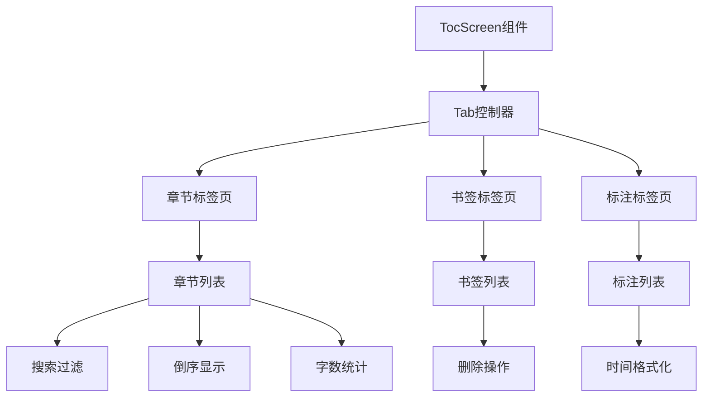

图表来源
- [toc_screen.dart:25-835](file://flutter_legado/lib/src/screens/toc_screen.dart#L25-L835)

章节来源
- [toc_screen.dart](file://flutter_legado/lib/src/screens/toc_screen.dart)

### 增强的书架管理功能
**更新**：书架管理界面现在支持可配置的删除提醒功能，提升了操作的安全性。

#### 删除提醒机制
- **可配置开关**：通过SettingsService.getDeleteBookAlert()获取用户偏好设置
- **智能判断**：根据设置决定是否显示确认对话框
- **直接删除**：当关闭提醒时，直接执行删除操作并显示成功提示
- **确认对话框**：开启提醒时，显示标准的确认对话框

#### 其他管理功能
- **批量操作**：支持多选删除、移动到分组、置顶等操作
- **批量换源**：新增批量切换书源的功能，支持进度显示
- **搜索过滤**：实时搜索书名，快速定位目标书籍

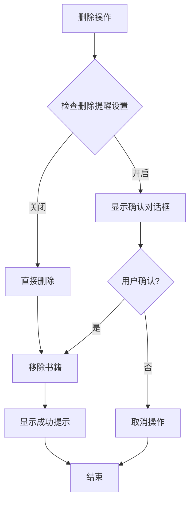

图表来源
- [bookshelf_screen.dart:482-527](file://flutter_legado/lib/src/screens/bookshelf_screen.dart#L482-L527)
- [bookshelf_manage_screen.dart:51-84](file://flutter_legado/lib/src/screens/bookshelf_manage_screen.dart#L51-L84)

章节来源
- [bookshelf_screen.dart](file://flutter_legado/lib/src/screens/bookshelf_screen.dart)
- [bookshelf_manage_screen.dart](file://flutter_legado/lib/src/screens/bookshelf_manage_screen.dart)
- [settings_service.dart](file://flutter_legado/lib/src/services/settings_service.dart)

### 多格式书籍支持（EPUB、TXT、MOBI、PDF、UMD）
- EPUB：基于标准容器解析元数据、目录与内容，适配HTML/CSS渲染。
- TXT：文本流式解析，支持编码检测与分章策略。
- MOBI：解析旧版Kindle格式，提取元数据与目录。
- PDF：页面与文本抽取，适合固定版式内容。
- UMD：针对特定格式的结构化解析。

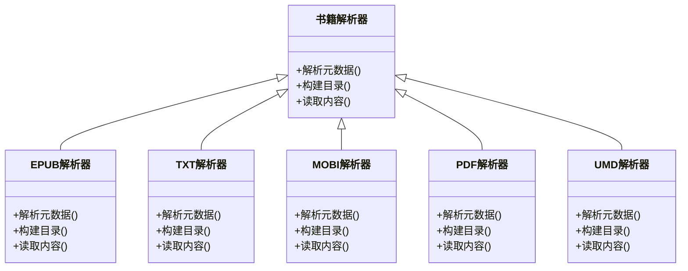

图表来源
- [lib.rs](file://rust/legado-book/src/lib.rs)
- [epub.rs](file://rust/legado-book/src/epub.rs)
- [txt.rs](file://rust/legado-book/src/txt.rs)
- [mobi.rs](file://rust/legado-book/src/mobi.rs)
- [pdf.rs](file://rust/legado-book/src/pdf.rs)
- [umd.rs](file://rust/legado-book/src/umd.rs)

章节来源
- [epub.rs](file://rust/legado-book/src/epub.rs)
- [txt.rs](file://rust/legado-book/src/txt.rs)
- [mobi.rs](file://rust/legado-book/src/mobi.rs)
- [pdf.rs](file://rust/legado-book/src/pdf.rs)
- [umd.rs](file://rust/legado-book/src/umd.rs)

### 书籍导入导出
- 文件扫描：遍历本地路径，识别支持的扩展名与格式特征。
- 批量导入：并发解析与入库，去重与冲突处理。
- 格式转换：将源格式转换为目标格式（如TXT转EPUB），保留元数据与目录。
- 云存储集成：通过HTTP服务与网络模块实现上传/下载与同步。

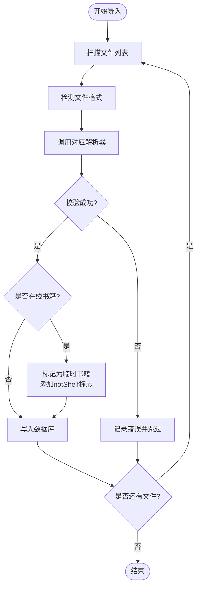

图表来源
- [book_import.rs](file://rust/legado-ffi/src/api/book_import.rs)
- [export.rs](file://rust/legado-book/src/export.rs)
- [book_export.rs](file://rust/legado-ffi/src/api/book_export.rs)
- [content_processor.rs](file://rust/legado-core/src/content_processor.rs)

章节来源
- [book_import.rs](file://rust/legado-ffi/src/api/book_import.rs)
- [export.rs](file://rust/legado-book/src/export.rs)
- [book_export.rs](file://rust/legado-ffi/src/api/book_export.rs)

### 智能分类管理（书架分组、标签、搜索过滤、排序）
- 书架分组：按分组ID组织书籍，支持分组重命名与排序。
- 标签系统：为书籍添加多个标签，便于筛选与聚合。
- 搜索过滤：支持标题、作者、标签、分组等多条件组合查询，**新增临时书籍智能过滤**。
- 排序选项：按时间、名称、大小、阅读进度等维度排序。

**更新**：新增临时书籍智能过滤功能，所有书架相关查询自动排除标记为notShelf的书籍，确保用户书架的纯净性。

```mermaid
classDiagram
class Book {
+id
+title
+author
+groupId
+tags
+type
+createdAt
+updatedAt
}
class Chapter {
+id
+bookId
+title
+order
+size
+wordCount
+start
+end
}
class Bookmark {
+id
+bookId
+chapterId
+position
+note
}
class ReadingStats {
+bookId
+lastReadTime
+totalReadTime
+pageCount
}
class ReadRecord {
+bookId
+chapterId
+position
+timestamp
}
class BookType {
+video
+text
+updateError
+audio
+image
+webFile
+local
+archive
+notShelf
}
Book ||--o{ Chapter : "包含"
Book ||--o{ Bookmark : "拥有"
Book ||--o{ ReadingStats : "统计"
Book ||--o{ ReadRecord : "记录"
Book ..> BookType : "使用类型标志"
```

图表来源
- [book.rs](file://rust/legado-core/src/models/book.rs)
- [book_chapter.rs](file://rust/legado-core/src/models/book_chapter.rs)
- [bookmark_repository.rs](file://rust/legado-db/src/repository/bookmark_repository.rs)
- [reading_stats_repository.rs](file://rust/legado-db/src/repository/reading_stats_repository.rs)
- [read_record_repository.rs](file://rust/legado-db/src/repository/read_record_repository.rs)
- [book_group_repository.rs](file://rust/legado-db/src/repository/book_group_repository.rs)
- [BookType.kt](file://app/src/main/java/io/legado/app/constant/BookType.kt)

章节来源
- [bookshelf.rs](file://rust/legado-ffi/src/api/bookshelf.rs)
- [book_repository.rs](file://rust/legado-db/src/repository/book_repository.rs)
- [book_chapter_repository.rs](file://rust/legado-db/src/repository/book_chapter_repository.rs)
- [bookmark_repository.rs](file://rust/legado-db/src/repository/bookmark_repository.rs)
- [reading_stats_repository.rs](file://rust/legado-db/src/repository/reading_stats_repository.rs)
- [read_record_repository.rs](file://rust/legado-db/src/repository/read_record_repository.rs)
- [book_group_repository.rs](file://rust/legado-db/src/repository/book_group_repository.rs)
- [BookType.kt](file://app/src/main/java/io/legado/app/constant/BookType.kt)
- [BookDao.kt](file://app/src/main/java/io/legado/app/data/dao/BookDao.kt)

### 阅读进度跟踪（章节定位、书签、统计、历史）
- 章节定位：记录当前章节与位置偏移，支持恢复阅读。
- 书签管理：在章节内标记关键点，支持备注与跳转。
- 阅读统计：累计阅读时长、翻页次数、最近阅读时间。
- 历史记录：按时间顺序记录阅读轨迹，便于回溯。

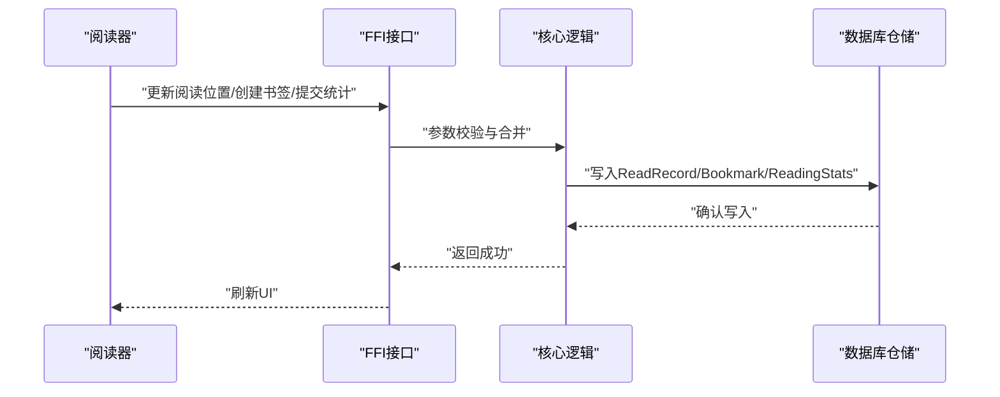

图表来源
- [read_state.rs](file://rust/legado-core/src/read_state.rs)
- [reading_stats.rs](file://rust/legado-core/src/reading_stats.rs)
- [bookmark_api.rs](file://rust/legado-ffi/src/api/bookmark_api.rs)
- [reading_stats_api.rs](file://rust/legado-ffi/src/api/reading_stats_api.rs)
- [read_record_api.rs](file://rust/legado-ffi/src/api/read_record_api.rs)
- [bookmark_repository.rs](file://rust/legado-db/src/repository/bookmark_repository.rs)
- [reading_stats_repository.rs](file://rust/legado-db/src/repository/reading_stats_repository.rs)
- [read_record_repository.rs](file://rust/legado-db/src/repository/read_record_repository.rs)

章节来源
- [read_state.rs](file://rust/legado-core/src/read_state.rs)
- [reading_stats.rs](file://rust/legado-core/src/reading_stats.rs)
- [bookmark_api.rs](file://rust/legado-ffi/src/api/bookmark_api.rs)
- [reading_stats_api.rs](file://rust/legado-ffi/src/api/reading_stats_api.rs)
- [read_record_api.rs](file://rust/legado-ffi/src/api/read_record_api.rs)

### 搜索与过滤
- 全文检索：对TXT内容进行高效匹配。
- 规则引擎：支持XPath/JSONPath等规则解析，用于网页与数据源抓取。
- 组合查询：标题、作者、标签、分组、时间范围等多条件组合。

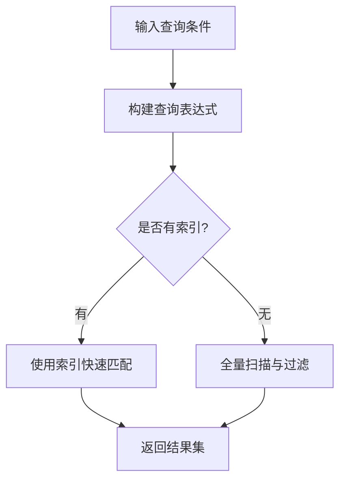

图表来源
- [search_engine.rs](file://rust/legado-core/src/search_engine.rs)
- [txt_search.rs](file://rust/legado-book/src/txt_search.rs)
- [analyze_rule.rs](file://rust/legado-parser/src/analyze_rule.rs)
- [xpath.rs](file://rust/legado-parser/src/xpath.rs)
- [jsonpath.rs](file://rust/legado-parser/src/jsonpath.rs)

章节来源
- [search_engine.rs](file://rust/legado-core/src/search_engine.rs)
- [txt_search.rs](file://rust/legado-book/src/txt_search.rs)
- [analyze_rule.rs](file://rust/legado-parser/src/analyze_rule.rs)
- [xpath.rs](file://rust/legado-parser/src/xpath.rs)
- [jsonpath.rs](file://rust/legado-parser/src/jsonpath.rs)

### 配置参数与API接口
- 配置参数：
  - 导入设置：扫描路径、最大并发数、重复处理策略（覆盖/跳过/合并）。
  - 解析设置：默认编码、分章规则、图片加载策略。
  - 阅读设置：字体、行距、背景模式、自动保存间隔。
  - 搜索设置：索引开关、正则引擎、缓存策略。
  - **删除提醒设置**：新增删除确认对话框的可配置开关。
- API接口（示例）：
  - 导入：POST /api/import/books（参数：paths, concurrency, strategy）
  - 导出：GET /api/export/books?ids=...&format=epub|txt|pdf
  - 书架：GET /api/shelf/books?group=&tag=&sort=...
  - 书签：POST /api/bookmarks（参数：bookId, chapterId, position, note）
  - 统计：GET /api/stats?bookId=...
  - 记录：POST /api/records（参数：bookId, chapterId, position, timestamp）

章节来源
- [server.rs](file://rust/legado-server/src/server.rs)
- [routes.rs](file://rust/legado-server/src/routes.rs)
- [handlers/web_book.rs](file://rust/legado-server/src/handlers/web_book.rs)
- [book_import.rs](file://rust/legado-ffi/src/api/book_import.rs)
- [book_export.rs](file://rust/legado-ffi/src/api/book_export.rs)
- [bookshelf.rs](file://rust/legado-ffi/src/api/bookshelf.rs)
- [bookmark_api.rs](file://rust/legado-ffi/src/api/bookmark_api.rs)
- [reading_stats_api.rs](file://rust/legado-ffi/src/api/reading_stats_api.rs)
- [read_record_api.rs](file://rust/legado-ffi/src/api/read_record_api.rs)

### 使用示例
- 批量导入：指定扫描路径与并发数，选择重复策略后执行导入任务。
- 格式转换：选择源书籍与目标格式，触发转换任务并下载结果。
- 分组与标签：为书籍分配分组与标签，使用筛选条件快速定位。
- 阅读进度：打开书籍后自动保存位置，支持书签与统计查看。
- **独立目录**：通过TocScreen组件访问章节导航、书签管理和阅读进度。

章节来源
- [App.kt](file://app/src/main/java/io/legado/app/App.kt)
- [BookShelf.vue](file://modules/web/src/views/BookShelf.vue)
- [toc_screen.dart](file://flutter_legado/lib/src/screens/toc_screen.dart)

### 章节内容保存功能（新增功能）
**新增**：章节内容保存功能通过saveChapterContent方法，支持内容编辑和内容反转操作，增强了书籍管理系统的持久化能力。

#### 核心实现
- **saveChapterContent方法**：提供章节内容的保存、编辑和反转功能
- **内容持久化**：支持大文本内容的存储和管理
- **数据一致性**：确保章节内容与书籍元数据的一致性
- **性能优化**：针对大文件的分段处理和内存管理

#### 功能特性
- **内容编辑**：支持对章节内容进行修改和更新
- **内容反转**：提供文本反转操作，便于特殊格式处理
- **批量操作**：支持多个章节内容的批量处理
- **事务管理**：确保数据操作的原子性和一致性

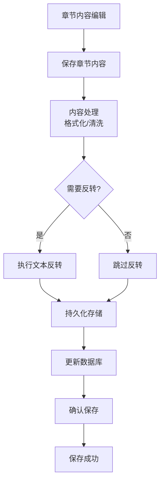

图表来源
- [BookChapterDao.kt](file://app/src/main/java/io/legado/app/data/dao/BookChapterDao.kt)
- [BookChapter.kt](file://app/src/main/java/io/legado/app/data/entities/BookChapter.kt)
- [book_chapter_repository.rs](file://rust/legado-db/src/repository/book_chapter_repository.rs)

章节来源
- [BookChapterDao.kt](file://app/src/main/java/io/legado/app/data/dao/BookChapterDao.kt)
- [BookChapter.kt](file://app/src/main/java/io/legado/app/data/entities/BookChapter.kt)
- [book_chapter_repository.rs](file://rust/legado-db/src/repository/book_chapter_repository.rs)

### 临时书籍处理机制
**新增**：临时书籍处理机制通过BookType.notShelf常量和智能过滤功能，有效解决在线书籍污染用户书架的问题。

#### 核心实现
- **BookType.notShelf常量**：定义二进制位标志`0b100_0000_0000`，用于标识临时书籍
- **智能过滤**：所有书架相关查询自动添加`(books.type & ${BookType.notShelf}) = 0`条件
- **状态管理**：提供`isNotShelf`属性和`addType/removeType`方法管理临时书籍状态

#### 使用场景
- **在线书籍临时阅读**：用户从书源直接阅读时，书籍标记为临时状态
- **自动清理**：临时书籍不会出现在书架中，避免数据污染
- **状态转换**：当用户将书籍添加到书架时，自动移除notShelf标志

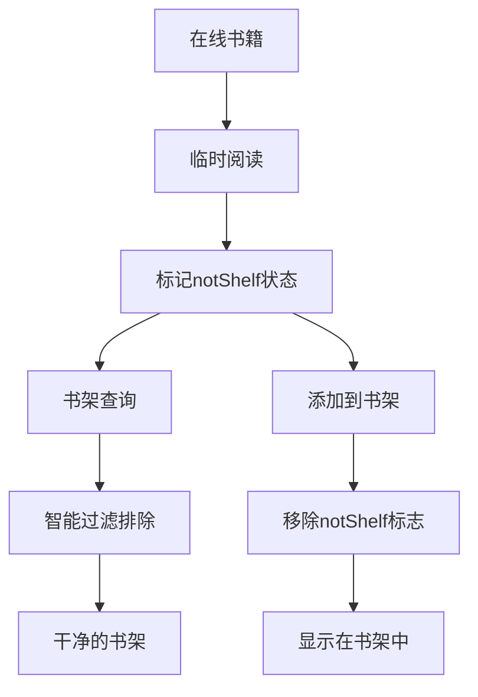

图表来源
- [BookType.kt](file://app/src/main/java/io/legado/app/constant/BookType.kt)
- [BookDao.kt](file://app/src/main/java/io/legado/app/data/dao/BookDao.kt)
- [BookExtensions.kt](file://app/src/main/java/io/legado/app/help/book/BookExtensions.kt)
- [SearchBookShelfHelp.kt](file://app/src/main/java/io/legado/app/help/book/SearchBookShelfHelp.kt)
- [AudioPlayViewModel.kt](file://app/src/main/java/io/legado/app/ui/book/audio/AudioPlayViewModel.kt)

章节来源
- [BookType.kt](file://app/src/main/java/io/legado/app/constant/BookType.kt)
- [BookDao.kt](file://app/src/main/java/io/legado/app/data/dao/BookDao.kt)
- [BookExtensions.kt](file://app/src/main/java/io/legado/app/help/book/BookExtensions.kt)
- [SearchBookShelfHelp.kt](file://app/src/main/java/io/legado/app/help/book/SearchBookShelfHelp.kt)
- [AudioPlayViewModel.kt](file://app/src/main/java/io/legado/app/ui/book/audio/AudioPlayViewModel.kt)
- [DatabaseMigrations.kt](file://app/src/main/java/io/legado/app/data/DatabaseMigrations.kt)

## 依赖关系分析
- 解析器依赖核心内容处理器进行文本清洗与格式化。
- FFI层依赖仓储层进行数据持久化，同时调用核心逻辑进行业务编排。
- HTTP服务通过路由分发至FFI接口，保证跨平台一致性。
- **新增依赖**：BookType常量被BookDao、BookExtensions等组件依赖，实现统一的临时书籍状态管理。
- **章节管理依赖**：BookChapterDao和BookChapter实体为章节内容保存功能提供基础支持。
- **Flutter依赖**：TocScreen组件依赖BookApi、SettingsService等服务进行数据获取和配置管理。

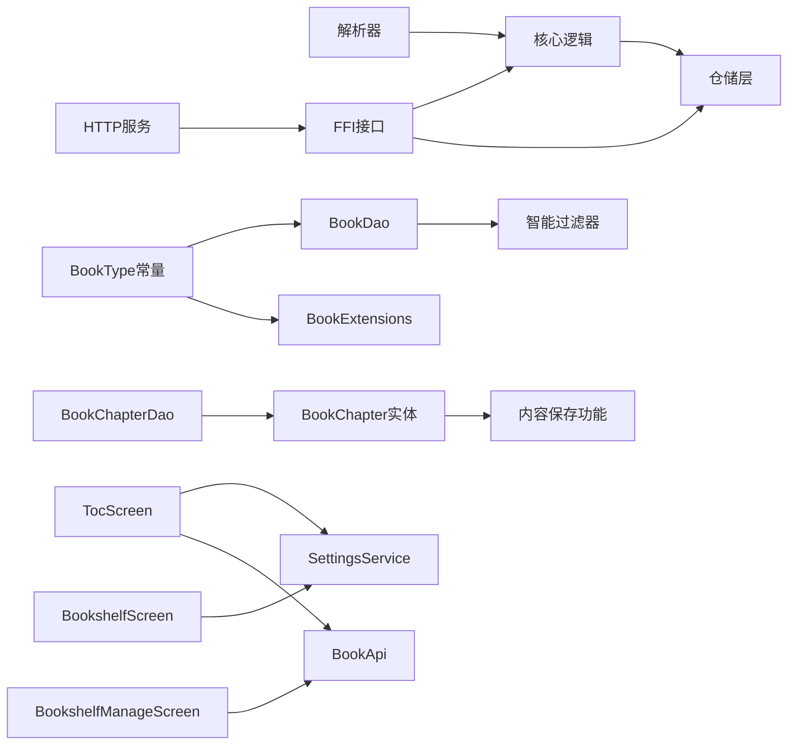

图表来源
- [content_processor.rs](file://rust/legado-core/src/content_processor.rs)
- [book_repository.rs](file://rust/legado-db/src/repository/book_repository.rs)
- [book_chapter_repository.rs](file://rust/legado-db/src/repository/book_chapter_repository.rs)
- [bookmark_repository.rs](file://rust/legado-db/src/repository/bookmark_repository.rs)
- [reading_stats_repository.rs](file://rust/legado-db/src/repository/reading_stats_repository.rs)
- [read_record_repository.rs](file://rust/legado-db/src/repository/read_record_repository.rs)
- [book_import.rs](file://rust/legado-ffi/src/api/book_import.rs)
- [book_export.rs](file://rust/legado-ffi/src/api/book_export.rs)
- [bookshelf.rs](file://rust/legado-ffi/src/api/bookshelf.rs)
- [bookmark_api.rs](file://rust/legado-ffi/src/api/bookmark_api.rs)
- [reading_stats_api.rs](file://rust/legado-ffi/src/api/reading_stats_api.rs)
- [read_record_api.rs](file://rust/legado-ffi/src/api/read_record_api.rs)
- [server.rs](file://rust/legado-server/src/server.rs)
- [BookType.kt](file://app/src/main/java/io/legado/app/constant/BookType.kt)
- [BookDao.kt](file://app/src/main/java/io/legado/app/data/dao/BookDao.kt)
- [BookChapterDao.kt](file://app/src/main/java/io/legado/app/data/dao/BookChapterDao.kt)
- [BookChapter.kt](file://app/src/main/java/io/legado/app/data/entities/BookChapter.kt)
- [BookExtensions.kt](file://app/src/main/java/io/legado/app/help/book/BookExtensions.kt)
- [toc_screen.dart](file://flutter_legado/lib/src/screens/toc_screen.dart)
- [bookshelf_screen.dart](file://flutter_legado/lib/src/screens/bookshelf_screen.dart)
- [bookshelf_manage_screen.dart](file://flutter_legado/lib/src/screens/bookshelf_manage_screen.dart)
- [settings_service.dart](file://flutter_legado/lib/src/services/settings_service.dart)

章节来源
- [content_processor.rs](file://rust/legado-core/src/content_processor.rs)
- [book_repository.rs](file://rust/legado-db/src/repository/book_repository.rs)
- [book_chapter_repository.rs](file://rust/legado-db/src/repository/book_chapter_repository.rs)
- [bookmark_repository.rs](file://rust/legado-db/src/repository/bookmark_repository.rs)
- [reading_stats_repository.rs](file://rust/legado-db/src/repository/reading_stats_repository.rs)
- [read_record_repository.rs](file://rust/legado-db/src/repository/read_record_repository.rs)
- [book_import.rs](file://rust/legado-ffi/src/api/book_import.rs)
- [book_export.rs](file://rust/legado-ffi/src/api/book_export.rs)
- [bookshelf.rs](file://rust/legado-ffi/src/api/bookshelf.rs)
- [bookmark_api.rs](file://rust/legado-ffi/src/api/bookmark_api.rs)
- [reading_stats_api.rs](file://rust/legado-ffi/src/api/reading_stats_api.rs)
- [read_record_api.rs](file://rust/legado-ffi/src/api/read_record_api.rs)
- [server.rs](file://rust/legado-server/src/server.rs)
- [BookType.kt](file://app/src/main/java/io/legado/app/constant/BookType.kt)
- [BookDao.kt](file://app/src/main/java/io/legado/app/data/dao/BookDao.kt)
- [BookChapterDao.kt](file://app/src/main/java/io/legado/app/data/dao/BookChapterDao.kt)
- [BookChapter.kt](file://app/src/main/java/io/legado/app/data/entities/BookChapter.kt)
- [BookExtensions.kt](file://app/src/main/java/io/legado/app/help/book/BookExtensions.kt)
- [toc_screen.dart](file://flutter_legado/lib/src/screens/toc_screen.dart)
- [bookshelf_screen.dart](file://flutter_legado/lib/src/screens/bookshelf_screen.dart)
- [bookshelf_manage_screen.dart](file://flutter_legado/lib/src/screens/bookshelf_manage_screen.dart)
- [settings_service.dart](file://flutter_legado/lib/src/services/settings_service.dart)

## 性能考虑
- 解析阶段：
  - 使用并发解析与流水线处理，避免阻塞主线程。
  - 对大文件采用流式读取与分页加载，降低内存占用。
- 存储阶段：
  - 批量插入与事务包裹，减少IO开销。
  - 合理索引设计，提升查询与搜索效率。
- 搜索阶段：
  - 启用全文索引，优先命中索引；未命中时回退到扫描。
  - 正则与规则解析缓存，避免重复计算。
- 阅读阶段：
  - 异步保存位置与统计，合并多次写入。
  - 图片与资源懒加载，按需渲染。
- **临时书籍优化**：
  - 二进制位标志查询性能优于字符串比较。
  - 智能过滤在数据库层面执行，减少数据传输。
  - 临时书籍状态变更采用增量更新，避免全表扫描。
- **章节内容优化**：
  - 大文本内容分段处理，避免内存溢出。
  - 内容反转操作采用流式处理，降低内存峰值。
  - 批量保存操作使用事务管理，提高写入效率。
- **Flutter界面优化**：
  - 使用ListView.builder进行虚拟滚动，减少内存占用。
  - 搜索功能采用防抖机制，避免频繁重建UI。
  - 标签页切换时按需加载数据，提升启动速度。

## 故障排查指南
- 导入失败：
  - 检查文件格式与编码是否正确。
  - 查看重复策略与冲突处理日志。
  - 验证磁盘空间与权限。
- 解析异常：
  - 确认解析器版本与格式兼容性。
  - 检查资源文件完整性（如EPUB中的CSS/图片）。
- 搜索缓慢：
  - 检查索引是否启用与重建。
  - 调整并发与缓存策略。
- 阅读位置丢失：
  - 确认自动保存间隔与写入成功。
  - 检查数据库事务与备份恢复。
- **临时书籍问题**：
  - 检查BookType.notShelf标志是否正确设置。
  - 验证书架查询是否包含智能过滤条件。
  - 确认临时书籍状态转换逻辑正常。
- **章节内容问题**：
  - 检查saveChapterContent方法的调用参数。
  - 验证章节数据的完整性和一致性。
  - 确认内容反转操作的正确性。
- **目录屏幕问题**：
  - 检查TocScreen组件的数据加载状态。
  - 验证书签和标注数据的获取是否正常。
  - 确认搜索功能的防抖逻辑是否正确。
- **删除提醒问题**：
  - 检查SettingsService的删除提醒配置。
  - 验证删除操作的确认对话框显示逻辑。
  - 确认直接删除模式下的数据一致性。

章节来源
- [book_import.rs](file://rust/legado-ffi/src/api/book_import.rs)
- [export.rs](file://rust/legado-book/src/export.rs)
- [book_export.rs](file://rust/legado-ffi/src/api/book_export.rs)
- [search_engine.rs](file://rust/legado-core/src/search_engine.rs)
- [read_state.rs](file://rust/legado-core/src/read_state.rs)
- [reading_stats.rs](file://rust/legado-core/src/reading_stats.rs)
- [BookType.kt](file://app/src/main/java/io/legado/app/constant/BookType.kt)
- [BookDao.kt](file://app/src/main/java/io/legado/app/data/dao/BookDao.kt)
- [BookChapterDao.kt](file://app/src/main/java/io/legado/app/data/dao/BookChapterDao.kt)
- [BookChapter.kt](file://app/src/main/java/io/legado/app/data/entities/BookChapter.kt)
- [toc_screen.dart](file://flutter_legado/lib/src/screens/toc_screen.dart)
- [bookshelf_screen.dart](file://flutter_legado/lib/src/screens/bookshelf_screen.dart)
- [settings_service.dart](file://flutter_legado/lib/src/services/settings_service.dart)

## 结论
Legado的书籍管理功能以Rust为核心，提供稳定高效的解析、导入导出、分类管理与阅读进度跟踪能力。通过清晰的模块化设计与统一的FFI/HTTP接口，实现了Flutter与Android端的无缝集成。**新增的独立目录屏幕功能和增强的删除提醒机制进一步提升了用户体验，不仅提供了更直观的书籍管理界面，还有效防止了误删操作，使书籍管理系统更加完善和用户友好**。建议在大规模数据场景下重点关注并发、索引与缓存策略，以获得更佳的性能体验。

## 附录
- 术语表：
  - 解析器：负责读取与结构化不同书籍格式的工具。
  - 仓储层：封装数据库操作的抽象层。
  - FFI：跨语言接口，使Rust与Android/JS互通。
  - 临时书籍：标记为notShelf的在线书籍，不显示在书架中。
  - 章节内容保存：支持章节内容的编辑、反转和持久化存储的功能。
  - 独立目录屏幕：TocScreen组件提供的三标签页书籍管理界面。
  - 删除提醒：可配置的删除确认对话框功能。
- 参考链接：
  - 项目说明：[README.md](file://README.md)
  - 书籍解析库入口：[lib.rs](file://rust/legado-book/src/lib.rs)
  - 服务器启动与路由：[server.rs](file://rust/legado-server/src/server.rs), [routes.rs](file://rust/legado-server/src/routes.rs)
  - 临时书籍常量定义：[BookType.kt](file://app/src/main/java/io/legado/app/constant/BookType.kt)
  - 智能书架过滤实现：[BookDao.kt](file://app/src/main/java/io/legado/app/data/dao/BookDao.kt)
  - 章节内容保存功能：[BookChapterDao.kt](file://app/src/main/java/io/legado/app/data/dao/BookChapterDao.kt), [BookChapter.kt](file://app/src/main/java/io/legado/app/data/entities/BookChapter.kt)
  - 独立目录屏幕实现：[toc_screen.dart](file://flutter_legado/lib/src/screens/toc_screen.dart)
  - 增强的书架管理：[bookshelf_screen.dart](file://flutter_legado/lib/src/screens/bookshelf_screen.dart), [bookshelf_manage_screen.dart](file://flutter_legado/lib/src/screens/bookshelf_manage_screen.dart)
  - 设置服务：[settings_service.dart](file://flutter_legado/lib/src/services/settings_service.dart)