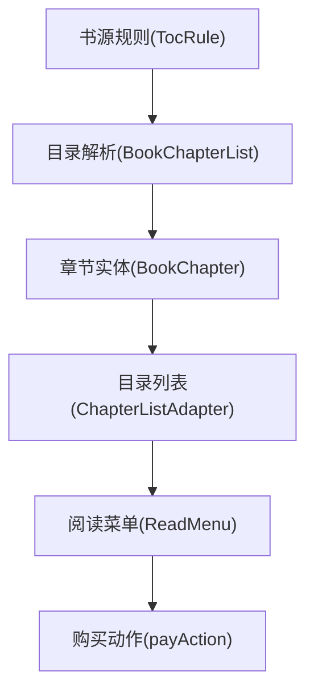
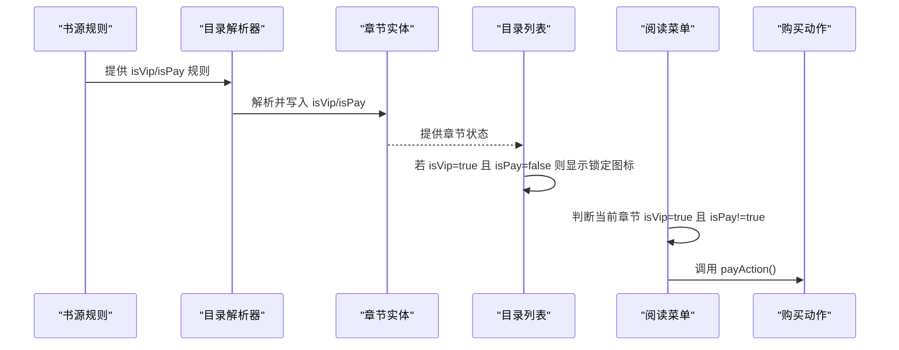
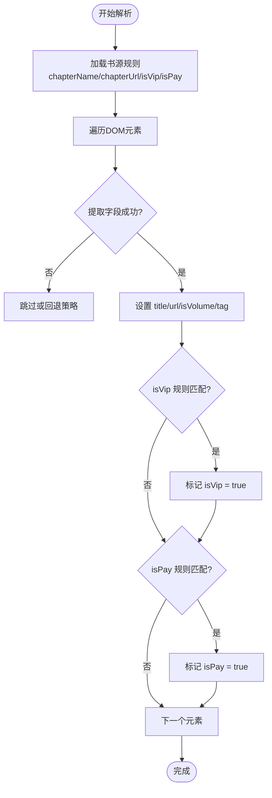
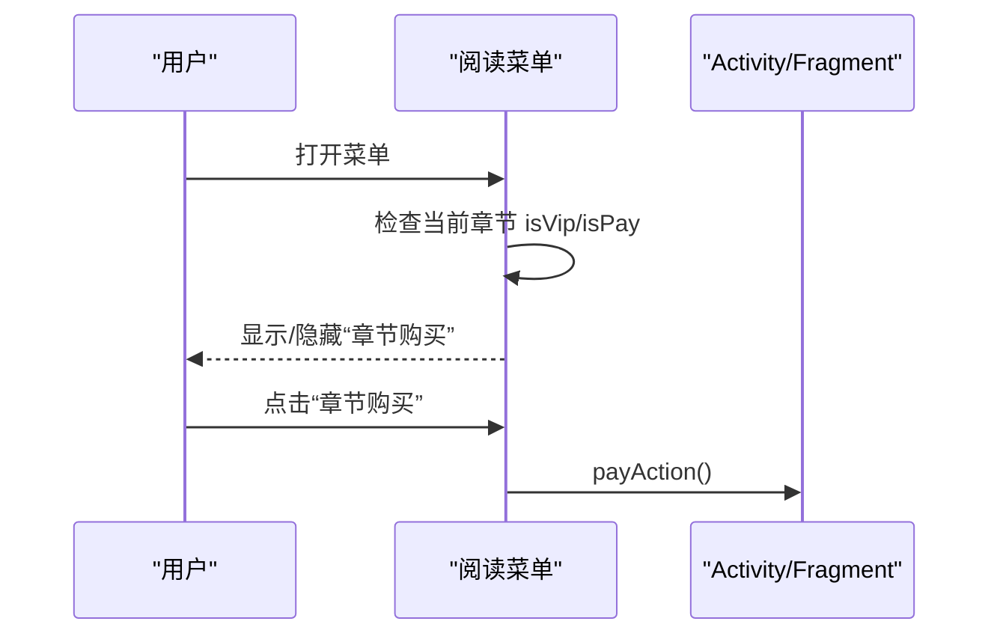
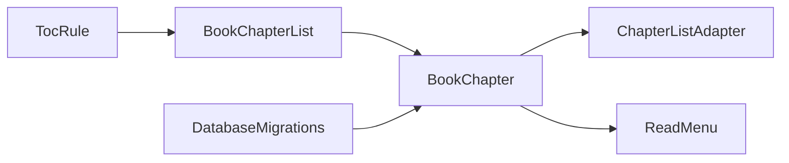

# 章节购买集成

<cite>
**本文引用的文件**
- [BookChapter.kt](file://app/src/main/java/io/legado/app/data/entities/BookChapter.kt)
- [BookChapterList.kt](file://app/src/main/java/io/legado/app/model/webBook/BookChapterList.kt)
- [ChapterListAdapter.kt](file://app/src/main/java/io/legado/app/ui/book/toc/ChapterListAdapter.kt)
- [ReadMenu.kt](file://app/src/main/java/io/legado/app/ui/book/read/ReadMenu.kt)
- [TocRule.kt](file://app/src/main/java/io/legado/app/data/entities/rule/TocRule.kt)
- [DatabaseMigrations.kt](file://app/src/main/java/io/legado/app/data/DatabaseMigrations.kt)
</cite>

## 目录
1. [简介](#简介)
2. [项目结构](#项目结构)
3. [核心组件](#核心组件)
4. [架构总览](#架构总览)
5. [详细组件分析](#详细组件分析)
6. [依赖关系分析](#依赖关系分析)
7. [性能考虑](#性能考虑)
8. [故障排查指南](#故障排查指南)
9. [结论](#结论)
10. [附录](#附录)

## 简介
本文件面向“章节购买集成”能力，围绕 Legado 在目录解析、章节状态标记（是否VIP、是否已购买）、目录列表展示与阅读菜单中的购买入口进行系统化说明。该能力通过书源规则将章节的 VIP/付费标识从网页解析到本地数据模型，并在 UI 层提供锁标提示与购买入口，形成“解析→存储→展示→交互”的闭环。

## 项目结构
围绕章节购买集成的关键代码分布在以下层次：
- 数据实体层：章节实体包含 VIP 与购买状态字段，支撑持久化与跨模块共享。
- 解析层：目录解析流程根据书源规则提取章节名称、链接以及 VIP/付费标识。
- 展示层：目录列表根据章节状态显示锁定图标；阅读菜单在满足条件时暴露“章节购买”入口。
- 配置层：书源的目录规则中可配置 VIP/付费字段的提取规则。

图表来源
- [TocRule.kt](file://app/src/main/java/io/legado/app/data/entities/rule/TocRule.kt)
- [BookChapterList.kt](file://app/src/main/java/io/legado/app/model/webBook/BookChapterList.kt)
- [BookChapter.kt](file://app/src/main/java/io/legado/app/data/entities/BookChapter.kt)
- [ChapterListAdapter.kt](file://app/src/main/java/io/legado/app/ui/book/toc/ChapterListAdapter.kt)
- [ReadMenu.kt](file://app/src/main/java/io/legado/app/ui/book/read/ReadMenu.kt)

章节来源
- [BookChapter.kt:42-60](file://app/src/main/java/io/legado/app/data/entities/BookChapter.kt#L42-L60)
- [BookChapterList.kt:228-306](file://app/src/main/java/io/legado/app/model/webBook/BookChapterList.kt#L228-L306)
- [ChapterListAdapter.kt:229-233](file://app/src/main/java/io/legado/app/ui/book/toc/ChapterListAdapter.kt#L229-L233)
- [ReadMenu.kt:483-490](file://app/src/main/java/io/legado/app/ui/book/read/ReadMenu.kt#L483-L490)

## 核心组件
- 章节数据模型：包含是否VIP、是否已购买等关键字段，用于贯穿解析、存储、展示与交互。
- 目录解析器：依据书源规则解析章节列表，并填充 VIP/付费标识。
- 目录列表适配器：根据章节状态渲染锁定图标，区分卷与章节。
- 阅读菜单：在满足“当前章节为VIP且未购买”的条件时，显示“章节购买”菜单项，触发购买流程。

章节来源
- [BookChapter.kt:42-60](file://app/src/main/java/io/legado/app/data/entities/BookChapter.kt#L42-L60)
- [BookChapterList.kt:228-306](file://app/src/main/java/io/legado/app/model/webBook/BookChapterList.kt#L228-L306)
- [ChapterListAdapter.kt:229-233](file://app/src/main/java/io/legado/app/ui/book/toc/ChapterListAdapter.kt#L229-L233)
- [ReadMenu.kt:483-490](file://app/src/main/java/io/legado/app/ui/book/read/ReadMenu.kt#L483-L490)

## 架构总览
下图展示了从书源规则到用户操作的完整链路：书源规则定义如何识别 VIP/付费，目录解析器据此填充章节状态，目录列表根据状态显示锁定图标，阅读菜单在特定条件下暴露购买入口。

图表来源
- [TocRule.kt](file://app/src/main/java/io/legado/app/data/entities/rule/TocRule.kt)
- [BookChapterList.kt:228-306](file://app/src/main/java/io/legado/app/model/webBook/BookChapterList.kt#L228-L306)
- [BookChapter.kt:42-60](file://app/src/main/java/io/legado/app/data/entities/BookChapter.kt#L42-L60)
- [ChapterListAdapter.kt:229-233](file://app/src/main/java/io/legado/app/ui/book/toc/ChapterListAdapter.kt#L229-L233)
- [ReadMenu.kt:483-490](file://app/src/main/java/io/legado/app/ui/book/read/ReadMenu.kt#L483-L490)

## 详细组件分析

### 数据模型：章节实体
- 关键字段
  - isVip：是否VIP章节，由解析阶段根据书源规则设置。
  - isPay：是否已购买，用于控制展示与交互。
- 作用
  - 作为解析结果与UI展示的契约，贯穿目录列表与阅读菜单。
  - 支持导出等场景时对VIP标识的处理（例如不导出VIP标识）。

章节来源
- [BookChapter.kt:42-60](file://app/src/main/java/io/legado/app/data/entities/BookChapter.kt#L42-L60)
- [DatabaseMigrations.kt:300-300](file://app/src/main/java/io/legado/app/data/DatabaseMigrations.kt#L300-L300)

### 目录解析：VIP/付费标识注入
- 解析流程
  - 使用 TocRule 提供的 chapterName/chapterUrl/isVip/isPay 等规则解析章节。
  - 对每个元素执行规则匹配，得到章节标题、URL、更新时间、是否卷名、是否VIP、是否已购买等。
  - 将 isVip/isPay 写入 BookChapter 实例，供后续展示与交互使用。
- 并发与分页
  - 支持多页目录解析与并发处理，保证在大目录场景下的性能。

图表来源
- [BookChapterList.kt:228-306](file://app/src/main/java/io/legado/app/model/webBook/BookChapterList.kt#L228-L306)

章节来源
- [BookChapterList.kt:228-306](file://app/src/main/java/io/legado/app/model/webBook/BookChapterList.kt#L228-L306)

### 目录列表：锁定图标与状态展示
- 展示逻辑
  - 当章节 isVip=true 且 isPay=false 且非卷名时，显示锁定图标，提示需要购买。
  - 卷名与普通章节的样式与行为不同，避免误触。
- 交互
  - 点击章节进入阅读；长按可查看原始标题等调试信息。

章节来源
- [ChapterListAdapter.kt:229-233](file://app/src/main/java/io/legado/app/ui/book/toc/ChapterListAdapter.kt#L229-L233)

### 阅读菜单：购买入口与触发
- 可见性控制
  - 仅在当前章节 isVip=true 且 isPay!=true 时，才显示“章节购买”菜单项。
- 动作触发
  - 点击后回调 payAction()，由上层实现具体购买流程（如跳转支付、校验登录态等）。

图表来源
- [ReadMenu.kt:483-490](file://app/src/main/java/io/legado/app/ui/book/read/ReadMenu.kt#L483-L490)

章节来源
- [ReadMenu.kt:483-490](file://app/src/main/java/io/legado/app/ui/book/read/ReadMenu.kt#L483-L490)

### 书源规则：VIP/付费字段映射
- 规则位置
  - TocRule 中提供 isVip 与 isPay 的规则字段，用于从网页内容中提取对应布尔值。
- 使用方式
  - 在书源编辑界面可配置这些规则，以适配不同站点的章节付费标识。

章节来源
- [TocRule.kt:16-16](file://app/src/main/java/io/legado/app/data/entities/rule/TocRule.kt#L16-L16)

## 依赖关系分析
- 低耦合设计
  - 解析层只负责将规则结果写入数据模型，不关心UI细节。
  - UI层仅读取数据模型的 isVip/isPay 字段进行展示与交互。
- 外部依赖
  - 数据库迁移确保章节表包含 isVip 字段，保障向后兼容。
  - 书源规则引擎驱动解析过程，具备高扩展性。

图表来源
- [TocRule.kt](file://app/src/main/java/io/legado/app/data/entities/rule/TocRule.kt)
- [BookChapterList.kt:228-306](file://app/src/main/java/io/legado/app/model/webBook/BookChapterList.kt#L228-L306)
- [BookChapter.kt:42-60](file://app/src/main/java/io/legado/app/data/entities/BookChapter.kt#L42-L60)
- [ChapterListAdapter.kt:229-233](file://app/src/main/java/io/legado/app/ui/book/toc/ChapterListAdapter.kt#L229-L233)
- [ReadMenu.kt:483-490](file://app/src/main/java/io/legado/app/ui/book/read/ReadMenu.kt#L483-L490)
- [DatabaseMigrations.kt:300-300](file://app/src/main/java/io/legado/app/data/DatabaseMigrations.kt#L300-L300)

章节来源
- [BookChapterList.kt:228-306](file://app/src/main/java/io/legado/app/model/webBook/BookChapterList.kt#L228-L306)
- [ChapterListAdapter.kt:229-233](file://app/src/main/java/io/legado/app/ui/book/toc/ChapterListAdapter.kt#L229-L233)
- [ReadMenu.kt:483-490](file://app/src/main/java/io/legado/app/ui/book/read/ReadMenu.kt#L483-L490)
- [DatabaseMigrations.kt:300-300](file://app/src/main/java/io/legado/app/data/DatabaseMigrations.kt#L300-L300)

## 性能考虑
- 目录解析并发：支持多页并发解析，减少大目录的等待时间。
- UI 更新优化：目录列表使用 DiffUtil 与局部刷新，避免全量重绘。
- 规则执行开销：VIP/付费规则应尽量简洁，避免复杂正则导致解析耗时。

[本节为通用指导，不直接分析具体文件]

## 故障排查指南
- 现象：目录列表未显示锁定图标
  - 检查书源规则是否正确配置 isVip 与 isPay。
  - 确认解析阶段是否成功写入 isVip/isPay。
- 现象：阅读菜单未显示“章节购买”
  - 确认当前章节 isVip=true 且 isPay!=true。
  - 检查 ReadMenu 中可见性判断逻辑是否生效。
- 现象：数据库相关错误
  - 确认数据库迁移已添加 isVip 字段，版本一致。

章节来源
- [BookChapterList.kt:228-306](file://app/src/main/java/io/legado/app/model/webBook/BookChapterList.kt#L228-L306)
- [ChapterListAdapter.kt:229-233](file://app/src/main/java/io/legado/app/ui/book/toc/ChapterListAdapter.kt#L229-L233)
- [ReadMenu.kt:483-490](file://app/src/main/java/io/legado/app/ui/book/read/ReadMenu.kt#L483-L490)
- [DatabaseMigrations.kt:300-300](file://app/src/main/java/io/legado/app/data/DatabaseMigrations.kt#L300-L300)

## 结论
章节购买集成通过“规则→解析→存储→展示→交互”的清晰链路，实现了从书源到UI的统一能力。其优势在于：
- 可扩展：通过书源规则灵活适配不同站点。
- 可维护：数据模型与UI解耦，便于独立演进。
- 可观测：解析日志与UI状态便于问题定位。

[本节为总结性内容，不直接分析具体文件]

## 附录
- 术语
  - VIP：网站定义的付费/会员专属章节。
  - 已购买：用户已完成购买的状态。
- 最佳实践
  - 在书源规则中明确 isVip 与 isPay 的取值来源，避免歧义。
  - 在UI层统一处理锁定图标与购买入口，保持一致的用户体验。

[本节为补充说明，不直接分析具体文件]