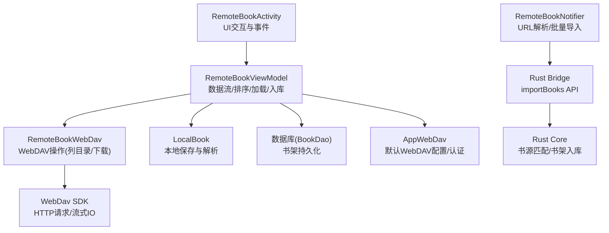
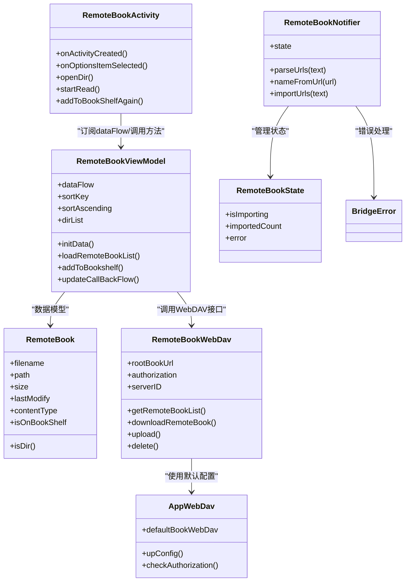
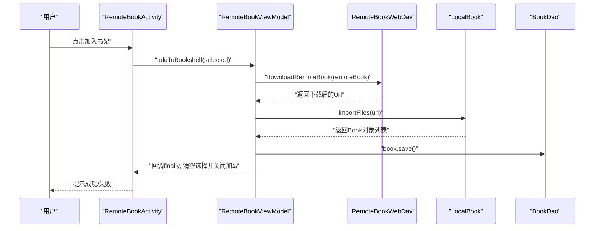
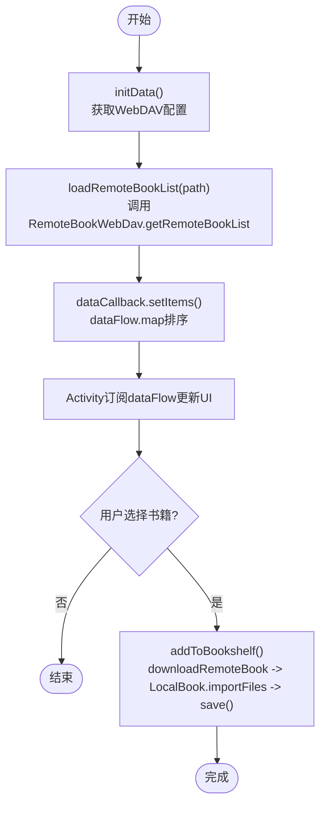
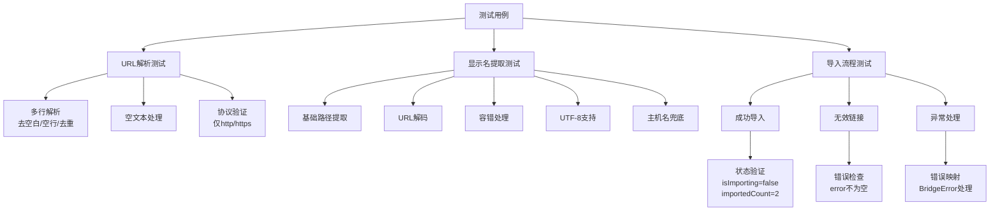
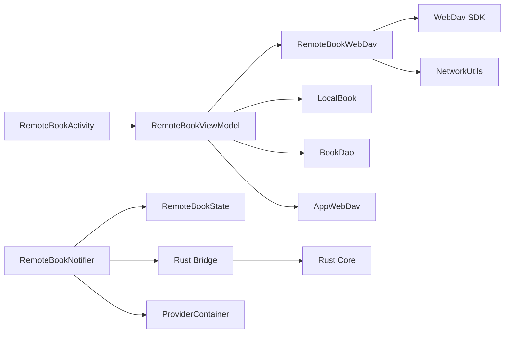

# 远程书籍导入

<cite>
**本文引用的文件**   
- [RemoteBookActivity.kt](file://app/src/main/java/io/legado/app/ui/book/import/remote/RemoteBookActivity.kt)
- [RemoteBookViewModel.kt](file://app/src/main/java/io/legado/app/ui/book/import/remote/RemoteBookViewModel.kt)
- [BaseImportBookActivity.kt](file://app/src/main/java/io/legado/app/ui/book/import/BaseImportBookActivity.kt)
- [RemoteBook.kt](file://app/src/main/java/io/legado/app/model/remote/RemoteBook.kt)
- [RemoteBookWebDav.kt](file://app/src/main/java/io/legado/app/model/remote/RemoteBookWebDav.kt)
- [AppWebDav.kt](file://app/src/main/java/io/legado/app/help/AppWebDav.kt)
- [remote_book_test.dart](file://flutter_legado/test/unit/remote_book_test.dart)
- [remote_book_notifier.dart](file://flutter_legado/lib/src/providers/remote_book/remote_book_notifier.dart)
- [remote_book_state.dart](file://flutter_legado/lib/src/providers/remote_book/remote_book_state.dart)
- [book_import.dart](file://flutter_legado/lib/src/bridge/api/book_import.dart)
- [ffi.dart](file://flutter_legado/lib/src/bridge/ffi.dart)
</cite>

## 更新摘要
**所做更改**
- 新增 Flutter 端远程书籍导入功能的测试覆盖章节
- 更新 URL 解析逻辑说明，强调 HTTP/HTTPS 协议验证
- 添加新的测试场景：链接渲染行为、无效链接验证、成功导入确认
- 补充 Rust 桥接接口与错误处理机制

## 目录
1. [简介](#简介)
2. [项目结构](#项目结构)
3. [核心组件](#核心组件)
4. [架构总览](#架构总览)
5. [详细组件分析](#详细组件分析)
6. [Flutter 端测试覆盖](#flutter-端测试覆盖)
7. [依赖关系分析](#依赖关系分析)
8. [性能考虑](#性能考虑)
9. [故障排查指南](#故障排查指南)
10. [结论](#结论)

## 简介
本文件围绕"远程书籍导入"功能，系统性梳理 Legado 中通过 WebDAV 浏览、下载并加入书架的完整流程。内容覆盖 UI 层（Activity）、业务逻辑层（ViewModel）、数据模型（RemoteBook）、网络与存储桥接（RemoteBookWebDav、AppWebDav）以及公共基类（BaseImportBookActivity），并提供架构图、时序图与流程图，帮助读者快速理解从远端列表到本地书架落库的全过程。

**更新** 新增 Flutter 端的远程书籍导入实现，包含完整的单元测试覆盖，确保 URL 解析、链接验证和导入流程的正确性。

## 项目结构
远程书籍导入相关代码主要位于 app 模块的 ui.book.import.remote 包与 model.remote、help.AppWebDav 等位置：
- UI 层：RemoteBookActivity 负责展示远端目录与文件、处理排序/搜索/选择/加入书架等操作
- 业务层：RemoteBookViewModel 管理数据流、排序筛选、加载远端列表、执行下载入库
- 数据模型：RemoteBook 表示远端文件或目录，封装是否目录、是否在书架等状态
- 网络与存储：RemoteBookWebDav 封装 WebDAV 操作（列出、下载、上传、删除），AppWebDav 提供默认配置与认证
- 公共基类：BaseImportBookActivity 统一处理搜索框、保存路径选择、压缩包内书籍打开等通用逻辑

**新增** Flutter 端实现：
- RemoteBookNotifier：Riverpod Notifier，负责 URL 解析、批量导入逻辑
- RemoteBookState：状态管理，包含导入进度、数量和错误信息
- 单元测试：覆盖 URL 解析、名称提取、导入流程等核心功能

**图表来源**
- [RemoteBookActivity.kt](file://app/src/main/java/io/legado/app/ui/book/import/remote/RemoteBookActivity.kt)
- [RemoteBookViewModel.kt](file://app/src/main/java/io/legado/app/ui/book/import/remote/RemoteBookViewModel.kt)
- [RemoteBookWebDav.kt](file://app/src/main/java/io/legado/app/model/remote/RemoteBookWebDav.kt)
- [AppWebDav.kt](file://app/src/main/java/io/legado/app/help/AppWebDav.kt)
- [remote_book_notifier.dart](file://flutter_legado/lib/src/providers/remote_book/remote_book_notifier.dart)

## 核心组件
- RemoteBookActivity
  - 职责：初始化界面、绑定适配器、响应菜单（刷新/排序/服务器配置/帮助）、处理返回与路径导航、触发加入书架、打开已下载或压缩包内的书籍
  - 关键流程：监听 ViewModel 的数据流更新列表；根据 dirList 构建当前路径；调用 loadRemoteBookList 获取远端列表；点击加入书架时调用 addToBookshelf
- RemoteBookViewModel
  - 职责：维护 dataFlow（基于 callbackFlow 的响应式数据流）、排序与筛选、初始化 WebDAV 客户端、加载远端目录、下载并入库、权限异常处理
  - 关键流程：initData 获取服务器配置或回退到 AppWebDav.defaultBookWebDav；loadRemoteBookList 调用 RemoteBookWebDav.getRemoteBookList；addToBookshelf 遍历选中项，调用 downloadRemoteBook 后 LocalBook.importFiles 入库并设置 origin
- BaseImportBookActivity
  - 职责：统一搜索框行为、引导用户选择书籍保存目录、压缩包内书籍识别与读取入口
  - 关键流程：setBookStorage 确保 defaultBookTreeUri 存在；onArchiveFileClick 解析压缩包内可阅读文件并跳转阅读或提示导入
- RemoteBook
  - 职责：表示远端条目（文件或目录），封装 isDir、是否在书架等状态
- RemoteBookWebDav
  - 职责：封装 WebDAV 的列目录、获取文件信息、下载文件、上传、删除；内部使用 WebDav SDK 进行 IO
- AppWebDav
  - 职责：默认 WebDAV 根 URL、账号密码认证、目录初始化、默认 books 根目录构造 RemoteBookWebDav

**新增** Flutter 端核心组件：
- RemoteBookNotifier
  - 职责：URL 解析（parseUrls）、显示名提取（nameFromUrl）、批量导入（importUrls）
  - 关键特性：仅接受 HTTP/HTTPS 协议，自动去重、去空白、过滤空行
- RemoteBookState
  - 职责：管理导入状态（isImporting、importedCount、error）
  - 特点：不可变状态，支持 copyWith 更新

**章节来源**
- [RemoteBookActivity.kt:1-260](file://app/src/main/java/io/legado/app/ui/book/import/remote/RemoteBookActivity.kt#L1-L260)
- [RemoteBookViewModel.kt:1-174](file://app/src/main/java/io/legado/app/ui/book/import/remote/RemoteBookViewModel.kt#L1-L174)
- [BaseImportBookActivity.kt:1-161](file://app/src/main/java/io/legado/app/ui/book/import/BaseImportBookActivity.kt#L1-L161)
- [RemoteBook.kt:1-31](file://app/src/main/java/io/legado/app/model/remote/RemoteBook.kt#L1-L31)
- [RemoteBookWebDav.kt:1-91](file://app/src/main/java/io/legado/app/model/remote/RemoteBookWebDav.kt#L1-L91)
- [AppWebDav.kt:1-339](file://app/src/main/java/io/legado/app/help/AppWebDav.kt#L1-L339)
- [remote_book_notifier.dart:1-110](file://flutter_legado/lib/src/providers/remote_book/remote_book_notifier.dart#L1-L110)
- [remote_book_state.dart:1-23](file://flutter_legado/lib/src/providers/remote_book/remote_book_state.dart#L1-L23)

## 架构总览
远程书籍导入采用 MVVM + 协程 Flow 的分层设计：
- UI 层（Activity）仅负责事件与展示，不直接访问网络或数据库
- ViewModel 暴露 dataFlow 给 UI 订阅，集中处理排序、筛选、网络与本地落库
- 网络层通过 RemoteBookWebDav 抽象 WebDAV 能力，屏蔽底层 HTTP 细节
- 本地存储通过 LocalBook 完成文件写入与解析，最终由 BookDao 持久化

**更新** Flutter 端采用 Riverpod + Rust Bridge 架构：
- RemoteBookNotifier 作为状态管理器，处理 URL 解析和业务逻辑
- 通过 Rust Bridge 调用底层 Rust 核心进行书源匹配和书架入库
- 统一的错误处理和状态管理机制

**图表来源**
- [RemoteBookActivity.kt](file://app/src/main/java/io/legado/app/ui/book/import/remote/RemoteBookActivity.kt)
- [RemoteBookViewModel.kt](file://app/src/main/java/io/legado/app/ui/book/import/remote/RemoteBookViewModel.kt)
- [RemoteBook.kt](file://app/src/main/java/io/legado/app/model/remote/RemoteBook.kt)
- [RemoteBookWebDav.kt](file://app/src/main/java/io/legado/app/model/remote/RemoteBookWebDav.kt)
- [AppWebDav.kt](file://app/src/main/java/io/legado/app/help/AppWebDav.kt)
- [remote_book_notifier.dart](file://flutter_legado/lib/src/providers/remote_book/remote_book_notifier.dart)
- [remote_book_state.dart](file://flutter_legado/lib/src/providers/remote_book/remote_book_state.dart)
- [ffi.dart](file://flutter_legado/lib/src/bridge/ffi.dart)

## 详细组件分析

### RemoteBookActivity 分析
- 界面初始化与事件绑定
  - 设置标题栏背景、RecyclerView 布局与适配器、SelectActionBar 主按钮文案为"加入书架"
  - 首次进入若未配置默认书籍保存目录，会弹出帮助与选择器，确保 setBookStorage 成功
- 数据流订阅
  - 收集 viewModel.dataFlow，合并去抖后更新空态与列表，控制加载进度条
- 排序与筛选
  - 菜单项切换 sortKey（名称/时间），同时切换升序/降序；搜索框文本变化通过 updateCallBackFlow 驱动前端过滤
- 目录导航与路径显示
  - 维护 dirList，每次 upPath 拼接 path 并调用 loadRemoteBookList；返回键逐层后退
- 加入书架与阅读
  - 点击"加入书架"批量调用 addToBookshelf；对非压缩包文件尝试直接阅读，若为压缩包则查找本地是否存在，不存在则提示下载后再读

**图表来源**
- [RemoteBookActivity.kt](file://app/src/main/java/io/legado/app/ui/book/import/remote/RemoteBookActivity.kt)
- [RemoteBookViewModel.kt](file://app/src/main/java/io/legado/app/ui/book/import/remote/RemoteBookViewModel.kt)
- [RemoteBookWebDav.kt](file://app/src/main/java/io/legado/app/model/remote/RemoteBookWebDav.kt)

**章节来源**
- [RemoteBookActivity.kt:1-260](file://app/src/main/java/io/legado/app/ui/book/import/remote/RemoteBookActivity.kt#L1-L260)

### RemoteBookViewModel 分析
- 数据流与排序
  - 使用 callbackFlow 创建 dataFlow，内部持有 DataCallback 以接收 setItems/addItems/clear/screen 更新
  - 在 map 阶段按 sortKey 与 sortAscending 对列表排序（名称自然排序/时间倒序等）
- 初始化与加载
  - initData 优先从数据库读取服务器配置，否则回退到 AppWebDav.defaultBookWebDav
  - loadRemoteBookList 调用 RemoteBookWebDav.getRemoteBookList，并通过 dataCallback 推送结果
- 入库流程
  - addToBookshelf 遍历选中项，调用 downloadRemoteBook 得到 Uri，再 LocalBook.importFiles 解析入库，设置 origin 包含 serverID 与路径属性
- 错误处理
  - 捕获 SecurityException 并派发 permissionDenialLiveData，供 Activity 引导重新授权

**图表来源**
- [RemoteBookViewModel.kt](file://app/src/main/java/io/legado/app/ui/book/import/remote/RemoteBookViewModel.kt)

**章节来源**
- [RemoteBookViewModel.kt:1-174](file://app/src/main/java/io/legado/app/ui/book/import/remote/RemoteBookViewModel.kt#L1-L174)

### BaseImportBookActivity 分析
- 统一搜索框行为：设置主题色、提交禁用、查询文本变化回调 onSearchTextChange
- 强制设置书籍保存位置：若 defaultBookTreeUri 为空，弹出帮助文档与系统目录选择器
- 压缩包内书籍处理：提取匹配正则的文件名，若唯一则直接阅读或提示导入；多个则让用户选择

**章节来源**
- [BaseImportBookActivity.kt:1-161](file://app/src/main/java/io/legado/app/ui/book/import/BaseImportBookActivity.kt#L1-L161)

### RemoteBook 数据模型
- 字段：文件名、路径、大小、修改时间、内容类型、是否在书架
- isDir 判断 contentType 是否为 folder
- 构造函数支持从 WebDavFile 转换，自动推断扩展名与是否在书架

**章节来源**
- [RemoteBook.kt:1-31](file://app/src/main/java/io/legado/app/model/remote/RemoteBook.kt#L1-L31)

### RemoteBookWebDav 网络与存储桥接
- getRemoteBookList：检查网络可用，调用 WebDav.listFiles，过滤目录与书籍/压缩包格式
- downloadRemoteBook：校验 defaultBookTreeUri 与网络，下载输入流并通过 LocalBook.saveBookFile 保存到本地
- upload/delete：支持将本地书籍上传到远端或删除远端文件

**章节来源**
- [RemoteBookWebDav.kt:1-91](file://app/src/main/java/io/legado/app/model/remote/RemoteBookWebDav.kt#L1-L91)

### AppWebDav 默认配置与认证
- 默认根 URL 与目录：books、background、bookProgress 等
- upConfig：读取账号密码，校验认证，创建必要目录，构造 defaultBookWebDav
- 其他能力：备份/恢复、导出、背景图片上传下载、阅读进度同步

**章节来源**
- [AppWebDav.kt:1-339](file://app/src/main/java/io/legado/app/help/AppWebDav.kt#L1-L339)

### Flutter 端 RemoteBookNotifier 分析
- URL 解析逻辑（parseUrls）
  - 每行一个链接，自动去除空白字符和空行
  - 严格验证协议，仅接受 http:// 和 https:// 开头的链接
  - 自动去重，保持原始顺序
- 显示名提取（nameFromUrl）
  - 从 URL 路径末段提取文件名，去除常见扩展名
  - 支持 URL 解码，处理 UTF-8 多字节字符
  - 容错处理：非法编码时回退原串，无路径时使用主机名
- 批量导入（importUrls）
  - 解析 URL 后构建 JSON 数据结构，包含 bookUrl、name、origin 字段
  - 通过 Rust Bridge 调用 importBooks API 进行实际导入
  - 统一管理导入状态：isImporting、importedCount、error

**章节来源**
- [remote_book_notifier.dart:1-110](file://flutter_legado/lib/src/providers/remote_book/remote_book_notifier.dart#L1-L110)

## Flutter 端测试覆盖

**新增** Flutter 端远程书籍导入功能已实现全面的单元测试覆盖，包含三个核心测试场景：

### URL 解析测试
- **多行解析测试**：验证 parseUrls 方法能正确处理多行输入，包括空白字符去除、空行过滤、重复链接去重，以及仅保留 HTTP/HTTPS 协议的链接
- **空文本处理**：确保空字符串或仅包含空白字符的输入返回空列表

### 显示名提取测试
- **基础路径提取**：验证从 URL 路径末段正确提取文件名并去除扩展名
- **URL 解码支持**：测试百分号编码的 URL 解码功能
- **容错处理**：验证非法百分号编码时的降级处理，避免抛出异常
- **UTF-8 支持**：确保多字节 UTF-8 字符正确解码
- **主机名兜底**：当 URL 无路径时，回退使用主机名作为显示名

### 导入流程测试
- **初始状态验证**：确认导入前的状态为空且未处于导入中
- **成功导入场景**：验证有效链接导入成功后，状态正确更新导入数量，JSON 数据结构正确传递
- **无效链接处理**：确保无有效链接时记录错误信息且不触发底层 API 调用
- **异常处理**：验证异常情况下的错误映射和状态更新

**图表来源**
- [remote_book_test.dart:14-35](file://flutter_legado/test/unit/remote_book_test.dart#L14-L35)
- [remote_book_test.dart:37-73](file://flutter_legado/test/unit/remote_book_test.dart#L37-L73)
- [remote_book_test.dart:75-139](file://flutter_legado/test/unit/remote_book_test.dart#L75-L139)

**章节来源**
- [remote_book_test.dart:1-141](file://flutter_legado/test/unit/remote_book_test.dart#L1-141)
- [remote_book_notifier.dart:25-37](file://flutter_legado/lib/src/providers/remote_book/remote_book_notifier.dart#L25-L37)
- [remote_book_notifier.dart:40-62](file://flutter_legado/lib/src/providers/remote_book/remote_book_notifier.dart#L40-L62)
- [remote_book_notifier.dart:65-90](file://flutter_legado/lib/src/providers/remote_book/remote_book_notifier.dart#L65-L90)

## 依赖关系分析
- RemoteBookActivity 依赖 RemoteBookViewModel 与 RemoteBookAdapter（未在本文展开）
- RemoteBookViewModel 依赖 RemoteBookWebDav、LocalBook、数据库（BookDao）与 AppWebDav
- RemoteBookWebDav 依赖 WebDav SDK 与 NetworkUtils
- BaseImportBookActivity 依赖 AppConfig、LocalBook、ArchiveUtils 等

**新增** Flutter 端依赖关系：
- RemoteBookNotifier 依赖 RemoteBookState、Rust Bridge API
- RemoteBookState 使用 Freezed 注解生成不可变状态类
- 通过 ProviderContainer 管理依赖注入和 Mock 测试

**图表来源**
- [RemoteBookActivity.kt](file://app/src/main/java/io/legado/app/ui/book/import/remote/RemoteBookActivity.kt)
- [RemoteBookViewModel.kt](file://app/src/main/java/io/legado/app/ui/book/import/remote/RemoteBookViewModel.kt)
- [RemoteBookWebDav.kt](file://app/src/main/java/io/legado/app/model/remote/RemoteBookWebDav.kt)
- [AppWebDav.kt](file://app/src/main/java/io/legado/app/help/AppWebDav.kt)
- [remote_book_notifier.dart](file://flutter_legado/lib/src/providers/remote_book/remote_book_notifier.dart)
- [remote_book_state.dart](file://flutter_legado/lib/src/providers/remote_book/remote_book_state.dart)

**章节来源**
- [RemoteBookActivity.kt:1-260](file://app/src/main/java/io/legado/app/ui/book/import/remote/RemoteBookActivity.kt#L1-L260)
- [RemoteBookViewModel.kt:1-174](file://app/src/main/java/io/legado/app/ui/book/import/remote/RemoteBookViewModel.kt#L1-L174)
- [RemoteBookWebDav.kt:1-91](file://app/src/main/java/io/legado/app/model/remote/RemoteBookWebDav.kt#L1-L91)
- [AppWebDav.kt:1-339](file://app/src/main/java/io/legado/app/help/AppWebDav.kt#L1-L339)
- [remote_book_notifier.dart:1-110](file://flutter_legado/lib/src/providers/remote_book/remote_book_notifier.dart#L1-L110)
- [remote_book_state.dart:1-23](file://flutter_legado/lib/src/providers/remote_book/remote_book_state.dart#L1-L23)

## 性能考虑
- 数据流合并与排序
  - dataFlow 使用 conflate 减少频繁 UI 更新；排序在 flowOn(IO) 上执行，避免阻塞主线程
- 网络与 IO
  - 下载使用流式 IO（downloadInputStream），降低内存占用；建议在网络不可用时快速失败
- 列表过滤
  - 前端过滤基于字符串 contains，适合小量数据；大数据集可考虑后端分页或索引
- 并发与取消
  - 协程任务应配合生命周期取消，避免后台任务泄漏

**新增** Flutter 端性能优化：
- URL 解析使用单次遍历，避免多次字符串操作
- 显示名提取采用 try-catch 容错，减少异常开销
- 批量导入使用异步处理，避免阻塞 UI 线程
- 状态更新采用不可变模式，便于状态管理和调试

## 故障排查指南
- 无 WebDAV 配置
  - 现象：初始化失败提示"webDav没有配置"
  - 处理：进入服务器配置对话框，填写地址与账号密码，确保认证通过
- 网络不可用
  - 现象：抛出"网络不可用"异常
  - 处理：检查网络连接，重试加载
- 权限不足
  - 现象：SecurityException 触发 permissionDenialLiveData
  - 处理：引导用户重新选择书籍保存目录并授予读写权限
- 压缩包内无书籍
  - 现象：无法找到可阅读文件
  - 处理：确认压缩包内包含支持的书籍格式，或手动导入指定文件

**新增** Flutter 端故障排查：
- URL 解析失败
  - 现象：parseUrls 返回空列表
  - 处理：检查输入文本格式，确保每行一个有效的 HTTP/HTTPS 链接
- 显示名提取异常
  - 现象：nameFromUrl 抛出 FormatException
  - 处理：检查 URL 编码格式，系统会自动回退到原始 URL
- 导入失败
  - 现象：importUrls 抛出 BridgeError
  - 处理：查看 error 字段获取具体错误信息，检查网络连接和 Rust 核心状态

**章节来源**
- [RemoteBookViewModel.kt:1-174](file://app/src/main/java/io/legado/app/ui/book/import/remote/RemoteBookViewModel.kt#L1-L174)
- [RemoteBookWebDav.kt:1-91](file://app/src/main/java/io/legado/app/model/remote/RemoteBookWebDav.kt#L1-L91)
- [BaseImportBookActivity.kt:1-161](file://app/src/main/java/io/legado/app/ui/book/import/BaseImportBookActivity.kt#L1-L161)
- [remote_book_notifier.dart:93-96](file://flutter_legado/lib/src/providers/remote_book/remote_book_notifier.dart#L93-L96)

## 结论
远程书籍导入通过清晰的 MVVM 分层与协程 Flow 实现了高内聚、低耦合的设计。UI 层专注交互，ViewModel 集中编排数据流与业务逻辑，RemoteBookWebDav 屏蔽网络细节，AppWebDav 提供默认配置与认证。整体流程稳定可靠，具备较好的可扩展性与可维护性。

**更新** Flutter 端的实现进一步增强了功能的完整性和可靠性：
- 通过 Riverpod 实现现代化的状态管理
- 完善的单元测试覆盖确保核心逻辑的正确性
- Rust Bridge 提供高性能的底层处理能力
- 严格的 URL 验证和错误处理机制

建议在后续优化中关注大数据集过滤性能、网络重试策略与更细粒度的错误提示，同时继续完善移动端用户体验和功能完整性。