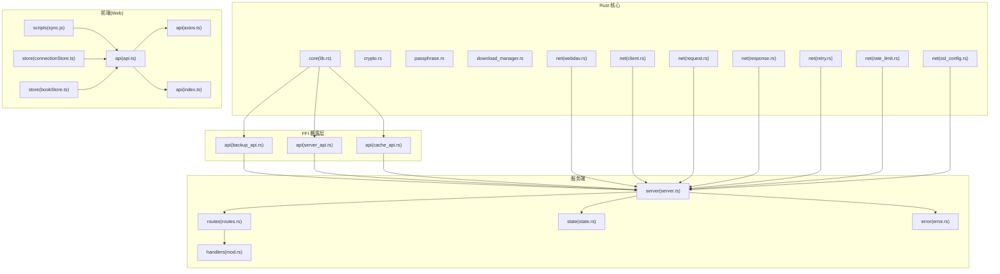
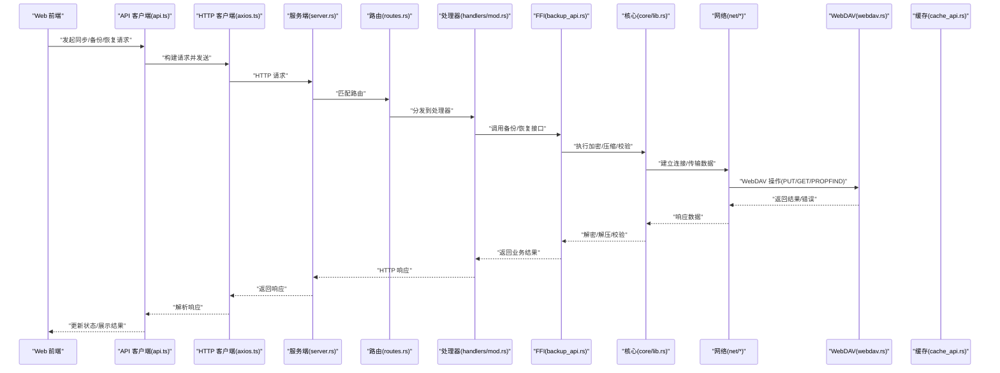
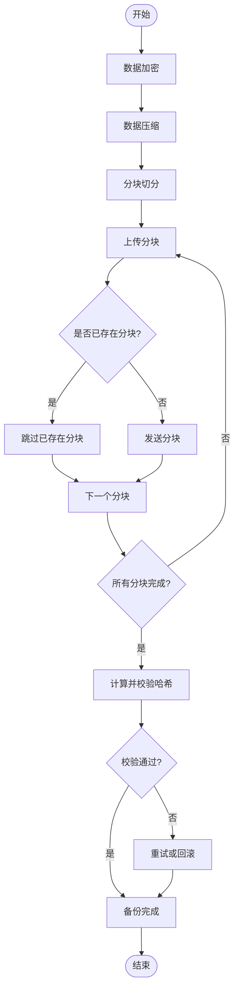
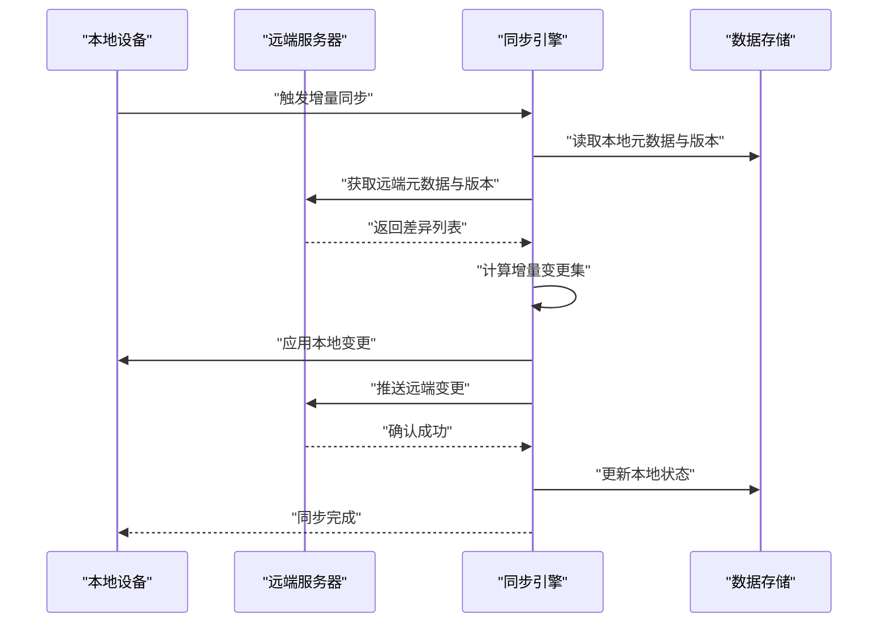
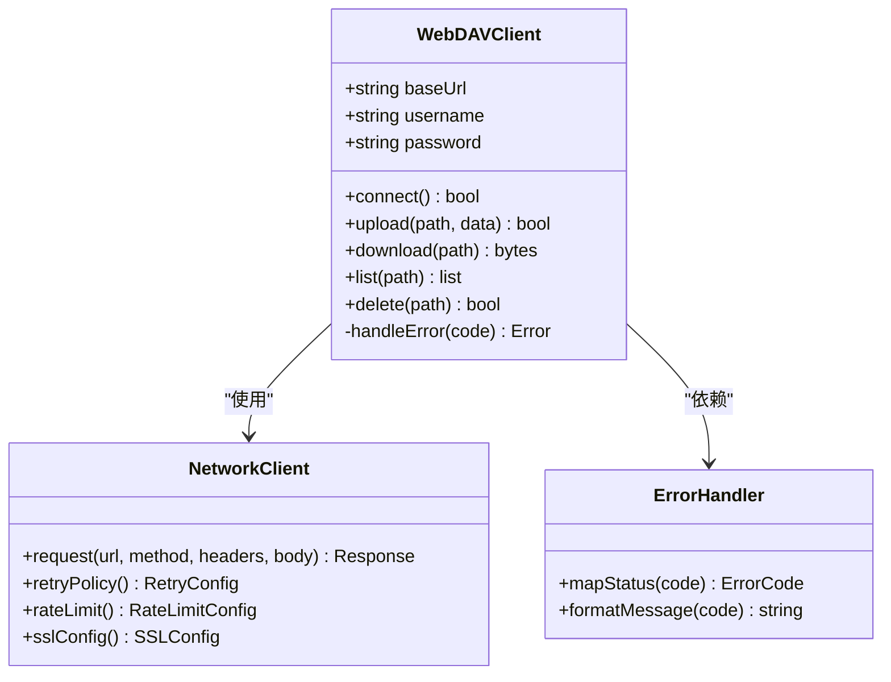
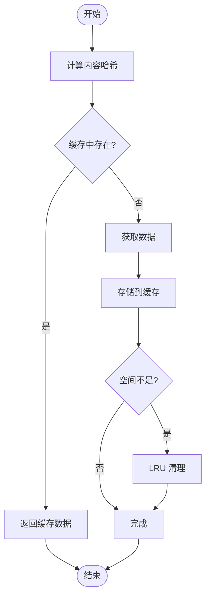
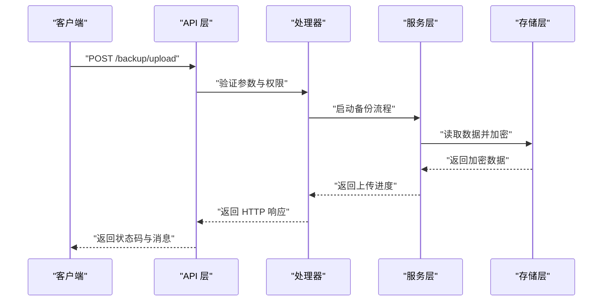
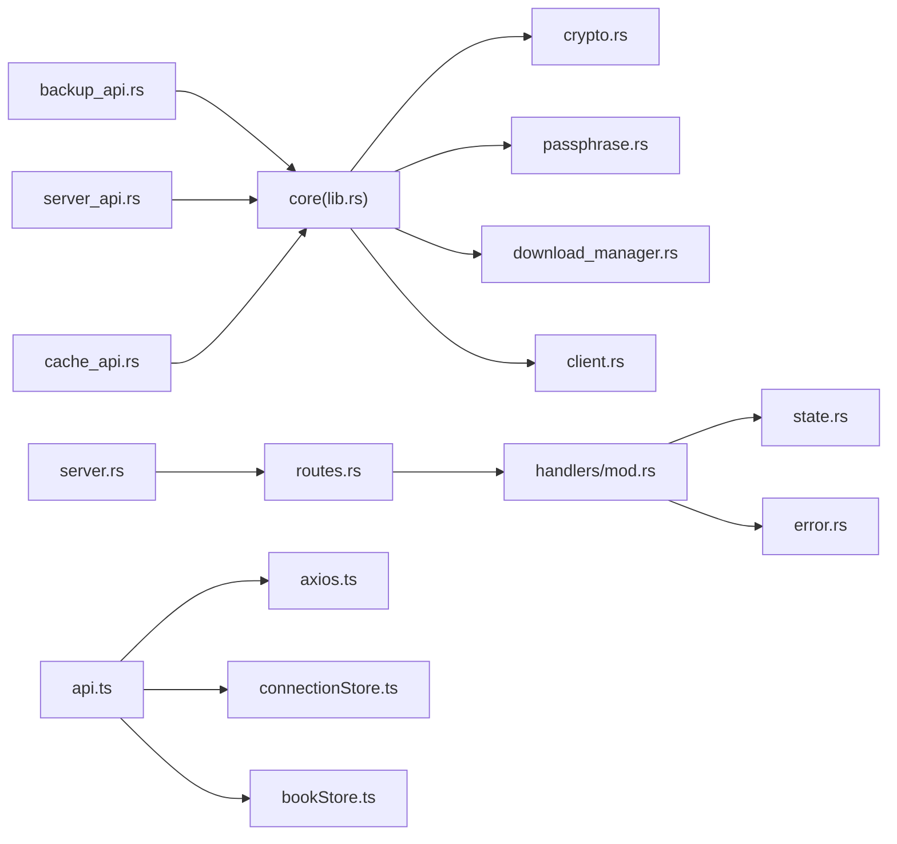

# 同步服务

<cite>
**本文引用的文件**   
- [webdav.rs](file://rust/legado-net/src/webdav.rs)
- [backup_api.rs](file://rust/legado-ffi/src/api/backup_api.rs)
- [server_api.rs](file://rust/legado-ffi/src/api/server_api.rs)
- [cache_api.rs](file://rust/legado-ffi/src/api/cache_api.rs)
- [lib.rs](file://rust/legado-core/src/lib.rs)
- [crypto.rs](file://rust/legado-core/src/crypto.rs)
- [passphrase.rs](file://rust/legado-core/src/passphrase.rs)
- [download_manager.rs](file://rust/legado-core/src/download_manager.rs)
- [client.rs](file://rust/legado-net/src/client.rs)
- [request.rs](file://rust/legado-net/src/request.rs)
- [response.rs](file://rust/legado-net/src/response.rs)
- [retry.rs](file://rust/legado-net/src/retry.rs)
- [rate_limit.rs](file://rust/legado-net/src/rate_limit.rs)
- [ssl_config.rs](file://rust/legado-net/src/ssl_config.rs)
- [server.rs](file://rust/legado-server/src/server.rs)
- [routes.rs](file://rust/legado-server/src/routes.rs)
- [state.rs](file://rust/legado-server/src/state.rs)
- [error.rs](file://rust/legado-server/src/error.rs)
- [handlers/mod.rs](file://rust/legado-server/src/handlers/mod.rs)
- [sync.js](file://modules/web/public/scripts/sync.js)
- [api.ts](file://modules/web/src/api/api.ts)
- [axios.ts](file://modules/web/src/api/axios.ts)
- [index.ts](file://modules/web/src/api/index.ts)
- [connectionStore.ts](file://modules/web/src/store/connectionStore.ts)
- [bookStore.ts](file://modules/web/src/store/bookStore.ts)
- [App.kt](file://app/src/main/java/io/legado/app/App.kt)
- [AppDatabase](file://app/schemas/io.legado.app.data.AppDatabase/1.json)
</cite>

## 目录
1. [简介](#简介)
2. [项目结构](#项目结构)
3. [核心组件](#核心组件)
4. [架构总览](#架构总览)
5. [详细组件分析](#详细组件分析)
6. [依赖关系分析](#依赖关系分析)
7. [性能考量](#性能考量)
8. [故障排查指南](#故障排查指南)
9. [结论](#结论)
10. [附录](#附录)

## 简介
本技术文档聚焦 Legado 的同步服务，覆盖云端备份与恢复、多设备数据同步、WebDAV 协议集成、本地缓存策略、API 接口与安全配置，以及性能优化建议。目标是为开发者与维护者提供从系统架构到实现细节的完整参考，帮助快速定位问题并优化同步体验。

## 项目结构
Legado 的同步能力由 Rust 核心库（网络、加密、下载管理）、FFI 暴露层（对外 API）、服务端（HTTP/WebSocket）与前端（Web 界面）共同组成：
- Rust 核心库负责数据模型、加密、密码学、下载与重试、速率限制、SSL 配置等基础能力
- FFI 层将核心能力暴露给上层调用方（Android/Kotlin 或 Web）
- 服务端提供 HTTP 路由与处理器，支持同步相关接口
- Web 前端通过 API 客户端与服务端交互，管理连接与状态

**图表来源** 
- [lib.rs](file://rust/legado-core/src/lib.rs)
- [crypto.rs](file://rust/legado-core/src/crypto.rs)
- [passphrase.rs](file://rust/legado-core/src/passphrase.rs)
- [download_manager.rs](file://rust/legado-core/src/download_manager.rs)
- [client.rs](file://rust/legado-net/src/client.rs)
- [request.rs](file://rust/legado-net/src/request.rs)
- [response.rs](file://rust/legado-net/src/response.rs)
- [retry.rs](file://rust/legado-net/src/retry.rs)
- [rate_limit.rs](file://rust/legado-net/src/rate_limit.rs)
- [ssl_config.rs](file://rust/legado-net/src/ssl_config.rs)
- [webdav.rs](file://rust/legado-net/src/webdav.rs)
- [backup_api.rs](file://rust/legado-ffi/src/api/backup_api.rs)
- [server_api.rs](file://rust/legado-ffi/src/api/server_api.rs)
- [cache_api.rs](file://rust/legado-ffi/src/api/cache_api.rs)
- [server.rs](file://rust/legado-server/src/server.rs)
- [routes.rs](file://rust/legado-server/src/routes.rs)
- [state.rs](file://rust/legado-server/src/state.rs)
- [error.rs](file://rust/legado-server/src/error.rs)
- [handlers/mod.rs](file://rust/legado-server/src/handlers/mod.rs)
- [sync.js](file://modules/web/public/scripts/sync.js)
- [api.ts](file://modules/web/src/api/api.ts)
- [axios.ts](file://modules/web/src/api/axios.ts)
- [index.ts](file://modules/web/src/api/index.ts)
- [connectionStore.ts](file://modules/web/src/store/connectionStore.ts)
- [bookStore.ts](file://modules/web/src/store/bookStore.ts)

**章节来源**
- [lib.rs](file://rust/legado-core/src/lib.rs)
- [server.rs](file://rust/legado-server/src/server.rs)
- [routes.rs](file://rust/legado-server/src/routes.rs)
- [state.rs](file://rust/legado-server/src/state.rs)
- [error.rs](file://rust/legado-server/src/error.rs)
- [handlers/mod.rs](file://rust/legado-server/src/handlers/mod.rs)
- [sync.js](file://modules/web/public/scripts/sync.js)
- [api.ts](file://modules/web/src/api/api.ts)
- [axios.ts](file://modules/web/src/api/axios.ts)
- [index.ts](file://modules/web/src/api/index.ts)
- [connectionStore.ts](file://modules/web/src/store/connectionStore.ts)
- [bookStore.ts](file://modules/web/src/store/bookStore.ts)

## 核心组件
- 备份与恢复（Backup/Restore）：通过 FFI 暴露的备份接口，结合加密与压缩，完成云端上传与下载；支持断点续传与完整性校验
- 多设备同步：增量同步算法、冲突检测与解决、状态一致性保证
- WebDAV 集成：服务器配置、连接管理、权限控制与错误处理
- 本地缓存：数据去重、空间管理与清理机制
- 网络与传输：请求/响应封装、重试、限速、SSL/TLS 配置
- 服务端：HTTP 路由、处理器、状态管理与错误处理

**章节来源**
- [backup_api.rs](file://rust/legado-ffi/src/api/backup_api.rs)
- [server_api.rs](file://rust/legado-ffi/src/api/server_api.rs)
- [cache_api.rs](file://rust/legado-ffi/src/api/cache_api.rs)
- [webdav.rs](file://rust/legado-net/src/webdav.rs)
- [client.rs](file://rust/legado-net/src/client.rs)
- [request.rs](file://rust/legado-net/src/request.rs)
- [response.rs](file://rust/legado-net/src/response.rs)
- [retry.rs](file://rust/legado-net/src/retry.rs)
- [rate_limit.rs](file://rust/legado-net/src/rate_limit.rs)
- [ssl_config.rs](file://rust/legado-net/src/ssl_config.rs)
- [server.rs](file://rust/legado-server/src/server.rs)
- [routes.rs](file://rust/legado-server/src/routes.rs)
- [state.rs](file://rust/legado-server/src/state.rs)
- [error.rs](file://rust/legado-server/src/error.rs)

## 架构总览
下图展示了从 Web 前端到 Rust 核心与服务端的整体调用链，包括备份、恢复、WebDAV 与缓存的关键路径。

**图表来源** 
- [api.ts](file://modules/web/src/api/api.ts)
- [axios.ts](file://modules/web/src/api/axios.ts)
- [server.rs](file://rust/legado-server/src/server.rs)
- [routes.rs](file://rust/legado-server/src/routes.rs)
- [handlers/mod.rs](file://rust/legado-server/src/handlers/mod.rs)
- [backup_api.rs](file://rust/legado-ffi/src/api/backup_api.rs)
- [lib.rs](file://rust/legado-core/src/lib.rs)
- [client.rs](file://rust/legado-net/src/client.rs)
- [webdav.rs](file://rust/legado-net/src/webdav.rs)
- [cache_api.rs](file://rust/legado-ffi/src/api/cache_api.rs)

## 详细组件分析

### 云端备份与恢复
- 数据加密：使用核心库中的加密模块与口令派生，确保备份内容在传输与存储中安全
- 压缩传输：在上传前对数据进行压缩，减少带宽占用
- 断点续传：基于分块上传与状态记录，在网络中断后恢复未完成的传输
- 完整性校验：通过哈希校验确保数据一致性与完整性

**图表来源** 
- [backup_api.rs](file://rust/legado-ffi/src/api/backup_api.rs)
- [crypto.rs](file://rust/legado-core/src/crypto.rs)
- [passphrase.rs](file://rust/legado-core/src/passphrase.rs)
- [download_manager.rs](file://rust/legado-core/src/download_manager.rs)
- [client.rs](file://rust/legado-net/src/client.rs)
- [request.rs](file://rust/legado-net/src/request.rs)
- [response.rs](file://rust/legado-net/src/response.rs)

**章节来源**
- [backup_api.rs](file://rust/legado-ffi/src/api/backup_api.rs)
- [crypto.rs](file://rust/legado-core/src/crypto.rs)
- [passphrase.rs](file://rust/legado-core/src/passphrase.rs)
- [download_manager.rs](file://rust/legado-core/src/download_manager.rs)
- [client.rs](file://rust/legado-net/src/client.rs)
- [request.rs](file://rust/legado-net/src/request.rs)
- [response.rs](file://rust/legado-net/src/response.rs)

### 多设备数据同步
- 增量同步算法：对比本地与远端元数据差异，仅传输变更部分
- 冲突检测与解决：基于时间戳与版本号进行冲突识别，采用合并策略或用户选择
- 状态一致性保证：通过事务与幂等性设计，确保最终一致性

**图表来源** 
- [server_api.rs](file://rust/legado-ffi/src/api/server_api.rs)
- [lib.rs](file://rust/legado-core/src/lib.rs)
- [client.rs](file://rust/legado-net/src/client.rs)
- [request.rs](file://rust/legado-net/src/request.rs)
- [response.rs](file://rust/legado-net/src/response.rs)

**章节来源**
- [server_api.rs](file://rust/legado-ffi/src/api/server_api.rs)
- [lib.rs](file://rust/legado-core/src/lib.rs)
- [client.rs](file://rust/legado-net/src/client.rs)
- [request.rs](file://rust/legado-net/src/request.rs)
- [response.rs](file://rust/legado-net/src/response.rs)

### WebDAV 协议集成
- 服务器配置：支持自定义 WebDAV 服务器地址、端口、认证方式
- 连接管理：连接池、超时与重试策略
- 权限控制：基于用户名/密码或令牌访问控制
- 错误处理：统一错误码与消息，便于前端展示与调试

**图表来源** 
- [webdav.rs](file://rust/legado-net/src/webdav.rs)
- [client.rs](file://rust/legado-net/src/client.rs)
- [request.rs](file://rust/legado-net/src/request.rs)
- [response.rs](file://rust/legado-net/src/response.rs)
- [retry.rs](file://rust/legado-net/src/retry.rs)
- [rate_limit.rs](file://rust/legado-net/src/rate_limit.rs)
- [ssl_config.rs](file://rust/legado-net/src/ssl_config.rs)

**章节来源**
- [webdav.rs](file://rust/legado-net/src/webdav.rs)
- [client.rs](file://rust/legado-net/src/client.rs)
- [request.rs](file://rust/legado-net/src/request.rs)
- [response.rs](file://rust/legado-net/src/response.rs)
- [retry.rs](file://rust/legado-net/src/retry.rs)
- [rate_limit.rs](file://rust/legado-net/src/rate_limit.rs)
- [ssl_config.rs](file://rust/legado-net/src/ssl_config.rs)

### 本地缓存策略
- 数据去重：基于内容哈希避免重复存储
- 空间管理：设置最大缓存大小，按 LRU 策略清理
- 清理机制：定时任务或事件触发清理过期与无用缓存

**图表来源** 
- [cache_api.rs](file://rust/legado-ffi/src/api/cache_api.rs)
- [lib.rs](file://rust/legado-core/src/lib.rs)

**章节来源**
- [cache_api.rs](file://rust/legado-ffi/src/api/cache_api.rs)
- [lib.rs](file://rust/legado-core/src/lib.rs)

### API 接口文档
- 备份接口：支持上传备份包、查询进度、校验完整性
- 恢复接口：支持下载备份包、解密与解压、写入本地数据库
- 同步接口：支持增量同步、冲突检测与解决
- 缓存接口：支持查询、清理与统计

**图表来源** 
- [backup_api.rs](file://rust/legado-ffi/src/api/backup_api.rs)
- [server_api.rs](file://rust/legado-ffi/src/api/server_api.rs)
- [cache_api.rs](file://rust/legado-ffi/src/api/cache_api.rs)
- [server.rs](file://rust/legado-server/src/server.rs)
- [routes.rs](file://rust/legado-server/src/routes.rs)
- [handlers/mod.rs](file://rust/legado-server/src/handlers/mod.rs)

**章节来源**
- [backup_api.rs](file://rust/legado-ffi/src/api/backup_api.rs)
- [server_api.rs](file://rust/legado-ffi/src/api/server_api.rs)
- [cache_api.rs](file://rust/legado-ffi/src/api/cache_api.rs)
- [server.rs](file://rust/legado-server/src/server.rs)
- [routes.rs](file://rust/legado-server/src/routes.rs)
- [handlers/mod.rs](file://rust/legado-server/src/handlers/mod.rs)

### 安全配置指南
- 口令管理：使用强口令与安全的派生算法
- TLS/SSL：启用 HTTPS 与证书校验
- 权限控制：最小权限原则与访问令牌
- 日志脱敏：避免敏感信息泄露

**章节来源**
- [passphrase.rs](file://rust/legado-core/src/passphrase.rs)
- [crypto.rs](file://rust/legado-core/src/crypto.rs)
- [ssl_config.rs](file://rust/legado-net/src/ssl_config.rs)

### 性能优化建议
- 压缩与分块：合理设置压缩级别与分块大小
- 并发与限速：平衡并发度与速率限制
- 缓存命中率：优化缓存键与淘汰策略
- 重试与退避：指数退避与抖动策略

**章节来源**
- [download_manager.rs](file://rust/legado-core/src/download_manager.rs)
- [retry.rs](file://rust/legado-net/src/retry.rs)
- [rate_limit.rs](file://rust/legado-net/src/rate_limit.rs)
- [cache_api.rs](file://rust/legado-ffi/src/api/cache_api.rs)

## 依赖关系分析
- 核心库依赖：加密、口令、下载管理、网络客户端
- FFI 层依赖：备份、服务器、缓存接口
- 服务端依赖：路由、处理器、状态、错误处理
- 前端依赖：API 客户端、HTTP 客户端、状态管理

**图表来源** 
- [lib.rs](file://rust/legado-core/src/lib.rs)
- [crypto.rs](file://rust/legado-core/src/crypto.rs)
- [passphrase.rs](file://rust/legado-core/src/passphrase.rs)
- [download_manager.rs](file://rust/legado-core/src/download_manager.rs)
- [client.rs](file://rust/legado-net/src/client.rs)
- [backup_api.rs](file://rust/legado-ffi/src/api/backup_api.rs)
- [server_api.rs](file://rust/legado-ffi/src/api/server_api.rs)
- [cache_api.rs](file://rust/legado-ffi/src/api/cache_api.rs)
- [server.rs](file://rust/legado-server/src/server.rs)
- [routes.rs](file://rust/legado-server/src/routes.rs)
- [handlers/mod.rs](file://rust/legado-server/src/handlers/mod.rs)
- [state.rs](file://rust/legado-server/src/state.rs)
- [error.rs](file://rust/legado-server/src/error.rs)
- [api.ts](file://modules/web/src/api/api.ts)
- [axios.ts](file://modules/web/src/api/axios.ts)
- [connectionStore.ts](file://modules/web/src/store/connectionStore.ts)
- [bookStore.ts](file://modules/web/src/store/bookStore.ts)

**章节来源**
- [lib.rs](file://rust/legado-core/src/lib.rs)
- [backup_api.rs](file://rust/legado-ffi/src/api/backup_api.rs)
- [server_api.rs](file://rust/legado-ffi/src/api/server_api.rs)
- [cache_api.rs](file://rust/legado-ffi/src/api/cache_api.rs)
- [server.rs](file://rust/legado-server/src/server.rs)
- [routes.rs](file://rust/legado-server/src/routes.rs)
- [handlers/mod.rs](file://rust/legado-server/src/handlers/mod.rs)
- [state.rs](file://rust/legado-server/src/state.rs)
- [error.rs](file://rust/legado-server/src/error.rs)
- [api.ts](file://modules/web/src/api/api.ts)
- [axios.ts](file://modules/web/src/api/axios.ts)
- [connectionStore.ts](file://modules/web/src/store/connectionStore.ts)
- [bookStore.ts](file://modules/web/src/store/bookStore.ts)

## 性能考量
- 传输优化：启用压缩与分块上传，减少带宽占用
- 并发控制：合理设置并发数与速率限制，避免过载
- 缓存策略：提高命中率，降低重复请求
- 重试机制：指数退避与抖动，提升稳定性

[本节为通用指导，不直接分析具体文件]

## 故障排查指南
- 网络连接失败：检查 SSL 配置与代理设置
- 备份失败：查看分块上传状态与哈希校验结果
- 同步冲突：检查版本与时间戳，确认冲突解决策略
- 缓存异常：清理缓存并重新生成

**章节来源**
- [ssl_config.rs](file://rust/legado-net/src/ssl_config.rs)
- [backup_api.rs](file://rust/legado-ffi/src/api/backup_api.rs)
- [server_api.rs](file://rust/legado-ffi/src/api/server_api.rs)
- [cache_api.rs](file://rust/legado-ffi/src/api/cache_api.rs)

## 结论
Legado 的同步服务通过模块化设计与清晰的职责划分，实现了安全、高效、可靠的数据同步能力。未来可进一步优化压缩算法、缓存策略与冲突解决机制，以提升用户体验与系统性能。

[本节为总结，不直接分析具体文件]

## 附录
- Android 应用入口与数据库初始化参考
- Web 前端同步脚本与状态管理

**章节来源**
- [App.kt](file://app/src/main/java/io/legado/app/App.kt)
- [AppDatabase](file://app/schemas/io.legado.app.data.AppDatabase/1.json)
- [sync.js](file://modules/web/public/scripts/sync.js)
- [connectionStore.ts](file://modules/web/src/store/connectionStore.ts)
- [bookStore.ts](file://modules/web/src/store/bookStore.ts)