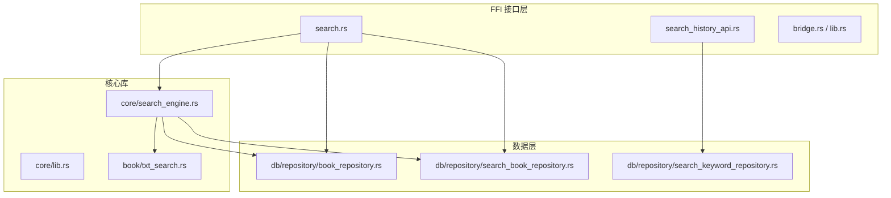
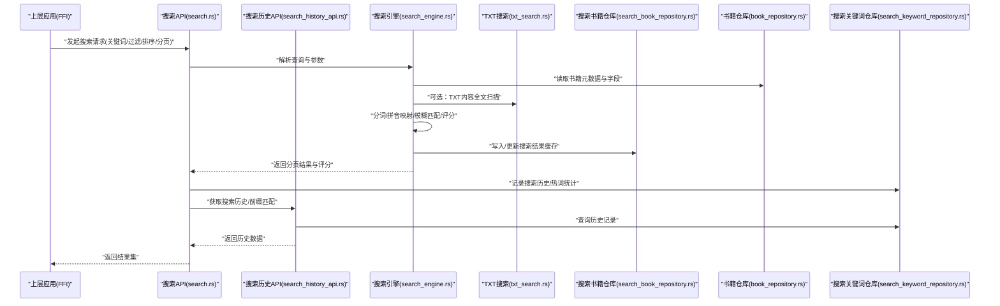
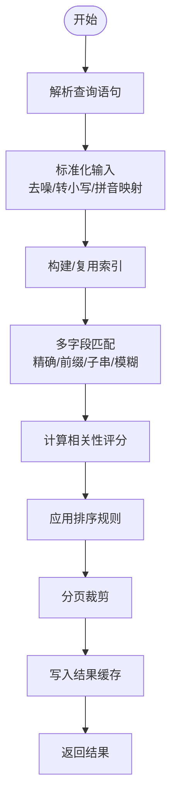
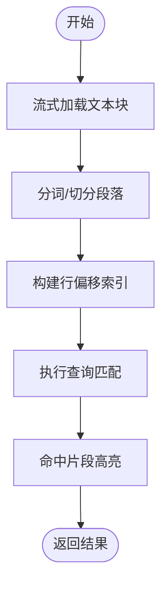
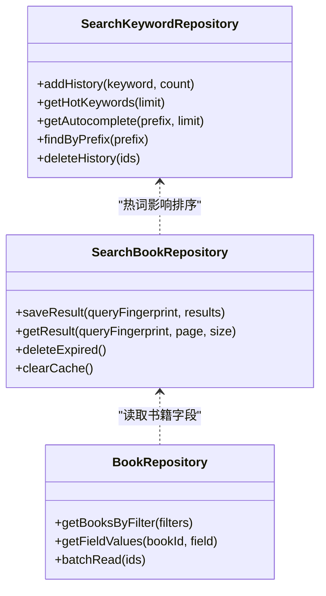
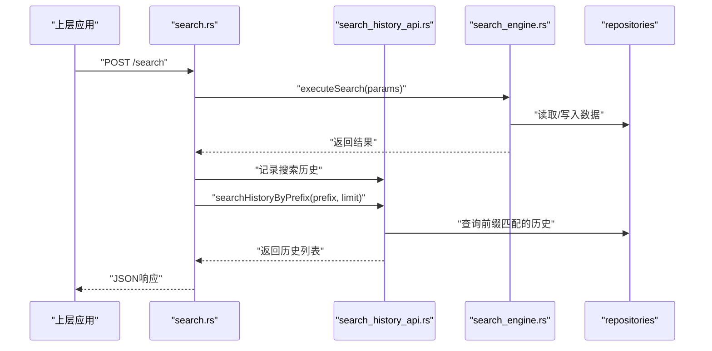
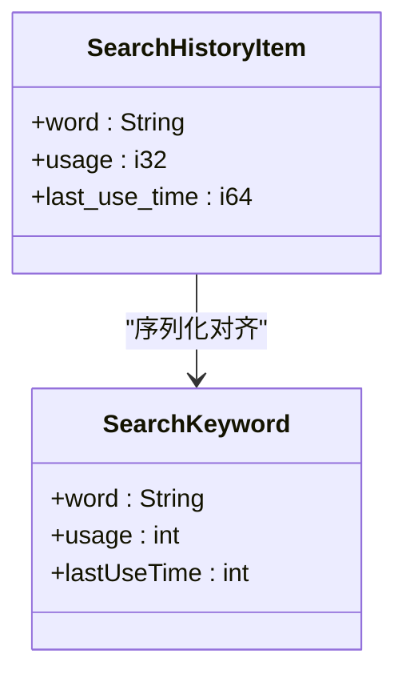
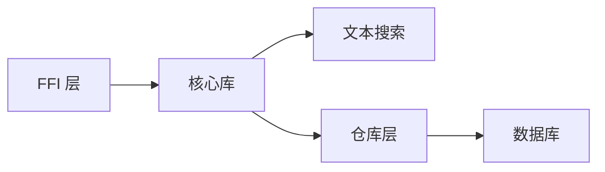

# 搜索功能

<cite>
**本文引用的文件**   
- [search_engine.rs](file://rust/legado-core/src/search_engine.rs)
- [search.rs](file://rust/legado-ffi/src/api/search.rs)
- [search_history_api.rs](file://rust/legado-ffi/src/api/search_history_api.rs)
- [txt_search.rs](file://rust/legado-book/src/txt_search.rs)
- [search_book_repository.rs](file://rust/legado-db/src/repository/search_book_repository.rs)
- [search_keyword_repository.rs](file://rust/legado-db/src/repository/search_keyword_repository.rs)
- [book_repository.rs](file://rust/legado-db/src/repository/book_repository.rs)
- [lib.rs](file://rust/legado-core/src/lib.rs)
- [bridge.rs](file://rust/legado-ffi/src/bridge.rs)
- [lib.rs](file://rust/legado-ffi/src/lib.rs)
- [misc.rs](file://rust/legado-core/src/models/misc.rs)
- [misc.dart](file://flutter_legado/lib/src/models/misc.dart)
</cite>

## 更新摘要
**所做更改**   
- 新增搜索历史前缀查询方法 `searchHistoryByPrefix`，支持搜索自动补全功能
- 字段对齐修复：将 `keyword/book_name/time` 统一改为 `word/usage/lastUseTime`，与 Dart 模型保持一致
- 增强搜索历史 API 的序列化格式，确保跨语言数据一致性
- 更新搜索历史仓库的前缀匹配查询功能

## 目录
1. [简介](#简介)
2. [项目结构](#项目结构)
3. [核心组件](#核心组件)
4. [架构总览](#架构总览)
5. [详细组件分析](#详细组件分析)
6. [依赖关系分析](#依赖关系分析)
7. [性能考量](#性能考量)
8. [故障排除指南](#故障排除指南)
9. [结论](#结论)
10. [附录](#附录)

## 简介
本技术文档围绕 Legado 的搜索能力进行系统化说明，覆盖全文搜索引擎、索引构建算法、关键词匹配、模糊搜索与拼音支持；多字段检索（书名、作者、描述、标签、内容）；搜索结果排序（相关性评分、时间、评分、自定义规则）；以及搜索优化（缓存策略、分页加载、实时搜索、搜索历史）。同时提供搜索语法建议、性能调优与常见问题排查方法，帮助开发者与高级用户高效使用与扩展搜索功能。

## 项目结构
Legado 的搜索功能由 Rust 核心库与 FFI 层共同实现：
- Rust 核心库负责搜索引擎、文本处理、数据库访问与持久化。
- FFI 层暴露 API 给上层应用（Android/Kotlin/Flutter），并桥接数据库与业务逻辑。
- 数据库层通过仓库模式封装对书籍、搜索词、搜索结果的读写。

**图表来源** 
- [search.rs](file://rust/legado-ffi/src/api/search.rs)
- [search_history_api.rs](file://rust/legado-ffi/src/api/search_history_api.rs)
- [bridge.rs](file://rust/legado-ffi/src/bridge.rs)
- [lib.rs](file://rust/legado-ffi/src/lib.rs)
- [lib.rs](file://rust/legado-core/src/lib.rs)
- [search_engine.rs](file://rust/legado-core/src/search_engine.rs)
- [txt_search.rs](file://rust/legado-book/src/txt_search.rs)
- [book_repository.rs](file://rust/legado-db/src/repository/book_repository.rs)
- [search_book_repository.rs](file://rust/legado-db/src/repository/search_book_repository.rs)
- [search_keyword_repository.rs](file://rust/legado-db/src/repository/search_keyword_repository.rs)

**章节来源**
- [search_engine.rs](file://rust/legado-core/src/search_engine.rs)
- [search.rs](file://rust/legado-ffi/src/api/search.rs)
- [search_history_api.rs](file://rust/legado-ffi/src/api/search_history_api.rs)
- [txt_search.rs](file://rust/legado-book/src/txt_search.rs)
- [search_book_repository.rs](file://rust/legado-db/src/repository/search_book_repository.rs)
- [search_keyword_repository.rs](file://rust/legado-db/src/repository/search_keyword_repository.rs)
- [book_repository.rs](file://rust/legado-db/src/repository/book_repository.rs)
- [lib.rs](file://rust/legado-core/src/lib.rs)
- [bridge.rs](file://rust/legado-ffi/src/bridge.rs)
- [lib.rs](file://rust/legado-ffi/src/lib.rs)

## 核心组件
- 搜索引擎（Core Search Engine）
  - 职责：解析查询、构建倒排或分词索引、执行匹配与评分、合并多字段结果、排序与分页。
  - 关键能力：分词、去噪、同音/拼音映射、模糊匹配、权重计算。
- 文本搜索（TXT 搜索）
  - 职责：针对 TXT 类内容的快速全文检索，包含行级/段落级扫描与命中高亮。
- 搜索持久化（Repositories）
  - 书籍搜索仓库：存储与查询搜索结果集、临时缓存、分页游标。
  - 关键词仓库：维护搜索历史、热词统计、自动补全候选。
  - 书籍仓库：基础书籍元数据与内容字段的读取。
- FFI 接口
  - 搜索 API：对外暴露搜索入口、参数校验、错误返回。
  - 搜索历史 API：增删改查历史记录、导出导入、清理策略。

**章节来源**
- [search_engine.rs](file://rust/legado-core/src/search_engine.rs)
- [txt_search.rs](file://rust/legado-book/src/txt_search.rs)
- [search_book_repository.rs](file://rust/legado-db/src/repository/search_book_repository.rs)
- [search_keyword_repository.rs](file://rust/legado-db/src/repository/search_keyword_repository.rs)
- [book_repository.rs](file://rust/legado-db/src/repository/book_repository.rs)
- [search.rs](file://rust/legado-ffi/src/api/search.rs)
- [search_history_api.rs](file://rust/legado-ffi/src/api/search_history_api.rs)

## 架构总览
下图展示了从 FFI 调用到核心搜索引擎与数据层的完整流程，包括搜索历史与结果持久化的交互。

**图表来源** 
- [search.rs](file://rust/legado-ffi/src/api/search.rs)
- [search_history_api.rs](file://rust/legado-ffi/src/api/search_history_api.rs)
- [search_engine.rs](file://rust/legado-core/src/search_engine.rs)
- [txt_search.rs](file://rust/legado-book/src/txt_search.rs)
- [search_book_repository.rs](file://rust/legado-db/src/repository/search_book_repository.rs)
- [book_repository.rs](file://rust/legado-db/src/repository/book_repository.rs)
- [search_keyword_repository.rs](file://rust/legado-db/src/repository/search_keyword_repository.rs)

## 详细组件分析

### 搜索引擎（search_engine.rs）
- 索引构建
  - 基于字段分词与倒排表构建，支持书名、作者、描述、标签、内容等多字段索引。
  - 对中文采用分词器，结合拼音映射表提升容错与同音匹配。
- 关键词匹配
  - 精确匹配优先，其次为前缀匹配与子串匹配。
  - 支持布尔表达式（AND/OR/NOT）与字段限定（如“作者:xxx”）。
- 模糊搜索
  - 编辑距离与近似匹配，允许少量错别字与顺序颠倒。
  - 拼音相似度匹配，支持多音字与方言映射。
- 评分与排序
  - 相关性评分：字段权重（标题>作者>标签>描述>内容）、命中次数、位置邻近度。
  - 时间排序：按更新时间或创建时间降序。
  - 评分排序：按书籍评分或热度排序。
  - 自定义排序：支持用户配置的多键排序与优先级。
- 分页与缓存
  - 分页游标基于偏移量或键集分页，避免深翻页性能问题。
  - 搜索结果短期缓存，减少重复查询开销。

**图表来源** 
- [search_engine.rs](file://rust/legado-core/src/search_engine.rs)

**章节来源**
- [search_engine.rs](file://rust/legado-core/src/search_engine.rs)

### 文本搜索（txt_search.rs）
- 目标：对 TXT 类大文本进行高效全文检索。
- 策略：
  - 行级/段落级扫描，建立行偏移索引以加速定位。
  - 支持正则与关键字混合匹配，命中片段高亮。
  - 流式读取降低内存占用，适合移动端设备。
- 适用场景：本地 TXT 书籍、长文内容检索与定位。

**图表来源** 
- [txt_search.rs](file://rust/legado-book/src/txt_search.rs)

**章节来源**
- [txt_search.rs](file://rust/legado-book/src/txt_search.rs)

### 搜索持久化（Repositories）
- 搜索书籍仓库（search_book_repository.rs）
  - 管理搜索结果集的增删改查、过期清理、分页游标。
  - 支持按查询指纹缓存结果，避免重复计算。
- 搜索关键词仓库（search_keyword_repository.rs）
  - 维护搜索历史、热词统计、自动补全候选。
  - 支持批量导入/导出与定期清理策略。
  - **新增**：前缀匹配查询功能，用于搜索联想和自动补全。
- 书籍仓库（book_repository.rs）
  - 提供书籍元数据与字段读取，供搜索引擎聚合与评分。

**图表来源** 
- [search_book_repository.rs](file://rust/legado-db/src/repository/search_book_repository.rs)
- [search_keyword_repository.rs](file://rust/legado-db/src/repository/search_keyword_repository.rs)
- [book_repository.rs](file://rust/legado-db/src/repository/book_repository.rs)

**章节来源**
- [search_book_repository.rs](file://rust/legado-db/src/repository/search_book_repository.rs)
- [search_keyword_repository.rs](file://rust/legado-db/src/repository/search_keyword_repository.rs)
- [book_repository.rs](file://rust/legado-db/src/repository/book_repository.rs)

### FFI 接口（search.rs / search_history_api.rs）
- 搜索 API（search.rs）
  - 接收上层请求，校验参数，调用搜索引擎，返回统一响应格式。
  - 支持分页、排序、过滤条件与字段选择。
- 搜索历史 API（search_history_api.rs）
  - 提供历史记录增删改查、导出导入、清理策略。
  - **新增**：`searchHistoryByPrefix` 方法，支持按前缀搜索历史关键词，用于搜索联想。
  - **字段对齐**：序列化字段已对齐 Dart `SearchKeyword` 模型：`word` / `usage` / `lastUseTime`。
  - 与热词统计联动，辅助自动补全与推荐。

**图表来源** 
- [search.rs](file://rust/legado-ffi/src/api/search.rs)
- [search_history_api.rs](file://rust/legado-ffi/src/api/search_history_api.rs)
- [search_engine.rs](file://rust/legado-core/src/search_engine.rs)

**章节来源**
- [search.rs](file://rust/legado-ffi/src/api/search.rs)
- [search_history_api.rs](file://rust/legado-ffi/src/api/search_history_api.rs)

### 搜索历史数据结构更新
**更新** 搜索历史数据结构已进行字段对齐，确保跨语言数据一致性：

- **Rust 侧** (`SearchHistoryItem`)：
  - `word`: String - 搜索关键词
  - `usage`: i32 - 使用次数（默认值为1）
  - `last_use_time`: i64 - 最后使用时间（序列化为 `lastUseTime`）

- **Dart 侧** (`SearchKeyword`)：
  - `word`: String - 搜索关键词
  - `usage`: int - 使用次数（默认值为1）
  - `lastUseTime`: int - 最后使用时间

**图表来源** 
- [search_history_api.rs](file://rust/legado-ffi/src/api/search_history_api.rs)
- [misc.rs](file://rust/legado-core/src/models/misc.rs)
- [misc.dart](file://flutter_legado/lib/src/models/misc.dart)

**章节来源**
- [search_history_api.rs](file://rust/legado-ffi/src/api/search_history_api.rs)
- [misc.rs](file://rust/legado-core/src/models/misc.rs)
- [misc.dart](file://flutter_legado/lib/src/models/misc.dart)

## 依赖关系分析
- 模块耦合
  - FFI 层仅依赖核心库与仓库层，保持接口稳定。
  - 搜索引擎依赖文本搜索与仓库层，解耦数据源。
- 外部依赖
  - 数据库访问通过仓库抽象，便于替换实现。
  - 文本处理与分词器可独立升级，不影响上层接口。
- 潜在循环依赖
  - 通过仓库层与接口隔离，避免直接循环引用。

**图表来源** 
- [bridge.rs](file://rust/legado-ffi/src/bridge.rs)
- [lib.rs](file://rust/legado-ffi/src/lib.rs)
- [lib.rs](file://rust/legado-core/src/lib.rs)
- [search_engine.rs](file://rust/legado-core/src/search_engine.rs)
- [txt_search.rs](file://rust/legado-book/src/txt_search.rs)
- [search_book_repository.rs](file://rust/legado-db/src/repository/search_book_repository.rs)
- [search_keyword_repository.rs](file://rust/legado-db/src/repository/search_keyword_repository.rs)
- [book_repository.rs](file://rust/legado-db/src/repository/book_repository.rs)

**章节来源**
- [bridge.rs](file://rust/legado-ffi/src/bridge.rs)
- [lib.rs](file://rust/legado-ffi/src/lib.rs)
- [lib.rs](file://rust/legado-core/src/lib.rs)
- [search_engine.rs](file://rust/legado-core/src/search_engine.rs)
- [txt_search.rs](file://rust/legado-book/src/txt_search.rs)
- [search_book_repository.rs](file://rust/legado-db/src/repository/search_book_repository.rs)
- [search_keyword_repository.rs](file://rust/legado-db/src/repository/search_keyword_repository.rs)
- [book_repository.rs](file://rust/legado-db/src/repository/book_repository.rs)

## 性能考量
- 索引构建
  - 增量更新：新增或修改书籍时仅重建受影响字段索引。
  - 并行构建：利用多线程分片构建倒排表，缩短冷启动时间。
- 查询优化
  - 查询规范化：去噪、大小写归一、拼音映射，减少无效匹配。
  - 短路评估：先精确匹配，再逐步放宽至模糊匹配。
  - 分页游标：使用键集分页替代深度偏移，避免 O(n) 扫描。
- 缓存策略
  - 结果缓存：按查询指纹缓存最近结果，设置 TTL 与淘汰策略。
  - 热词缓存：热门关键词预加载，提升自动补全速度。
- 内存与 I/O
  - 流式处理：TXT 搜索采用流式读取，控制峰值内存。
  - 批处理：批量读取书籍字段，减少数据库往返。
- **搜索历史优化**
  - 前缀匹配查询：使用 LIKE 操作符进行高效的关键词前缀搜索。
  - 结果限制：通过 limit 参数控制返回结果数量，避免大数据集传输。
  - 去重机制：插入时自动去重，保持历史数据的唯一性。

[本节为通用指导，不直接分析具体文件]

## 故障排除指南
- 搜索无结果
  - 检查查询语法与字段限定是否正确。
  - 确认索引是否已构建完成，必要时触发重建。
  - 查看拼音映射与分词器配置是否生效。
- 结果不准确
  - 调整字段权重与评分规则，提升相关度。
  - 检查模糊匹配阈值，避免误匹配。
- 性能问题
  - 监控查询耗时与内存占用，定位慢查询。
  - 增加缓存命中率，优化分页策略。
- 搜索历史异常
  - 检查历史记录写入是否成功，清理策略是否合理。
  - 验证热词统计与自动补全数据一致性。
  - **新增**：检查前缀匹配查询的性能，确保 LIKE 操作符正确使用。
  - **字段对齐**：确认 `word/usage/lastUseTime` 字段在跨语言传输中保持一致。

**章节来源**
- [search.rs](file://rust/legado-ffi/src/api/search.rs)
- [search_history_api.rs](file://rust/legado-ffi/src/api/search_history_api.rs)
- [search_engine.rs](file://rust/legado-core/src/search_engine.rs)
- [search_book_repository.rs](file://rust/legado-db/src/repository/search_book_repository.rs)
- [search_keyword_repository.rs](file://rust/legado-db/src/repository/search_keyword_repository.rs)

## 结论
Legado 的搜索功能通过 Rust 核心库与 FFI 接口实现了高性能、可扩展的全文检索能力。其多字段索引、模糊与拼音匹配、灵活排序与缓存策略，为用户提供了流畅的搜索体验。**最新增强**包括搜索历史功能的改进：新增前缀匹配查询支持搜索自动补全，字段对齐确保跨语言数据一致性。建议在大规模数据场景下关注索引构建与查询优化的持续改进，并结合业务需求定制评分与排序规则。

[本节为总结性内容，不直接分析具体文件]

## 附录
- 搜索语法建议
  - 基本查询：直接输入关键词，支持多词 AND 组合。
  - 字段限定：使用“字段:值”形式，如“作者:鲁迅”。
  - 布尔运算：AND、OR、NOT 组合复杂查询。
  - 模糊匹配：在关键词后添加“~”符号启用近似匹配。
  - 拼音支持：输入拼音或谐音，系统自动映射到汉字。
- 性能调优建议
  - 合理设置分页大小，避免过大页面导致内存压力。
  - 启用结果缓存与热词缓存，提升重复查询效率。
  - 定期清理过期索引与历史记录，释放存储空间。
  - **搜索历史优化**：合理使用前缀匹配查询，避免过长的前缀导致性能下降。
- 常见问题排查
  - 索引损坏：重新构建索引并验证完整性。
  - 查询超时：优化查询语句与索引结构。
  - 内存溢出：调整流式处理与批处理大小。
  - **跨语言数据问题**：确保 `word/usage/lastUseTime` 字段在不同语言间正确映射。

[本节为补充信息，不直接分析具体文件]