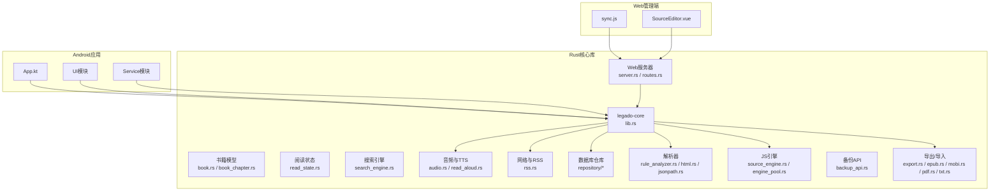
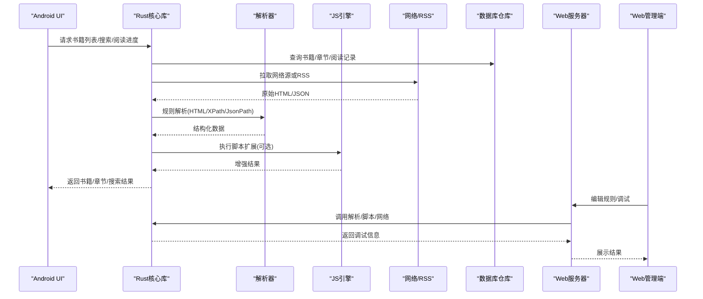
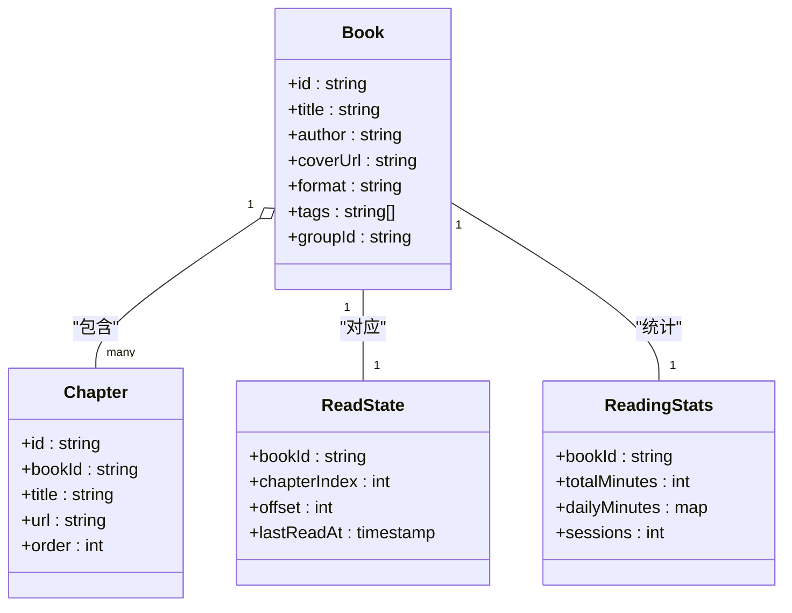
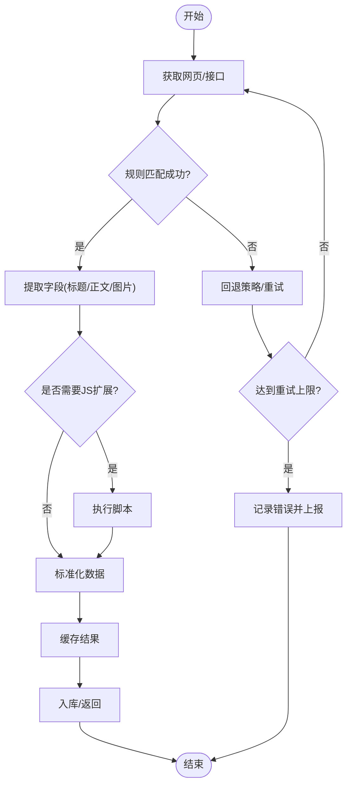
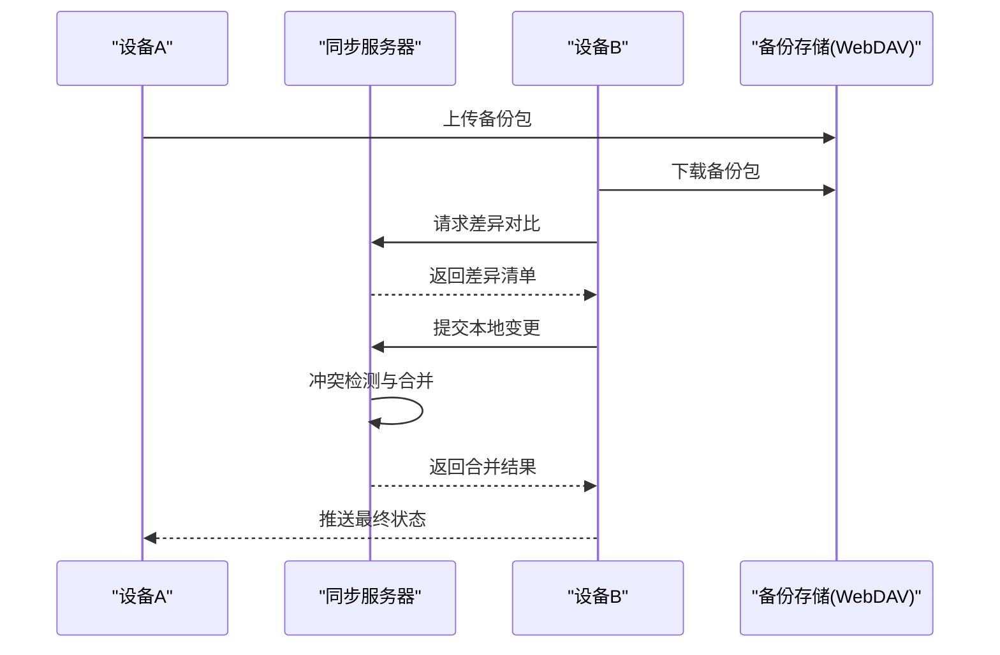
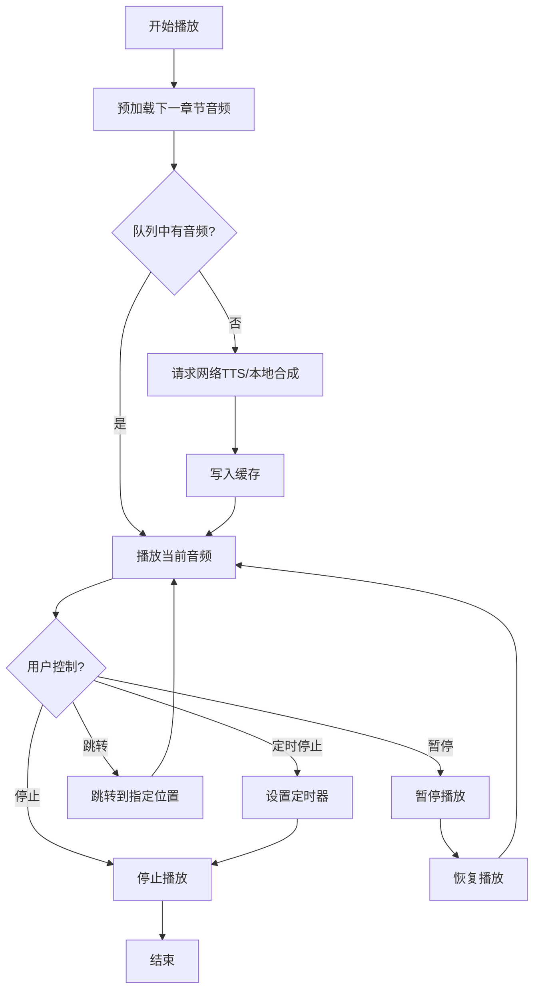
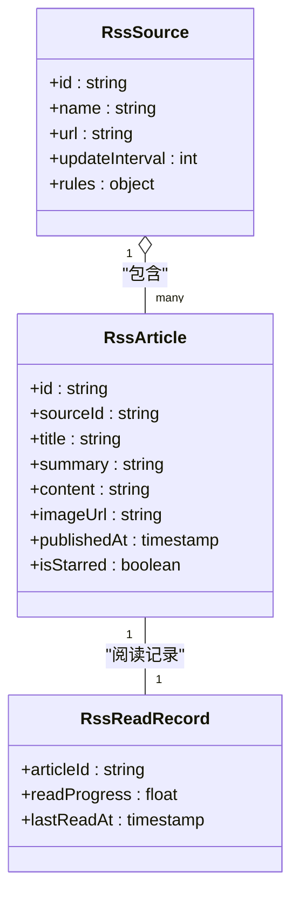
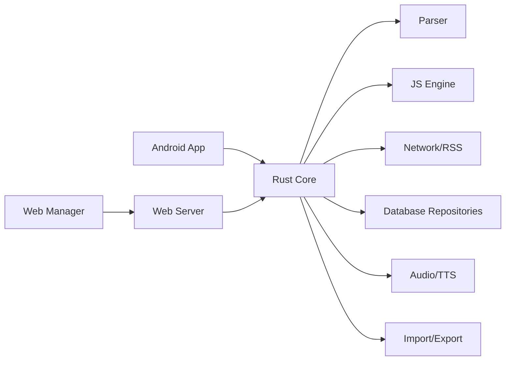

# 核心功能特性

<cite>
**本文档引用的文件**   
- [README.md](file://README.md)
- [App.kt](file://app/src/main/java/io/legado/app/App.kt)
- [lib.rs](file://rust/legado-core/src/lib.rs)
- [book.rs](file://rust/legado-core/src/models/book.rs)
- [book_chapter.rs](file://rust/legado-core/src/models/book_chapter.rs)
- [read_state.rs](file://rust/legado-core/src/read_state.rs)
- [reading_stats.rs](file://rust/legado-core/src/reading_stats.rs)
- [search_engine.rs](file://rust/legado-core/src/search_engine.rs)
- [content_processor.rs](file://rust/legado-core/src/content_processor.rs)
- [rule_analyzer.rs](file://rust/legado-parser/src/rule_analyzer.rs)
- [analyze_rule.rs](file://rust/legado-parser/src/analyze_rule.rs)
- [html.rs](file://rust/legado-parser/src/html.rs)
- [jsonpath.rs](file://rust/legado-parser/src/jsonpath.rs)
- [source_engine.rs](file://rust/legado-js/src/source_engine.rs)
- [engine_pool.rs](file://rust/legado-js/src/engine_pool.rs)
- [js_source/mod.rs](file://rust/legado-js/src/js_source/mod.rs)
- [audio.rs](file://rust/legado-core/src/audio.rs)
- [audio_cache.rs](file://rust/legado-core/src/audio_cache.rs)
- [read_aloud.rs](file://rust/legado-core/src/read_aloud.rs)
- [rss.rs](file://rust/legado-net/src/rss.rs)
- [rss_source_repository.rs](file://rust/legado-db/src/repository/rss_source_repository.rs)
- [rss_article_repository.rs](file://rust/legado-db/src/repository/rss_article_repository.rs)
- [rss_star_repository.rs](file://rust/legado-db/src/repository/rss_star_repository.rs)
- [backup_api.rs](file://rust/legado-ffi/src/api/backup_api.rs)
- [webdav.rs](file://rust/legado-net/src/webdav.rs)
- [server.rs](file://rust/legado-server/src/server.rs)
- [routes.rs](file://rust/legado-server/src/routes.rs)
- [sync.js](file://modules/web/scripts/sync.js)
- [export.rs](file://rust/legado-book/src/export.rs)
- [epub.rs](file://rust/legado-book/src/epub.rs)
- [mobi.rs](file://rust/legado-book/src/mobi.rs)
- [pdf.rs](file://rust/legado-book/src/pdf.rs)
- [txt.rs](file://rust/legado-book/src/txt.rs)
- [txt_search.rs](file://rust/legado-book/src/txt_search.rs)
</cite>

## 目录
1. [简介](#简介)
2. [项目结构](#项目结构)
3. [核心组件](#核心组件)
4. [架构总览](#架构总览)
5. [详细组件分析](#详细组件分析)
6. [依赖关系分析](#依赖关系分析)
7. [性能考量](#性能考量)
8. [故障排查指南](#故障排查指南)
9. [结论](#结论)
10. [附录](#附录)

## 简介
本文件面向Legado应用的核心功能特性，聚焦以下模块：书籍管理（多格式导入导出、智能分类、全文搜索、阅读进度跟踪）、网络源系统（规则解析引擎、JavaScript脚本扩展、自动更新与调试工具）、跨平台同步服务（云端备份恢复、多设备数据同步、冲突解决算法）、音频播放（TTS朗读、缓存管理、播放控制与定时停止）、RSS订阅（新闻聚合、内容抓取、文章阅读与收藏）。每个模块均提供使用场景、配置选项与最佳实践建议，帮助读者快速上手并高效使用。

## 项目结构
Legado采用“Android前端 + Rust核心库 + Web管理端”的混合架构：
- Android层负责UI交互与服务编排
- Rust核心库实现高性能的数据模型、解析、网络、音视频、数据库访问等能力
- Web管理端用于规则编辑、调试与批量操作

图表来源 
- [App.kt](file://app/src/main/java/io/legado/app/App.kt)
- [lib.rs](file://rust/legado-core/src/lib.rs)
- [server.rs](file://rust/legado-server/src/server.rs)
- [routes.rs](file://rust/legado-server/src/routes.rs)
- [sync.js](file://modules/web/scripts/sync.js)

章节来源
- [README.md](file://README.md)

## 核心组件
- 书籍管理：以数据模型为核心，结合导入导出、分类与搜索、阅读进度持久化
- 网络源系统：基于规则的网页解析引擎与JS脚本扩展，支持自动更新与调试
- 跨平台同步：通过WebDAV/HTTP API进行备份恢复与多设备同步，内置冲突解决策略
- 音频播放：TTS朗读、音频缓存、播放控制与定时停止
- RSS订阅：新闻聚合、内容抓取、文章阅读与收藏管理

章节来源
- [book.rs](file://rust/legado-core/src/models/book.rs)
- [book_chapter.rs](file://rust/legado-core/src/models/book_chapter.rs)
- [read_state.rs](file://rust/legado-core/src/read_state.rs)
- [reading_stats.rs](file://rust/legado-core/src/reading_stats.rs)
- [search_engine.rs](file://rust/legado-core/src/search_engine.rs)
- [rule_analyzer.rs](file://rust/legado-parser/src/rule_analyzer.rs)
- [analyze_rule.rs](file://rust/legado-parser/src/analyze_rule.rs)
- [html.rs](file://rust/legado-parser/src/html.rs)
- [jsonpath.rs](file://rust/legado-parser/src/jsonpath.rs)
- [source_engine.rs](file://rust/legado-js/src/source_engine.rs)
- [engine_pool.rs](file://rust/legado-js/src/engine_pool.rs)
- [audio.rs](file://rust/legado-core/src/audio.rs)
- [audio_cache.rs](file://rust/legado-core/src/audio_cache.rs)
- [read_aloud.rs](file://rust/legado-core/src/read_aloud.rs)
- [rss.rs](file://rust/legado-net/src/rss.rs)
- [backup_api.rs](file://rust/legado-ffi/src/api/backup_api.rs)
- [webdav.rs](file://rust/legado-net/src/webdav.rs)
- [export.rs](file://rust/legado-book/src/export.rs)
- [epub.rs](file://rust/legado-book/src/epub.rs)
- [mobi.rs](file://rust/legado-book/src/mobi.rs)
- [pdf.rs](file://rust/legado-book/src/pdf.rs)
- [txt.rs](file://rust/legado-book/src/txt.rs)
- [txt_search.rs](file://rust/legado-book/src/txt_search.rs)

## 架构总览
Legado将业务逻辑下沉至Rust核心库，Android层仅做UI与轻量编排；Web管理端通过HTTP/WebSocket与核心库通信，便于规则编辑与调试。

图表来源 
- [lib.rs](file://rust/legado-core/src/lib.rs)
- [rule_analyzer.rs](file://rust/legado-parser/src/rule_analyzer.rs)
- [html.rs](file://rust/legado-parser/src/html.rs)
- [jsonpath.rs](file://rust/legado-parser/src/jsonpath.rs)
- [source_engine.rs](file://rust/legado-js/src/source_engine.rs)
- [engine_pool.rs](file://rust/legado-js/src/engine_pool.rs)
- [rss.rs](file://rust/legado-net/src/rss.rs)
- [server.rs](file://rust/legado-server/src/server.rs)
- [routes.rs](file://rust/legado-server/src/routes.rs)

## 详细组件分析

### 书籍管理
- 多格式导入导出：支持EPUB、MOBI、PDF、TXT等格式的导入与导出，底层由Rust模块处理编码、元数据与章节提取
- 智能分类管理：按标签/分组组织书籍，支持批量操作与规则筛选
- 全文搜索：对本地与网络内容进行索引与检索，提升查找效率
- 阅读进度跟踪：记录每本书的阅读位置、阅读时长与统计指标

图表来源 
- [book.rs](file://rust/legado-core/src/models/book.rs)
- [book_chapter.rs](file://rust/legado-core/src/models/book_chapter.rs)
- [read_state.rs](file://rust/legado-core/src/read_state.rs)
- [reading_stats.rs](file://rust/legado-core/src/reading_stats.rs)

使用场景
- 批量导入电子书：从文件夹选择多种格式文件，自动识别元数据并生成章节
- 智能分类：为书籍添加标签与分组，配合规则快速筛选
- 全文搜索：输入关键词，快速定位章节与段落
- 阅读进度：打开书籍时自动恢复到上次位置，统计阅读时长

配置选项
- 导入设置：编码检测、封面下载策略、章节识别规则
- 搜索索引：是否启用全文索引、索引刷新频率
- 阅读统计：是否累计阅读时长、每日上限提醒

最佳实践
- 优先使用EPUB/MOBI以获得更稳定的章节与元数据
- 合理设置标签与分组，避免过细导致管理复杂
- 定期清理无用索引，保持搜索性能

章节来源
- [export.rs](file://rust/legado-book/src/export.rs)
- [epub.rs](file://rust/legado-book/src/epub.rs)
- [mobi.rs](file://rust/legado-book/src/mobi.rs)
- [pdf.rs](file://rust/legado-book/src/pdf.rs)
- [txt.rs](file://rust/legado-book/src/txt.rs)
- [txt_search.rs](file://rust/legado-book/src/txt_search.rs)
- [search_engine.rs](file://rust/legado-core/src/search_engine.rs)
- [read_state.rs](file://rust/legado-core/src/read_state.rs)
- [reading_stats.rs](file://rust/legado-core/src/reading_stats.rs)

### 网络源系统
- 规则解析引擎：基于XPath、正则与JsonPath的规则匹配，支持URL模板与字段映射
- JavaScript脚本扩展：在解析前后注入自定义逻辑，增强数据清洗与转换
- 自动更新机制：定期检查源版本，增量更新规则与脚本
- 调试工具：Web管理端提供规则测试、响应预览与错误定位

图表来源 
- [rule_analyzer.rs](file://rust/legado-parser/src/rule_analyzer.rs)
- [analyze_rule.rs](file://rust/legado-parser/src/analyze_rule.rs)
- [html.rs](file://rust/legado-parser/src/html.rs)
- [jsonpath.rs](file://rust/legado-parser/src/jsonpath.rs)
- [source_engine.rs](file://rust/legado-js/src/source_engine.rs)
- [engine_pool.rs](file://rust/legado-js/src/engine_pool.rs)

使用场景
- 新增网站源：编写规则定义列表页与详情页字段映射
- 动态内容处理：使用JS脚本处理反爬、加密或分页逻辑
- 自动化维护：配置自动更新任务，减少人工维护成本

配置选项
- 规则字段：标题、作者、封面、目录、正文、链接等
- 网络参数：User-Agent、Cookie、超时、重试次数
- JS沙箱：权限限制、内存与执行时间限制

最佳实践
- 规则尽量简洁明确，避免过度复杂的正则
- 合理使用缓存与去重，降低重复请求
- 在Web管理端充分测试规则后再发布

章节来源
- [rule_analyzer.rs](file://rust/legado-parser/src/rule_analyzer.rs)
- [analyze_rule.rs](file://rust/legado-parser/src/analyze_rule.rs)
- [html.rs](file://rust/legado-parser/src/html.rs)
- [jsonpath.rs](file://rust/legado-parser/src/jsonpath.rs)
- [source_engine.rs](file://rust/legado-js/src/source_engine.rs)
- [engine_pool.rs](file://rust/legado-js/src/engine_pool.rs)
- [js_source/mod.rs](file://rust/legado-js/src/js_source/mod.rs)

### 跨平台同步服务
- 云端备份恢复：支持WebDAV与HTTP API进行全量/增量备份与恢复
- 多设备数据同步：书籍、阅读进度、书签、规则与RSS订阅同步
- 冲突解决算法：基于时间戳与版本号合并变更，保留最新或指定策略

图表来源 
- [backup_api.rs](file://rust/legado-ffi/src/api/backup_api.rs)
- [webdav.rs](file://rust/legado-net/src/webdav.rs)
- [server.rs](file://rust/legado-server/src/server.rs)
- [routes.rs](file://rust/legado-server/src/routes.rs)
- [sync.js](file://modules/web/scripts/sync.js)

使用场景
- 更换设备后一键恢复全部数据
- 多设备间保持阅读进度一致
- 团队协作共享规则与RSS订阅

配置选项
- 备份目标：WebDAV地址、账号密码、路径
- 同步策略：全量/增量、冲突解决优先级
- 安全设置：HTTPS、证书校验、访问令牌

最佳实践
- 定期手动备份，防止云盘异常
- 冲突解决优先选择“最新版本”，必要时人工介入
- 使用增量同步减少带宽占用

章节来源
- [backup_api.rs](file://rust/legado-ffi/src/api/backup_api.rs)
- [webdav.rs](file://rust/legado-net/src/webdav.rs)
- [server.rs](file://rust/legado-server/src/server.rs)
- [routes.rs](file://rust/legado-server/src/routes.rs)
- [sync.js](file://modules/web/scripts/sync.js)

### 音频播放
- TTS语音朗读：支持系统TTS与在线TTS引擎，可切换音色与语速
- 音频缓存管理：预加载章节音频，减少等待时间，支持离线播放
- 播放控制：暂停、继续、跳转、循环、定时停止
- 阅读跟随：朗读进度与文本高亮同步

图表来源 
- [audio.rs](file://rust/legado-core/src/audio.rs)
- [audio_cache.rs](file://rust/legado-core/src/audio_cache.rs)
- [read_aloud.rs](file://rust/legado-core/src/read_aloud.rs)

使用场景
- 通勤时听书，开启预加载与离线缓存
- 夜间阅读，设置定时停止避免打扰
- 学习外语，调整语速与音色提高理解

配置选项
- TTS引擎：系统/在线、语言、音色、语速
- 缓存策略：最大缓存大小、过期时间、预加载章节数
- 播放行为：循环模式、自动翻页、跟随高亮

最佳实践
- 在Wi-Fi环境下预加载大量音频，节省流量
- 合理设置缓存上限，避免占用过多存储空间
- 根据环境选择合适的TTS引擎，平衡音质与延迟

章节来源
- [audio.rs](file://rust/legado-core/src/audio.rs)
- [audio_cache.rs](file://rust/legado-core/src/audio_cache.rs)
- [read_aloud.rs](file://rust/legado-core/src/read_aloud.rs)

### RSS订阅
- 新闻聚合：订阅多个RSS源，统一管理与阅读
- 内容抓取：解析RSS条目，提取标题、摘要、正文与图片
- 文章阅读：支持离线缓存与全文搜索
- 收藏管理：标记重要文章，支持标签与分组

图表来源 
- [rss.rs](file://rust/legado-net/src/rss.rs)
- [rss_source_repository.rs](file://rust/legado-db/src/repository/rss_source_repository.rs)
- [rss_article_repository.rs](file://rust/legado-db/src/repository/rss_article_repository.rs)
- [rss_star_repository.rs](file://rust/legado-db/src/repository/rss_star_repository.rs)

使用场景
- 每日新闻聚合，自动更新热门话题
- 技术博客订阅，集中阅读与收藏
- 学术资讯追踪，按主题分类管理

配置选项
- 订阅源：URL、更新频率、过滤规则
- 抓取策略：超时、重试、代理设置
- 阅读偏好：自动缓存、全文下载、搜索索引

最佳实践
- 合理设置更新频率，避免频繁请求导致被封禁
- 使用过滤规则减少无关内容
- 定期清理已读与过时文章，保持列表整洁

章节来源
- [rss.rs](file://rust/legado-net/src/rss.rs)
- [rss_source_repository.rs](file://rust/legado-db/src/repository/rss_source_repository.rs)
- [rss_article_repository.rs](file://rust/legado-db/src/repository/rss_article_repository.rs)
- [rss_star_repository.rs](file://rust/legado-db/src/repository/rss_star_repository.rs)

## 依赖关系分析
各模块之间通过清晰的接口与数据流耦合，核心库作为中枢协调解析、网络、存储与播放。

图表来源 
- [lib.rs](file://rust/legado-core/src/lib.rs)
- [rule_analyzer.rs](file://rust/legado-parser/src/rule_analyzer.rs)
- [source_engine.rs](file://rust/legado-js/src/source_engine.rs)
- [rss.rs](file://rust/legado-net/src/rss.rs)
- [server.rs](file://rust/legado-server/src/server.rs)

章节来源
- [lib.rs](file://rust/legado-core/src/lib.rs)
- [server.rs](file://rust/legado-server/src/server.rs)
- [routes.rs](file://rust/legado-server/src/routes.rs)

## 性能考量
- 解析优化：规则编译与缓存，减少重复计算
- 网络优化：连接池、重试与降级策略，提升稳定性
- 存储优化：索引按需构建，定期清理冗余数据
- 音频优化：预加载与缓存策略，降低延迟与卡顿
- 并发控制：限制并行任务数量，避免资源争用

[本节为通用指导，不直接分析具体文件]

## 故障排查指南
- 网络源解析失败：检查规则语法、URL模板与字段映射，使用Web管理端调试
- 同步冲突：查看冲突日志，确认时间戳与版本号，手动合并差异
- TTS播放异常：切换引擎、检查网络与缓存，验证音频格式兼容性
- RSS抓取失败：确认源可用性、代理设置与反爬策略，增加重试与超时

章节来源
- [backup_api.rs](file://rust/legado-ffi/src/api/backup_api.rs)
- [webdav.rs](file://rust/legado-net/src/webdav.rs)
- [source_engine.rs](file://rust/legado-js/src/source_engine.rs)
- [engine_pool.rs](file://rust/legado-js/src/engine_pool.rs)
- [audio.rs](file://rust/legado-core/src/audio.rs)
- [read_aloud.rs](file://rust/legado-core/src/read_aloud.rs)
- [rss.rs](file://rust/legado-net/src/rss.rs)

## 结论
Legado通过模块化设计与高性能核心库，实现了强大的书籍管理、网络源解析、跨平台同步、音频播放与RSS订阅功能。遵循本文的使用场景、配置选项与最佳实践，用户可以高效地构建个性化阅读体验，并在多设备间无缝同步数据。

[本节为总结性内容，不直接分析具体文件]

## 附录
- 术语表：规则、源、章节、TTS、RSS、WebDAV
- 常见问题：如何添加新源、如何备份与恢复、如何解决同步冲突
- 参考链接：官方文档、社区教程与示例规则

[本节为补充信息，不直接分析具体文件]