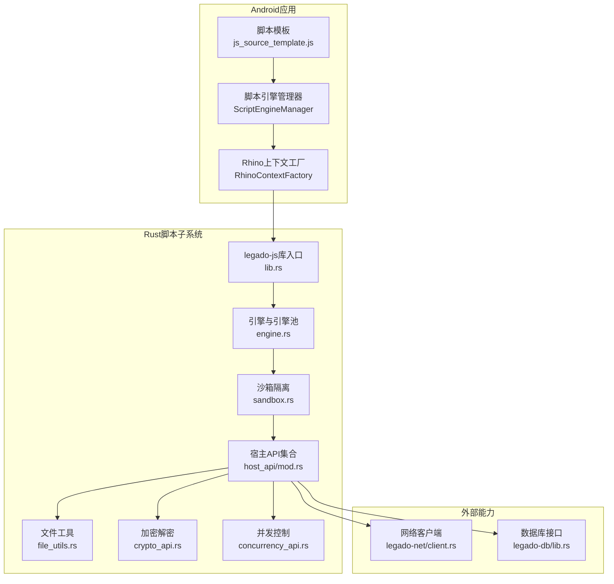
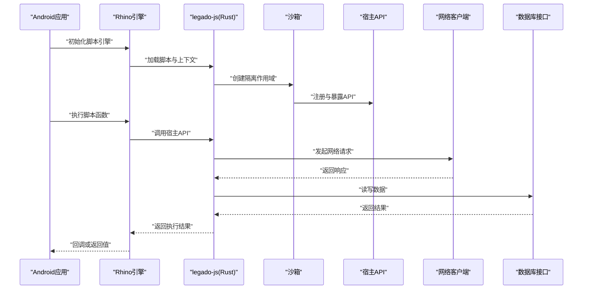
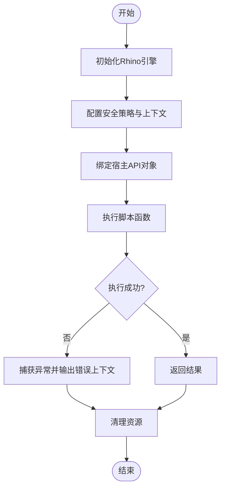
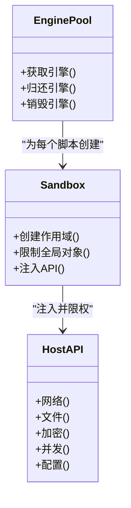
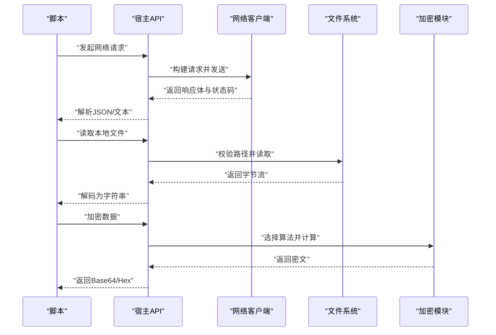
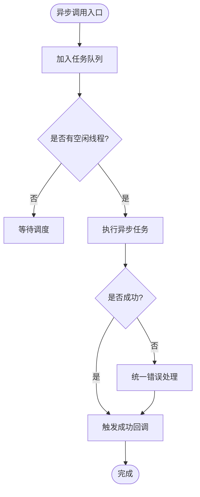
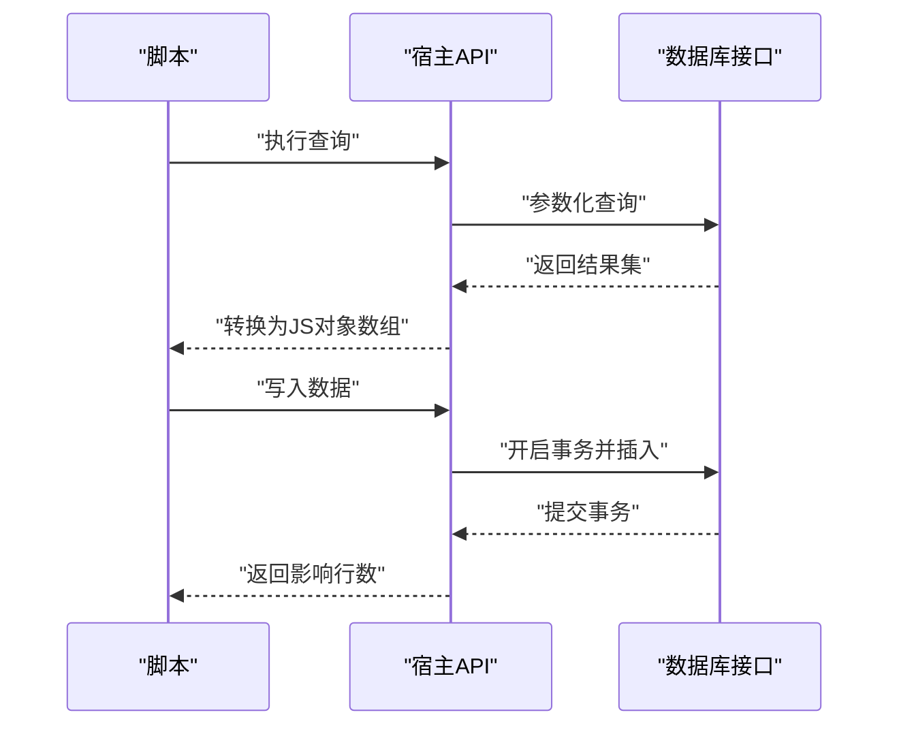
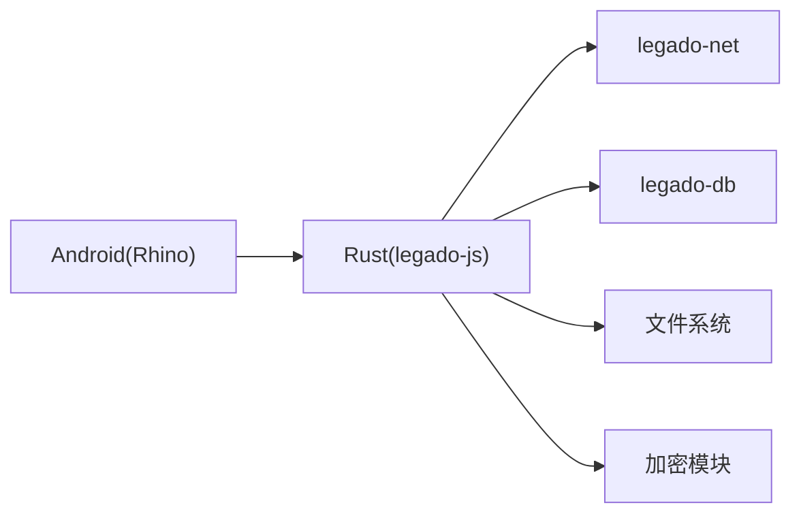

# JavaScript脚本扩展

<cite>
**本文引用的文件**   
- [modules/rhino/src/main/java/com/script/ScriptEngineManager.java](file://modules/rhino/src/main/java/com/script/ScriptEngineManager.java)
- [modules/rhino/src/main/java/com/script/RhinoContextFactory.java](file://modules/rhino/src/main/java/com/script/RhinoContextFactory.java)
- [app/src/main/assets/js_source_template.js](file://app/src/main/assets/js_source_template.js)
- [rust/legado-js/src/lib.rs](file://rust/legado-js/src/lib.rs)
- [rust/legado-js/src/engine.rs](file://rust/legado-js/src/engine.rs)
- [rust/legado-js/src/sandbox.rs](file://rust/legado-js/src/sandbox.rs)
- [rust/legado-js/src/host_api/mod.rs](file://rust/legado-js/src/host_api/mod.rs)
- [rust/legado-js/src/host_api/file_utils.rs](file://rust/legado-js/src/host_api/file_utils.rs)
- [rust/legado-js/src/host_api/crypto_api.rs](file://rust/legado-js/src/host_api/crypto_api.rs)
- [rust/legado-js/src/host_api/concurrency_api.rs](file://rust/legado-js/src/host_api/concurrency_api.rs)
- [rust/legado-net/src/client.rs](file://rust/legado-net/src/client.rs)
- [rust/legado-db/src/lib.rs](file://rust/legado-db/src/lib.rs)
</cite>

## 目录
1. [简介](#简介)
2. [项目结构](#项目结构)
3. [核心组件](#核心组件)
4. [架构总览](#架构总览)
5. [详细组件分析](#详细组件分析)
6. [依赖关系分析](#依赖关系分析)
7. [性能考量](#性能考量)
8. [故障排查指南](#故障排查指南)
9. [结论](#结论)
10. [附录：脚本开发指南与示例](#附录脚本开发指南与示例)

## 简介
本技术文档面向Legado的JavaScript脚本扩展系统，聚焦Rhino引擎集成方案、沙箱安全机制、宿主API设计与异步处理模式。文档同时覆盖网络请求、文件操作、加密解密、数据库访问等宿主能力，并提供脚本开发最佳实践、错误处理与性能优化建议，以及可运行的脚本示例与调试方法。

## 项目结构
Legado的脚本扩展由多模块协作实现：
- Android层（Java/Kotlin）通过Rhino提供JS执行环境，负责上下文工厂与脚本引擎管理。
- Rust层（legado-js）提供高性能的JS引擎池、沙箱隔离、宿主API桥接与并发控制。
- 网络与数据层（legado-net、legado-db）为脚本提供网络IO与持久化能力。
- 资源模板（js_source_template.js）为脚本开发者提供标准入口与注释说明。

图表来源
- [modules/rhino/src/main/java/com/script/ScriptEngineManager.java](file://modules/rhino/src/main/java/com/script/ScriptEngineManager.java)
- [modules/rhino/src/main/java/com/script/RhinoContextFactory.java](file://modules/rhino/src/main/java/com/script/RhinoContextFactory.java)
- [app/src/main/assets/js_source_template.js](file://app/src/main/assets/js_source_template.js)
- [rust/legado-js/src/lib.rs](file://rust/legado-js/src/lib.rs)
- [rust/legado-js/src/engine.rs](file://rust/legado-js/src/engine.rs)
- [rust/legado-js/src/sandbox.rs](file://rust/legado-js/src/sandbox.rs)
- [rust/legado-js/src/host_api/mod.rs](file://rust/legado-js/src/host_api/mod.rs)
- [rust/legado-js/src/host_api/file_utils.rs](file://rust/legado-js/src/host_api/file_utils.rs)
- [rust/legado-js/src/host_api/crypto_api.rs](file://rust/legado-js/src/host_api/crypto_api.rs)
- [rust/legado-js/src/host_api/concurrency_api.rs](file://rust/legado-js/src/host_api/concurrency_api.rs)
- [rust/legado-net/src/client.rs](file://rust/legado-net/src/client.rs)
- [rust/legado-db/src/lib.rs](file://rust/legado-db/src/lib.rs)

章节来源
- [modules/rhino/src/main/java/com/script/ScriptEngineManager.java](file://modules/rhino/src/main/java/com/script/ScriptEngineManager.java)
- [modules/rhino/src/main/java/com/script/RhinoContextFactory.java](file://modules/rhino/src/main/java/com/script/RhinoContextFactory.java)
- [app/src/main/assets/js_source_template.js](file://app/src/main/assets/js_source_template.js)
- [rust/legado-js/src/lib.rs](file://rust/legado-js/src/lib.rs)
- [rust/legado-js/src/engine.rs](file://rust/legado-js/src/engine.rs)
- [rust/legado-js/src/sandbox.rs](file://rust/legado-js/src/sandbox.rs)
- [rust/legado-js/src/host_api/mod.rs](file://rust/legado-js/src/host_api/mod.rs)
- [rust/legado-js/src/host_api/file_utils.rs](file://rust/legado-js/src/host_api/file_utils.rs)
- [rust/legado-js/src/host_api/crypto_api.rs](file://rust/legado-js/src/host_api/crypto_api.rs)
- [rust/legado-js/src/host_api/concurrency_api.rs](file://rust/legado-js/src/host_api/concurrency_api.rs)
- [rust/legado-net/src/client.rs](file://rust/legado-net/src/client.rs)
- [rust/legado-db/src/lib.rs](file://rust/legado-db/src/lib.rs)

## 核心组件
- Rhino引擎集成：通过Android层的脚本引擎管理器与上下文工厂创建并配置Rhino执行环境，确保线程安全与资源回收。
- Rust脚本子系统：legado-js提供引擎池、沙箱隔离、宿主API桥接与并发控制，提升性能与安全性。
- 宿主API集合：统一暴露网络、文件、加密、并发、配置等能力给脚本使用。
- 模板与入口：js_source_template.js定义脚本结构与约定，便于开发与调试。

章节来源
- [modules/rhino/src/main/java/com/script/ScriptEngineManager.java](file://modules/rhino/src/main/java/com/script/ScriptEngineManager.java)
- [modules/rhino/src/main/java/com/script/RhinoContextFactory.java](file://modules/rhino/src/main/java/com/script/RhinoContextFactory.java)
- [rust/legado-js/src/lib.rs](file://rust/legado-js/src/lib.rs)
- [rust/legado-js/src/engine.rs](file://rust/legado-js/src/engine.rs)
- [rust/legado-js/src/sandbox.rs](file://rust/legado-js/src/sandbox.rs)
- [rust/legado-js/src/host_api/mod.rs](file://rust/legado-js/src/host_api/mod.rs)
- [app/src/main/assets/js_source_template.js](file://app/src/main/assets/js_source_template.js)

## 架构总览
下图展示从Android到Rust再到外部能力的调用链，强调沙箱隔离与宿主API的统一入口。

图表来源
- [modules/rhino/src/main/java/com/script/ScriptEngineManager.java](file://modules/rhino/src/main/java/com/script/ScriptEngineManager.java)
- [modules/rhino/src/main/java/com/script/RhinoContextFactory.java](file://modules/rhino/src/main/java/com/script/RhinoContextFactory.java)
- [rust/legado-js/src/lib.rs](file://rust/legado-js/src/lib.rs)
- [rust/legado-js/src/engine.rs](file://rust/legado-js/src/engine.rs)
- [rust/legado-js/src/sandbox.rs](file://rust/legado-js/src/sandbox.rs)
- [rust/legado-js/src/host_api/mod.rs](file://rust/legado-js/src/host_api/mod.rs)
- [rust/legado-net/src/client.rs](file://rust/legado-net/src/client.rs)
- [rust/legado-db/src/lib.rs](file://rust/legado-db/src/lib.rs)

## 详细组件分析

### Rhino引擎集成与上下文工厂
- 职责：创建Rhino引擎实例、设置安全策略、绑定宿主对象、管理生命周期。
- 关键点：线程隔离、权限最小化、异常捕获与错误上下文输出。
- 典型流程：初始化→配置→绑定API→执行脚本→回收资源。

图表来源
- [modules/rhino/src/main/java/com/script/ScriptEngineManager.java](file://modules/rhino/src/main/java/com/script/ScriptEngineManager.java)
- [modules/rhino/src/main/java/com/script/RhinoContextFactory.java](file://modules/rhino/src/main/java/com/script/RhinoContextFactory.java)

章节来源
- [modules/rhino/src/main/java/com/script/ScriptEngineManager.java](file://modules/rhino/src/main/java/com/script/ScriptEngineManager.java)
- [modules/rhino/src/main/java/com/script/RhinoContextFactory.java](file://modules/rhino/src/main/java/com/script/RhinoContextFactory.java)

### Rust脚本子系统（引擎池与沙箱）
- 引擎池：复用JS引擎实例，降低启动开销，支持并发执行。
- 沙箱：限制全局对象访问，仅暴露受控API，防止越权操作。
- 桥接：将Rust实现的宿主API以稳定接口暴露给JS。

图表来源
- [rust/legado-js/src/engine.rs](file://rust/legado-js/src/engine.rs)
- [rust/legado-js/src/sandbox.rs](file://rust/legado-js/src/sandbox.rs)
- [rust/legado-js/src/host_api/mod.rs](file://rust/legado-js/src/host_api/mod.rs)

章节来源
- [rust/legado-js/src/engine.rs](file://rust/legado-js/src/engine.rs)
- [rust/legado-js/src/sandbox.rs](file://rust/legado-js/src/sandbox.rs)
- [rust/legado-js/src/host_api/mod.rs](file://rust/legado-js/src/host_api/mod.rs)

### 宿主API设计（网络、文件、加密、并发）
- 网络请求：封装HTTP客户端，支持超时、重试、代理、Cookie存储。
- 文件操作：受限的文件读写与路径校验，避免越界访问。
- 加密解密：提供常用算法接口，保证数据安全。
- 并发控制：协程/任务调度，避免阻塞主线程。

图表来源
- [rust/legado-js/src/host_api/mod.rs](file://rust/legado-js/src/host_api/mod.rs)
- [rust/legado-js/src/host_api/file_utils.rs](file://rust/legado-js/src/host_api/file_utils.rs)
- [rust/legado-js/src/host_api/crypto_api.rs](file://rust/legado-js/src/host_api/crypto_api.rs)
- [rust/legado-net/src/client.rs](file://rust/legado-net/src/client.rs)

章节来源
- [rust/legado-js/src/host_api/mod.rs](file://rust/legado-js/src/host_api/mod.rs)
- [rust/legado-js/src/host_api/file_utils.rs](file://rust/legado-js/src/host_api/file_utils.rs)
- [rust/legado-js/src/host_api/crypto_api.rs](file://rust/legado-js/src/host_api/crypto_api.rs)
- [rust/legado-js/src/host_api/concurrency_api.rs](file://rust/legado-js/src/host_api/concurrency_api.rs)
- [rust/legado-net/src/client.rs](file://rust/legado-net/src/client.rs)

### 异步处理模式
- 事件循环：基于Rust异步运行时，JS侧通过回调或Promise风格接口调用。
- 任务队列：限制并发度，避免资源争用。
- 错误传播：统一错误类型与消息格式，便于脚本侧处理。

图表来源
- [rust/legado-js/src/host_api/concurrency_api.rs](file://rust/legado-js/src/host_api/concurrency_api.rs)

章节来源
- [rust/legado-js/src/host_api/concurrency_api.rs](file://rust/legado-js/src/host_api/concurrency_api.rs)

### 数据库访问
- 通过legado-db提供的接口进行结构化数据存取，支持事务与迁移。
- 脚本侧仅暴露必要查询与写入方法，限制SQL注入风险。

图表来源
- [rust/legado-db/src/lib.rs](file://rust/legado-db/src/lib.rs)

章节来源
- [rust/legado-db/src/lib.rs](file://rust/legado-db/src/lib.rs)

## 依赖关系分析
- Android层依赖Rhino库，用于JS解释执行。
- Rust层通过FFI与Android交互，提供高性能API。
- 网络与数据库作为外部能力被宿主API封装后暴露给脚本。

图表来源
- [modules/rhino/src/main/java/com/script/ScriptEngineManager.java](file://modules/rhino/src/main/java/com/script/ScriptEngineManager.java)
- [rust/legado-js/src/lib.rs](file://rust/legado-js/src/lib.rs)
- [rust/legado-net/src/client.rs](file://rust/legado-net/src/client.rs)
- [rust/legado-db/src/lib.rs](file://rust/legado-db/src/lib.rs)

章节来源
- [modules/rhino/src/main/java/com/script/ScriptEngineManager.java](file://modules/rhino/src/main/java/com/script/ScriptEngineManager.java)
- [rust/legado-js/src/lib.rs](file://rust/legado-js/src/lib.rs)
- [rust/legado-net/src/client.rs](file://rust/legado-net/src/client.rs)
- [rust/legado-db/src/lib.rs](file://rust/legado-db/src/lib.rs)

## 性能考量
- 引擎池复用：减少JS引擎创建与销毁开销。
- 异步非阻塞：网络与IO操作采用异步模式，避免UI卡顿。
- 资源限制：限制内存与CPU使用，防止恶意脚本拖垮系统。
- 缓存策略：对频繁访问的数据进行缓存，降低重复计算。

[本节为通用指导，不直接分析具体文件]

## 故障排查指南
- 常见错误：网络超时、权限不足、路径非法、加密参数错误。
- 调试方法：启用日志输出、查看错误上下文、使用模板脚本对比差异。
- 恢复策略：重试机制、降级策略、回滚事务。

章节来源
- [rust/legado-js/src/host_api/mod.rs](file://rust/legado-js/src/host_api/mod.rs)
- [rust/legado-js/src/sandbox.rs](file://rust/legado-js/src/sandbox.rs)
- [rust/legado-js/src/engine.rs](file://rust/legado-js/src/engine.rs)

## 结论
Legado的JavaScript脚本扩展系统通过Rhino与Rust协同，实现了安全、高效、可扩展的脚本执行环境。宿主API统一封装了网络、文件、加密、并发与数据库能力，配合沙箱隔离与引擎池优化，为开发者提供了强大的扩展能力。遵循本文档的最佳实践与调试方法，可显著提升脚本质量与稳定性。

[本节为总结性内容，不直接分析具体文件]

## 附录：脚本开发指南与示例
- 脚本结构：参考js_source_template.js中的注释与约定，定义入口函数与依赖。
- API使用：优先使用宿主API提供的安全接口，避免直接访问底层对象。
- 错误处理：捕获异常并记录上下文，便于定位问题。
- 性能优化：使用异步调用、批量处理、缓存热点数据。
- 调试技巧：启用日志、分步执行、对比模板脚本。

章节来源
- [app/src/main/assets/js_source_template.js](file://app/src/main/assets/js_source_template.js)
- [rust/legado-js/src/host_api/mod.rs](file://rust/legado-js/src/host_api/mod.rs)
- [rust/legado-js/src/sandbox.rs](file://rust/legado-js/src/sandbox.rs)
- [rust/legado-js/src/engine.rs](file://rust/legado-js/src/engine.rs)