# JavaScript脚本扩展

<cite>
**本文引用的文件**   
- [modules/rhino/src/main/java/com/script/ScriptEngineManager.java](file://modules/rhino/src/main/java/com/script/ScriptEngineManager.java)
- [modules/rhino/src/main/java/com/script/RhinoContextFactory.java](file://modules/rhino/src/main/java/com/script/RhinoContextFactory.java)
- [app/src/main/assets/js_source_template.js](file://app/src/main/assets/js_source_template.js)
- [rust/legado-js/src/lib.rs](file://rust/legado-js/src/lib.rs)
- [rust/legado-js/src/engine.rs](file://rust/legado-js/src/engine.rs)
- [rust/legado-js/src/sandbox.rs](file://rust/legado-js/src/sandbox.rs)
- [rust/legado-js/src/host_api/mod.rs](file://rust/legado-js/src/host_api/mod.rs)
- [rust/legado-js/src/host_api/file_utils.rs](file://rust/legado-js/src/host_api/file_utils.rs)
- [rust/legado-js/src/host_api/crypto_api.rs](file://rust/legado-js/src/host_api/crypto_api.rs)
- [rust/legado-js/src/host_api/concurrency_api.rs](file://rust/legado-js/src/host_api/concurrency_api.rs)
- [rust/legado-js/src/host_api/platform.rs](file://rust/legado-js/src/host_api/platform.rs)
- [rust/legado-js/src/host_api/current_source.rs](file://rust/legado-js/src/host_api/current_source.rs)
- [rust/legado-js/src/host_api/quickjs_impl.rs](file://rust/legado-js/src/host_api/quickjs_impl.rs)
- [rust/legado-js/src/host_api/misc_api.rs](file://rust/legado-js/src/host_api/misc_api.rs)
- [rust/legado-js/src/host_api/encoding.rs](file://rust/legado-js/src/host_api/encoding.rs)
- [rust/legado-core/src/verification_channel.rs](file://rust/legado-core/src/verification_channel.rs)
- [rust/legado-net/src/client.rs](file://rust/legado-net/src/client.rs)
- [rust/legado-db/src/lib.rs](file://rust/legado-db/src/lib.rs)
- [rust/legado-parser/src/analyze_url.rs](file://rust/legado-parser/src/analyze_url.rs)
- [rust/legado-parser/src/analyze_rule.rs](file://rust/legado-parser/src/analyze_rule.rs)
- [rust/legado-ffi/src/api/search.rs](file://rust/legado-ffi/src/api/search.rs)
- [rust/legado-js/src/js_source/js_source_book.rs](file://rust/legado-js/src/js_source/js_source_book.rs)
</cite>

## 更新摘要
**所做更改**   
- 新增验证码交互API：getVerificationCode()和startBrowserAwait()方法
- 实现当前源上下文跟踪机制，支持线程局部变量存储书源标识
- 增强验证码处理流程，支持阻塞等待用户输入和浏览器验证降级
- 完善平台专属API设计，提供统一的验证码交互通道
- **新增实用工具API**：longToast长提示、webViewGetOverrideUrl WebView URL覆盖、showBrowser浏览器启动、base64DecodeToByteArray Base64解码、timeFormat时间格式化、toURL URL解析等实用功能
- **新增JavaScript模板渲染系统**：在analyze_url.rs中实现了统一的JavaScript模板渲染系统，支持复杂的JavaScript表达式在{{}}模板中使用，如encodeURIComponent(key)或page > 1 ? '/' + page : ''。新增build_search_url函数支持动态URL构建。

## 目录
1. [简介](#简介)
2. [项目结构](#项目结构)
3. [核心组件](#核心组件)
4. [架构总览](#架构总览)
5. [详细组件分析](#详细组件分析)
6. [依赖关系分析](#依赖关系分析)
7. [性能考量](#性能考量)
8. [故障排查指南](#故障排查指南)
9. [结论](#结论)
10. [附录：脚本开发指南与示例](#附录脚本开发指南与示例)

## 简介
本技术文档面向Legado的JavaScript脚本扩展系统，聚焦Rhino引擎集成方案、沙箱安全机制、宿主API设计与异步处理模式。文档同时覆盖网络请求、文件操作、加密解密、数据库访问等宿主能力，并提供脚本开发最佳实践、错误处理与性能优化建议，以及可运行的脚本示例与调试方法。

**最新更新**：系统现已支持验证码交互功能，新增`getVerificationCode()`和`startBrowserAwait()`方法，通过全局验证码通道实现阻塞等待用户输入，并支持当前源上下文跟踪，确保验证码请求与正确的书源关联。**同时新增了多个实用工具API**，包括长提示通知、WebView URL覆盖处理、浏览器启动、Base64解码、时间格式化和URL解析等功能，进一步增强了脚本开发的便利性。**最重要的是新增了JavaScript模板渲染系统**，支持在URL模板中使用复杂的JavaScript表达式，为动态URL构建提供了强大的灵活性。

## 项目结构
Legado的脚本扩展由多模块协作实现：
- Android层（Java/Kotlin）通过Rhino提供JS执行环境，负责上下文工厂与脚本引擎管理。
- Rust层（legado-js）提供高性能的JS引擎池、沙箱隔离、宿主API桥接与并发控制。
- 验证码通道（legado-core）提供跨线程的验证码交互机制，支持UI层和用户输入处理。
- 网络与数据层（legado-net、legado-db）为脚本提供网络IO与持久化能力。
- 资源模板（js_source_template.js）为脚本开发者提供标准入口与注释说明。
- **新增模板渲染系统（legado-parser）**：提供统一的JavaScript模板渲染引擎，支持复杂表达式求值。

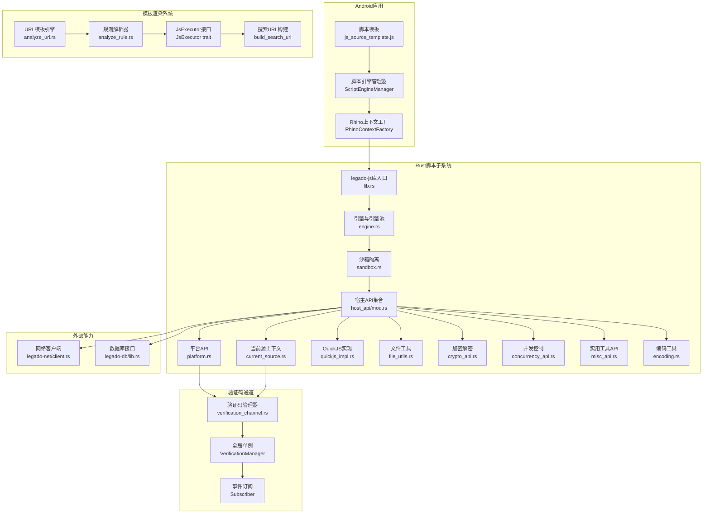

图表来源
- [modules/rhino/src/main/java/com/script/ScriptEngineManager.java](file://modules/rhino/src/main/java/com/script/ScriptEngineManager.java)
- [modules/rhino/src/main/java/com/script/RhinoContextFactory.java](file://modules/rhino/src/main/java/com/script/RhinoContextFactory.java)
- [app/src/main/assets/js_source_template.js](file://app/src/main/assets/js_source_template.js)
- [rust/legado-js/src/lib.rs](file://rust/legado-js/src/lib.rs)
- [rust/legado-js/src/engine.rs](file://rust/legado-js/src/engine.rs)
- [rust/legado-js/src/sandbox.rs](file://rust/legado-js/src/sandbox.rs)
- [rust/legado-js/src/host_api/mod.rs](file://rust/legado-js/src/host_api/mod.rs)
- [rust/legado-js/src/host_api/platform.rs](file://rust/legado-js/src/host_api/platform.rs)
- [rust/legado-js/src/host_api/current_source.rs](file://rust/legado-js/src/host_api/current_source.rs)
- [rust/legado-js/src/host_api/quickjs_impl.rs](file://rust/legado-js/src/host_api/quickjs_impl.rs)
- [rust/legado-js/src/host_api/misc_api.rs](file://rust/legado-js/src/host_api/misc_api.rs)
- [rust/legado-js/src/host_api/encoding.rs](file://rust/legado-js/src/host_api/encoding.rs)
- [rust/legado-parser/src/analyze_url.rs](file://rust/legado-parser/src/analyze_url.rs)
- [rust/legado-parser/src/analyze_rule.rs](file://rust/legado-parser/src/analyze_rule.rs)
- [rust/legado-core/src/verification_channel.rs](file://rust/legado-core/src/verification_channel.rs)
- [rust/legado-net/src/client.rs](file://rust/legado-net/src/client.rs)
- [rust/legado-db/src/lib.rs](file://rust/legado-db/src/lib.rs)

章节来源
- [modules/rhino/src/main/java/com/script/ScriptEngineManager.java](file://modules/rhino/src/main/java/com/script/ScriptEngineManager.java)
- [modules/rhino/src/main/java/com/script/RhinoContextFactory.java](file://modules/rhino/src/main/java/com/script/RhinoContextFactory.java)
- [app/src/main/assets/js_source_template.js](file://app/src/main/assets/js_source_template.js)
- [rust/legado-js/src/lib.rs](file://rust/legado-js/src/lib.rs)
- [rust/legado-js/src/engine.rs](file://rust/legado-js/src/engine.rs)
- [rust/legado-js/src/sandbox.rs](file://rust/legado-js/src/sandbox.rs)
- [rust/legado-js/src/host_api/mod.rs](file://rust/legado-js/src/host_api/mod.rs)
- [rust/legado-js/src/host_api/platform.rs](file://rust/legado-js/src/host_api/platform.rs)
- [rust/legado-js/src/host_api/current_source.rs](file://rust/legado-js/src/host_api/current_source.rs)
- [rust/legado-js/src/host_api/quickjs_impl.rs](file://rust/legado-js/src/host_api/quickjs_impl.rs)
- [rust/legado-js/src/host_api/misc_api.rs](file://rust/legado-js/src/host_api/misc_api.rs)
- [rust/legado-js/src/host_api/encoding.rs](file://rust/legado-js/src/host_api/encoding.rs)
- [rust/legado-core/src/verification_channel.rs](file://rust/legado-core/src/verification_channel.rs)
- [rust/legado-net/src/client.rs](file://rust/legado-net/src/client.rs)
- [rust/legado-db/src/lib.rs](file://rust/legado-db/src/lib.rs)

## 核心组件
- Rhino引擎集成：通过Android层的脚本引擎管理器与上下文工厂创建并配置Rhino执行环境，确保线程安全与资源回收。
- Rust脚本子系统：legado-js提供引擎池、沙箱隔离、宿主API桥接与并发控制，提升性能与安全性。
- 验证码交互通道：legado-core提供跨线程的验证码请求-响应机制，支持阻塞等待和用户输入处理。
- 当前源上下文跟踪：thread_local存储当前执行的书源标识，确保验证码请求与正确书源关联。
- 宿主API集合：统一暴露网络、文件、加密、并发、平台、实用工具和编码能力给脚本使用。
- **模板渲染系统**：legado-parser提供统一的JavaScript模板渲染引擎，支持复杂表达式求值和动态URL构建。
- 模板与入口：js_source_template.js定义脚本结构与约定，便于开发与调试。

章节来源
- [modules/rhino/src/main/java/com/script/ScriptEngineManager.java](file://modules/rhino/src/main/java/com/script/ScriptEngineManager.java)
- [modules/rhino/src/main/java/com/script/RhinoContextFactory.java](file://modules/rhino/src/main/java/com/script/RhinoContextFactory.java)
- [rust/legado-js/src/lib.rs](file://rust/legado-js/src/lib.rs)
- [rust/legado-js/src/engine.rs](file://rust/legado-js/src/engine.rs)
- [rust/legado-js/src/sandbox.rs](file://rust/legado-js/src/sandbox.rs)
- [rust/legado-js/src/host_api/mod.rs](file://rust/legado-js/src/host_api/mod.rs)
- [rust/legado-core/src/verification_channel.rs](file://rust/legado-core/src/verification_channel.rs)
- [rust/legado-js/src/host_api/current_source.rs](file://rust/legado-js/src/host_api/current_source.rs)
- [rust/legado-parser/src/analyze_url.rs](file://rust/legado-parser/src/analyze_url.rs)
- [app/src/main/assets/js_source_template.js](file://app/src/main/assets/js_source_template.js)

## 架构总览
下图展示从Android到Rust再到验证码通道的完整调用链，强调沙箱隔离、当前源上下文跟踪、验证码交互流程和模板渲染系统的集成。

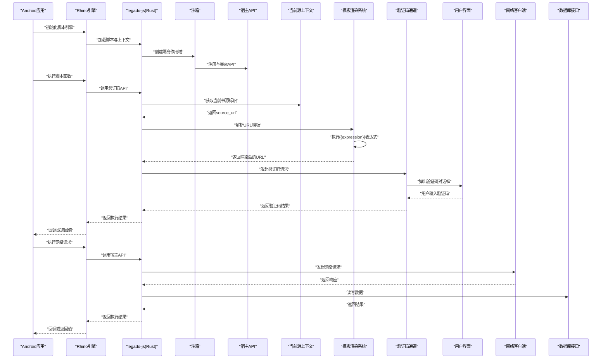

图表来源
- [modules/rhino/src/main/java/com/script/ScriptEngineManager.java](file://modules/rhino/src/main/java/com/script/ScriptEngineManager.java)
- [modules/rhino/src/main/java/com/script/RhinoContextFactory.java](file://modules/rhino/src/main/java/com/script/RhinoContextFactory.java)
- [rust/legado-js/src/lib.rs](file://rust/legado-js/src/lib.rs)
- [rust/legado-js/src/engine.rs](file://rust/legado-js/src/engine.rs)
- [rust/legado-js/src/sandbox.rs](file://rust/legado-js/src/sandbox.rs)
- [rust/legado-js/src/host_api/mod.rs](file://rust/legado-js/src/host_api/mod.rs)
- [rust/legado-js/src/host_api/current_source.rs](file://rust/legado-js/src/host_api/current_source.rs)
- [rust/legado-parser/src/analyze_url.rs](file://rust/legado-parser/src/analyze_url.rs)
- [rust/legado-core/src/verification_channel.rs](file://rust/legado-core/src/verification_channel.rs)
- [rust/legado-net/src/client.rs](file://rust/legado-net/src/client.rs)
- [rust/legado-db/src/lib.rs](file://rust/legado-db/src/lib.rs)

## 详细组件分析

### Rhino引擎集成与上下文工厂
- 职责：创建Rhino引擎实例、设置安全策略、绑定宿主对象、管理生命周期。
- 关键点：线程隔离、权限最小化、异常捕获与错误上下文输出。
- 典型流程：初始化→配置→绑定API→执行脚本→回收资源。

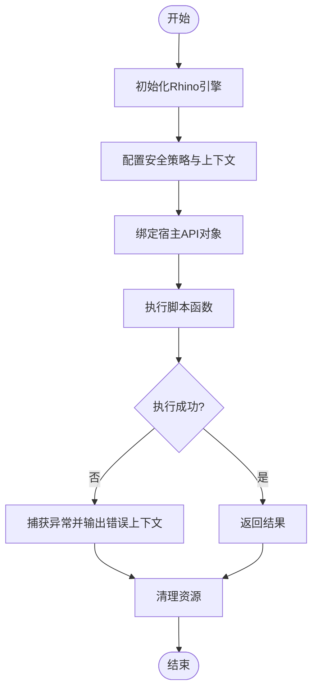

图表来源
- [modules/rhino/src/main/java/com/script/ScriptEngineManager.java](file://modules/rhino/src/main/java/com/script/ScriptEngineManager.java)
- [modules/rhino/src/main/java/com/script/RhinoContextFactory.java](file://modules/rhino/src/main/java/com/script/RhinoContextFactory.java)

章节来源
- [modules/rhino/src/main/java/com/script/ScriptEngineManager.java](file://modules/rhino/src/main/java/com/script/ScriptEngineManager.java)
- [modules/rhino/src/main/java/com/script/RhinoContextFactory.java](file://modules/rhino/src/main/java/com/script/RhinoContextFactory.java)

### Rust脚本子系统（引擎池与沙箱）
- 引擎池：复用JS引擎实例，降低启动开销，支持并发执行。
- 沙箱：限制全局对象访问，仅暴露受控API，防止越权操作。
- 桥接：将Rust实现的宿主API以稳定接口暴露给JS。

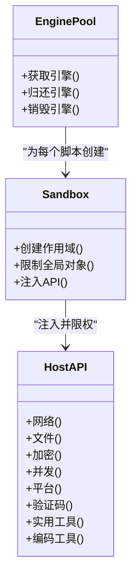

图表来源
- [rust/legado-js/src/engine.rs](file://rust/legado-js/src/engine.rs)
- [rust/legado-js/src/sandbox.rs](file://rust/legado-js/src/sandbox.rs)
- [rust/legado-js/src/host_api/mod.rs](file://rust/legado-js/src/host_api/mod.rs)

章节来源
- [rust/legado-js/src/engine.rs](file://rust/legado-js/src/engine.rs)
- [rust/legado-js/src/sandbox.rs](file://rust/legado-js/src/sandbox.rs)
- [rust/legado-js/src/host_api/mod.rs](file://rust/legado-js/src/host_api/mod.rs)

### 验证码交互通道
**新增功能**：系统实现了完整的验证码交互机制，支持阻塞等待用户输入和浏览器验证降级。

- **验证码请求**：`getVerificationCode(imageUrl)`方法阻塞当前JS工作线程，等待用户输入验证码
- **浏览器验证**：`startBrowserAwait(url, title)`方法在桌面端降级为图片验证码流程
- **当前源跟踪**：通过`current_source_tag()`获取当前执行的书源标识，确保验证码请求正确关联
- **超时处理**：默认5分钟超时，支持自定义超时时间
- **事件订阅**：UI层可订阅验证码请求事件，显示对话框并收集用户输入

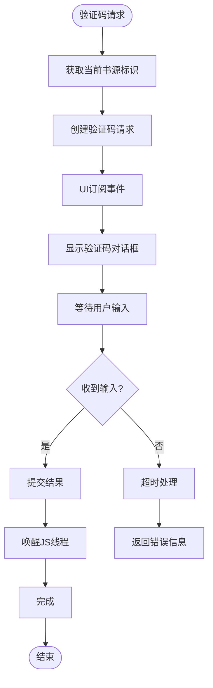

图表来源
- [rust/legado-js/src/host_api/platform.rs](file://rust/legado-js/src/host_api/platform.rs)
- [rust/legado-core/src/verification_channel.rs](file://rust/legado-core/src/verification_channel.rs)
- [rust/legado-js/src/host_api/current_source.rs](file://rust/legado-js/src/host_api/current_source.rs)

章节来源
- [rust/legado-js/src/host_api/platform.rs](file://rust/legado-js/src/host_api/platform.rs)
- [rust/legado-core/src/verification_channel.rs](file://rust/legado-core/src/verification_channel.rs)
- [rust/legado-js/src/host_api/current_source.rs](file://rust/legado-js/src/host_api/current_source.rs)

### 当前源上下文跟踪机制
**新增功能**：实现了基于thread_local的当前书源上下文跟踪，确保验证码请求与正确的书源关联。

- **线程局部存储**：使用`thread_local!`宏存储当前执行线程的书源标识
- **自动管理**：在JS执行前设置书源标识，执行后自动清理避免串扰
- **嵌套支持**：支持嵌套调用场景，保证外层绑定不被破坏
- **线程隔离**：不同线程间的书源标识完全隔离，避免并发问题

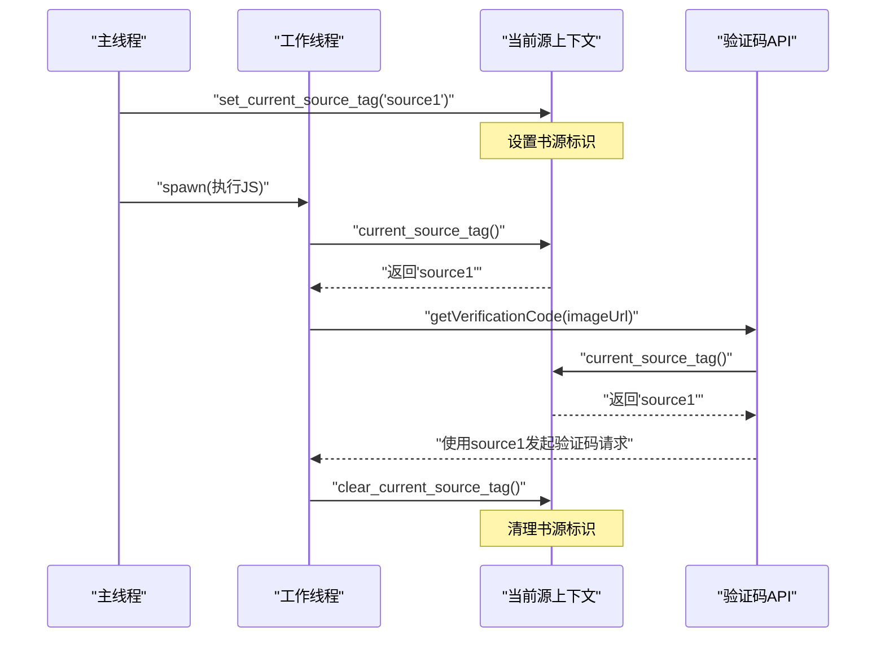

图表来源
- [rust/legado-js/src/host_api/current_source.rs](file://rust/legado-js/src/host_api/current_source.rs)
- [rust/legado-js/src/host_api/platform.rs](file://rust/legado-js/src/host_api/platform.rs)

章节来源
- [rust/legado-js/src/host_api/current_source.rs](file://rust/legado-js/src/host_api/current_source.rs)
- [rust/legado-js/src/host_api/platform.rs](file://rust/legado-js/src/host_api/platform.rs)

### JavaScript模板渲染系统
**新增功能**：实现了统一的JavaScript模板渲染系统，支持在URL模板中使用复杂的JavaScript表达式。

- **模板语法**：支持`{{expression}}`语法，可在其中执行任意JavaScript代码
- **变量注入**：自动将模板变量注入到JavaScript执行环境中，数字类型保持数值语义
- **表达式求值**：支持条件表达式、字符串操作、数学运算等复杂逻辑
- **错误处理**：表达式求值失败时返回空字符串，避免模板渲染中断
- **内置函数**：提供encodeURIComponent等常用函数用于URL编码
- **分页支持**：特殊处理page变量，支持`page > 1 ? '/' + page : ''`等条件逻辑

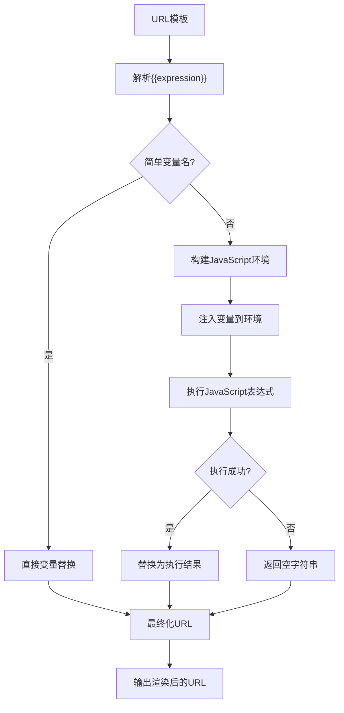

图表来源
- [rust/legado-parser/src/analyze_url.rs:949-992](file://rust/legado-parser/src/analyze_url.rs#L949-L992)
- [rust/legado-parser/src/analyze_url.rs:336-362](file://rust/legado-parser/src/analyze_url.rs#L336-L362)

章节来源
- [rust/legado-parser/src/analyze_url.rs:949-992](file://rust/legado-parser/src/analyze_url.rs#L949-L992)
- [rust/legado-parser/src/analyze_url.rs:336-362](file://rust/legado-parser/src/analyze_url.rs#L336-L362)

### build_search_url函数
**新增功能**：提供了统一的搜索URL构建函数，简化了动态URL生成过程。

- **统一接口**：封装了模板渲染、变量替换、分页处理的完整流程
- **参数支持**：支持关键词、页码、基础URL等多种参数组合
- **错误处理**：完善的错误处理和异常捕获机制
- **测试覆盖**：包含完整的单元测试验证各种边界情况

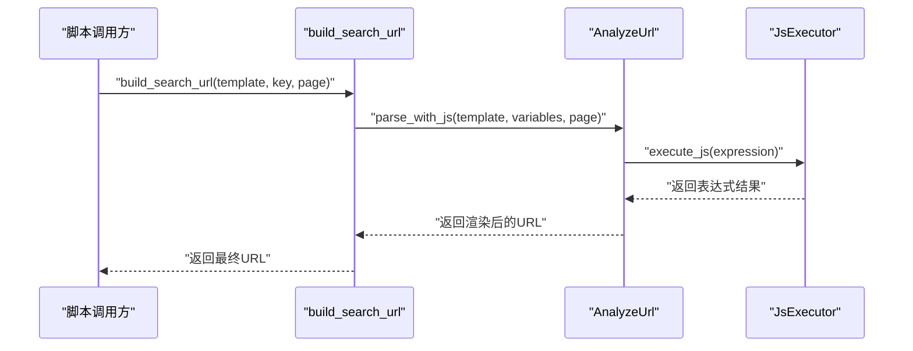

图表来源
- [rust/legado-ffi/src/api/search.rs:768-769](file://rust/legado-ffi/src/api/search.rs#L768-L769)
- [rust/legado-js/src/js_source/js_source_book.rs:79](file://rust/legado-js/src/js_source/js_source_book.rs#L79)

章节来源
- [rust/legado-ffi/src/api/search.rs:768-769](file://rust/legado-ffi/src/api/search.rs#L768-L769)
- [rust/legado-js/src/js_source/js_source_book.rs:79](file://rust/legado-js/src/js_source/js_source_book.rs#L79)

### 宿主API设计（网络、文件、加密、并发、平台、实用工具）
- 网络请求：封装HTTP客户端，支持超时、重试、代理、Cookie存储。
- 文件操作：受限的文件读写与路径校验，避免越界访问。
- 加密解密：提供常用算法接口，保证数据安全。
- 并发控制：协程/任务调度，避免阻塞主线程。
- 平台API：WebView、Toast、URL打开等Android特定功能。
- 验证码API：图片验证码和浏览器验证交互。
- **实用工具API**：长提示通知、WebView URL覆盖、浏览器启动、Base64解码、时间格式化、URL解析等便捷功能。

**新增实用工具API详解**：

- **longToast(msg)**：显示长时间提示信息，替代日志输出，便于用户反馈
- **webViewGetOverrideUrl(html, url, js, overrideUrlRegex, ...)**：处理WebView中的URL覆盖逻辑，支持正则匹配和自定义处理
- **showBrowser(url, html?, preloadJs?, config?)**：启动内置浏览器或外部浏览器，支持HTML内容和预加载脚本
- **base64DecodeToByteArray(str, flags?)**：Base64字符串解码为字节数组，支持多种标志位选项
- **timeFormat(ts)**：时间戳格式化为指定格式，遵循应用日期格式规范
- **toURL(url, baseUrl?)**：全面的URL解析功能，对齐Kotlin的JsURL实现，支持相对URL解析

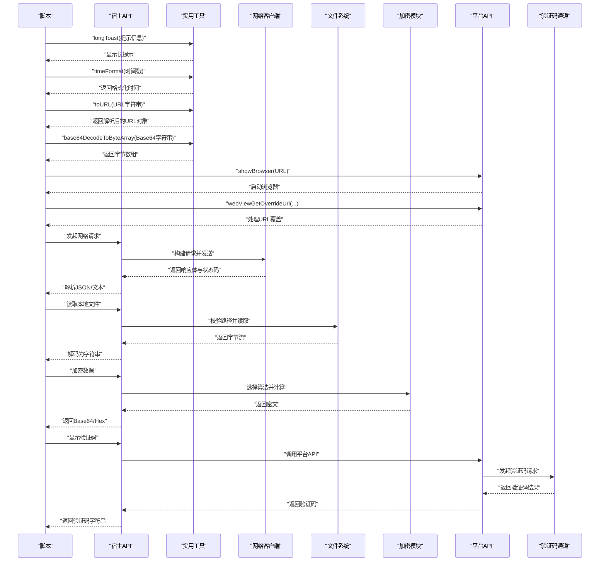

图表来源
- [rust/legado-js/src/host_api/mod.rs](file://rust/legado-js/src/host_api/mod.rs)
- [rust/legado-js/src/host_api/file_utils.rs](file://rust/legado-js/src/host_api/file_utils.rs)
- [rust/legado-js/src/host_api/crypto_api.rs](file://rust/legado-js/src/host_api/crypto_api.rs)
- [rust/legado-js/src/host_api/platform.rs](file://rust/legado-js/src/host_api/platform.rs)
- [rust/legado-js/src/host_api/misc_api.rs](file://rust/legado-js/src/host_api/misc_api.rs)
- [rust/legado-js/src/host_api/encoding.rs](file://rust/legado-js/src/host_api/encoding.rs)
- [rust/legado-core/src/verification_channel.rs](file://rust/legado-core/src/verification_channel.rs)
- [rust/legado-net/src/client.rs](file://rust/legado-net/src/client.rs)

章节来源
- [rust/legado-js/src/host_api/mod.rs](file://rust/legado-js/src/host_api/mod.rs)
- [rust/legado-js/src/host_api/file_utils.rs](file://rust/legado-js/src/host_api/file_utils.rs)
- [rust/legado-js/src/host_api/crypto_api.rs](file://rust/legado-js/src/host_api/crypto_api.rs)
- [rust/legado-js/src/host_api/concurrency_api.rs](file://rust/legado-js/src/host_api/concurrency_api.rs)
- [rust/legado-js/src/host_api/platform.rs](file://rust/legado-js/src/host_api/platform.rs)
- [rust/legado-js/src/host_api/misc_api.rs](file://rust/legado-js/src/host_api/misc_api.rs)
- [rust/legado-js/src/host_api/encoding.rs](file://rust/legado-js/src/host_api/encoding.rs)
- [rust/legado-core/src/verification_channel.rs](file://rust/legado-core/src/verification_channel.rs)
- [rust/legado-net/src/client.rs](file://rust/legado-net/src/client.rs)

### 异步处理模式
- 事件循环：基于Rust异步运行时，JS侧通过回调或Promise风格接口调用。
- 任务队列：限制并发度，避免资源争用。
- 错误传播：统一错误类型与消息格式，便于脚本侧处理。
- 验证码阻塞：验证码请求采用同步阻塞模式，确保用户输入完整性。

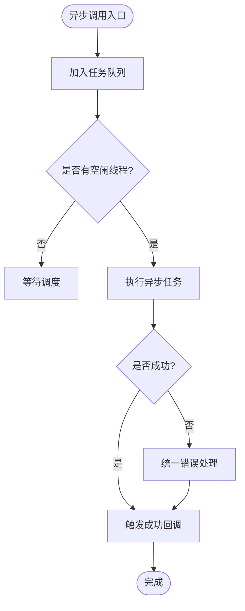

图表来源
- [rust/legado-js/src/host_api/concurrency_api.rs](file://rust/legado-js/src/host_api/concurrency_api.rs)

章节来源
- [rust/legado-js/src/host_api/concurrency_api.rs](file://rust/legado-js/src/host_api/concurrency_api.rs)

### 数据库访问
- 通过legado-db提供的接口进行结构化数据存取，支持事务与迁移。
- 脚本侧仅暴露必要查询与写入方法，限制SQL注入风险。

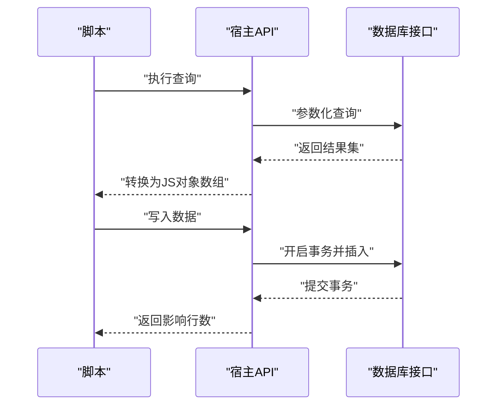

图表来源
- [rust/legado-db/src/lib.rs](file://rust/legado-db/src/lib.rs)

章节来源
- [rust/legado-db/src/lib.rs](file://rust/legado-db/src/lib.rs)

### QuickJS实现与API注册
**新增功能**：在QuickJS实现中注册了新的验证码API和实用工具API，提供双命名空间支持和完整的工具函数集。

- **API注册**：通过`mount_dual`函数注册验证码和实用工具相关API
- **参数处理**：支持可选参数和默认值处理
- **错误处理**：统一的错误包装和异常处理
- **测试覆盖**：完整的单元测试验证API功能
- **工具函数**：包含时间格式化、URL解析、Base64解码等实用功能

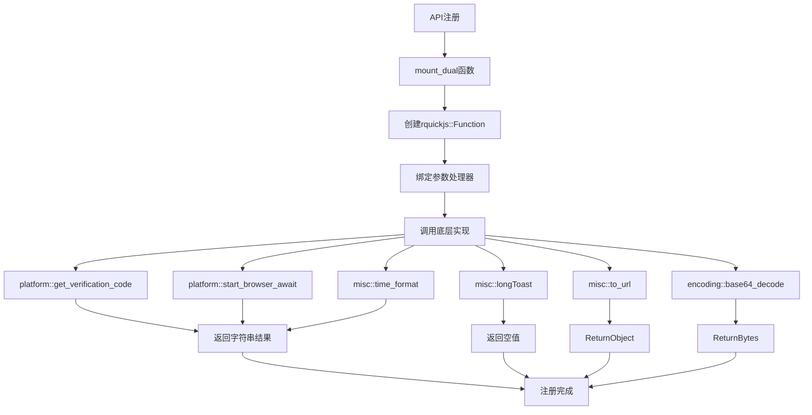

图表来源
- [rust/legado-js/src/host_api/quickjs_impl.rs](file://rust/legado-js/src/host_api/quickjs_impl.rs)
- [rust/legado-js/src/host_api/platform.rs](file://rust/legado-js/src/host_api/platform.rs)
- [rust/legado-js/src/host_api/misc_api.rs](file://rust/legado-js/src/host_api/misc_api.rs)
- [rust/legado-js/src/host_api/encoding.rs](file://rust/legado-js/src/host_api/encoding.rs)

章节来源
- [rust/legado-js/src/host_api/quickjs_impl.rs](file://rust/legado-js/src/host_api/quickjs_impl.rs)
- [rust/legado-js/src/host_api/platform.rs](file://rust/legado-js/src/host_api/platform.rs)
- [rust/legado-js/src/host_api/misc_api.rs](file://rust/legado-js/src/host_api/misc_api.rs)
- [rust/legado-js/src/host_api/encoding.rs](file://rust/legado-js/src/host_api/encoding.rs)

## 依赖关系分析
- Android层依赖Rhino库，用于JS解释执行。
- Rust层通过FFI与Android交互，提供高性能API。
- 验证码通道作为核心依赖，提供跨线程通信机制。
- 网络与数据库作为外部能力被宿主API封装后暴露给脚本。
- 实用工具模块提供独立的工具函数，不依赖其他核心模块。
- **模板渲染系统**：作为独立模块被宿主API调用，提供URL模板渲染能力。

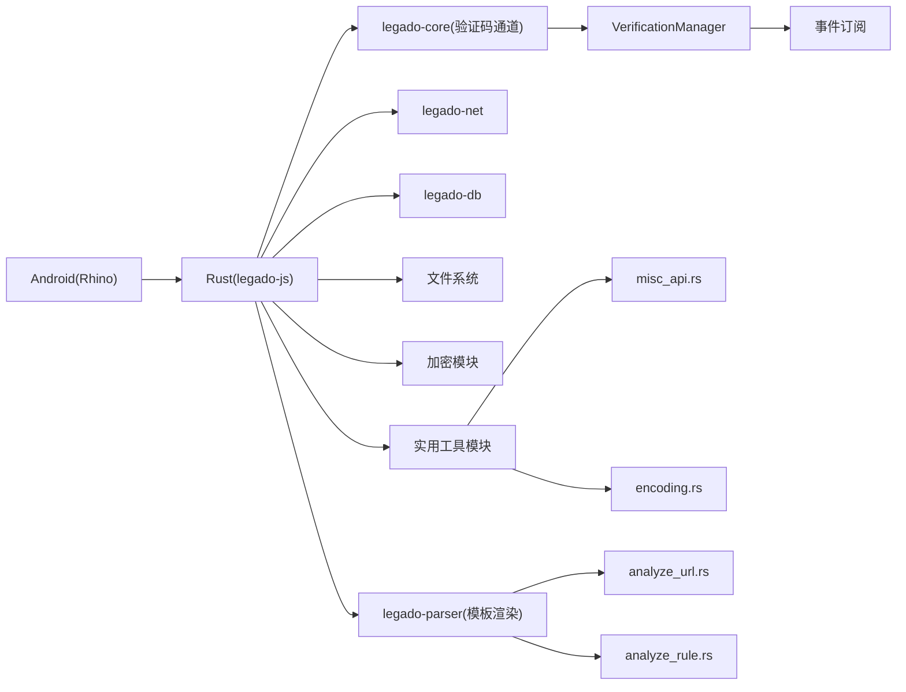

图表来源
- [modules/rhino/src/main/java/com/script/ScriptEngineManager.java](file://modules/rhino/src/main/java/com/script/ScriptEngineManager.java)
- [rust/legado-js/src/lib.rs](file://rust/legado-js/src/lib.rs)
- [rust/legado-core/src/verification_channel.rs](file://rust/legado-core/src/verification_channel.rs)
- [rust/legado-net/src/client.rs](file://rust/legado-net/src/client.rs)
- [rust/legado-db/src/lib.rs](file://rust/legado-db/src/lib.rs)
- [rust/legado-js/src/host_api/misc_api.rs](file://rust/legado-js/src/host_api/misc_api.rs)
- [rust/legado-js/src/host_api/encoding.rs](file://rust/legado-js/src/host_api/encoding.rs)
- [rust/legado-parser/src/analyze_url.rs](file://rust/legado-parser/src/analyze_url.rs)
- [rust/legado-parser/src/analyze_rule.rs](file://rust/legado-parser/src/analyze_rule.rs)

章节来源
- [modules/rhino/src/main/java/com/script/ScriptEngineManager.java](file://modules/rhino/src/main/java/com/script/ScriptEngineManager.java)
- [rust/legado-js/src/lib.rs](file://rust/legado-js/src/lib.rs)
- [rust/legado-core/src/verification_channel.rs](file://rust/legado-core/src/verification_channel.rs)
- [rust/legado-net/src/client.rs](file://rust/legado-net/src/client.rs)
- [rust/legado-db/src/lib.rs](file://rust/legado-db/src/lib.rs)
- [rust/legado-js/src/host_api/misc_api.rs](file://rust/legado-js/src/host_api/misc_api.rs)
- [rust/legado-js/src/host_api/encoding.rs](file://rust/legado-js/src/host_api/encoding.rs)
- [rust/legado-parser/src/analyze_url.rs](file://rust/legado-parser/src/analyze_url.rs)
- [rust/legado-parser/src/analyze_rule.rs](file://rust/legado-parser/src/analyze_rule.rs)

## 性能考量
- 引擎池复用：减少JS引擎创建与销毁开销。
- 异步非阻塞：网络与IO操作采用异步模式，避免UI卡顿。
- 资源限制：限制内存与CPU使用，防止恶意脚本拖垮系统。
- 缓存策略：对频繁访问的数据进行缓存，降低重复计算。
- 验证码优化：使用condvar而非busy-wait，提高等待效率。
- 线程隔离：thread_local存储避免锁竞争，提升并发性能。
- 航班去重：同书源并发验证码请求共享结果，减少重复UI交互。
- **工具函数优化**：实用工具函数采用零拷贝和高效算法，避免不必要的内存分配。
- **模板渲染优化**：简单变量直接替换，复杂表达式才调用JS引擎，减少不必要的执行开销。

## 故障排查指南
- 常见错误：网络超时、权限不足、路径非法、加密参数错误、验证码超时。
- 调试方法：启用日志输出、查看错误上下文、使用模板脚本对比差异。
- 恢复策略：重试机制、降级策略、回滚事务。
- 验证码问题：检查验证码图片URL有效性、UI对话框是否正常显示、用户输入是否正确提交。
- 上下文问题：确认当前书源标识是否正确设置、线程隔离是否正常工作。
- 超时问题：调整验证码超时时间、检查网络连接状态。
- **工具函数问题**：检查参数格式是否正确、Base64编码是否有效、URL格式是否符合规范。
- **模板渲染问题**：检查JavaScript表达式语法是否正确、变量注入是否成功、错误处理是否合理。

章节来源
- [rust/legado-js/src/host_api/platform.rs](file://rust/legado-js/src/host_api/platform.rs)
- [rust/legado-core/src/verification_channel.rs](file://rust/legado-core/src/verification_channel.rs)
- [rust/legado-js/src/host_api/current_source.rs](file://rust/legado-js/src/host_api/current_source.rs)
- [rust/legado-js/src/engine.rs](file://rust/legado-js/src/engine.rs)
- [rust/legado-js/src/host_api/misc_api.rs](file://rust/legado-js/src/host_api/misc_api.rs)
- [rust/legado-js/src/host_api/encoding.rs](file://rust/legado-js/src/host_api/encoding.rs)
- [rust/legado-parser/src/analyze_url.rs](file://rust/legado-parser/src/analyze_url.rs)

## 结论
Legado的JavaScript脚本扩展系统通过Rhino与Rust协同，实现了安全、高效、可扩展的脚本执行环境。宿主API统一封装了网络、文件、加密、并发、平台、验证码和实用工具能力，配合沙箱隔离、引擎池优化和当前源上下文跟踪，为开发者提供了强大的扩展能力。**最新的验证码交互功能、当前源上下文跟踪、新增的实用工具API和JavaScript模板渲染系统进一步提升了系统的健壮性和用户体验**。模板渲染系统特别为动态URL构建提供了强大的灵活性，支持复杂的JavaScript表达式求值，使脚本能够根据运行时条件生成精确的请求URL。遵循本文档的最佳实践与调试方法，可显著提升脚本质量与稳定性。

## 附录：脚本开发指南与示例
- 脚本结构：参考js_source_template.js中的注释与约定，定义入口函数与依赖。
- API使用：优先使用宿主API提供的安全接口，避免直接访问底层对象。
- 验证码处理：使用`java.getVerificationCode(imageUrl)`处理图片验证码，使用`java.startBrowserAwait(url, title)`处理浏览器验证。
- **实用工具使用**：使用`longToast()`显示用户反馈，使用`timeFormat()`格式化时间，使用`toURL()`解析URL，使用`base64DecodeToByteArray()`处理Base64数据。
- **模板渲染使用**：在URL模板中使用`{{expression}}`语法嵌入JavaScript表达式，如`{{encodeURIComponent(key)}}`或`{{page > 1 ? '/' + page : ''}}`。
- 错误处理：捕获异常并记录上下文，便于定位问题。
- 性能优化：使用异步调用、批量处理、缓存热点数据。
- 调试技巧：启用日志、分步执行、对比模板脚本。
- 最佳实践：编写健壮的验证码处理逻辑，包含完整的错误处理和超时处理；合理使用实用工具函数提升代码可读性和维护性；充分利用模板渲染系统简化动态URL构建逻辑。

章节来源
- [app/src/main/assets/js_source_template.js](file://app/src/main/assets/js_source_template.js)
- [rust/legado-js/src/host_api/mod.rs](file://rust/legado-js/src/host_api/mod.rs)
- [rust/legado-js/src/host_api/platform.rs](file://rust/legado-js/src/host_api/platform.rs)
- [rust/legado-js/src/host_api/current_source.rs](file://rust/legado-js/src/host_api/current_source.rs)
- [rust/legado-js/src/host_api/misc_api.rs](file://rust/legado-js/src/host_api/misc_api.rs)
- [rust/legado-js/src/host_api/encoding.rs](file://rust/legado-js/src/host_api/encoding.rs)
- [rust/legado-core/src/verification_channel.rs](file://rust/legado-core/src/verification_channel.rs)
- [rust/legado-parser/src/analyze_url.rs](file://rust/legado-parser/src/analyze_url.rs)