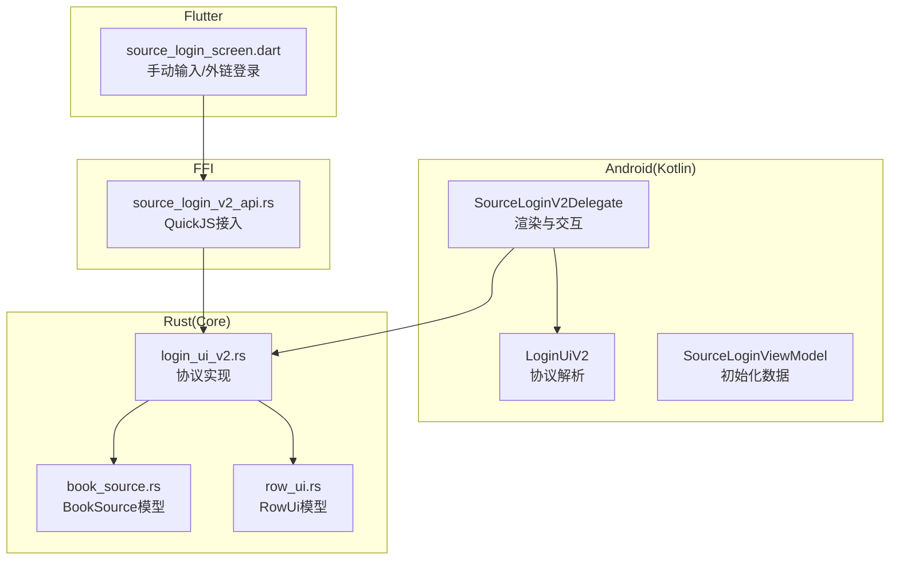
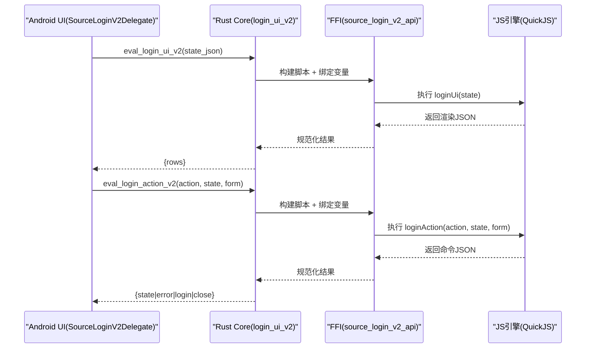
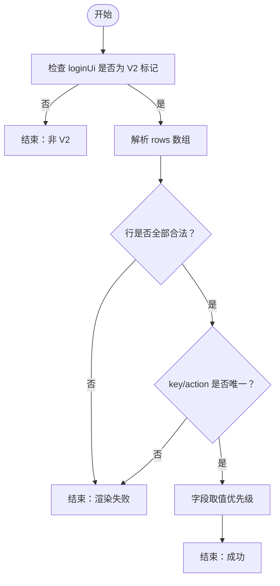
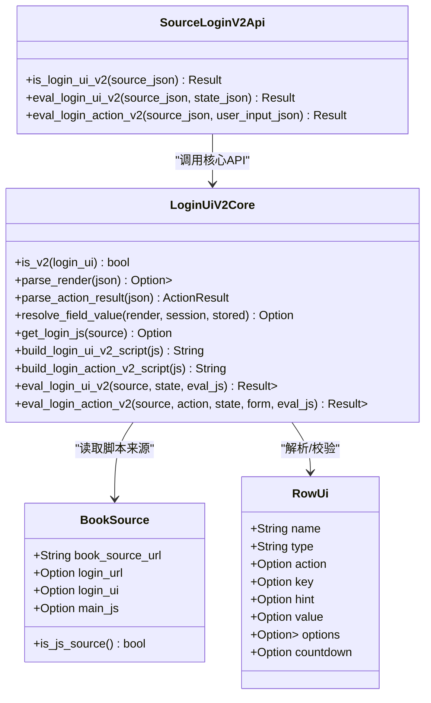
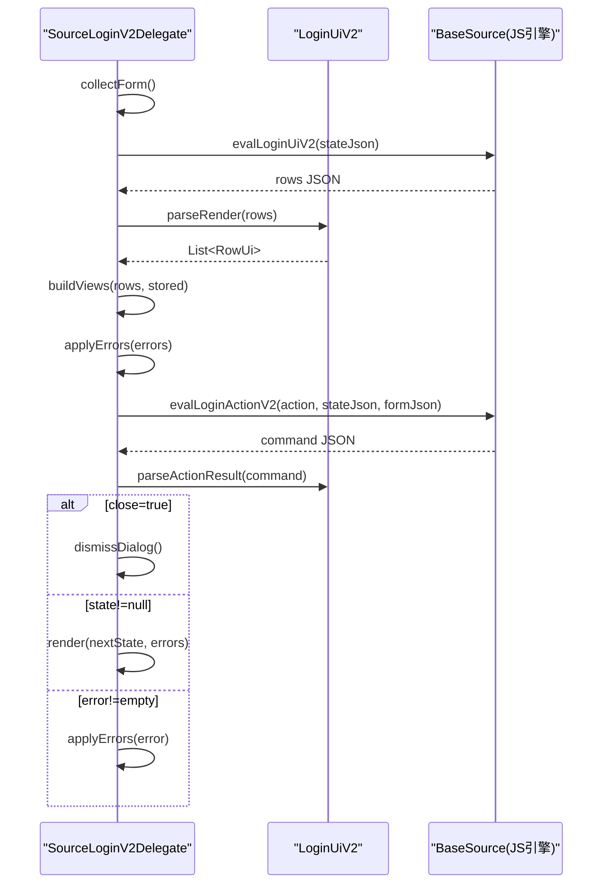
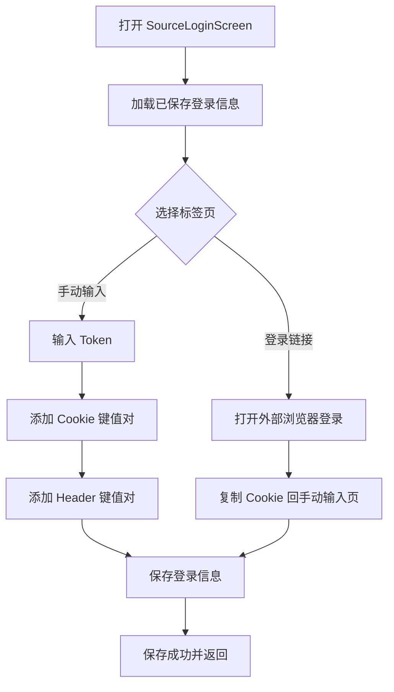
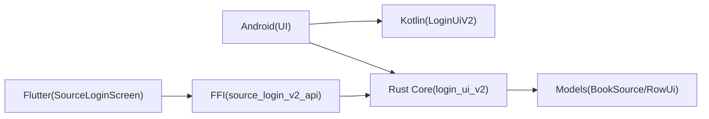

# 登录界面UI V2动态状态协议

<cite>
**本文引用的文件**   
- [LoginUiV2.kt](file://app/src/main/java/io/legado/app/model/login/LoginUiV2.kt)
- [SourceLoginV2Delegate.kt](file://app/src/main/java/io/legado/app/ui/login/SourceLoginV2Delegate.kt)
- [SourceLoginViewModel.kt](file://app/src/main/java/io/legado/app/ui/login/SourceLoginViewModel.kt)
- [login_ui_v2.rs](file://rust/legado-core/src/login_ui_v2.rs)
- [source_login_v2_api.rs](file://rust/legado-ffi/src/api/source_login_v2_api.rs)
- [book_source.rs](file://rust/legado-core/src/models/book_source.rs)
- [row_ui.rs](file://rust/legado-core/src/models/rule/row_ui.rs)
- [source_login_screen.dart](file://flutter_legado/lib/src/screens/source_login_screen.dart)
</cite>

## 目录
1. [简介](#简介)
2. [项目结构](#项目结构)
3. [核心组件](#核心组件)
4. [架构总览](#架构总览)
5. [详细组件分析](#详细组件分析)
6. [依赖关系分析](#依赖关系分析)
7. [性能考量](#性能考量)
8. [故障排查指南](#故障排查指南)
9. [结论](#结论)
10. [附录](#附录)

## 简介
本文件系统化阐述 Legado 项目的“登录界面 UI V2 动态状态协议”。该协议通过书源脚本（JS）在运行时动态生成登录表单与交互流程，支持多步骤、条件渲染、倒计时按钮、错误提示以及登录结果持久化。协议由 Kotlin 端定义与解析，Rust 侧实现核心逻辑并通过 FFI 暴露给上层调用；Android 端负责渲染与交互，Flutter 端提供手动输入与外部浏览器登录的辅助入口。

## 项目结构
围绕 V2 协议的代码分布在三层：
- Android/Kotlin：协议解析、UI 渲染与交互控制
- Rust/Core：协议判定、脚本构建与求值、命令解析
- Flutter：登录辅助页面（Cookie/Header 手动输入、外部浏览器打开登录链接）

**图表来源** 
- [SourceLoginV2Delegate.kt:1-330](file://app/src/main/java/io/legado/app/ui/login/SourceLoginV2Delegate.kt#L1-L330)
- [LoginUiV2.kt:1-96](file://app/src/main/java/io/legado/app/model/login/LoginUiV2.kt#L1-L96)
- [login_ui_v2.rs:1-659](file://rust/legado-core/src/login_ui_v2.rs#L1-L659)
- [book_source.rs:1-318](file://rust/legado-core/src/models/book_source.rs#L1-L318)
- [row_ui.rs:1-69](file://rust/legado-core/src/models/rule/row_ui.rs#L1-L69)
- [source_login_v2_api.rs:1-315](file://rust/legado-ffi/src/api/source_login_v2_api.rs#L1-L315)
- [source_login_screen.dart:1-325](file://flutter_legado/lib/src/screens/source_login_screen.dart#L1-L325)

**章节来源**
- [SourceLoginV2Delegate.kt:1-330](file://app/src/main/java/io/legado/app/ui/login/SourceLoginV2Delegate.kt#L1-L330)
- [LoginUiV2.kt:1-96](file://app/src/main/java/io/legado/app/model/login/LoginUiV2.kt#L1-L96)
- [login_ui_v2.rs:1-659](file://rust/legado-core/src/login_ui_v2.rs#L1-L659)
- [book_source.rs:1-318](file://rust/legado-core/src/models/book_source.rs#L1-L318)
- [row_ui.rs:1-69](file://rust/legado-core/src/models/rule/row_ui.rs#L1-L69)
- [source_login_v2_api.rs:1-315](file://rust/legado-ffi/src/api/source_login_v2_api.rs#L1-L315)
- [source_login_screen.dart:1-325](file://flutter_legado/lib/src/screens/source_login_screen.dart#L1-L325)

## 核心组件
- 协议解析与校验（Kotlin/Rust）
  - 判定是否为 V2：检查 loginUi 标记 {"version":2}
  - 解析渲染 JSON：rows 数组合法性、字段唯一性、类型约束
  - 解析动作命令：state/error/login/close 及未知键记录
  - 字段取值优先级：渲染预填 > 会话输入 > 已存储
- 脚本执行与构建（Rust）
  - 提取登录脚本：优先 mainJs，否则 loginUrl（内联或整段）
  - 构建并执行 loginUi(state)、loginAction(action, state, form)
  - JS 结果规范化：null/undefined → 空字符串，对象序列化
- UI 渲染与交互（Android）
  - 根据 RowUi 动态生成文本框、密码框、下拉选择、标签、按钮
  - 处理倒计时、错误提示、状态切换与登录结果保存
- FFI 层（Rust）
  - 将 Core 能力暴露为 API，注入 baseUrl、source 等绑定
  - 基于 QuickJS 引擎池执行脚本
- Flutter 辅助登录页
  - 手动输入 Token/Cookie/Header，保存至配置库
  - 打开外部浏览器完成登录，再回填 Cookie

**章节来源**
- [LoginUiV2.kt:1-96](file://app/src/main/java/io/legado/app/model/login/LoginUiV2.kt#L1-L96)
- [login_ui_v2.rs:1-659](file://rust/legado-core/src/login_ui_v2.rs#L1-L659)
- [source_login_v2_api.rs:1-315](file://rust/legado-ffi/src/api/source_login_v2_api.rs#L1-L315)
- [SourceLoginV2Delegate.kt:1-330](file://app/src/main/java/io/legado/app/ui/login/SourceLoginV2Delegate.kt#L1-L330)
- [source_login_screen.dart:1-325](file://flutter_legado/lib/src/screens/source_login_screen.dart#L1-L325)

## 架构总览
V2 协议的核心调用链如下：
- Android 发起渲染/动作请求
- Rust Core 构建脚本并执行（通过 FFI 注入 JS 引擎）
- JS 返回渲染描述或动作命令
- Android 解析命令并更新 UI/状态

**图表来源** 
- [SourceLoginV2Delegate.kt:65-104](file://app/src/main/java/io/legado/app/ui/login/SourceLoginV2Delegate.kt#L65-L104)
- [SourceLoginV2Delegate.kt:228-290](file://app/src/main/java/io/legado/app/ui/login/SourceLoginV2Delegate.kt#L228-L290)
- [login_ui_v2.rs:301-348](file://rust/legado-core/src/login_ui_v2.rs#L301-L348)
- [source_login_v2_api.rs:32-86](file://rust/legado-ffi/src/api/source_login_v2_api.rs#L32-L86)

## 详细组件分析

### 协议解析与校验（Kotlin/Rust）
- V2 判定：loginUi 以 {"version":2} 开头且为合法 JSON 对象
- 渲染解析：rows 必须非空、每行合法、key/action 唯一
- 命令解析：state/error/login 必须为对象，close 必须为布尔；未知键记录
- 字段取值：渲染预填 > 会话输入 > 已存储

**图表来源** 
- [LoginUiV2.kt:15-49](file://app/src/main/java/io/legado/app/model/login/LoginUiV2.kt#L15-L49)
- [login_ui_v2.rs:39-119](file://rust/legado-core/src/login_ui_v2.rs#L39-L119)
- [login_ui_v2.rs:143-205](file://rust/legado-core/src/login_ui_v2.rs#L143-L205)
- [login_ui_v2.rs:207-218](file://rust/legado-core/src/login_ui_v2.rs#L207-L218)

**章节来源**
- [LoginUiV2.kt:15-96](file://app/src/main/java/io/legado/app/model/login/LoginUiV2.kt#L15-L96)
- [login_ui_v2.rs:39-218](file://rust/legado-core/src/login_ui_v2.rs#L39-L218)

### 脚本执行与构建（Rust）
- 脚本来源：mainJs 优先，否则 loginUrl（内联 <js>...</js> 或 @js:...）
- 构建表达式：loginUi(JSON.parse(String(__loginState))) / loginAction(...)
- 结果规范化：null/undefined → 空字符串，对象序列化
- 执行环境：FFI 注入 baseUrl、source 等全局绑定

**图表来源** 
- [book_source.rs:70-193](file://rust/legado-core/src/models/book_source.rs#L70-L193)
- [row_ui.rs:1-69](file://rust/legado-core/src/models/rule/row_ui.rs#L1-L69)
- [login_ui_v2.rs:245-348](file://rust/legado-core/src/login_ui_v2.rs#L245-L348)
- [source_login_v2_api.rs:21-86](file://rust/legado-ffi/src/api/source_login_v2_api.rs#L21-L86)

**章节来源**
- [login_ui_v2.rs:245-348](file://rust/legado-core/src/login_ui_v2.rs#L245-L348)
- [source_login_v2_api.rs:21-86](file://rust/legado-ffi/src/api/source_login_v2_api.rs#L21-L86)
- [book_source.rs:70-193](file://rust/legado-core/src/models/book_source.rs#L70-L193)
- [row_ui.rs:1-69](file://rust/legado-core/src/models/rule/row_ui.rs#L1-L69)

### UI 渲染与交互（Android）
- 渲染流程：收集表单 → 异步执行 loginUi → 解析 rows → 构建视图 → 应用错误
- 动作流程：收集表单 → 执行 loginAction → 解析命令 → 保存登录信息/关闭/切换状态
- 倒计时：按钮点击后进入倒计时，禁用并重命名显示剩余秒数
- 错误处理：渲染失败提示、命令非法提示、未知键日志记录

**图表来源** 
- [SourceLoginV2Delegate.kt:65-104](file://app/src/main/java/io/legado/app/ui/login/SourceLoginV2Delegate.kt#L65-L104)
- [SourceLoginV2Delegate.kt:228-290](file://app/src/main/java/io/legado/app/ui/login/SourceLoginV2Delegate.kt#L228-L290)
- [LoginUiV2.kt:22-96](file://app/src/main/java/io/legado/app/model/login/LoginUiV2.kt#L22-L96)

**章节来源**
- [SourceLoginV2Delegate.kt:65-104](file://app/src/main/java/io/legado/app/ui/login/SourceLoginV2Delegate.kt#L65-L104)
- [SourceLoginV2Delegate.kt:228-290](file://app/src/main/java/io/legado/app/ui/login/SourceLoginV2Delegate.kt#L228-L290)
- [LoginUiV2.kt:22-96](file://app/src/main/java/io/legado/app/model/login/LoginUiV2.kt#L22-L96)

### Flutter 辅助登录页
- 功能：手动输入 Token/Cookie/Header，保存至 Rust 配置库；打开外部浏览器登录
- 状态管理：Notifier 维护 cookies/headers/token，持久化到 BookApi.getConfig/setConfig
- 交互：Tab 切换“手动输入”和“登录链接”，底部保存按钮带加载态

**图表来源** 
- [source_login_screen.dart:1-325](file://flutter_legado/lib/src/screens/source_login_screen.dart#L1-L325)

**章节来源**
- [source_login_screen.dart:1-325](file://flutter_legado/lib/src/screens/source_login_screen.dart#L1-L325)

## 依赖关系分析
- Android 依赖 Kotlin 协议解析与 BaseSource 脚本执行
- Rust Core 依赖 BookSource/RowUi 模型，提供协议判定、脚本构建与求值
- FFI 层依赖 Core 能力，注入 JS 引擎与全局绑定
- Flutter 独立于 V2 渲染，仅作为辅助登录入口

**图表来源** 
- [SourceLoginV2Delegate.kt:1-330](file://app/src/main/java/io/legado/app/ui/login/SourceLoginV2Delegate.kt#L1-L330)
- [LoginUiV2.kt:1-96](file://app/src/main/java/io/legado/app/model/login/LoginUiV2.kt#L1-L96)
- [login_ui_v2.rs:1-659](file://rust/legado-core/src/login_ui_v2.rs#L1-L659)
- [book_source.rs:1-318](file://rust/legado-core/src/models/book_source.rs#L1-L318)
- [row_ui.rs:1-69](file://rust/legado-core/src/models/rule/row_ui.rs#L1-L69)
- [source_login_v2_api.rs:1-315](file://rust/legado-ffi/src/api/source_login_v2_api.rs#L1-L315)
- [source_login_screen.dart:1-325](file://flutter_legado/lib/src/screens/source_login_screen.dart#L1-L325)

**章节来源**
- [SourceLoginV2Delegate.kt:1-330](file://app/src/main/java/io/legado/app/ui/login/SourceLoginV2Delegate.kt#L1-L330)
- [login_ui_v2.rs:1-659](file://rust/legado-core/src/login_ui_v2.rs#L1-L659)
- [source_login_v2_api.rs:1-315](file://rust/legado-ffi/src/api/source_login_v2_api.rs#L1-L315)
- [source_login_screen.dart:1-325](file://flutter_legado/lib/src/screens/source_login_screen.dart#L1-L325)

## 性能考量
- 渲染与动作异步执行，避免阻塞 UI
- 倒计时使用 CountDownTimer，精确控制按钮状态
- JS 引擎按书源 URL 分桶复用，减少初始化开销
- 字段取值优先级减少不必要的网络/存储访问

[本节为通用指导，不直接分析具体文件]

## 故障排查指南
- 渲染失败：检查 rows 是否为空、行是否合法、key/action 是否重复
- 命令无效：确认 state/error/login 为对象、close 为布尔
- 脚本缺失：确保 mainJs 或 loginUrl 存在且包含 loginUi/loginAction
- 引擎未启用：构建时需启用 quickjs feature
- 未知命令键：记录日志并忽略，不影响主流程

**章节来源**
- [login_ui_v2.rs:39-119](file://rust/legado-core/src/login_ui_v2.rs#L39-L119)
- [login_ui_v2.rs:143-205](file://rust/legado-core/src/login_ui_v2.rs#L143-L205)
- [source_login_v2_api.rs:144-152](file://rust/legado-ffi/src/api/source_login_v2_api.rs#L144-L152)
- [SourceLoginV2Delegate.kt:106-114](file://app/src/main/java/io/legado/app/ui/login/SourceLoginV2Delegate.kt#L106-L114)
- [SourceLoginV2Delegate.kt:260-267](file://app/src/main/java/io/legado/app/ui/login/SourceLoginV2Delegate.kt#L260-L267)

## 结论
V2 动态状态协议通过脚本驱动登录流程，具备高灵活性与可扩展性。Kotlin/Rust 双端实现保证协议一致性与高性能，Android/Flutter 分别承担渲染与辅助登录职责。建议书源开发者遵循协议规范，确保 rows 合法、命令正确，以获得稳定体验。

[本节为总结，不直接分析具体文件]

## 附录
- 协议标记：{"version":2}
- 渲染字段：rows[].{name,type,key,hint,value,options,countdown}
- 命令字段：state/error/login/close
- 字段取值优先级：渲染预填 > 会话输入 > 已存储

[本节为补充说明，不直接分析具体文件]