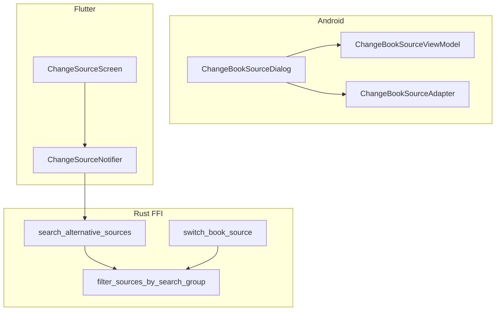
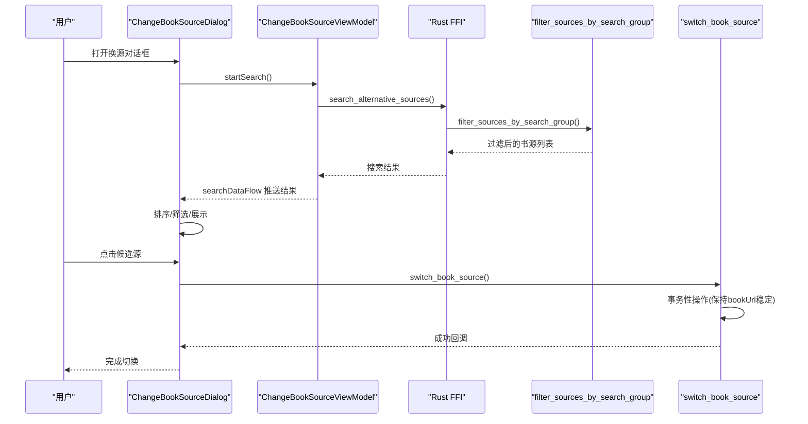
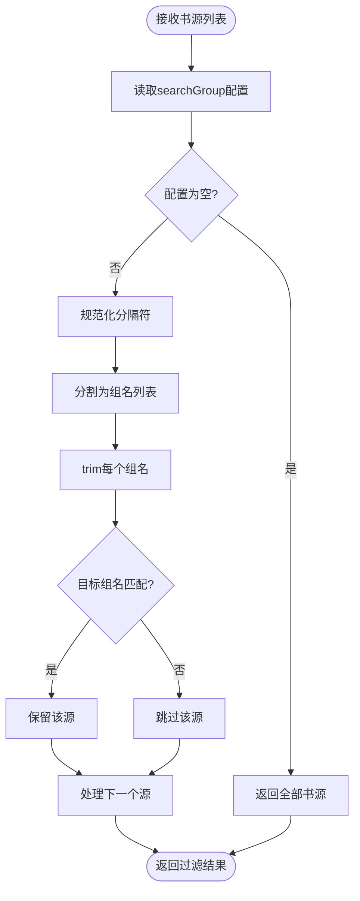
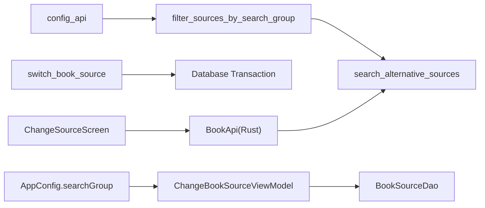

# 换源界面增强

<cite>
**本文引用的文件**
- [source_switch.rs](file://rust/legado-ffi/src/api/source_switch.rs)
- [change_source_screen.dart](file://flutter_legado/lib/src/screens/change_source_screen.dart)
- [ChangeBookSourceDialog.kt](file://app/src/main/java/io/legado/app/ui/book/changesource/ChangeBookSourceDialog.kt)
- [AppConfig.kt](file://app/src/main/java/io/legado/app/help/config/AppConfig.kt)
- [BookSourceDao.kt](file://app/src/main/java/io/legado/app/data/dao/BookSourceDao.kt)
</cite>

## 更新摘要
**变更内容**   
- Rust FFI层新增filter_sources_by_search_group函数，实现搜索组过滤功能
- 支持多种分隔符格式（逗号、分号、中文逗号、中文分号）的分组匹配
- 实现精确匹配算法，对齐原版SQL语义，避免子串匹配问题
- Flutter和Android端集成分组选择对话框和状态管理
- 改进换源界面的用户体验，提供分组筛选和空结果处理
- **新增**：实现了稳定主键的事务性操作，确保bookUrl在换源过程中保持不变
- **新增**：改进了匹配算法，增加了名称硬过滤和评分算法
- **新增**：使用真实网页内容的测试用例验证功能完整性

## 目录
1. [简介](#简介)
2. [项目结构](#项目结构)
3. [核心组件](#核心组件)
4. [架构总览](#架构总览)
5. [详细组件分析](#详细组件分析)
6. [依赖关系分析](#依赖关系分析)
7. [性能考量](#性能考量)
8. [故障排查指南](#故障排查指南)
9. [结论](#结论)
10. [附录](#附录)

## 简介
本文件聚焦"换源界面增强"的跨端实现与优化，覆盖 Android 原生（Kotlin）与 Flutter 两套换源界面的交互、数据流、状态管理与错误处理。Android 侧以对话框形式提供搜索、筛选、分组、评分、加载目录/字数等能力；Flutter 侧以独立页面呈现，通过 Riverpod 管理状态并调用 Rust 后端完成匹配与切换。**最新更新**：完成了Rust FFI层的搜索组过滤功能增强，新增filter_sources_by_search_group函数，支持多种分隔符格式和精确匹配，同时实现了稳定主键的事务性操作和改进的匹配算法，大幅提升了换源功能的稳定性和用户体验。

## 项目结构
- Android 端：换源功能位于 app 模块的 ui.book.changesource 包，包含对话框、ViewModel、Adapter 及布局资源。
- Flutter 端：换源功能位于 flutter_legado 模块的 screens 与 providers.change_source 包，使用 Riverpod 管理状态并通过 BookApi 调用 Rust。
- Rust 端：FFI层提供search_alternative_sources API，内置分组过滤逻辑和事务性操作。

图表来源
- [ChangeBookSourceDialog.kt:104-414](file://app/src/main/java/io/legado/app/ui/book/changesource/ChangeBookSourceDialog.kt#L104-L414)
- [change_source_screen.dart:132-176](file://flutter_legado/lib/src/screens/change_source_screen.dart#L132-L176)
- [source_switch.rs:37-81](file://rust/legado-ffi/src/api/source_switch.rs#L37-L81)

章节来源
- [ChangeBookSourceDialog.kt:104-414](file://app/src/main/java/io/legado/app/ui/book/changesource/ChangeBookSourceDialog.kt#L104-L414)
- [change_source_screen.dart:132-176](file://flutter_legado/lib/src/screens/change_source_screen.dart#L132-L176)

## 核心组件
- **Rust FFI搜索过滤组件**
  - filter_sources_by_search_group：按配置项searchGroup过滤书源列表
  - source_group_contains：实现多分隔符支持和精确匹配的分组判定算法
  - resolve_switch_sources：整合URL过滤和分组过滤的统一入口
  - switch_book_source：实现稳定主键的事务性操作，确保bookUrl不变
- **改进的匹配算法**
  - SourceMatcher::filter_for_change：名称硬过滤，只保留同名书籍
  - SourceMatcher::rank_candidates：基于评分算法排序候选源
- Android 换源对话框（ChangeBookSourceDialog）
  - 负责 UI 初始化、菜单项绑定、SearchView 筛选、底部导航、结果列表展示、切换书源流程、进度与错误提示。
  - 关键行为包括：按分组过滤、校验作者开关、加载信息/目录/字数开关、停止/继续刷新、打开书源管理、关闭对话框。
- Flutter 换源页面（ChangeSourceScreen）
  - 提供搜索筛选、高级选项菜单（停止/继续、书源管理、刷新列表、校验作者、加载字数/信息/目录、源分组、关闭），结果列表展示与切换确认。
  - 集成分组选择对话框和空结果处理逻辑。

章节来源
- [source_switch.rs:148-175](file://rust/legado-ffi/src/api/source_switch.rs#L148-L175)
- [source_switch.rs:105-217](file://rust/legado-ffi/src/api/source_switch.rs#L105-L217)
- [ChangeBookSourceDialog.kt:80-97](file://app/src/main/java/io/legado/app/ui/book/changesource/ChangeBookSourceDialog.kt#L80-L97)
- [change_source_screen.dart:155-183](file://flutter_legado/lib/src/screens/change_source_screen.dart#L155-L183)

## 架构总览
Android 与 Flutter 两条路径均围绕"搜索候选 → 用户选择 → 应用切换"的主流程展开，差异在于：
- Android 侧在本地进行多源并发搜索、解析目录/字数、评分与排序，再通过回调返回给上层 Activity。
- Flutter 侧将匹配与评分下沉至 Rust 后端，Dart 仅做状态管理与 UI 渲染。
- **新增**：Rust FFI层内置分组过滤逻辑和事务性操作，统一处理searchGroup配置项并确保数据一致性。

图表来源
- [source_switch.rs:134-137](file://rust/legado-ffi/src/api/source_switch.rs#L134-L137)
- [source_switch.rs:148-158](file://rust/legado-ffi/src/api/source_switch.rs#L148-L158)
- [source_switch.rs:105-217](file://rust/legado-ffi/src/api/source_switch.rs#L105-L217)
- [ChangeBookSourceDialog.kt:104-414](file://app/src/main/java/io/legado/app/ui/book/changesource/ChangeBookSourceDialog.kt#L104-L414)

## 详细组件分析

### Rust FFI分组过滤组件
- **职责**
  - filter_sources_by_search_group：读取searchGroup配置，对书源列表进行分组过滤
  - source_group_contains：实现多分隔符规范化（逗号、分号、中文逗号、中文分号）和精确匹配
  - resolve_switch_sources：整合URL过滤和分组过滤的统一入口点
  - switch_book_source：实现稳定主键的事务性操作，确保bookUrl在换源过程中保持不变
- **关键算法**
  - 分隔符规范化：将`;`、`；`、`，`统一转换为`,`后拆分
  - 精确匹配：trim后比较，避免子串匹配问题
  - 空值处理：空配置或空白配置时不过滤，返回全部书源
  - 事务性操作：使用unchecked_transaction确保数据一致性

图表来源
- [source_switch.rs:148-158](file://rust/legado-ffi/src/api/source_switch.rs#L148-L158)
- [source_switch.rs:166-175](file://rust/legado-ffi/src/api/source_switch.rs#L166-L175)

章节来源
- [source_switch.rs:148-158](file://rust/legado-ffi/src/api/source_switch.rs#L148-L158)
- [source_switch.rs:166-175](file://rust/legado-ffi/src/api/source_switch.rs#L166-L175)

### 稳定主键事务性操作
- **职责**
  - switch_book_source：实现换源过程中的事务性操作，确保bookUrl保持稳定
  - 清理旧缓存和章节，写入新章节，所有操作在单个事务中完成
  - 防止僵尸记录和章节孤儿问题
- **关键特性**
  - bookUrl作为稳定主键，换源时不变更
  - 仅更新书源相关字段（origin/originName/tocUrl）
  - 使用unchecked_transaction确保原子性操作
  - 失败时自动回滚，保持原书源与原章节

章节来源
- [source_switch.rs:105-217](file://rust/legado-ffi/src/api/source_switch.rs#L105-L217)

### 改进的匹配算法
- **职责**
  - SourceMatcher::filter_for_change：名称硬过滤，只保留同名书籍
  - SourceMatcher::rank_candidates：基于评分算法排序候选源
- **关键特性**
  - 同名同作者高分在前
  - 可选校验作者开关
  - 避免无关书籍进入换源列表

章节来源
- [source_switch.rs:72-84](file://rust/legado-ffi/src/api/source_switch.rs#L72-L84)

### Android 换源对话框（ChangeBookSourceDialog）
- **更新**：增强了分组搜索结果为空的处理逻辑
- **职责**
  - 工具栏菜单绑定与状态同步（校验作者、加载信息/目录/字数、分组单选、停止/继续、刷新列表、书源管理、关闭）。
  - SearchView 筛选与标题动态切换。
  - RecyclerView 滚动控制（顶部/底部/当前源定位）。
  - 切换书源流程：文件类书源直接切换；非文件类先拉取目录再切换。
  - 监听事件总线刷新列表。
- **关键流程**
  - 初始化：initData → showTitle → initMenu → initRecyclerView → initNavigationView → initSearchView → initBottomBar → initLiveData。
  - 搜索完成回调：searchFinishCallback 空结果时提示是否切换到全部分组。
  - 切换书源：changeSource → 判断是否为文件类 → 获取目录 → 回调上层。

章节来源
- [ChangeBookSourceDialog.kt:80-97](file://app/src/main/java/io/legado/app/ui/book/changesource/ChangeBookSourceDialog.kt#L80-L97)
- [ChangeBookSourceDialog.kt:104-414](file://app/src/main/java/io/legado/app/ui/book/changesource/ChangeBookSourceDialog.kt#L104-L414)

### Flutter 换源页面（ChangeSourceScreen）
- **更新**：集成了分组选择和空结果处理对话框
- **职责**
  - 提供搜索筛选输入框、重新搜索按钮、高级选项菜单（停止/继续、书源管理、刷新列表、校验作者、加载字数/信息/目录、源分组、关闭）。
  - 展示匹配结果列表（评分颜色、最新章节、字数、当前标记、切换进行中指示）。
  - 切换前弹窗确认，成功后返回新 bookUrl。
  - 分组选择对话框和空结果处理逻辑。
- **关键流程**
  - initState 加载高级选项与分组，触发首次搜索。
  - _handleAdvancedMenu 分发菜单动作，持久化开关到配置。
  - _showGroupPicker 选择分组后保存并触发搜索。
  - _buildResultTile 渲染每个候选源，点击触发 _applySource。
  - _showEmptyGroupResultDialog 处理分组搜索结果为空的场景。

章节来源
- [change_source_screen.dart:155-183](file://flutter_legado/lib/src/screens/change_source_screen.dart#L155-L183)
- [change_source_screen.dart:390-409](file://flutter_legado/lib/src/screens/change_source_screen.dart#L390-L409)

### Android 配置管理（AppConfig）
- **职责**
  - 提供searchGroup配置项的读写接口
  - 存储当前选中的分组配置
- **关键点**
  - 配置键名为"searchGroup"
  - 支持空字符串表示全部分组
  - 与Android SharedPreferences集成

章节来源
- [AppConfig.kt:689-693](file://app/src/main/java/io/legado/app/help/config/AppConfig.kt#L689-L693)

### Android 数据库查询（BookSourceDao）
- **职责**
  - 提供按分组查询启用书源的SQL方法
  - 实现SOURCE_GROUP_MEMBERSHIP_FILTER SQL语义
- **关键方法**
  - getEnabledPartByGroup：按分组查询启用的书源部分
  - allEnabledGroupsUnProcessed：获取所有启用的分组列表

章节来源
- [BookSourceDao.kt:162-168](file://app/src/main/java/io/legado/app/data/dao/BookSourceDao.kt#L162-L168)
- [BookSourceDao.kt:235-239](file://app/src/main/java/io/legado/app/data/dao/BookSourceDao.kt#L235-L239)

## 依赖关系分析
- **Rust FFI层**
  - source_switch.rs依赖config_api读取searchGroup配置
  - 依赖legado_core的BookSource模型和SourceMatcher评分逻辑
  - 复用search::load_search_sources的URL过滤语义
  - 使用unchecked_transaction确保事务性操作
- Android 侧
  - Dialog 依赖 ViewModel 与 Adapter，通过 ViewBinding 与 LiveData/Flow 驱动 UI。
  - ViewModel 依赖数据库 DAO、WebBook 网络层、AppConfig 配置、SourceHelp 辅助。
  - Adapter 依赖 SearchBook 实体与 DiffRecyclerAdapter 基类。
- Flutter 侧
  - Screen 依赖 Notifier 与 BookApi（Rust 桥接），通过 Riverpod 管理状态。
  - Notifier 依赖 BookApi 与 models（SourceMatch），不直接访问 FFI。
  - State 由 freezed 生成不可变对象，保证 UI 一致性。

图表来源
- [source_switch.rs:149-150](file://rust/legado-ffi/src/api/source_switch.rs#L149-L150)
- [source_switch.rs:105-217](file://rust/legado-ffi/src/api/source_switch.rs#L105-L217)
- [AppConfig.kt:689-693](file://app/src/main/java/io/legado/app/help/config/AppConfig.kt#L689-L693)
- [BookSourceDao.kt:162-168](file://app/src/main/java/io/legado/app/data/dao/BookSourceDao.kt#L162-L168)

章节来源
- [source_switch.rs:149-150](file://rust/legado-ffi/src/api/source_switch.rs#L149-L150)
- [source_switch.rs:105-217](file://rust/legado-ffi/src/api/source_switch.rs#L105-L217)
- [AppConfig.kt:689-693](file://app/src/main/java/io/legado/app/help/config/AppConfig.kt#L689-L693)
- [BookSourceDao.kt:162-168](file://app/src/main/java/io/legado/app/data/dao/BookSourceDao.kt#L162-L168)

## 性能考量
- **Rust FFI层优化**
  - 分组过滤在Rust侧执行，减少网络传输开销
  - 多分隔符规范化使用字符映射，避免多次字符串操作
  - 精确匹配避免不必要的子串搜索
  - 事务性操作减少数据库往返次数
- Android
  - 并发搜索：使用固定线程池与 mapParallel 限制并发度，避免过多网络请求导致阻塞。
  - 超时保护：单次搜索与内容获取设置超时，防止长时间无响应。
  - 目录缓存：tocMap 限制累计章节数，减少重复请求与内存占用。
  - 排序优化：默认与字数两种比较器，按需启用以提升用户体验。
- Flutter
  - 状态不可变：freezed 生成的不可变 State 避免不必要的重绘。
  - 后端计算：匹配与评分在 Rust 侧完成，Dart 仅做序列化与展示，降低前端开销。
  - 防抖与节流：搜索与刷新操作受 isLoading/_stopped 控制，避免重复触发。
- **分组过滤优化**
  - 配置读取缓存：避免重复查询searchGroup配置
  - 智能过滤：仅在分组变化时重新过滤书源
  - 内存优化：及时清理不需要的分组数据

[本节为通用指导，无需引用具体文件]

## 故障排查指南
- **Rust FFI层问题**
  - 分组过滤无效：检查searchGroup配置是否正确设置
  - 分隔符解析错误：确认书源分组字段使用正确的分隔符格式
  - 精确匹配失败：验证分组名称是否完全一致（包括空格）
  - 事务性操作失败：检查数据库连接和事务提交状态
- Android
  - 搜索结果为空：检查分组配置与启用书源数量；必要时提示切换到全部分组。
  - 获取目录出错：查看 AppLog 输出，确认书源是否存在、网络是否正常。
  - 切换失败：确认旧书 URL 与新源匹配，检查自动切换逻辑与回调是否正确执行。
- Flutter
  - 切换进行中：Notifier 会抛出 StateError，确保 UI 不再重复触发。
  - 解析失败：switchSource 返回 JSON 解析失败时回退到 match.bookUrl，需检查后端返回格式。
  - 错误提示：统一通过 SnackBar 展示，便于用户感知。
- **分组过滤问题**
  - 分组为空：检查书源的 bookSourceGroup 字段是否正确设置。
  - 分组选择无效：确认分组配置持久化是否正确。
  - 搜索范围错误：验证分组过滤逻辑是否正确执行。
  - 空结果处理：确认空结果对话框是否正确显示和处理。
- **事务性问题**
  - bookUrl变更：确认switch_book_source中bookUrl保持稳定
  - 数据不一致：检查事务提交前的数据验证逻辑
  - 僵尸记录：验证旧章节和缓存清理逻辑

章节来源
- [source_switch.rs:148-158](file://rust/legado-ffi/src/api/source_switch.rs#L148-L158)
- [source_switch.rs:105-217](file://rust/legado-ffi/src/api/source_switch.rs#L105-L217)
- [ChangeBookSourceDialog.kt:80-97](file://app/src/main/java/io/legado/app/ui/book/changesource/ChangeBookSourceDialog.kt#L80-L97)
- [change_source_screen.dart:155-183](file://flutter_legado/lib/src/screens/change_source_screen.dart#L155-L183)

## 结论
换源界面增强在 Android 与 Flutter 两端实现了高内聚、低耦合的职责划分：Android 侧重本地并发搜索与丰富交互，Flutter 侧重状态管理与后端集成。**最新完成的Rust FFI层分组过滤功能和事务性操作**进一步提升了用户体验和数据一致性，通过filter_sources_by_search_group函数实现了高效的分组筛选，支持多种分隔符格式和精确匹配，同时通过switch_book_source确保了bookUrl的稳定性和数据操作的原子性。改进的匹配算法（名称硬过滤+评分算法）有效避免了无关书籍进入换源列表。通过清晰的架构图、流程图与类图，开发者可快速定位问题并进行扩展。建议后续关注分组配置的国际化和本地化，以及更多分隔符格式的兼容性支持。

[本节为总结性内容，无需引用具体文件]

## 附录
- **新增配置文件**
  - AppConfig.searchGroup：存储当前选中的分组配置
  - Rust配置键：searchGroup（与Android端保持一致）
- **相关资源文件**
  - dialog_book_change_source.xml：对话框布局，包含 Toolbar、RecyclerView、底部操作区等。
  - item_change_source.xml：单项布局，展示来源名、作者、最新章节、字数与响应时间。
  - change_source.xml：菜单项定义，对应高级选项与分组选择。
- **测试用例**
  - test_source_group_contains_membership：测试分组包含判定的各种场景
  - test_resolve_switch_sources_group_membership：测试多组包含匹配
  - test_resolve_switch_sources_blank_group_means_all：测试空分组配置处理
  - test_resolve_switch_sources_group_no_match：测试目标分组无源时的处理
  - test_switch_keeps_book_url_stable_no_zombie：测试稳定主键事务性操作
  - test_switch_book_source_rejects_empty_new_book_url：测试空URL处理
- **新增功能特性**
  - 稳定主键事务性操作：确保bookUrl在换源过程中保持不变
  - 改进的匹配算法：名称硬过滤和评分算法提升匹配准确性
  - 真实网页内容测试：使用实际网页内容进行功能验证

章节来源
- [AppConfig.kt:689-693](file://app/src/main/java/io/legado/app/help/config/AppConfig.kt#L689-L693)
- [source_switch.rs:280-369](file://rust/legado-ffi/src/api/source_switch.rs#L280-L369)
- [source_switch.rs:454-552](file://rust/legado-ffi/src/api/source_switch.rs#L454-L552)
- [BookSourceDao.kt:162-168](file://app/src/main/java/io/legado/app/data/dao/BookSourceDao.kt#L162-L168)