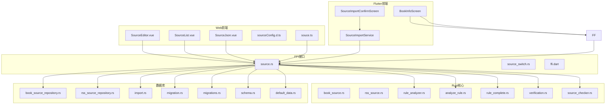
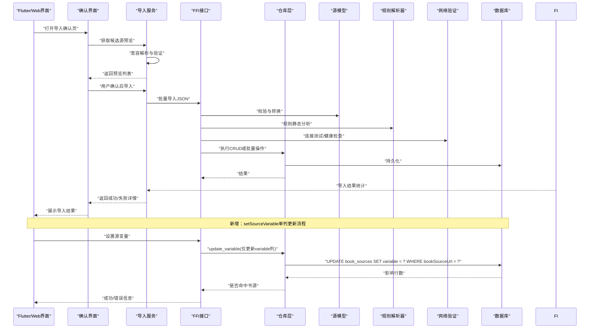
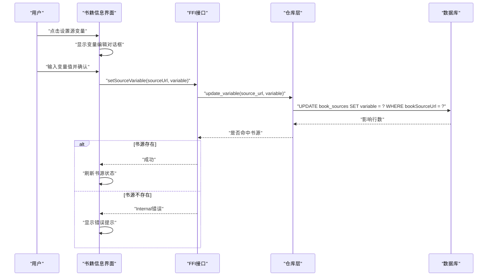
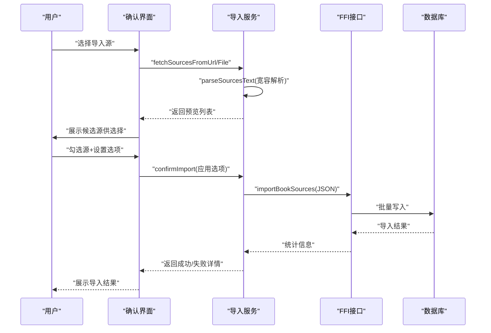
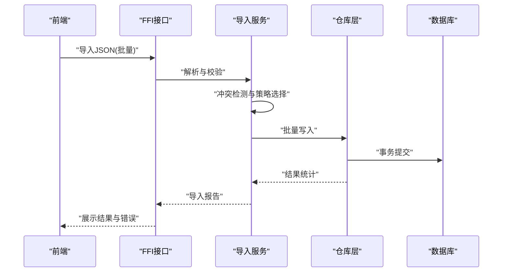
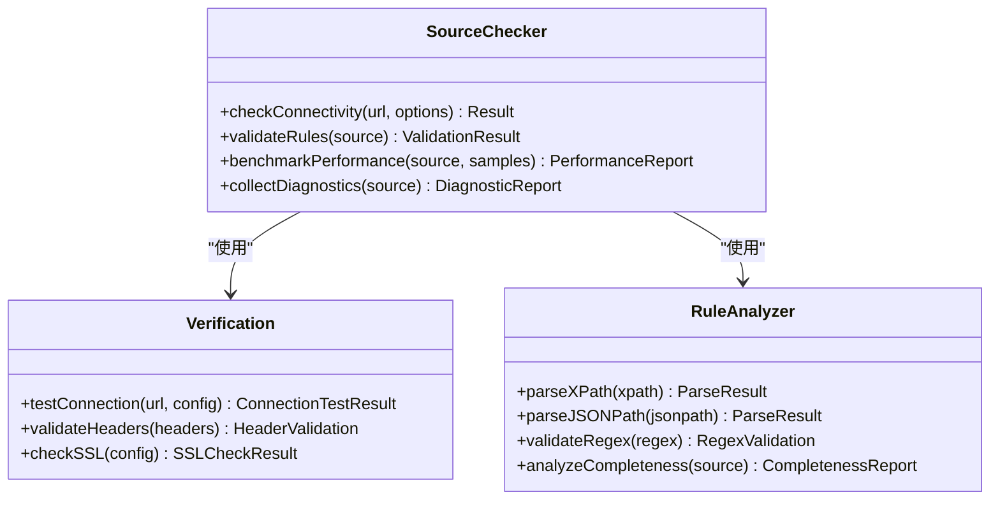
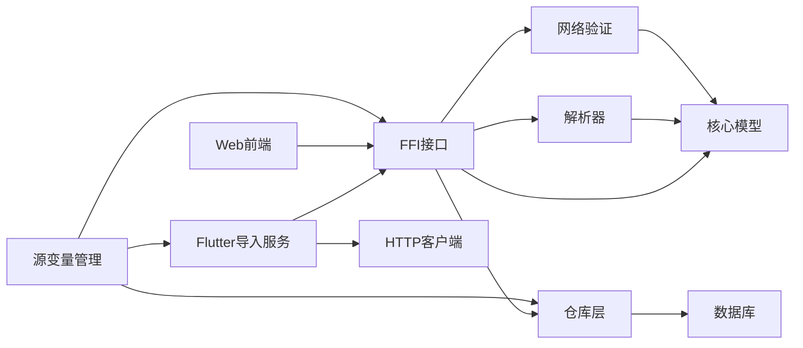

# 源管理功能

<cite>
**本文引用的文件**   
- [book_source.rs](file://rust/legado-core/src/models/book_source.rs)
- [rss_source.rs](file://rust/legado-core/src/models/rss_source.rs)
- [source.rs](file://rust/legado-ffi/src/api/source.rs)
- [source_switch.rs](file://rust/legado-ffi/src/api/source_switch.rs)
- [book_source_repository.rs](file://rust/legado-db/src/repository/book_source_repository.rs)
- [rss_source_repository.rs](file://rust/legado-db/src/repository/rss_source_repository.rs)
- [import.rs](file://rust/legado-db/src/import.rs)
- [migration.rs](file://rust/legado-db/src/migration.rs)
- [migrations.rs](file://rust/legado-db/src/migration/migrations.rs)
- [schema.rs](file://rust/legado-db/src/schema.rs)
- [default_data.rs](file://rust/legado-db/src/default_data.rs)
- [rule_analyzer.rs](file://rust/legado-parser/src/rule_analyzer.rs)
- [analyze_rule.rs](file://rust/legado-parser/src/analyze_rule.rs)
- [rule_complete.rs](file://rust/legado-parser/src/rule_complete.rs)
- [verification.rs](file://rust/legado-net/src/verification.rs)
- [source_checker.rs](file://rust/legado-net/src/source_checker.rs)
- [SourceJson.vue](file://modules/web/src/components/SourceJson.vue)
- [SourceList.vue](file://modules/web/src/components/SourceList.vue)
- [SourceEditor.vue](file://modules/web/src/views/SourceEditor.vue)
- [sourceConfig.d.ts](file://modules/web/src/config/sourceConfig.d.ts)
- [souce.ts](file://modules/web/src/utils/souce.ts)
- [source_import_confirm_screen.dart](file://flutter_legado/lib/src/screens/source_import_confirm_screen.dart)
- [source_import_service.dart](file://flutter_legado/lib/src/services/source_import_service.dart)
- [book_info_screen.dart](file://flutter_legado/lib/src/screens/book_info_screen.dart)
- [ffi.dart](file://flutter_legado/lib/src/bridge/ffi/ffi.dart)
</cite>

## 更新摘要
**变更内容**   
- 新增两阶段确认流程：导入前预览与确认机制
- **新增 setSourceVariable 功能**：通过源操作模块实现单列 UPDATE 语义，避免全行更新覆盖其他字段
- 改进解析鲁棒性：支持第三方书源的宽松类型处理
- 增强用户体验：自定义分组、保留选项、状态标签等交互优化
- 完善错误处理：详细的导入结果统计与错误信息展示

## 目录
1. [简介](#简介)
2. [项目结构](#项目结构)
3. [核心组件](#核心组件)
4. [架构总览](#架构总览)
5. [详细组件分析](#详细组件分析)
6. [依赖分析](#依赖分析)
7. [性能考虑](#性能考虑)
8. [故障排除指南](#故障排除指南)
9. [结论](#结论)
10. [附录](#附录)

## 简介
本文件面向Legado的"源管理"能力，聚焦书籍源的CRUD（创建、读取、更新、删除）流程、源配置结构与验证规则、导入导出规范与冲突处理、版本兼容策略，以及连接测试、规则检查、性能评估与错误诊断。文档同时覆盖Web端编辑界面、Flutter端两阶段确认流程与Rust后端的数据流与调用链，帮助开发者与高级用户高效使用与维护源。**特别新增了源变量管理功能，支持安全地设置和清除书源自定义变量。**

## 项目结构
Legado的源管理由多模块协作完成：
- Rust核心模型与数据访问：定义源数据结构、数据库表结构、迁移与默认数据、仓库层操作。
- FFI接口：对外暴露源管理的API（增删改查、切换、导入导出、变量设置）。
- 解析器：对源规则进行静态分析与完整性校验。
- 网络层：提供连接测试、超时重试、速率限制等能力。
- Web前端：提供JSON编辑、列表管理、编辑器视图与工具函数。
- Flutter前端：实现两阶段确认导入流程、源变量设置界面，支持预览、选择与批量操作。



**图表来源**
- [source_import_confirm_screen.dart](file://flutter_legado/lib/src/screens/source_import_confirm_screen.dart)
- [book_info_screen.dart](file://flutter_legado/lib/src/screens/book_info_screen.dart)
- [source_import_service.dart](file://flutter_legado/lib/src/services/source_import_service.dart)
- [SourceEditor.vue](file://modules/web/src/views/SourceEditor.vue)
- [SourceList.vue](file://modules/web/src/components/SourceList.vue)
- [SourceJson.vue](file://modules/web/src/components/SourceJson.vue)
- [sourceConfig.d.ts](file://modules/web/src/config/sourceConfig.d.ts)
- [souce.ts](file://modules/web/src/utils/souce.ts)
- [source.rs](file://rust/legado-ffi/src/api/source.rs)
- [source_switch.rs](file://rust/legado-ffi/src/api/source_switch.rs)
- [ffi.dart](file://flutter_legado/lib/src/bridge/ffi/ffi.dart)
- [book_source.rs](file://rust/legado-core/src/models/book_source.rs)
- [rss_source.rs](file://rust/legado-core/src/models/rss_source.rs)
- [rule_analyzer.rs](file://rust/legado-parser/src/rule_analyzer.rs)
- [analyze_rule.rs](file://rust/legado-parser/src/analyze_rule.rs)
- [rule_complete.rs](file://rust/legado-parser/src/rule_complete.rs)
- [verification.rs](file://rust/legado-net/src/verification.rs)
- [source_checker.rs](file://rust/legado-net/src/source_checker.rs)
- [book_source_repository.rs](file://rust/legado-db/src/repository/book_source_repository.rs)
- [rss_source_repository.rs](file://rust/legado-db/src/repository/rss_source_repository.rs)
- [import.rs](file://rust/legado-db/src/import.rs)
- [migration.rs](file://rust/legado-db/src/migration.rs)
- [migrations.rs](file://rust/legado-db/src/migration/migrations.rs)
- [schema.rs](file://rust/legado-db/src/schema.rs)
- [default_data.rs](file://rust/legado-db/src/default_data.rs)

章节来源
- [book_source.rs](file://rust/legado-core/src/models/book_source.rs)
- [rss_source.rs](file://rust/legado-core/src/models/rss_source.rs)
- [source.rs](file://rust/legado-ffi/src/api/source.rs)
- [book_source_repository.rs](file://rust/legado-db/src/repository/book_source_repository.rs)
- [import.rs](file://rust/legado-db/src/import.rs)
- [migration.rs](file://rust/legado-db/src/migration.rs)
- [migrations.rs](file://rust/legado-db/src/migration/migrations.rs)
- [schema.rs](file://rust/legado-db/src/schema.rs)
- [default_data.rs](file://rust/legado-db/src/default_data.rs)
- [rule_analyzer.rs](file://rust/legado-parser/src/rule_analyzer.rs)
- [analyze_rule.rs](file://rust/legado-parser/src/analyze_rule.rs)
- [rule_complete.rs](file://rust/legado-parser/src/rule_complete.rs)
- [verification.rs](file://rust/legado-net/src/verification.rs)
- [source_checker.rs](file://rust/legado-net/src/source_checker.rs)
- [SourceJson.vue](file://modules/web/src/components/SourceJson.vue)
- [SourceList.vue](file://modules/web/src/components/SourceList.vue)
- [SourceEditor.vue](file://modules/web/src/views/SourceEditor.vue)
- [sourceConfig.d.ts](file://modules/web/src/config/sourceConfig.d.ts)
- [souce.ts](file://modules/web/src/utils/souce.ts)
- [source_import_confirm_screen.dart](file://flutter_legado/lib/src/screens/source_import_confirm_screen.dart)
- [source_import_service.dart](file://flutter_legado/lib/src/services/source_import_service.dart)
- [book_info_screen.dart](file://flutter_legado/lib/src/screens/book_info_screen.dart)
- [ffi.dart](file://flutter_legado/lib/src/bridge/ffi/ffi.dart)

## 核心组件
- 源模型与类型
  - 书籍源模型：定义书籍源的字段、默认值、校验与序列化格式，**包含variable字段用于存储自定义变量**。
  - RSS源模型：用于RSS订阅源的元数据与规则。
- 数据访问层
  - 书籍源仓库：实现CRUD、批量操作、按条件查询与事务封装，**新增update_variable方法支持单列更新**。
  - RSS源仓库：同书籍源仓库类似，但针对RSS场景。
- 导入导出
  - 统一导入入口：支持JSON批量导入、冲突策略（跳过/覆盖/合并）、版本兼容性检测。
  - 两阶段确认流程：预览候选源、用户选择、应用保留选项后导入。
- **源变量管理**
  - **setSourceVariable API：通过FFI接口设置书源自定义变量，采用单列UPDATE语义避免覆盖其他字段**。
  - **数据库迁移：从v102升级到v103时自动添加variable列**。
  - **错误处理：书源不存在时返回Internal错误，确保数据一致性**。
- 规则分析
  - 规则静态分析：语法检查、必填项校验、XPath/JSONPath/正则表达式有效性。
  - 规则补全：缺失字段提示与默认值填充。
- 网络验证
  - 连接测试：HTTP连通性、超时、代理、SSL配置。
  - 源健康检查：请求成功率、响应时间、分页与内容抓取可用性。
- Web前端
  - JSON编辑器：直接编辑源JSON，实时校验与格式化。
  - 源列表：展示、搜索、排序、批量操作。
  - 编辑器视图：可视化编辑常用字段与规则。
- Flutter前端
  - 两阶段确认界面：预览、选择、自定义分组、保留选项。
  - **源变量设置界面：支持设置和清除书源自定义变量**。
  - 宽容解析服务：支持第三方书源的宽松类型处理。
  - 导入结果统计：详细的状态统计与错误信息。

章节来源
- [book_source.rs](file://rust/legado-core/src/models/book_source.rs)
- [rss_source.rs](file://rust/legado-core/src/models/rss_source.rs)
- [book_source_repository.rs](file://rust/legado-db/src/repository/book_source_repository.rs)
- [rss_source_repository.rs](file://rust/legado-db/src/repository/rss_source_repository.rs)
- [import.rs](file://rust/legado-db/src/import.rs)
- [rule_analyzer.rs](file://rust/legado-parser/src/rule_analyzer.rs)
- [analyze_rule.rs](file://rust/legado-parser/src/analyze_rule.rs)
- [rule_complete.rs](file://rust/legado-parser/src/rule_complete.rs)
- [verification.rs](file://rust/legado-net/src/verification.rs)
- [source_checker.rs](file://rust/legado-net/src/source_checker.rs)
- [SourceJson.vue](file://modules/web/src/components/SourceJson.vue)
- [SourceList.vue](file://modules/web/src/components/SourceList.vue)
- [SourceEditor.vue](file://modules/web/src/views/SourceEditor.vue)
- [sourceConfig.d.ts](file://modules/web/src/config/sourceConfig.d.ts)
- [souce.ts](file://modules/web/src/utils/souce.ts)
- [source_import_confirm_screen.dart](file://flutter_legado/lib/src/screens/source_import_confirm_screen.dart)
- [source_import_service.dart](file://flutter_legado/lib/src/services/source_import_service.dart)
- [book_info_screen.dart](file://flutter_legado/lib/src/screens/book_info_screen.dart)
- [ffi.dart](file://flutter_legado/lib/src/bridge/ffi/ffi.dart)

## 架构总览
源管理贯穿"前端—FFI—核心模型—仓库—解析器—网络"的完整链路。前端通过FFI接口发起操作，核心模型负责数据契约，仓库层持久化到数据库，解析器进行规则校验，网络层进行连通性与性能测试。**新增的setSourceVariable功能通过单列UPDATE语义确保了变量设置的原子性和安全性，避免了全行更新可能带来的数据覆盖风险。**



**图表来源**
- [source_import_confirm_screen.dart](file://flutter_legado/lib/src/screens/source_import_confirm_screen.dart)
- [book_info_screen.dart](file://flutter_legado/lib/src/screens/book_info_screen.dart)
- [source_import_service.dart](file://flutter_legado/lib/src/services/source_import_service.dart)
- [source.rs](file://rust/legado-ffi/src/api/source.rs)
- [book_source_repository.rs](file://rust/legado-db/src/repository/book_source_repository.rs)
- [book_source.rs](file://rust/legado-core/src/models/book_source.rs)
- [rule_analyzer.rs](file://rust/legado-parser/src/rule_analyzer.rs)
- [verification.rs](file://rust/legado-net/src/verification.rs)

## 详细组件分析

### 书籍源CRUD流程
- 创建
  - 前端提交源JSON，FFI接收后进行模型映射与必填字段校验。
  - 规则解析器对XPath/JSONPath/正则进行语法检查。
  - 可选执行连接测试与健康检查。
  - 仓库层写入数据库并返回ID。
- 读取
  - 支持按ID、名称、分组、标签等多条件查询。
  - 支持分页与排序。
- 更新
  - 增量更新：仅更新变更字段。
  - 规则重新分析，必要时触发连接测试。
  - **新增：setSourceVariable支持安全的单列更新**。
- 删除
  - 软删除或硬删除策略，确保无引用冲突。
  - 清理相关缓存与索引。

```mermaid
flowchart TD
Start(["开始"]) --> Validate["校验输入与规则"]
Validate --> Valid{"校验通过?"}
Valid --> |否| Error["返回错误信息"]
Valid --> |是| TestConn["连接测试(可选)"]
TestConn --> ConnOK{"连通成功?"}
ConnOK --> |否| Warn["记录警告并继续"]
ConnOK --> |是| Save["保存至数据库"]
Save --> Done(["完成"])
Warn --> Save
Error --> End(["结束"])
Done --> End
Note: 新增setSourceVariable路径
SetVar["设置源变量"] --> SingleColUpdate["单列UPDATE variable字段"]
SingleColUpdate --> CheckExist{"书源存在?"}
CheckExist --> |否| NotFound["返回Internal错误"]
CheckExist --> |是| UpdateSuccess["更新成功"]
```

**图表来源**
- [source.rs](file://rust/legado-ffi/src/api/source.rs)
- [book_source_repository.rs](file://rust/legado-db/src/repository/book_source_repository.rs)
- [rule_analyzer.rs](file://rust/legado-parser/src/rule_analyzer.rs)
- [verification.rs](file://rust/legado-net/src/verification.rs)

章节来源
- [source.rs](file://rust/legado-ffi/src/api/source.rs)
- [book_source_repository.rs](file://rust/legado-db/src/repository/book_source_repository.rs)
- [rule_analyzer.rs](file://rust/legado-parser/src/rule_analyzer.rs)
- [verification.rs](file://rust/legado-net/src/verification.rs)

### 源配置结构
- 字段定义
  - 基础信息：名称、作者、主页URL、分类、标签、描述、语言、版本。
  - 网络设置：请求头、Cookie策略、User-Agent、代理、SSL配置、超时。
  - 规则字段：首页规则、分类规则、详情页规则、目录规则、正文规则、搜索规则、翻页规则、链接规则、图片规则等。
  - **变量字段：variable（自定义变量内容）、variableComment（变量说明）**。
  - 行为控制：并发数、重试次数、延迟、是否启用缓存、是否允许登录态。
- 验证规则
  - 必填字段：名称、主页URL、关键规则（如目录/正文）。
  - 格式校验：URL合法性、正则表达式语法、XPath/JSONPath有效性。
  - 逻辑校验：避免死循环翻页、空结果集、重复键。
- 默认值设置
  - 网络默认：超时、重试、UA、编码。
  - 规则默认：常见选择器、正则模板、分页起始页。
  - **变量默认：variable默认为空串，表示未设置或已清除**。
- 数据迁移策略
  - 版本字段驱动迁移：根据版本号应用迁移脚本。
  - 兼容层：旧字段到新字段的映射与降级处理。
  - **新增：v102→v103迁移自动添加variable列**。
  - 回滚策略：失败时保留原数据并记录日志。

章节来源
- [book_source.rs](file://rust/legado-core/src/models/book_source.rs)
- [schema.rs](file://rust/legado-db/src/schema.rs)
- [default_data.rs](file://rust/legado-db/src/default_data.rs)
- [migration.rs](file://rust/legado-db/src/migration.rs)
- [migrations.rs](file://rust/legado-db/src/migration/migrations.rs)

### 源变量管理功能（新增）
**新增** setSourceVariable功能实现了安全的书源自定义变量管理：

- **核心特性**
  - **单列UPDATE语义：仅更新variable字段，避免全行更新覆盖其他字段**
  - **空串清除：传入空字符串表示清除变量**
  - **错误处理：书源不存在时返回Internal错误**
  - **数据一致性：通过影响行数判断操作是否成功**

- **实现架构**
  - **Flutter层：book_info_screen.dart中的_setSourceVariable方法**
  - **FFI层：ffi.dart中的setSourceVariable桥接函数**
  - **Rust层：source.rs中的set_source_variable API**
  - **数据库层：book_source_repository.rs中的update_variable方法**

- **使用流程**
  - 用户在书籍信息页面点击"设置源变量"
  - 弹出对话框显示当前变量值和说明文案
  - 用户输入新变量值或清空现有值
  - 调用setSourceVariable进行单列更新
  - 成功后刷新本地书源状态



**图表来源**
- [book_info_screen.dart](file://flutter_legado/lib/src/screens/book_info_screen.dart)
- [ffi.dart](file://flutter_legado/lib/src/bridge/ffi/ffi.dart)
- [source.rs](file://rust/legado-ffi/src/api/source.rs)
- [book_source_repository.rs](file://rust/legado-db/src/repository/book_source_repository.rs)

章节来源
- [book_info_screen.dart](file://flutter_legado/lib/src/screens/book_info_screen.dart)
- [ffi.dart](file://flutter_legado/lib/src/bridge/ffi/ffi.dart)
- [source.rs](file://rust/legado-ffi/src/api/source.rs)
- [book_source_repository.rs](file://rust/legado-db/src/repository/book_source_repository.rs)

### 两阶段确认导入流程
引入两阶段确认流程，提升导入体验与安全性：

- 第一阶段：预览与选择
  - 从URL或文件拉取源JSON，进行宽容解析。
  - 显示候选源列表，包含名称、状态（新增/更新/已有）、注释等信息。
  - 支持全选、取消全选、按状态筛选。
  - 用户可勾选需要导入的源。

- 第二阶段：确认与导入
  - 应用保留选项：原名、分组、启用状态。
  - 支持自定义分组：替换或添加分组。
  - 批量导入选中的源，返回详细统计结果。



**图表来源**
- [source_import_confirm_screen.dart](file://flutter_legado/lib/src/screens/source_import_confirm_screen.dart)
- [source_import_service.dart](file://flutter_legado/lib/src/services/source_import_service.dart)
- [import.rs](file://rust/legado-db/src/import.rs)

章节来源
- [source_import_confirm_screen.dart](file://flutter_legado/lib/src/screens/source_import_confirm_screen.dart)
- [source_import_service.dart](file://flutter_legado/lib/src/services/source_import_service.dart)
- [import.rs](file://rust/legado-db/src/import.rs)

### 导入导出功能
- JSON格式规范
  - 单源对象：包含所有配置字段与规则。
  - 批量数组：多个源对象的集合。
  - 元数据：包含版本、来源、时间戳、签名（可选）。
- 批量操作
  - 分批导入：每批固定大小，失败重试与断点续传。
  - 进度回调：前端显示导入进度与统计。
- 冲突处理
  - 策略：跳过、覆盖、合并（字段级合并）。
  - 冲突检测：基于名称+主页URL去重。
- 版本兼容性
  - 版本比对：目标版本低于源版本时提示升级。
  - 字段弃用：旧字段自动迁移到新字段。
  - **新增：variable字段在v103中作为标准字段支持**。
  - 规则降级：不支持的规则标记为警告。



**图表来源**
- [import.rs](file://rust/legado-db/src/import.rs)
- [book_source_repository.rs](file://rust/legado-db/src/repository/book_source_repository.rs)
- [source.rs](file://rust/legado-ffi/src/api/source.rs)

章节来源
- [import.rs](file://rust/legado-db/src/import.rs)
- [book_source_repository.rs](file://rust/legado-db/src/repository/book_source_repository.rs)
- [source.rs](file://rust/legado-ffi/src/api/source.rs)

### 源验证机制
- 连接测试
  - 探测主页可达性、HTTP状态码、响应时间。
  - 代理与SSL配置验证。
- 规则检查
  - 静态分析：XPath/JSONPath/正则语法正确性。
  - 动态抽样：抓取少量页面验证规则匹配率。
- 性能评估
  - 并发与限流：最大并发、请求间隔、重试策略。
  - 资源占用：内存峰值、CPU使用率、网络带宽。
- 错误诊断
  - 错误分类：网络错误、规则错误、数据异常。
  - 日志采集：请求/响应摘要、错误堆栈、上下文信息。



**图表来源**
- [source_checker.rs](file://rust/legado-net/src/source_checker.rs)
- [verification.rs](file://rust/legado-net/src/verification.rs)
- [rule_analyzer.rs](file://rust/legado-parser/src/rule_analyzer.rs)
- [analyze_rule.rs](file://rust/legado-parser/src/analyze_rule.rs)
- [rule_complete.rs](file://rust/legado-parser/src/rule_complete.rs)

章节来源
- [source_checker.rs](file://rust/legado-net/src/source_checker.rs)
- [verification.rs](file://rust/legado-net/src/verification.rs)
- [rule_analyzer.rs](file://rust/legado-parser/src/rule_analyzer.rs)
- [analyze_rule.rs](file://rust/legado-parser/src/analyze_rule.rs)
- [rule_complete.rs](file://rust/legado-parser/src/rule_complete.rs)

### Flutter端两阶段确认界面
Flutter端实现了完整的两阶段确认导入流程：

- 确认界面特性
  - 候选源预览：显示源名称、状态标签（新增/更新/已有）、注释信息。
  - 批量操作：全选/取消全选、按状态筛选（新增/更新）。
  - 保留选项：保留原名、保留分组、保留启用状态。
  - 自定义分组：支持替换或添加分组。
  - JSON查看：可查看原始JSON并复制到剪贴板。

- 宽容解析服务
  - 支持第三方书源的宽松类型处理（字符串数字、字符串布尔）。
  - 轻量提取展示字段，原始JSON保留用于后续导入。
  - 详细的错误收集与统计，全部失败时抛出明确错误信息。

- 导入结果统计
  - 总数、成功数、失败数、跳过数的详细统计。
  - 错误信息列表，包含具体的失败原因。
  - 汇总信息的友好展示。

章节来源
- [source_import_confirm_screen.dart](file://flutter_legado/lib/src/screens/source_import_confirm_screen.dart)
- [source_import_service.dart](file://flutter_legado/lib/src/services/source_import_service.dart)

### Flutter端源变量设置界面
**新增** Flutter端实现了源变量设置功能：

- **变量设置特性**
  - **预填当前变量值：显示书源当前的variable内容**
  - **智能提示：优先显示variableComment，否则显示默认提示**
  - **空串支持：清空输入框即清除变量**
  - **即时反馈：操作成功后显示Toast提示**

- **错误处理**
  - **书源不存在：显示"书源不存在"提示**
  - **网络错误：捕获并显示具体错误信息**
  - **异步安全：检查mounted状态避免内存泄漏**

章节来源
- [book_info_screen.dart](file://flutter_legado/lib/src/screens/book_info_screen.dart)

### Web端源管理界面
- JSON编辑器
  - 直接编辑源JSON，支持语法高亮、格式化、校验提示。
  - 实时预览规则匹配结果（可选）。
- 源列表
  - 展示源名称、分类、状态、更新时间。
  - 支持搜索、排序、批量操作（启用/禁用/删除/导出）。
- 编辑器视图
  - 可视化编辑常用字段与规则。
  - 提供模板与示例源快速创建。

章节来源
- [SourceJson.vue](file://modules/web/src/components/SourceJson.vue)
- [SourceList.vue](file://modules/web/src/components/SourceList.vue)
- [SourceEditor.vue](file://modules/web/src/views/SourceEditor.vue)
- [sourceConfig.d.ts](file://modules/web/src/config/sourceConfig.d.ts)
- [souce.ts](file://modules/web/src/utils/souce.ts)

## 依赖分析
- 模块耦合
  - FFI接口依赖核心模型与仓库层，解耦前端与后端实现。
  - 解析器独立于网络层，可复用进行静态分析。
  - 网络验证模块可被其他功能复用（如下载、播放）。
  - Flutter导入服务依赖FFI接口和HTTP客户端。
  - **新增：源变量管理功能跨越多层依赖，确保数据一致性**。
- 外部依赖
  - HTTP客户端：Cronet/OkHttp（Android）、reqwest（Rust）、http包（Flutter）。
  - 数据库：SQLite（Room/Rust SQLx）。
  - 解析库：XPath/JSONPath/正则引擎。
- 潜在循环依赖
  - 通过接口抽象避免循环引用。
  - 事件总线或回调模式解耦异步操作。



**图表来源**
- [source.rs](file://rust/legado-ffi/src/api/source.rs)
- [book_source.rs](file://rust/legado-core/src/models/book_source.rs)
- [book_source_repository.rs](file://rust/legado-db/src/repository/book_source_repository.rs)
- [rule_analyzer.rs](file://rust/legado-parser/src/rule_analyzer.rs)
- [verification.rs](file://rust/legado-net/src/verification.rs)
- [source_import_service.dart](file://flutter_legado/lib/src/services/source_import_service.dart)
- [book_info_screen.dart](file://flutter_legado/lib/src/screens/book_info_screen.dart)

章节来源
- [source.rs](file://rust/legado-ffi/src/api/source.rs)
- [book_source.rs](file://rust/legado-core/src/models/book_source.rs)
- [book_source_repository.rs](file://rust/legado-db/src/repository/book_source_repository.rs)
- [rule_analyzer.rs](file://rust/legado-parser/src/rule_analyzer.rs)
- [verification.rs](file://rust/legado-net/src/verification.rs)
- [source_import_service.dart](file://flutter_legado/lib/src/services/source_import_service.dart)
- [book_info_screen.dart](file://flutter_legado/lib/src/screens/book_info_screen.dart)

## 性能考虑
- 批量导入优化
  - 分批次写入，减少单次事务大小。
  - 使用UPSERT避免重复插入。
- 规则分析并行化
  - 多源规则分析使用线程池并行处理。
- 网络请求优化
  - 连接池复用、超时与重试策略调优。
  - 压缩传输（Gzip/Brotli）与缓存策略。
- 内存管理
  - 大文件流式处理，避免一次性加载。
  - 及时释放临时对象与缓冲区。
- Flutter端优化
  - 宽容解析避免类型转换开销。
  - 预览阶段轻量数据处理。
  - 批量导入减少网络往返。
- **源变量管理优化**
  - **单列UPDATE减少数据库锁竞争**
  - **空串清除避免不必要的序列化开销**
  - **错误快速返回减少无效操作**

[本节为通用指导，不直接分析具体文件]

## 故障排除指南
- 常见问题
  - 连接失败：检查代理、SSL证书、防火墙设置。
  - 规则不匹配：验证XPath/JSONPath语法，检查页面结构变化。
  - 导入冲突：确认去重策略，手动解决冲突。
  - 解析失败：检查JSON格式，确认第三方书源兼容性。
  - **新增：源变量设置失败：检查书源是否存在，确认网络连接正常**。
- 诊断步骤
  - 启用调试日志，捕获请求/响应与错误堆栈。
  - 使用连接测试工具验证网络配置。
  - 使用规则分析器检查规则有效性。
  - 查看导入结果统计，定位具体问题。
  - **新增：检查setSourceVariable的错误类型，区分Internal错误和数据库错误**。
- 恢复措施
  - 回滚导入操作，恢复备份数据。
  - 禁用问题源，优先保证其他源可用。
  - 更新源版本或修复规则后重新导入。
  - 使用宽容解析处理第三方书源。
  - **新增：对于Internal错误，检查书源URL是否正确，重新导入源**。

章节来源
- [verification.rs](file://rust/legado-net/src/verification.rs)
- [rule_analyzer.rs](file://rust/legado-parser/src/rule_analyzer.rs)
- [import.rs](file://rust/legado-db/src/import.rs)
- [source_import_service.dart](file://flutter_legado/lib/src/services/source_import_service.dart)
- [book_info_screen.dart](file://flutter_legado/lib/src/screens/book_info_screen.dart)

## 结论
Legado的源管理功能通过清晰的模块化设计与严格的验证机制，提供了稳定高效的书籍源管理能力。**新增的setSourceVariable功能通过单列UPDATE语义显著提升了变量管理的安全性和可靠性，避免了全行更新可能带来的数据覆盖风险。** 两阶段确认流程显著提升了用户体验，宽容解析机制增强了第三方书源的兼容性。开发者可基于现有架构扩展新功能，用户可通过Web界面和Flutter端便捷地管理与维护源。遵循最佳实践与故障排除指南，可显著提升源的质量与稳定性。

[本节为总结，不直接分析具体文件]

## 附录
- 术语表
  - 源：指书籍或RSS的内容提供者，包含元数据与解析规则。
  - 规则：用于从网页中提取数据的表达式（XPath/JSONPath/正则）。
  - 导入导出：将源配置序列化为JSON并进行批量操作。
  - 两阶段确认：导入前的预览选择与最终确认流程。
  - 宽容解析：支持非标准类型的宽松解析机制。
  - **新增：源变量：书源自定义变量，存储在variable字段中，用于存储用户特定的配置信息**。
- 参考文件
  - 模型定义：书籍源与RSS源的结构与默认值。
  - 仓库操作：CRUD与批量操作的实现。
  - 解析器：规则静态分析与完整性检查。
  - 网络验证：连接测试与健康检查。
  - 前端界面：JSON编辑、列表管理与编辑器视图。
  - Flutter导入：两阶段确认流程与宽容解析服务。
  - **新增：源变量管理：setSourceVariable功能的完整实现**。

[本节为补充信息，不直接分析具体文件]