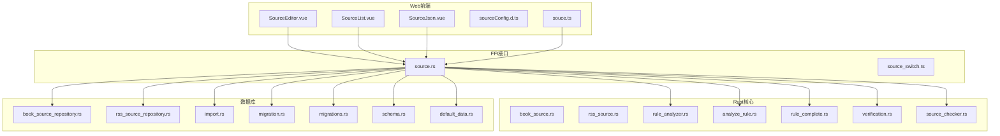
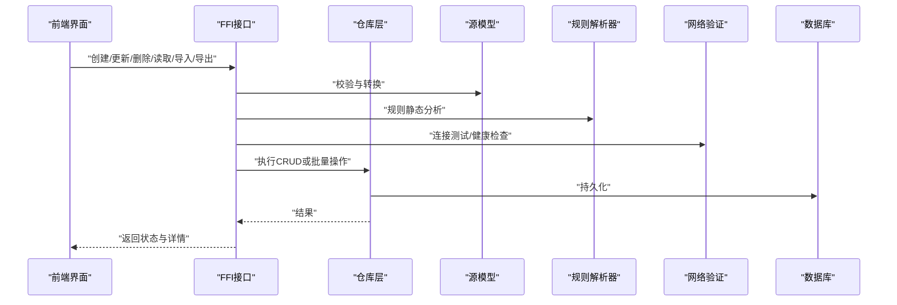
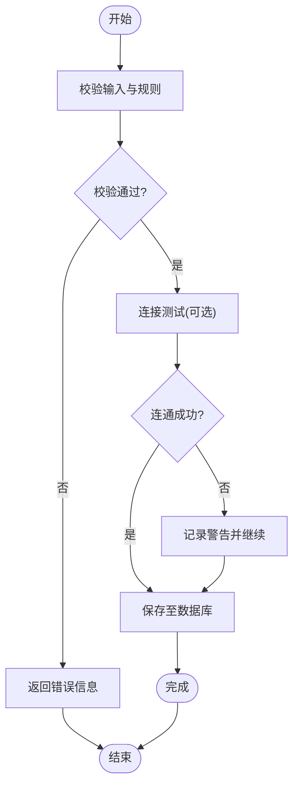
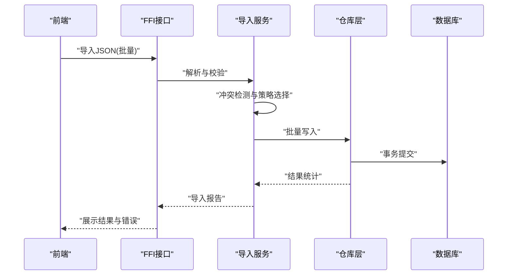
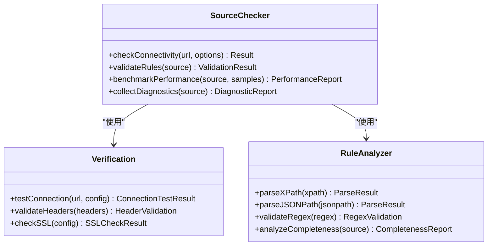
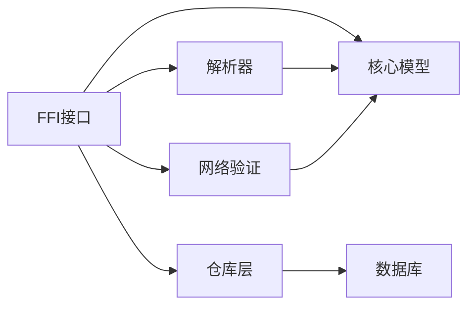

# 源管理功能

<cite>
**本文引用的文件**   
- [book_source.rs](file://rust/legado-core/src/models/book_source.rs)
- [rss_source.rs](file://rust/legado-core/src/models/rss_source.rs)
- [source.rs](file://rust/legado-ffi/src/api/source.rs)
- [source_switch.rs](file://rust/legado-ffi/src/api/source_switch.rs)
- [book_source_repository.rs](file://rust/legado-db/src/repository/book_source_repository.rs)
- [rss_source_repository.rs](file://rust/legado-db/src/repository/rss_source_repository.rs)
- [import.rs](file://rust/legado-db/src/import.rs)
- [migration.rs](file://rust/legado-db/src/migration.rs)
- [migrations.rs](file://rust/legado-db/src/migration/migrations.rs)
- [schema.rs](file://rust/legado-db/src/schema.rs)
- [default_data.rs](file://rust/legado-db/src/default_data.rs)
- [rule_analyzer.rs](file://rust/legado-parser/src/rule_analyzer.rs)
- [analyze_rule.rs](file://rust/legado-parser/src/analyze_rule.rs)
- [rule_complete.rs](file://rust/legado-parser/src/rule_complete.rs)
- [verification.rs](file://rust/legado-net/src/verification.rs)
- [source_checker.rs](file://rust/legado-net/src/source_checker.rs)
- [SourceJson.vue](file://modules/web/src/components/SourceJson.vue)
- [SourceList.vue](file://modules/web/src/components/SourceList.vue)
- [SourceEditor.vue](file://modules/web/src/views/SourceEditor.vue)
- [sourceConfig.d.ts](file://modules/web/src/config/sourceConfig.d.ts)
- [souce.ts](file://modules/web/src/utils/souce.ts)
</cite>

## 目录
1. [简介](#简介)
2. [项目结构](#项目结构)
3. [核心组件](#核心组件)
4. [架构总览](#架构总览)
5. [详细组件分析](#详细组件分析)
6. [依赖分析](#依赖分析)
7. [性能考虑](#性能考虑)
8. [故障排除指南](#故障排除指南)
9. [结论](#结论)
10. [附录](#附录)

## 简介
本文件面向Legado的“源管理”能力，聚焦书籍源的CRUD（创建、读取、更新、删除）流程、源配置结构与验证规则、导入导出规范与冲突处理、版本兼容策略，以及连接测试、规则检查、性能评估与错误诊断。文档同时覆盖Web端编辑界面与Rust后端的数据流与调用链，帮助开发者与高级用户高效使用与维护源。

## 项目结构
Legado的源管理由多模块协作完成：
- Rust核心模型与数据访问：定义源数据结构、数据库表结构、迁移与默认数据、仓库层操作。
- FFI接口：对外暴露源管理的API（增删改查、切换、导入导出）。
- 解析器：对源规则进行静态分析与完整性校验。
- 网络层：提供连接测试、超时重试、速率限制等能力。
- Web前端：提供JSON编辑、列表管理、编辑器视图与工具函数。

图表来源
- [SourceEditor.vue](file://modules/web/src/views/SourceEditor.vue)
- [SourceList.vue](file://modules/web/src/components/SourceList.vue)
- [SourceJson.vue](file://modules/web/src/components/SourceJson.vue)
- [sourceConfig.d.ts](file://modules/web/src/config/sourceConfig.d.ts)
- [souce.ts](file://modules/web/src/utils/souce.ts)
- [source.rs](file://rust/legado-ffi/src/api/source.rs)
- [source_switch.rs](file://rust/legado-ffi/src/api/source_switch.rs)
- [book_source.rs](file://rust/legado-core/src/models/book_source.rs)
- [rss_source.rs](file://rust/legado-core/src/models/rss_source.rs)
- [rule_analyzer.rs](file://rust/legado-parser/src/rule_analyzer.rs)
- [analyze_rule.rs](file://rust/legado-parser/src/analyze_rule.rs)
- [rule_complete.rs](file://rust/legado-parser/src/rule_complete.rs)
- [verification.rs](file://rust/legado-net/src/verification.rs)
- [source_checker.rs](file://rust/legado-net/src/source_checker.rs)
- [book_source_repository.rs](file://rust/legado-db/src/repository/book_source_repository.rs)
- [rss_source_repository.rs](file://rust/legado-db/src/repository/rss_source_repository.rs)
- [import.rs](file://rust/legado-db/src/import.rs)
- [migration.rs](file://rust/legado-db/src/migration.rs)
- [migrations.rs](file://rust/legado-db/src/migration/migrations.rs)
- [schema.rs](file://rust/legado-db/src/schema.rs)
- [default_data.rs](file://rust/legado-db/src/default_data.rs)

章节来源
- [book_source.rs](file://rust/legado-core/src/models/book_source.rs)
- [rss_source.rs](file://rust/legado-core/src/models/rss_source.rs)
- [source.rs](file://rust/legado-ffi/src/api/source.rs)
- [book_source_repository.rs](file://rust/legado-db/src/repository/book_source_repository.rs)
- [import.rs](file://rust/legado-db/src/import.rs)
- [migration.rs](file://rust/legado-db/src/migration.rs)
- [migrations.rs](file://rust/legado-db/src/migration/migrations.rs)
- [schema.rs](file://rust/legado-db/src/schema.rs)
- [default_data.rs](file://rust/legado-db/src/default_data.rs)
- [rule_analyzer.rs](file://rust/legado-parser/src/rule_analyzer.rs)
- [analyze_rule.rs](file://rust/legado-parser/src/analyze_rule.rs)
- [rule_complete.rs](file://rust/legado-parser/src/rule_complete.rs)
- [verification.rs](file://rust/legado-net/src/verification.rs)
- [source_checker.rs](file://rust/legado-net/src/source_checker.rs)
- [SourceJson.vue](file://modules/web/src/components/SourceJson.vue)
- [SourceList.vue](file://modules/web/src/components/SourceList.vue)
- [SourceEditor.vue](file://modules/web/src/views/SourceEditor.vue)
- [sourceConfig.d.ts](file://modules/web/src/config/sourceConfig.d.ts)
- [souce.ts](file://modules/web/src/utils/souce.ts)

## 核心组件
- 源模型与类型
  - 书籍源模型：定义书籍源的字段、默认值、校验与序列化格式。
  - RSS源模型：用于RSS订阅源的元数据与规则。
- 数据访问层
  - 书籍源仓库：实现CRUD、批量操作、按条件查询与事务封装。
  - RSS源仓库：同书籍源仓库类似，但针对RSS场景。
- 导入导出
  - 统一导入入口：支持JSON批量导入、冲突策略（跳过/覆盖/合并）、版本兼容性检测。
- 规则分析
  - 规则静态分析：语法检查、必填项校验、XPath/JSONPath/正则表达式有效性。
  - 规则补全：缺失字段提示与默认值填充。
- 网络验证
  - 连接测试：HTTP连通性、超时、代理、SSL配置。
  - 源健康检查：请求成功率、响应时间、分页与内容抓取可用性。
- Web前端
  - JSON编辑器：直接编辑源JSON，实时校验与格式化。
  - 源列表：展示、搜索、排序、批量操作。
  - 编辑器视图：可视化编辑常用字段与规则。

章节来源
- [book_source.rs](file://rust/legado-core/src/models/book_source.rs)
- [rss_source.rs](file://rust/legado-core/src/models/rss_source.rs)
- [book_source_repository.rs](file://rust/legado-db/src/repository/book_source_repository.rs)
- [rss_source_repository.rs](file://rust/legado-db/src/repository/rss_source_repository.rs)
- [import.rs](file://rust/legado-db/src/import.rs)
- [rule_analyzer.rs](file://rust/legado-parser/src/rule_analyzer.rs)
- [analyze_rule.rs](file://rust/legado-parser/src/analyze_rule.rs)
- [rule_complete.rs](file://rust/legado-parser/src/rule_complete.rs)
- [verification.rs](file://rust/legado-net/src/verification.rs)
- [source_checker.rs](file://rust/legado-net/src/source_checker.rs)
- [SourceJson.vue](file://modules/web/src/components/SourceJson.vue)
- [SourceList.vue](file://modules/web/src/components/SourceList.vue)
- [SourceEditor.vue](file://modules/web/src/views/SourceEditor.vue)
- [sourceConfig.d.ts](file://modules/web/src/config/sourceConfig.d.ts)
- [souce.ts](file://modules/web/src/utils/souce.ts)

## 架构总览
源管理贯穿“前端—FFI—核心模型—仓库—解析器—网络”的完整链路。前端通过FFI接口发起操作，核心模型负责数据契约，仓库层持久化到数据库，解析器进行规则校验，网络层进行连通性与性能测试。

图表来源
- [source.rs](file://rust/legado-ffi/src/api/source.rs)
- [book_source_repository.rs](file://rust/legado-db/src/repository/book_source_repository.rs)
- [book_source.rs](file://rust/legado-core/src/models/book_source.rs)
- [rule_analyzer.rs](file://rust/legado-parser/src/rule_analyzer.rs)
- [verification.rs](file://rust/legado-net/src/verification.rs)

## 详细组件分析

### 书籍源CRUD流程
- 创建
  - 前端提交源JSON，FFI接收后进行模型映射与必填字段校验。
  - 规则解析器对XPath/JSONPath/正则进行语法检查。
  - 可选执行连接测试与健康检查。
  - 仓库层写入数据库并返回ID。
- 读取
  - 支持按ID、名称、分组、标签等多条件查询。
  - 支持分页与排序。
- 更新
  - 增量更新：仅更新变更字段。
  - 规则重新分析，必要时触发连接测试。
- 删除
  - 软删除或硬删除策略，确保无引用冲突。
  - 清理相关缓存与索引。

图表来源
- [source.rs](file://rust/legado-ffi/src/api/source.rs)
- [book_source_repository.rs](file://rust/legado-db/src/repository/book_source_repository.rs)
- [rule_analyzer.rs](file://rust/legado-parser/src/rule_analyzer.rs)
- [verification.rs](file://rust/legado-net/src/verification.rs)

章节来源
- [source.rs](file://rust/legado-ffi/src/api/source.rs)
- [book_source_repository.rs](file://rust/legado-db/src/repository/book_source_repository.rs)
- [rule_analyzer.rs](file://rust/legado-parser/src/rule_analyzer.rs)
- [verification.rs](file://rust/legado-net/src/verification.rs)

### 源配置结构
- 字段定义
  - 基础信息：名称、作者、主页URL、分类、标签、描述、语言、版本。
  - 网络设置：请求头、Cookie策略、User-Agent、代理、SSL配置、超时。
  - 规则字段：首页规则、分类规则、详情页规则、目录规则、正文规则、搜索规则、翻页规则、链接规则、图片规则等。
  - 行为控制：并发数、重试次数、延迟、是否启用缓存、是否允许登录态。
- 验证规则
  - 必填字段：名称、主页URL、关键规则（如目录/正文）。
  - 格式校验：URL合法性、正则表达式语法、XPath/JSONPath有效性。
  - 逻辑校验：避免死循环翻页、空结果集、重复键。
- 默认值设置
  - 网络默认：超时、重试、UA、编码。
  - 规则默认：常见选择器、正则模板、分页起始页。
- 数据迁移策略
  - 版本字段驱动迁移：根据版本号应用迁移脚本。
  - 兼容层：旧字段到新字段的映射与降级处理。
  - 回滚策略：失败时保留原数据并记录日志。

章节来源
- [book_source.rs](file://rust/legado-core/src/models/book_source.rs)
- [schema.rs](file://rust/legado-db/src/schema.rs)
- [default_data.rs](file://rust/legado-db/src/default_data.rs)
- [migration.rs](file://rust/legado-db/src/migration.rs)
- [migrations.rs](file://rust/legado-db/src/migration/migrations.rs)

### 导入导出功能
- JSON格式规范
  - 单源对象：包含所有配置字段与规则。
  - 批量数组：多个源对象的集合。
  - 元数据：包含版本、来源、时间戳、签名（可选）。
- 批量操作
  - 分批导入：每批固定大小，失败重试与断点续传。
  - 进度回调：前端显示导入进度与统计。
- 冲突处理
  - 策略：跳过、覆盖、合并（字段级合并）。
  - 冲突检测：基于名称+主页URL去重。
- 版本兼容性
  - 版本比对：目标版本低于源版本时提示升级。
  - 字段弃用：旧字段自动迁移到新字段。
  - 规则降级：不支持的规则标记为警告。

图表来源
- [import.rs](file://rust/legado-db/src/import.rs)
- [book_source_repository.rs](file://rust/legado-db/src/repository/book_source_repository.rs)
- [source.rs](file://rust/legado-ffi/src/api/source.rs)

章节来源
- [import.rs](file://rust/legado-db/src/import.rs)
- [book_source_repository.rs](file://rust/legado-db/src/repository/book_source_repository.rs)
- [source.rs](file://rust/legado-ffi/src/api/source.rs)

### 源验证机制
- 连接测试
  - 探测主页可达性、HTTP状态码、响应时间。
  - 代理与SSL配置验证。
- 规则检查
  - 静态分析：XPath/JSONPath/正则语法正确性。
  - 动态抽样：抓取少量页面验证规则匹配率。
- 性能评估
  - 并发与限流：最大并发、请求间隔、重试策略。
  - 资源占用：内存峰值、CPU使用率、网络带宽。
- 错误诊断
  - 错误分类：网络错误、规则错误、数据异常。
  - 日志采集：请求/响应摘要、错误堆栈、上下文信息。

图表来源
- [source_checker.rs](file://rust/legado-net/src/source_checker.rs)
- [verification.rs](file://rust/legado-net/src/verification.rs)
- [rule_analyzer.rs](file://rust/legado-parser/src/rule_analyzer.rs)
- [analyze_rule.rs](file://rust/legado-parser/src/analyze_rule.rs)
- [rule_complete.rs](file://rust/legado-parser/src/rule_complete.rs)

章节来源
- [source_checker.rs](file://rust/legado-net/src/source_checker.rs)
- [verification.rs](file://rust/legado-net/src/verification.rs)
- [rule_analyzer.rs](file://rust/legado-parser/src/rule_analyzer.rs)
- [analyze_rule.rs](file://rust/legado-parser/src/analyze_rule.rs)
- [rule_complete.rs](file://rust/legado-parser/src/rule_complete.rs)

### Web端源管理界面
- JSON编辑器
  - 直接编辑源JSON，支持语法高亮、格式化、校验提示。
  - 实时预览规则匹配结果（可选）。
- 源列表
  - 展示源名称、分类、状态、更新时间。
  - 支持搜索、排序、批量操作（启用/禁用/删除/导出）。
- 编辑器视图
  - 可视化编辑常用字段与规则。
  - 提供模板与示例源快速创建。

章节来源
- [SourceJson.vue](file://modules/web/src/components/SourceJson.vue)
- [SourceList.vue](file://modules/web/src/components/SourceList.vue)
- [SourceEditor.vue](file://modules/web/src/views/SourceEditor.vue)
- [sourceConfig.d.ts](file://modules/web/src/config/sourceConfig.d.ts)
- [souce.ts](file://modules/web/src/utils/souce.ts)

## 依赖分析
- 模块耦合
  - FFI接口依赖核心模型与仓库层，解耦前端与后端实现。
  - 解析器独立于网络层，可复用进行静态分析。
  - 网络验证模块可被其他功能复用（如下载、播放）。
- 外部依赖
  - HTTP客户端：Cronet/OkHttp（Android）、reqwest（Rust）。
  - 数据库：SQLite（Room/Rust SQLx）。
  - 解析库：XPath/JSONPath/正则引擎。
- 潜在循环依赖
  - 通过接口抽象避免循环引用。
  - 事件总线或回调模式解耦异步操作。

图表来源
- [source.rs](file://rust/legado-ffi/src/api/source.rs)
- [book_source.rs](file://rust/legado-core/src/models/book_source.rs)
- [book_source_repository.rs](file://rust/legado-db/src/repository/book_source_repository.rs)
- [rule_analyzer.rs](file://rust/legado-parser/src/rule_analyzer.rs)
- [verification.rs](file://rust/legado-net/src/verification.rs)

章节来源
- [source.rs](file://rust/legado-ffi/src/api/source.rs)
- [book_source.rs](file://rust/legado-core/src/models/book_source.rs)
- [book_source_repository.rs](file://rust/legado-db/src/repository/book_source_repository.rs)
- [rule_analyzer.rs](file://rust/legado-parser/src/rule_analyzer.rs)
- [verification.rs](file://rust/legado-net/src/verification.rs)

## 性能考虑
- 批量导入优化
  - 分批次写入，减少单次事务大小。
  - 使用UPSERT避免重复插入。
- 规则分析并行化
  - 多源规则分析使用线程池并行处理。
- 网络请求优化
  - 连接池复用、超时与重试策略调优。
  - 压缩传输（Gzip/Brotli）与缓存策略。
- 内存管理
  - 大文件流式处理，避免一次性加载。
  - 及时释放临时对象与缓冲区。

[本节为通用指导，不直接分析具体文件]

## 故障排除指南
- 常见问题
  - 连接失败：检查代理、SSL证书、防火墙设置。
  - 规则不匹配：验证XPath/JSONPath语法，检查页面结构变化。
  - 导入冲突：确认去重策略，手动解决冲突。
- 诊断步骤
  - 启用调试日志，捕获请求/响应与错误堆栈。
  - 使用连接测试工具验证网络配置。
  - 使用规则分析器检查规则有效性。
- 恢复措施
  - 回滚导入操作，恢复备份数据。
  - 禁用问题源，优先保证其他源可用。
  - 更新源版本或修复规则后重新导入。

章节来源
- [verification.rs](file://rust/legado-net/src/verification.rs)
- [rule_analyzer.rs](file://rust/legado-parser/src/rule_analyzer.rs)
- [import.rs](file://rust/legado-db/src/import.rs)

## 结论
Legado的源管理功能通过清晰的模块化设计与严格的验证机制，提供了稳定高效的书籍源管理能力。开发者可基于现有架构扩展新功能，用户可通过Web界面便捷地管理与维护源。遵循最佳实践与故障排除指南，可显著提升源的质量与稳定性。

[本节为总结，不直接分析具体文件]

## 附录
- 术语表
  - 源：指书籍或RSS的内容提供者，包含元数据与解析规则。
  - 规则：用于从网页中提取数据的表达式（XPath/JSONPath/正则）。
  - 导入导出：将源配置序列化为JSON并进行批量操作。
- 参考文件
  - 模型定义：书籍源与RSS源的结构与默认值。
  - 仓库操作：CRUD与批量操作的实现。
  - 解析器：规则静态分析与完整性检查。
  - 网络验证：连接测试与健康检查。
  - 前端界面：JSON编辑、列表管理与编辑器视图。

[本节为补充信息，不直接分析具体文件]