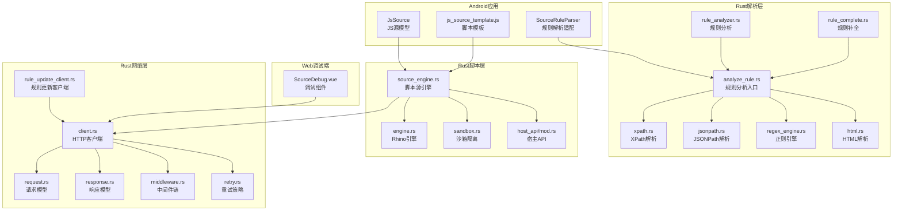
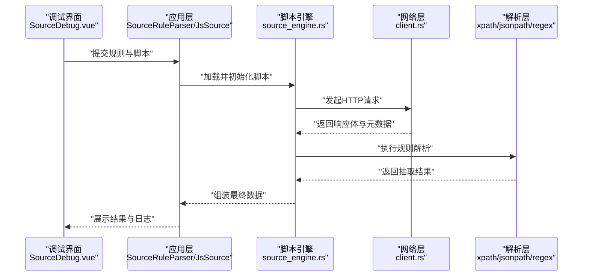
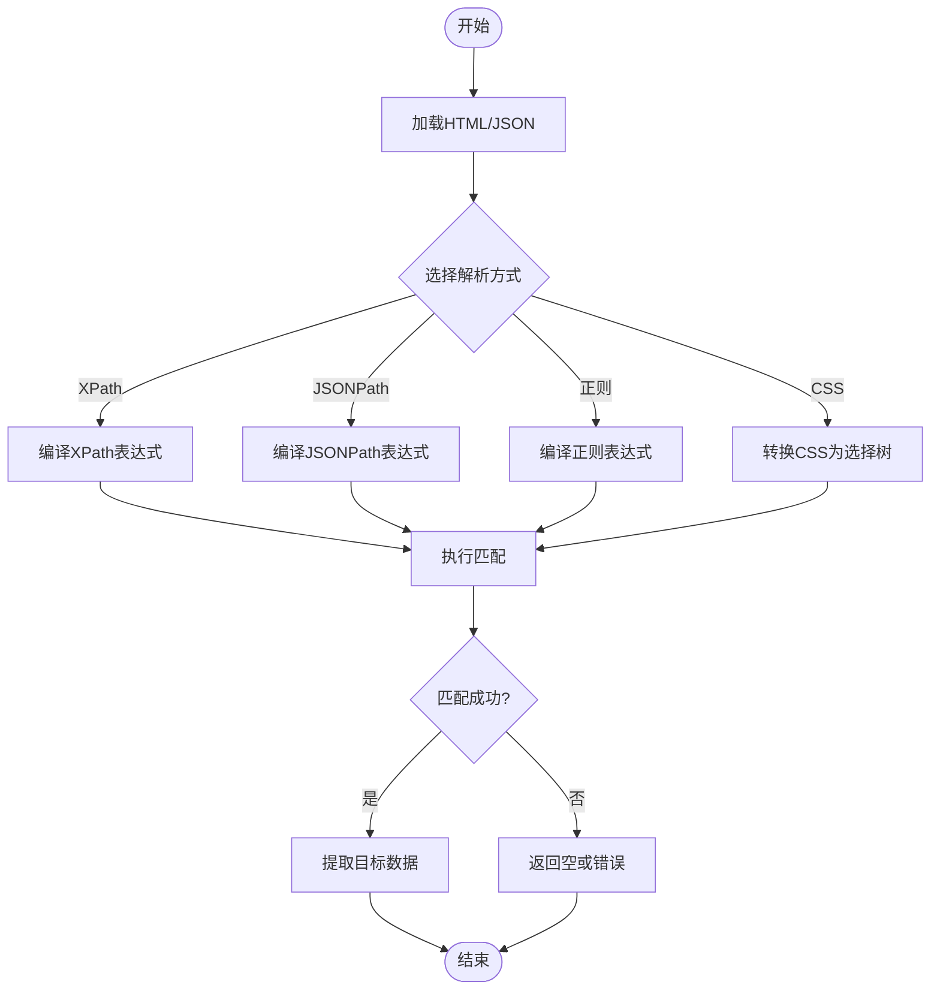
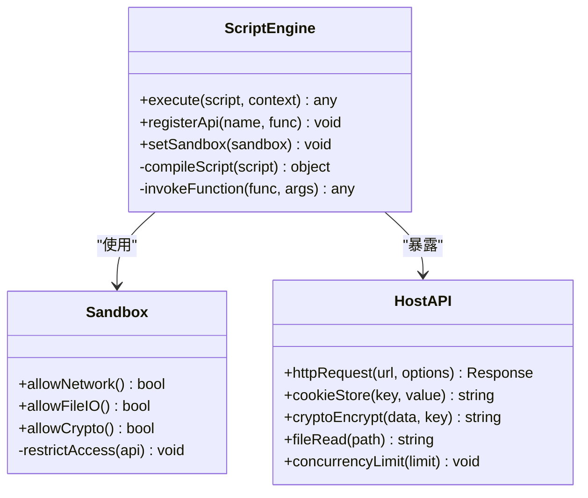
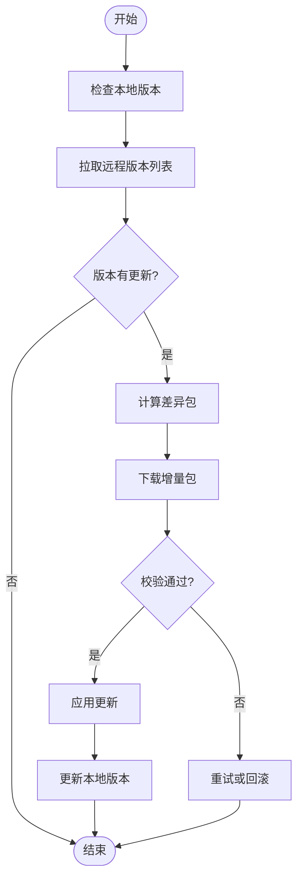
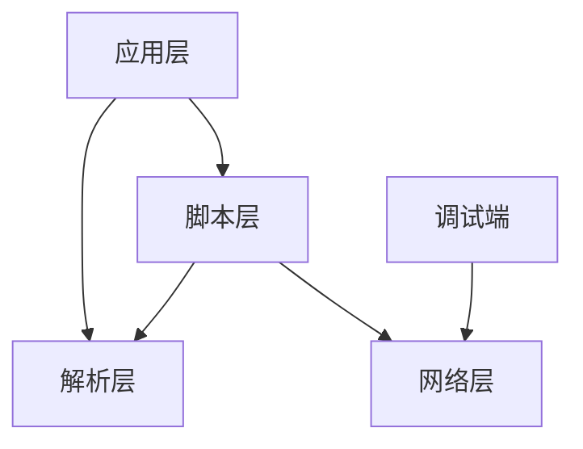

# 网络源系统

<cite>
**本文引用的文件**   
- [legado-parser/src/lib.rs](file://rust/legado-parser/src/lib.rs)
- [legado-parser/src/xpath.rs](file://rust/legado-parser/src/xpath.rs)
- [legado-parser/src/jsonpath.rs](file://rust/legado-parser/src/jsonpath.rs)
- [legado-parser/src/regex_engine.rs](file://rust/legado-parser/src/regex_engine.rs)
- [legado-parser/src/html.rs](file://rust/legado-parser/src/html.rs)
- [legado-parser/src/rule_analyzer.rs](file://rust/legado-parser/src/rule_analyzer.rs)
- [legado-parser/src/analyze_rule.rs](file://rust/legado-parser/src/analyze_rule.rs)
- [legado-parser/src/rule_complete.rs](file://rust/legado-parser/src/rule_complete.rs)
- [legado-js/src/engine.rs](file://rust/legado-js/src/engine.rs)
- [legado-js/src/sandbox.rs](file://rust/legado-js/src/sandbox.rs)
- [legado-js/src/source_engine.rs](file://rust/legado-js/src/source_engine.rs)
- [legado-js/src/host_api/mod.rs](file://rust/legado-js/src/host_api/mod.rs)
- [legado-net/src/client.rs](file://rust/legado-net/src/client.rs)
- [legado-net/src/request.rs](file://rust/legado-net/src/request.rs)
- [legado-net/src/response.rs](file://rust/legado-net/src/response.rs)
- [legado-net/src/middleware.rs](file://rust/legado-net/src/middleware.rs)
- [legado-net/src/retry.rs](file://rust/legado-net/src/retry.rs)
- [legado-net/src/rule_update_client.rs](file://rust/legado-net/src/rule_update客户端.rs)
- [app/src/main/java/io/legado/app/help/source/SourceRuleParser.kt](file://app/src/main/java/io/legado/app/help/source/SourceRuleParser.kt)
- [app/src/main/java/io/legado/app/model/jsSource/JsSource.kt](file://app/src/main/java/io/legado/app/model/jsSource/JsSource.kt)
- [app/src/main/assets/js_source_template.js](file://app/src/main/assets/js_source_template.js)
- [modules/web/src/components/SourceDebug.vue](file://modules/web/src/components/SourceDebug.vue)
</cite>

## 目录
1. [简介](#简介)
2. [项目结构](#项目结构)
3. [核心组件](#核心组件)
4. [架构总览](#架构总览)
5. [详细组件分析](#详细组件分析)
6. [依赖关系分析](#依赖关系分析)
7. [性能考量](#性能考量)
8. [故障排除指南](#故障排除指南)
9. [结论](#结论)
10. [附录](#附录)

## 简介
本技术文档面向Legado的网络源系统，系统性阐述基于规则的网页解析引擎（XPath、JSONPath、正则表达式与CSS选择器）、JavaScript脚本扩展机制（Rhino集成、API接口、异步与错误处理）、自动更新机制（规则版本管理、增量更新与冲突解决），以及调试工具（请求日志、响应预览、规则测试与性能分析）。文档同时提供规则编写指南、最佳实践与常见问题排查方法，帮助开发者快速构建稳定高效的网络源。

## 项目结构
Legado的网络源系统由多模块协作构成：
- Rust解析层（legado-parser）：实现XPath、JSONPath、正则表达式与HTML解析，以及规则分析与补全。
- Rust脚本层（legado-js）：集成Rhino引擎，提供沙箱执行环境、宿主API桥接与脚本源引擎调度。
- Rust网络层（legado-net）：封装HTTP客户端、请求/响应模型、中间件链、重试策略与规则更新客户端。
- Android应用层（app）：规则解析Kotlin适配、JS源模型定义、模板脚本与UI交互。
- Web调试端（modules/web）：提供在线调试界面，支持规则测试与结果预览。

图表来源
- [legado-parser/src/lib.rs](file://rust/legado-parser/src/lib.rs)
- [legado-parser/src/xpath.rs](file://rust/legado-parser/src/xpath.rs)
- [legado-parser/src/jsonpath.rs](file://rust/legado-parser/src/jsonpath.rs)
- [legado-parser/src/regex_engine.rs](file://rust/legado-parser/src/regex_engine.rs)
- [legado-parser/src/html.rs](file://rust/legado-parser/src/html.rs)
- [legado-parser/src/rule_analyzer.rs](file://rust/legado-parser/src/rule_analyzer.rs)
- [legado-parser/src/analyze_rule.rs](file://rust/legado-parser/src/analyze_rule.rs)
- [legado-parser/src/rule_complete.rs](file://rust/legado-parser/src/rule_complete.rs)
- [legado-js/src/engine.rs](file://rust/legado-js/src/engine.rs)
- [legado-js/src/sandbox.rs](file://rust/legado-js/src/sandbox.rs)
- [legado-js/src/source_engine.rs](file://rust/legado-js/src/source_engine.rs)
- [legado-js/src/host_api/mod.rs](file://rust/legado-js/src/host_api/mod.rs)
- [legado-net/src/client.rs](file://rust/legado-net/src/client.rs)
- [legado-net/src/request.rs](file://rust/legado-net/src/request.rs)
- [legado-net/src/response.rs](file://rust/legado-net/src/response.rs)
- [legado-net/src/middleware.rs](file://rust/legado-net/src/middleware.rs)
- [legado-net/src/retry.rs](file://rust/legado-net/src/retry.rs)
- [legado-net/src/rule_update_client.rs](file://rust/legado-net/src/rule_update客户端.rs)
- [app/src/main/java/io/legado/app/help/source/SourceRuleParser.kt](file://app/src/main/java/io/legado/app/help/source/SourceRuleParser.kt)
- [app/src/main/java/io/legado/app/model/jsSource/JsSource.kt](file://app/src/main/java/io/legado/app/model/jsSource/JsSource.kt)
- [app/src/main/assets/js_source_template.js](file://app/src/main/assets/js_source_template.js)
- [modules/web/src/components/SourceDebug.vue](file://modules/web/src/components/SourceDebug.vue)

章节来源
- [legado-parser/src/lib.rs](file://rust/legado-parser/src/lib.rs)
- [legado-js/src/source_engine.rs](file://rust/legado-js/src/source_engine.rs)
- [legado-net/src/client.rs](file://rust/legado-net/src/client.rs)
- [app/src/main/java/io/legado/app/help/source/SourceRuleParser.kt](file://app/src/main/java/io/legado/app/help/source/SourceRuleParser.kt)
- [app/src/main/java/io/legado/app/model/jsSource/JsSource.kt](file://app/src/main/java/io/legado/app/model/jsSource/JsSource.kt)
- [modules/web/src/components/SourceDebug.vue](file://modules/web/src/components/SourceDebug.vue)

## 核心组件
- 规则解析引擎（XPath/JSONPath/正则/CSS选择器）
  - XPath：用于HTML节点定位与属性提取，支持路径、谓词与函数扩展。
  - JSONPath：用于结构化数据抽取，支持数组索引、对象字段与过滤表达式。
  - 正则表达式：用于文本模式匹配与内容清洗，提供捕获组与替换能力。
  - CSS选择器：作为便捷选择语法，映射到内部选择树以提升易用性。
- JavaScript脚本扩展（Rhino引擎）
  - Rhino集成：在沙箱中安全执行用户脚本，暴露宿主API供调用。
  - API接口：网络请求、Cookie管理、加密解密、文件IO、并发控制等。
  - 异步处理：基于回调或Promise风格的异步调用，避免阻塞主线程。
  - 错误处理：统一异常捕获与堆栈信息输出，便于定位问题。
- 自动更新机制
  - 规则版本管理：通过版本号与校验和确保一致性。
  - 增量更新策略：仅拉取变更部分，降低带宽与时间开销。
  - 冲突解决：合并策略与回滚机制保障稳定性。
- 调试工具
  - 请求日志：记录URL、头、体、耗时与状态码。
  - 响应预览：可视化展示原始响应与解析结果。
  - 规则测试：在线输入样本，验证选择器与正则的匹配效果。
  - 性能分析：统计各阶段耗时与内存占用，辅助优化。

章节来源
- [legado-parser/src/xpath.rs](file://rust/legado-parser/src/xpath.rs)
- [legado-parser/src/jsonpath.rs](file://rust/legado-parser/src/jsonpath.rs)
- [legado-parser/src/regex_engine.rs](file://rust/legado-parser/src/regex_engine.rs)
- [legado-parser/src/html.rs](file://rust/legado-parser/src/html.rs)
- [legado-js/src/engine.rs](file://rust/legado-js/src/engine.rs)
- [legado-js/src/sandbox.rs](file://rust/legado-js/src/sandbox.rs)
- [legado-js/src/host_api/mod.rs](file://rust/legado-js/src/host_api/mod.rs)
- [legado-net/src/rule_update_client.rs](file://rust/legado-net/src/rule_update客户端.rs)
- [modules/web/src/components/SourceDebug.vue](file://modules/web/src/components/SourceDebug.vue)

## 架构总览
网络源系统的整体流程如下：
- Android应用层将规则与脚本交由Rust解析层与脚本层处理。
- 脚本层通过宿主API调用网络层发起请求，获取响应后交由解析层进行抽取。
- 解析层根据XPath/JSONPath/正则/CSS选择器生成匹配结果。
- 调试端提供可视化界面，支持实时查看请求与响应，并测试规则有效性。

图表来源
- [modules/web/src/components/SourceDebug.vue](file://modules/web/src/components/SourceDebug.vue)
- [app/src/main/java/io/legado/app/help/source/SourceRuleParser.kt](file://app/src/main/java/io/legado/app/help/source/SourceRuleParser.kt)
- [app/src/main/java/io/legado/app/model/jsSource/JsSource.kt](file://app/src/main/java/io/legado/app/model/jsSource/JsSource.kt)
- [legado-js/src/source_engine.rs](file://rust/legado-js/src/source_engine.rs)
- [legado-net/src/client.rs](file://rust/legado-net/src/client.rs)
- [legado-parser/src/xpath.rs](file://rust/legado-parser/src/xpath.rs)
- [legado-parser/src/jsonpath.rs](file://rust/legado-parser/src/jsonpath.rs)
- [legado-parser/src/regex_engine.rs](file://rust/legado-parser/src/regex_engine.rs)

## 详细组件分析

### 规则解析引擎（XPath/JSONPath/正则/CSS选择器）
- XPath解析
  - 功能：对HTML DOM进行节点定位、属性读取与文本提取。
  - 复杂度：路径遍历O(n)，谓词过滤O(m)，函数扩展常数级。
  - 优化：缓存已编译的路径表达式，减少重复解析开销。
- JSONPath解析
  - 功能：对JSON结构进行字段访问、数组索引与条件过滤。
  - 复杂度：线性扫描与递归遍历结合，平均O(n)。
  - 优化：预编译查询路径，支持短路求值。
- 正则表达式
  - 功能：文本模式匹配、分组捕获与替换清洗。
  - 复杂度：NFA/DFA匹配，最坏O(n^2)，建议限制回溯深度。
  - 优化：使用非贪婪匹配与锚点，避免灾难性回溯。
- CSS选择器
  - 功能：以常见选择器语法简化节点定位，内部转换为选择树。
  - 复杂度：与DOM规模相关，通常O(n)。
  - 优化：优先使用ID与类选择器，减少层级遍历。

图表来源
- [legado-parser/src/xpath.rs](file://rust/legado-parser/src/xpath.rs)
- [legado-parser/src/jsonpath.rs](file://rust/legado-parser/src/jsonpath.rs)
- [legado-parser/src/regex_engine.rs](file://rust/legado-parser/src/regex_engine.rs)
- [legado-parser/src/html.rs](file://rust/legado-parser/src/html.rs)

章节来源
- [legado-parser/src/xpath.rs](file://rust/legado-parser/src/xpath.rs)
- [legado-parser/src/jsonpath.rs](file://rust/legado-parser/src/jsonpath.rs)
- [legado-parser/src/regex_engine.rs](file://rust/legado-parser/src/regex_engine.rs)
- [legado-parser/src/html.rs](file://rust/legado-parser/src/html.rs)

### JavaScript脚本扩展机制（Rhino引擎）
- Rhino集成
  - 在沙箱环境中执行用户脚本，限制危险API访问。
  - 提供上下文绑定，注入宿主API与全局变量。
- API调用接口
  - 网络请求：封装HTTP客户端，支持GET/POST、头设置与超时。
  - Cookie管理：持久化与同步Cookie，维持会话状态。
  - 加密解密：提供常用算法接口，便于处理签名与密文。
  - 文件IO：读写本地文件，用于缓存与配置。
  - 并发控制：限流与队列管理，避免资源竞争。
- 异步处理
  - 支持回调与Promise风格，保证非阻塞执行。
  - 错误传播：异常向上抛出，统一捕获与记录。
- 错误处理
  - 捕获脚本运行时异常，输出堆栈与上下文信息。
  - 提供降级策略，如默认值与重试。

图表来源
- [legado-js/src/engine.rs](file://rust/legado-js/src/engine.rs)
- [legado-js/src/sandbox.rs](file://rust/legado-js/src/sandbox.rs)
- [legado-js/src/host_api/mod.rs](file://rust/legado-js/src/host_api/mod.rs)

章节来源
- [legado-js/src/engine.rs](file://rust/legado-js/src/engine.rs)
- [legado-js/src/sandbox.rs](file://rust/legado-js/src/sandbox.rs)
- [legado-js/src/host_api/mod.rs](file://rust/legado-js/src/host_api/mod.rs)

### 自动更新机制（规则版本管理、增量更新、冲突解决）
- 版本管理
  - 每个规则包含版本号与校验和，确保一致性。
  - 服务端提供版本列表与差异包。
- 增量更新
  - 比较本地与服务端版本，仅下载变更部分。
  - 支持断点续传与失败重试。
- 冲突解决
  - 合并策略：按优先级与时间戳决定保留版本。
  - 回滚机制：检测到异常时自动回滚到上一版本。

图表来源
- [legado-net/src/rule_update_client.rs](file://rust/legado-net/src/rule_update客户端.rs)

章节来源
- [legado-net/src/rule_update_client.rs](file://rust/legado-net/src/rule_update客户端.rs)

### 调试工具（请求日志、响应预览、规则测试、性能分析）
- 请求日志
  - 记录URL、方法、头、体、耗时与状态码。
  - 支持过滤与导出，便于离线分析。
- 响应预览
  - 可视化展示原始响应与解析结果。
  - 支持折叠与搜索，提升可读性。
- 规则测试
  - 在线输入样本，验证选择器与正则的匹配效果。
  - 提供错误提示与修复建议。
- 性能分析
  - 统计各阶段耗时与内存占用。
  - 识别瓶颈并提供优化建议。

章节来源
- [modules/web/src/components/SourceDebug.vue](file://modules/web/src/components/SourceDebug.vue)

## 依赖关系分析
网络源系统的依赖关系如下：
- 应用层依赖解析层与脚本层，负责规则与脚本的加载与调度。
- 脚本层依赖网络层与解析层，执行脚本逻辑并调用API。
- 网络层独立于其他层，提供通用的HTTP能力。
- 调试端依赖网络层，用于实时调试与测试。

图表来源
- [app/src/main/java/io/legado/app/help/source/SourceRuleParser.kt](file://app/src/main/java/io/legado/app/help/source/SourceRuleParser.kt)
- [app/src/main/java/io/legado/app/model/jsSource/JsSource.kt](file://app/src/main/java/io/legado/app/model/jsSource/JsSource.kt)
- [legado-parser/src/lib.rs](file://rust/legado-parser/src/lib.rs)
- [legado-js/src/source_engine.rs](file://rust/legado-js/src/source_engine.rs)
- [legado-net/src/client.rs](file://rust/legado-net/src/client.rs)
- [modules/web/src/components/SourceDebug.vue](file://modules/web/src/components/SourceDebug.vue)

章节来源
- [app/src/main/java/io/legado/app/help/source/SourceRuleParser.kt](file://app/src/main/java/io/legado/app/help/source/SourceRuleParser.kt)
- [app/src/main/java/io/legado/app/model/jsSource/JsSource.kt](file://app/src/main/java/io/legado/app/model/jsSource/JsSource.kt)
- [legado-parser/src/lib.rs](file://rust/legado-parser/src/lib.rs)
- [legado-js/src/source_engine.rs](file://rust/legado-js/src/source_engine.rs)
- [legado-net/src/client.rs](file://rust/legado-net/src/client.rs)
- [modules/web/src/components/SourceDebug.vue](file://modules/web/src/components/SourceDebug.vue)

## 性能考量
- 解析优化
  - 预编译XPath/JSONPath表达式，减少重复解析。
  - 使用非贪婪正则与锚点，避免回溯爆炸。
- 网络优化
  - 连接池复用与HTTP/2支持，提升吞吐。
  - 压缩传输与缓存策略，降低延迟。
- 脚本优化
  - 限制并发与内存使用，防止资源耗尽。
  - 异步执行与批量处理，提升响应速度。
- 调试优化
  - 按需启用日志，避免I/O瓶颈。
  - 采样性能指标，减少监控开销。

## 故障排除指南
- 规则解析失败
  - 检查XPath/JSONPath语法是否正确。
  - 验证HTML/JSON结构与预期一致。
  - 使用调试工具的规则测试功能定位问题。
- 脚本执行错误
  - 查看错误堆栈与上下文信息。
  - 检查API调用参数与返回值类型。
  - 确认沙箱权限是否足够。
- 网络请求异常
  - 检查URL与头设置是否正确。
  - 验证Cookie与认证状态。
  - 查看重试策略与超时配置。
- 更新失败
  - 校验版本与校验和。
  - 检查网络连接与服务器状态。
  - 尝试回滚到上一版本。

章节来源
- [legado-parser/src/analyze_rule.rs](file://rust/legado-parser/src/analyze_rule.rs)
- [legado-js/src/engine.rs](file://rust/legado-js/src/engine.rs)
- [legado-net/src/client.rs](file://rust/legado-net/src/client.rs)
- [legado-net/src/retry.rs](file://rust/legado-net/src/retry.rs)

## 结论
Legado的网络源系统通过模块化设计与强大的解析能力，提供了灵活高效的网页抓取解决方案。XPath、JSONPath、正则与CSS选择器的组合满足了多样化的数据抽取需求；JavaScript脚本扩展机制增强了自定义能力；自动更新机制保障了规则的时效性与稳定性；调试工具则大幅降低了开发与维护成本。遵循最佳实践与故障排除方法，开发者可以快速构建可靠的网络源。

## 附录
- 规则编写指南
  - 优先使用XPath/JSONPath进行结构化抽取。
  - 合理使用正则进行文本清洗与补充。
  - 避免复杂嵌套与深层选择，提升性能。
- 最佳实践
  - 使用常量与配置分离，便于维护。
  - 添加注释与示例，提高可读性。
  - 进行单元测试与集成测试，确保稳定性。
- 常见问题
  - 编码问题：确保正确设置字符集。
  - 反爬策略：模拟浏览器行为与频率控制。
  - 动态内容：结合脚本与渲染引擎处理。