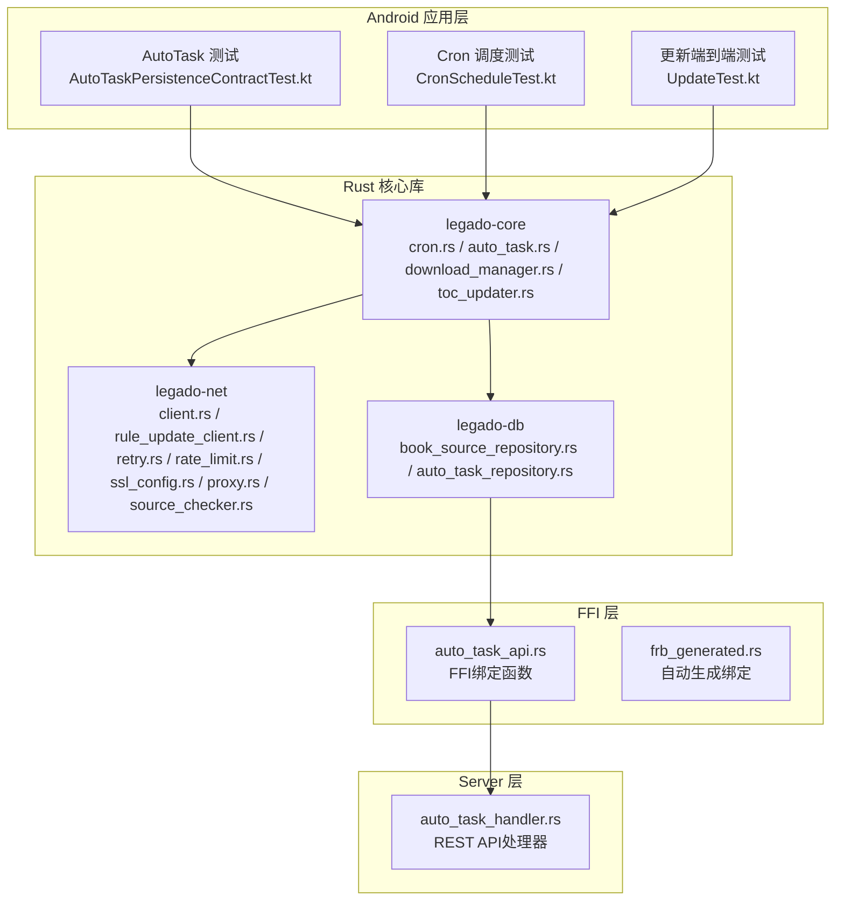
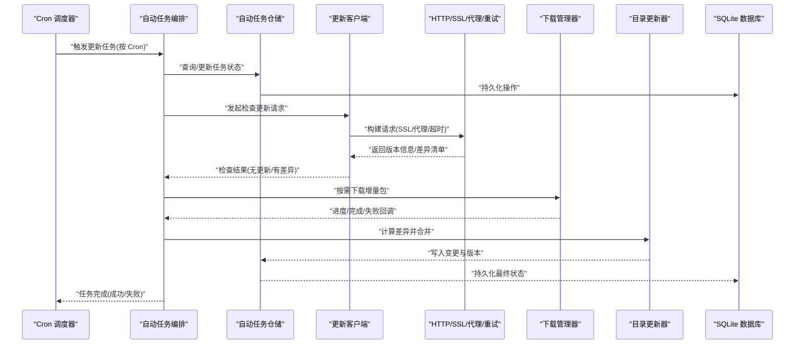
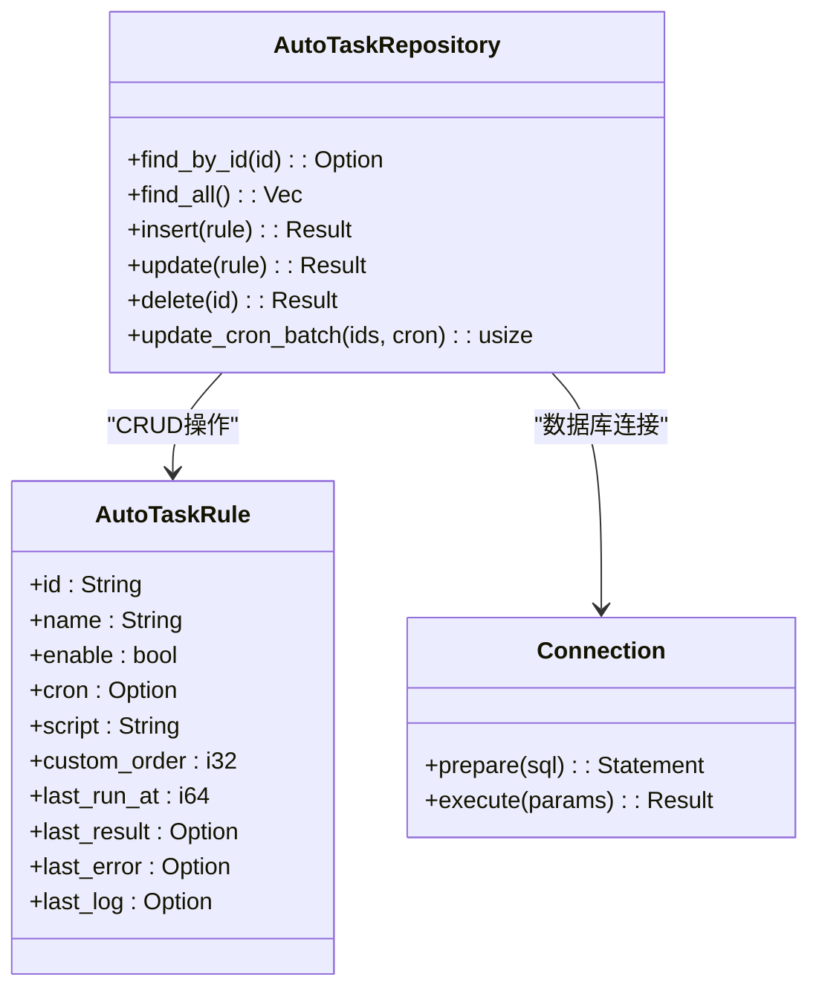
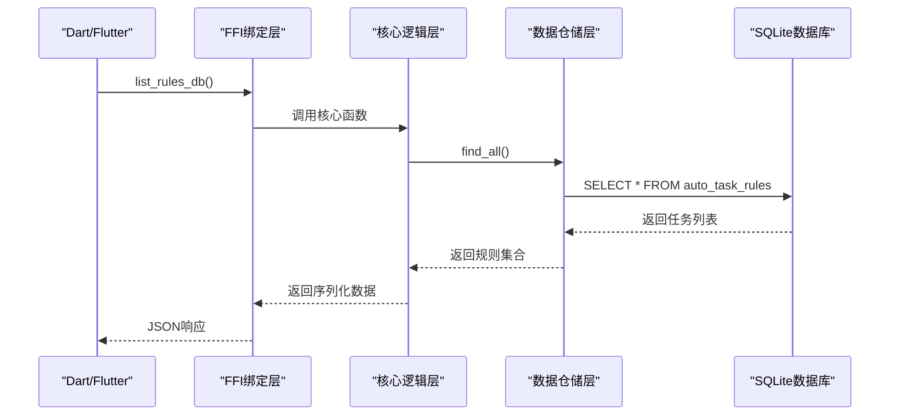
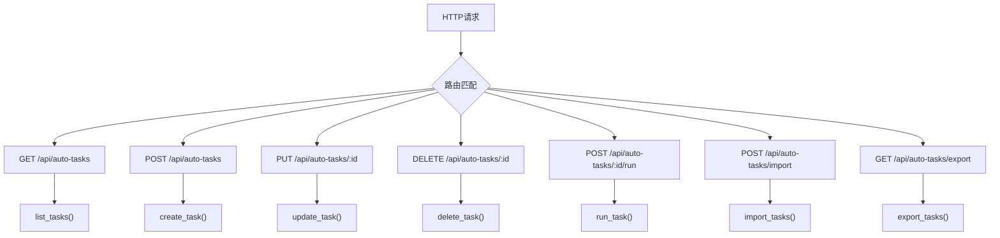
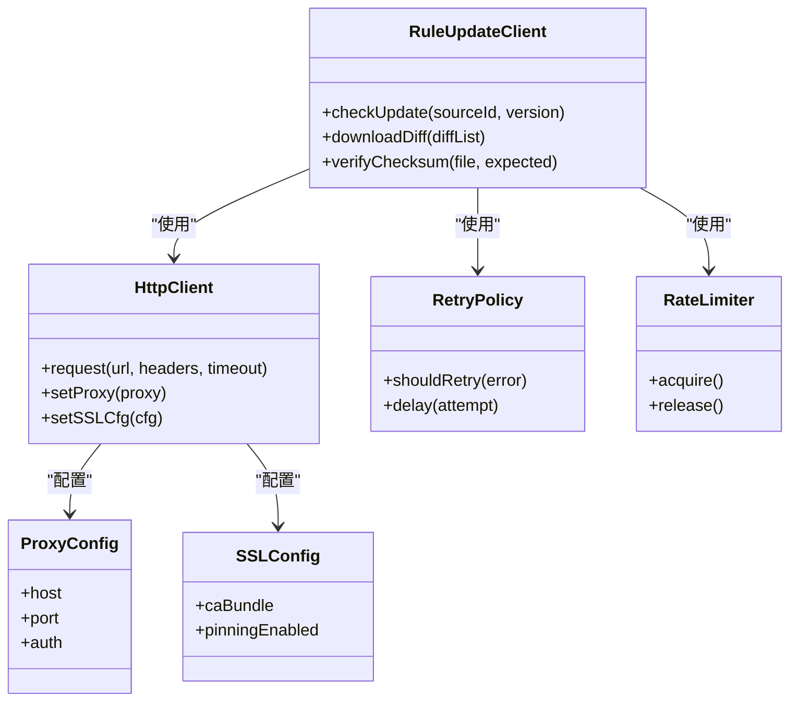
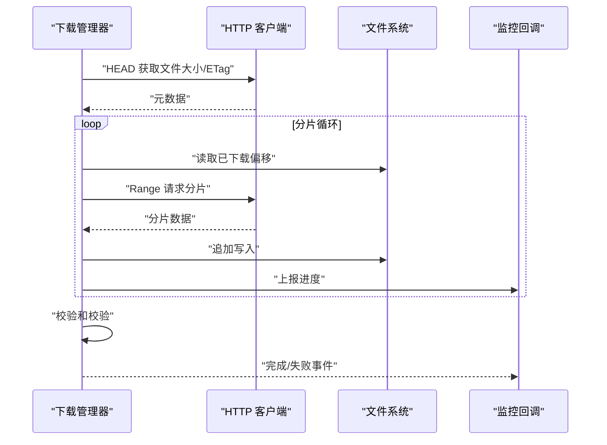
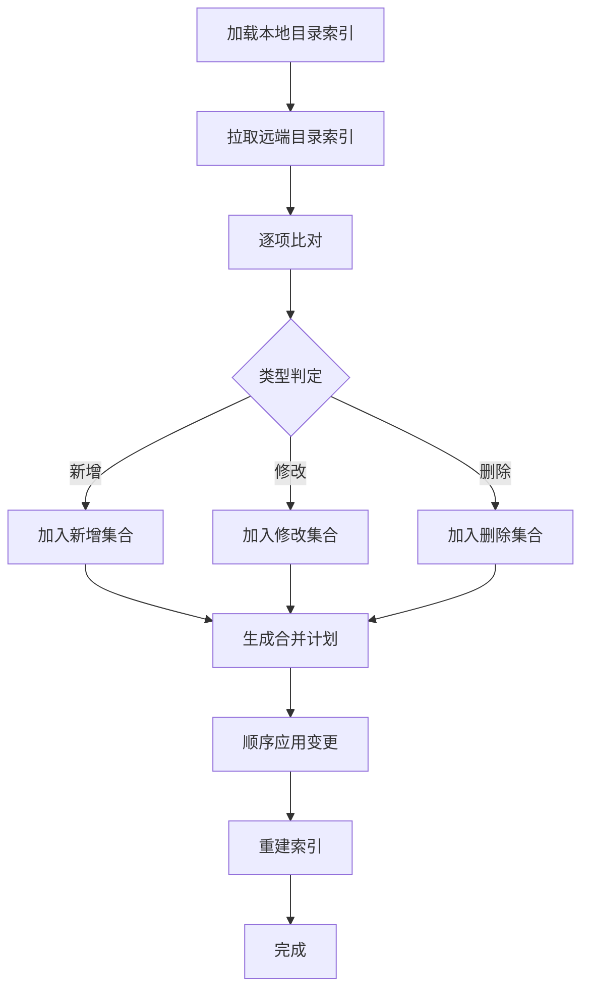
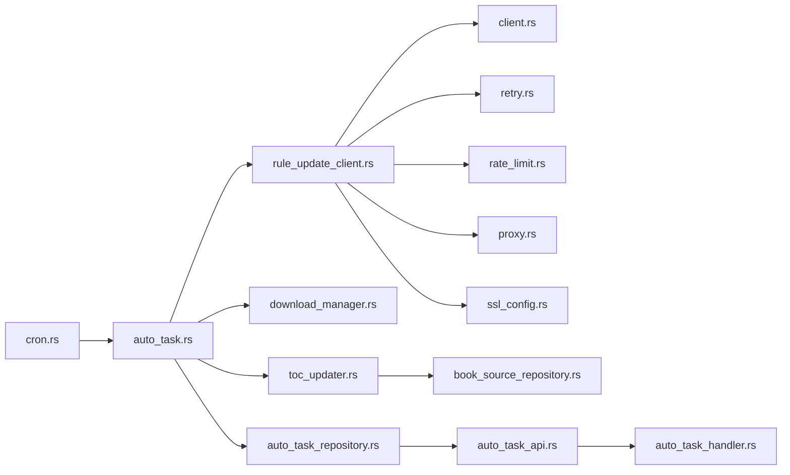

# 自动更新系统

<cite>
**本文引用的文件**   
- [cron.rs](file://rust/legado-core/src/cron.rs)
- [auto_task.rs](file://rust/legado-core/src/auto_task.rs)
- [misc.rs](file://rust/legado-core/src/models/misc.rs)
- [rule_update_client.rs](file://rust/legado-net/src/rule_update_client.rs)
- [client.rs](file://rust/legado-net/src/client.rs)
- [ssl_config.rs](file://rust/legado-net/src/ssl_config.rs)
- [proxy.rs](file://rust/legado-net/src/proxy.rs)
- [retry.rs](file://rust/legado-net/src/retry.rs)
- [rate_limit.rs](file://rust/legado-net/src/rate_limit.rs)
- [source_checker.rs](file://rust/legado-net/src/source_checker.rs)
- [download_manager.rs](file://rust/legado-core/src/download_manager.rs)
- [toc_updater.rs](file://rust/legado-core/src/toc_updater.rs)
- [book_source_repository.rs](file://rust/legado-db/src/repository/book_source_repository.rs)
- [auto_task_repository.rs](file://rust/legado-db/src/repository/auto_task_repository.rs)
- [auto_task_api.rs](file://rust/legado-ffi/src/api/auto_task_api.rs)
- [auto_task_handler.rs](file://rust/legado-server/src/handlers/auto_task_handler.rs)
- [frb_generated.rs](file://rust/legado-ffi/src/frb_generated.rs)
- [AutoTaskPersistenceContractTest.kt](file://app/src/test/java/io/legado/app/config/AutoTaskPersistenceContractTest.kt)
- [CronScheduleTest.kt](file://app/src/test/java/io/legado/utils/CronScheduleTest.kt)
- [UpdateTest.kt](file://app/src/androidTest/java/io/legado/app/UpdateTest.kt)
</cite>

## 更新摘要
**变更内容**   
- 新增完整的数据库持久化功能，支持自动任务系统的CRUD操作
- 添加FFI绑定函数：autoTaskListRules、autoTaskCreateRule、autoTaskUpdateRule、autoTaskDeleteRule
- 扩展自动任务仓储层，提供完整的SQLite数据访问能力
- 增强REST API处理器，支持自动任务的完整生命周期管理

## 目录
1. [简介](#简介)
2. [项目结构](#项目结构)
3. [核心组件](#核心组件)
4. [架构总览](#架构总览)
5. [详细组件分析](#详细组件分析)
6. [依赖关系分析](#依赖关系分析)
7. [性能考量](#性能考量)
8. [故障排查指南](#故障排查指南)
9. [结论](#结论)
10. [附录](#附录)

## 简介
本技术文档面向 Legado 的"网络源自动更新系统"，围绕以下目标展开：
- 更新任务调度：Cron 表达式支持、任务队列管理、并发控制与失败重试机制。
- 增量更新策略：版本比较算法、差异计算、冲突解决与数据合并逻辑。
- 更新客户端设计：HTTP 请求处理、SSL 证书验证、代理支持与超时控制。
- 更新监控功能：进度跟踪、日志记录、错误通知与性能统计。
- **新增**：完整的数据库持久化能力，支持自动任务的CRUD操作和FFI绑定。
- 配置最佳实践与故障处理方法。

该子系统由 Kotlin（Android 应用层）与 Rust（核心能力）共同实现，通过清晰的模块边界与稳定的接口契约，提供高可靠、可观测、可扩展的网络源更新能力。

## 项目结构
从仓库视角看，自动更新相关代码主要分布在：
- Rust 核心库：legado-core（任务调度、下载与目录更新）、legado-net（网络客户端、重试、限流、SSL/代理）、legado-db（持久化仓储）。
- FFI层：legado-ffi（FFI绑定、API封装）
- Server层：legado-server（REST API处理器）
- Android 应用层：测试用例覆盖 Cron 调度、自动任务持久化与端到端更新流程。

**图表来源**
- [auto_task_repository.rs](file://rust/legado-db/src/repository/auto_task_repository.rs)
- [auto_task_api.rs](file://rust/legado-ffi/src/api/auto_task_api.rs)
- [auto_task_handler.rs](file://rust/legado-server/src/handlers/auto_task_handler.rs)
- [frb_generated.rs](file://rust/legado-ffi/src/frb_generated.rs)

## 核心组件
- 任务调度器（Cron）：基于 Cron 表达式驱动定时任务，负责触发更新任务并维护执行状态。
- 自动任务编排（Auto Task）：将"检查更新""下载增量包""校验与合并"等步骤编排为可重入的任务流。
- 更新客户端（Rule Update Client）：封装 HTTP 请求、SSL 校验、代理、超时、重试与限流，统一对外暴露更新能力。
- 下载管理器（Download Manager）：管理分片/断点续传、并发下载、进度上报与失败恢复。
- 目录更新器（Toc Updater）：对比本地与远端目录差异，生成变更集并执行增量合并。
- 数据仓储（Book Source Repository）：持久化源元数据、版本信息与更新结果，保证一致性。
- **新增**：自动任务仓储（Auto Task Repository）：提供自动任务规则的完整CRUD操作，支持SQLite持久化。
- **新增**：FFI绑定层：提供autoTaskListRules、autoTaskCreateRule、autoTaskUpdateRule、autoTaskDeleteRule等函数。
- **新增**：REST API处理器：提供自动任务的HTTP接口，支持完整的生命周期管理。

## 架构总览
下图展示从调度到执行的端到端流程，以及关键外部依赖（网络、存储、校验），包含新增的数据库持久化层。

**图表来源**
- [auto_task_repository.rs](file://rust/legado-db/src/repository/auto_task_repository.rs)
- [auto_task_api.rs](file://rust/legado-ffi/src/api/auto_task_api.rs)

## 详细组件分析

### 任务调度与队列管理（Cron + Auto Task）
- Cron 表达式支持：解析标准 Cron 字段，计算下次触发时间，支持时区与异常回退策略。
- 任务队列：采用优先级队列与去重键（如源 ID+操作类型），避免重复调度；支持暂停/恢复。
- 并发控制：全局线程池上限与每源互斥锁，防止同一源的并发更新导致数据竞争。
- 失败重试：指数退避 + 抖动，结合最大重试次数与冷却时间，避免雪崩。

**章节来源**
- [auto_task.rs](file://rust/legado-core/src/auto_task.rs)
- [CronScheduleTest.kt](file://app/src/test/java/io/legado/utils/CronScheduleTest.kt)
- [AutoTaskPersistenceContractTest.kt](file://app/src/test/java/io/legado/app/config/AutoTaskPersistenceContractTest.kt)

### 数据库持久化层（Auto Task Repository）
**新增** 完整的自动任务规则持久化能力，支持SQLite数据库操作：

- **CRUD操作**：
  - `find_by_id`：根据ID查询单个任务规则
  - `find_all`：查询所有任务规则，按customOrder排序
  - `insert`：插入新任务规则（INSERT OR REPLACE）
  - `update`：更新现有任务规则
  - `delete`：删除指定ID的任务规则

- **批量操作**：
  - `update_cron_batch`：批量更新多个任务的cron表达式，支持分批处理避免SQLite参数限制

- **数据模型映射**：
  - AutoTaskRule实体与SQLite表结构的完整映射
  - 支持运行时状态字段（lastRunAt、lastResult、lastError、lastLog）的持久化

**图表来源**
- [auto_task_repository.rs](file://rust/legado-db/src/repository/auto_task_repository.rs)
- [misc.rs](file://rust/legado-core/src/models/misc.rs)

**章节来源**
- [auto_task_repository.rs](file://rust/legado-db/src/repository/auto_task_repository.rs)
- [misc.rs](file://rust/legado-core/src/models/misc.rs)

### FFI绑定层（Auto Task API）
**新增** 完整的FFI绑定，提供自动任务系统的跨语言访问能力：

- **核心API函数**：
  - `list_rules_db()`：列出所有自动任务规则
  - `create_rule_db(rule)`：创建新的自动任务规则
  - `update_rule_db(rule)`：更新现有规则
  - `delete_rule_db(id)`：删除指定规则
  - `find_rule_by_id_db(id)`：根据ID查询规则

- **业务逻辑封装**：
  - `build_book_update_task()`：构建书籍更新定时任务
  - `execute_task()`：执行任务协议
  - `normalize_script()`：规范化脚本格式
  - `can_refresh_book_toc()`：判断书籍是否允许刷新目录

- **数据导入导出**：
  - `prepare_imported_tasks()`：准备导入任务，合并本地运行时状态
  - `update_cron_batch()`：批量更新cron表达式

**图表来源**
- [auto_task_api.rs](file://rust/legado-ffi/src/api/auto_task_api.rs)
- [auto_task_repository.rs](file://rust/legado-db/src/repository/auto_task_repository.rs)

**章节来源**
- [auto_task_api.rs](file://rust/legado-ffi/src/api/auto_task_api.rs)
- [frb_generated.rs](file://rust/legado-ffi/src/frb_generated.rs)

### REST API处理器（Auto Task Handler）
**新增** 完整的REST API接口，提供自动任务的HTTP访问能力：

- **CRUD端点**：
  - `GET /api/auto-tasks`：获取所有自动任务
  - `POST /api/auto-tasks`：创建自动任务
  - `PUT /api/auto-tasks/:id`：更新自动任务
  - `DELETE /api/auto-tasks/:id`：删除自动任务

- **执行端点**：
  - `POST /api/auto-tasks/:id/run`：立即执行任务

- **导入导出端点**：
  - `POST /api/auto-tasks/import`：批量导入任务
  - `GET /api/auto-tasks/export`：导出任务配置

- **内存存储**：当前使用内存存储（生产环境应替换为legado-db）

**图表来源**
- [auto_task_handler.rs](file://rust/legado-server/src/handlers/auto_task_handler.rs)

**章节来源**
- [auto_task_handler.rs](file://rust/legado-server/src/handlers/auto_task_handler.rs)

### 增量更新策略（版本比较、差异计算、冲突解决、数据合并）
- 版本比较：基于语义化版本或自定义版本号字段，判断是否需要更新。
- 差异计算：对比本地与远端的目录/资源清单，生成最小变更集（新增、修改、删除）。
- 冲突解决：以服务端权威为准，必要时保留用户自定义项（白名单/忽略列表）。
- 数据合并：原子事务写入，失败回滚；对大对象采用分块合并与校验和校验。

**图表来源**
- [toc_updater.rs](file://rust/legado-core/src/toc_updater.rs)
- [book_source_repository.rs](file://rust/legado-db/src/repository/book_source_repository.rs)

**章节来源**
- [toc_updater.rs](file://rust/legado-core/src/toc_updater.rs)
- [book_source_repository.rs](file://rust/legado-db/src/repository/book_source_repository.rs)

### 更新客户端设计（HTTP、SSL、代理、超时、重试、限流）
- HTTP 请求处理：统一构建请求头、Cookie、User-Agent、签名等；支持 JSON/XML/二进制。
- SSL 证书验证：启用严格校验，支持自定义 CA 与证书固定（可选）。
- 代理支持：系统代理与手动代理配置，支持鉴权与 SOCKS/HTTP 代理。
- 超时控制：连接、读、写超时独立配置，支持整体请求超时。
- 重试与退避：针对瞬态错误（网络抖动、5xx）进行有限次重试，指数退避+抖动。
- 速率限制：令牌桶/漏桶算法，保护服务端与避免被限流封禁。

**图表来源**
- [rule_update_client.rs](file://rust/legado-net/src/rule_update_client.rs)
- [client.rs](file://rust/legado-net/src/client.rs)
- [retry.rs](file://rust/legado-net/src/retry.rs)
- [rate_limit.rs](file://rust/legado-net/src/rate_limit.rs)
- [proxy.rs](file://rust/legado-net/src/proxy.rs)
- [ssl_config.rs](file://rust/legado-net/src/ssl_config.rs)

**章节来源**
- [rule_update_client.rs](file://rust/legado-net/src/rule_update_client.rs)
- [client.rs](file://rust/legado-net/src/client.rs)
- [retry.rs](file://rust/legado-net/src/retry.rs)
- [rate_limit.rs](file://rust/legado-net/src/rate_limit.rs)
- [proxy.rs](file://rust/legado-net/src/proxy.rs)
- [ssl_config.rs](file://rust/legado-net/src/ssl_config.rs)

### 下载管理器（并发、进度、断点续传、校验）
- 并发下载：按分片并行下载，动态调整并发度，避免阻塞。
- 进度上报：实时回调进度百分比、速度、剩余时间。
- 断点续传：记录偏移量与校验和，崩溃恢复后继续下载。
- 完整性校验：MD5/SHA256 校验，失败自动重试或回滚。

**图表来源**
- [download_manager.rs](file://rust/legado-core/src/download_manager.rs)
- [client.rs](file://rust/legado-net/src/client.rs)

**章节来源**
- [download_manager.rs](file://rust/legado-core/src/download_manager.rs)

### 目录更新器（差异与合并）
- 差异计算：对比本地与远端目录树，识别新增/修改/删除项。
- 合并策略：优先服务端权威，保留用户自定义规则（白名单）。
- 幂等性：多次运行不会产生副作用，确保一致状态。

**图表来源**
- [toc_updater.rs](file://rust/legado-core/src/toc_updater.rs)

**章节来源**
- [toc_updater.rs](file://rust/legado-core/src/toc_updater.rs)

### 监控与可观测性（进度、日志、错误通知、性能统计）
- 进度跟踪：通过回调/事件总线推送下载与合并进度。
- 日志记录：结构化日志，包含任务 ID、源 ID、阶段、耗时与错误码。
- 错误通知：失败时聚合错误上下文，支持告警通道（本地通知/日志采集）。
- 性能统计：QPS、成功率、P95/P99 延迟、重试率、带宽占用。

**章节来源**
- [source_checker.rs](file://rust/legado-net/src/source_checker.rs)
- [UpdateTest.kt](file://app/src/androidTest/java/io/legado/app/UpdateTest.kt)

## 依赖关系分析
- 低耦合：调度层不直接依赖网络细节，通过抽象客户端调用。
- 内聚性：下载与目录更新各自职责清晰，通过明确的数据契约交互。
- 外部依赖：HTTP 客户端、文件系统、数据库仓储。
- 潜在环依赖：通过接口隔离避免循环引用。
- **新增**：FFI层作为桥梁，连接上层应用与底层Rust实现。
- **新增**：Server层提供HTTP接口，便于远程管理和自动化集成。

**图表来源**
- [auto_task_repository.rs](file://rust/legado-db/src/repository/auto_task_repository.rs)
- [auto_task_api.rs](file://rust/legado-ffi/src/api/auto_task_api.rs)
- [auto_task_handler.rs](file://rust/legado-server/src/handlers/auto_task_handler.rs)

**章节来源**
- [auto_task_repository.rs](file://rust/legado-db/src/repository/auto_task_repository.rs)
- [auto_task_api.rs](file://rust/legado-ffi/src/api/auto_task_api.rs)
- [auto_task_handler.rs](file://rust/legado-server/src/handlers/auto_task_handler.rs)

## 性能考量
- 并发度调优：根据设备 CPU/IO 能力设置合理并发，避免过度争用。
- 缓存策略：对元数据与清单做短期缓存，减少重复请求。
- 传输优化：启用压缩（Gzip/Brotli），合理使用 Range 请求。
- 重试与退避：区分可重试与不可重试错误，避免无效重试放大负载。
- 内存管理：分块处理大对象，及时释放临时缓冲。
- **新增**：数据库批处理：批量更新操作采用分批处理，避免SQLite参数数量限制。
- **新增**：FFI序列化优化：使用JSON序列化减少跨语言调用开销。

## 故障排查指南
- 常见错误分类
  - 网络类：连接超时、DNS 解析失败、SSL 握手失败、代理不可用。
  - 服务端类：4xx/5xx、限流、资源不存在、版本不一致。
  - 本地类：磁盘空间不足、权限不足、校验失败、并发冲突。
  - **新增**：数据库类：连接失败、SQL语法错误、约束违反、事务冲突。
  - **新增**：FFI类：序列化失败、类型不匹配、内存溢出。
- 定位方法
  - 查看任务日志：关注任务 ID、阶段、错误码与堆栈。
  - 检查网络链路：代理/SSL 配置是否正确，抓包确认响应。
  - 校验完整性：核对哈希值与分片偏移，确认断点续传状态。
  - 数据库一致性：检查版本表与索引重建状态。
  - **新增**：FFI调试：检查JSON序列化/反序列化过程，验证数据类型。
  - **新增**：API调试：使用curl或Postman测试REST接口，检查HTTP状态码。
- 恢复建议
  - 重置任务状态并重试。
  - 清理损坏的分片文件后重新下载。
  - 降级并发度或关闭代理排除环境问题。
  - **新增**：数据库修复：检查SQLite数据库完整性，必要时重建索引。
  - **新增**：FFI重启：重启服务进程，清理FFI状态。

**章节来源**
- [source_checker.rs](file://rust/legado-net/src/source_checker.rs)
- [UpdateTest.kt](file://app/src/androidTest/java/io/legado/app/UpdateTest.kt)
- [auto_task_repository.rs](file://rust/legado-db/src/repository/auto_task_repository.rs)
- [auto_task_api.rs](file://rust/legado-ffi/src/api/auto_task_api.rs)

## 结论
Legado 的网络源自动更新系统通过"调度—编排—网络—下载—合并—持久化"的分层设计，实现了高可用、可观测与可扩展的更新能力。合理的并发与重试策略、严格的 SSL/代理配置、完善的监控与日志，使其在复杂网络环境下仍能稳定工作。**新增的数据库持久化功能和FFI绑定**进一步增强了系统的完整性和可用性，提供了完整的CRUD操作能力和跨语言访问接口。建议在生产环境开启严格 SSL 校验、合理设置重试与限流参数，并结合监控指标持续优化。

## 附录
- 配置最佳实践
  - Cron 表达式：避免过于频繁（如每分钟），建议使用小时级或日级周期。
  - 超时与重试：连接超时 5-10s，请求超时 15-30s，最大重试 3 次，退避 1-5s。
  - 代理与 SSL：生产环境强制 HTTPS 与证书固定，谨慎使用自签 CA。
  - 并发与限流：默认并发 2-4，限流 10-20 QPS，按源维度隔离。
  - **新增**：数据库配置：合理设置SQLite连接池大小，启用WAL模式提升并发性能。
  - **新增**：FFI配置：优化JSON序列化选项，减少内存分配和GC压力。
- 监控指标建议
  - 成功率、平均/分位延迟、重试率、失败原因分布、带宽与吞吐。
  - 任务积压与队列长度、CPU/内存占用。
  - **新增**：数据库指标：查询延迟、连接数、事务成功率。
  - **新增**：API指标：请求量、响应时间、错误率、吞吐量。
- **新增**：FFI函数参考
  - `autoTaskListRules()`：获取所有自动任务规则
  - `autoTaskCreateRule(rule)`：创建新的自动任务规则
  - `autoTaskUpdateRule(rule)`：更新现有规则
  - `autoTaskDeleteRule(id)`：删除指定规则
- **新增**：REST API参考
  - `GET /api/auto-tasks`：获取任务列表
  - `POST /api/auto-tasks`：创建任务
  - `PUT /api/auto-tasks/:id`：更新任务
  - `DELETE /api/auto-tasks/:id`：删除任务
  - `POST /api/auto-tasks/:id/run`：执行任务
  - `POST /api/auto-tasks/import`：导入任务
  - `GET /api/auto-tasks/export`：导出任务