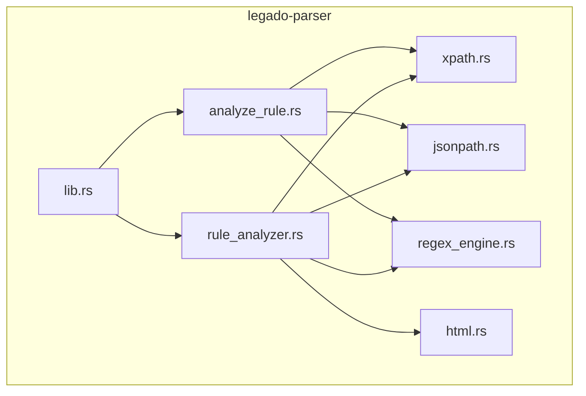
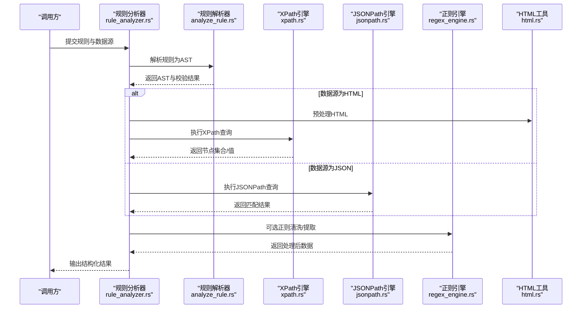
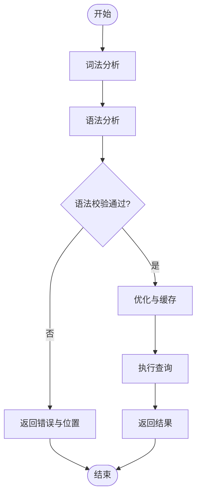
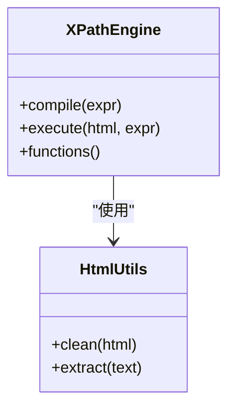
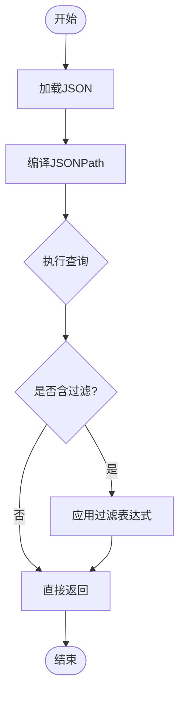
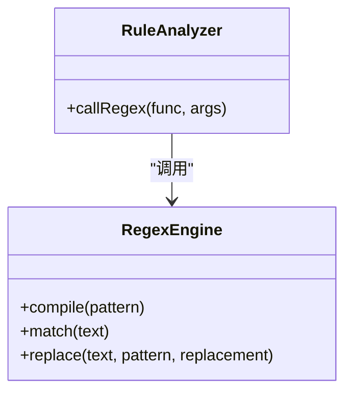
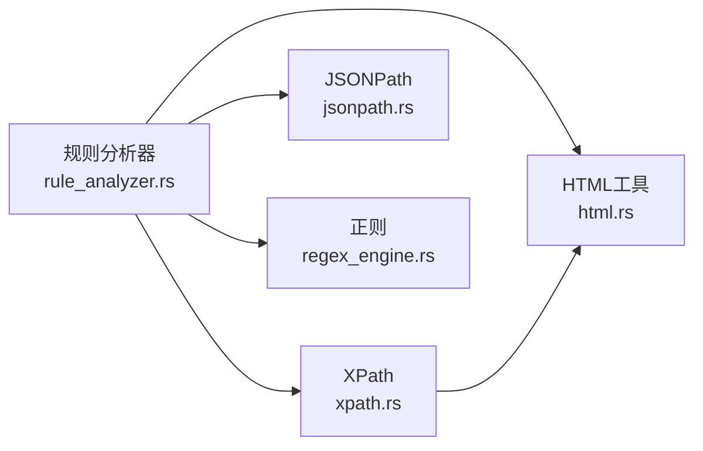

# 规则解析引擎

<cite>
**本文引用的文件**   
- [analyze_rule.rs](file://rust/legado-parser/src/analyze_rule.rs)
- [rule_analyzer.rs](file://rust/legado-parser/src/rule_analyzer.rs)
- [xpath.rs](file://rust/legado-parser/src/xpath.rs)
- [jsonpath.rs](file://rust/legado-parser/src/jsonpath.rs)
- [regex_engine.rs](file://rust/legado-parser/src/regex_engine.rs)
- [html.rs](file://rust/legado-parser/src/html.rs)
- [lib.rs](file://rust/legado-parser/src/lib.rs)
</cite>

## 目录
1. [简介](#简介)
2. [项目结构](#项目结构)
3. [核心组件](#核心组件)
4. [架构总览](#架构总览)
5. [详细组件分析](#详细组件分析)
6. [依赖关系分析](#依赖关系分析)
7. [性能考量](#性能考量)
8. [故障排查指南](#故障排查指南)
9. [结论](#结论)
10. [附录：规则编写示例与调试技巧](#附录规则编写示例与调试技巧)

## 简介
本技术文档聚焦 Legado 的规则解析引擎，系统性阐述 XPath、JSONPath、正则表达式匹配与 CSS 选择器的实现细节；深入解析规则分析器（AST 构建、语法验证、性能优化、错误处理）的架构设计。同时提供常见场景下的规则编写示例（书籍信息提取、章节列表获取、内容抓取），并给出调试技巧与常见问题解决方案，帮助开发者高效编写与维护规则。

## 项目结构
规则解析相关代码位于 Rust 模块 legado-parser 中，采用“按功能划分”的组织方式：
- 解析入口与公共能力：lib.rs
- 规则分析与 AST：analyze_rule.rs、rule_analyzer.rs
- 查询语言与匹配器：xpath.rs、jsonpath.rs、regex_engine.rs
- HTML 处理与辅助：html.rs

**图示来源** 
- [lib.rs](file://rust/legado-parser/src/lib.rs)
- [analyze_rule.rs](file://rust/legado-parser/src/analyze_rule.rs)
- [rule_analyzer.rs](file://rust/legado-parser/src/rule_analyzer.rs)
- [xpath.rs](file://rust/legado-parser/src/xpath.rs)
- [jsonpath.rs](file://rust/legado-parser/src/jsonpath.rs)
- [regex_engine.rs](file://rust/legado-parser/src/regex_engine.rs)
- [html.rs](file://rust/legado-parser/src/html.rs)

**章节来源**
- [lib.rs](file://rust/legado-parser/src/lib.rs)
- [analyze_rule.rs](file://rust/legado-parser/src/analyze_rule.rs)
- [rule_analyzer.rs](file://rust/legado-parser/src/rule_analyzer.rs)
- [xpath.rs](file://rust/legado-parser/src/xpath.rs)
- [jsonpath.rs](file://rust/legado-parser/src/jsonpath.rs)
- [regex_engine.rs](file://rust/legado-parser/src/regex_engine.rs)
- [html.rs](file://rust/legado-parser/src/html.rs)

## 核心组件
- 规则分析器（Rule Analyzer）
  - 负责将用户编写的规则字符串解析为抽象语法树（AST），并进行语法校验、类型推断与规范化。
  - 支持多目标数据源（HTML、JSON、文本等），通过统一接口输出结构化结果。
- XPath 引擎
  - 基于 DOM 或轻量级 HTML 树进行节点定位与属性/文本抽取，支持常用路径、谓词与函数扩展。
- JSONPath 引擎
  - 对 JSON 数据进行路径式查询，支持数组索引、对象字段访问、过滤与聚合操作。
- 正则表达式引擎
  - 提供高性能模式匹配、分组捕获与替换能力，用于文本清洗、字段切分与二次加工。
- HTML 工具
  - 提供 HTML 清理、编码处理、标签剥离与内容提取等通用能力。

**章节来源**
- [analyze_rule.rs](file://rust/legado-parser/src/analyze_rule.rs)
- [rule_analyzer.rs](file://rust/legado-parser/src/rule_analyzer.rs)
- [xpath.rs](file://rust/legado-parser/src/xpath.rs)
- [jsonpath.rs](file://rust/legado-parser/src/jsonpath.rs)
- [regex_engine.rs](file://rust/legado-parser/src/regex_engine.rs)
- [html.rs](file://rust/legado-parser/src/html.rs)

## 架构总览
规则解析引擎的整体流程如下：输入规则 → 解析为 AST → 语义校验 → 执行引擎（XPath/JSONPath/正则）→ 输出结构化数据。

**图示来源** 
- [rule_analyzer.rs](file://rust/legado-parser/src/rule_analyzer.rs)
- [analyze_rule.rs](file://rust/legado-parser/src/analyze_rule.rs)
- [xpath.rs](file://rust/legado-parser/src/xpath.rs)
- [jsonpath.rs](file://rust/legado-parser/src/jsonpath.rs)
- [regex_engine.rs](file://rust/legado-parser/src/regex_engine.rs)
- [html.rs](file://rust/legado-parser/src/html.rs)

## 详细组件分析

### 规则分析器（AST 构建与校验）
- 职责
  - 将规则字符串解析为 AST，包含节点类型、操作符、参数与上下文信息。
  - 进行语法验证（如路径合法性、函数签名检查）、类型推断（字符串/数字/布尔/数组/对象）。
  - 生成可执行的查询计划，减少运行时开销。
- 关键流程
  - 词法分析 → 语法分析 → 语义校验 → 优化（常量折叠、短路评估）→ 执行。
- 错误处理
  - 统一的错误类型与位置信息，便于定位规则问题。
  - 提供降级策略（如部分字段缺失时回退默认值）。

**图示来源** 
- [rule_analyzer.rs](file://rust/legado-parser/src/rule_analyzer.rs)
- [analyze_rule.rs](file://rust/legado-parser/src/analyze_rule.rs)

**章节来源**
- [rule_analyzer.rs](file://rust/legado-parser/src/rule_analyzer.rs)
- [analyze_rule.rs](file://rust/legado-parser/src/analyze_rule.rs)

### XPath 引擎
- 支持能力
  - 路径导航（子节点、兄弟节点、祖先/后代）、属性与文本提取。
  - 谓词过滤（条件表达式）、函数扩展（字符串处理、日期格式化等）。
  - 与 HTML 工具协作，处理编码、标签清理与内容抽取。
- 性能要点
  - 预编译 XPath 表达式，复用匹配器实例。
  - 避免不必要的 DOM 遍历，使用索引或缓存命中。
- 错误处理
  - 路径不存在时返回空集或默认值，避免中断整体流程。

**图示来源** 
- [xpath.rs](file://rust/legado-parser/src/xpath.rs)
- [html.rs](file://rust/legado-parser/src/html.rs)

**章节来源**
- [xpath.rs](file://rust/legado-parser/src/xpath.rs)
- [html.rs](file://rust/legado-parser/src/html.rs)

### JSONPath 引擎
- 支持能力
  - 对象字段访问、数组索引、切片、过滤表达式。
  - 聚合函数（计数、求和、最大/最小）与嵌套查询。
- 性能要点
  - 路径前缀匹配与短路求值，减少无效分支。
  - 结果集惰性计算，按需展开。
- 错误处理
  - 字段不存在时返回空值或默认值，支持链式安全访问。

**图示来源** 
- [jsonpath.rs](file://rust/legado-parser/src/jsonpath.rs)

**章节来源**
- [jsonpath.rs](file://rust/legado-parser/src/jsonpath.rs)

### 正则表达式引擎
- 支持能力
  - 模式匹配、分组捕获、替换与批量处理。
  - 与规则引擎集成，支持在规则中调用正则函数。
- 性能要点
  - 预编译正则表达式，复用匹配器。
  - 避免回溯爆炸，限制重复量词范围。
- 错误处理
  - 非法正则表达式及时报错，提供错误位置与提示。

**图示来源** 
- [regex_engine.rs](file://rust/legado-parser/src/regex_engine.rs)
- [rule_analyzer.rs](file://rust/legado-parser/src/rule_analyzer.rs)

**章节来源**
- [regex_engine.rs](file://rust/legado-parser/src/regex_engine.rs)
- [rule_analyzer.rs](file://rust/legado-parser/src/rule_analyzer.rs)

### HTML 工具
- 支持能力
  - HTML 清理（去除脚本、样式、注释）、编码转换、标签剥离。
  - 文本提取与格式化，适配不同站点结构差异。
- 性能要点
  - 流式处理大文档，避免一次性加载。
  - 缓存常用清理模板。
- 错误处理
  - 编码异常时自动探测并修复，保证后续解析稳定。

**章节来源**
- [html.rs](file://rust/legado-parser/src/html.rs)

## 依赖关系分析
各组件之间的依赖关系清晰，遵循单一职责与低耦合原则：
- 规则分析器依赖 XPath、JSONPath、正则引擎与 HTML 工具。
- XPath 与 JSONPath 独立实现，互不依赖。
- 正则引擎作为通用工具被多处复用。

**图示来源** 
- [rule_analyzer.rs](file://rust/legado-parser/src/rule_analyzer.rs)
- [xpath.rs](file://rust/legado-parser/src/xpath.rs)
- [jsonpath.rs](file://rust/legado-parser/src/jsonpath.rs)
- [regex_engine.rs](file://rust/legado-parser/src/regex_engine.rs)
- [html.rs](file://rust/legado-parser/src/html.rs)

**章节来源**
- [rule_analyzer.rs](file://rust/legado-parser/src/rule_analyzer.rs)
- [xpath.rs](file://rust/legado-parser/src/xpath.rs)
- [jsonpath.rs](file://rust/legado-parser/src/jsonpath.rs)
- [regex_engine.rs](file://rust/legado-parser/src/regex_engine.rs)
- [html.rs](file://rust/legado-parser/src/html.rs)

## 性能考量
- 预编译与缓存
  - XPath、JSONPath、正则表达式均支持预编译，避免重复解析开销。
  - 热点规则结果缓存，提升重复请求性能。
- 惰性求值
  - 大数据集下采用惰性计算，按需展开节点或数组元素。
- 内存管理
  - 流式处理 HTML 与大文本，降低峰值内存占用。
- 并发与安全
  - 规则执行隔离，防止恶意规则影响系统稳定性。

[本节为通用指导，无需特定文件引用]

## 故障排查指南
- 常见问题
  - XPath 路径不匹配：检查节点层级、属性名与命名空间。
  - JSONPath 字段缺失：确认数据结构变化，增加默认值或条件判断。
  - 正则表达式错误：验证模式语法，避免回溯爆炸。
- 调试技巧
  - 逐步打印中间结果，定位失败环节。
  - 使用最小化规则复现问题，逐步添加复杂度。
  - 启用详细日志，记录规则解析与执行过程。
- 错误恢复
  - 设置超时与重试机制，避免长时间阻塞。
  - 提供降级策略，确保核心功能可用。

**章节来源**
- [rule_analyzer.rs](file://rust/legado-parser/src/rule_analyzer.rs)
- [analyze_rule.rs](file://rust/legado-parser/src/analyze_rule.rs)

## 结论
Legado 的规则解析引擎以模块化、高性能与强扩展性为核心设计目标，通过统一的 AST 与执行框架，灵活支持 XPath、JSONPath、正则表达式与 HTML 处理。开发者可基于此快速构建稳定的数据抓取规则，满足多样化网站结构与数据格式需求。

[本节为总结性内容，无需特定文件引用]

## 附录：规则编写示例与调试技巧

### 书籍信息提取（HTML + XPath）
- 目标：从书籍详情页提取书名、作者、简介、封面链接。
- 步骤：
  - 使用 XPath 定位标题、作者、简介与图片节点。
  - 清理多余标签与空白字符。
  - 输出结构化对象。
- 调试建议：
  - 先单独测试每个 XPath 表达式，确保命中正确节点。
  - 使用浏览器开发者工具验证路径有效性。

### 章节列表获取（HTML + XPath）
- 目标：从目录页提取章节标题与链接。
- 步骤：
  - 使用 XPath 选择章节列表项。
  - 提取文本与 href 属性。
  - 去重与排序。
- 调试建议：
  - 检查分页逻辑，确保覆盖所有章节。
  - 处理相对链接，转换为绝对 URL。

### 内容抓取（HTML + 正则）
- 目标：从章节正文中提取纯文本内容。
- 步骤：
  - 使用 XPath 定位正文容器。
  - 使用正则表达式清理广告与无关内容。
  - 合并段落与换行。
- 调试建议：
  - 逐步应用正则规则，观察匹配效果。
  - 避免过度贪婪导致误删。

### JSON 数据源（JSONPath）
- 目标：从 API 响应中提取书籍元数据。
- 步骤：
  - 使用 JSONPath 访问字段与数组元素。
  - 处理嵌套结构与可选字段。
  - 转换数据类型（字符串转数字、日期格式化）。
- 调试建议：
  - 使用在线 JSONPath 测试工具验证表达式。
  - 打印中间结果，确认数据结构符合预期。

### 调试技巧汇总
- 启用详细日志，记录规则解析与执行过程。
- 使用最小化规则复现问题，逐步添加复杂度。
- 针对复杂规则，拆分为多个小规则组合执行。
- 利用缓存与预热，提升调试效率。

[本节为概念性内容，无需特定文件引用]