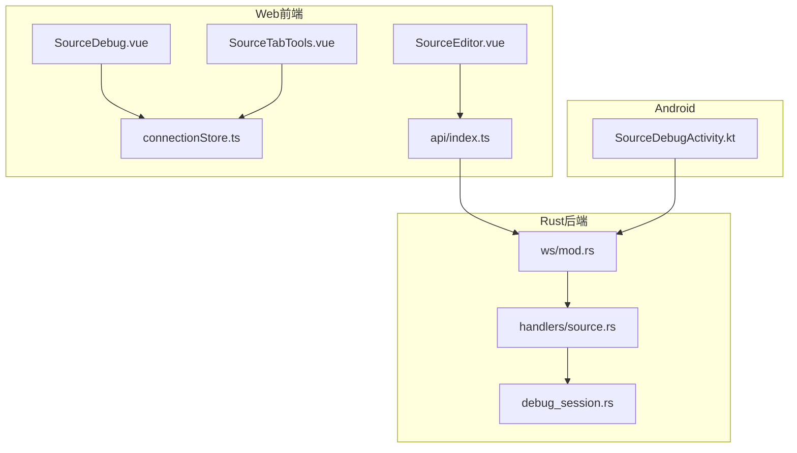
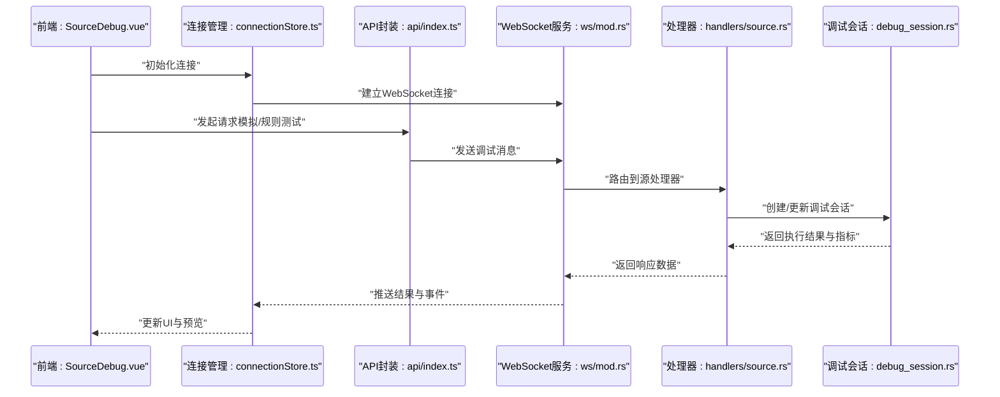
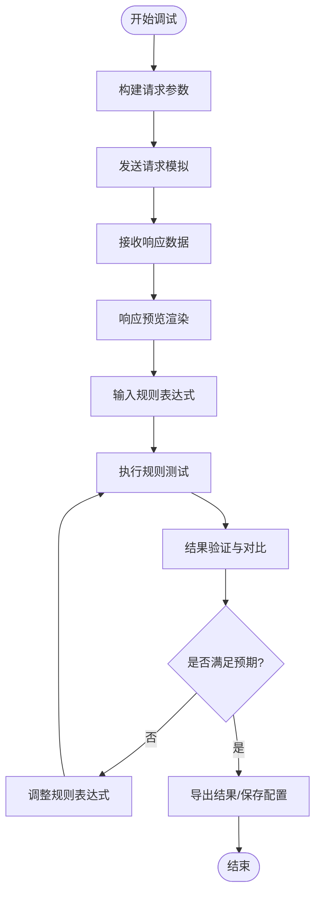
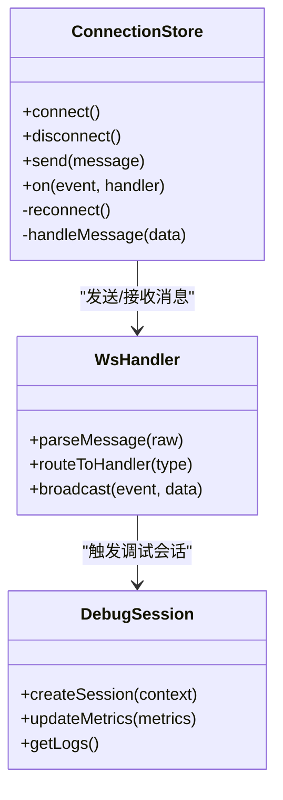
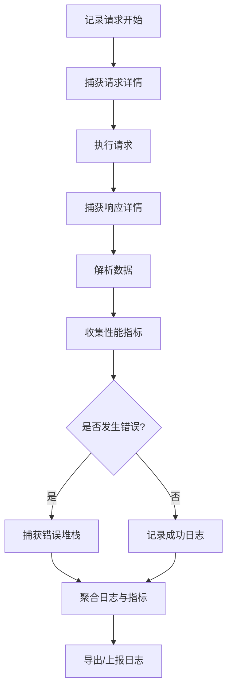
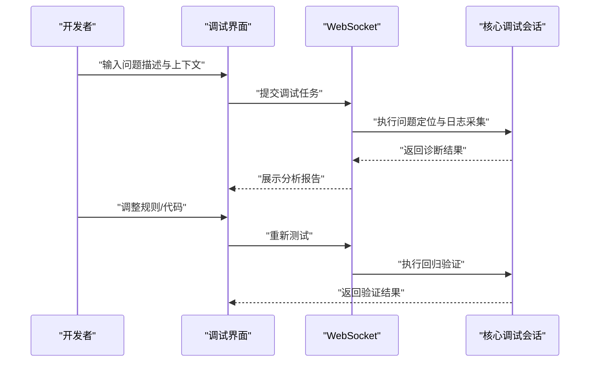
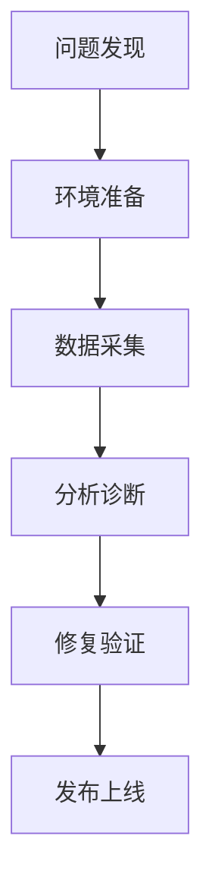
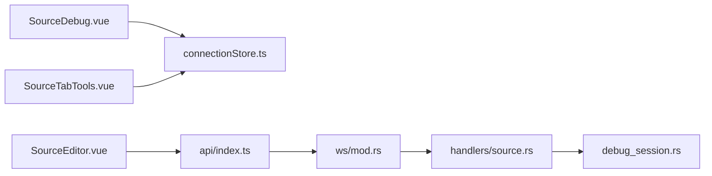

# 调试工具集

<cite>
**本文引用的文件**   
- [modules/web/src/components/SourceDebug.vue](file://modules/web/src/components/SourceDebug.vue)
- [modules/web/src/components/SourceTabTools.vue](file://modules/web/src/components/SourceTabTools.vue)
- [modules/web/src/pages/source/SourceEditor.vue](file://modules/web/src/pages/source/SourceEditor.vue)
- [modules/web/src/store/connectionStore.ts](file://modules/web/src/store/connectionStore.ts)
- [modules/web/src/api/index.ts](file://modules/web/src/api/index.ts)
- [rust/legado-server/src/ws/mod.rs](file://rust/legado-server/src/ws/mod.rs)
- [rust/legado-server/src/handlers/source.rs](file://rust/legado-server/src/handlers/source.rs)
- [rust/legado-core/src/debug_session.rs](file://rust/legado-core/src/debug_session.rs)
- [app/src/main/java/io/legado/app/ui/source/SourceDebugActivity.kt](file://app/src/main/java/io/legado/app/ui/source/SourceDebugActivity.kt)
</cite>

## 目录
1. [简介](#简介)
2. [项目结构](#项目结构)
3. [核心组件](#核心组件)
4. [架构总览](#架构总览)
5. [详细组件分析](#详细组件分析)
6. [依赖关系分析](#依赖关系分析)
7. [性能考量](#性能考量)
8. [故障排查指南](#故障排查指南)
9. [结论](#结论)
10. [附录](#附录)

## 简介
本技术文档面向Legado网络源调试工具集，围绕以下目标展开：
- 调试界面能力：请求模拟、响应预览、规则测试与结果验证
- WebSocket调试：实时通信、消息格式、事件监听与状态同步
- 日志系统：HTTP请求追踪、响应捕获、错误堆栈与性能指标收集
- 调试工作流程：问题定位、规则测试、性能分析与错误修复
- 调试技巧与常见问题解决方案

该工具集由前端Web调试页面（Vue）、后端服务（Rust）与Android端集成共同组成，通过WebSocket实现前后端实时交互，提供完整的网络源开发与排障体验。

## 项目结构
调试工具集涉及的关键目录与文件如下：
- Web前端：位于 modules/web，包含调试页面、组件、API封装与状态管理
- Rust后端服务：位于 rust/legado-server，提供HTTP与WebSocket接口
- 核心调试会话：位于 rust/legado-core，维护调试上下文与会话状态
- Android集成：位于 app，提供原生入口与平台能力对接

**图表来源** 
- [modules/web/src/components/SourceDebug.vue](file://modules/web/src/components/SourceDebug.vue)
- [modules/web/src/components/SourceTabTools.vue](file://modules/web/src/components/SourceTabTools.vue)
- [modules/web/src/pages/source/SourceEditor.vue](file://modules/web/src/pages/source/SourceEditor.vue)
- [modules/web/src/store/connectionStore.ts](file://modules/web/src/store/connectionStore.ts)
- [modules/web/src/api/index.ts](file://modules/web/src/api/index.ts)
- [rust/legado-server/src/ws/mod.rs](file://rust/legado-server/src/ws/mod.rs)
- [rust/legado-server/src/handlers/source.rs](file://rust/legado-server/src/handlers/source.rs)
- [rust/legado-core/src/debug_session.rs](file://rust/legado-core/src/debug_session.rs)
- [app/src/main/java/io/legado/app/ui/source/SourceDebugActivity.kt](file://app/src/main/java/io/legado/app/ui/source/SourceDebugActivity.kt)

**章节来源**
- [modules/web/src/components/SourceDebug.vue](file://modules/web/src/components/SourceDebug.vue)
- [modules/web/src/components/SourceTabTools.vue](file://modules/web/src/components/SourceTabTools.vue)
- [modules/web/src/pages/source/SourceEditor.vue](file://modules/web/src/pages/source/SourceEditor.vue)
- [modules/web/src/store/connectionStore.ts](file://modules/web/src/store/connectionStore.ts)
- [modules/web/src/api/index.ts](file://modules/web/src/api/index.ts)
- [rust/legado-server/src/ws/mod.rs](file://rust/legado-server/src/ws/mod.rs)
- [rust/legado-server/src/handlers/source.rs](file://rust/legado-server/src/handlers/source.rs)
- [rust/legado-core/src/debug_session.rs](file://rust/legado-core/src/debug_session.rs)
- [app/src/main/java/io/legado/app/ui/source/SourceDebugActivity.kt](file://app/src/main/java/io/legado/app/ui/source/SourceDebugActivity.kt)

## 核心组件
- SourceDebug.vue：调试主界面，聚合请求模拟、响应预览、规则测试与结果验证等能力
- SourceTabTools.vue：调试工具栏与快捷操作，支持快速发起测试、切换模式、查看统计
- connectionStore.ts：WebSocket连接与状态管理，负责连接建立、重连、事件分发与消息路由
- api/index.ts：统一API封装，将HTTP与WebSocket调用抽象为可复用的方法
- ws/mod.rs：WebSocket服务端处理，负责消息解析、路由与转发
- handlers/source.rs：源相关处理器，执行请求模拟、规则测试与结果校验
- debug_session.rs：调试会话管理，维护上下文、日志与性能指标
- SourceDebugActivity.kt：Android端调试入口，桥接原生能力到Web调试流程

**章节来源**
- [modules/web/src/components/SourceDebug.vue](file://modules/web/src/components/SourceDebug.vue)
- [modules/web/src/components/SourceTabTools.vue](file://modules/web/src/components/SourceTabTools.vue)
- [modules/web/src/store/connectionStore.ts](file://modules/web/src/store/connectionStore.ts)
- [modules/web/src/api/index.ts](file://modules/web/src/api/index.ts)
- [rust/legado-server/src/ws/mod.rs](file://rust/legado-server/src/ws/mod.rs)
- [rust/legado-server/src/handlers/source.rs](file://rust/legado-server/src/handlers/source.rs)
- [rust/legado-core/src/debug_session.rs](file://rust/legado-core/src/debug_session.rs)
- [app/src/main/java/io/legado/app/ui/source/SourceDebugActivity.kt](file://app/src/main/java/io/legado/app/ui/source/SourceDebugActivity.kt)

## 架构总览
整体架构采用“前端Web + 后端Rust服务 + Android集成”的分层设计：
- 前端通过connectionStore建立WebSocket长连接，使用api封装进行消息发送与接收
- 后端ws模块解析并路由消息至对应处理器（如source处理器）
- 处理器调用核心调试会话（debug_session）执行请求模拟、规则测试与结果验证
- Android端作为入口或桥接层，提供平台能力与调试生命周期管理

**图表来源** 
- [modules/web/src/components/SourceDebug.vue](file://modules/web/src/components/SourceDebug.vue)
- [modules/web/src/store/connectionStore.ts](file://modules/web/src/store/connectionStore.ts)
- [modules/web/src/api/index.ts](file://modules/web/src/api/index.ts)
- [rust/legado-server/src/ws/mod.rs](file://rust/legado-server/src/ws/mod.rs)
- [rust/legado-server/src/handlers/source.rs](file://rust/legado-server/src/handlers/source.rs)
- [rust/legado-core/src/debug_session.rs](file://rust/legado-core/src/debug_session.rs)

## 详细组件分析

### 调试界面：请求模拟、响应预览、规则测试与结果验证
- 请求模拟：在SourceDebug中构造请求参数（URL、Headers、Body），通过API封装发送至后端
- 响应预览：接收后端返回的原始响应与解析后的结构化数据，支持JSON/XML/HTML预览
- 规则测试：输入XPath/正则/JSONPath规则，对响应数据进行提取与转换测试
- 结果验证：对比期望输出与实际输出，展示差异与匹配度，辅助规则迭代

**图表来源** 
- [modules/web/src/components/SourceDebug.vue](file://modules/web/src/components/SourceDebug.vue)
- [modules/web/src/components/SourceTabTools.vue](file://modules/web/src/components/SourceTabTools.vue)
- [modules/web/src/api/index.ts](file://modules/web/src/api/index.ts)

**章节来源**
- [modules/web/src/components/SourceDebug.vue](file://modules/web/src/components/SourceDebug.vue)
- [modules/web/src/components/SourceTabTools.vue](file://modules/web/src/components/SourceTabTools.vue)
- [modules/web/src/api/index.ts](file://modules/web/src/api/index.ts)

### WebSocket调试：实时通信、消息格式、事件监听与状态同步
- 实时通信：connectionStore维护WebSocket连接，自动重连与心跳检测
- 消息格式：定义统一的请求/响应消息结构，包含类型、载荷、时间戳与关联ID
- 事件监听：前端订阅特定事件（如连接状态、调试结果、错误通知）
- 状态同步：通过事件驱动更新UI状态，确保前后端一致

**图表来源** 
- [modules/web/src/store/connectionStore.ts](file://modules/web/src/store/connectionStore.ts)
- [rust/legado-server/src/ws/mod.rs](file://rust/legado-server/src/ws/mod.rs)
- [rust/legado-core/src/debug_session.rs](file://rust/legado-core/src/debug_session.rs)

**章节来源**
- [modules/web/src/store/connectionStore.ts](file://modules/web/src/store/connectionStore.ts)
- [rust/legado-server/src/ws/mod.rs](file://rust/legado-server/src/ws/mod.rs)
- [rust/legado-core/src/debug_session.rs](file://rust/legado-core/src/debug_session.rs)

### 日志系统：HTTP请求追踪、响应捕获、错误堆栈与性能指标收集
- HTTP请求追踪：记录请求URL、方法、Headers、Body与时间戳
- 响应捕获：保存原始响应体、状态码、Content-Type与解析结果
- 错误堆栈：捕获异常信息、堆栈轨迹与上下文变量
- 性能指标：测量请求耗时、解析耗时、内存占用与并发数

**图表来源** 
- [rust/legado-core/src/debug_session.rs](file://rust/legado-core/src/debug_session.rs)
- [rust/legado-server/src/handlers/source.rs](file://rust/legado-server/src/handlers/source.rs)

**章节来源**
- [rust/legado-core/src/debug_session.rs](file://rust/legado-core/src/debug_session.rs)
- [rust/legado-server/src/handlers/source.rs](file://rust/legado-server/src/handlers/source.rs)

### 调试工作流程：问题定位、规则测试、性能分析与错误修复
- 问题定位：通过日志与错误堆栈快速定位失败点
- 规则测试：在调试界面迭代规则表达式，验证数据提取准确性
- 性能分析：关注耗时与资源占用，优化请求与解析逻辑
- 错误修复：根据反馈调整代码或配置，回归测试确保稳定性

**图表来源** 
- [modules/web/src/pages/source/SourceEditor.vue](file://modules/web/src/pages/source/SourceEditor.vue)
- [rust/legado-core/src/debug_session.rs](file://rust/legado-core/src/debug_session.rs)

**章节来源**
- [modules/web/src/pages/source/SourceEditor.vue](file://modules/web/src/pages/source/SourceEditor.vue)
- [rust/legado-core/src/debug_session.rs](file://rust/legado-core/src/debug_session.rs)

### 概念性概览
以下为通用调试工作流的概念图，不直接映射具体代码文件：

[此图为概念性流程图，无需来源标注]

## 依赖关系分析
组件间依赖关系如下：
- SourceDebug.vue依赖connectionStore.ts进行WebSocket通信
- SourceTabTools.vue提供快捷操作，间接依赖connectionStore.ts
- api/index.ts封装底层通信细节，被多个前端组件复用
- ws/mod.rs作为WebSocket服务入口，依赖handlers/source.rs处理源相关逻辑
- handlers/source.rs依赖debug_session.rs管理调试会话与指标

**图表来源** 
- [modules/web/src/components/SourceDebug.vue](file://modules/web/src/components/SourceDebug.vue)
- [modules/web/src/components/SourceTabTools.vue](file://modules/web/src/components/SourceTabTools.vue)
- [modules/web/src/pages/source/SourceEditor.vue](file://modules/web/src/pages/source/SourceEditor.vue)
- [modules/web/src/store/connectionStore.ts](file://modules/web/src/store/connectionStore.ts)
- [modules/web/src/api/index.ts](file://modules/web/src/api/index.ts)
- [rust/legado-server/src/ws/mod.rs](file://rust/legado-server/src/ws/mod.rs)
- [rust/legado-server/src/handlers/source.rs](file://rust/legado-server/src/handlers/source.rs)
- [rust/legado-core/src/debug_session.rs](file://rust/legado-core/src/debug_session.rs)

**章节来源**
- [modules/web/src/components/SourceDebug.vue](file://modules/web/src/components/SourceDebug.vue)
- [modules/web/src/components/SourceTabTools.vue](file://modules/web/src/components/SourceTabTools.vue)
- [modules/web/src/pages/source/SourceEditor.vue](file://modules/web/src/pages/source/SourceEditor.vue)
- [modules/web/src/store/connectionStore.ts](file://modules/web/src/store/connectionStore.ts)
- [modules/web/src/api/index.ts](file://modules/web/src/api/index.ts)
- [rust/legado-server/src/ws/mod.rs](file://rust/legado-server/src/ws/mod.rs)
- [rust/legado-server/src/handlers/source.rs](file://rust/legado-server/src/handlers/source.rs)
- [rust/legado-core/src/debug_session.rs](file://rust/legado-core/src/debug_session.rs)

## 性能考量
- 连接管理：避免频繁重连，使用指数退避策略
- 消息批处理：合并小消息减少网络开销
- 解析优化：按需解析大响应体，避免全量加载
- 内存控制：及时释放临时对象，防止内存泄漏
- 并发限制：设置合理的并发上限，避免资源竞争

[本节为通用指导，无需来源标注]

## 故障排查指南
- 连接失败：检查WebSocket地址、防火墙与证书配置
- 消息丢失：确认消息序列化格式与版本兼容性
- 规则失效：验证选择器语法与DOM结构变化
- 性能瓶颈：分析耗时热点，优化网络与解析逻辑
- 错误堆栈：结合上下文日志定位根本原因

**章节来源**
- [modules/web/src/store/connectionStore.ts](file://modules/web/src/store/connectionStore.ts)
- [rust/legado-server/src/ws/mod.rs](file://rust/legado-server/src/ws/mod.rs)
- [rust/legado-core/src/debug_session.rs](file://rust/legado-core/src/debug_session.rs)

## 结论
Legado网络源调试工具集通过前后端协作与WebSocket实时通信，提供了完整的调试能力。开发者可高效完成请求模拟、规则测试、日志分析与性能优化，显著提升网络源开发与维护效率。建议遵循最佳实践，持续优化用户体验与系统稳定性。

[本节为总结性内容，无需来源标注]

## 附录
- 术语表：WebSocket、XPath、JSONPath、正则表达式、调试会话
- 参考链接：项目README、开发文档与API规范

[本节为补充信息，无需来源标注]