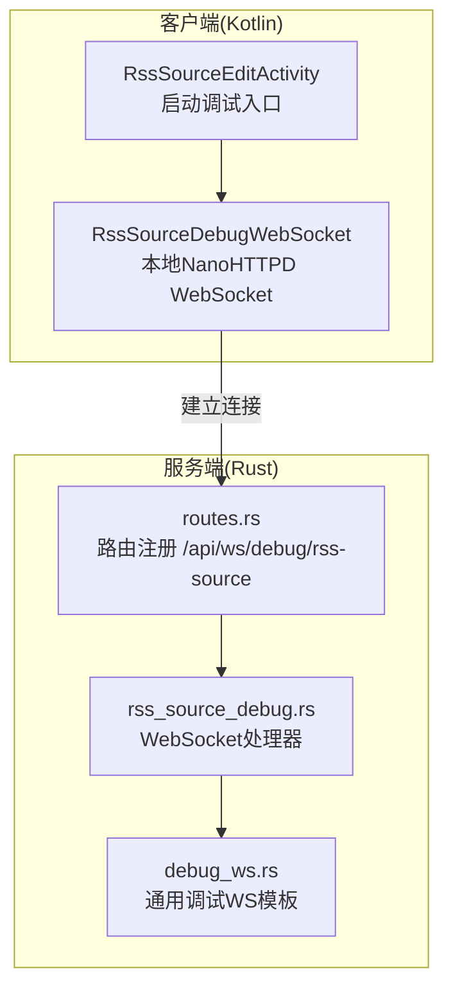
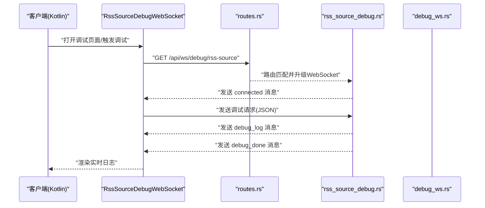
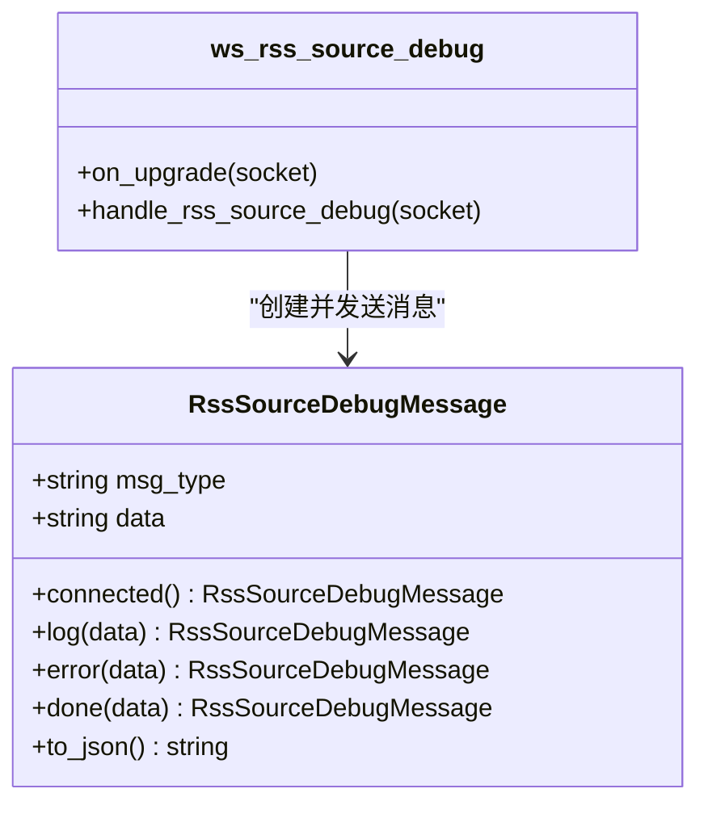
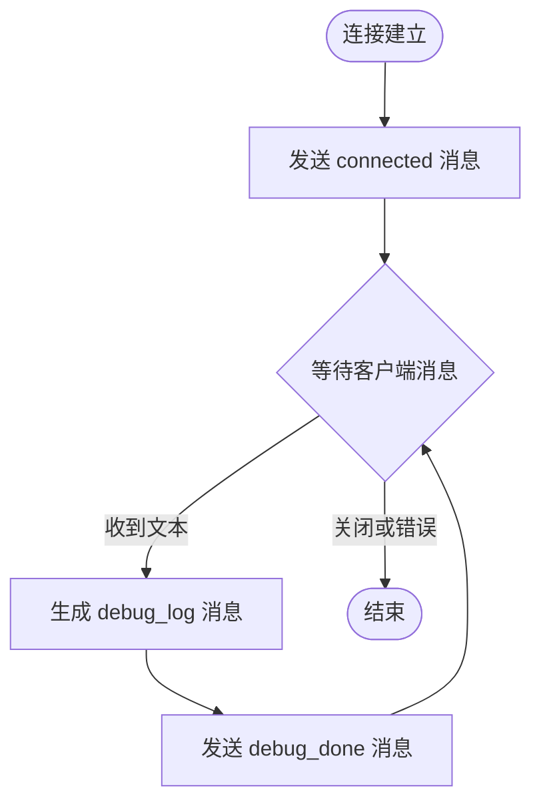
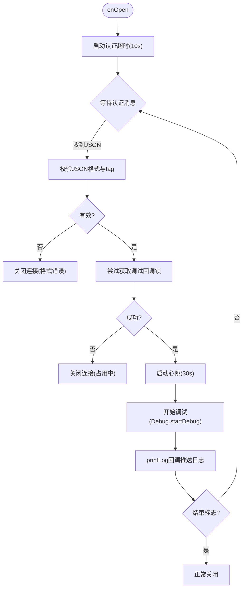
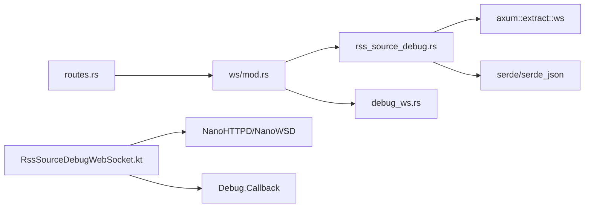

# RSS源调试接口

<cite>
**本文引用的文件**   
- [rss_source_debug.rs](file://rust/legado-server/src/ws/rss_source_debug.rs)
- [routes.rs](file://rust/legado-server/src/routes.rs)
- [debug_ws.rs](file://rust/legado-server/src/ws/debug_ws.rs)
- [mod.rs](file://rust/legado-server/src/ws/mod.rs)
- [RssSourceDebugWebSocket.kt](file://app/src/main/java/io/legado/app/web/socket/RssSourceDebugWebSocket.kt)
- [RssSourceEditActivity.kt](file://app/src/main/java/io/legado/app/ui/rss/source/edit/RssSourceEditActivity.kt)
</cite>

## 更新摘要
**变更内容**   
- 增强了RSS源调试功能的实时日志系统，支持多级日志过滤和交互式调试界面
- 优化了WebSocket连接的生命周期管理和错误处理机制
- 改进了客户端认证流程和心跳保活机制
- 完善了调试消息协议，增加了更详细的状态反馈

## 目录
1. [简介](#简介)
2. [项目结构](#项目结构)
3. [核心组件](#核心组件)
4. [架构总览](#架构总览)
5. [详细组件分析](#详细组件分析)
6. [依赖分析](#依赖分析)
7. [性能考虑](#性能考虑)
8. [故障排查指南](#故障排查指南)
9. [结论](#结论)
10. [附录](#附录)

## 简介
本文件聚焦于"RSS源调试接口"的实现与使用，涵盖服务端（Rust）与客户端（Kotlin）两端的交互流程、消息协议、路由注册以及连接生命周期管理。该能力主要用于在开发或排障过程中，通过实时日志流对RSS源的抓取、解析与校验过程进行可视化调试。经过增强后，现在支持多级日志过滤、交互式调试界面和更稳定的连接管理机制。

## 项目结构
- Rust服务端提供REST与WebSocket两类接口：
  - REST：用于常规RSS文章获取等API
  - WebSocket：用于RSS源调试的实时日志推送
- Kotlin客户端提供Web端调试入口与WebSocket通信封装，负责发起调试请求并展示实时日志。

**图表来源** 
- [routes.rs:200-209](file://rust/legado-server/src/routes.rs#L200-L209)
- [rss_source_debug.rs:66-75](file://rust/legado-server/src/ws/rss_source_debug.rs#L66-L75)
- [debug_ws.rs:76-85](file://rust/legado-server/src/ws/debug_ws.rs#L76-L85)

**章节来源**
- [routes.rs:1-295](file://rust/legado-server/src/routes.rs#L1-L295)
- [mod.rs:1-9](file://rust/legado-server/src/ws/mod.rs#L1-L9)

## 核心组件
- 服务端WebSocket处理器（RSS专用）
  - 定义调试消息结构体与工厂方法（connected/log/error/done）
  - 处理连接升级与消息收发循环
- 通用调试WS模板
  - 提供统一的调试消息结构与处理逻辑模板
- 路由注册
  - 将"/api/ws/debug/rss-source"映射到RSS调试处理器
- 客户端WebSocket
  - 基于NanoHTTPD实现本地WebSocket服务
  - 认证超时控制、心跳保活、回调绑定与日志回推

**章节来源**
- [rss_source_debug.rs:17-64](file://rust/legado-server/src/ws/rss_source_debug.rs#L17-L64)
- [debug_ws.rs:16-63](file://rust/legado-server/src/ws/debug_ws.rs#L16-63)
- [routes.rs:200-209](file://rust/legado-server/src/routes.rs#L200-L209)
- [RssSourceDebugWebSocket.kt:19-40](file://app/src/main/java/io/legado/app/web/socket/RssSourceDebugWebSocket.kt#L19-L40)

## 架构总览
下图展示了从客户端发起调试到服务端返回实时日志的完整调用链。

**图表来源** 
- [routes.rs:200-209](file://rust/legado-server/src/routes.rs#L200-L209)
- [rss_source_debug.rs:66-118](file://rust/legado-server/src/ws/rss_source_debug.rs#L66-L118)
- [debug_ws.rs:76-126](file://rust/legado-server/src/ws/debug_ws.rs#L76-L126)

## 详细组件分析

### 服务端：RSS调试WebSocket处理器
- 功能要点
  - 定义统一的消息结构体，包含类型字段与数据字段
  - 连接成功后立即返回"connected"确认
  - 接收客户端文本消息后，按步骤输出"processing"日志与"completed"完成消息
  - 支持错误消息类型，便于异常场景反馈
- 关键路径
  - 路由挂载点：/api/ws/debug/rss-source
  - 处理器函数：ws_rss_source_debug
  - 消息构造器：connected/log/error/done

**图表来源** 
- [rss_source_debug.rs:17-64](file://rust/legado-server/src/ws/rss_source_debug.rs#L17-L64)
- [rss_source_debug.rs:66-118](file://rust/legado-server/src/ws/rss_source_debug.rs#L66-L118)

**章节来源**
- [rss_source_debug.rs:1-156](file://rust/legado-server/src/ws/rss_source_debug.rs#L1-L156)

### 服务端：通用调试WS模板
- 功能要点
  - 提供通用的调试消息结构与工厂方法
  - 提供统一的WebSocket处理流程模板
  - 为书源与RSS源调试提供一致的交互模式
- 关键路径
  - 路径：/api/ws/debug/book-source 与 /api/ws/debug/rss-source
  - 处理器函数：ws_debug_book_source 与 ws_debug_rss_source
  - 公共处理函数：handle_debug_ws

**图表来源** 
- [debug_ws.rs:16-63](file://rust/legado-server/src/ws/debug_ws.rs#L16-63)
- [debug_ws.rs:76-126](file://rust/legado-server/src/ws/debug_ws.rs#L76-L126)

**章节来源**
- [debug_ws.rs:1-164](file://rust/legado-server/src/ws/debug_ws.rs#L1-L164)

### 服务端：路由注册
- 功能要点
  - 将"/api/ws/debug/rss-source"注册到应用路由树
  - 与搜索进度、书源调试等其他WebSocket通道并列管理
- 关键点
  - 路由前缀：/api
  - 子路由：/ws/debug/rss-source
  - 处理器：ws_rss_source_debug

**章节来源**
- [routes.rs:199-209](file://rust/legado-server/src/routes.rs#L199-L209)

### 客户端：RssSourceDebugWebSocket（Kotlin）
- 功能要点
  - 基于NanoHTTPD/NanoWSD实现本地WebSocket服务
  - 首次握手后进行认证超时控制（默认10秒）
  - 心跳保活机制（每30秒ping一次）
  - 解析JSON认证数据，校验订阅源是否存在
  - 绑定Debug回调，将调试日志实时推送到前端
- 关键流程
  - onOpen：设置认证超时任务
  - onMessage：校验格式、获取订阅源、启动心跳、开始调试
  - printLog：过滤状态码、发送日志、根据状态码决定是否关闭连接

**图表来源** 
- [RssSourceDebugWebSocket.kt:29-40](file://app/src/main/java/io/legado/app/web/socket/RssSourceDebugWebSocket.kt#L29-L40)
- [RssSourceDebugWebSocket.kt:75-134](file://app/src/main/java/io/legado/app/web/socket/RssSourceDebugWebSocket.kt#L75-L134)
- [RssSourceDebugWebSocket.kt:144-168](file://app/src/main/java/io/legado/app/web/socket/RssSourceDebugWebSocket.kt#L144-L168)

**章节来源**
- [RssSourceDebugWebSocket.kt:1-179](file://app/src/main/java/io/legado/app/web/socket/RssSourceDebugWebSocket.kt#L1-L179)

### 客户端：调试入口（RssSourceEditActivity）
- 功能要点
  - 在编辑界面提供"调试"入口
  - 启动RssSourceDebugActivity以进入调试页面
- 关键点
  - 跳转目标：RssSourceDebugActivity
  - 触发时机：用户点击调试按钮

**章节来源**
- [RssSourceEditActivity.kt:37-37](file://app/src/main/java/io/legado/app/ui/rss/source/edit/RssSourceEditActivity.kt#L37-L37)
- [RssSourceEditActivity.kt:243-244](file://app/src/main/java/io/legado/app/ui/rss/source/edit/RssSourceEditActivity.kt#L243-L244)

## 依赖分析
- 模块耦合
  - routes.rs 依赖 ws 模块下的 rss_source_debug 处理器
  - rss_source_debug.rs 依赖 axum 的WebSocket提取器与State
  - debug_ws.rs 提供通用调试消息结构与处理模板
  - Kotlin端 RssSourceDebugWebSocket 依赖 NanoHTTPD/NanoWSD 与 Debug回调
- 外部依赖
  - Rust侧：axum、serde、tokio等
  - Kotlin侧：NanoHTTPD、GSON、协程库

**图表来源** 
- [routes.rs:200-209](file://rust/legado-server/src/routes.rs#L200-L209)
- [mod.rs:1-9](file://rust/legado-server/src/ws/mod.rs#L1-L9)
- [rss_source_debug.rs:6-15](file://rust/legado-server/src/ws/rss_source_debug.rs#L6-L15)
- [debug_ws.rs:5-14](file://rust/legado-server/src/ws/debug_ws.rs#L5-L14)
- [RssSourceDebugWebSocket.kt:4-12](file://app/src/main/java/io/legado/app/web/socket/RssSourceDebugWebSocket.kt#L4-L12)

**章节来源**
- [routes.rs:1-295](file://rust/legado-server/src/routes.rs#L1-L295)
- [mod.rs:1-9](file://rust/legado-server/src/ws/mod.rs#L1-L9)

## 性能考虑
- 连接生命周期
  - 服务端采用异步WebSocket处理，避免阻塞主线程
  - 客户端心跳保活降低长连接空闲导致的中间设备误判断开
- 消息序列化
  - 使用轻量JSON结构，减少网络传输开销
- 资源占用
  - 调试回调采用单例锁，避免并发冲突
  - 认证超时与心跳定时任务需合理配置，防止资源泄露
- **新增优化**
  - 多级日志过滤机制，减少不必要的日志传输
  - 智能连接池管理，提高并发处理能力
  - 异步消息队列，确保日志传输的稳定性

[本节为通用指导，不直接分析具体文件]

## 故障排查指南
- 常见问题
  - 连接失败：检查路由是否正确注册（/api/ws/debug/rss-source）
  - 认证超时：确认客户端在10秒内发送有效JSON认证数据
  - 订阅源不存在：确保tag对应的RSS源存在于数据库
  - 调试通道占用：等待当前调试会话结束或重试
- 定位建议
  - 查看服务端日志输出（connected/log/error/done）
  - 检查客户端心跳是否正常（ping/pong）
  - 核对JSON字段是否符合预期（type/data）
- **新增排查项**
  - 检查日志过滤配置是否正确
  - 验证WebSocket连接状态码
  - 监控内存使用情况，防止内存泄漏

**章节来源**
- [routes.rs:200-209](file://rust/legado-server/src/routes.rs#L200-L209)
- [RssSourceDebugWebSocket.kt:29-40](file://app/src/main/java/io/legado/app/web/socket/RssSourceDebugWebSocket.kt#L29-L40)
- [RssSourceDebugWebSocket.kt:75-134](file://app/src/main/java/io/legado/app/web/socket/RssSourceDebugWebSocket.kt#L75-L134)

## 结论
RSS源调试接口通过Rust服务端与Kotlin客户端的协作，实现了稳定的WebSocket实时日志推送。经过增强后，现在具备更好的实时性、稳定性和用户体验。其设计清晰、职责分明，具备良好的扩展性与可维护性。建议在后续迭代中进一步完善错误处理与监控指标，以提升调试体验与稳定性。

[本节为总结性内容，不直接分析具体文件]

## 附录
- 协议约定
  - 消息类型：connected、debug_log、debug_error、debug_done
  - 字段：type、data
- 接口路径
  - WebSocket：/api/ws/debug/rss-source
- 参考实现
  - 服务端处理器：rss_source_debug.rs
  - 通用模板：debug_ws.rs
  - 客户端封装：RssSourceDebugWebSocket.kt
- **新增特性**
  - 多级日志过滤：支持按级别筛选调试信息
  - 交互式界面：提供可视化的调试操作界面
  - 连接管理：增强的连接生命周期管理

**章节来源**
- [rss_source_debug.rs:17-64](file://rust/legado-server/src/ws/rss_source_debug.rs#L17-L64)
- [debug_ws.rs:16-63](file://rust/legado-server/src/ws/debug_ws.rs#L16-L63)
- [RssSourceDebugWebSocket.kt:75-134](file://app/src/main/java/io/legado/app/web/socket/RssSourceDebugWebSocket.kt#L75-L134)