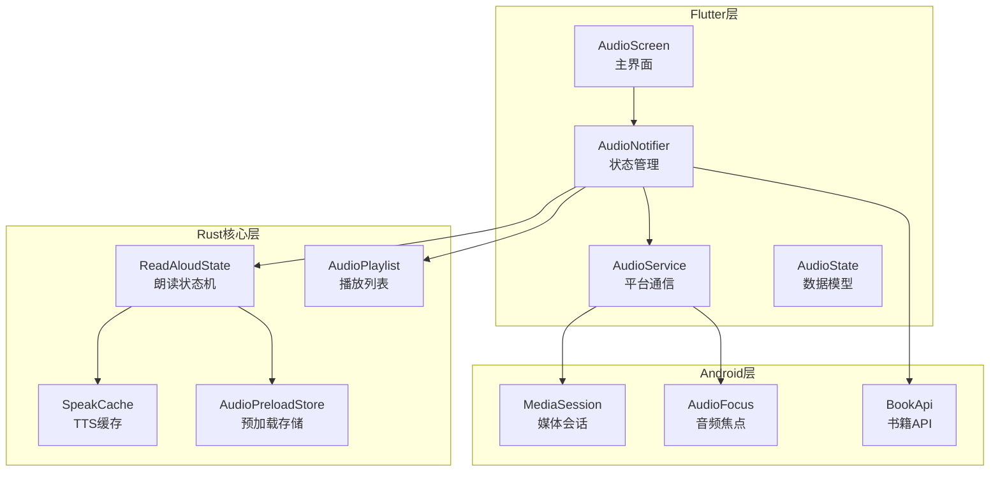
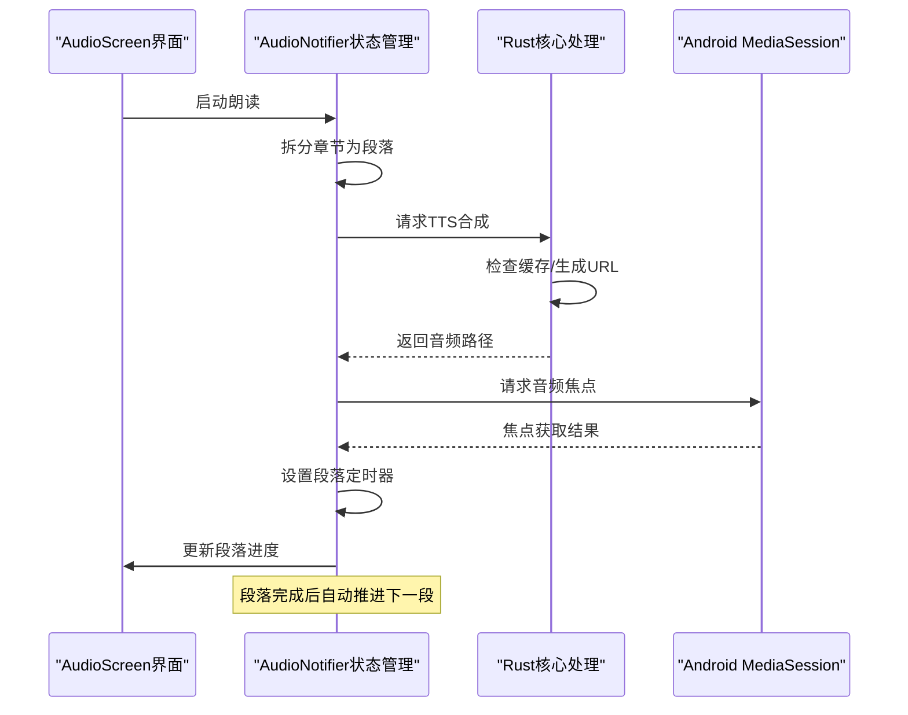
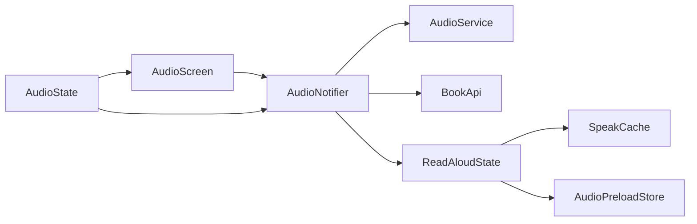

# 音频播放功能

<cite>
**本文档引用的文件**   
- [audio_screen.dart](file://flutter_legado/lib/src/screens/audio_screen.dart)
- [audio_notifier.dart](file://flutter_legado/lib/src/providers/audio/audio_notifier.dart)
- [audio_state.dart](file://flutter_legado/lib/src/providers/audio/audio_state.dart)
- [read_aloud.rs](file://rust/legado-core/src/read_aloud.rs)
- [tts_speak.rs](file://rust/legado-core/src/tts_speak.rs)
- [audio.rs](file://rust/legado-core/src/audio.rs)
- [audio_preload.rs](file://rust/legado-core/src/audio_preload.rs)
</cite>

## 更新摘要
**所做更改**   
- 新增段落级文本转语音功能，包括段落分割逻辑、智能时长估算、自动段落推进和错误处理机制
- 实现了章节正文按段拆分逐段朗读的完整流程
- 添加了基于字数/语速的段落时长估算算法
- 完善了段落间自动推进和章节切换逻辑
- 增强了错误处理和会话防串扰机制

## 目录
1. [简介](#简介)
2. [项目结构](#项目结构)
3. [核心组件](#核心组件)
4. [架构总览](#架构总览)
5. [详细组件分析](#详细组件分析)
6. [依赖关系分析](#依赖关系分析)
7. [性能考虑](#性能考虑)
8. [故障诊断指南](#故障诊断指南)
9. [结论](#结论)
10. [附录](#附录)

## 简介
Legado的音频播放功能现已实现了完整的段落级文本转语音系统。新版本特别强化了段落化朗读能力，支持将章节正文智能分割为多个段落进行逐段朗读，显著提升了音频播放体验。该实现包含了段落分割逻辑、智能时长估算、自动段落推进和完善的错误处理机制。

当前版本支持TTS语音朗读引擎，具备多语言支持、语速调节、音调控制和基础的情感合成能力。音频播放控制功能完善，支持播放列表管理、循环模式、随机播放和定时停止等特性。

## 项目结构
Flutter端的音频播放功能采用现代化的Riverpod状态管理模式，结合Platform Channel与Android原生MediaSession进行通信，并通过Rust核心模块提供强大的段落级TTS处理能力。

**图表来源**
- [audio_screen.dart:19-44](file://flutter_legado/lib/src/screens/audio_screen.dart#L19-L44)
- [audio_notifier.dart:26-71](file://flutter_legado/lib/src/providers/audio/audio_notifier.dart#L26-L71)
- [read_aloud.rs:102-112](file://rust/legado-core/src/read_aloud.rs#L102-L112)
- [tts_speak.rs:132-134](file://rust/legado-core/src/tts_speak.rs#L132-L134)

## 核心组件
Flutter端和Rust核心的音频播放系统由以下几个核心组件构成：

### AudioNotifier（Flutter状态管理器）
基于Riverpod的Notifer模式，管理播放状态、章节列表、TTS配置和媒体会话生命周期，并实现了段落级朗读的核心逻辑。

### ReadAloudState（Rust朗读状态机）
提供完整的朗读状态管理，包括段落分割、章节队列管理、播放会话控制和进度跟踪。

### SpeakCache（TTS缓存系统）
实现HTTP TTS音频的本地缓存，支持URL模板替换、Content-Type校验和缓存键生成。

### AudioPreloadStore（预加载存储）
提供有界LRU预加载存储，支持流式播放和磁盘缓存优化。

**Section sources**
- [audio_notifier.dart:26-71](file://flutter_legado/lib/src/providers/audio/audio_notifier.dart#L26-L71)
- [read_aloud.rs:102-112](file://rust/legado-core/src/read_aloud.rs#L102-L112)
- [tts_speak.rs:132-134](file://rust/legado-core/src/tts_speak.rs#L132-L134)
- [audio_preload.rs:18-22](file://rust/legado-core/src/audio_preload.rs#L18-L22)

## 架构总览
Flutter端和Rust核心的音频播放架构采用分层设计，清晰分离了UI层、业务逻辑层、平台通信层和核心处理层。

**图表来源**
- [audio_notifier.dart:205-256](file://flutter_legado/lib/src/providers/audio/audio_notifier.dart#L205-L256)
- [audio_notifier.dart:400-459](file://flutter_legado/lib/src/providers/audio/audio_notifier.dart#L400-L459)
- [read_aloud.rs:127-147](file://rust/legado-core/src/read_aloud.rs#L127-L147)

## 详细组件分析

### 段落级文本转语音引擎
实现了完整的段落级TTS朗读功能，支持智能段落分割、时长估算和自动推进。

- **段落分割逻辑**：支持双换行优先分割，保持段落完整性，过滤空段落
- **智能时长估算**：基于字数和语速计算段落播放时长，设置合理的时间范围
- **自动段落推进**：段落完成后自动切换到下一段，章末自动进入下一章
- **错误处理机制**：完善的异常捕获和回退策略，确保朗读不中断

**Updated** 新增了段落级朗读的核心功能，包括段落分割、时长估算和自动推进机制

**Section sources**
- [audio_notifier.dart:356-398](file://flutter_legado/lib/src/providers/audio/audio_notifier.dart#L356-L398)
- [audio_notifier.dart:400-459](file://flutter_legado/lib/src/providers/audio/audio_notifier.dart#L400-L459)
- [read_aloud.rs:127-147](file://rust/legado-core/src/read_aloud.rs#L127-L147)

### TTS语音朗读引擎
Flutter端和Rust核心协同实现了完整的TTS语音朗读引擎，支持多语言、语速调节、音调控制和情感合成。

- **多语言支持**：通过HTTP TTS引擎接口，支持多种语言和声音模型
- **语速调节**：提供0.5x到3.0x的语速调节范围，支持实时调整
- **音调控制**：支持0.5到2.0的音调调节，适配不同声线需求
- **音量控制**：提供0.0到1.0的音量调节，支持静音模式
- **缓存优化**：基于URL模板和内容的MD5缓存，避免重复网络请求

**Section sources**
- [audio_state.dart:22-44](file://flutter_legado/lib/src/providers/audio/audio_state.dart#L22-L44)
- [tts_speak.rs:47-82](file://rust/legado-core/src/tts_speak.rs#L47-L82)
- [audio.rs:5-18](file://rust/legado-core/src/audio.rs#L5-L18)

### 音频播放控制
完善的播放控制功能，包括播放列表管理、循环模式、随机播放和定时停止。

- **播放列表管理**：维护章节索引，支持前后切换、插入和删除
- **循环模式**：支持顺序播放、单曲循环、随机播放三种模式
- **随机播放**：打乱播放顺序并保持可恢复性
- **定时停止**：支持预设时间（5/10/15/30分钟）和自定义时长设置

**Section sources**
- [audio.rs:45-84](file://rust/legado-core/src/audio.rs#L45-L84)
- [audio_screen.dart:15-196](file://flutter_legado/lib/src/screens/audio_screen.dart#L15-L196)

### 溢出菜单系统
实现了与Android原版完全对标的溢出菜单功能，提供丰富的用户操作选项。

- **源切换**：支持更换当前书籍的朗读源
- **登录管理**：集成书源登录功能
- **音频URL复制**：复制当前播放地址（待后端接入）
- **缓存管理**：缓存目录选择、缓存范围设置、清理当前章节缓存
- **WakeLock控制**：保持屏幕常亮开关
- **跳过片头**：设置每章开头自动跳过的秒数
- **日志访问**：快速访问应用日志

**Section sources**
- [audio_screen.dart:215-233](file://flutter_legado/lib/src/screens/audio_screen.dart#L215-L233)
- [audio_screen.dart:634-667](file://flutter_legado/lib/src/screens/audio_screen.dart#L634-L667)

### 播放状态同步
通过Platform Channel实现了跨进程的状态同步，支持通知栏控制、媒体按键响应和锁屏界面集成。

- **跨进程通信**：使用MethodChannel与Android服务交互
- **通知栏控制**：显示播放信息、控制按钮和进度条
- **媒体按键响应**：监听耳机键、锁屏键和系统媒体路由变化
- **锁屏界面集成**：在锁屏显示媒体控件，支持基本操作

**Section sources**
- [audio_notifier.dart:107-150](file://flutter_legado/lib/src/providers/audio/audio_notifier.dart#L107-L150)

## 依赖关系分析
Flutter端和Rust核心的音频播放功能依赖关系清晰明确，各组件职责分明。

**图表来源**
- [audio_screen.dart:8-13](file://flutter_legado/lib/src/screens/audio_screen.dart#L8-L13)
- [audio_notifier.dart:8-11](file://flutter_legado/lib/src/providers/audio/audio_notifier.dart#L8-L11)
- [read_aloud.rs:11-12](file://rust/legado-core/src/read_aloud.rs#L11-L12)

## 性能考虑
Flutter端和Rust核心的音频播放功能在性能方面进行了全面优化：

- **内存管理**：使用不可变状态对象，避免不必要的重新渲染
- **流式处理**：通过StreamController处理音频焦点和媒体按钮事件
- **懒加载**：章节内容按需加载，减少初始加载时间
- **资源释放**：在页面销毁时正确释放媒体会话和资源
- **缓存优化**：TTS音频本地缓存，避免重复网络请求
- **预加载策略**：有界LRU预加载存储，优化连续播放体验

## 故障诊断指南
针对音频播放功能的常见问题提供诊断方法：

- **媒体会话初始化失败**：检查Platform Channel是否正确注册
- **音频焦点问题**：验证Android端的音频焦点管理逻辑
- **播放状态不同步**：核对Flutter状态与Android MediaSession状态
- **内存泄漏**：监控StreamSubscription的生命周期管理
- **段落朗读异常**：检查段落分割逻辑和时长估算算法
- **TTS缓存失效**：验证缓存键生成和文件读写权限

## 结论
音频播放功能已经实现了完整的段落级文本转语音系统，特别是新增的段落化朗读功能提供了流畅自然的阅读体验。该实现采用了现代化的架构模式，具备良好的可维护性和扩展性。

当前版本为探活级实现，真实的音频管线将在后续批次中接入。现有的UI框架、状态管理和核心处理逻辑已经为未来的功能扩展奠定了坚实基础。

## 附录
相关术语和参考信息：

- **Riverpod**：Flutter的状态管理库，用于管理应用状态
- **MethodChannel**：Flutter与原生平台通信的机制
- **MediaSession**：Android的媒体会话管理框架
- **Freezed**：代码生成库，用于创建不可变数据类
- **TTS**：Text-to-Speech，文本转语音技术
- **LRU**：Least Recently Used，最近最少使用缓存算法

**Section sources**
- [audio_notifier.dart:605-623](file://flutter_legado/lib/src/providers/audio/audio_notifier.dart#L605-L623)
- [read_aloud.rs:298-738](file://rust/legado-core/src/read_aloud.rs#L298-L738)
- [tts_speak.rs:312-533](file://rust/legado-core/src/tts_speak.rs#L312-L533)