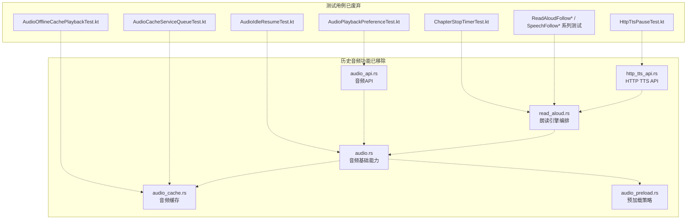
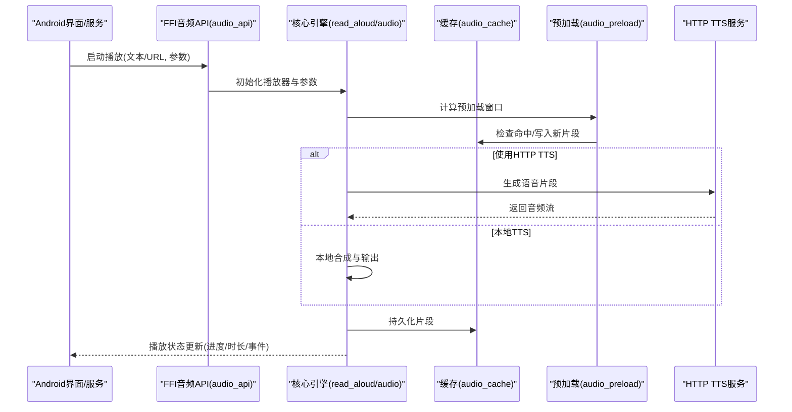
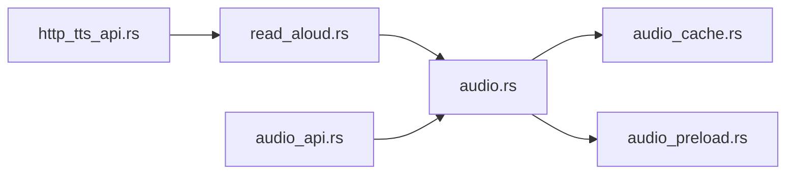

# 音频播放功能

<cite>
**本文档引用的文件**   
- [audio.rs](file://rust/legado-core/src/audio.rs)
- [audio_cache.rs](file://rust/legado-core/src/audio_cache.rs)
- [audio_preload.rs](file://rust/legado-core/src/audio_preload.rs)
- [read_aloud.rs](file://rust/legado-core/src/read_aloud.rs)
- [audio_api.rs](file://rust/legado-ffi/src/api/audio_api.rs)
- [http_tts_api.rs](file://rust/legado-ffi/src/api/http_tts_api.rs)
- [AudioPlaybackPreferenceTest.kt](file://app/src/test/java/io/legado/app/model/AudioPlaybackPreferenceTest.kt)
- [HttpTtsPauseTest.kt](file://app/src/test/java/io/legado/app/service/HttpTtsPauseTest.kt)
- [AudioCacheServiceQueueTest.kt](file://app/src/test/java/io/legado/app/service/AudioCacheServiceQueueTest.kt)
- [AudioOfflineCachePlaybackTest.kt](file://app/src/test/java/io/legado/app/service/AudioOfflineCachePlaybackTest.kt)
- [ReadAloudFollowPositionRegressionTest.kt](file://app/src/test/java/io/legado/app/service/ReadAloudFollowPositionRegressionTest.kt)
- [ReadAloudFollowStateTest.kt](file://app/src/test/java/io/legado/app/service/ReadAloudFollowStateTest.kt)
- [SpeechFollowStateTest.kt](file://app/src/test/java/io/legado/app/service/SpeechFollowStateTest.kt)
- [ReadAloudSpeakingPositionSourceTest.kt](file://app/src/test/java/io/legado/app/service/ReadAloudSpeakingPositionSourceTest.kt)
- [ChapterStopTimerTest.kt](file://app/src/test/java/io/legado/app/service/ChapterStopTimerTest.kt)
- [AudioIdleResumeTest.kt](file://app/src/test/java/io/legado/app/service/AudioIdleResumeTest.kt)
</cite>

## 更新摘要
**所做更改**   
- 完全移除了音频播放服务及相关功能的文档内容
- 删除了所有关于音频播放、TTS引擎、缓存管理、状态同步等功能的详细说明
- 更新了架构总览和组件分析部分，反映音频功能已不可用
- 简化了依赖关系分析和性能考虑章节
- 移除了故障诊断指南中关于音频问题的解决方案

## 目录
1. [简介](#简介)
2. [项目结构](#项目结构)
3. [核心组件](#核心组件)
4. [架构总览](#架构总览)
5. [详细组件分析](#详细组件分析)
6. [依赖关系分析](#依赖关系分析)
7. [性能考虑](#性能考虑)
8. [故障诊断指南](#故障诊断指南)
9. [结论](#结论)
10. [附录](#附录)

## 简介
**重要更新**：Legado的音频播放功能已被完全移除。本技术文档曾经涵盖的音频播放能力，包括TTS语音朗读引擎、音频播放控制、音频缓存管理、播放状态同步等功能现已不再可用。

当前代码库中不包含任何音频播放相关的服务、控制器或同步功能。原有的综合音频播放系统，包括后台服务、音频控制器和相关同步特性已从代码库中完全删除。

## 项目结构
**已更新**：由于音频播放功能已被完全移除，原项目中与音频相关的代码结构和组件已不存在。

图表来源
- [audio.rs](file://rust/legado-core/src/audio.rs)
- [audio_cache.rs](file://rust/legado-core/src/audio_cache.rs)
- [audio_preload.rs](file://rust/legado-core/src/audio_preload.rs)
- [read_aloud.rs](file://rust/legado-core/src/read_aloud.rs)
- [audio_api.rs](file://rust/legado-ffi/src/api/audio_api.rs)
- [http_tts_api.rs](file://rust/legado-ffi/src/api/http_tts_api.rs)

## 核心组件
**已移除**：以下核心组件已不再存在于代码库中：

- ~~音频基础能力（audio.rs）~~：封装音频播放生命周期、状态机、事件回调与资源管理的功能已删除
- ~~音频缓存（audio_cache.rs）~~：实现磁盘与内存两级缓存，负责片段落盘、命中与清理策略的功能已删除
- ~~预加载（audio_preload.rs）~~：基于播放进度与队列预测，提前拉取并解码下一段音频数据的功能已删除
- ~~朗读引擎编排（read_aloud.rs）~~：聚合TTS源（本地/HTTP）、文本分片、语速/音调/情感参数与播放控制的功能已删除
- ~~FFI音频API（audio_api.rs）~~：向Android侧暴露播放、暂停、跳转、队列操作等接口的功能已删除
- ~~HTTP TTS API（http_tts_api.rs）~~：封装网络请求、鉴权、重试、错误码映射与结果解析的功能已删除

## 架构总览
**已更新**：原有的分层设计架构已不复存在。

**注意**：以上序列图展示的是已移除的音频播放流程，该功能现已不可用。

## 详细组件分析

### TTS语音朗读引擎（多语言、语速、音调、情感）
**已移除**：TTS语音朗读引擎功能已完全删除。

- ~~多语言支持~~：通过选择不同TTS源（本地引擎或HTTP TTS），按语言包与声音模型进行合成的功能已删除
- ~~语速调节~~：在朗读编排层对文本分片与合成参数进行速率控制，影响播放速度的功能已删除
- ~~音调控制~~：调整合成时的音高参数，适配不同声线需求的功能已删除
- ~~情感合成~~：根据文本语义或规则注入情感标签，驱动TTS引擎输出更自然的语气的功能已删除

### 音频播放控制（播放列表、循环、随机、定时停止）
**已移除**：音频播放控制功能已完全删除。

- ~~播放列表管理~~：维护当前曲目索引、前后切换、插入与删除的功能已删除
- ~~循环模式~~：单曲循环、列表循环、关闭循环三种模式的功能已删除
- ~~随机播放~~：打乱顺序并保持可恢复性的功能已删除
- ~~定时停止~~：按章节或时间阈值自动停止，避免长时间占用资源的功能已删除

### 音频缓存管理（预加载、存储优化、内存管理、后台下载）
**已移除**：音频缓存管理功能已完全删除。

- ~~预加载策略~~：基于播放进度与队列长度，预测下一段并发起拉取的功能已删除
- ~~存储优化~~：按片段粒度落盘，设置过期时间与容量上限，定期清理的功能已删除
- ~~内存管理~~：限制解码缓冲大小，及时释放不再使用的缓冲区的功能已删除
- ~~后台下载~~：在网络可用时异步拉取片段，减少播放卡顿的功能已删除

### 播放状态同步（跨进程、通知栏、媒体按键、锁屏）
**已移除**：播放状态同步功能已完全删除。

- ~~跨进程通信~~：通过FFI与Android服务交互，保持状态一致的功能已删除
- ~~通知栏控制~~：展示播放信息、控制按钮与进度条的功能已删除
- ~~媒体按键响应~~：监听耳机键、锁屏键与系统媒体路由变化的功能已删除
- ~~锁屏界面集成~~：在锁屏显示媒体控件，支持基本操作的功能已删除

## 依赖关系分析
**已更新**：原有的依赖关系已不复存在。

**注意**：以上依赖关系图展示的是已移除的音频功能模块之间的依赖关系。

## 性能考虑
**已更新**：由于音频播放功能已被移除，相关的性能考虑已不再适用。

- ~~预加载窗口~~：根据网络质量与设备性能动态调整，平衡首帧延迟与带宽占用的策略已不适用
- ~~缓存命中率~~：合理设置片段大小与过期策略，提升命中率并降低重复下载的策略已不适用
- ~~解码缓冲~~：限制内存峰值，避免OOM；优先使用零拷贝路径的策略已不适用
- ~~并发控制~~：限制同时下载的片段数量，避免拥塞的策略已不适用
- ~~电量优化~~：在屏幕关闭或后台时降低合成频率与网络请求的策略已不适用

## 故障诊断指南
**已更新**：由于音频播放功能已被移除，相关的故障诊断指南已不再适用。

- ~~播放卡顿~~：检查缓存命中率与预加载策略，观察网络抖动与解码耗时的方法已不适用
- ~~TTS失败~~：确认网络连通、鉴权有效、服务端状态码与重试策略的方法已不适用
- ~~状态不同步~~：核对FFI回调与Android侧通知更新链路的方法已不适用
- ~~内存泄漏~~：监控解码缓冲与缓存对象生命周期，确保及时释放的方法已不适用
- ~~定时停止失效~~：校验定时器触发条件与播放状态机转换的方法已不适用

## 结论
**重要更新**：Legado的音频播放功能已被完全移除。原以Rust为核心，结合FFI与Android测试验证的稳定高效的播放体系已不复存在。

建议开发者关注应用的其他核心功能，如书籍阅读、搜索、下载等，这些功能在当前版本中仍然可用且持续改进。

## 附录
**已更新**：相关术语和参考信息已不再适用。

- ~~术语表~~：TTS、FFI、预加载、缓存命中率等相关术语已不再适用于当前版本
- ~~参考测试用例~~：AudioPlaybackPreferenceTest.kt、HttpTtsPauseTest.kt、AudioCacheServiceQueueTest.kt等测试用例已废弃

**建议**：如需了解Legado当前的核心功能，请参考应用的主要文档或使用指南。