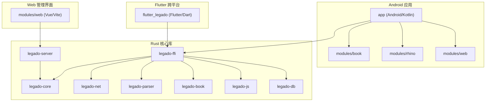
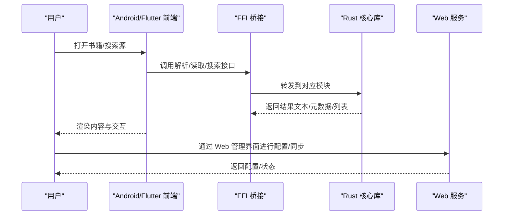
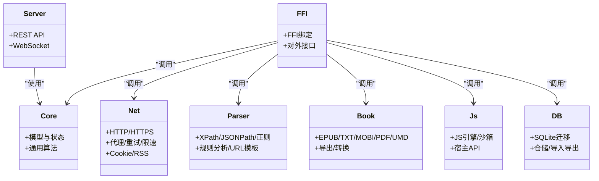
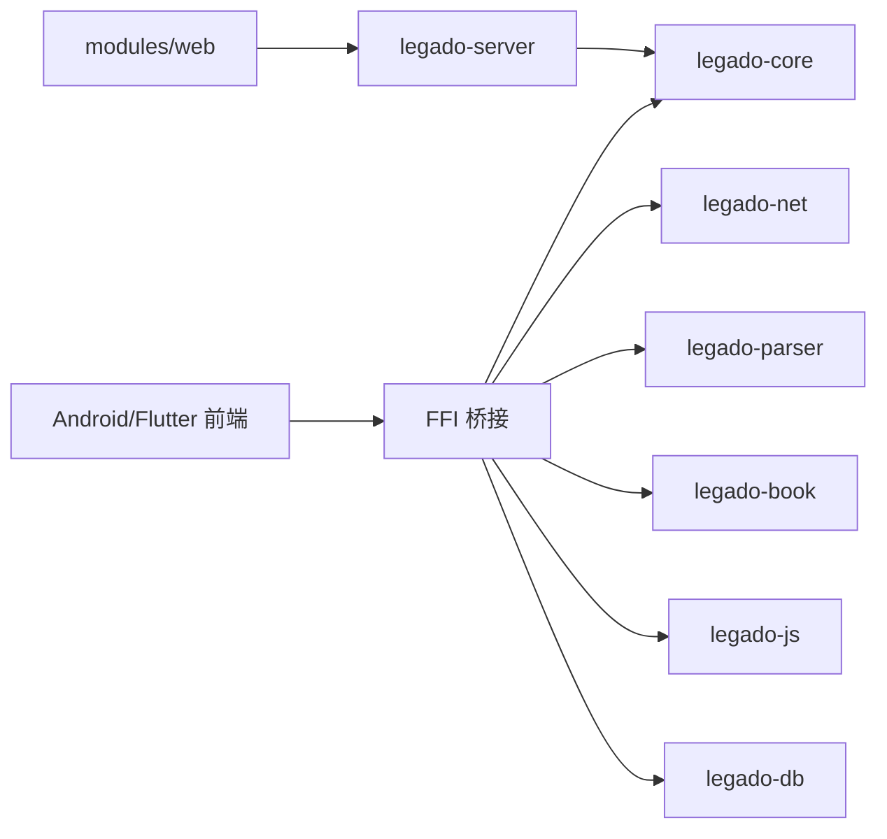

# 项目介绍与目标

<cite>
**本文引用的文件**   
- [README.md](file://README.md)
- [rust/PROGRESS.md](file://rust/PROGRESS.md)
- [app/src/main/java/io/legado/app/App.kt](file://app/src/main/java/io/legado/app/App.kt)
- [modules/web/package.json](file://modules/web/package.json)
- [flutter_legado/pubspec.yaml](file://flutter_legado/pubspec.yaml)
- [rust/Cargo.toml](file://rust/Cargo.toml)
- [rust/legado-server/Cargo.toml](file://rust/legado-server/Cargo.toml)
- [rust/legado-book/Cargo.toml](file://rust/legado-book/Cargo.toml)
- [rust/legado-core/Cargo.toml](file://rust/legado-core/Cargo.toml)
- [rust/legado-net/Cargo.toml](file://rust/legado-net/Cargo.toml)
- [rust/legado-parser/Cargo.toml](file://rust/legado-parser/Cargo.toml)
- [rust/legado-js/Cargo.toml](file://rust/legado-js/Cargo.toml)
- [rust/legado-db/Cargo.toml](file://rust/legado-db/Cargo.toml)
- [rust/legado-ffi/Cargo.toml](file://rust/legado-ffi/Cargo.toml)
</cite>

## 更新摘要
**所做更改**   
- 修正了关于项目完成状态的不准确声明，移除了"零 TODO/桩实现"的误导性表述
- 更新了项目当前完成度信息，从95%+修订为96-97%（Rust轨道）
- 新增了剩余工作项的详细说明，包括4个P1实质缺口
- 更新了项目版本信息和开发状态描述

## 目录
1. [简介](#简介)
2. [项目结构](#项目结构)
3. [核心组件](#核心组件)
4. [架构总览](#架构总览)
5. [详细组件分析](#详细组件分析)
6. [依赖关系分析](#依赖关系分析)
7. [性能考量](#性能考量)
8. [故障排查指南](#故障排查指南)
9. [结论](#结论)
10. [附录](#附录)

## 简介
Legado（阅读）是一个开源的跨平台电子书阅读解决方案，致力于为用户提供无缝、强大且可高度扩展的阅读体验。项目支持多种主流电子书格式（如 EPUB、TXT、MOBI、PDF、UMD 等），并具备强大的网络源解析能力，允许用户通过自定义规则接入海量在线内容。其设计目标包括：
- 统一的阅读体验：一致的排版、主题、字体与交互，覆盖多设备与多平台。
- 可扩展的规则体系：通过 JS/脚本引擎与规则配置，灵活适配不同网站与数据源。
- 多端同步与协作：通过内置 Web 管理界面与服务端能力，实现配置、书签、阅读进度等的便捷管理与同步。
- 高性能与稳定性：利用 Rust 处理高开销计算（解析、搜索、转码、音频缓存等），Android 原生优化与 Flutter 跨平台 UI 协同。

价值主张：
- 对普通用户：开箱即用、资源丰富、个性化强、跨设备一致体验。
- 对开发者与社区：开放源码、模块化架构、清晰的扩展点与插件机制，鼓励贡献与二次开发。

开源理念与贡献模式：
- 代码开源、文档公开、问题追踪透明，欢迎提交 Issue、PR 与规则分享。
- 社区驱动的规则生态，鼓励分享高质量源与工具链。

平台定位与优势：
- Android：原生优化，深度集成系统能力（通知、后台播放、存储、Cronet 网络栈）。
- Flutter：跨平台 UI 层，快速迭代与统一视觉体验。
- Rust：高性能核心库，提供 FFI 桥接至上层语言。
- Web：内嵌或独立 Web 管理界面，便于批量配置、调试与远程管理。

**项目当前状态**：
- 版本：**v4.0.0-alpha**（开发中）
- Rust 轨道完成度：**96-97%**（2026-08-06 源码级复查）
- Flutter UI 主链路已对齐，剩余约 92 项 UI 缺口
- 测试状态：cargo test 2283 passed + flutter test 1087 passed

## 项目结构
仓库采用多模块、多语言混合架构，主要包含：
- app：Android 主应用（Kotlin/Gradle），负责 UI、服务、数据库与系统集成。
- flutter_legado：Flutter 跨平台工程，提供跨端 UI 与桥接逻辑。
- modules：Android 子模块（book、rhino、web），封装特定功能与资源。
- rust：Rust 核心库集合（core、net、parser、book、js、db、server、ffi 等），通过 FFI 暴露给上层。
- modules/web：Web 管理界面（Vue/Vite），用于源编辑、书架管理与调试。

**图表来源**
- [app/src/main/java/io/legado/app/App.kt](file://app/src/main/java/io/legado/app/App.kt)
- [flutter_legado/pubspec.yaml](file://flutter_legado/pubspec.yaml)
- [rust/Cargo.toml](file://rust/Cargo.toml)
- [rust/legado-server/Cargo.toml](file://rust/legado-server/Cargo.toml)
- [modules/web/package.json](file://modules/web/package.json)

**章节来源**
- [README.md](file://README.md)
- [app/src/main/java/io/legado/app/App.kt](file://app/src/main/java/io/legado/app/App.kt)
- [flutter_legado/pubspec.yaml](file://flutter_legado/pubspec.yaml)
- [rust/Cargo.toml](file://rust/Cargo.toml)
- [modules/web/package.json](file://modules/web/package.json)

## 核心组件
- Android 应用（app）：作为主入口与系统集成层，负责 UI、服务调度、数据库访问、网络请求与本地资源管理。
- Flutter 跨平台（flutter_legado）：提供跨平台 UI 与业务编排，通过 FFI 调用 Rust 核心能力。
- Rust 核心库（rust/*）：
  - legado-core：领域模型、状态管理、通用算法与工具。
  - legado-net：HTTP/HTTPS、代理、重试、限速、Cookie、SSL 配置、RSS 等。
  - legado-parser：HTML/XPath/JSONPath/正则规则分析与执行。
  - legado-book：EPUB/TXT/MOBI/PDF/UMD 等格式解析与导出。
  - legado-js：JS 引擎与沙箱，支撑规则与脚本扩展。
  - legado-db：SQLite 迁移、仓储层、默认数据与导入导出。
  - legado-server：Web API 与 WebSocket，提供管理界面与远程能力。
  - legado-ffi：FFI 桥接，将 Rust 能力暴露给 Kotlin/Dart。
- Web 管理界面（modules/web）：基于 Vue/Vite，提供源编辑、书架管理、调试与配置同步。

**章节来源**
- [rust/Cargo.toml](file://rust/Cargo.toml)
- [rust/legado-core/Cargo.toml](file://rust/legado-core/Cargo.toml)
- [rust/legado-net/Cargo.toml](file://rust/legado-net/Cargo.toml)
- [rust/legado-parser/Cargo.toml](file://rust/legado-parser/Cargo.toml)
- [rust/legado-book/Cargo.toml](file://rust/legado-book/Cargo.toml)
- [rust/legado-js/Cargo.toml](file://rust/legado-js/Cargo.toml)
- [rust/legado-db/Cargo.toml](file://rust/legado-db/Cargo.toml)
- [rust/legado-server/Cargo.toml](file://rust/legado-server/Cargo.toml)
- [rust/legado-ffi/Cargo.toml](file://rust/legado-ffi/Cargo.toml)
- [modules/web/package.json](file://modules/web/package.json)

## 架构总览
整体架构遵循"前端（Android/Flutter/Web）—FFI—Rust 核心库"的分层设计：
- 前端层：Android 原生与 Flutter 跨平台 UI，负责用户交互与流程编排。
- 桥接层：FFI 定义稳定的接口契约，屏蔽语言差异。
- 核心层：Rust 模块按职责划分，提供高性能、可复用的能力。
- 服务端：内置 Web 服务器与 API，支持远程管理与同步。

**图表来源**
- [rust/legado-ffi/Cargo.toml](file://rust/legado-ffi/Cargo.toml)
- [rust/legado-core/Cargo.toml](file://rust/legado-core/Cargo.toml)
- [rust/legado-server/Cargo.toml](file://rust/legado-server/Cargo.toml)
- [app/src/main/java/io/legado/app/App.kt](file://app/src/main/java/io/legado/app/App.kt)
- [flutter_legado/pubspec.yaml](file://flutter_legado/pubspec.yaml)

## 详细组件分析

### Android 应用（app）
- 角色与职责：应用启动、生命周期管理、UI 框架、服务调度（播放、下载、缓存）、数据库访问、网络栈（Cronet）、资源加载。
- 关键特性：
  - 与 Rust FFI 集成，调用核心解析与计算能力。
  - 模块化资源与样式，支持多语言与主题切换。
  - 丰富的测试用例覆盖网络、迁移、Js 引擎等场景。

**章节来源**
- [app/src/main/java/io/legado/app/App.kt](file://app/src/main/java/io/legado/app/App.kt)

### Flutter 跨平台（flutter_legado）
- 角色与职责：跨平台 UI 与业务编排，复用 Rust 核心能力，保持与 Android 一致的阅读体验。
- 关键特性：
  - 使用 Dart/Flutter 构建 UI，支持多端部署。
  - 通过 FFI 调用 Rust 模块，保证性能与一致性。
  - 提供单元测试与 Widget 测试，保障质量。

**章节来源**
- [flutter_legado/pubspec.yaml](file://flutter_legado/pubspec.yaml)

### Rust 核心库（rust/*）
- legado-core：领域模型（书、章节、源、RSS）、状态机、统计、定时任务、加密与密码学工具。
- legado-net：网络客户端、Cookie 管理、代理、重试、限速、SSL 配置、RSS 抓取。
- legado-parser：规则分析器、XPath/JSONPath/正则引擎、URL 解析与模板。
- legado-book：多格式解析（EPUB/TXT/MOBI/PDF/UMD）、导出与转换。
- legado-js：JS 引擎与沙箱，宿主 API（文件、加密、并发、编码、HTML 格式化等）。
- legado-db：SQLite 迁移、仓储抽象、默认数据、导入导出。
- legado-server：REST API 与 WebSocket，提供 Web 管理界面后端。
- legado-ffi：FFI 生成与绑定，对外暴露稳定接口。

**图表来源**
- [rust/legado-core/Cargo.toml](file://rust/legado-core/Cargo.toml)
- [rust/legado-net/Cargo.toml](file://rust/legado-net/Cargo.toml)
- [rust/legado-parser/Cargo.toml](file://rust/legado-parser/Cargo.toml)
- [rust/legado-book/Cargo.toml](file://rust/legado-book/Cargo.toml)
- [rust/legado-js/Cargo.toml](file://rust/legado-js/Cargo.toml)
- [rust/legado-db/Cargo.toml](file://rust/legado-db/Cargo.toml)
- [rust/legado-server/Cargo.toml](file://rust/legado-server/Cargo.toml)
- [rust/legado-ffi/Cargo.toml](file://rust/legado-ffi/Cargo.toml)

### Web 管理界面（modules/web）
- 角色与职责：提供源编辑、书架管理、调试与配置同步的 Web 界面。
- 关键特性：
  - Vue/Vite 构建，现代化前端技术栈。
  - 与 Rust 服务端通信，实现实时调试与批量操作。

**章节来源**
- [modules/web/package.json](file://modules/web/package.json)

## 依赖关系分析
- 前端（Android/Flutter）依赖 FFI 提供的稳定接口。
- FFI 依赖各 Rust 模块（core/net/parser/book/js/db/server）。
- Web 管理界面依赖 Rust 服务端 API。
- 各 Rust 模块之间职责清晰、耦合度低，便于独立演进与测试。

**图表来源**
- [rust/Cargo.toml](file://rust/Cargo.toml)
- [rust/legado-ffi/Cargo.toml](file://rust/legado-ffi/Cargo.toml)
- [rust/legado-server/Cargo.toml](file://rust/legado-server/Cargo.toml)
- [modules/web/package.json](file://modules/web/package.json)

**章节来源**
- [rust/Cargo.toml](file://rust/Cargo.toml)
- [rust/legado-ffi/Cargo.toml](file://rust/legado-ffi/Cargo.toml)
- [rust/legado-server/Cargo.toml](file://rust/legado-server/Cargo.toml)
- [modules/web/package.json](file://modules/web/package.json)

## 性能考量
- Rust 核心库承担高开销计算（解析、搜索、转码、音频缓存），显著提升性能与稳定性。
- Android 侧使用 Cronet 网络栈，提升网络吞吐与连接复用。
- Flutter 跨平台 UI 与 Rust 核心解耦，避免 UI 线程阻塞。
- 数据库层采用 SQLite 与迁移策略，确保数据一致性与升级平滑。
- 建议：
  - 合理分页与懒加载，减少内存占用。
  - 使用异步与协程，避免阻塞主线程。
  - 对大文件解析启用流式处理与缓存策略。

## 故障排查指南
- 常见问题定位：
  - 网络问题：检查代理、SSL 配置、重试与限速策略。
  - 解析失败：校验 XPath/JSONPath/正则规则，确认 HTML/JSON 结构变化。
  - 格式不支持：确认电子书格式是否在支持列表中，必要时启用转换。
  - 同步异常：检查 Web 服务端口、权限与网络连通性。
- 调试手段：
  - 使用 Web 管理界面的调试面板查看请求与响应。
  - 开启日志与错误上下文，定位 JS 脚本与规则执行问题。
  - 使用单元测试与集成测试验证规则与网络行为。

**章节来源**
- [rust/legado-net/Cargo.toml](file://rust/legado-net/Cargo.toml)
- [rust/legado-parser/Cargo.toml](file://rust/legado-parser/Cargo.toml)
- [rust/legado-js/Cargo.toml](file://rust/legado-js/Cargo.toml)
- [rust/legado-server/Cargo.toml](file://rust/legado-server/Cargo.toml)

## 结论
Legado 以开源、跨平台与高性能为核心，构建了从前端到核心的完整阅读解决方案。通过模块化设计与清晰的扩展点，既满足普通用户的多样化需求，也为开发者提供了强大的二次开发与贡献空间。

**项目当前完成度**：
- Rust 轨道完成度：**96-97%**（2026-08-06 源码级复查）
- Flutter UI 主链路已对齐，剩余约 92 项 UI 缺口
- 已完成 168/168 原子任务（100%）
- 测试覆盖率：cargo test 2283 passed + flutter test 1087 passed

**剩余工作项**：
- 4个P1实质缺口需要优先处理：
  1. 正文 nextContentUrl 分页抓取（2-3d）
  2. audioSpeak TTS 真实管线（3-5d，跨轨）
  3. WebView 桥接载荷 Flutter 侧拦截执行（2-3d，跨轨）
  4. rssUpdateSource 原子更新 FFI（0.5d）

未来将继续强化规则生态、跨平台体验与性能优化，推动社区共建与繁荣。

## 附录
- 快速上手（新用户）：
  - 安装 Android 应用或 Flutter 版本，导入本地书籍或添加网络源。
  - 使用 Web 管理界面进行批量配置与调试。
- 开发者指引：
  - 参考 Rust 核心库与 FFI 接口，编写规则与脚本。
  - 参与模块开发与测试，提交 PR 与 Issue。
- 项目状态跟踪：
  - 详细进度见 [rust/PROGRESS.md](file://rust/PROGRESS.md)
  - 版本信息见 [README.md](file://README.md)

**章节来源**
- [rust/PROGRESS.md](file://rust/PROGRESS.md)
- [README.md](file://README.md)