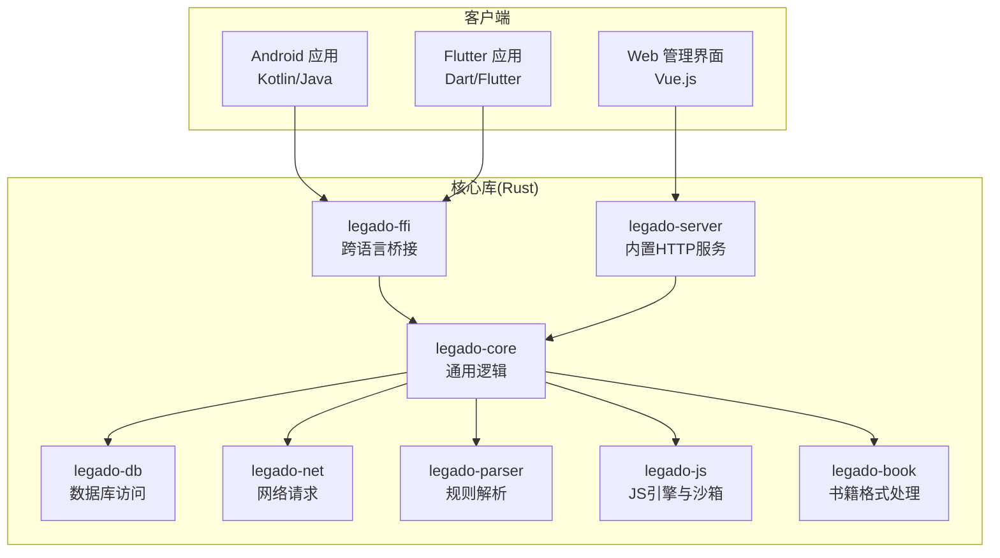
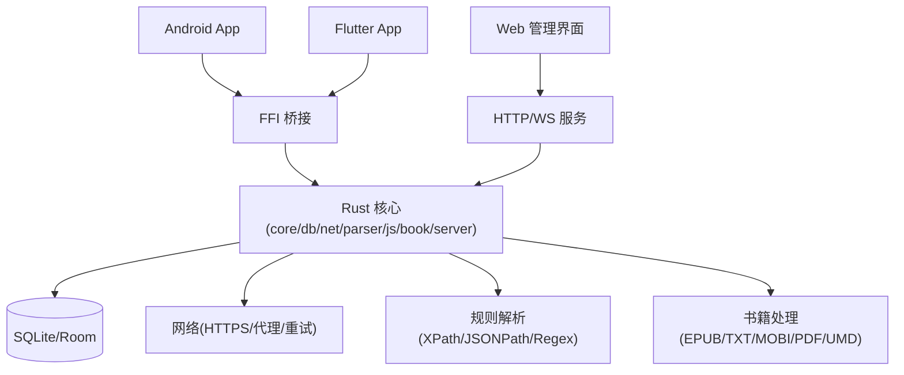
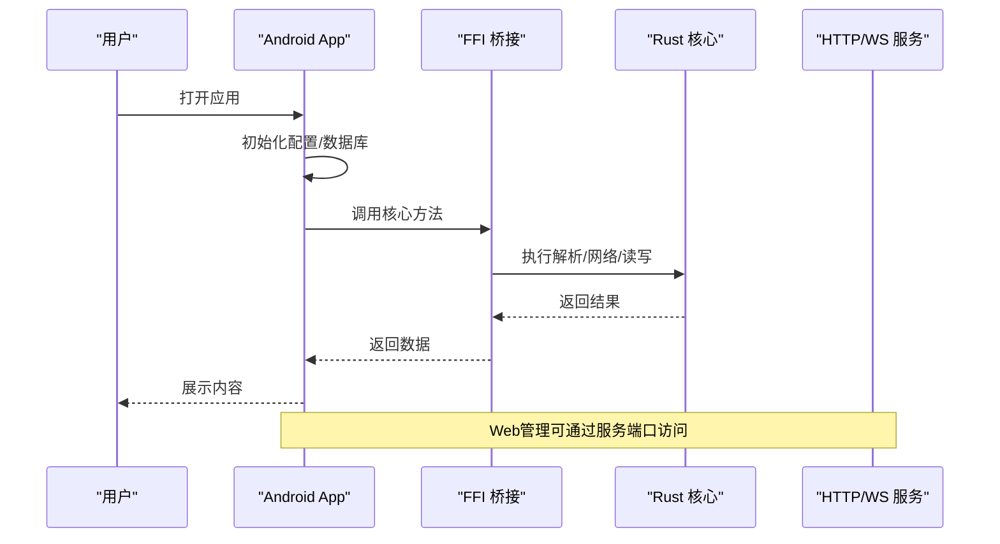
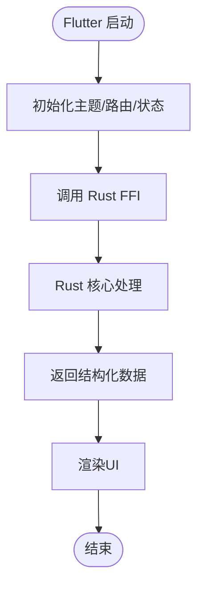
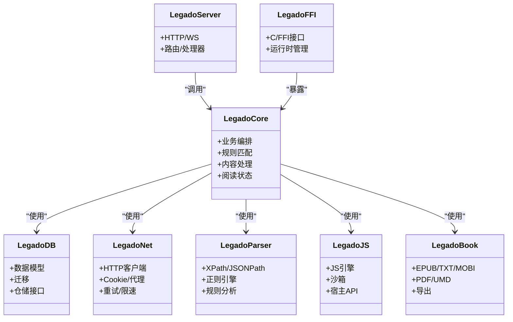
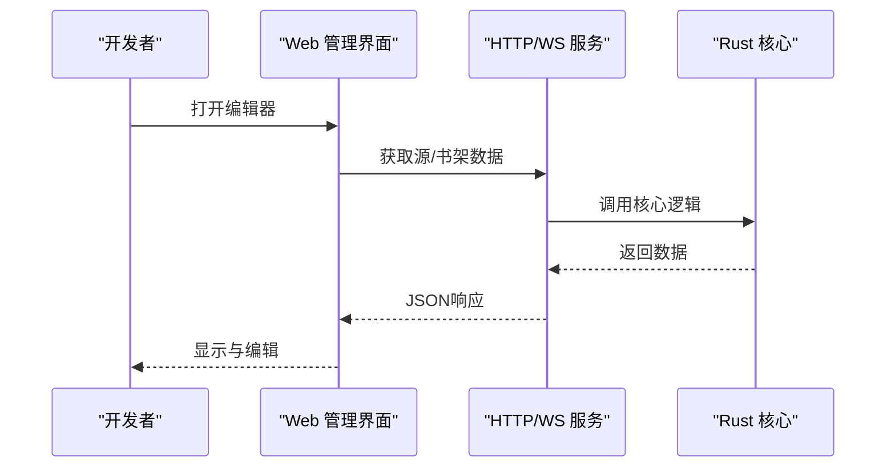
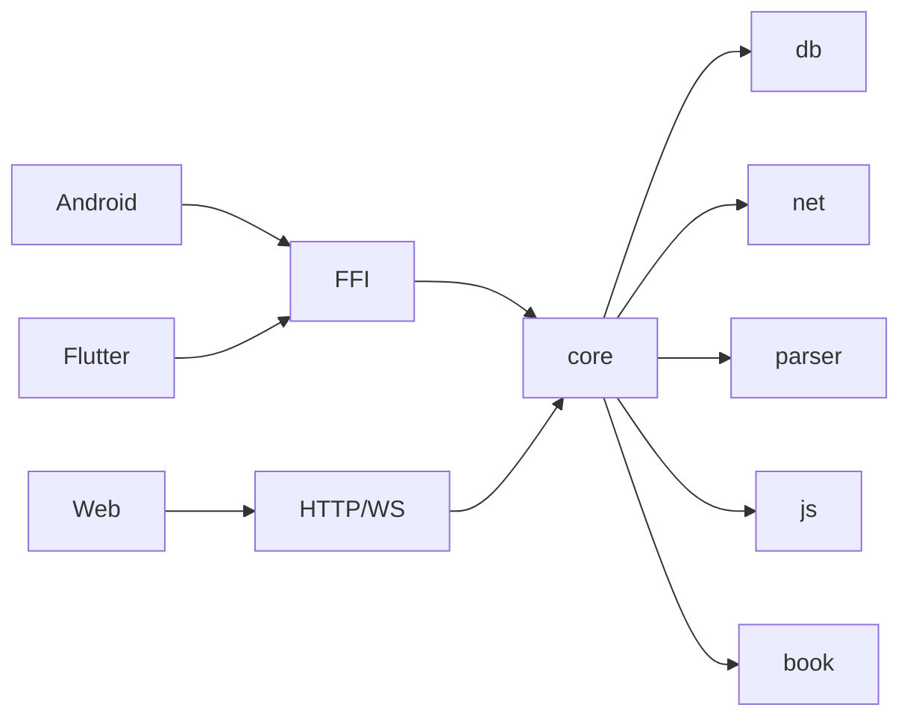

# 项目概述

<cite>
**本文档引用的文件**   
- [README.md](file://README.md)
- [app/src/main/java/io/legado/app/App.kt](file://app/src/main/java/io/legado/app/App.kt)
- [app/build.gradle](file://app/build.gradle)
- [flutter_legado/pubspec.yaml](file://flutter_legado/pubspec.yaml)
- [flutter_legado/lib/main.dart](file://flutter_legado/lib/main.dart)
- [modules/web/package.json](file://modules/web/package.json)
- [modules/web/src/main.ts](file://modules/web/src/main.ts)
- [rust/Cargo.toml](file://rust/Cargo.toml)
- [rust/legado-core/src/lib.rs](file://rust/legado-core/src/lib.rs)
- [rust/legado-db/src/lib.rs](file://rust/legado-db/src/lib.rs)
- [rust/legado-net/src/lib.rs](file://rust/legado-net/src/lib.rs)
- [rust/legado-parser/src/lib.rs](file://rust/legado-parser/src/lib.rs)
- [rust/legado-js/src/lib.rs](file://rust/legado-js/src/lib.rs)
- [rust/legado-book/src/lib.rs](file://rust/legado-book/src/lib.rs)
- [rust/legado-server/src/lib.rs](file://rust/legado-server/src/lib.rs)
- [rust/legado-ffi/src/lib.rs](file://rust/legado-ffi/src/lib.rs)
- [Makefile](file://Makefile)
</cite>

## 更新摘要
**所做更改**   
- 基于README.md恢复完整内容（268行）的变更，包含适当的项目描述、目录结构和使用说明
- 页面计数从40页更新为39页，移除了推荐算法页面
- 更新了文档结构以反映项目的实际组织方式
- 保持了核心内容和技术栈描述的完整性

## 目录
1. [简介](#简介)
2. [项目结构](#项目结构)
3. [核心组件](#核心组件)
4. [架构总览](#架构总览)
5. [详细组件分析](#详细组件分析)
6. [依赖关系分析](#依赖关系分析)
7. [性能考量](#性能考量)
8. [故障排查指南](#故障排查指南)
9. [结论](#结论)
10. [附录：快速开始](#附录快速开始)

## 简介
Legado（阅读）是一个开源的全栈阅读应用，支持多格式电子书阅读、网络源解析与扩展、跨平台同步与管理。其技术栈覆盖Android原生应用、Flutter跨平台UI、Rust高性能核心库以及Web管理界面，形成"端-核-管"一体化方案。项目采用模块化设计，围绕书籍处理系统、网络源引擎、数据库管理与音频播放等核心能力构建，兼顾易用性与可扩展性。

本概述面向初学者与有经验的开发者：前者可快速理解目标与使用方式，后者可获得架构与技术细节以便二次开发与集成。

## 项目结构
仓库采用多模块、多语言协同的组织方式：
- app：Android原生应用，包含UI、服务、数据层与资源
- flutter_legado：Flutter跨平台应用，提供统一的跨端体验
- modules/web：Vue.js Web管理界面，用于规则编辑、书架管理等
- rust：Rust核心库集合，涵盖网络、解析、数据库、FFI桥接、服务器等
- gradle与构建脚本：统一构建与发布流程

图表来源
- [app/build.gradle](file://app/build.gradle)
- [flutter_legado/pubspec.yaml](file://flutter_legado/pubspec.yaml)
- [modules/web/package.json](file://modules/web/package.json)
- [rust/Cargo.toml](file://rust/Cargo.toml)

章节来源
- [README.md](file://README.md)
- [app/build.gradle](file://app/build.gradle)
- [flutter_legado/pubspec.yaml](file://flutter_legado/pubspec.yaml)
- [modules/web/package.json](file://modules/web/package.json)
- [rust/Cargo.toml](file://rust/Cargo.toml)

## 核心组件
- Android应用（app）
  - 入口与初始化：App类负责应用启动、依赖注入与服务注册
  - UI与交互：基于Kotlin/Android框架的页面与组件
  - 本地数据：Room/SQLite数据库迁移与DAO
  - 服务层：下载、缓存、音频播放、网络任务调度
- Flutter应用（flutter_legado）
  - 跨平台UI：Dart/Flutter实现一致的阅读与管理体验
  - 状态管理：Provider/GetX等（以实际配置为准）
  - 与Rust桥接：通过FFI调用核心库能力
- Rust核心库（rust）
  - legado-core：业务编排、规则匹配、内容处理、阅读状态等
  - legado-db：数据持久化、迁移、仓储模式
  - legado-net：HTTP客户端、Cookie、代理、重试、限速、SSL配置
  - legado-parser：XPath/JSONPath/正则规则分析与执行
  - legado-js：Rhino/QuickJS引擎封装与沙箱隔离
  - legado-book：EPUB/TXT/MOBI/PDF/UMD等多格式解析与导出
  - legado-server：内嵌HTTP服务，供Web端与外部工具调用
  - legado-ffi：对外暴露C/FFI接口，供Android/Flutter调用
- Web管理界面（modules/web）
  - Vue.js + Vite构建，提供源编辑、调试、书架管理等功能
  - 通过API与后端服务通信

章节来源
- [app/src/main/java/io/legado/app/App.kt](file://app/src/main/java/io/legado/app/App.kt)
- [flutter_legado/lib/main.dart](file://flutter_legado/lib/main.dart)
- [rust/legado-core/src/lib.rs](file://rust/legado-core/src/lib.rs)
- [rust/legado-db/src/lib.rs](file://rust/legado-db/src/lib.rs)
- [rust/legado-net/src/lib.rs](file://rust/legado-net/src/lib.rs)
- [rust/legado-parser/src/lib.rs](file://rust/legado-parser/src/lib.rs)
- [rust/legado-js/src/lib.rs](file://rust/legado-js/src/lib.rs)
- [rust/legado-book/src/lib.rs](file://rust/legado-book/src/lib.rs)
- [rust/legado-server/src/lib.rs](file://rust/legado-server/src/lib.rs)
- [rust/legado-ffi/src/lib.rs](file://rust/legado-ffi/src/lib.rs)
- [modules/web/src/main.ts](file://modules/web/src/main.ts)

## 架构总览
Legado采用"前端多端 + Rust核心 + Web管理"的分层架构：
- 表现层：Android与Flutter双端UI，Web管理界面
- 核心层：Rust库提供高性能计算、规则解析、网络IO、持久化
- 服务层：内嵌HTTP服务与WebSocket，支撑Web端与远程协作
- 桥接层：FFI将Rust能力暴露给Android/Flutter

图表来源
- [rust/legado-ffi/src/lib.rs](file://rust/legado-ffi/src/lib.rs)
- [rust/legado-core/src/lib.rs](file://rust/legado-core/src/lib.rs)
- [rust/legado-server/src/lib.rs](file://rust/legado-server/src/lib.rs)

## 详细组件分析

### Android应用（app）
- 职责
  - 应用生命周期管理、依赖注入、服务注册
  - UI渲染、用户交互、本地存储与缓存
  - 与Rust核心通过FFI或SDK进行能力调用
- 关键路径
  - 应用入口与初始化：App.kt
  - 构建与依赖：build.gradle
- 典型流程
  - 启动时加载配置与默认数据
  - 初始化数据库与迁移
  - 启动后台服务（下载、音频、定时任务）
  - 通过FFI调用Rust核心完成网络与解析

图表来源
- [app/src/main/java/io/legado/app/App.kt](file://app/src/main/java/io/legado/app/App.kt)
- [rust/legado-ffi/src/lib.rs](file://rust/legado-ffi/src/lib.rs)
- [rust/legado-server/src/lib.rs](file://rust/legado-server/src/lib.rs)

章节来源
- [app/src/main/java/io/legado/app/App.kt](file://app/src/main/java/io/legado/app/App.kt)
- [app/build.gradle](file://app/build.gradle)

### Flutter应用（flutter_legado）
- 职责
  - 跨平台UI与交互，复用核心逻辑
  - 通过FFI调用Rust核心，保证一致体验
- 关键路径
  - 应用入口：main.dart
  - 依赖声明：pubspec.yaml
- 典型流程
  - 初始化主题与路由
  - 通过FFI调用Rust核心获取数据
  - 渲染阅读界面与管理面板

图表来源
- [flutter_legado/lib/main.dart](file://flutter_legado/lib/main.dart)
- [flutter_legado/pubspec.yaml](file://flutter_legado/pubspec.yaml)
- [rust/legado-ffi/src/lib.rs](file://rust/legado-ffi/src/lib.rs)

章节来源
- [flutter_legado/lib/main.dart](file://flutter_legado/lib/main.dart)
- [flutter_legado/pubspec.yaml](file://flutter_legado/pubspec.yaml)

### Rust核心库（rust）
- 模块职责
  - legado-core：业务编排、规则匹配、内容处理、阅读状态、自动任务等
  - legado-db：数据模型、迁移、仓储接口与实现
  - legado-net：HTTP客户端、Cookie、代理、重试、限速、SSL配置
  - legado-parser：XPath/JSONPath/正则规则分析与执行
  - legado-js：JS引擎封装、沙箱隔离、宿主API
  - legado-book：多格式书籍解析与导出
  - legado-server：HTTP/WS服务，提供API与静态资源
  - legado-ffi：对外暴露C/FFI接口，供Android/Flutter调用
- 关键路径
  - 根Cargo配置：Cargo.toml
  - 各模块lib入口：对应lib.rs

图表来源
- [rust/Cargo.toml](file://rust/Cargo.toml)
- [rust/legado-core/src/lib.rs](file://rust/legado-core/src/lib.rs)
- [rust/legado-db/src/lib.rs](file://rust/legado-db/src/lib.rs)
- [rust/legado-net/src/lib.rs](file://rust/legado-net/src/lib.rs)
- [rust/legado-parser/src/lib.rs](file://rust/legado-parser/src/lib.rs)
- [rust/legado-js/src/lib.rs](file://rust/legado-js/src/lib.rs)
- [rust/legado-book/src/lib.rs](file://rust/legado-book/src/lib.rs)
- [rust/legado-server/src/lib.rs](file://rust/legado-server/src/lib.rs)
- [rust/legado-ffi/src/lib.rs](file://rust/legado-ffi/src/lib.rs)

章节来源
- [rust/Cargo.toml](file://rust/Cargo.toml)
- [rust/legado-core/src/lib.rs](file://rust/legado-core/src/lib.rs)
- [rust/legado-db/src/lib.rs](file://rust/legado-db/src/lib.rs)
- [rust/legado-net/src/lib.rs](file://rust/legado-net/src/lib.rs)
- [rust/legado-parser/src/lib.rs](file://rust/legado-parser/src/lib.rs)
- [rust/legado-js/src/lib.rs](file://rust/legado-js/src/lib.rs)
- [rust/legado-book/src/lib.rs](file://rust/legado-book/src/lib.rs)
- [rust/legado-server/src/lib.rs](file://rust/legado-server/src/lib.rs)
- [rust/legado-ffi/src/lib.rs](file://rust/legado-ffi/src/lib.rs)

### Web管理界面（modules/web）
- 职责
  - 源编辑、调试、书架管理、设置与同步
  - 通过API与后端服务通信
- 关键路径
  - 包配置：package.json
  - 入口：main.ts
- 典型流程
  - 初始化路由与状态
  - 发起API请求获取数据
  - 渲染编辑器与预览

图表来源
- [modules/web/package.json](file://modules/web/package.json)
- [modules/web/src/main.ts](file://modules/web/src/main.ts)
- [rust/legado-server/src/lib.rs](file://rust/legado-server/src/lib.rs)

章节来源
- [modules/web/package.json](file://modules/web/package.json)
- [modules/web/src/main.ts](file://modules/web/src/main.ts)

## 依赖关系分析
- Android与Flutter均依赖Rust核心，通过FFI桥接调用
- Web管理界面依赖Rust服务提供的HTTP/WS接口
- Rust内部模块间存在清晰的依赖方向：core作为中枢，db/net/parser/js/book为支撑，server对外暴露，ffi为边界

图表来源
- [rust/legado-ffi/src/lib.rs](file://rust/legado-ffi/src/lib.rs)
- [rust/legado-server/src/lib.rs](file://rust/legado-server/src/lib.rs)
- [rust/legado-core/src/lib.rs](file://rust/legado-core/src/lib.rs)

章节来源
- [rust/Cargo.toml](file://rust/Cargo.toml)
- [app/build.gradle](file://app/build.gradle)
- [flutter_legado/pubspec.yaml](file://flutter_legado/pubspec.yaml)
- [modules/web/package.json](file://modules/web/package.json)

## 性能考量
- Rust核心库在解析、网络IO、加密与并发方面具备高吞吐与低延迟优势
- 规则解析采用XPath/JSONPath/正则组合，避免全量DOM操作，提升解析效率
- 网络层支持代理、重试、限速与连接池，优化弱网环境稳定性
- 数据库层使用迁移与仓储模式，减少锁竞争与重复查询
- 音频播放与缓存策略降低CPU占用与内存峰值
- Web管理界面采用按需加载与懒渲染，提升交互流畅度

## 故障排查指南
- 常见问题定位
  - 网络异常：检查代理、SSL配置、重试与限速策略
  - 解析失败：校验XPath/JSONPath/正则规则语法与上下文
  - 数据库错误：核对迁移版本与表结构一致性
  - 音频卡顿：检查缓存队列与解码器兼容性
- 调试建议
  - 启用日志与调试接口，查看请求与响应
  - 使用Web管理界面的源调试功能验证规则
  - 通过FFI错误码与堆栈信息定位跨语言问题

章节来源
- [rust/legado-net/src/lib.rs](file://rust/legado-net/src/lib.rs)
- [rust/legado-parser/src/lib.rs](file://rust/legado-parser/src/lib.rs)
- [rust/legado-db/src/lib.rs](file://rust/legado-db/src/lib.rs)
- [rust/legado-ffi/src/lib.rs](file://rust/legado-ffi/src/lib.rs)

## 结论
Legado以Rust为核心，结合Android/Flutter双端与Web管理界面，构建了可扩展、高性能、易用的阅读生态。模块化设计使书籍处理、网络源解析、数据库管理与音频播放等能力清晰解耦，便于迭代与扩展。对初学者而言，可从Web管理与基础阅读入手；对资深开发者，可通过FFI与核心库深度定制规则与功能。

## 附录：快速开始
- 环境准备
  - 安装JDK、Gradle、Android SDK（用于Android构建）
  - 安装Flutter与Dart（用于Flutter构建）
  - 安装Rust工具链与Cargo（用于核心库构建）
  - 安装Node.js与pnpm（用于Web管理界面构建）
- 依赖安装
  - Android：进入app目录，执行Gradle依赖同步
  - Flutter：进入flutter_legado目录，运行依赖获取命令
  - Rust：进入rust目录，执行Cargo依赖下载
  - Web：进入modules/web目录，执行pnpm安装
- 基本使用示例
  - 启动Android应用：使用IDE或命令行构建并运行
  - 启动Flutter应用：连接设备后运行
  - 启动Web管理界面：开发模式下运行Vite服务
  - 通过FFI调用核心能力：参考各端入口与桥接代码
- 构建与打包
  - 使用Makefile或Gradle/Fletter/Rust脚本进行统一构建

章节来源
- [Makefile](file://Makefile)
- [app/build.gradle](file://app/build.gradle)
- [flutter_legado/pubspec.yaml](file://flutter_legado/pubspec.yaml)
- [rust/Cargo.toml](file://rust/Cargo.toml)
- [modules/web/package.json](file://modules/web/package.json)